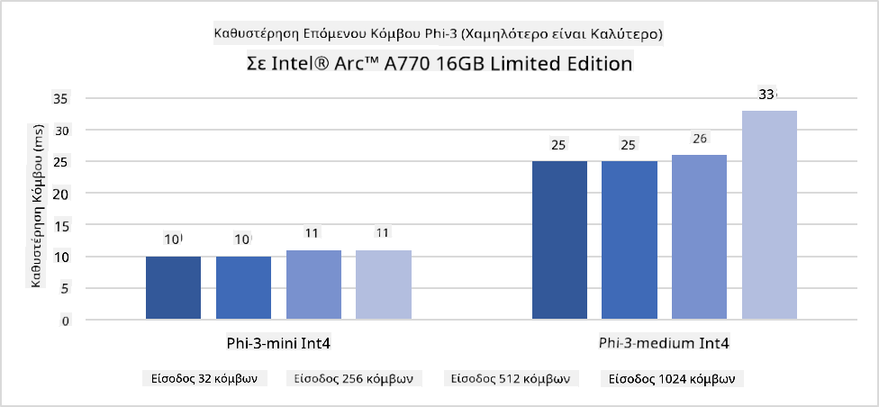
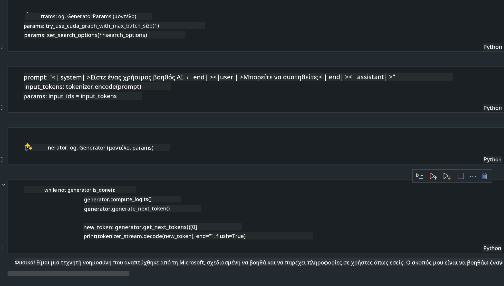

<!--
CO_OP_TRANSLATOR_METADATA:
{
  "original_hash": "e08ce816e23ad813244a09ca34ebb8ac",
  "translation_date": "2025-07-16T20:01:30+00:00",
  "source_file": "md/01.Introduction/03/AIPC_Inference.md",
  "language_code": "el"
}
-->
# **Inference Phi-3 σε AI PC**

Με την πρόοδο της γενετικής τεχνητής νοημοσύνης και τη βελτίωση των δυνατοτήτων υλικού στις συσκευές άκρου, όλο και περισσότερα μοντέλα γενετικής AI μπορούν πλέον να ενσωματωθούν στις συσκευές Bring Your Own Device (BYOD) των χρηστών. Τα AI PC είναι ανάμεσα σε αυτά τα μοντέλα. Από το 2024, η Intel, η AMD και η Qualcomm συνεργάστηκαν με κατασκευαστές υπολογιστών για να παρουσιάσουν AI PC που διευκολύνουν την ανάπτυξη τοπικών μοντέλων γενετικής AI μέσω τροποποιήσεων υλικού. Σε αυτή τη συζήτηση, θα εστιάσουμε στα Intel AI PC και θα εξερευνήσουμε πώς να αναπτύξουμε το Phi-3 σε ένα Intel AI PC.

### Τι είναι το NPU

Ένα NPU (Neural Processing Unit) είναι ένας αφιερωμένος επεξεργαστής ή μονάδα επεξεργασίας σε ένα μεγαλύτερο SoC, σχεδιασμένος ειδικά για την επιτάχυνση των λειτουργιών νευρωνικών δικτύων και εργασιών AI. Σε αντίθεση με τους γενικής χρήσης CPU και GPU, τα NPU είναι βελτιστοποιημένα για παράλληλο υπολογισμό βασισμένο σε δεδομένα, καθιστώντας τα ιδιαίτερα αποδοτικά στην επεξεργασία τεράστιων πολυμεσικών δεδομένων όπως βίντεο και εικόνες, καθώς και στην επεξεργασία δεδομένων για νευρωνικά δίκτυα. Είναι ιδιαίτερα ικανά στην αντιμετώπιση εργασιών σχετικών με AI, όπως αναγνώριση ομιλίας, θόλωση φόντου σε βιντεοκλήσεις και διαδικασίες επεξεργασίας φωτογραφιών ή βίντεο όπως η ανίχνευση αντικειμένων.

## NPU vs GPU

Ενώ πολλές εργασίες AI και μηχανικής μάθησης εκτελούνται σε GPUs, υπάρχει μια σημαντική διαφορά μεταξύ GPUs και NPUs.  
Οι GPUs είναι γνωστές για τις δυνατότητες παράλληλου υπολογισμού, αλλά δεν είναι όλες οι GPUs εξίσου αποδοτικές πέρα από την επεξεργασία γραφικών. Τα NPUs, από την άλλη, είναι ειδικά σχεδιασμένα για πολύπλοκους υπολογισμούς που εμπλέκονται στις λειτουργίες νευρωνικών δικτύων, καθιστώντας τα ιδιαίτερα αποτελεσματικά για εργασίες AI.

Συνοπτικά, τα NPUs είναι οι μαθηματικοί «μάγοι» που επιταχύνουν τους υπολογισμούς AI και παίζουν καθοριστικό ρόλο στην αναδυόμενη εποχή των AI PC!

***Αυτό το παράδειγμα βασίζεται στον τελευταίο επεξεργαστή Intel Core Ultra της Intel***

## **1. Χρήση NPU για την εκτέλεση του μοντέλου Phi-3**

Η συσκευή Intel® NPU είναι ένας επιταχυντής AI inference ενσωματωμένος με τους Intel client CPUs, ξεκινώντας από τη γενιά Intel® Core™ Ultra (πρώην γνωστή ως Meteor Lake). Επιτρέπει την ενεργειακά αποδοτική εκτέλεση εργασιών τεχνητών νευρωνικών δικτύων.




**Intel NPU Acceleration Library**

Η Intel NPU Acceleration Library [https://github.com/intel/intel-npu-acceleration-library](https://github.com/intel/intel-npu-acceleration-library) είναι μια βιβλιοθήκη Python σχεδιασμένη να αυξήσει την αποδοτικότητα των εφαρμογών σας αξιοποιώντας τη δύναμη της Intel Neural Processing Unit (NPU) για την εκτέλεση ταχύτατων υπολογισμών σε συμβατό υλικό.

Παράδειγμα Phi-3-mini σε AI PC με επεξεργαστές Intel® Core™ Ultra.


Εγκατάσταση της βιβλιοθήκης Python με pip

```bash

   pip install intel-npu-acceleration-library

```

***Σημείωση*** Το έργο βρίσκεται ακόμα σε ανάπτυξη, αλλά το αναφορικό μοντέλο είναι ήδη πολύ ολοκληρωμένο.

### **Εκτέλεση Phi-3 με την Intel NPU Acceleration Library**

Χρησιμοποιώντας την επιτάχυνση Intel NPU, αυτή η βιβλιοθήκη δεν επηρεάζει την παραδοσιακή διαδικασία κωδικοποίησης. Απλά χρειάζεται να χρησιμοποιήσετε αυτή τη βιβλιοθήκη για να ποσοτικοποιήσετε το αρχικό μοντέλο Phi-3, όπως FP16, INT8, INT4, όπως

```python
from transformers import AutoTokenizer, pipeline,TextStreamer
from intel_npu_acceleration_library import NPUModelForCausalLM, int4
from intel_npu_acceleration_library.compiler import CompilerConfig
import warnings

model_id = "microsoft/Phi-3-mini-4k-instruct"

compiler_conf = CompilerConfig(dtype=int4)
model = NPUModelForCausalLM.from_pretrained(
    model_id, use_cache=True, config=compiler_conf, attn_implementation="sdpa"
).eval()

tokenizer = AutoTokenizer.from_pretrained(model_id)

text_streamer = TextStreamer(tokenizer, skip_prompt=True)
```

Μετά την επιτυχή ποσοτικοποίηση, συνεχίστε την εκτέλεση καλώντας το NPU για να τρέξει το μοντέλο Phi-3.

```python
generation_args = {
   "max_new_tokens": 1024,
   "return_full_text": False,
   "temperature": 0.3,
   "do_sample": False,
   "streamer": text_streamer,
}

pipe = pipeline(
   "text-generation",
   model=model,
   tokenizer=tokenizer,
)

query = "<|system|>You are a helpful AI assistant.<|end|><|user|>Can you introduce yourself?<|end|><|assistant|>"

with warnings.catch_warnings():
    warnings.simplefilter("ignore")
    pipe(query, **generation_args)
```

Κατά την εκτέλεση του κώδικα, μπορούμε να δούμε την κατάσταση λειτουργίας του NPU μέσω του Task Manager


***Δείγματα*** : [AIPC_NPU_DEMO.ipynb](../../../../../code/03.Inference/AIPC/AIPC_NPU_DEMO.ipynb)

## **2. Χρήση DirectML + ONNX Runtime για την εκτέλεση του μοντέλου Phi-3**

### **Τι είναι το DirectML**

[DirectML](https://github.com/microsoft/DirectML) είναι μια υψηλής απόδοσης, επιταχυνόμενη από υλικό βιβλιοθήκη DirectX 12 για μηχανική μάθηση. Το DirectML παρέχει επιτάχυνση GPU για κοινές εργασίες μηχανικής μάθησης σε ευρύ φάσμα υποστηριζόμενου υλικού και οδηγών, συμπεριλαμβανομένων όλων των GPUs με υποστήριξη DirectX 12 από κατασκευαστές όπως AMD, Intel, NVIDIA και Qualcomm.

Όταν χρησιμοποιείται ανεξάρτητα, το API του DirectML είναι μια βιβλιοθήκη χαμηλού επιπέδου DirectX 12 και είναι κατάλληλη για εφαρμογές υψηλής απόδοσης και χαμηλής καθυστέρησης, όπως πλαίσια εργασίας, παιχνίδια και άλλες εφαρμογές σε πραγματικό χρόνο. Η απρόσκοπτη διαλειτουργικότητα του DirectML με το Direct3D 12, καθώς και το χαμηλό του overhead και η συμμόρφωση σε διαφορετικό υλικό, καθιστούν το DirectML ιδανικό για την επιτάχυνση της μηχανικής μάθησης όταν απαιτείται τόσο υψηλή απόδοση όσο και αξιοπιστία και προβλεψιμότητα αποτελεσμάτων σε διαφορετικό υλικό.

***Σημείωση*** : Το τελευταίο DirectML υποστηρίζει ήδη NPU (https://devblogs.microsoft.com/directx/introducing-neural-processor-unit-npu-support-in-directml-developer-preview/)

### DirectML και CUDA όσον αφορά τις δυνατότητες και την απόδοσή τους:

**DirectML** είναι μια βιβλιοθήκη μηχανικής μάθησης που αναπτύχθηκε από τη Microsoft. Σχεδιάστηκε για να επιταχύνει εργασίες μηχανικής μάθησης σε συσκευές Windows, όπως επιτραπέζιους υπολογιστές, φορητούς και συσκευές άκρου.  
- Βασισμένο σε DX12: Το DirectML βασίζεται στο DirectX 12 (DX12), που παρέχει ευρεία υποστήριξη υλικού σε GPUs, συμπεριλαμβανομένων NVIDIA και AMD.  
- Ευρύτερη Υποστήριξη: Επειδή αξιοποιεί το DX12, το DirectML μπορεί να λειτουργήσει με οποιαδήποτε GPU που υποστηρίζει DX12, ακόμα και ενσωματωμένες GPUs.  
- Επεξεργασία Εικόνας: Το DirectML επεξεργάζεται εικόνες και άλλα δεδομένα χρησιμοποιώντας νευρωνικά δίκτυα, καθιστώντας το κατάλληλο για εργασίες όπως αναγνώριση εικόνας, ανίχνευση αντικειμένων και άλλα.  
- Εύκολη Ρύθμιση: Η ρύθμιση του DirectML είναι απλή και δεν απαιτεί συγκεκριμένα SDK ή βιβλιοθήκες από κατασκευαστές GPU.  
- Απόδοση: Σε ορισμένες περιπτώσεις, το DirectML αποδίδει καλά και μπορεί να είναι ταχύτερο από το CUDA, ειδικά για ορισμένα φορτία εργασίας.  
- Περιορισμοί: Ωστόσο, υπάρχουν περιπτώσεις όπου το DirectML μπορεί να είναι πιο αργό, ιδιαίτερα για μεγάλες παρτίδες float16.

**CUDA** είναι η παράλληλη πλατφόρμα υπολογισμού και το μοντέλο προγραμματισμού της NVIDIA. Επιτρέπει στους προγραμματιστές να αξιοποιήσουν τη δύναμη των GPUs της NVIDIA για γενικού σκοπού υπολογισμούς, συμπεριλαμβανομένης της μηχανικής μάθησης και επιστημονικών προσομοιώσεων.  
- Ειδικό για NVIDIA: Το CUDA είναι στενά ενσωματωμένο με τις GPUs της NVIDIA και σχεδιάστηκε ειδικά γι’ αυτές.  
- Υψηλή Βελτιστοποίηση: Παρέχει εξαιρετική απόδοση για εργασίες επιταχυνόμενες από GPU, ειδικά με GPUs της NVIDIA.  
- Ευρεία Χρήση: Πολλά πλαίσια και βιβλιοθήκες μηχανικής μάθησης (όπως TensorFlow και PyTorch) υποστηρίζουν CUDA.  
- Παραμετροποίηση: Οι προγραμματιστές μπορούν να ρυθμίσουν το CUDA για συγκεκριμένες εργασίες, οδηγώντας σε βέλτιστη απόδοση.  
- Περιορισμοί: Ωστόσο, η εξάρτηση του CUDA από το υλικό NVIDIA μπορεί να περιορίσει τη συμβατότητα με άλλες GPUs.

### Επιλογή μεταξύ DirectML και CUDA

Η επιλογή μεταξύ DirectML και CUDA εξαρτάται από τη συγκεκριμένη χρήση, τη διαθεσιμότητα υλικού και τις προτιμήσεις σας.  
Αν αναζητάτε ευρύτερη συμβατότητα και εύκολη ρύθμιση, το DirectML μπορεί να είναι καλή επιλογή. Ωστόσο, αν διαθέτετε GPUs NVIDIA και χρειάζεστε υψηλά βελτιστοποιημένη απόδοση, το CUDA παραμένει ισχυρός υποψήφιος. Συνοπτικά, και τα δύο έχουν τα πλεονεκτήματα και τα μειονεκτήματά τους, οπότε λάβετε υπόψη τις ανάγκες και το διαθέσιμο υλικό πριν αποφασίσετε.

### **Γενετική AI με ONNX Runtime**

Στην εποχή της AI, η φορητότητα των μοντέλων AI είναι πολύ σημαντική. Το ONNX Runtime μπορεί εύκολα να αναπτύξει εκπαιδευμένα μοντέλα σε διαφορετικές συσκευές. Οι προγραμματιστές δεν χρειάζεται να ασχολούνται με το πλαίσιο inference και χρησιμοποιούν ένα ενιαίο API για να ολοκληρώσουν το inference του μοντέλου. Στην εποχή της γενετικής AI, το ONNX Runtime έχει επίσης πραγματοποιήσει βελτιστοποίηση κώδικα (https://onnxruntime.ai/docs/genai/). Μέσω του βελτιστοποιημένου ONNX Runtime, το ποσοτικοποιημένο γενετικό μοντέλο AI μπορεί να εκτελεστεί σε διαφορετικά τερματικά. Στο Generative AI με ONNX Runtime, μπορείτε να κάνετε inference μοντέλων AI μέσω Python, C#, C / C++. Φυσικά, η ανάπτυξη σε iPhone μπορεί να εκμεταλλευτεί το Generative AI με το ONNX Runtime API σε C++.

[Παράδειγμα Κώδικα](https://github.com/Azure-Samples/Phi-3MiniSamples/tree/main/onnx)

***Συγκεντρώστε τη βιβλιοθήκη generative AI με ONNX Runtime***

```bash

winget install --id=Kitware.CMake  -e

git clone https://github.com/microsoft/onnxruntime.git

cd .\onnxruntime\

./build.bat --build_shared_lib --skip_tests --parallel --use_dml --config Release

cd ../

git clone https://github.com/microsoft/onnxruntime-genai.git

cd .\onnxruntime-genai\

mkdir ort

cd ort

mkdir include

mkdir lib

copy ..\onnxruntime\include\onnxruntime\core\providers\dml\dml_provider_factory.h ort\include

copy ..\onnxruntime\include\onnxruntime\core\session\onnxruntime_c_api.h ort\include

copy ..\onnxruntime\build\Windows\Release\Release\*.dll ort\lib

copy ..\onnxruntime\build\Windows\Release\Release\onnxruntime.lib ort\lib

python build.py --use_dml


```

**Εγκατάσταση βιβλιοθήκης**

```bash

pip install .\onnxruntime_genai_directml-0.3.0.dev0-cp310-cp310-win_amd64.whl

```

Αυτό είναι το αποτέλεσμα εκτέλεσης



***Δείγματα*** : [AIPC_DirectML_DEMO.ipynb](../../../../../code/03.Inference/AIPC/AIPC_DirectML_DEMO.ipynb)

## **3. Χρήση Intel OpenVino για την εκτέλεση του μοντέλου Phi-3**

### **Τι είναι το OpenVINO**

[OpenVINO](https://github.com/openvinotoolkit/openvino) είναι ένα ανοιχτού κώδικα εργαλείο για τη βελτιστοποίηση και ανάπτυξη μοντέλων βαθιάς μάθησης. Παρέχει αυξημένη απόδοση για μοντέλα όρασης, ήχου και γλώσσας από δημοφιλή πλαίσια όπως TensorFlow, PyTorch και άλλα. Ξεκινήστε με το OpenVINO. Το OpenVINO μπορεί επίσης να χρησιμοποιηθεί σε συνδυασμό με CPU και GPU για την εκτέλεση του μοντέλου Phi-3.

***Σημείωση***: Προς το παρόν, το OpenVINO δεν υποστηρίζει NPU.

### **Εγκατάσταση της βιβλιοθήκης OpenVINO**

```bash

 pip install git+https://github.com/huggingface/optimum-intel.git

 pip install git+https://github.com/openvinotoolkit/nncf.git

 pip install openvino-nightly

```

### **Εκτέλεση Phi-3 με OpenVINO**

Όπως και το NPU, το OpenVINO ολοκληρώνει την κλήση των μοντέλων γενετικής AI εκτελώντας ποσοτικοποιημένα μοντέλα. Πρέπει πρώτα να ποσοτικοποιήσουμε το μοντέλο Phi-3 και να ολοκληρώσουμε την ποσοτικοποίηση μέσω της γραμμής εντολών με το optimum-cli

**INT4**

```bash

optimum-cli export openvino --model "microsoft/Phi-3-mini-4k-instruct" --task text-generation-with-past --weight-format int4 --group-size 128 --ratio 0.6  --sym  --trust-remote-code ./openvinomodel/phi3/int4

```

**FP16**

```bash

optimum-cli export openvino --model "microsoft/Phi-3-mini-4k-instruct" --task text-generation-with-past --weight-format fp16 --trust-remote-code ./openvinomodel/phi3/fp16

```

το μετατρεπόμενο φορμάτ, όπως αυτό


Φορτώστε τις διαδρομές μοντέλου (model_dir), τις σχετικές ρυθμίσεις (ov_config = {"PERFORMANCE_HINT": "LATENCY", "NUM_STREAMS": "1", "CACHE_DIR": ""}) και τις συσκευές επιτάχυνσης υλικού (GPU.0) μέσω OVModelForCausalLM

```python

ov_model = OVModelForCausalLM.from_pretrained(
     model_dir,
     device='GPU.0',
     ov_config=ov_config,
     config=AutoConfig.from_pretrained(model_dir, trust_remote_code=True),
     trust_remote_code=True,
)

```

Κατά την εκτέλεση του κώδικα, μπορούμε να δούμε την κατάσταση λειτουργίας της GPU μέσω του Task Manager


***Δείγματα*** : [AIPC_OpenVino_Demo.ipynb](../../../../../code/03.Inference/AIPC/AIPC_OpenVino_Demo.ipynb)

### ***Σημείωση*** : Οι παραπάνω τρεις μέθοδοι έχουν η καθεμία τα δικά τους πλεονεκτήματα, αλλά συνιστάται η χρήση επιτάχυνσης NPU για το inference σε AI PC.

**Αποποίηση ευθυνών**:  
Αυτό το έγγραφο έχει μεταφραστεί χρησιμοποιώντας την υπηρεσία αυτόματης μετάφρασης AI [Co-op Translator](https://github.com/Azure/co-op-translator). Παρόλο που επιδιώκουμε την ακρίβεια, παρακαλούμε να έχετε υπόψη ότι οι αυτόματες μεταφράσεις ενδέχεται να περιέχουν λάθη ή ανακρίβειες. Το πρωτότυπο έγγραφο στη γλώσσα του θεωρείται η αυθεντική πηγή. Για κρίσιμες πληροφορίες, συνιστάται επαγγελματική ανθρώπινη μετάφραση. Δεν φέρουμε ευθύνη για τυχόν παρεξηγήσεις ή λανθασμένες ερμηνείες που προκύπτουν από τη χρήση αυτής της μετάφρασης.