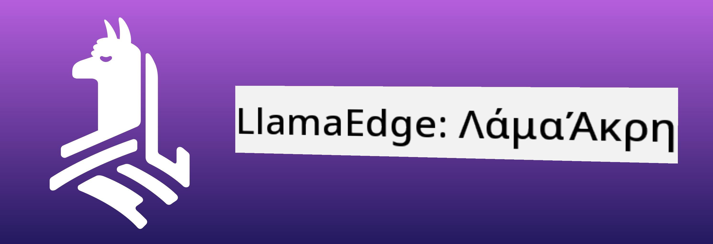

<!--
CO_OP_TRANSLATOR_METADATA:
{
  "original_hash": "be4101a30d98e95a71d42c276e8bcd37",
  "translation_date": "2025-07-16T20:42:29+00:00",
  "source_file": "md/01.Introduction/03/Jetson_Inference.md",
  "language_code": "el"
}
-->
# **Inference Phi-3 στο Nvidia Jetson**

Το Nvidia Jetson είναι μια σειρά ενσωματωμένων υπολογιστικών πλακετών από την Nvidia. Τα μοντέλα Jetson TK1, TX1 και TX2 διαθέτουν επεξεργαστή Tegra (ή SoC) από την Nvidia που ενσωματώνει μια κεντρική μονάδα επεξεργασίας (CPU) με αρχιτεκτονική ARM. Το Jetson είναι ένα σύστημα χαμηλής κατανάλωσης ενέργειας και έχει σχεδιαστεί για την επιτάχυνση εφαρμογών μηχανικής μάθησης. Το Nvidia Jetson χρησιμοποιείται από επαγγελματίες προγραμματιστές για τη δημιουργία καινοτόμων προϊόντων AI σε όλους τους κλάδους, καθώς και από φοιτητές και λάτρεις για πρακτική εκμάθηση AI και την υλοποίηση εντυπωσιακών έργων. Το SLM αναπτύσσεται σε edge συσκευές όπως το Jetson, επιτρέποντας καλύτερη υλοποίηση βιομηχανικών σεναρίων εφαρμογών γενετικής AI.

## Ανάπτυξη στο NVIDIA Jetson:
Οι προγραμματιστές που εργάζονται σε αυτόνομα ρομπότ και ενσωματωμένες συσκευές μπορούν να αξιοποιήσουν το Phi-3 Mini. Το σχετικά μικρό μέγεθος του Phi-3 το καθιστά ιδανικό για ανάπτυξη στο edge. Οι παράμετροι έχουν ρυθμιστεί με μεγάλη προσοχή κατά την εκπαίδευση, εξασφαλίζοντας υψηλή ακρίβεια στις απαντήσεις.

### Βελτιστοποίηση TensorRT-LLM:
Η βιβλιοθήκη [TensorRT-LLM της NVIDIA](https://github.com/NVIDIA/TensorRT-LLM?WT.mc_id=aiml-138114-kinfeylo) βελτιστοποιεί την εκτέλεση μεγάλων γλωσσικών μοντέλων. Υποστηρίζει το μεγάλο παράθυρο συμφραζομένων του Phi-3 Mini, βελτιώνοντας τόσο τη ροή δεδομένων όσο και την καθυστέρηση. Οι βελτιστοποιήσεις περιλαμβάνουν τεχνικές όπως LongRoPE, FP8 και inflight batching.

### Διαθεσιμότητα και Ανάπτυξη:
Οι προγραμματιστές μπορούν να εξερευνήσουν το Phi-3 Mini με παράθυρο συμφραζομένων 128K στο [NVIDIA AI](https://www.nvidia.com/en-us/ai-data-science/generative-ai/). Πακέτο είναι διαθέσιμο ως NVIDIA NIM, μια μικροϋπηρεσία με τυπικό API που μπορεί να αναπτυχθεί οπουδήποτε. Επιπλέον, οι [υλοποιήσεις TensorRT-LLM στο GitHub](https://github.com/NVIDIA/TensorRT-LLM).

## **1. Προετοιμασία**

a. Jetson Orin NX / Jetson NX

b. JetPack 5.1.2+

c. Cuda 11.8

d. Python 3.8+

## **2. Εκτέλεση του Phi-3 στο Jetson**

Μπορούμε να επιλέξουμε [Ollama](https://ollama.com) ή [LlamaEdge](https://llamaedge.com)

Αν θέλετε να χρησιμοποιήσετε gguf ταυτόχρονα σε cloud και edge συσκευές, το LlamaEdge μπορεί να θεωρηθεί ως WasmEdge (το WasmEdge είναι ένα ελαφρύ, υψηλής απόδοσης, κλιμακούμενο runtime WebAssembly κατάλληλο για cloud native, edge και αποκεντρωμένες εφαρμογές. Υποστηρίζει serverless εφαρμογές, ενσωματωμένες λειτουργίες, μικροϋπηρεσίες, έξυπνα συμβόλαια και συσκευές IoT). Μπορείτε να αναπτύξετε το ποσοτικό μοντέλο gguf σε edge συσκευές και στο cloud μέσω του LlamaEdge.



Ακολουθούν τα βήματα για χρήση

1. Εγκαταστήστε και κατεβάστε τις σχετικές βιβλιοθήκες και αρχεία

```bash

curl -sSf https://raw.githubusercontent.com/WasmEdge/WasmEdge/master/utils/install.sh | bash -s -- --plugin wasi_nn-ggml

curl -LO https://github.com/LlamaEdge/LlamaEdge/releases/latest/download/llama-api-server.wasm

curl -LO https://github.com/LlamaEdge/chatbot-ui/releases/latest/download/chatbot-ui.tar.gz

tar xzf chatbot-ui.tar.gz

```

**Σημείωση**: τα αρχεία llama-api-server.wasm και chatbot-ui πρέπει να βρίσκονται στον ίδιο φάκελο

2. Εκτελέστε τα σκριπτ στο τερματικό

```bash

wasmedge --dir .:. --nn-preload default:GGML:AUTO:{Your gguf path} llama-api-server.wasm -p phi-3-chat

```

Αυτό είναι το αποτέλεσμα εκτέλεσης


***Παραδειγματικός κώδικας*** [Phi-3 mini WASM Notebook Sample](https://github.com/Azure-Samples/Phi-3MiniSamples/tree/main/wasm)

Συνοψίζοντας, το Phi-3 Mini αποτελεί ένα σημαντικό βήμα προόδου στα γλωσσικά μοντέλα, συνδυάζοντας αποδοτικότητα, επίγνωση συμφραζομένων και την τεχνογνωσία βελτιστοποίησης της NVIDIA. Είτε κατασκευάζετε ρομπότ είτε εφαρμογές edge, το Phi-3 Mini είναι ένα ισχυρό εργαλείο που αξίζει να γνωρίζετε.

**Αποποίηση ευθυνών**:  
Αυτό το έγγραφο έχει μεταφραστεί χρησιμοποιώντας την υπηρεσία αυτόματης μετάφρασης AI [Co-op Translator](https://github.com/Azure/co-op-translator). Παρόλο που επιδιώκουμε την ακρίβεια, παρακαλούμε να έχετε υπόψη ότι οι αυτόματες μεταφράσεις ενδέχεται να περιέχουν λάθη ή ανακρίβειες. Το πρωτότυπο έγγραφο στη γλώσσα του θεωρείται η αυθεντική πηγή. Για κρίσιμες πληροφορίες, συνιστάται επαγγελματική ανθρώπινη μετάφραση. Δεν φέρουμε ευθύνη για τυχόν παρεξηγήσεις ή λανθασμένες ερμηνείες που προκύπτουν από τη χρήση αυτής της μετάφρασης.