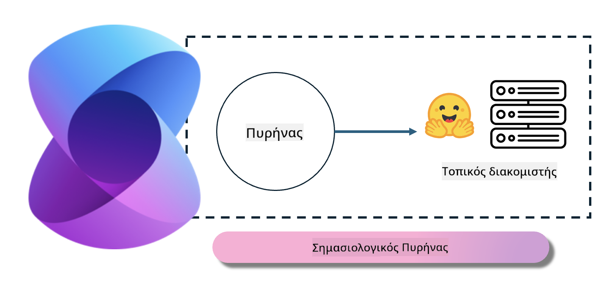
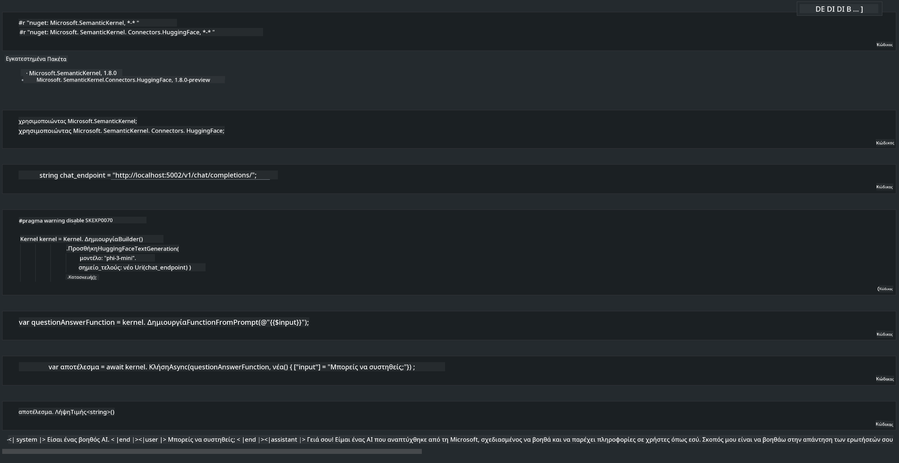

<!--
CO_OP_TRANSLATOR_METADATA:
{
  "original_hash": "bcf5dd7031db0031abdb9dd0c05ba118",
  "translation_date": "2025-05-09T12:04:31+00:00",
  "source_file": "md/01.Introduction/03/Local_Server_Inference.md",
  "language_code": "el"
}
-->
# **Εκτέλεση Inference Phi-3 σε Τοπικό Διακομιστή**

Μπορούμε να αναπτύξουμε το Phi-3 σε τοπικό διακομιστή. Οι χρήστες μπορούν να επιλέξουν τις λύσεις [Ollama](https://ollama.com) ή [LM Studio](https://llamaedge.com), ή να γράψουν τον δικό τους κώδικα. Μπορείτε να συνδέσετε τις τοπικές υπηρεσίες του Phi-3 μέσω [Semantic Kernel](https://github.com/microsoft/semantic-kernel?WT.mc_id=aiml-138114-kinfeylo) ή [Langchain](https://www.langchain.com/) για να δημιουργήσετε εφαρμογές Copilot.

## **Χρήση του Semantic Kernel για πρόσβαση στο Phi-3-mini**

Στην εφαρμογή Copilot, δημιουργούμε εφαρμογές μέσω Semantic Kernel / LangChain. Αυτό το είδος πλαισίου εφαρμογής είναι γενικά συμβατό με την υπηρεσία Azure OpenAI / μοντέλα OpenAI, και μπορεί επίσης να υποστηρίξει ανοιχτού κώδικα μοντέλα στο Hugging Face και τοπικά μοντέλα. Τι πρέπει να κάνουμε αν θέλουμε να χρησιμοποιήσουμε το Semantic Kernel για να έχουμε πρόσβαση στο Phi-3-mini; Χρησιμοποιώντας ως παράδειγμα το .NET, μπορούμε να το συνδυάσουμε με το Hugging Face Connector στο Semantic Kernel. Από προεπιλογή, μπορεί να αντιστοιχεί στο αναγνωριστικό μοντέλου στο Hugging Face (την πρώτη φορά που το χρησιμοποιείτε, το μοντέλο θα κατέβει από το Hugging Face, κάτι που διαρκεί αρκετά). Μπορείτε επίσης να συνδεθείτε με την τοπική υπηρεσία που έχετε δημιουργήσει. Σε σύγκριση με τα δύο, προτείνουμε τη δεύτερη επιλογή γιατί προσφέρει μεγαλύτερο βαθμό αυτονομίας, ειδικά σε επιχειρηματικές εφαρμογές.

Από το σχήμα, η πρόσβαση σε τοπικές υπηρεσίες μέσω Semantic Kernel μπορεί εύκολα να συνδεθεί με τον αυτοδημιούργητο διακομιστή μοντέλου Phi-3-mini. Ακολουθεί το αποτέλεσμα εκτέλεσης.

***Sample Code*** https://github.com/kinfey/Phi3MiniSamples/tree/main/semantickernel

**Αποποίηση ευθυνών**:  
Αυτό το έγγραφο έχει μεταφραστεί χρησιμοποιώντας την υπηρεσία αυτόματης μετάφρασης AI [Co-op Translator](https://github.com/Azure/co-op-translator). Παρόλο που προσπαθούμε για ακρίβεια, παρακαλούμε να γνωρίζετε ότι οι αυτόματες μεταφράσεις ενδέχεται να περιέχουν λάθη ή ανακρίβειες. Το πρωτότυπο έγγραφο στη γλώσσα του πρέπει να θεωρείται η αυθεντική πηγή. Για κρίσιμες πληροφορίες, συνιστάται επαγγελματική μετάφραση από άνθρωπο. Δεν φέρουμε ευθύνη για τυχόν παρεξηγήσεις ή λανθασμένες ερμηνείες που προκύπτουν από τη χρήση αυτής της μετάφρασης.