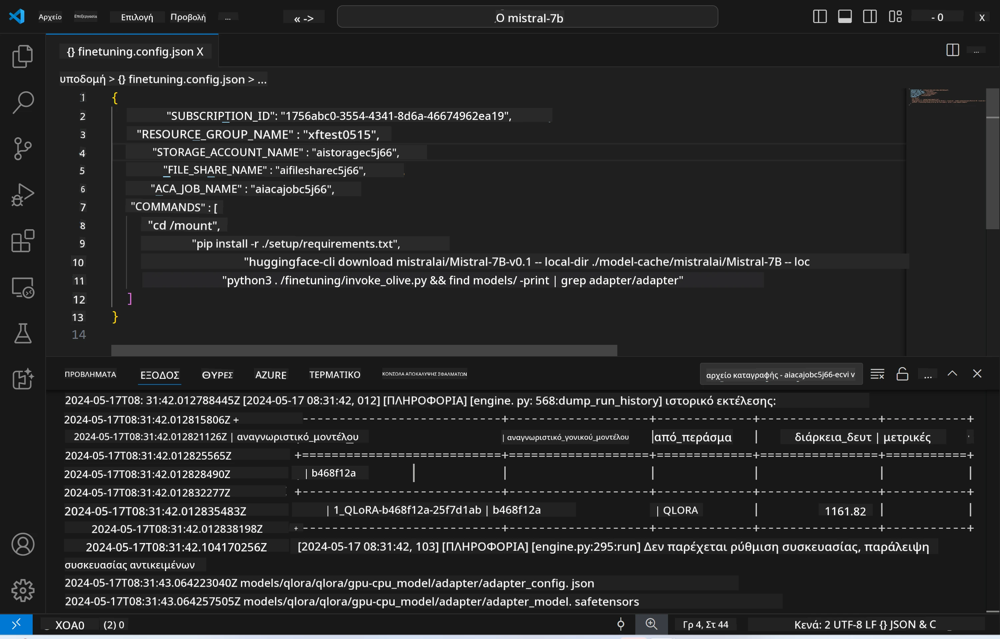
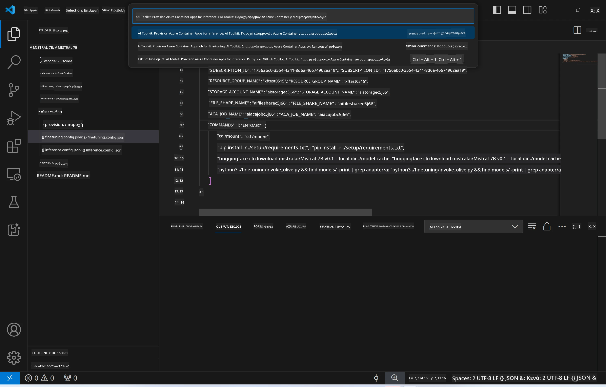
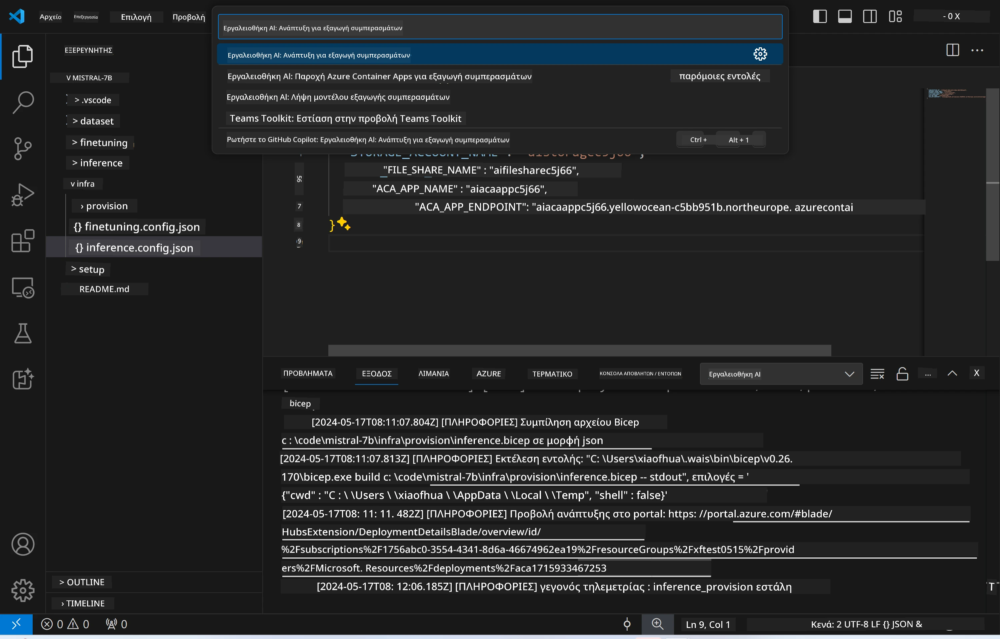
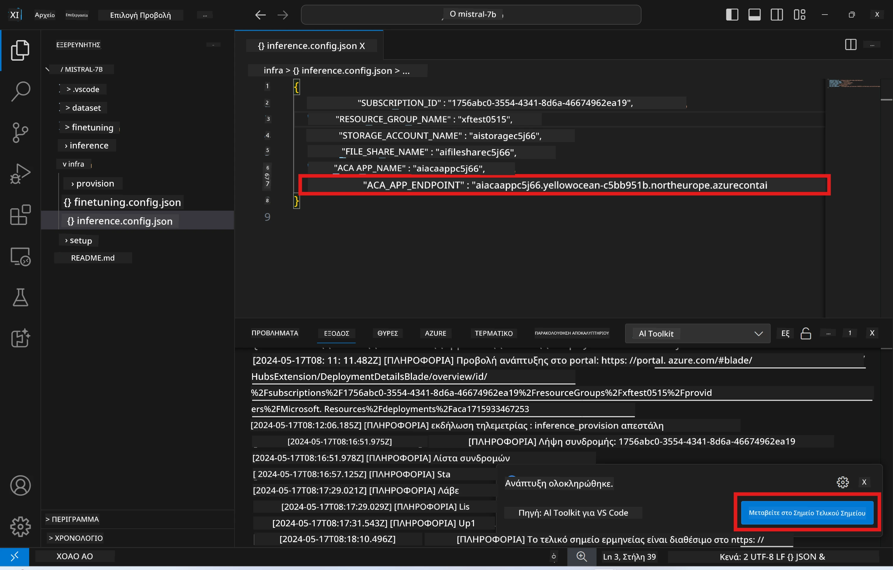

<!--
CO_OP_TRANSLATOR_METADATA:
{
  "original_hash": "a54cd3d65b6963e4e8ce21e143c3ab04",
  "translation_date": "2025-07-16T21:19:00+00:00",
  "source_file": "md/01.Introduction/03/Remote_Interence.md",
  "language_code": "el"
}
-->
# Απομακρυσμένη Εκτέλεση Inferencing με το fine-tuned μοντέλο

Αφού εκπαιδευτούν οι adapters στο απομακρυσμένο περιβάλλον, χρησιμοποιήστε μια απλή εφαρμογή Gradio για να αλληλεπιδράσετε με το μοντέλο.



### Παροχή Πόρων Azure  
Πρέπει να ρυθμίσετε τους πόρους Azure για απομακρυσμένη inferencing εκτελώντας την εντολή `AI Toolkit: Provision Azure Container Apps for inference` από την παλέτα εντολών. Κατά τη διάρκεια αυτής της διαδικασίας, θα σας ζητηθεί να επιλέξετε τη συνδρομή Azure και την ομάδα πόρων σας.  


Από προεπιλογή, η συνδρομή και η ομάδα πόρων για το inference θα πρέπει να είναι οι ίδιες με αυτές που χρησιμοποιήθηκαν για το fine-tuning. Το inference θα χρησιμοποιήσει το ίδιο Azure Container App Environment και θα έχει πρόσβαση στο μοντέλο και τον adapter μοντέλου που αποθηκεύονται στα Azure Files, τα οποία δημιουργήθηκαν κατά το βήμα του fine-tuning.

## Χρήση του AI Toolkit

### Ανάπτυξη για Inference  
Αν θέλετε να τροποποιήσετε τον κώδικα του inference ή να φορτώσετε ξανά το μοντέλο inference, εκτελέστε την εντολή `AI Toolkit: Deploy for inference`. Αυτό θα συγχρονίσει τον πιο πρόσφατο κώδικά σας με το ACA και θα επανεκκινήσει το αντίγραφο.



Μετά την επιτυχή ολοκλήρωση της ανάπτυξης, το μοντέλο είναι πλέον έτοιμο για αξιολόγηση μέσω αυτού του endpoint.

### Πρόσβαση στο API του Inference

Μπορείτε να αποκτήσετε πρόσβαση στο API του inference πατώντας το κουμπί "*Go to Inference Endpoint*" που εμφανίζεται στην ειδοποίηση του VSCode. Εναλλακτικά, το web API endpoint βρίσκεται στο `ACA_APP_ENDPOINT` μέσα στο αρχείο `./infra/inference.config.json` και στο πάνελ εξόδου.



> **Note:** Το endpoint του inference μπορεί να χρειαστεί μερικά λεπτά για να γίνει πλήρως λειτουργικό.

## Συστατικά του Inference που Περιλαμβάνονται στο Πρότυπο

| Φάκελος | Περιεχόμενα |
| ------ |--------- |
| `infra` | Περιέχει όλες τις απαραίτητες ρυθμίσεις για απομακρυσμένες λειτουργίες. |
| `infra/provision/inference.parameters.json` | Περιέχει παραμέτρους για τα bicep templates, που χρησιμοποιούνται για την παροχή πόρων Azure για το inference. |
| `infra/provision/inference.bicep` | Περιέχει τα templates για την παροχή πόρων Azure για το inference. |
| `infra/inference.config.json` | Το αρχείο ρυθμίσεων, που δημιουργείται από την εντολή `AI Toolkit: Provision Azure Container Apps for inference`. Χρησιμοποιείται ως είσοδος για άλλες απομακρυσμένες εντολές. |

### Χρήση του AI Toolkit για τη ρύθμιση παροχής πόρων Azure  
Ρυθμίστε το [AI Toolkit](https://marketplace.visualstudio.com/items?itemName=ms-windows-ai-studio.windows-ai-studio)

Εκτελέστε την εντολή `Provision Azure Container Apps for inference`.

Μπορείτε να βρείτε τις παραμέτρους ρύθμισης στο αρχείο `./infra/provision/inference.parameters.json`. Ακολουθούν οι λεπτομέρειες:  
| Παράμετρος | Περιγραφή |
| --------- |------------ |
| `defaultCommands` | Οι εντολές για την εκκίνηση ενός web API. |
| `maximumInstanceCount` | Ορίζει τη μέγιστη χωρητικότητα των GPU instances. |
| `location` | Η τοποθεσία όπου παρέχονται οι πόροι Azure. Η προεπιλεγμένη τιμή είναι η ίδια με την τοποθεσία της επιλεγμένης ομάδας πόρων. |
| `storageAccountName`, `fileShareName`, `acaEnvironmentName`, `acaEnvironmentStorageName`, `acaAppName`, `acaLogAnalyticsName` | Αυτές οι παράμετροι χρησιμοποιούνται για την ονομασία των πόρων Azure που θα παρασχεθούν. Από προεπιλογή, θα είναι ίδιες με το όνομα των πόρων που χρησιμοποιήθηκαν για το fine-tuning. Μπορείτε να εισάγετε ένα νέο, μη χρησιμοποιημένο όνομα πόρου για να δημιουργήσετε προσαρμοσμένους πόρους ή να εισάγετε το όνομα ενός ήδη υπάρχοντος πόρου Azure αν προτιμάτε να τον χρησιμοποιήσετε. Για λεπτομέρειες, ανατρέξτε στην ενότητα [Using existing Azure Resources](../../../../../md/01.Introduction/03). |

### Χρήση Υφιστάμενων Πόρων Azure

Από προεπιλογή, η παροχή πόρων για το inference χρησιμοποιεί το ίδιο Azure Container App Environment, Storage Account, Azure File Share και Azure Log Analytics που χρησιμοποιήθηκαν για το fine-tuning. Δημιουργείται ξεχωριστό Azure Container App αποκλειστικά για το API του inference.

Αν έχετε προσαρμόσει τους πόρους Azure κατά το βήμα του fine-tuning ή θέλετε να χρησιμοποιήσετε τους δικούς σας υπάρχοντες πόρους Azure για το inference, καθορίστε τα ονόματά τους στο αρχείο `./infra/inference.parameters.json`. Στη συνέχεια, εκτελέστε την εντολή `AI Toolkit: Provision Azure Container Apps for inference` από την παλέτα εντολών. Αυτό ενημερώνει τους καθορισμένους πόρους και δημιουργεί όσους λείπουν.

Για παράδειγμα, αν έχετε ήδη ένα υπάρχον Azure container environment, το αρχείο `./infra/finetuning.parameters.json` σας θα πρέπει να μοιάζει ως εξής:

```json
{
    "$schema": "https://schema.management.azure.com/schemas/2019-04-01/deploymentParameters.json#",
    "contentVersion": "1.0.0.0",
    "parameters": {
      ...
      "acaEnvironmentName": {
        "value": "<your-aca-env-name>"
      },
      "acaEnvironmentStorageName": {
        "value": null
      },
      ...
    }
  }
```

### Χειροκίνητη Παροχή  
Αν προτιμάτε να ρυθμίσετε χειροκίνητα τους πόρους Azure, μπορείτε να χρησιμοποιήσετε τα αρχεία bicep που παρέχονται στους φακέλους `./infra/provision`. Αν έχετε ήδη ρυθμίσει και διαμορφώσει όλους τους πόρους Azure χωρίς να χρησιμοποιήσετε την παλέτα εντολών του AI Toolkit, απλά εισάγετε τα ονόματα των πόρων στο αρχείο `inference.config.json`.

Για παράδειγμα:

```json
{
  "SUBSCRIPTION_ID": "<your-subscription-id>",
  "RESOURCE_GROUP_NAME": "<your-resource-group-name>",
  "STORAGE_ACCOUNT_NAME": "<your-storage-account-name>",
  "FILE_SHARE_NAME": "<your-file-share-name>",
  "ACA_APP_NAME": "<your-aca-name>",
  "ACA_APP_ENDPOINT": "<your-aca-endpoint>"
}
```

**Αποποίηση ευθυνών**:  
Αυτό το έγγραφο έχει μεταφραστεί χρησιμοποιώντας την υπηρεσία αυτόματης μετάφρασης AI [Co-op Translator](https://github.com/Azure/co-op-translator). Παρόλο που επιδιώκουμε την ακρίβεια, παρακαλούμε να γνωρίζετε ότι οι αυτόματες μεταφράσεις ενδέχεται να περιέχουν λάθη ή ανακρίβειες. Το πρωτότυπο έγγραφο στη μητρική του γλώσσα πρέπει να θεωρείται η αυθεντική πηγή. Για κρίσιμες πληροφορίες, συνιστάται επαγγελματική ανθρώπινη μετάφραση. Δεν φέρουμε ευθύνη για τυχόν παρεξηγήσεις ή λανθασμένες ερμηνείες που προκύπτουν από τη χρήση αυτής της μετάφρασης.