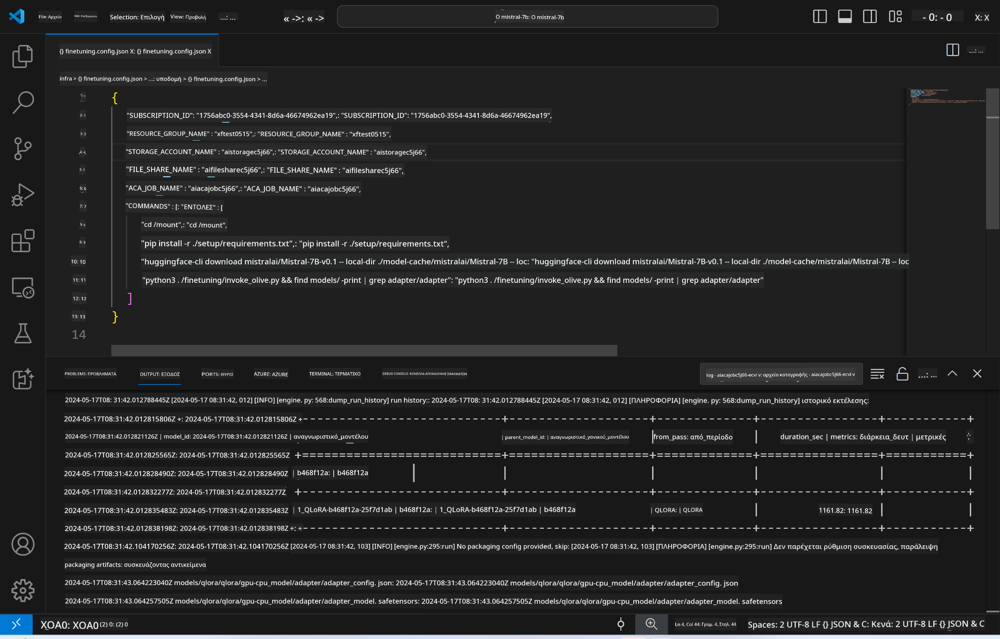
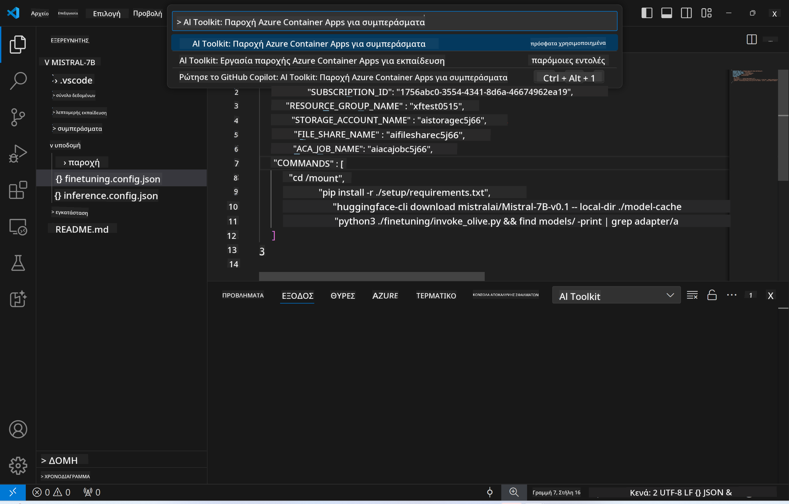
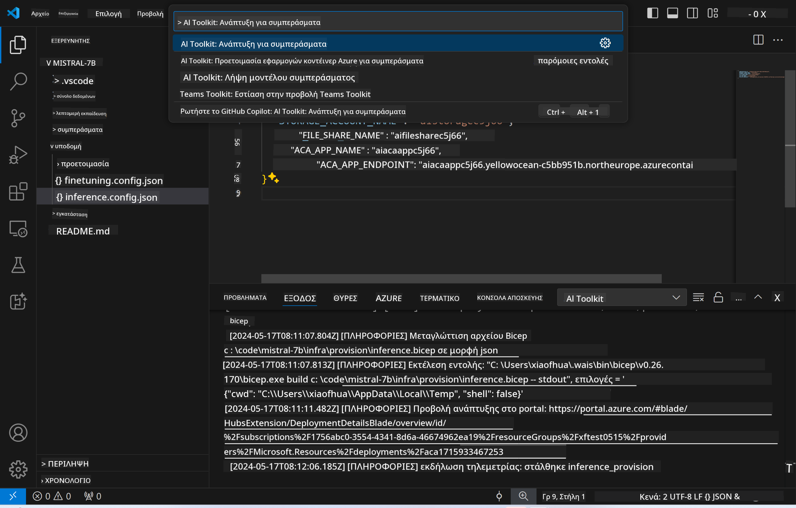
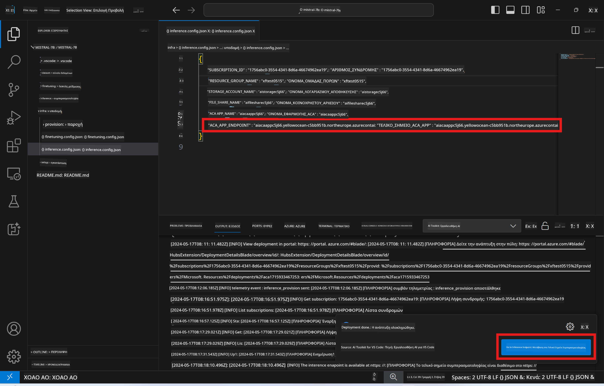

<!--
CO_OP_TRANSLATOR_METADATA:
{
  "original_hash": "a54cd3d65b6963e4e8ce21e143c3ab04",
  "translation_date": "2025-05-09T12:39:37+00:00",
  "source_file": "md/01.Introduction/03/Remote_Interence.md",
  "language_code": "el"
}
-->
# Απομακρυσμένη Εξαγωγή Συμπερασμάτων με το fine-tuned μοντέλο

Αφού εκπαιδευτούν οι προσαρμογείς στο απομακρυσμένο περιβάλλον, χρησιμοποιήστε μια απλή εφαρμογή Gradio για να αλληλεπιδράσετε με το μοντέλο.



### Προετοιμασία Πόρων Azure  
Πρέπει να ρυθμίσετε τους Πόρους Azure για απομακρυσμένη εξαγωγή συμπερασμάτων εκτελώντας την `AI Toolkit: Provision Azure Container Apps for inference` από την παλέτα εντολών. Κατά τη διάρκεια αυτής της ρύθμισης, θα σας ζητηθεί να επιλέξετε τη Συνδρομή Azure και την ομάδα πόρων σας.  


Κατά προεπιλογή, η συνδρομή και η ομάδα πόρων για την εξαγωγή συμπερασμάτων πρέπει να ταιριάζουν με αυτές που χρησιμοποιήθηκαν για το fine-tuning. Η εξαγωγή συμπερασμάτων θα χρησιμοποιήσει το ίδιο Περιβάλλον Azure Container App και θα έχει πρόσβαση στο μοντέλο και τον προσαρμογέα μοντέλου που είναι αποθηκευμένα σε Azure Files, τα οποία δημιουργήθηκαν κατά το βήμα fine-tuning.

## Χρήση του AI Toolkit

### Ανάπτυξη για Εξαγωγή Συμπερασμάτων  
Αν θέλετε να τροποποιήσετε τον κώδικα εξαγωγής συμπερασμάτων ή να φορτώσετε ξανά το μοντέλο εξαγωγής, εκτελέστε την εντολή `AI Toolkit: Deploy for inference`. Αυτό θα συγχρονίσει τον πιο πρόσφατο κώδικά σας με το ACA και θα επανεκκινήσει το αντίγραφο.



Μετά την επιτυχή ολοκλήρωση της ανάπτυξης, το μοντέλο είναι πλέον έτοιμο για αξιολόγηση μέσω αυτού του endpoint.

### Πρόσβαση στο API Εξαγωγής Συμπερασμάτων

Μπορείτε να έχετε πρόσβαση στο API εξαγωγής συμπερασμάτων κάνοντας κλικ στο κουμπί "*Go to Inference Endpoint*" που εμφανίζεται στην ειδοποίηση του VSCode. Εναλλακτικά, το web API endpoint βρίσκεται κάτω από την `ACA_APP_ENDPOINT` στο `./infra/inference.config.json` και στο πάνελ εξόδου.



> **Note:** Το endpoint εξαγωγής μπορεί να χρειαστεί λίγα λεπτά για να είναι πλήρως λειτουργικό.

## Συστατικά Εξαγωγής Συμπερασμάτων που Περιλαμβάνονται στο Πρότυπο

| Φάκελος | Περιεχόμενα |
| ------ |--------- |
| `infra` | Περιέχει όλες τις απαραίτητες ρυθμίσεις για απομακρυσμένες λειτουργίες. |
| `infra/provision/inference.parameters.json` | Περιλαμβάνει παραμέτρους για τα bicep templates, που χρησιμοποιούνται για την προετοιμασία πόρων Azure για εξαγωγή συμπερασμάτων. |
| `infra/provision/inference.bicep` | Περιέχει πρότυπα για την προετοιμασία πόρων Azure για εξαγωγή συμπερασμάτων. |
| `infra/inference.config.json` | Το αρχείο ρυθμίσεων, που δημιουργείται από την εντολή `AI Toolkit: Provision Azure Container Apps for inference`. Χρησιμοποιείται ως είσοδος για άλλες απομακρυσμένες παλέτες εντολών. |

### Χρήση του AI Toolkit για τη ρύθμιση προετοιμασίας πόρων Azure  
Ρυθμίστε το [AI Toolkit](https://marketplace.visualstudio.com/items?itemName=ms-windows-ai-studio.windows-ai-studio)

Προετοιμάστε τα Azure Container Apps για εξαγωγή συμπερασμάτων` command.

You can find configuration parameters in `./infra/provision/inference.parameters.json` file. Here are the details:
| Parameter | Description |
| --------- |------------ |
| `defaultCommands` | This is the commands to initiate a web API. |
| `maximumInstanceCount` | This parameter sets the maximum capacity of GPU instances. |
| `location` | This is the location where Azure resources are provisioned. The default value is the same as the chosen resource group's location. |
| `storageAccountName`, `fileShareName` `acaEnvironmentName`, `acaEnvironmentStorageName`, `acaAppName`,  `acaLogAnalyticsName` | These parameters are used to name the Azure resources for provision. By default, they will be same to the fine-tuning resource name. You can input a new, unused resource name to create your own custom-named resources, or you can input the name of an already existing Azure resource if you'd prefer to use that. For details, refer to the section [Using existing Azure Resources](../../../../../md/01.Introduction/03). |

### Using Existing Azure Resources

By default, the inference provision use the same Azure Container App Environment, Storage Account, Azure File Share, and Azure Log Analytics that were used for fine-tuning. A separate Azure Container App is created solely for the inference API. 

If you have customized the Azure resources during the fine-tuning step or want to use your own existing Azure resources for inference, specify their names in the `./infra/inference.parameters.json` αρχείο. Έπειτα, εκτελέστε την εντολή `AI Toolkit: Provision Azure Container Apps for inference` από την παλέτα εντολών. Αυτό ενημερώνει τους καθορισμένους πόρους και δημιουργεί όσους λείπουν.

Για παράδειγμα, αν έχετε ήδη υπάρχον περιβάλλον Azure container, το αρχείο `./infra/finetuning.parameters.json` θα πρέπει να μοιάζει ως εξής:

```json
{
    "$schema": "https://schema.management.azure.com/schemas/2019-04-01/deploymentParameters.json#",
    "contentVersion": "1.0.0.0",
    "parameters": {
      ...
      "acaEnvironmentName": {
        "value": "<your-aca-env-name>"
      },
      "acaEnvironmentStorageName": {
        "value": null
      },
      ...
    }
  }
```

### Χειροκίνητη Προετοιμασία  
Αν προτιμάτε να ρυθμίσετε χειροκίνητα τους πόρους Azure, μπορείτε να χρησιμοποιήσετε τα διαθέσιμα αρχεία bicep στον φάκελο `./infra/provision` folders. If you have already set up and configured all the Azure resources without using the AI Toolkit command palette, you can simply enter the resource names in the `inference.config.json`.

Για παράδειγμα:

```json
{
  "SUBSCRIPTION_ID": "<your-subscription-id>",
  "RESOURCE_GROUP_NAME": "<your-resource-group-name>",
  "STORAGE_ACCOUNT_NAME": "<your-storage-account-name>",
  "FILE_SHARE_NAME": "<your-file-share-name>",
  "ACA_APP_NAME": "<your-aca-name>",
  "ACA_APP_ENDPOINT": "<your-aca-endpoint>"
}
```

**Αποποίηση ευθυνών**:  
Αυτό το έγγραφο έχει μεταφραστεί χρησιμοποιώντας την υπηρεσία αυτόματης μετάφρασης AI [Co-op Translator](https://github.com/Azure/co-op-translator). Παρόλο που επιδιώκουμε την ακρίβεια, παρακαλούμε να γνωρίζετε ότι οι αυτοματοποιημένες μεταφράσεις ενδέχεται να περιέχουν λάθη ή ανακρίβειες. Το πρωτότυπο έγγραφο στη μητρική του γλώσσα πρέπει να θεωρείται η επίσημη πηγή. Για κρίσιμες πληροφορίες, συνιστάται επαγγελματική μετάφραση από ανθρώπους. Δεν φέρουμε ευθύνη για τυχόν παρεξηγήσεις ή λανθασμένες ερμηνείες που προκύπτουν από τη χρήση αυτής της μετάφρασης.