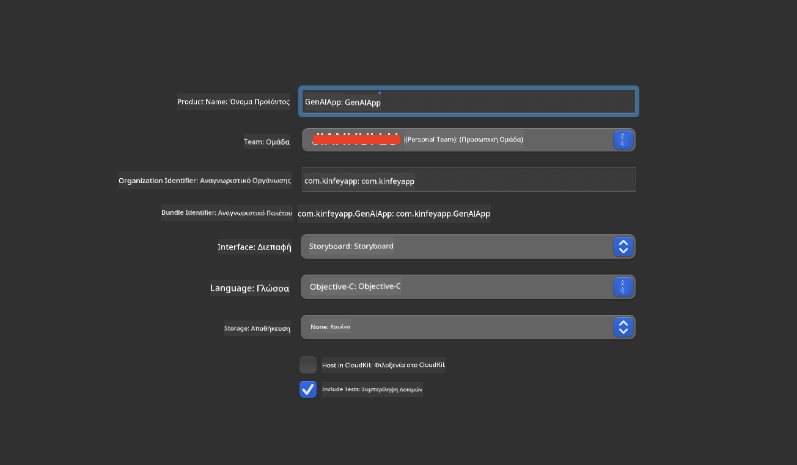
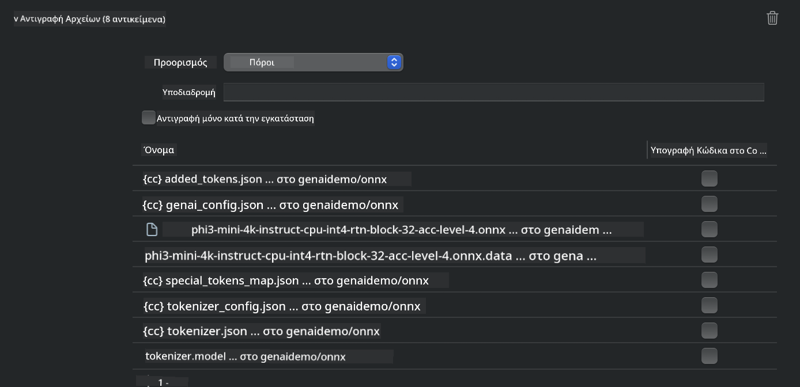
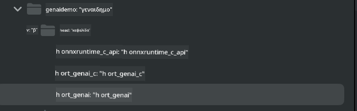
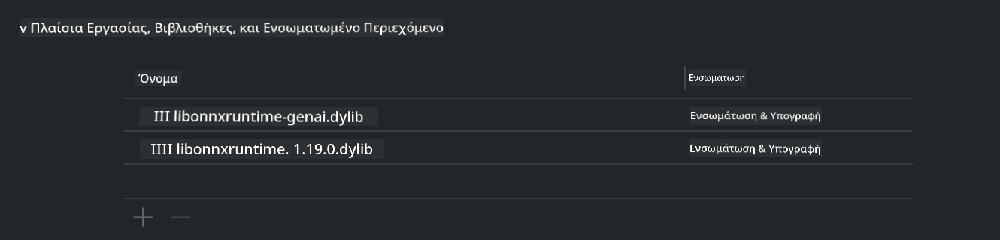
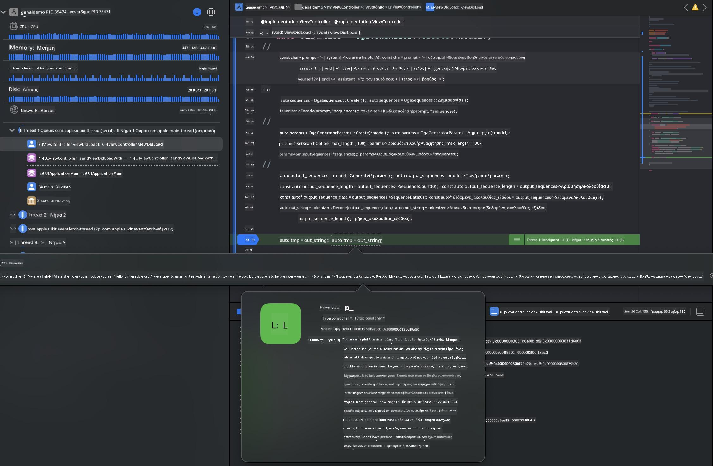

<!--
CO_OP_TRANSLATOR_METADATA:
{
  "original_hash": "82af197df38d25346a98f1f0e84d1698",
  "translation_date": "2025-05-09T10:58:07+00:00",
  "source_file": "md/01.Introduction/03/iOS_Inference.md",
  "language_code": "el"
}
-->
# **Inference Phi-3 στο iOS**

Το Phi-3-mini είναι μια νέα σειρά μοντέλων από τη Microsoft που επιτρέπει την ανάπτυξη Μεγάλων Γλωσσικών Μοντέλων (LLMs) σε συσκευές edge και IoT. Το Phi-3-mini είναι διαθέσιμο για ανάπτυξη σε iOS, Android και Edge Devices, επιτρέποντας τη χρήση γεννητικής AI σε περιβάλλοντα BYOD. Το παρακάτω παράδειγμα δείχνει πώς να αναπτύξετε το Phi-3-mini σε iOS.

## **1. Προετοιμασία**

- **a.** macOS 14+
- **b.** Xcode 15+
- **c.** iOS SDK 17.x (iPhone 14 A16 ή νεότερο)
- **d.** Εγκατάσταση Python 3.10+ (συνιστάται Conda)
- **e.** Εγκατάσταση της βιβλιοθήκης Python: `python-flatbuffers`
- **f.** Εγκατάσταση CMake

### Semantic Kernel και Inference

Το Semantic Kernel είναι ένα πλαίσιο εφαρμογών που επιτρέπει τη δημιουργία εφαρμογών συμβατών με το Azure OpenAI Service, τα μοντέλα OpenAI και ακόμα και τοπικά μοντέλα. Η πρόσβαση σε τοπικές υπηρεσίες μέσω του Semantic Kernel διευκολύνει την ενσωμάτωση με τον δικό σας αυτο-φιλοξενούμενο διακομιστή μοντέλου Phi-3-mini.

### Κλήση Ποσοτικοποιημένων Μοντέλων με Ollama ή LlamaEdge

Πολλοί χρήστες προτιμούν να χρησιμοποιούν ποσοτικοποιημένα μοντέλα για να τρέχουν τοπικά τα μοντέλα. Το [Ollama](https://ollama.com) και το [LlamaEdge](https://llamaedge.com) επιτρέπουν την κλήση διαφόρων ποσοτικοποιημένων μοντέλων:

#### **Ollama**

Μπορείτε να τρέξετε απευθείας `ollama run phi3` ή να το ρυθμίσετε offline. Δημιουργήστε ένα Modelfile με τη διαδρομή προς το αρχείο `gguf` σας. Παράδειγμα κώδικα για το τρέξιμο του ποσοτικοποιημένου μοντέλου Phi-3-mini:

```gguf
FROM {Add your gguf file path}
TEMPLATE \"\"\"<|user|> .Prompt<|end|> <|assistant|>\"\"\"
PARAMETER stop <|end|>
PARAMETER num_ctx 4096
```

#### **LlamaEdge**

Αν θέλετε να χρησιμοποιήσετε `gguf` ταυτόχρονα σε cloud και edge συσκευές, το LlamaEdge είναι μια εξαιρετική επιλογή.

## **2. Μεταγλώττιση ONNX Runtime για iOS**

```bash

git clone https://github.com/microsoft/onnxruntime.git

cd onnxruntime

./build.sh --build_shared_lib --ios --skip_tests --parallel --build_dir ./build_ios --ios --apple_sysroot iphoneos --osx_arch arm64 --apple_deploy_target 17.5 --cmake_generator Xcode --config Release

cd ../

```

### **Σημείωση**

- **a.** Πριν τη μεταγλώττιση, βεβαιωθείτε ότι το Xcode είναι σωστά ρυθμισμένο και ορισμένο ως ο ενεργός κατάλογος ανάπτυξης στο τερματικό:

    ```bash
    sudo xcode-select -switch /Applications/Xcode.app/Contents/Developer
    ```

- **b.** Το ONNX Runtime πρέπει να μεταγλωττιστεί για διαφορετικές πλατφόρμες. Για iOS, μπορείτε να μεταγλωττίσετε για `arm64` or `x86_64`.

- **c.** Συνιστάται να χρησιμοποιείτε το πιο πρόσφατο iOS SDK για τη μεταγλώττιση. Ωστόσο, μπορείτε να χρησιμοποιήσετε και παλαιότερη έκδοση για συμβατότητα με προηγούμενα SDK.

## **3. Μεταγλώττιση Generative AI με ONNX Runtime για iOS**

> **Note:** Επειδή το Generative AI με ONNX Runtime είναι σε προεπισκόπηση, να είστε ενήμεροι για πιθανές αλλαγές.

```bash

git clone https://github.com/microsoft/onnxruntime-genai
 
cd onnxruntime-genai
 
mkdir ort
 
cd ort
 
mkdir include
 
mkdir lib
 
cd ../
 
cp ../onnxruntime/include/onnxruntime/core/session/onnxruntime_c_api.h ort/include
 
cp ../onnxruntime/build_ios/Release/Release-iphoneos/libonnxruntime*.dylib* ort/lib
 
export OPENCV_SKIP_XCODEBUILD_FORCE_TRYCOMPILE_DEBUG=1
 
python3 build.py --parallel --build_dir ./build_ios --ios --ios_sysroot iphoneos --ios_arch arm64 --ios_deployment_target 17.5 --cmake_generator Xcode --cmake_extra_defines CMAKE_XCODE_ATTRIBUTE_CODE_SIGNING_ALLOWED=NO

```

## **4. Δημιουργία εφαρμογής App στο Xcode**

Επέλεξα το Objective-C ως μέθοδο ανάπτυξης της εφαρμογής, επειδή η χρήση του Generative AI με το ONNX Runtime C++ API είναι πιο συμβατή με το Objective-C. Φυσικά, μπορείτε να ολοκληρώσετε τις σχετικές κλήσεις και μέσω Swift bridging.



## **5. Αντιγραφή του ONNX ποσοτικοποιημένου μοντέλου INT4 στο project της εφαρμογής**

Πρέπει να εισάγουμε το μοντέλο ποσοτικοποίησης INT4 σε μορφή ONNX, το οποίο χρειάζεται πρώτα να κατεβάσετε.


Μετά το κατέβασμα, πρέπει να το προσθέσετε στον φάκελο Resources του project στο Xcode.



## **6. Προσθήκη του C++ API στα ViewControllers**

> **Σημείωση:**

- **a.** Προσθέστε τα αντίστοιχα αρχεία κεφαλίδας C++ στο project.

  

- **b.** Συμπεριλάβετε το `onnxruntime-genai` dynamic library in Xcode.

  

- **c.** Use the C Samples code for testing. You can also add additional features like ChatUI for more functionality.

- **d.** Since you need to use C++ in your project, rename `ViewController.m` to `ViewController.mm` για να ενεργοποιήσετε την υποστήριξη Objective-C++.

```objc

    NSString *llmPath = [[NSBundle mainBundle] resourcePath];
    char const *modelPath = llmPath.cString;

    auto model =  OgaModel::Create(modelPath);

    auto tokenizer = OgaTokenizer::Create(*model);

    const char* prompt = "<|system|>You are a helpful AI assistant.<|end|><|user|>Can you introduce yourself?<|end|><|assistant|>";

    auto sequences = OgaSequences::Create();
    tokenizer->Encode(prompt, *sequences);

    auto params = OgaGeneratorParams::Create(*model);
    params->SetSearchOption("max_length", 100);
    params->SetInputSequences(*sequences);

    auto output_sequences = model->Generate(*params);
    const auto output_sequence_length = output_sequences->SequenceCount(0);
    const auto* output_sequence_data = output_sequences->SequenceData(0);
    auto out_string = tokenizer->Decode(output_sequence_data, output_sequence_length);
    
    auto tmp = out_string;

```

## **7. Εκτέλεση της εφαρμογής**

Μόλις ολοκληρωθεί η ρύθμιση, μπορείτε να τρέξετε την εφαρμογή και να δείτε τα αποτελέσματα της εκτέλεσης του μοντέλου Phi-3-mini.



Για περισσότερα παραδείγματα κώδικα και αναλυτικές οδηγίες, επισκεφτείτε το [Phi-3 Mini Samples repository](https://github.com/Azure-Samples/Phi-3MiniSamples/tree/main/ios).

**Αποποίηση ευθυνών**:  
Αυτό το έγγραφο έχει μεταφραστεί χρησιμοποιώντας την υπηρεσία αυτόματης μετάφρασης AI [Co-op Translator](https://github.com/Azure/co-op-translator). Παρόλο που προσπαθούμε για ακρίβεια, παρακαλούμε να έχετε υπόψη ότι οι αυτόματες μεταφράσεις ενδέχεται να περιέχουν σφάλματα ή ανακρίβειες. Το πρωτότυπο έγγραφο στη γλώσσα του θεωρείται η αυθεντική πηγή. Για κρίσιμες πληροφορίες, συνιστάται η επαγγελματική ανθρώπινη μετάφραση. Δεν φέρουμε ευθύνη για τυχόν παρεξηγήσεις ή λανθασμένες ερμηνείες που προκύπτουν από τη χρήση αυτής της μετάφρασης.