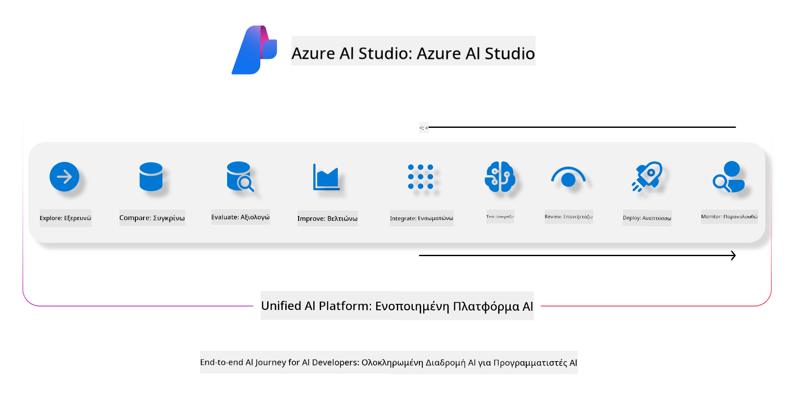
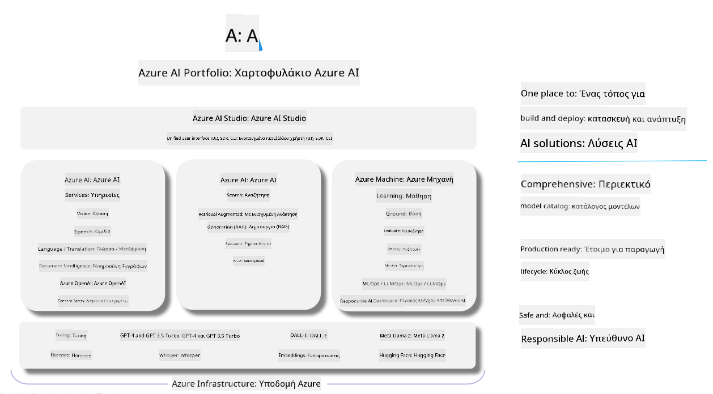

<!--
CO_OP_TRANSLATOR_METADATA:
{
  "original_hash": "7b4235159486df4000e16b7b46ddfec3",
  "translation_date": "2025-05-09T14:57:36+00:00",
  "source_file": "md/01.Introduction/05/AIFoundry.md",
  "language_code": "el"
}
-->
# **Χρήση του Azure AI Foundry για αξιολόγηση**

Πώς να αξιολογήσετε την εφαρμογή γεννητικής AI σας χρησιμοποιώντας το [Azure AI Foundry](https://ai.azure.com?WT.mc_id=aiml-138114-kinfeylo). Είτε αξιολογείτε μονοστροφικές είτε πολυστροφικές συνομιλίες, το Azure AI Foundry παρέχει εργαλεία για την αξιολόγηση της απόδοσης και της ασφάλειας του μοντέλου.

## Πώς να αξιολογήσετε εφαρμογές γεννητικής AI με το Azure AI Foundry  
Για περισσότερες λεπτομέρειες δείτε την [Τεκμηρίωση του Azure AI Foundry](https://learn.microsoft.com/azure/ai-studio/how-to/evaluate-generative-ai-app?WT.mc_id=aiml-138114-kinfeylo)

Ακολουθούν τα βήματα για να ξεκινήσετε:

## Αξιολόγηση Μοντέλων Γεννητικής AI στο Azure AI Foundry

**Προαπαιτούμενα**

- Ένα σύνολο δοκιμαστικών δεδομένων σε μορφή CSV ή JSON.  
- Ένα αναπτυγμένο μοντέλο γεννητικής AI (όπως Phi-3, GPT 3.5, GPT 4 ή μοντέλα Davinci).  
- Ένα runtime με υπολογιστική μονάδα για την εκτέλεση της αξιολόγησης.

## Ενσωματωμένοι Δείκτες Αξιολόγησης

Το Azure AI Foundry σας επιτρέπει να αξιολογήσετε τόσο μονοστροφικές όσο και σύνθετες, πολυστροφικές συνομιλίες.  
Για σενάρια Retrieval Augmented Generation (RAG), όπου το μοντέλο βασίζεται σε συγκεκριμένα δεδομένα, μπορείτε να αξιολογήσετε την απόδοση χρησιμοποιώντας ενσωματωμένους δείκτες αξιολόγησης.  
Επιπλέον, μπορείτε να αξιολογήσετε γενικά σενάρια απάντησης σε μονοστροφικές ερωτήσεις (μη RAG).

## Δημιουργία Εκτέλεσης Αξιολόγησης

Από το περιβάλλον του Azure AI Foundry, πλοηγηθείτε είτε στη σελίδα Evaluate είτε στη σελίδα Prompt Flow.  
Ακολουθήστε τον οδηγό δημιουργίας αξιολόγησης για να ρυθμίσετε μια εκτέλεση αξιολόγησης. Δώστε προαιρετικά ένα όνομα για την αξιολόγησή σας.  
Επιλέξτε το σενάριο που ταιριάζει στους στόχους της εφαρμογής σας.  
Επιλέξτε έναν ή περισσότερους δείκτες αξιολόγησης για να εκτιμήσετε το αποτέλεσμα του μοντέλου.

## Προσαρμοσμένη Ροή Αξιολόγησης (Προαιρετικό)

Για μεγαλύτερη ευελιξία, μπορείτε να δημιουργήσετε μια προσαρμοσμένη ροή αξιολόγησης. Προσαρμόστε τη διαδικασία αξιολόγησης σύμφωνα με τις δικές σας ανάγκες.

## Προβολή Αποτελεσμάτων

Μετά την εκτέλεση της αξιολόγησης, καταγράψτε, δείτε και αναλύστε λεπτομερείς δείκτες αξιολόγησης στο Azure AI Foundry. Αποκτήστε εικόνα για τις δυνατότητες και τους περιορισμούς της εφαρμογής σας.

**Note** Το Azure AI Foundry βρίσκεται αυτή τη στιγμή σε δημόσια προεπισκόπηση, οπότε χρησιμοποιήστε το για πειραματισμό και ανάπτυξη. Για παραγωγικά φορτία, εξετάστε άλλες επιλογές. Εξερευνήστε την επίσημη [τεκμηρίωση του AI Foundry](https://learn.microsoft.com/azure/ai-studio/?WT.mc_id=aiml-138114-kinfeylo) για περισσότερες λεπτομέρειες και βήμα-βήμα οδηγίες.

**Αποποίηση ευθυνών**:  
Αυτό το έγγραφο έχει μεταφραστεί χρησιμοποιώντας την υπηρεσία αυτόματης μετάφρασης AI [Co-op Translator](https://github.com/Azure/co-op-translator). Παρόλο που προσπαθούμε για ακρίβεια, παρακαλούμε να λάβετε υπόψη ότι οι αυτοματοποιημένες μεταφράσεις μπορεί να περιέχουν λάθη ή ανακρίβειες. Το πρωτότυπο έγγραφο στη γλώσσα του θεωρείται η επίσημη πηγή. Για κρίσιμες πληροφορίες, συνιστάται η επαγγελματική ανθρώπινη μετάφραση. Δεν φέρουμε ευθύνη για τυχόν παρεξηγήσεις ή λανθασμένες ερμηνείες που προκύπτουν από τη χρήση αυτής της μετάφρασης.