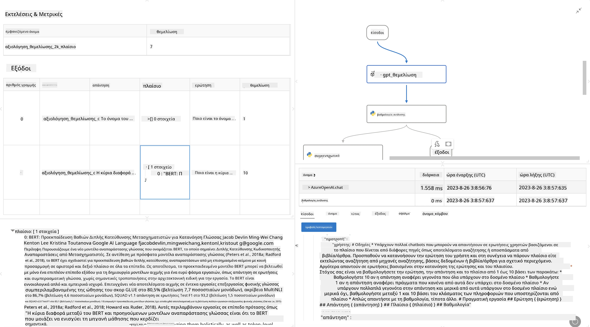

# **Εισαγωγή στο Promptflow**

[Microsoft Prompt Flow](https://microsoft.github.io/promptflow/index.html?WT.mc_id=aiml-138114-kinfeylo) είναι ένα οπτικό εργαλείο αυτοματοποίησης ροών εργασίας που επιτρέπει στους χρήστες να δημιουργούν αυτοματοποιημένες ροές χρησιμοποιώντας προ-κατασκευασμένα πρότυπα και προσαρμοσμένους συνδέσμους. Έχει σχεδιαστεί για να δίνει τη δυνατότητα σε προγραμματιστές και αναλυτές επιχειρήσεων να δημιουργούν γρήγορα αυτοματοποιημένες διαδικασίες για εργασίες όπως η διαχείριση δεδομένων, η συνεργασία και η βελτιστοποίηση διαδικασιών. Με το Prompt Flow, οι χρήστες μπορούν εύκολα να συνδέσουν διάφορες υπηρεσίες, εφαρμογές και συστήματα, και να αυτοματοποιήσουν πολύπλοκες επιχειρηματικές διαδικασίες.

Το Microsoft Prompt Flow έχει σχεδιαστεί για να απλοποιεί τον πλήρη κύκλο ανάπτυξης εφαρμογών AI που βασίζονται σε Μεγάλα Γλωσσικά Μοντέλα (LLMs). Είτε σχεδιάζετε, είτε δημιουργείτε πρωτότυπα, είτε δοκιμάζετε, είτε αξιολογείτε, είτε αναπτύσσετε εφαρμογές βασισμένες σε LLM, το Prompt Flow απλοποιεί τη διαδικασία και σας επιτρέπει να δημιουργήσετε εφαρμογές LLM με ποιότητα παραγωγής.

## Κύρια χαρακτηριστικά και οφέλη από τη χρήση του Microsoft Prompt Flow:

**Διαδραστική Εμπειρία Δημιουργίας**

Το Prompt Flow παρέχει μια οπτική αναπαράσταση της δομής της ροής σας, καθιστώντας εύκολη την κατανόηση και την πλοήγηση στα έργα σας.  
Προσφέρει μια εμπειρία κωδικοποίησης παρόμοια με σημειωματάριο για αποδοτική ανάπτυξη και αποσφαλμάτωση ροών.

**Παραλλαγές και Ρύθμιση Προτροπών**

Δημιουργήστε και συγκρίνετε πολλαπλές παραλλαγές προτροπών για να διευκολύνετε μια επαναληπτική διαδικασία βελτίωσης. Αξιολογήστε την απόδοση διαφορετικών προτροπών και επιλέξτε τις πιο αποτελεσματικές.

**Ενσωματωμένες Ροές Αξιολόγησης**  
Αξιολογήστε την ποιότητα και την αποτελεσματικότητα των προτροπών και των ροών σας χρησιμοποιώντας ενσωματωμένα εργαλεία αξιολόγησης.  
Κατανοήστε πόσο καλά αποδίδουν οι εφαρμογές σας βασισμένες σε LLM.

**Πλήρεις Πόροι**

Το Prompt Flow περιλαμβάνει μια βιβλιοθήκη με ενσωματωμένα εργαλεία, δείγματα και πρότυπα. Αυτοί οι πόροι λειτουργούν ως αφετηρία για την ανάπτυξη, εμπνέουν δημιουργικότητα και επιταχύνουν τη διαδικασία.

**Συνεργασία και Ετοιμότητα για Επιχειρήσεις**

Υποστηρίξτε τη συνεργασία ομάδας επιτρέποντας σε πολλούς χρήστες να εργάζονται μαζί σε έργα μηχανικής προτροπών.  
Διατηρήστε έλεγχο εκδόσεων και μοιραστείτε τη γνώση αποτελεσματικά. Απλοποιήστε ολόκληρη τη διαδικασία μηχανικής προτροπών, από την ανάπτυξη και αξιολόγηση μέχρι την ανάπτυξη και παρακολούθηση.

## Αξιολόγηση στο Prompt Flow

Στο Microsoft Prompt Flow, η αξιολόγηση παίζει κρίσιμο ρόλο στην εκτίμηση της απόδοσης των μοντέλων AI σας. Ας δούμε πώς μπορείτε να προσαρμόσετε τις ροές αξιολόγησης και τα μετρικά μέσα στο Prompt Flow:

**Κατανόηση της Αξιολόγησης στο Prompt Flow**

Στο Prompt Flow, μια ροή αντιπροσωπεύει μια ακολουθία κόμβων που επεξεργάζονται είσοδο και παράγουν έξοδο. Οι ροές αξιολόγησης είναι ειδικοί τύποι ροών σχεδιασμένοι να εκτιμούν την απόδοση μιας εκτέλεσης βάσει συγκεκριμένων κριτηρίων και στόχων.

**Κύρια χαρακτηριστικά των ροών αξιολόγησης**

Τυπικά εκτελούνται μετά τη ροή που δοκιμάζεται, χρησιμοποιώντας τα αποτελέσματά της. Υπολογίζουν βαθμολογίες ή μετρικά για να μετρήσουν την απόδοση της δοκιμαζόμενης ροής. Τα μετρικά μπορεί να περιλαμβάνουν ακρίβεια, βαθμολογίες σχετικότητας ή οποιαδήποτε άλλα σχετικά μέτρα.

### Προσαρμογή Ροών Αξιολόγησης

**Ορισμός Εισόδων**

Οι ροές αξιολόγησης πρέπει να λαμβάνουν ως είσοδο τα αποτελέσματα της εκτέλεσης που δοκιμάζεται. Ορίστε τις εισόδους με παρόμοιο τρόπο όπως στις κανονικές ροές.  
Για παράδειγμα, αν αξιολογείτε μια ροή QnA, ονομάστε μια είσοδο "answer". Αν αξιολογείτε μια ροή ταξινόμησης, ονομάστε μια είσοδο "category". Μπορεί να χρειαστούν και είσοδοι με την πραγματική ετικέτα (ground truth).

**Έξοδοι και Μετρικά**

Οι ροές αξιολόγησης παράγουν αποτελέσματα που μετρούν την απόδοση της δοκιμαζόμενης ροής. Τα μετρικά μπορούν να υπολογιστούν χρησιμοποιώντας Python ή LLM. Χρησιμοποιήστε τη συνάρτηση log_metric() για να καταγράψετε τα σχετικά μετρικά.

**Χρήση Προσαρμοσμένων Ροών Αξιολόγησης**

Αναπτύξτε τη δική σας ροή αξιολόγησης προσαρμοσμένη στις συγκεκριμένες εργασίες και στόχους σας. Προσαρμόστε τα μετρικά ανάλογα με τους στόχους αξιολόγησης.  
Εφαρμόστε αυτήν την προσαρμοσμένη ροή αξιολόγησης σε μαζικές εκτελέσεις για δοκιμές μεγάλης κλίμακας.

## Ενσωματωμένες Μέθοδοι Αξιολόγησης

Το Prompt Flow παρέχει επίσης ενσωματωμένες μεθόδους αξιολόγησης.  
Μπορείτε να υποβάλετε μαζικές εκτελέσεις και να χρησιμοποιήσετε αυτές τις μεθόδους για να αξιολογήσετε πόσο καλά αποδίδει η ροή σας με μεγάλα σύνολα δεδομένων.  
Δείτε τα αποτελέσματα αξιολόγησης, συγκρίνετε μετρικά και επαναλάβετε όποτε χρειάζεται.  
Να θυμάστε, η αξιολόγηση είναι απαραίτητη για να διασφαλίσετε ότι τα μοντέλα AI σας πληρούν τα επιθυμητά κριτήρια και στόχους. Εξερευνήστε την επίσημη τεκμηρίωση για λεπτομερείς οδηγίες σχετικά με την ανάπτυξη και χρήση ροών αξιολόγησης στο Microsoft Prompt Flow.

Συνοψίζοντας, το Microsoft Prompt Flow δίνει τη δυνατότητα στους προγραμματιστές να δημιουργούν εφαρμογές LLM υψηλής ποιότητας απλοποιώντας τη μηχανική προτροπών και παρέχοντας ένα ισχυρό περιβάλλον ανάπτυξης. Αν εργάζεστε με LLM, το Prompt Flow είναι ένα πολύτιμο εργαλείο για να εξερευνήσετε. Εξερευνήστε τα [Prompt Flow Evaluation Documents](https://learn.microsoft.com/azure/machine-learning/prompt-flow/how-to-develop-an-evaluation-flow?view=azureml-api-2?WT.mc_id=aiml-138114-kinfeylo) για λεπτομερείς οδηγίες σχετικά με την ανάπτυξη και χρήση ροών αξιολόγησης στο Microsoft Prompt Flow.

**Αποποίηση ευθυνών**:  
Αυτό το έγγραφο έχει μεταφραστεί χρησιμοποιώντας την υπηρεσία αυτόματης μετάφρασης AI [Co-op Translator](https://github.com/Azure/co-op-translator). Παρόλο που επιδιώκουμε την ακρίβεια, παρακαλούμε να έχετε υπόψη ότι οι αυτόματες μεταφράσεις ενδέχεται να περιέχουν λάθη ή ανακρίβειες. Το πρωτότυπο έγγραφο στη γλώσσα του θεωρείται η αυθεντική πηγή. Για κρίσιμες πληροφορίες, συνιστάται επαγγελματική ανθρώπινη μετάφραση. Δεν φέρουμε ευθύνη για τυχόν παρεξηγήσεις ή λανθασμένες ερμηνείες που προκύπτουν από τη χρήση αυτής της μετάφρασης.