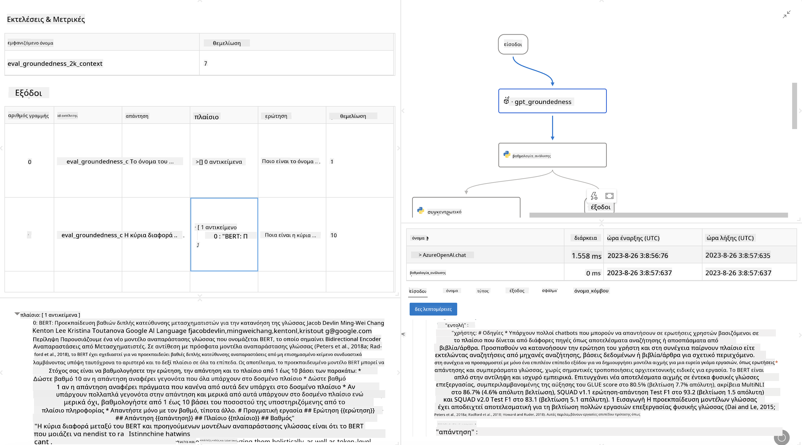

<!--
CO_OP_TRANSLATOR_METADATA:
{
  "original_hash": "3cbe7629d254f1043193b7fe22524d55",
  "translation_date": "2025-05-09T15:11:39+00:00",
  "source_file": "md/01.Introduction/05/Promptflow.md",
  "language_code": "el"
}
-->
# **Εισαγωγή στο Promptflow**

[Microsoft Prompt Flow](https://microsoft.github.io/promptflow/index.html?WT.mc_id=aiml-138114-kinfeylo) είναι ένα οπτικό εργαλείο αυτοματοποίησης ροής εργασιών που επιτρέπει στους χρήστες να δημιουργούν αυτοματοποιημένες ροές χρησιμοποιώντας προκατασκευασμένα πρότυπα και προσαρμοσμένους συνδέσμους. Έχει σχεδιαστεί για να βοηθά προγραμματιστές και αναλυτές επιχειρήσεων να δημιουργούν γρήγορα αυτοματοποιημένες διαδικασίες για εργασίες όπως διαχείριση δεδομένων, συνεργασία και βελτιστοποίηση διαδικασιών. Με το Prompt Flow, οι χρήστες μπορούν εύκολα να συνδέουν διαφορετικές υπηρεσίες, εφαρμογές και συστήματα, και να αυτοματοποιούν σύνθετες επιχειρηματικές διαδικασίες.

Το Microsoft Prompt Flow έχει σχεδιαστεί για να απλοποιεί τον πλήρη κύκλο ανάπτυξης εφαρμογών AI που βασίζονται σε Μεγάλα Γλωσσικά Μοντέλα (LLMs). Είτε βρίσκεστε στο στάδιο ιδεασμού, πρωτοτύπησης, δοκιμών, αξιολόγησης ή ανάπτυξης εφαρμογών βασισμένων σε LLM, το Prompt Flow απλοποιεί τη διαδικασία και σας επιτρέπει να δημιουργήσετε εφαρμογές LLM με ποιότητα παραγωγής.

## Κύρια χαρακτηριστικά και οφέλη από τη χρήση του Microsoft Prompt Flow:

**Διαδραστική Εμπειρία Δημιουργίας**

Το Prompt Flow παρέχει οπτική αναπαράσταση της δομής της ροής σας, καθιστώντας εύκολη την κατανόηση και πλοήγηση στα έργα σας.  
Προσφέρει μια εμπειρία κωδικοποίησης παρόμοια με σημειωματάριο για αποδοτική ανάπτυξη και εντοπισμό σφαλμάτων ροών.

**Ποικιλίες Προτροπών και Ρύθμιση**

Δημιουργήστε και συγκρίνετε πολλαπλές παραλλαγές προτροπών για να διευκολύνετε μια διαδικασία επαναληπτικής βελτίωσης. Αξιολογήστε την απόδοση διαφορετικών προτροπών και επιλέξτε τις πιο αποτελεσματικές.

**Ενσωματωμένες Ροές Αξιολόγησης**  
Αξιολογήστε την ποιότητα και την αποτελεσματικότητα των προτροπών και ροών σας χρησιμοποιώντας ενσωματωμένα εργαλεία αξιολόγησης.  
Κατανοήστε πόσο καλά αποδίδουν οι εφαρμογές σας βασισμένες σε LLM.

**Πλήρεις Πόροι**  
Το Prompt Flow περιλαμβάνει βιβλιοθήκη με εργαλεία, δείγματα και πρότυπα. Αυτοί οι πόροι λειτουργούν ως αφετηρία για ανάπτυξη, εμπνέουν δημιουργικότητα και επιταχύνουν τη διαδικασία.

**Συνεργασία και Ετοιμότητα για Επιχειρήσεις**  
Υποστηρίζει τη συνεργασία ομάδων επιτρέποντας σε πολλούς χρήστες να δουλεύουν μαζί σε έργα μηχανικής προτροπών.  
Διατηρεί έλεγχο εκδόσεων και διευκολύνει την ανταλλαγή γνώσης. Απλοποιεί ολόκληρη τη διαδικασία μηχανικής προτροπών, από την ανάπτυξη και αξιολόγηση έως την ανάπτυξη και παρακολούθηση.

## Αξιολόγηση στο Prompt Flow

Στο Microsoft Prompt Flow, η αξιολόγηση παίζει καθοριστικό ρόλο στην εκτίμηση της απόδοσης των μοντέλων AI σας. Ας δούμε πώς μπορείτε να προσαρμόσετε τις ροές αξιολόγησης και τα μετρικά στο Prompt Flow:

**Κατανόηση της Αξιολόγησης στο Prompt Flow**

Στο Prompt Flow, μια ροή αντιπροσωπεύει μια αλληλουχία κόμβων που επεξεργάζονται την είσοδο και παράγουν έξοδο. Οι ροές αξιολόγησης είναι ειδικοί τύποι ροών που έχουν σχεδιαστεί για να εκτιμούν την απόδοση μιας εκτέλεσης βάσει συγκεκριμένων κριτηρίων και στόχων.

**Κύρια χαρακτηριστικά των ροών αξιολόγησης**

Τρέχουν συνήθως μετά την ροή που δοκιμάζεται, χρησιμοποιώντας τις εξόδους της. Υπολογίζουν βαθμολογίες ή μετρικές για να μετρήσουν την απόδοση της ροής που δοκιμάζεται. Οι μετρικές μπορεί να περιλαμβάνουν ακρίβεια, βαθμολογίες σχετικότητας ή άλλες σχετικές μετρήσεις.

### Προσαρμογή Ροών Αξιολόγησης

**Ορισμός Εισόδων**

Οι ροές αξιολόγησης πρέπει να λαμβάνουν τις εξόδους της εκτέλεσης που αξιολογείται. Ορίστε τις εισόδους όπως σε κανονικές ροές.  
Για παράδειγμα, αν αξιολογείτε μια ροή QnA, ονομάστε μια είσοδο "answer". Αν αξιολογείτε ροή ταξινόμησης, ονομάστε την είσοδο "category". Μπορεί να χρειάζονται και είσοδοι αληθινών δεδομένων (ground truth), π.χ. πραγματικές ετικέτες.

**Έξοδοι και Μετρικές**

Οι ροές αξιολόγησης παράγουν αποτελέσματα που μετρούν την απόδοση της ροής που δοκιμάζεται. Οι μετρικές μπορούν να υπολογιστούν με Python ή LLM. Χρησιμοποιήστε τη συνάρτηση log_metric() για να καταγράψετε τις σχετικές μετρικές.

**Χρήση Προσαρμοσμένων Ροών Αξιολόγησης**

Αναπτύξτε τη δική σας ροή αξιολόγησης προσαρμοσμένη στις συγκεκριμένες εργασίες και στόχους σας. Προσαρμόστε τις μετρικές ανάλογα με τους στόχους αξιολόγησης.  
Εφαρμόστε αυτήν τη ροή αξιολόγησης σε μαζικές εκτελέσεις για ευρεία δοκιμή.

## Ενσωματωμένες Μέθοδοι Αξιολόγησης

Το Prompt Flow παρέχει επίσης ενσωματωμένες μεθόδους αξιολόγησης.  
Μπορείτε να υποβάλετε μαζικές εκτελέσεις και να χρησιμοποιήσετε αυτές τις μεθόδους για να αξιολογήσετε την απόδοση της ροής σας με μεγάλα σύνολα δεδομένων.  
Δείτε τα αποτελέσματα αξιολόγησης, συγκρίνετε μετρικές και επαναλάβετε όπως χρειάζεται.  
Να θυμάστε, η αξιολόγηση είναι απαραίτητη για να διασφαλίσετε ότι τα μοντέλα AI σας πληρούν τα επιθυμητά κριτήρια και στόχους. Εξερευνήστε την επίσημη τεκμηρίωση για λεπτομερείς οδηγίες σχετικά με την ανάπτυξη και χρήση ροών αξιολόγησης στο Microsoft Prompt Flow.

Συνοψίζοντας, το Microsoft Prompt Flow δίνει τη δυνατότητα στους προγραμματιστές να δημιουργούν εφαρμογές LLM υψηλής ποιότητας, απλοποιώντας τη μηχανική προτροπών και προσφέροντας ένα ισχυρό περιβάλλον ανάπτυξης. Αν εργάζεστε με LLMs, το Prompt Flow είναι ένα πολύτιμο εργαλείο για να εξερευνήσετε. Επισκεφθείτε τα [Prompt Flow Evaluation Documents](https://learn.microsoft.com/azure/machine-learning/prompt-flow/how-to-develop-an-evaluation-flow?view=azureml-api-2?WT.mc_id=aiml-138114-kinfeylo) για λεπτομερείς οδηγίες σχετικά με την ανάπτυξη και χρήση ροών αξιολόγησης στο Microsoft Prompt Flow.

**Αποποίηση Ευθυνών**:  
Αυτό το έγγραφο έχει μεταφραστεί χρησιμοποιώντας την υπηρεσία αυτόματης μετάφρασης AI [Co-op Translator](https://github.com/Azure/co-op-translator). Παρόλο που προσπαθούμε για ακρίβεια, παρακαλούμε να έχετε υπόψη ότι οι αυτόματες μεταφράσεις ενδέχεται να περιέχουν λάθη ή ανακρίβειες. Το πρωτότυπο έγγραφο στη μητρική του γλώσσα πρέπει να θεωρείται η αυθεντική πηγή. Για κρίσιμες πληροφορίες, συνιστάται επαγγελματική ανθρώπινη μετάφραση. Δεν φέρουμε ευθύνη για τυχόν παρεξηγήσεις ή λανθασμένες ερμηνείες που προκύπτουν από τη χρήση αυτής της μετάφρασης.