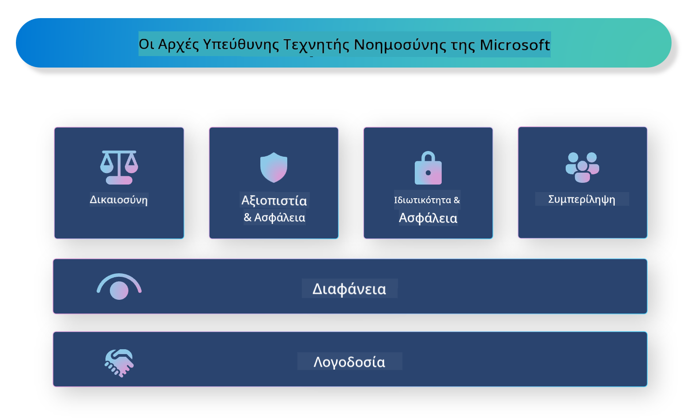

<!--
CO_OP_TRANSLATOR_METADATA:
{
  "original_hash": "805b96b20152936d8f4c587d90d6e06e",
  "translation_date": "2025-07-16T22:53:07+00:00",
  "source_file": "md/01.Introduction/05/ResponsibleAI.md",
  "language_code": "el"
}
-->
# **Εισαγωγή στο Responsible AI**

[Microsoft Responsible AI](https://www.microsoft.com/ai/responsible-ai?WT.mc_id=aiml-138114-kinfeylo) είναι μια πρωτοβουλία που στοχεύει να βοηθήσει προγραμματιστές και οργανισμούς να δημιουργήσουν συστήματα AI που είναι διαφανή, αξιόπιστα και υπεύθυνα. Η πρωτοβουλία παρέχει καθοδήγηση και πόρους για την ανάπτυξη υπεύθυνων λύσεων AI που ευθυγραμμίζονται με ηθικές αρχές, όπως η ιδιωτικότητα, η δικαιοσύνη και η διαφάνεια. Θα εξερευνήσουμε επίσης ορισμένες από τις προκλήσεις και τις βέλτιστες πρακτικές που σχετίζονται με την κατασκευή υπεύθυνων συστημάτων AI.

## Επισκόπηση του Microsoft Responsible AI

**Ηθικές αρχές**

Το Microsoft Responsible AI καθοδηγείται από ένα σύνολο ηθικών αρχών, όπως η ιδιωτικότητα, η δικαιοσύνη, η διαφάνεια, η λογοδοσία και η ασφάλεια. Αυτές οι αρχές έχουν σχεδιαστεί για να διασφαλίσουν ότι τα συστήματα AI αναπτύσσονται με ηθικό και υπεύθυνο τρόπο.

**Διαφανές AI**

Το Microsoft Responsible AI δίνει έμφαση στη σημασία της διαφάνειας στα συστήματα AI. Αυτό περιλαμβάνει την παροχή σαφών εξηγήσεων για το πώς λειτουργούν τα μοντέλα AI, καθώς και τη διασφάλιση ότι οι πηγές δεδομένων και οι αλγόριθμοι είναι δημόσια διαθέσιμοι.

**Υπεύθυνο AI**

[Microsoft Responsible AI](https://www.microsoft.com/ai/responsible-ai?WT.mc_id=aiml-138114-kinfeylo) προωθεί την ανάπτυξη υπεύθυνων συστημάτων AI, τα οποία μπορούν να παρέχουν πληροφορίες για το πώς τα μοντέλα AI λαμβάνουν αποφάσεις. Αυτό βοηθά τους χρήστες να κατανοήσουν και να εμπιστευτούν τα αποτελέσματα των συστημάτων AI.

**Ενσωμάτωση**

Τα συστήματα AI θα πρέπει να σχεδιάζονται ώστε να ωφελούν όλους. Η Microsoft στοχεύει στη δημιουργία ενσωματωμένου AI που λαμβάνει υπόψη διαφορετικές οπτικές και αποφεύγει προκαταλήψεις ή διακρίσεις.

**Αξιοπιστία και Ασφάλεια**

Η διασφάλιση ότι τα συστήματα AI είναι αξιόπιστα και ασφαλή είναι κρίσιμη. Η Microsoft εστιάζει στην κατασκευή ανθεκτικών μοντέλων που αποδίδουν σταθερά και αποφεύγουν επιβλαβείς συνέπειες.

**Δικαιοσύνη στο AI**

Το Microsoft Responsible AI αναγνωρίζει ότι τα συστήματα AI μπορούν να διατηρήσουν προκαταλήψεις αν εκπαιδευτούν σε μεροληπτικά δεδομένα ή αλγόριθμους. Η πρωτοβουλία παρέχει καθοδήγηση για την ανάπτυξη δίκαιων συστημάτων AI που δεν διακρίνουν βάσει παραγόντων όπως η φυλή, το φύλο ή η ηλικία.

**Ιδιωτικότητα και ασφάλεια**

Το Microsoft Responsible AI τονίζει τη σημασία της προστασίας της ιδιωτικότητας των χρηστών και της ασφάλειας των δεδομένων στα συστήματα AI. Αυτό περιλαμβάνει την εφαρμογή ισχυρής κρυπτογράφησης δεδομένων και ελέγχων πρόσβασης, καθώς και τακτικούς ελέγχους των συστημάτων AI για ευπάθειες.

**Λογοδοσία και ευθύνη**

Το Microsoft Responsible AI προωθεί τη λογοδοσία και την ευθύνη στην ανάπτυξη και την υλοποίηση AI. Αυτό περιλαμβάνει τη διασφάλιση ότι οι προγραμματιστές και οι οργανισμοί είναι ενήμεροι για τους πιθανούς κινδύνους που σχετίζονται με τα συστήματα AI και λαμβάνουν μέτρα για την αντιμετώπισή τους.

## Βέλτιστες πρακτικές για την κατασκευή υπεύθυνων συστημάτων AI

**Ανάπτυξη μοντέλων AI με χρήση ποικίλων συνόλων δεδομένων**

Για να αποφευχθεί η μεροληψία στα συστήματα AI, είναι σημαντικό να χρησιμοποιούνται ποικίλα σύνολα δεδομένων που αντιπροσωπεύουν ένα εύρος οπτικών και εμπειριών.

**Χρήση τεχνικών εξηγήσιμου AI**

Οι τεχνικές εξηγήσιμου AI μπορούν να βοηθήσουν τους χρήστες να κατανοήσουν πώς τα μοντέλα AI λαμβάνουν αποφάσεις, αυξάνοντας έτσι την εμπιστοσύνη στο σύστημα.

**Τακτικός έλεγχος των συστημάτων AI για ευπάθειες**

Οι τακτικοί έλεγχοι των συστημάτων AI μπορούν να βοηθήσουν στον εντοπισμό πιθανών κινδύνων και ευπαθειών που πρέπει να αντιμετωπιστούν.

**Εφαρμογή ισχυρής κρυπτογράφησης δεδομένων και ελέγχων πρόσβασης**

Η κρυπτογράφηση δεδομένων και οι έλεγχοι πρόσβασης βοηθούν στην προστασία της ιδιωτικότητας και της ασφάλειας των χρηστών στα συστήματα AI.

**Τήρηση ηθικών αρχών στην ανάπτυξη AI**

Η τήρηση ηθικών αρχών, όπως η δικαιοσύνη, η διαφάνεια και η λογοδοσία, βοηθά στην οικοδόμηση εμπιστοσύνης στα συστήματα AI και διασφαλίζει ότι αναπτύσσονται με υπεύθυνο τρόπο.

## Χρήση του AI Foundry για Responsible AI

[Azure AI Foundry](https://ai.azure.com?WT.mc_id=aiml-138114-kinfeylo) είναι μια ισχυρή πλατφόρμα που επιτρέπει σε προγραμματιστές και οργανισμούς να δημιουργούν γρήγορα έξυπνες, καινοτόμες, έτοιμες για την αγορά και υπεύθυνες εφαρμογές. Ακολουθούν ορισμένα βασικά χαρακτηριστικά και δυνατότητες του Azure AI Foundry:

**Έτοιμα προς χρήση APIs και μοντέλα**

Το Azure AI Foundry παρέχει προ-κατασκευασμένα και προσαρμόσιμα APIs και μοντέλα. Αυτά καλύπτουν ένα ευρύ φάσμα εργασιών AI, όπως generative AI, επεξεργασία φυσικής γλώσσας για συνομιλίες, αναζήτηση, παρακολούθηση, μετάφραση, ομιλία, όραση και λήψη αποφάσεων.

**Prompt Flow**

Το Prompt flow στο Azure AI Foundry σας επιτρέπει να δημιουργείτε εμπειρίες συνομιλιακού AI. Σας δίνει τη δυνατότητα να σχεδιάζετε και να διαχειρίζεστε ροές συνομιλίας, καθιστώντας πιο εύκολη τη δημιουργία chatbots, εικονικών βοηθών και άλλων διαδραστικών εφαρμογών.

**Retrieval Augmented Generation (RAG)**

Το RAG είναι μια τεχνική που συνδυάζει προσεγγίσεις βασισμένες στην ανάκτηση και στη δημιουργία. Βελτιώνει την ποιότητα των παραγόμενων απαντήσεων αξιοποιώντας τόσο την προϋπάρχουσα γνώση (ανάκτηση) όσο και τη δημιουργική παραγωγή (γενετική).

**Μέτρηση και παρακολούθηση για Generative AI**

Το Azure AI Foundry παρέχει εργαλεία για την αξιολόγηση και παρακολούθηση μοντέλων generative AI. Μπορείτε να αξιολογήσετε την απόδοσή τους, τη δικαιοσύνη και άλλες σημαντικές μετρήσεις για να διασφαλίσετε υπεύθυνη υλοποίηση. Επιπλέον, αν έχετε δημιουργήσει έναν πίνακα ελέγχου, μπορείτε να χρησιμοποιήσετε το no-code UI στο Azure Machine Learning Studio για να προσαρμόσετε και να δημιουργήσετε έναν Responsible AI Dashboard και το σχετικό scorecard βασισμένο στις Python βιβλιοθήκες του [Responsible AI Toolbox](https://responsibleaitoolbox.ai/?WT.mc_id=aiml-138114-kinfeylo). Αυτό το scorecard σας βοηθά να μοιραστείτε βασικές πληροφορίες σχετικά με τη δικαιοσύνη, τη σημασία χαρακτηριστικών και άλλες παραμέτρους υπεύθυνης υλοποίησης με τεχνικούς και μη τεχνικούς ενδιαφερόμενους.

Για να χρησιμοποιήσετε το AI Foundry με υπεύθυνο AI, μπορείτε να ακολουθήσετε αυτές τις βέλτιστες πρακτικές:

**Ορίστε το πρόβλημα και τους στόχους του συστήματος AI σας**

Πριν ξεκινήσετε τη διαδικασία ανάπτυξης, είναι σημαντικό να ορίσετε με σαφήνεια το πρόβλημα ή τον στόχο που επιδιώκει να λύσει το σύστημά σας AI. Αυτό θα σας βοηθήσει να εντοπίσετε τα δεδομένα, τους αλγόριθμους και τους πόρους που χρειάζεστε για να δημιουργήσετε ένα αποτελεσματικό μοντέλο.

**Συλλέξτε και προεπεξεργαστείτε σχετικά δεδομένα**

Η ποιότητα και η ποσότητα των δεδομένων που χρησιμοποιούνται για την εκπαίδευση ενός συστήματος AI μπορεί να επηρεάσει σημαντικά την απόδοσή του. Επομένως, είναι σημαντικό να συλλέξετε σχετικά δεδομένα, να τα καθαρίσετε, να τα προεπεξεργαστείτε και να διασφαλίσετε ότι αντιπροσωπεύουν τον πληθυσμό ή το πρόβλημα που προσπαθείτε να λύσετε.

**Επιλέξτε κατάλληλη μέθοδο αξιολόγησης**

Υπάρχουν διάφοροι αλγόριθμοι αξιολόγησης διαθέσιμοι. Είναι σημαντικό να επιλέξετε τον πιο κατάλληλο αλγόριθμο με βάση τα δεδομένα και το πρόβλημά σας.

**Αξιολογήστε και ερμηνεύστε το μοντέλο**

Αφού δημιουργήσετε ένα μοντέλο AI, είναι σημαντικό να αξιολογήσετε την απόδοσή του χρησιμοποιώντας κατάλληλες μετρήσεις και να ερμηνεύσετε τα αποτελέσματα με διαφανή τρόπο. Αυτό θα σας βοηθήσει να εντοπίσετε τυχόν προκαταλήψεις ή περιορισμούς στο μοντέλο και να κάνετε βελτιώσεις όπου χρειάζεται.

**Διασφαλίστε διαφάνεια και εξηγήσιμότητα**

Τα συστήματα AI πρέπει να είναι διαφανή και εξηγήσιμα, ώστε οι χρήστες να μπορούν να κατανοήσουν πώς λειτουργούν και πώς λαμβάνονται οι αποφάσεις. Αυτό είναι ιδιαίτερα σημαντικό για εφαρμογές που έχουν σημαντικές επιπτώσεις στη ζωή των ανθρώπων, όπως η υγειονομική περίθαλψη, τα οικονομικά και τα νομικά συστήματα.

**Παρακολουθείτε και ενημερώνετε το μοντέλο**

Τα συστήματα AI πρέπει να παρακολουθούνται και να ενημερώνονται συνεχώς για να διασφαλιστεί ότι παραμένουν ακριβή και αποτελεσματικά με την πάροδο του χρόνου. Αυτό απαιτεί συνεχή συντήρηση, δοκιμές και επανεκπαίδευση του μοντέλου.

Συνοψίζοντας, το Microsoft Responsible AI είναι μια πρωτοβουλία που στοχεύει να βοηθήσει προγραμματιστές και οργανισμούς να δημιουργήσουν συστήματα AI που είναι διαφανή, αξιόπιστα και υπεύθυνα. Θυμηθείτε ότι η υπεύθυνη υλοποίηση του AI είναι κρίσιμη, και το Azure AI Foundry στοχεύει να την καταστήσει πρακτική για τους οργανισμούς. Ακολουθώντας ηθικές αρχές και βέλτιστες πρακτικές, μπορούμε να διασφαλίσουμε ότι τα συστήματα AI αναπτύσσονται και υλοποιούνται με υπεύθυνο τρόπο που ωφελεί την κοινωνία συνολικά.

**Αποποίηση ευθυνών**:  
Αυτό το έγγραφο έχει μεταφραστεί χρησιμοποιώντας την υπηρεσία αυτόματης μετάφρασης AI [Co-op Translator](https://github.com/Azure/co-op-translator). Παρόλο που επιδιώκουμε την ακρίβεια, παρακαλούμε να γνωρίζετε ότι οι αυτόματες μεταφράσεις ενδέχεται να περιέχουν λάθη ή ανακρίβειες. Το πρωτότυπο έγγραφο στη μητρική του γλώσσα πρέπει να θεωρείται η αυθεντική πηγή. Για κρίσιμες πληροφορίες, συνιστάται επαγγελματική ανθρώπινη μετάφραση. Δεν φέρουμε ευθύνη για τυχόν παρεξηγήσεις ή λανθασμένες ερμηνείες που προκύπτουν από τη χρήση αυτής της μετάφρασης.