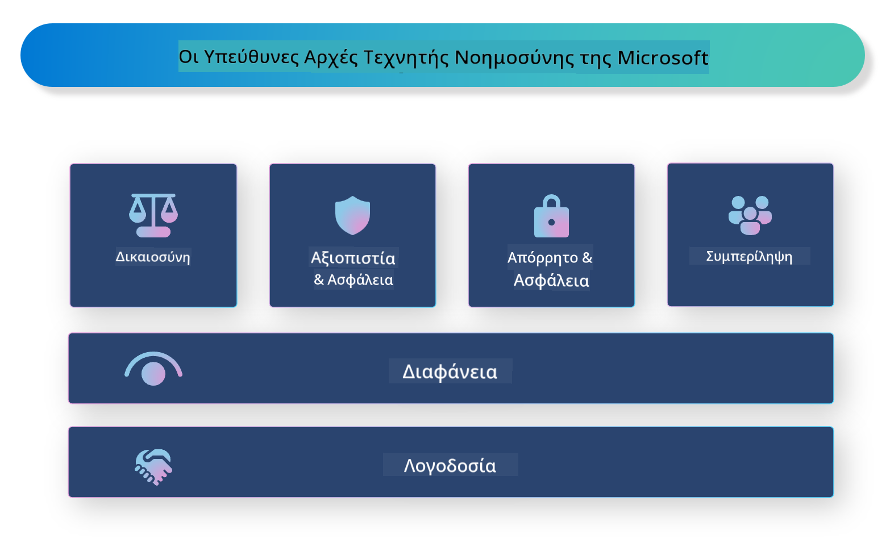

<!--
CO_OP_TRANSLATOR_METADATA:
{
  "original_hash": "805b96b20152936d8f4c587d90d6e06e",
  "translation_date": "2025-05-09T15:33:43+00:00",
  "source_file": "md/01.Introduction/05/ResponsibleAI.md",
  "language_code": "el"
}
-->
# **Εισαγωγή στην Υπεύθυνη Τεχνητή Νοημοσύνη**

[Microsoft Responsible AI](https://www.microsoft.com/ai/responsible-ai?WT.mc_id=aiml-138114-kinfeylo) είναι μια πρωτοβουλία που στοχεύει να βοηθήσει τους προγραμματιστές και τους οργανισμούς να δημιουργήσουν συστήματα τεχνητής νοημοσύνης που είναι διαφανή, αξιόπιστα και υπεύθυνα. Η πρωτοβουλία παρέχει καθοδήγηση και πόρους για την ανάπτυξη υπεύθυνων λύσεων AI που ευθυγραμμίζονται με ηθικές αρχές, όπως το απόρρητο, η δικαιοσύνη και η διαφάνεια. Θα εξερευνήσουμε επίσης κάποιες από τις προκλήσεις και τις βέλτιστες πρακτικές που σχετίζονται με την κατασκευή υπεύθυνων συστημάτων AI.

## Επισκόπηση του Microsoft Responsible AI

**Ηθικές αρχές**

Το Microsoft Responsible AI καθοδηγείται από ένα σύνολο ηθικών αρχών, όπως το απόρρητο, η δικαιοσύνη, η διαφάνεια, η λογοδοσία και η ασφάλεια. Αυτές οι αρχές έχουν σχεδιαστεί για να διασφαλίσουν ότι τα συστήματα AI αναπτύσσονται με ηθικό και υπεύθυνο τρόπο.

**Διαφανής AI**

Το Microsoft Responsible AI τονίζει τη σημασία της διαφάνειας στα συστήματα AI. Αυτό περιλαμβάνει την παροχή σαφών εξηγήσεων για το πώς λειτουργούν τα μοντέλα AI, καθώς και τη διασφάλιση ότι οι πηγές δεδομένων και οι αλγόριθμοι είναι δημόσια διαθέσιμοι.

**Υπεύθυνη AI**

[Microsoft Responsible AI](https://www.microsoft.com/ai/responsible-ai?WT.mc_id=aiml-138114-kinfeylo) προωθεί την ανάπτυξη υπεύθυνων συστημάτων AI, τα οποία μπορούν να παρέχουν πληροφορίες για το πώς τα μοντέλα AI λαμβάνουν αποφάσεις. Αυτό βοηθά τους χρήστες να κατανοήσουν και να εμπιστευτούν τα αποτελέσματα των συστημάτων AI.

**Συμπερίληψη**

Τα συστήματα AI πρέπει να σχεδιάζονται ώστε να ωφελούν όλους. Η Microsoft επιδιώκει να δημιουργήσει συμπεριληπτική AI που λαμβάνει υπόψη ποικίλες οπτικές και αποφεύγει προκαταλήψεις ή διακρίσεις.

**Αξιοπιστία και Ασφάλεια**

Η διασφάλιση ότι τα συστήματα AI είναι αξιόπιστα και ασφαλή είναι κρίσιμη. Η Microsoft επικεντρώνεται στην κατασκευή ανθεκτικών μοντέλων που αποδίδουν σταθερά και αποφεύγουν βλαβερές συνέπειες.

**Δικαιοσύνη στην AI**

Το Microsoft Responsible AI αναγνωρίζει ότι τα συστήματα AI μπορούν να αναπαράγουν προκαταλήψεις εάν εκπαιδευτούν σε μεροληπτικά δεδομένα ή αλγορίθμους. Η πρωτοβουλία παρέχει καθοδήγηση για την ανάπτυξη δίκαιων συστημάτων AI που δεν διακρίνουν με βάση παράγοντες όπως η φυλή, το φύλο ή η ηλικία.

**Απόρρητο και ασφάλεια**

Το Microsoft Responsible AI τονίζει τη σημασία της προστασίας του απορρήτου των χρηστών και της ασφάλειας των δεδομένων στα συστήματα AI. Αυτό περιλαμβάνει την εφαρμογή ισχυρής κρυπτογράφησης δεδομένων και ελέγχων πρόσβασης, καθώς και τακτικούς ελέγχους των συστημάτων AI για ευπάθειες.

**Λογοδοσία και ευθύνη**

Το Microsoft Responsible AI προωθεί τη λογοδοσία και την ευθύνη στην ανάπτυξη και την υλοποίηση της AI. Αυτό περιλαμβάνει τη διασφάλιση ότι οι προγραμματιστές και οι οργανισμοί γνωρίζουν τους πιθανούς κινδύνους που σχετίζονται με τα συστήματα AI και λαμβάνουν μέτρα για την αντιμετώπισή τους.

## Βέλτιστες πρακτικές για την κατασκευή υπεύθυνων συστημάτων AI

**Ανάπτυξη μοντέλων AI με χρήση ποικίλων συνόλων δεδομένων**

Για να αποφευχθούν προκαταλήψεις στα συστήματα AI, είναι σημαντικό να χρησιμοποιούνται ποικίλα σύνολα δεδομένων που αντιπροσωπεύουν ένα ευρύ φάσμα οπτικών και εμπειριών.

**Χρήση τεχνικών εξηγήσιμης AI**

Οι τεχνικές εξηγήσιμης AI βοηθούν τους χρήστες να κατανοήσουν πώς τα μοντέλα AI λαμβάνουν αποφάσεις, αυξάνοντας την εμπιστοσύνη στο σύστημα.

**Τακτικός έλεγχος των συστημάτων AI για ευπάθειες**

Οι τακτικοί έλεγχοι των συστημάτων AI βοηθούν στην αναγνώριση πιθανών κινδύνων και ευπαθειών που πρέπει να αντιμετωπιστούν.

**Εφαρμογή ισχυρής κρυπτογράφησης δεδομένων και ελέγχων πρόσβασης**

Η κρυπτογράφηση δεδομένων και οι έλεγχοι πρόσβασης συμβάλλουν στην προστασία του απορρήτου και της ασφάλειας των χρηστών στα συστήματα AI.

**Τήρηση ηθικών αρχών στην ανάπτυξη AI**

Η τήρηση ηθικών αρχών, όπως η δικαιοσύνη, η διαφάνεια και η λογοδοσία, βοηθά στην οικοδόμηση εμπιστοσύνης στα συστήματα AI και διασφαλίζει ότι αναπτύσσονται με υπεύθυνο τρόπο.

## Χρήση του AI Foundry για Υπεύθυνη AI

[Azure AI Foundry](https://ai.azure.com?WT.mc_id=aiml-138114-kinfeylo) είναι μια ισχυρή πλατφόρμα που επιτρέπει σε προγραμματιστές και οργανισμούς να δημιουργούν γρήγορα ευφυείς, προηγμένες, έτοιμες για την αγορά και υπεύθυνες εφαρμογές. Ακολουθούν μερικά βασικά χαρακτηριστικά και δυνατότητες του Azure AI Foundry:

**Έτοιμα προς χρήση APIs και μοντέλα**

Το Azure AI Foundry παρέχει προ-κατασκευασμένα και παραμετροποιήσιμα APIs και μοντέλα. Αυτά καλύπτουν ένα ευρύ φάσμα εργασιών AI, όπως γενετική AI, επεξεργασία φυσικής γλώσσας για συνομιλίες, αναζήτηση, παρακολούθηση, μετάφραση, ομιλία, όραση και λήψη αποφάσεων.

**Prompt Flow**

Το Prompt Flow στο Azure AI Foundry σας επιτρέπει να δημιουργείτε εμπειρίες συνομιλητικής AI. Σας δίνει τη δυνατότητα να σχεδιάζετε και να διαχειρίζεστε ροές συνομιλίας, διευκολύνοντας την κατασκευή chatbot, εικονικών βοηθών και άλλων διαδραστικών εφαρμογών.

**Retrieval Augmented Generation (RAG)**

Το RAG είναι μια τεχνική που συνδυάζει προσεγγίσεις βασισμένες στην ανάκτηση και στη γενετική δημιουργία. Βελτιώνει την ποιότητα των παραγόμενων απαντήσεων αξιοποιώντας τόσο την προϋπάρχουσα γνώση (ανάκτηση) όσο και τη δημιουργική παραγωγή (γενετική).

**Μέτρηση και παρακολούθηση για γενετική AI**

Το Azure AI Foundry παρέχει εργαλεία για την αξιολόγηση και παρακολούθηση μοντέλων γενετικής AI. Μπορείτε να αξιολογήσετε την απόδοσή τους, τη δικαιοσύνη και άλλες σημαντικές μετρήσεις για να εξασφαλίσετε υπεύθυνη υλοποίηση. Επιπλέον, αν έχετε δημιουργήσει έναν πίνακα ελέγχου, μπορείτε να χρησιμοποιήσετε το no-code UI στο Azure Machine Learning Studio για να προσαρμόσετε και να δημιουργήσετε έναν Πίνακα Υπεύθυνης AI και το σχετικό scorecard βασισμένο στις [Repsonsible AI Toolbox](https://responsibleaitoolbox.ai/?WT.mc_id=aiml-138114-kinfeylo) Python Libraries. Αυτό το scorecard βοηθά να μοιραστείτε βασικές πληροφορίες σχετικά με τη δικαιοσύνη, τη σημασία χαρακτηριστικών και άλλες παραμέτρους υπεύθυνης υλοποίησης με τεχνικούς και μη τεχνικούς ενδιαφερόμενους.

Για να χρησιμοποιήσετε το AI Foundry με υπεύθυνη AI, μπορείτε να ακολουθήσετε αυτές τις βέλτιστες πρακτικές:

**Ορίστε το πρόβλημα και τους στόχους του συστήματος AI**

Πριν ξεκινήσετε τη διαδικασία ανάπτυξης, είναι σημαντικό να ορίσετε με σαφήνεια το πρόβλημα ή τον στόχο που επιδιώκει να λύσει το σύστημά σας AI. Αυτό θα σας βοηθήσει να προσδιορίσετε τα δεδομένα, τους αλγόριθμους και τους πόρους που χρειάζεστε για να δημιουργήσετε ένα αποτελεσματικό μοντέλο.

**Συλλογή και προεπεξεργασία σχετικών δεδομένων**

Η ποιότητα και η ποσότητα των δεδομένων που χρησιμοποιούνται για την εκπαίδευση ενός συστήματος AI επηρεάζουν σημαντικά την απόδοσή του. Επομένως, είναι σημαντικό να συλλέγετε σχετικά δεδομένα, να τα καθαρίζετε, να τα προεπεξεργάζεστε και να διασφαλίζετε ότι αντιπροσωπεύουν τον πληθυσμό ή το πρόβλημα που προσπαθείτε να λύσετε.

**Επιλογή κατάλληλης αξιολόγησης**

Υπάρχουν διάφοροι αλγόριθμοι αξιολόγησης διαθέσιμοι. Είναι σημαντικό να επιλέξετε τον πιο κατάλληλο αλγόριθμο βάσει των δεδομένων και του προβλήματός σας.

**Αξιολόγηση και ερμηνεία του μοντέλου**

Αφού δημιουργήσετε ένα μοντέλο AI, είναι σημαντικό να αξιολογήσετε την απόδοσή του χρησιμοποιώντας κατάλληλες μετρήσεις και να ερμηνεύσετε τα αποτελέσματα με διαφάνεια. Αυτό θα σας βοηθήσει να εντοπίσετε τυχόν προκαταλήψεις ή περιορισμούς στο μοντέλο και να κάνετε βελτιώσεις όπου χρειάζεται.

**Διασφάλιση διαφάνειας και εξηγήσιμότητας**

Τα συστήματα AI πρέπει να είναι διαφανή και εξηγήσιμα, ώστε οι χρήστες να μπορούν να κατανοήσουν πώς λειτουργούν και πώς λαμβάνονται οι αποφάσεις. Αυτό είναι ιδιαίτερα σημαντικό για εφαρμογές που έχουν σημαντικές επιπτώσεις στη ζωή των ανθρώπων, όπως στην υγειονομική περίθαλψη, τα οικονομικά και τα νομικά συστήματα.

**Παρακολούθηση και ενημέρωση του μοντέλου**

Τα συστήματα AI πρέπει να παρακολουθούνται και να ενημερώνονται συνεχώς ώστε να παραμένουν ακριβή και αποτελεσματικά με την πάροδο του χρόνου. Αυτό απαιτεί συνεχή συντήρηση, δοκιμές και επανεκπαίδευση του μοντέλου.

Συνοψίζοντας, το Microsoft Responsible AI είναι μια πρωτοβουλία που στοχεύει να βοηθήσει τους προγραμματιστές και τους οργανισμούς να δημιουργήσουν συστήματα AI που είναι διαφανή, αξιόπιστα και υπεύθυνα. Να θυμάστε ότι η υπεύθυνη εφαρμογή της AI είναι κρίσιμη, και το Azure AI Foundry στοχεύει να την καταστήσει πρακτική για τους οργανισμούς. Ακολουθώντας ηθικές αρχές και βέλτιστες πρακτικές, μπορούμε να εξασφαλίσουμε ότι τα συστήματα AI αναπτύσσονται και υλοποιούνται με υπεύθυνο τρόπο που ωφελεί την κοινωνία συνολικά.

**Αποποίηση ευθυνών**:  
Αυτό το έγγραφο έχει μεταφραστεί χρησιμοποιώντας την υπηρεσία μετάφρασης με τεχνητή νοημοσύνη [Co-op Translator](https://github.com/Azure/co-op-translator). Παρόλο που επιδιώκουμε την ακρίβεια, παρακαλούμε να λάβετε υπόψη ότι οι αυτόματες μεταφράσεις μπορεί να περιέχουν λάθη ή ανακρίβειες. Το πρωτότυπο έγγραφο στη γλώσσα του θεωρείται η αυθεντική πηγή. Για κρίσιμες πληροφορίες, συνιστάται επαγγελματική μετάφραση από ανθρώπους. Δεν φέρουμε ευθύνη για τυχόν παρεξηγήσεις ή λανθασμένες ερμηνείες που προκύπτουν από τη χρήση αυτής της μετάφρασης.