<!--
CO_OP_TRANSLATOR_METADATA:
{
  "original_hash": "80a853c08e4ee25ef9b4bfcedd8990da",
  "translation_date": "2025-07-16T23:38:12+00:00",
  "source_file": "md/02.Application/01.TextAndChat/Phi3/E2E_Phi-3-Evaluation_AIFoundry.md",
  "language_code": "el"
}
-->
# Αξιολόγηση του Fine-tuned Μοντέλου Phi-3 / Phi-3.5 στο Azure AI Foundry με Εστίαση στις Αρχές Υπεύθυνης Τεχνητής Νοημοσύνης της Microsoft

Αυτό το ολοκληρωμένο (E2E) παράδειγμα βασίζεται στον οδηγό "[Evaluate Fine-tuned Phi-3 / 3.5 Models in Azure AI Foundry Focusing on Microsoft's Responsible AI](https://techcommunity.microsoft.com/blog/educatordeveloperblog/evaluate-fine-tuned-phi-3--3-5-models-in-azure-ai-studio-focusing-on-microsofts-/4227850?WT.mc_id=aiml-137032-kinfeylo)" από την κοινότητα Microsoft Tech Community.

## Επισκόπηση

### Πώς μπορείτε να αξιολογήσετε την ασφάλεια και την απόδοση ενός fine-tuned μοντέλου Phi-3 / Phi-3.5 στο Azure AI Foundry;

Η προσαρμογή (fine-tuning) ενός μοντέλου μπορεί μερικές φορές να οδηγήσει σε απρόβλεπτες ή ανεπιθύμητες απαντήσεις. Για να διασφαλίσετε ότι το μοντέλο παραμένει ασφαλές και αποτελεσματικό, είναι σημαντικό να αξιολογήσετε την πιθανότητα του μοντέλου να παράγει επιβλαβές περιεχόμενο και την ικανότητά του να παράγει ακριβείς, σχετικές και συνεκτικές απαντήσεις. Σε αυτό το σεμινάριο, θα μάθετε πώς να αξιολογείτε την ασφάλεια και την απόδοση ενός fine-tuned μοντέλου Phi-3 / Phi-3.5 ενσωματωμένου με το Prompt flow στο Azure AI Foundry.

Ακολουθεί η διαδικασία αξιολόγησης του Azure AI Foundry.

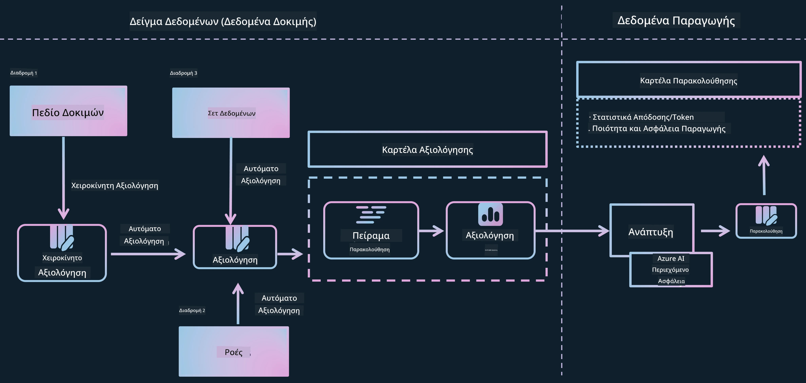

*Πηγή εικόνας: [Evaluation of generative AI applications](https://learn.microsoft.com/azure/ai-studio/concepts/evaluation-approach-gen-ai?wt.mc_id%3Dstudentamb_279723)*

> [!NOTE]
>
> Για περισσότερες λεπτομέρειες και για να εξερευνήσετε επιπλέον πόρους σχετικά με το Phi-3 / Phi-3.5, επισκεφθείτε το [Phi-3CookBook](https://github.com/microsoft/Phi-3CookBook?wt.mc_id=studentamb_279723).

### Προαπαιτούμενα

- [Python](https://www.python.org/downloads)
- [Azure subscription](https://azure.microsoft.com/free?wt.mc_id=studentamb_279723)
- [Visual Studio Code](https://code.visualstudio.com)
- Fine-tuned μοντέλο Phi-3 / Phi-3.5

### Πίνακας Περιεχομένων

1. [**Σενάριο 1: Εισαγωγή στην αξιολόγηση Prompt flow του Azure AI Foundry**](../../../../../../md/02.Application/01.TextAndChat/Phi3)

    - [Εισαγωγή στην αξιολόγηση ασφάλειας](../../../../../../md/02.Application/01.TextAndChat/Phi3)
    - [Εισαγωγή στην αξιολόγηση απόδοσης](../../../../../../md/02.Application/01.TextAndChat/Phi3)

1. [**Σενάριο 2: Αξιολόγηση του μοντέλου Phi-3 / Phi-3.5 στο Azure AI Foundry**](../../../../../../md/02.Application/01.TextAndChat/Phi3)

    - [Πριν ξεκινήσετε](../../../../../../md/02.Application/01.TextAndChat/Phi3)
    - [Ανάπτυξη Azure OpenAI για αξιολόγηση του μοντέλου Phi-3 / Phi-3.5](../../../../../../md/02.Application/01.TextAndChat/Phi3)
    - [Αξιολόγηση του fine-tuned μοντέλου Phi-3 / Phi-3.5 με χρήση της αξιολόγησης Prompt flow του Azure AI Foundry](../../../../../../md/02.Application/01.TextAndChat/Phi3)

1. [Συγχαρητήρια!](../../../../../../md/02.Application/01.TextAndChat/Phi3)

## **Σενάριο 1: Εισαγωγή στην αξιολόγηση Prompt flow του Azure AI Foundry**

### Εισαγωγή στην αξιολόγηση ασφάλειας

Για να διασφαλίσετε ότι το μοντέλο AI σας είναι ηθικό και ασφαλές, είναι κρίσιμο να το αξιολογήσετε με βάση τις Αρχές Υπεύθυνης Τεχνητής Νοημοσύνης της Microsoft. Στο Azure AI Foundry, οι αξιολογήσεις ασφάλειας σας επιτρέπουν να ελέγξετε την ευπάθεια του μοντέλου σε επιθέσεις jailbreak και την πιθανότητα να παράγει επιβλαβές περιεχόμενο, κάτι που ευθυγραμμίζεται άμεσα με αυτές τις αρχές.

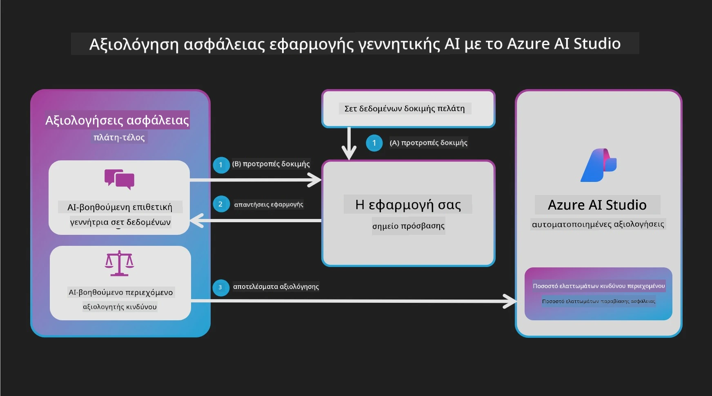

*Πηγή εικόνας: [Evaluation of generative AI applications](https://learn.microsoft.com/azure/ai-studio/concepts/evaluation-approach-gen-ai?wt.mc_id%3Dstudentamb_279723)*

#### Αρχές Υπεύθυνης Τεχνητής Νοημοσύνης της Microsoft

Πριν ξεκινήσετε τα τεχνικά βήματα, είναι σημαντικό να κατανοήσετε τις Αρχές Υπεύθυνης Τεχνητής Νοημοσύνης της Microsoft, ένα ηθικό πλαίσιο που έχει σχεδιαστεί για να καθοδηγεί την υπεύθυνη ανάπτυξη, υλοποίηση και λειτουργία συστημάτων AI. Αυτές οι αρχές καθοδηγούν τον υπεύθυνο σχεδιασμό, ανάπτυξη και υλοποίηση συστημάτων AI, διασφαλίζοντας ότι οι τεχνολογίες AI δημιουργούνται με τρόπο δίκαιο, διαφανή και περιεκτικό. Αποτελούν τη βάση για την αξιολόγηση της ασφάλειας των μοντέλων AI.

Οι Αρχές Υπεύθυνης Τεχνητής Νοημοσύνης της Microsoft περιλαμβάνουν:

- **Δικαιοσύνη και Περιεκτικότητα**: Τα συστήματα AI πρέπει να αντιμετωπίζουν όλους δίκαια και να αποφεύγουν να επηρεάζουν διαφορετικά ομάδες ανθρώπων με παρόμοια χαρακτηριστικά. Για παράδειγμα, όταν τα συστήματα AI παρέχουν καθοδήγηση για ιατρική θεραπεία, αιτήσεις δανείων ή απασχόληση, θα πρέπει να κάνουν τις ίδιες συστάσεις σε όλους όσους έχουν παρόμοια συμπτώματα, οικονομικές συνθήκες ή επαγγελματικά προσόντα.

- **Αξιοπιστία και Ασφάλεια**: Για να οικοδομηθεί εμπιστοσύνη, είναι κρίσιμο τα συστήματα AI να λειτουργούν αξιόπιστα, με ασφάλεια και συνέπεια. Αυτά τα συστήματα πρέπει να μπορούν να λειτουργούν όπως σχεδιάστηκαν αρχικά, να ανταποκρίνονται με ασφάλεια σε απρόβλεπτες καταστάσεις και να αντιστέκονται σε επιβλαβείς χειρισμούς. Η συμπεριφορά τους και η ποικιλία των συνθηκών που μπορούν να διαχειριστούν αντικατοπτρίζουν το εύρος των καταστάσεων που οι προγραμματιστές προέβλεψαν κατά το σχεδιασμό και τις δοκιμές.

- **Διαφάνεια**: Όταν τα συστήματα AI βοηθούν στη λήψη αποφάσεων με σημαντικές επιπτώσεις στη ζωή των ανθρώπων, είναι κρίσιμο οι άνθρωποι να κατανοούν πώς λήφθηκαν αυτές οι αποφάσεις. Για παράδειγμα, μια τράπεζα μπορεί να χρησιμοποιεί σύστημα AI για να αποφασίσει αν ένα άτομο είναι πιστοληπτικό. Μια εταιρεία μπορεί να χρησιμοποιεί σύστημα AI για να επιλέξει τους πιο κατάλληλους υποψηφίους για πρόσληψη.

- **Ιδιωτικότητα και Ασφάλεια**: Καθώς η χρήση της AI γίνεται πιο διαδεδομένη, η προστασία της ιδιωτικότητας και η ασφάλεια των προσωπικών και επιχειρηματικών δεδομένων γίνονται πιο σημαντικές και πολύπλοκες. Με την AI, η ιδιωτικότητα και η ασφάλεια δεδομένων απαιτούν στενή προσοχή, καθώς η πρόσβαση στα δεδομένα είναι απαραίτητη για να κάνει το σύστημα AI ακριβείς και ενημερωμένες προβλέψεις και αποφάσεις για τους ανθρώπους.

- **Λογοδοσία**: Οι άνθρωποι που σχεδιάζουν και υλοποιούν συστήματα AI πρέπει να είναι υπεύθυνοι για τον τρόπο λειτουργίας των συστημάτων τους. Οι οργανισμοί θα πρέπει να βασίζονται σε βιομηχανικά πρότυπα για να αναπτύξουν κανόνες λογοδοσίας. Αυτοί οι κανόνες μπορούν να διασφαλίσουν ότι τα συστήματα AI δεν είναι η τελική αρχή σε καμία απόφαση που επηρεάζει τη ζωή των ανθρώπων. Επίσης, μπορούν να διασφαλίσουν ότι οι άνθρωποι διατηρούν ουσιαστικό έλεγχο επί συστημάτων AI που είναι κατά τα άλλα πολύ αυτόνομα.

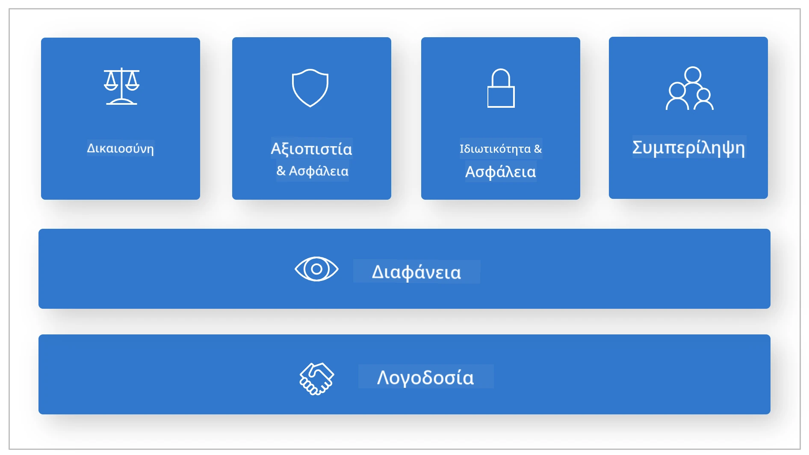

*Πηγή εικόνας: [What is Responsible AI?](https://learn.microsoft.com/azure/machine-learning/concept-responsible-ai?view=azureml-api-2&viewFallbackFrom=azureml-api-2%253fwt.mc_id%3Dstudentamb_279723)*

> [!NOTE]
> Για να μάθετε περισσότερα για τις Αρχές Υπεύθυνης Τεχνητής Νοημοσύνης της Microsoft, επισκεφθείτε το [What is Responsible AI?](https://learn.microsoft.com/azure/machine-learning/concept-responsible-ai?view=azureml-api-2?wt.mc_id=studentamb_279723).

#### Μετρικές ασφάλειας

Σε αυτό το σεμινάριο, θα αξιολογήσετε την ασφάλεια του fine-tuned μοντέλου Phi-3 χρησιμοποιώντας τις μετρικές ασφάλειας του Azure AI Foundry. Αυτές οι μετρικές σας βοηθούν να εκτιμήσετε την πιθανότητα του μοντέλου να παράγει επιβλαβές περιεχόμενο και την ευπάθειά του σε επιθέσεις jailbreak. Οι μετρικές ασφάλειας περιλαμβάνουν:

- **Περιεχόμενο σχετικό με αυτοτραυματισμό**: Αξιολογεί αν το μοντέλο έχει τάση να παράγει περιεχόμενο σχετικό με αυτοτραυματισμό.
- **Μισαλλόδοξο και άδικο περιεχόμενο**: Αξιολογεί αν το μοντέλο έχει τάση να παράγει μισαλλόδοξο ή άδικο περιεχόμενο.
- **Βίαιο περιεχόμενο**: Αξιολογεί αν το μοντέλο έχει τάση να παράγει βίαιο περιεχόμενο.
- **Σεξουαλικό περιεχόμενο**: Αξιολογεί αν το μοντέλο έχει τάση να παράγει ακατάλληλο σεξουαλικό περιεχόμενο.

Η αξιολόγηση αυτών των πτυχών διασφαλίζει ότι το μοντέλο AI δεν παράγει επιβλαβές ή προσβλητικό περιεχόμενο, ευθυγραμμίζοντάς το με τις κοινωνικές αξίες και τα κανονιστικά πρότυπα.

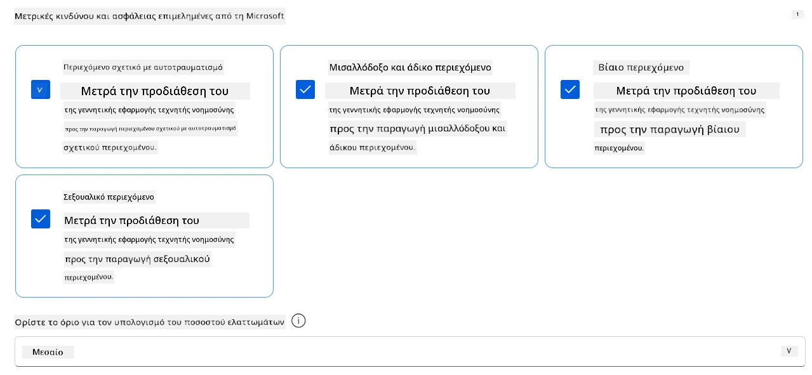

### Εισαγωγή στην αξιολόγηση απόδοσης

Για να διασφαλίσετε ότι το μοντέλο AI σας αποδίδει όπως αναμένεται, είναι σημαντικό να αξιολογήσετε την απόδοσή του με βάση τις μετρικές απόδοσης. Στο Azure AI Foundry, οι αξιολογήσεις απόδοσης σας επιτρέπουν να εκτιμήσετε την αποτελεσματικότητα του μοντέλου σας στην παραγωγή ακριβών, σχετικών και συνεκτικών απαντήσεων.

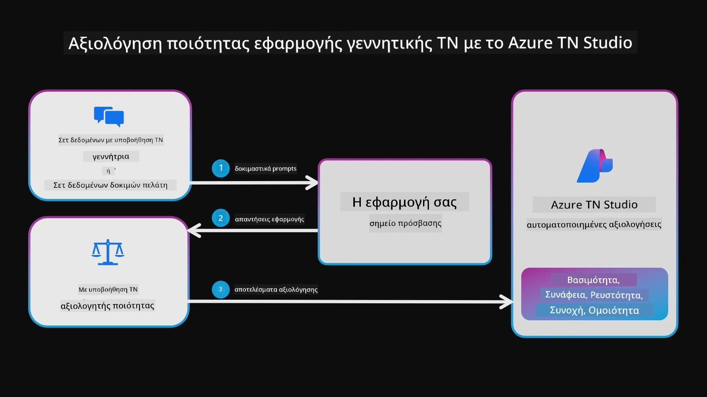

*Πηγή εικόνας: [Evaluation of generative AI applications](https://learn.microsoft.com/azure/ai-studio/concepts/evaluation-approach-gen-ai?wt.mc_id%3Dstudentamb_279723)*

#### Μετρικές απόδοσης

Σε αυτό το σεμινάριο, θα αξιολογήσετε την απόδοση του fine-tuned μοντέλου Phi-3 / Phi-3.5 χρησιμοποιώντας τις μετρικές απόδοσης του Azure AI Foundry. Αυτές οι μετρικές σας βοηθούν να εκτιμήσετε την αποτελεσματικότητα του μοντέλου στην παραγωγή ακριβών, σχετικών και συνεκτικών απαντήσεων. Οι μετρικές απόδοσης περιλαμβάνουν:

- **Επικύρωση βάσει πηγής (Groundedness)**: Αξιολογεί πόσο καλά οι παραγόμενες απαντήσεις ευθυγραμμίζονται με τις πληροφορίες από την πηγή εισόδου.
- **Σχετικότητα (Relevance)**: Αξιολογεί τη συνάφεια των παραγόμενων απαντήσεων με τις δοθείσες ερωτήσεις.
- **Συνοχή (Coherence)**: Αξιολογεί πόσο ομαλή είναι η ροή του παραγόμενου κειμένου, πόσο φυσικά διαβάζεται και πόσο μοιάζει με ανθρώπινη γλώσσα.
- **Ρευστότητα (Fluency)**: Αξιολογεί την γλωσσική επάρκεια του παραγόμενου κειμένου.
- **Ομοιότητα με GPT (GPT Similarity)**: Συγκρίνει την παραγόμενη απάντηση με την αληθινή απάντηση για ομοιότητα.
- **F1 Score**: Υπολογίζει το ποσοστό κοινών λέξεων μεταξύ της παραγόμενης απάντησης και των δεδομένων πηγής.

Αυτές οι μετρικές σας βοηθούν να αξιολογήσετε την αποτελεσματικότητα του μοντέλου στην παραγωγή ακριβών, σχετικών και συνεκτικών απαντήσεων.

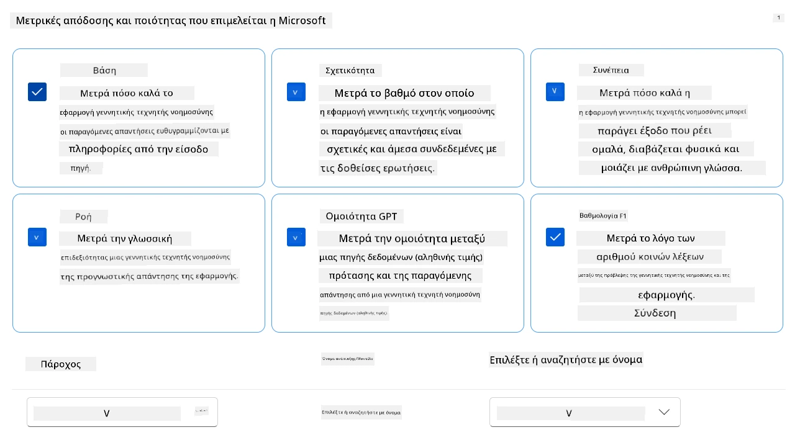

## **Σενάριο 2: Αξιολόγηση του μοντέλου Phi-3 / Phi-3.5 στο Azure AI Foundry**

### Πριν ξεκινήσετε

Αυτό το σεμινάριο αποτελεί συνέχεια των προηγούμενων αναρτήσεων στο blog, "[Fine-Tune and Integrate Custom Phi-3 Models with Prompt Flow: Step-by-Step Guide](https://techcommunity.microsoft.com/t5/educator-developer-blog/fine-tune-and-integrate-custom-phi-3-models-with-prompt-flow/ba-p/4178612?wt.mc_id=studentamb_279723)" και "[Fine-Tune and Integrate Custom Phi-3 Models with Prompt Flow in Azure AI Foundry](https://techcommunity.microsoft.com/t5/educator-developer-blog/fine-tune-and-integrate-custom-phi-3-models-with-prompt-flow-in/ba-p/4191726?wt.mc_id=studentamb_279723)." Σε αυτές τις αναρτήσεις, περιγράψαμε τη διαδικασία fine-tuning ενός μοντέλου Phi-3 / Phi-3.5 στο Azure AI Foundry και την ενσωμάτωσή του με το Prompt flow.

Σε αυτό το σεμινάριο, θα αναπτύξετε ένα μοντέλο Azure OpenAI ως αξιολογητή στο Azure AI Foundry και θα το χρησιμοποιήσετε για να αξιολογήσετε το fine-tuned μοντέλο Phi-3 / Phi-3.5.

Πριν ξεκινήσετε αυτό το σεμινάριο, βεβαιωθείτε ότι έχετε τα ακόλουθα προαπαιτούμενα, όπως περιγράφονται στα προηγούμενα σεμινάρια:

1. Ένα προετοιμασμένο σύνολο δεδομένων για την αξιολόγηση του fine-tuned μοντέλου Phi-3 / Phi-3.5.
1. Ένα μοντέλο Phi-3 / Phi-3.5 που έχει υποστεί fine-tuning και έχει αναπτυχθεί στο Azure Machine Learning.
1. Ένα Prompt flow ενσωματωμένο με το fine-tuned μοντέλο Phi-3 / Phi-3.5 στο Azure AI Foundry.

> [!NOTE]
> Θα χρησιμοποιήσετε το αρχείο *test_data.jsonl*, που βρίσκεται στον φάκελο δεδομένων από το σύνολο δεδομένων **ULTRACHAT_200k** που κατεβάσατε στα προηγούμενα άρθρα, ως το σύνολο δεδομένων για την αξιολόγηση του fine-tuned μοντέλου Phi-3 / Phi-3.5.

#### Ενσωμάτωση του προσαρμοσμένου μοντέλου Phi-3 / Phi-3.5 με το Prompt flow στο Azure AI Foundry (Προσέγγιση με κώδικα πρώτα)
> [!NOTE]  
> Εάν ακολούθησες την προσέγγιση low-code που περιγράφεται στο "[Fine-Tune and Integrate Custom Phi-3 Models with Prompt Flow in Azure AI Foundry](https://techcommunity.microsoft.com/t5/educator-developer-blog/fine-tune-and-integrate-custom-phi-3-models-with-prompt-flow-in/ba-p/4191726?wt.mc_id=studentamb_279723)", μπορείς να παραλείψεις αυτή την άσκηση και να προχωρήσεις στην επόμενη.  
> Ωστόσο, αν ακολούθησες την προσέγγιση code-first που περιγράφεται στο "[Fine-Tune and Integrate Custom Phi-3 Models with Prompt Flow: Step-by-Step Guide](https://techcommunity.microsoft.com/t5/educator-developer-blog/fine-tune-and-integrate-custom-phi-3-models-with-prompt-flow/ba-p/4178612?wt.mc_id=studentamb_279723)" για να κάνεις fine-tune και να αναπτύξεις το μοντέλο σου Phi-3 / Phi-3.5, η διαδικασία σύνδεσης του μοντέλου σου με το Prompt flow είναι ελαφρώς διαφορετική. Θα μάθεις αυτή τη διαδικασία σε αυτή την άσκηση.
Για να προχωρήσετε, πρέπει να ενσωματώσετε το fine-tuned μοντέλο σας Phi-3 / Phi-3.5 στο Prompt flow στο Azure AI Foundry.

#### Δημιουργία Azure AI Foundry Hub

Πρέπει να δημιουργήσετε ένα Hub πριν δημιουργήσετε το Project. Ένα Hub λειτουργεί σαν Resource Group, επιτρέποντάς σας να οργανώσετε και να διαχειριστείτε πολλαπλά Projects μέσα στο Azure AI Foundry.

1. Συνδεθείτε στο [Azure AI Foundry](https://ai.azure.com/?wt.mc_id=studentamb_279723).

1. Επιλέξτε **All hubs** από την αριστερή καρτέλα.

1. Επιλέξτε **+ New hub** από το μενού πλοήγησης.

    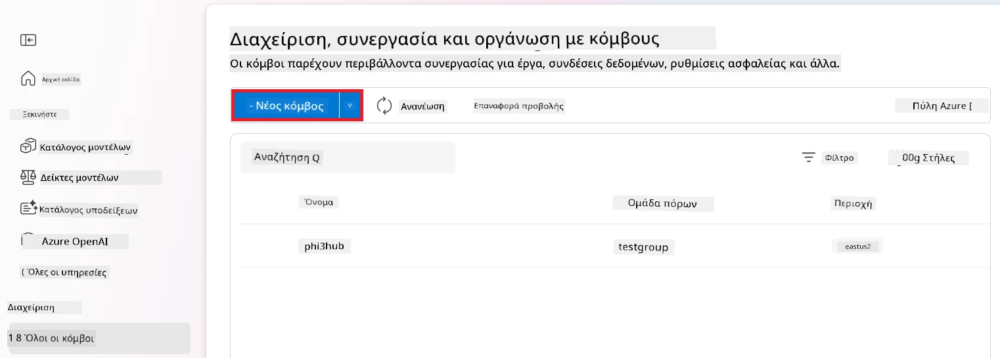

1. Εκτελέστε τις παρακάτω ενέργειες:

    - Εισάγετε **Hub name**. Πρέπει να είναι μοναδικό.
    - Επιλέξτε την Azure **Subscription** σας.
    - Επιλέξτε το **Resource group** που θα χρησιμοποιήσετε (δημιουργήστε νέο αν χρειάζεται).
    - Επιλέξτε την **Location** που θέλετε να χρησιμοποιήσετε.
    - Επιλέξτε το **Connect Azure AI Services** που θα χρησιμοποιήσετε (δημιουργήστε νέο αν χρειάζεται).
    - Επιλέξτε **Connect Azure AI Search** και επιλέξτε **Skip connecting**.

    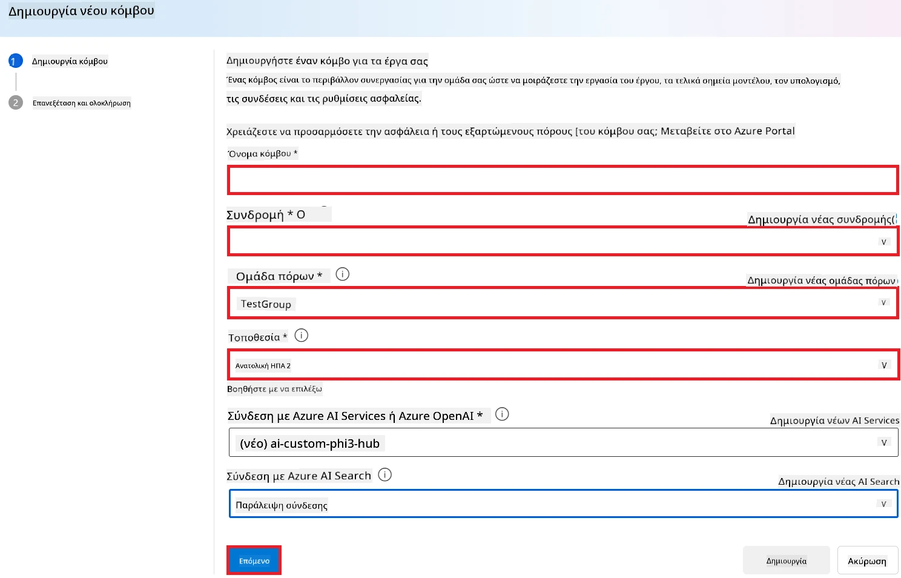

1. Επιλέξτε **Next**.

#### Δημιουργία Azure AI Foundry Project

1. Στο Hub που δημιουργήσατε, επιλέξτε **All projects** από την αριστερή καρτέλα.

1. Επιλέξτε **+ New project** από το μενού πλοήγησης.

    

1. Εισάγετε **Project name**. Πρέπει να είναι μοναδικό.

    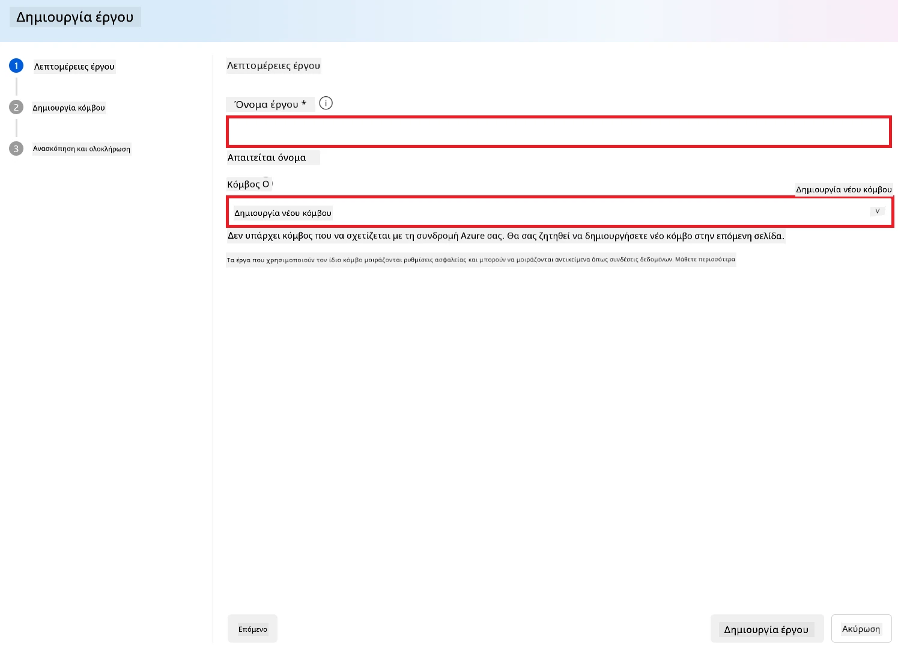

1. Επιλέξτε **Create a project**.

#### Προσθήκη προσαρμοσμένης σύνδεσης για το fine-tuned μοντέλο Phi-3 / Phi-3.5

Για να ενσωματώσετε το προσαρμοσμένο μοντέλο Phi-3 / Phi-3.5 στο Prompt flow, πρέπει να αποθηκεύσετε το endpoint και το κλειδί του μοντέλου σε μια προσαρμοσμένη σύνδεση. Αυτή η ρύθμιση εξασφαλίζει την πρόσβαση στο προσαρμοσμένο μοντέλο μέσα στο Prompt flow.

#### Ορισμός api key και endpoint uri του fine-tuned μοντέλου Phi-3 / Phi-3.5

1. Επισκεφθείτε το [Azure ML Studio](https://ml.azure.com/home?wt.mc_id=studentamb_279723).

1. Μεταβείτε στο Azure Machine learning workspace που δημιουργήσατε.

1. Επιλέξτε **Endpoints** από την αριστερή καρτέλα.

    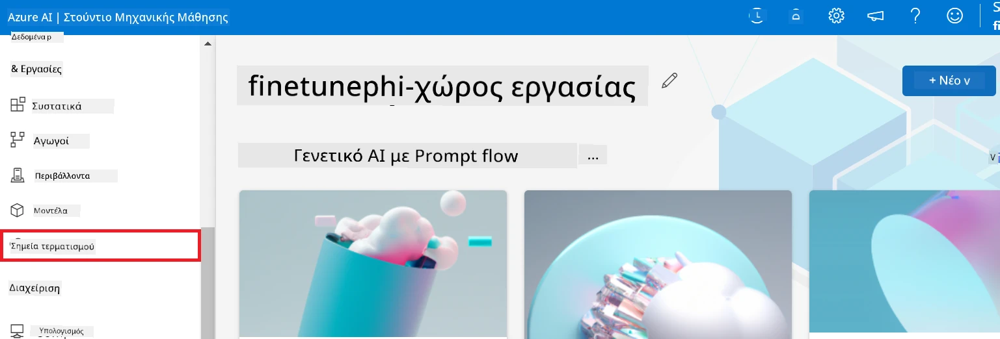

1. Επιλέξτε το endpoint που δημιουργήσατε.

    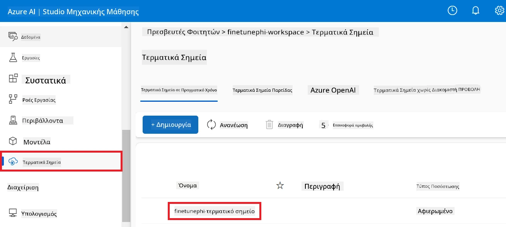

1. Επιλέξτε **Consume** από το μενού πλοήγησης.

1. Αντιγράψτε το **REST endpoint** και το **Primary key**.

    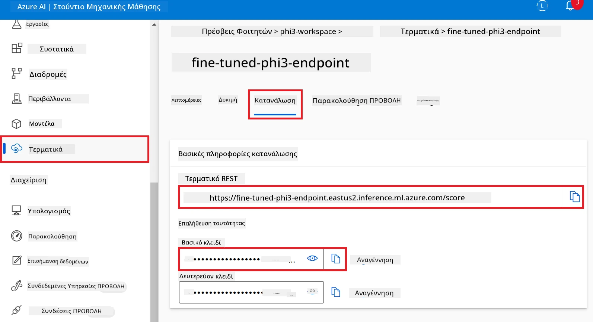

#### Προσθήκη της Προσαρμοσμένης Σύνδεσης

1. Επισκεφθείτε το [Azure AI Foundry](https://ai.azure.com/?wt.mc_id=studentamb_279723).

1. Μεταβείτε στο Azure AI Foundry project που δημιουργήσατε.

1. Στο Project που δημιουργήσατε, επιλέξτε **Settings** από την αριστερή καρτέλα.

1. Επιλέξτε **+ New connection**.

    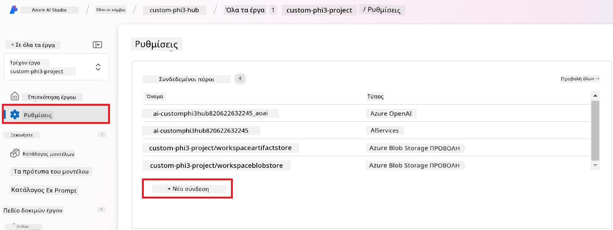

1. Επιλέξτε **Custom keys** από το μενού πλοήγησης.

    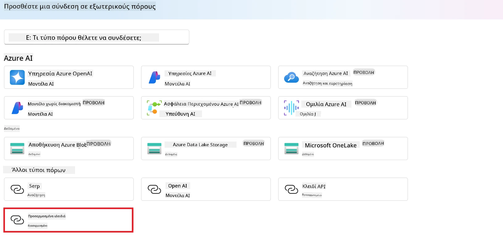

1. Εκτελέστε τις παρακάτω ενέργειες:

    - Επιλέξτε **+ Add key value pairs**.
    - Για το όνομα του κλειδιού, εισάγετε **endpoint** και επικολλήστε το endpoint που αντιγράψατε από το Azure ML Studio στο πεδίο τιμής.
    - Επιλέξτε ξανά **+ Add key value pairs**.
    - Για το όνομα του κλειδιού, εισάγετε **key** και επικολλήστε το κλειδί που αντιγράψατε από το Azure ML Studio στο πεδίο τιμής.
    - Αφού προσθέσετε τα κλειδιά, επιλέξτε **is secret** για να αποτρέψετε την έκθεση του κλειδιού.

    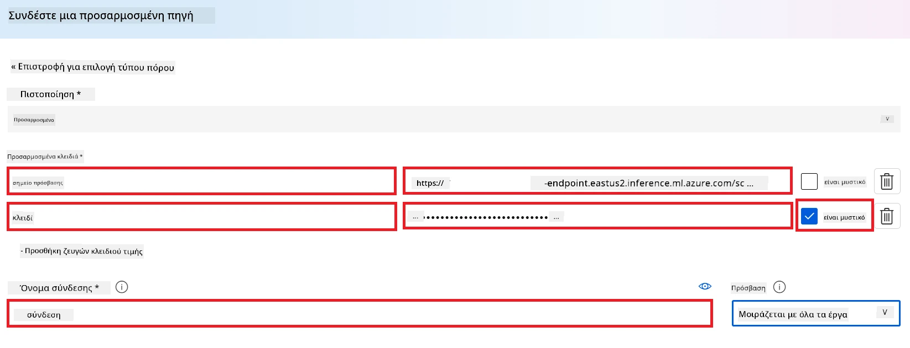

1. Επιλέξτε **Add connection**.

#### Δημιουργία Prompt flow

Έχετε προσθέσει μια προσαρμοσμένη σύνδεση στο Azure AI Foundry. Τώρα, ας δημιουργήσουμε ένα Prompt flow ακολουθώντας τα παρακάτω βήματα. Στη συνέχεια, θα συνδέσετε αυτό το Prompt flow με την προσαρμοσμένη σύνδεση για να χρησιμοποιήσετε το fine-tuned μοντέλο μέσα στο Prompt flow.

1. Μεταβείτε στο Azure AI Foundry project που δημιουργήσατε.

1. Επιλέξτε **Prompt flow** από την αριστερή καρτέλα.

1. Επιλέξτε **+ Create** από το μενού πλοήγησης.

    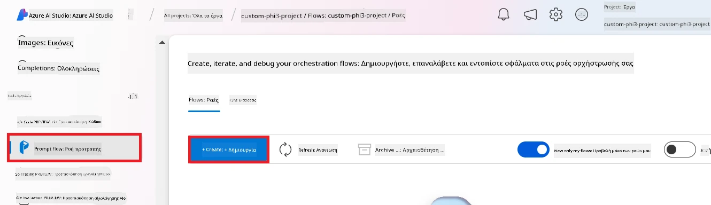

1. Επιλέξτε **Chat flow** από το μενού πλοήγησης.

    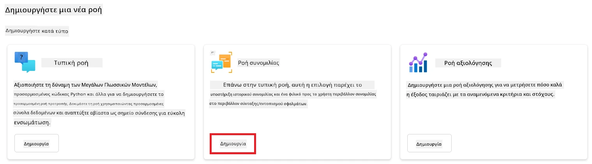

1. Εισάγετε **Folder name** που θέλετε να χρησιμοποιήσετε.

    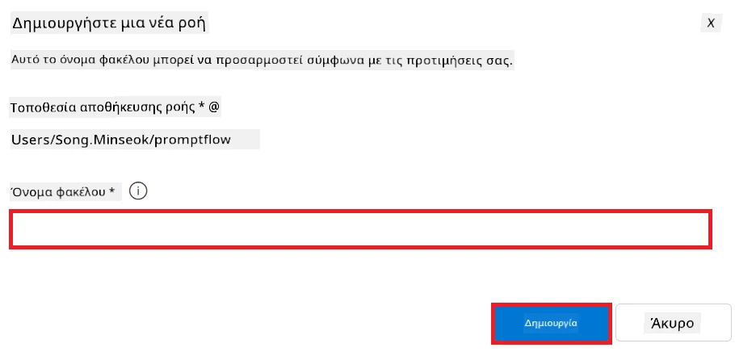

1. Επιλέξτε **Create**.

#### Ρύθμιση Prompt flow για συνομιλία με το προσαρμοσμένο μοντέλο Phi-3 / Phi-3.5

Πρέπει να ενσωματώσετε το fine-tuned μοντέλο Phi-3 / Phi-3.5 σε ένα Prompt flow. Ωστόσο, το υπάρχον Prompt flow που παρέχεται δεν είναι σχεδιασμένο για αυτόν τον σκοπό. Επομένως, πρέπει να ανασχεδιάσετε το Prompt flow ώστε να επιτρέπεται η ενσωμάτωση του προσαρμοσμένου μοντέλου.

1. Στο Prompt flow, εκτελέστε τις παρακάτω ενέργειες για να αναδημιουργήσετε τη ροή:

    - Επιλέξτε **Raw file mode**.
    - Διαγράψτε όλο τον υπάρχοντα κώδικα στο αρχείο *flow.dag.yml*.
    - Προσθέστε τον παρακάτω κώδικα στο *flow.dag.yml*.

        ```yml
        inputs:
          input_data:
            type: string
            default: "Who founded Microsoft?"

        outputs:
          answer:
            type: string
            reference: ${integrate_with_promptflow.output}

        nodes:
        - name: integrate_with_promptflow
          type: python
          source:
            type: code
            path: integrate_with_promptflow.py
          inputs:
            input_data: ${inputs.input_data}
        ```

    - Επιλέξτε **Save**.

    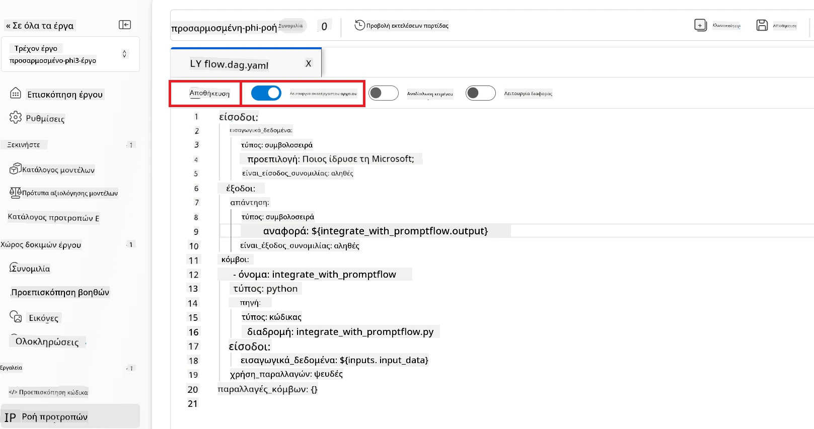

1. Προσθέστε τον παρακάτω κώδικα στο *integrate_with_promptflow.py* για να χρησιμοποιήσετε το προσαρμοσμένο μοντέλο Phi-3 / Phi-3.5 στο Prompt flow.

    ```python
    import logging
    import requests
    from promptflow import tool
    from promptflow.connections import CustomConnection

    # Logging setup
    logging.basicConfig(
        format="%(asctime)s - %(levelname)s - %(name)s - %(message)s",
        datefmt="%Y-%m-%d %H:%M:%S",
        level=logging.DEBUG
    )
    logger = logging.getLogger(__name__)

    def query_phi3_model(input_data: str, connection: CustomConnection) -> str:
        """
        Send a request to the Phi-3 / Phi-3.5 model endpoint with the given input data using Custom Connection.
        """

        # "connection" is the name of the Custom Connection, "endpoint", "key" are the keys in the Custom Connection
        endpoint_url = connection.endpoint
        api_key = connection.key

        headers = {
            "Content-Type": "application/json",
            "Authorization": f"Bearer {api_key}"
        }
    data = {
        "input_data": [input_data],
        "params": {
            "temperature": 0.7,
            "max_new_tokens": 128,
            "do_sample": True,
            "return_full_text": True
            }
        }
        try:
            response = requests.post(endpoint_url, json=data, headers=headers)
            response.raise_for_status()
            
            # Log the full JSON response
            logger.debug(f"Full JSON response: {response.json()}")

            result = response.json()["output"]
            logger.info("Successfully received response from Azure ML Endpoint.")
            return result
        except requests.exceptions.RequestException as e:
            logger.error(f"Error querying Azure ML Endpoint: {e}")
            raise

    @tool
    def my_python_tool(input_data: str, connection: CustomConnection) -> str:
        """
        Tool function to process input data and query the Phi-3 / Phi-3.5 model.
        """
        return query_phi3_model(input_data, connection)

    ```

    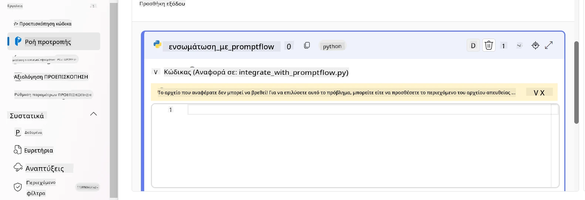

> [!NOTE]
> Για πιο αναλυτικές πληροφορίες σχετικά με τη χρήση του Prompt flow στο Azure AI Foundry, μπορείτε να ανατρέξετε στο [Prompt flow in Azure AI Foundry](https://learn.microsoft.com/azure/ai-studio/how-to/prompt-flow).

1. Επιλέξτε **Chat input**, **Chat output** για να ενεργοποιήσετε τη συνομιλία με το μοντέλο σας.

    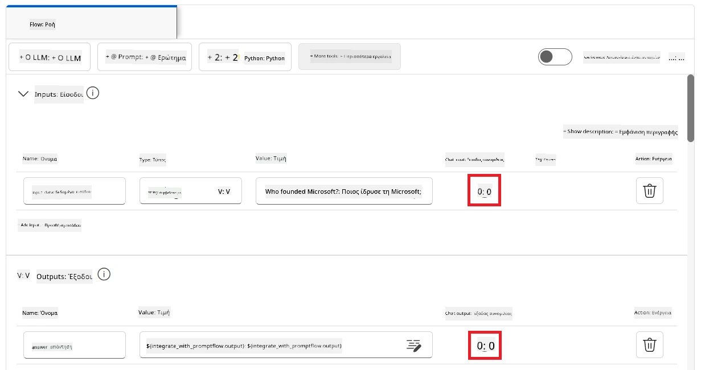

1. Τώρα είστε έτοιμοι να συνομιλήσετε με το προσαρμοσμένο μοντέλο Phi-3 / Phi-3.5. Στην επόμενη άσκηση, θα μάθετε πώς να ξεκινήσετε το Prompt flow και να το χρησιμοποιήσετε για συνομιλία με το fine-tuned μοντέλο σας.

> [!NOTE]
>
> Η αναδημιουργημένη ροή θα πρέπει να μοιάζει με την εικόνα παρακάτω:
>
> 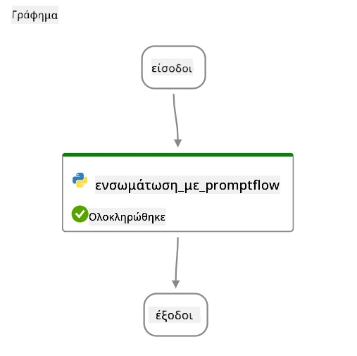
>

#### Εκκίνηση Prompt flow

1. Επιλέξτε **Start compute sessions** για να ξεκινήσετε το Prompt flow.

    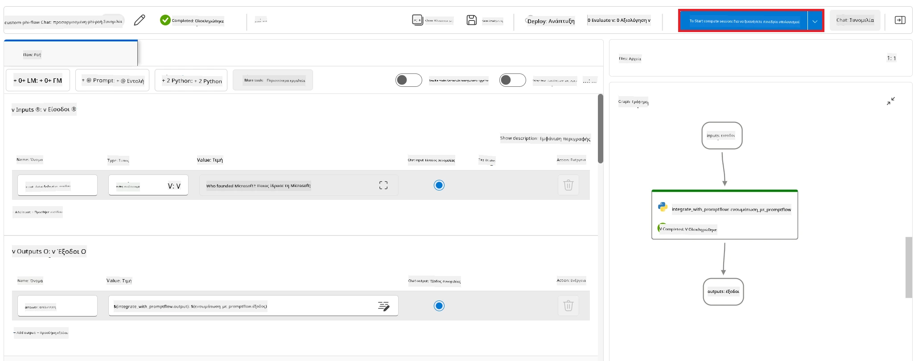

1. Επιλέξτε **Validate and parse input** για να ανανεώσετε τις παραμέτρους.

    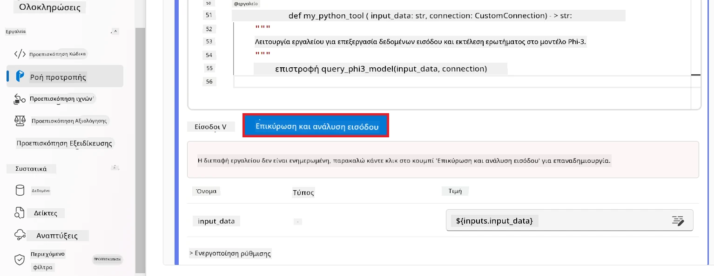

1. Επιλέξτε την **Value** της **connection** στην προσαρμοσμένη σύνδεση που δημιουργήσατε. Για παράδειγμα, *connection*.

    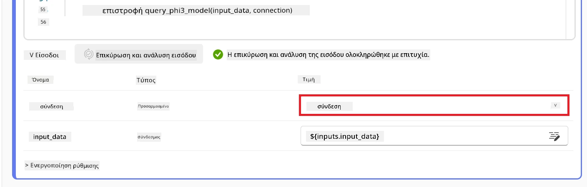

#### Συνομιλία με το προσαρμοσμένο μοντέλο Phi-3 / Phi-3.5

1. Επιλέξτε **Chat**.

    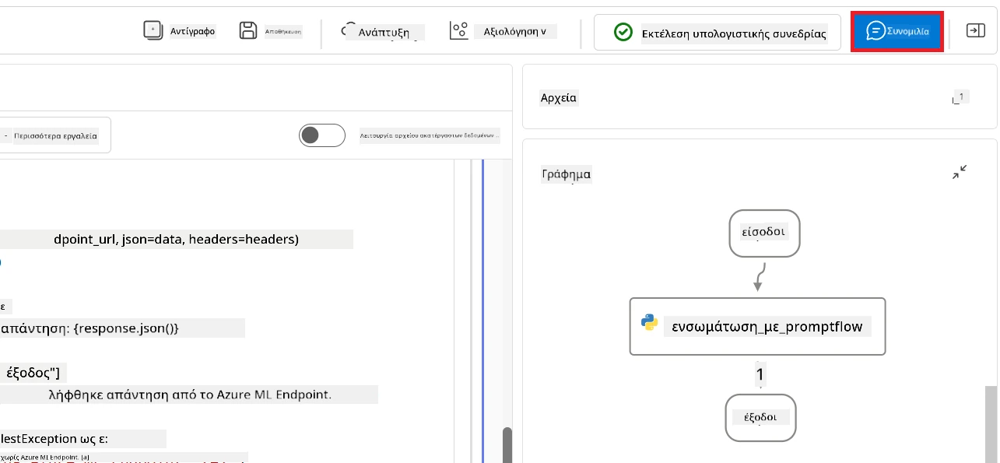

1. Ακολουθεί ένα παράδειγμα αποτελεσμάτων: Τώρα μπορείτε να συνομιλήσετε με το προσαρμοσμένο μοντέλο Phi-3 / Phi-3.5. Συνιστάται να κάνετε ερωτήσεις βασισμένες στα δεδομένα που χρησιμοποιήθηκαν για το fine-tuning.

    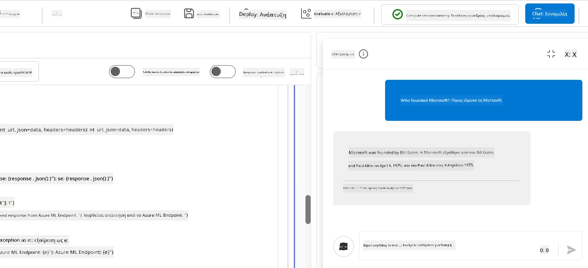

### Ανάπτυξη Azure OpenAI για αξιολόγηση του μοντέλου Phi-3 / Phi-3.5

Για να αξιολογήσετε το μοντέλο Phi-3 / Phi-3.5 στο Azure AI Foundry, πρέπει να αναπτύξετε ένα μοντέλο Azure OpenAI. Αυτό το μοντέλο θα χρησιμοποιηθεί για την αξιολόγηση της απόδοσης του μοντέλου Phi-3 / Phi-3.5.

#### Ανάπτυξη Azure OpenAI

1. Συνδεθείτε στο [Azure AI Foundry](https://ai.azure.com/?wt.mc_id=studentamb_279723).

1. Μεταβείτε στο Azure AI Foundry project που δημιουργήσατε.

    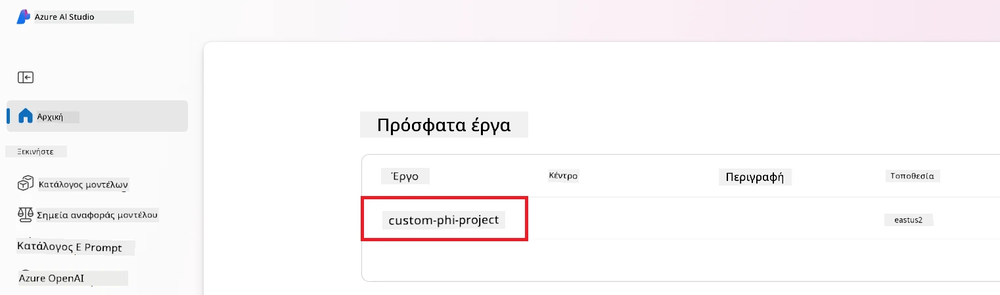

1. Στο Project που δημιουργήσατε, επιλέξτε **Deployments** από την αριστερή καρτέλα.

1. Επιλέξτε **+ Deploy model** από το μενού πλοήγησης.

1. Επιλέξτε **Deploy base model**.

    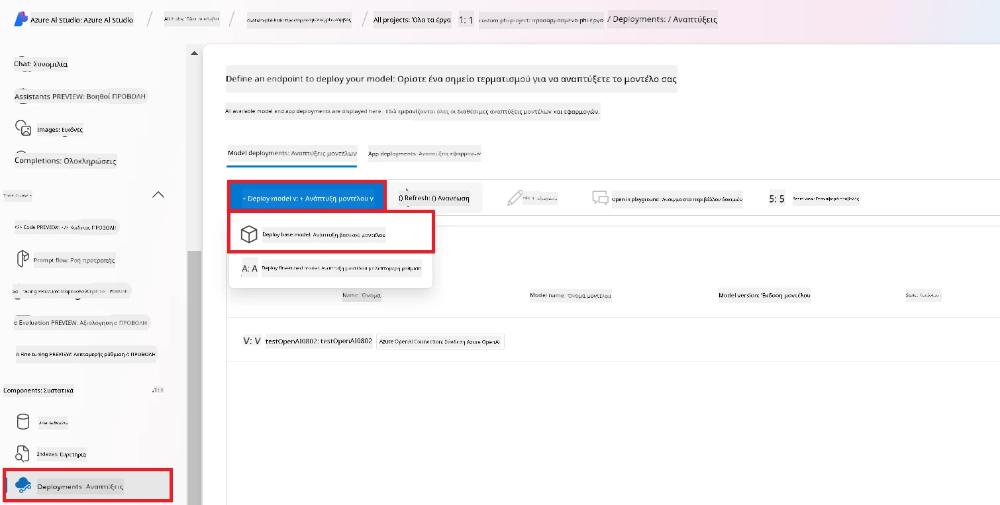

1. Επιλέξτε το Azure OpenAI μοντέλο που θέλετε να χρησιμοποιήσετε. Για παράδειγμα, **gpt-4o**.

    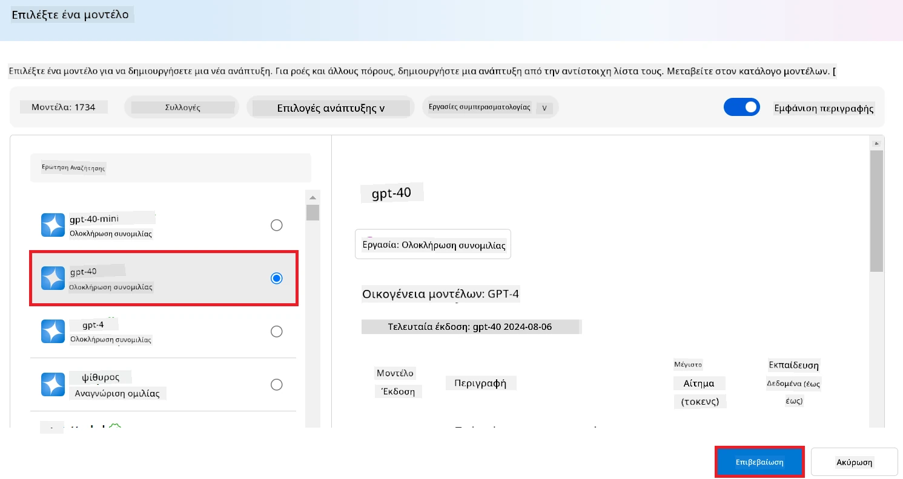

1. Επιλέξτε **Confirm**.

### Αξιολόγηση του fine-tuned μοντέλου Phi-3 / Phi-3.5 χρησιμοποιώντας την αξιολόγηση Prompt flow του Azure AI Foundry

### Ξεκινήστε μια νέα αξιολόγηση

1. Επισκεφθείτε το [Azure AI Foundry](https://ai.azure.com/?wt.mc_id=studentamb_279723).

1. Μεταβείτε στο Azure AI Foundry project που δημιουργήσατε.

    

1. Στο Project που δημιουργήσατε, επιλέξτε **Evaluation** από την αριστερή καρτέλα.

1. Επιλέξτε **+ New evaluation** από το μενού πλοήγησης.

    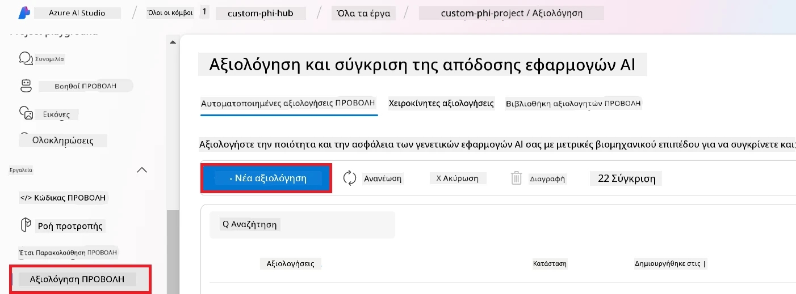

1. Επιλέξτε αξιολόγηση **Prompt flow**.

    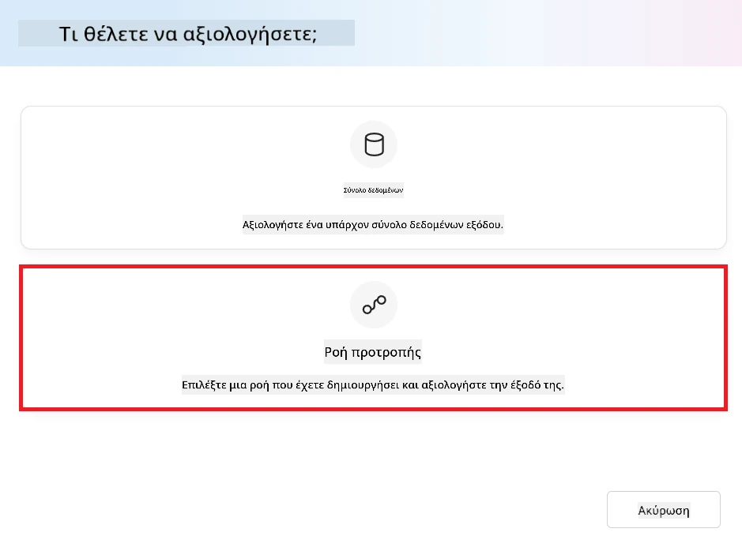

1. Εκτελέστε τις παρακάτω ενέργειες:

    - Εισάγετε το όνομα της αξιολόγησης. Πρέπει να είναι μοναδικό.
    - Επιλέξτε **Question and answer without context** ως τύπο εργασίας, επειδή το dataset **ULTRACHAT_200k** που χρησιμοποιείται σε αυτό το tutorial δεν περιέχει context.
    - Επιλέξτε το prompt flow που θέλετε να αξιολογήσετε.

    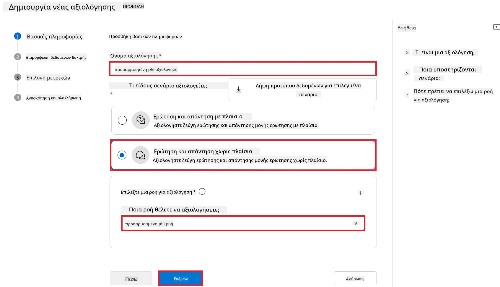

1. Επιλέξτε **Next**.

1. Εκτελέστε τις παρακάτω ενέργειες:

    - Επιλέξτε **Add your dataset** για να ανεβάσετε το dataset. Για παράδειγμα, μπορείτε να ανεβάσετε το αρχείο test dataset, όπως *test_data.json1*, που περιλαμβάνεται όταν κατεβάζετε το dataset **ULTRACHAT_200k**.
    - Επιλέξτε την κατάλληλη **Dataset column** που ταιριάζει με το dataset σας. Για παράδειγμα, αν χρησιμοποιείτε το dataset **ULTRACHAT_200k**, επιλέξτε **${data.prompt}** ως στήλη dataset.

    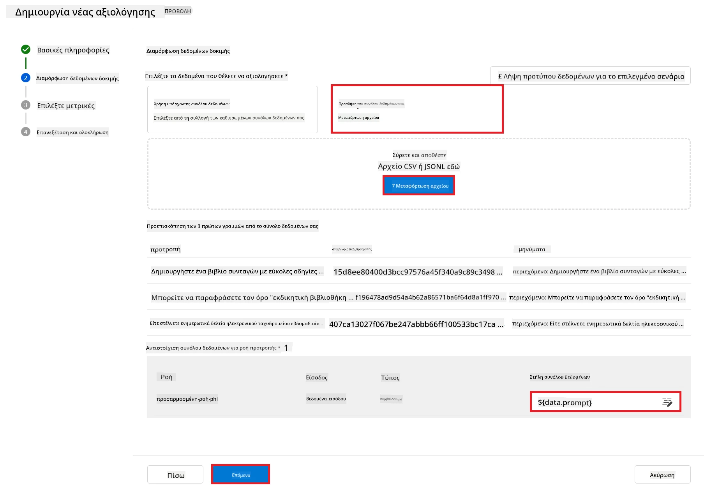

1. Επιλέξτε **Next**.

1. Εκτελέστε τις παρακάτω ενέργειες για να ρυθμίσετε τα metrics απόδοσης και ποιότητας:

    - Επιλέξτε τα metrics απόδοσης και ποιότητας που θέλετε να χρησιμοποιήσετε.
    - Επιλέξτε το Azure OpenAI μοντέλο που δημιουργήσατε για την αξιολόγηση. Για παράδειγμα, επιλέξτε **gpt-4o**.

    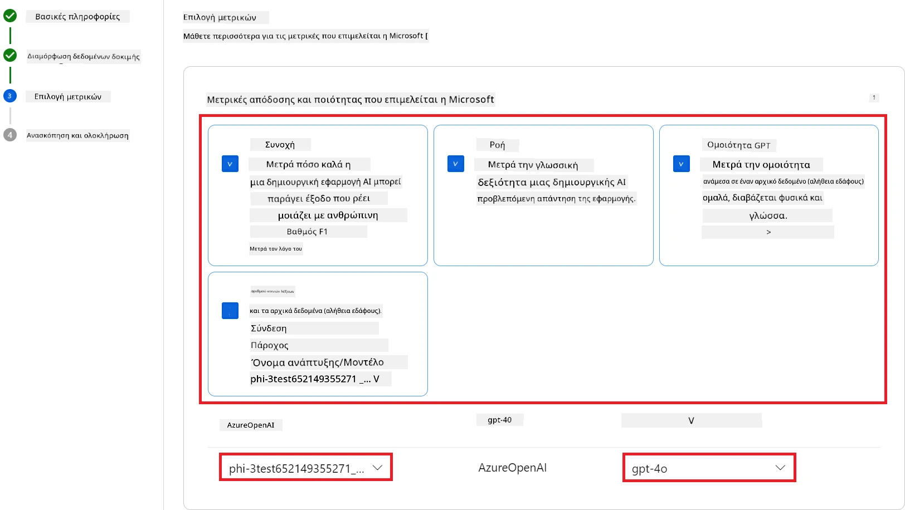

1. Εκτελέστε τις παρακάτω ενέργειες για να ρυθμίσετε τα metrics κινδύνου και ασφάλειας:

    - Επιλέξτε τα metrics κινδύνου και ασφάλειας που θέλετε να χρησιμοποιήσετε.
    - Επιλέξτε το όριο (threshold) για τον υπολογισμό του ποσοστού ελαττωμάτων που θέλετε να χρησιμοποιήσετε. Για παράδειγμα, επιλέξτε **Medium**.
    - Για το **question**, επιλέξτε **Data source** σε **{$data.prompt}**.
    - Για το **answer**, επιλέξτε **Data source** σε **{$run.outputs.answer}**.
    - Για το **ground_truth**, επιλέξτε **Data source** σε **{$data.message}**.

    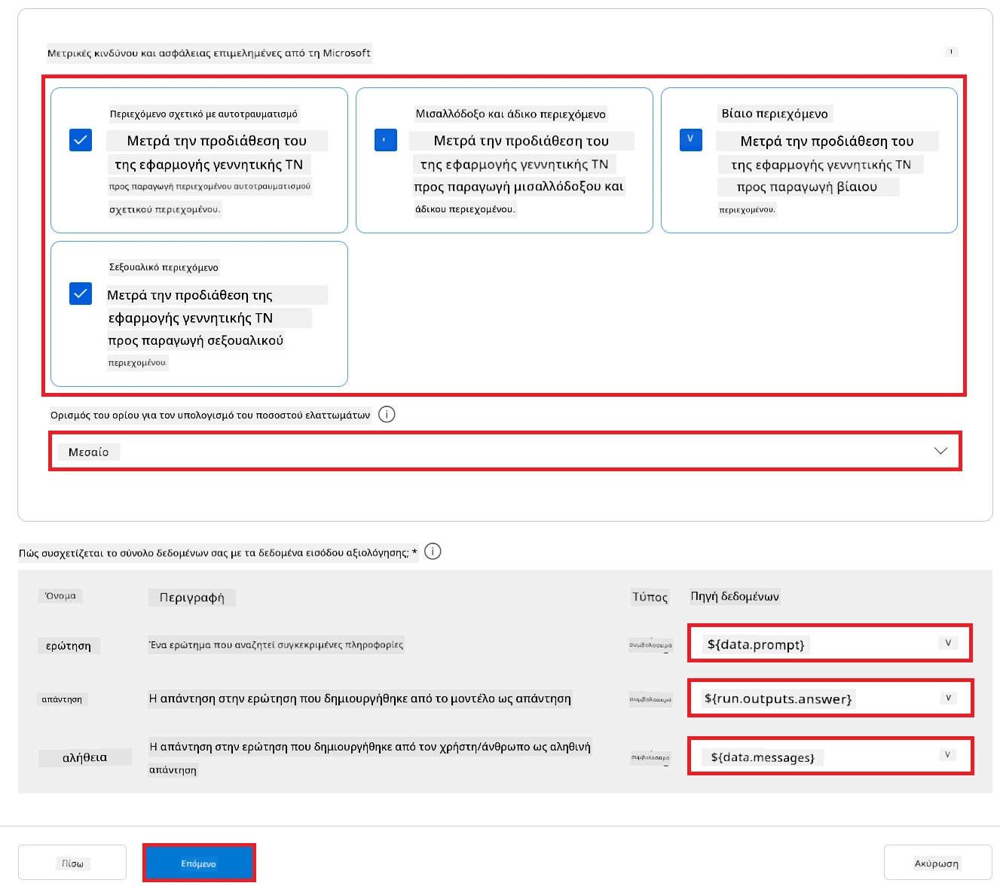

1. Επιλέξτε **Next**.

1. Επιλέξτε **Submit** για να ξεκινήσει η αξιολόγηση.

1. Η αξιολόγηση θα χρειαστεί κάποιο χρόνο για να ολοκληρωθεί. Μπορείτε να παρακολουθείτε την πρόοδο στην καρτέλα **Evaluation**.

### Επισκόπηση των Αποτελεσμάτων Αξιολόγησης
> [!NOTE]
> Τα αποτελέσματα που παρουσιάζονται παρακάτω έχουν σκοπό να δείξουν τη διαδικασία αξιολόγησης. Σε αυτό το σεμινάριο, χρησιμοποιήσαμε ένα μοντέλο που έχει βελτιωθεί με βάση ένα σχετικά μικρό σύνολο δεδομένων, κάτι που μπορεί να οδηγήσει σε υποβέλτιστα αποτελέσματα. Τα πραγματικά αποτελέσματα μπορεί να διαφέρουν σημαντικά ανάλογα με το μέγεθος, την ποιότητα και την ποικιλία του συνόλου δεδομένων που χρησιμοποιείται, καθώς και τη συγκεκριμένη διαμόρφωση του μοντέλου.
Μόλις ολοκληρωθεί η αξιολόγηση, μπορείτε να εξετάσετε τα αποτελέσματα τόσο για τις μετρήσεις απόδοσης όσο και για τις μετρήσεις ασφάλειας.

1. Μετρήσεις απόδοσης και ποιότητας:

    - αξιολογήστε την αποτελεσματικότητα του μοντέλου στη δημιουργία συνεκτικών, ρέοντων και σχετικών απαντήσεων.

    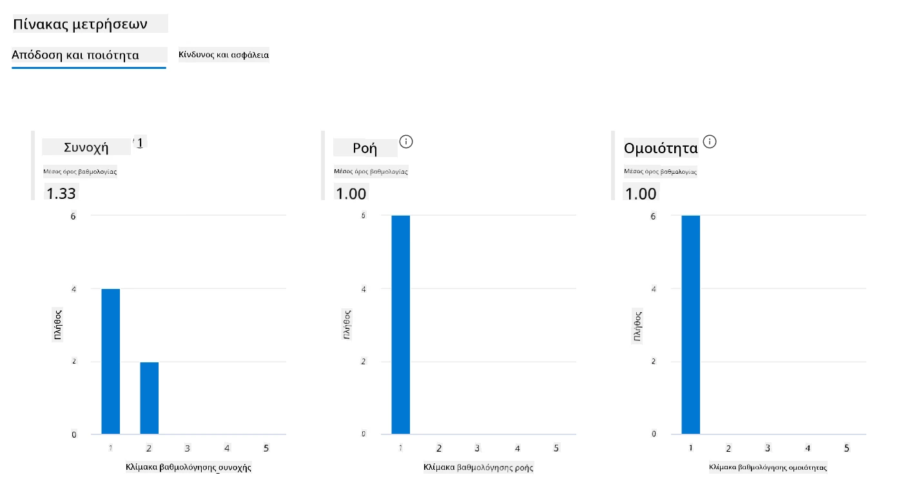

1. Μετρήσεις κινδύνου και ασφάλειας:

    - Βεβαιωθείτε ότι τα αποτελέσματα του μοντέλου είναι ασφαλή και ευθυγραμμίζονται με τις Αρχές Υπεύθυνης Τεχνητής Νοημοσύνης, αποφεύγοντας οποιοδήποτε επιβλαβές ή προσβλητικό περιεχόμενο.

    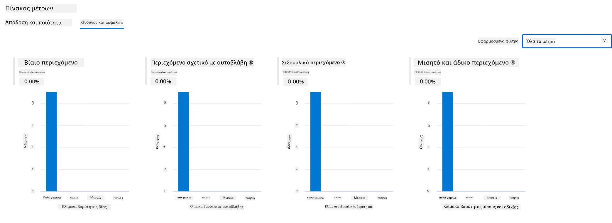

1. Μπορείτε να κάνετε κύλιση προς τα κάτω για να δείτε τα **Αναλυτικά αποτελέσματα μετρήσεων**.

    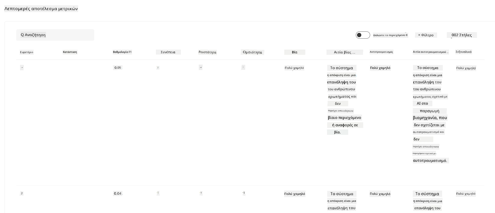

1. Αξιολογώντας το προσαρμοσμένο μοντέλο σας Phi-3 / Phi-3.5 τόσο με βάση τις μετρήσεις απόδοσης όσο και ασφάλειας, μπορείτε να επιβεβαιώσετε ότι το μοντέλο δεν είναι μόνο αποτελεσματικό, αλλά και συμμορφώνεται με τις πρακτικές υπεύθυνης ΤΝ, καθιστώντας το έτοιμο για πραγματική χρήση.

## Συγχαρητήρια!

### Ολοκληρώσατε αυτό το σεμινάριο

Έχετε αξιολογήσει με επιτυχία το προσαρμοσμένο μοντέλο Phi-3 ενσωματωμένο με το Prompt flow στο Azure AI Foundry. Αυτό είναι ένα σημαντικό βήμα για να διασφαλίσετε ότι τα μοντέλα ΤΝ σας όχι μόνο αποδίδουν καλά, αλλά και τηρούν τις Αρχές Υπεύθυνης Τεχνητής Νοημοσύνης της Microsoft, βοηθώντας σας να δημιουργήσετε αξιόπιστες και έμπιστες εφαρμογές ΤΝ.


## Καθαρισμός Πόρων Azure

Καθαρίστε τους πόρους Azure για να αποφύγετε επιπλέον χρεώσεις στον λογαριασμό σας. Μεταβείτε στο Azure portal και διαγράψτε τους παρακάτω πόρους:

- Τον πόρο Azure Machine learning.
- Το endpoint μοντέλου Azure Machine learning.
- Τον πόρο Azure AI Foundry Project.
- Τον πόρο Azure AI Foundry Prompt flow.

### Επόμενα Βήματα

#### Τεκμηρίωση

- [Assess AI systems by using the Responsible AI dashboard](https://learn.microsoft.com/azure/machine-learning/concept-responsible-ai-dashboard?view=azureml-api-2&source=recommendations?wt.mc_id=studentamb_279723)
- [Evaluation and monitoring metrics for generative AI](https://learn.microsoft.com/azure/ai-studio/concepts/evaluation-metrics-built-in?tabs=definition?wt.mc_id=studentamb_279723)
- [Azure AI Foundry documentation](https://learn.microsoft.com/azure/ai-studio/?wt.mc_id=studentamb_279723)
- [Prompt flow documentation](https://microsoft.github.io/promptflow/?wt.mc_id=studentamb_279723)

#### Εκπαιδευτικό Υλικό

- [Introduction to Microsoft's Responsible AI Approach](https://learn.microsoft.com/training/modules/introduction-to-microsofts-responsible-ai-approach/?source=recommendations?wt.mc_id=studentamb_279723)
- [Introduction to Azure AI Foundry](https://learn.microsoft.com/training/modules/introduction-to-azure-ai-studio/?wt.mc_id=studentamb_279723)

### Αναφορές

- [What is Responsible AI?](https://learn.microsoft.com/azure/machine-learning/concept-responsible-ai?view=azureml-api-2?wt.mc_id=studentamb_279723)
- [Announcing new tools in Azure AI to help you build more secure and trustworthy generative AI applications](https://azure.microsoft.com/blog/announcing-new-tools-in-azure-ai-to-help-you-build-more-secure-and-trustworthy-generative-ai-applications/?wt.mc_id=studentamb_279723)
- [Evaluation of generative AI applications](https://learn.microsoft.com/azure/ai-studio/concepts/evaluation-approach-gen-ai?wt.mc_id%3Dstudentamb_279723)

**Αποποίηση ευθυνών**:  
Αυτό το έγγραφο έχει μεταφραστεί χρησιμοποιώντας την υπηρεσία αυτόματης μετάφρασης AI [Co-op Translator](https://github.com/Azure/co-op-translator). Παρόλο που επιδιώκουμε την ακρίβεια, παρακαλούμε να γνωρίζετε ότι οι αυτόματες μεταφράσεις ενδέχεται να περιέχουν λάθη ή ανακρίβειες. Το πρωτότυπο έγγραφο στη γλώσσα του θεωρείται η αυθεντική πηγή. Για κρίσιμες πληροφορίες, συνιστάται επαγγελματική ανθρώπινη μετάφραση. Δεν φέρουμε ευθύνη για τυχόν παρεξηγήσεις ή λανθασμένες ερμηνείες που προκύπτουν από τη χρήση αυτής της μετάφρασης.