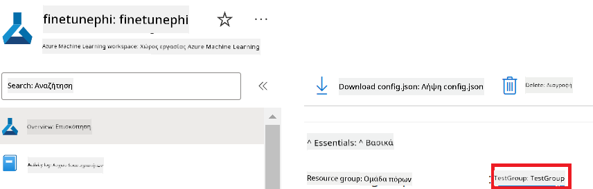

<!--
CO_OP_TRANSLATOR_METADATA:
{
  "original_hash": "455be2b7b9c3390d367d528f8fab2aa0",
  "translation_date": "2025-07-17T00:28:03+00:00",
  "source_file": "md/02.Application/01.TextAndChat/Phi3/E2E_Phi-3-FineTuning_PromptFlow_Integration.md",
  "language_code": "el"
}
-->
# Fine-tune και Ενσωμάτωση προσαρμοσμένων μοντέλων Phi-3 με το Prompt flow

Αυτό το ολοκληρωμένο (E2E) παράδειγμα βασίζεται στον οδηγό "[Fine-Tune and Integrate Custom Phi-3 Models with Prompt Flow: Step-by-Step Guide](https://techcommunity.microsoft.com/t5/educator-developer-blog/fine-tune-and-integrate-custom-phi-3-models-with-prompt-flow/ba-p/4178612?WT.mc_id=aiml-137032-kinfeylo)" από την κοινότητα Microsoft Tech Community. Εισάγει τις διαδικασίες fine-tuning, ανάπτυξης και ενσωμάτωσης προσαρμοσμένων μοντέλων Phi-3 με το Prompt flow.

## Επισκόπηση

Σε αυτό το παράδειγμα E2E, θα μάθετε πώς να κάνετε fine-tune το μοντέλο Phi-3 και να το ενσωματώσετε με το Prompt flow. Αξιοποιώντας το Azure Machine Learning και το Prompt flow, θα δημιουργήσετε μια ροή εργασίας για την ανάπτυξη και χρήση προσαρμοσμένων μοντέλων AI. Αυτό το παράδειγμα E2E χωρίζεται σε τρία σενάρια:

**Σενάριο 1: Ρύθμιση πόρων Azure και Προετοιμασία για fine-tuning**

**Σενάριο 2: Fine-tune του μοντέλου Phi-3 και Ανάπτυξη στο Azure Machine Learning Studio**

**Σενάριο 3: Ενσωμάτωση με το Prompt flow και Συνομιλία με το προσαρμοσμένο μοντέλο σας**

Ακολουθεί μια επισκόπηση αυτού του παραδείγματος E2E.


### Πίνακας Περιεχομένων

1. **[Σενάριο 1: Ρύθμιση πόρων Azure και Προετοιμασία για fine-tuning](../../../../../../md/02.Application/01.TextAndChat/Phi3)**
    - [Δημιουργία Azure Machine Learning Workspace](../../../../../../md/02.Application/01.TextAndChat/Phi3)
    - [Αίτηση για GPU quotas στο Azure Subscription](../../../../../../md/02.Application/01.TextAndChat/Phi3)
    - [Προσθήκη ανάθεσης ρόλου](../../../../../../md/02.Application/01.TextAndChat/Phi3)
    - [Ρύθμιση έργου](../../../../../../md/02.Application/01.TextAndChat/Phi3)
    - [Προετοιμασία dataset για fine-tuning](../../../../../../md/02.Application/01.TextAndChat/Phi3)

1. **[Σενάριο 2: Fine-tune του μοντέλου Phi-3 και Ανάπτυξη στο Azure Machine Learning Studio](../../../../../../md/02.Application/01.TextAndChat/Phi3)**
    - [Ρύθμιση Azure CLI](../../../../../../md/02.Application/01.TextAndChat/Phi3)
    - [Fine-tune του μοντέλου Phi-3](../../../../../../md/02.Application/01.TextAndChat/Phi3)
    - [Ανάπτυξη του fine-tuned μοντέλου](../../../../../../md/02.Application/01.TextAndChat/Phi3)

1. **[Σενάριο 3: Ενσωμάτωση με το Prompt flow και Συνομιλία με το προσαρμοσμένο μοντέλο σας](../../../../../../md/02.Application/01.TextAndChat/Phi3)**
    - [Ενσωμάτωση του προσαρμοσμένου μοντέλου Phi-3 με το Prompt flow](../../../../../../md/02.Application/01.TextAndChat/Phi3)
    - [Συνομιλία με το προσαρμοσμένο μοντέλο σας](../../../../../../md/02.Application/01.TextAndChat/Phi3)

## Σενάριο 1: Ρύθμιση πόρων Azure και Προετοιμασία για fine-tuning

### Δημιουργία Azure Machine Learning Workspace

1. Πληκτρολογήστε *azure machine learning* στη **γραμμή αναζήτησης** στην κορυφή της σελίδας του portal και επιλέξτε **Azure Machine Learning** από τις επιλογές που εμφανίζονται.

    

1. Επιλέξτε **+ Create** από το μενού πλοήγησης.

1. Επιλέξτε **New workspace** από το μενού πλοήγησης.

    

1. Εκτελέστε τις παρακάτω ενέργειες:

    - Επιλέξτε το Azure **Subscription** σας.
    - Επιλέξτε την **Resource group** που θα χρησιμοποιήσετε (δημιουργήστε νέα αν χρειάζεται).
    - Εισάγετε το **Workspace Name**. Πρέπει να είναι μοναδικό.
    - Επιλέξτε την **Περιοχή (Region)** που θέλετε να χρησιμοποιήσετε.
    - Επιλέξτε τον **Λογαριασμό αποθήκευσης (Storage account)** που θα χρησιμοποιήσετε (δημιουργήστε νέο αν χρειάζεται).
    - Επιλέξτε το **Key vault** που θα χρησιμοποιήσετε (δημιουργήστε νέο αν χρειάζεται).
    - Επιλέξτε το **Application insights** που θα χρησιμοποιήσετε (δημιουργήστε νέο αν χρειάζεται).
    - Επιλέξτε το **Container registry** που θα χρησιμοποιήσετε (δημιουργήστε νέο αν χρειάζεται).

    

1. Επιλέξτε **Review + Create**.

1. Επιλέξτε **Create**.

### Αίτηση για GPU quotas στο Azure Subscription

Σε αυτό το παράδειγμα E2E, θα χρησιμοποιήσετε την *Standard_NC24ads_A100_v4 GPU* για fine-tuning, που απαιτεί αίτηση quota, και την *Standard_E4s_v3* CPU για ανάπτυξη, που δεν απαιτεί αίτηση quota.

> [!NOTE]
>
> Μόνο οι συνδρομές τύπου Pay-As-You-Go (τυπικός τύπος συνδρομής) είναι επιλέξιμες για κατανομή GPU· οι συνδρομές με προνόμια δεν υποστηρίζονται προς το παρόν.
>
> Για όσους χρησιμοποιούν συνδρομές με προνόμια (όπως Visual Studio Enterprise Subscription) ή θέλουν να δοκιμάσουν γρήγορα τη διαδικασία fine-tuning και ανάπτυξης, αυτός ο οδηγός παρέχει επίσης οδηγίες για fine-tuning με ένα ελάχιστο dataset χρησιμοποιώντας CPU. Ωστόσο, είναι σημαντικό να σημειωθεί ότι τα αποτελέσματα fine-tuning είναι σημαντικά καλύτερα όταν χρησιμοποιείται GPU με μεγαλύτερα datasets.

1. Επισκεφθείτε το [Azure ML Studio](https://ml.azure.com/home?wt.mc_id=studentamb_279723).

1. Εκτελέστε τις παρακάτω ενέργειες για να ζητήσετε quota για την οικογένεια *Standard NCADSA100v4*:

    - Επιλέξτε **Quota** από την αριστερή καρτέλα.
    - Επιλέξτε την **οικογένεια εικονικών μηχανών (Virtual machine family)** που θέλετε να χρησιμοποιήσετε. Για παράδειγμα, επιλέξτε **Standard NCADSA100v4 Family Cluster Dedicated vCPUs**, που περιλαμβάνει την *Standard_NC24ads_A100_v4* GPU.
    - Επιλέξτε **Request quota** από το μενού πλοήγησης.

        

    - Στη σελίδα Request quota, εισάγετε το **Νέο όριο πυρήνων (New cores limit)** που θέλετε να χρησιμοποιήσετε. Για παράδειγμα, 24.
    - Στη σελίδα Request quota, επιλέξτε **Submit** για να υποβάλετε το αίτημα για το quota GPU.

> [!NOTE]
> Μπορείτε να επιλέξετε την κατάλληλη GPU ή CPU για τις ανάγκες σας ανατρέχοντας στο έγγραφο [Sizes for Virtual Machines in Azure](https://learn.microsoft.com/azure/virtual-machines/sizes/overview?tabs=breakdownseries%2Cgeneralsizelist%2Ccomputesizelist%2Cmemorysizelist%2Cstoragesizelist%2Cgpusizelist%2Cfpgasizelist%2Chpcsizelist).

### Προσθήκη ανάθεσης ρόλου

Για να κάνετε fine-tune και να αναπτύξετε τα μοντέλα σας, πρέπει πρώτα να δημιουργήσετε μια User Assigned Managed Identity (UAI) και να της αναθέσετε τα κατάλληλα δικαιώματα. Αυτή η UAI θα χρησιμοποιηθεί για την αυθεντικοποίηση κατά την ανάπτυξη.

#### Δημιουργία User Assigned Managed Identity (UAI)

1. Πληκτρολογήστε *managed identities* στη **γραμμή αναζήτησης** στην κορυφή της σελίδας του portal και επιλέξτε **Managed Identities** από τις επιλογές που εμφανίζονται.

    

1. Επιλέξτε **+ Create**.

    

1. Εκτελέστε τις παρακάτω ενέργειες:

    - Επιλέξτε το Azure **Subscription** σας.
    - Επιλέξτε την **Resource group** που θα χρησιμοποιήσετε (δημιουργήστε νέα αν χρειάζεται).
    - Επιλέξτε την **Περιοχή (Region)** που θέλετε να χρησιμοποιήσετε.
    - Εισάγετε το **Όνομα (Name)**. Πρέπει να είναι μοναδικό.

1. Επιλέξτε **Review + create**.

1. Επιλέξτε **+ Create**.

#### Προσθήκη ανάθεσης ρόλου Contributor στη Managed Identity

1. Μεταβείτε στον πόρο Managed Identity που δημιουργήσατε.

1. Επιλέξτε **Azure role assignments** από την αριστερή καρτέλα.

1. Επιλέξτε **+Add role assignment** από το μενού πλοήγησης.

1. Στη σελίδα Add role assignment, εκτελέστε τις παρακάτω ενέργειες:
    - Επιλέξτε το **Scope** ως **Resource group**.
    - Επιλέξτε το Azure **Subscription** σας.
    - Επιλέξτε την **Resource group** που θα χρησιμοποιήσετε.
    - Επιλέξτε το **Role** ως **Contributor**.

    

1. Επιλέξτε **Save**.

#### Προσθήκη ανάθεσης ρόλου Storage Blob Data Reader στη Managed Identity

1. Πληκτρολογήστε *storage accounts* στη **γραμμή αναζήτησης** στην κορυφή της σελίδας του portal και επιλέξτε **Storage accounts** από τις επιλογές που εμφανίζονται.

    

1. Επιλέξτε τον λογαριασμό αποθήκευσης που σχετίζεται με το Azure Machine Learning workspace που δημιουργήσατε. Για παράδειγμα, *finetunephistorage*.

1. Εκτελέστε τις παρακάτω ενέργειες για να μεταβείτε στη σελίδα Add role assignment:

    - Μεταβείτε στον λογαριασμό Azure Storage που δημιουργήσατε.
    - Επιλέξτε **Access Control (IAM)** από την αριστερή καρτέλα.
    - Επιλέξτε **+ Add** από το μενού πλοήγησης.
    - Επιλέξτε **Add role assignment** από το μενού πλοήγησης.

    

1. Στη σελίδα Add role assignment, εκτελέστε τις παρακάτω ενέργειες:

    - Στη σελίδα Role, πληκτρολογήστε *Storage Blob Data Reader* στη **γραμμή αναζήτησης** και επιλέξτε **Storage Blob Data Reader** από τις επιλογές που εμφανίζονται.
    - Στη σελίδα Role, επιλέξτε **Next**.
    - Στη σελίδα Members, επιλέξτε **Assign access to** **Managed identity**.
    - Στη σελίδα Members, επιλέξτε **+ Select members**.
    - Στη σελίδα Select managed identities, επιλέξτε το Azure **Subscription** σας.
    - Στη σελίδα Select managed identities, επιλέξτε τη **Managed identity** ως **Manage Identity**.
    - Στη σελίδα Select managed identities, επιλέξτε τη Manage Identity που δημιουργήσατε. Για παράδειγμα, *finetunephi-managedidentity*.
    - Στη σελίδα Select managed identities, επιλέξτε **Select**.

    

1. Επιλέξτε **Review + assign**.

#### Προσθήκη ανάθεσης ρόλου AcrPull στη Managed Identity

1. Πληκτρολογήστε *container registries* στη **γραμμή αναζήτησης** στην κορυφή της σελίδας του portal και επιλέξτε **Container registries** από τις επιλογές που εμφανίζονται.

    

1. Επιλέξτε το container registry που σχετίζεται με το Azure Machine Learning workspace. Για παράδειγμα, *finetunephicontainerregistries*

1. Εκτελέστε τις παρακάτω ενέργειες για να μεταβείτε στη σελίδα Add role assignment:

    - Επιλέξτε **Access Control (IAM)** από την αριστερή καρτέλα.
    - Επιλέξτε **+ Add** από το μενού πλοήγησης.
    - Επιλέξτε **Add role assignment** από το μενού πλοήγησης.

1. Στη σελίδα Add role assignment, εκτελέστε τις παρακάτω ενέργειες:

    - Στη σελίδα Role, πληκτρολογήστε *AcrPull* στη **γραμμή αναζήτησης** και επιλέξτε **AcrPull** από τις επιλογές που εμφανίζονται.
    - Στη σελίδα Role, επιλέξτε **Next**.
    - Στη σελίδα Members, επιλέξτε **Assign access to** **Managed identity**.
    - Στη σελίδα Members, επιλέξτε **+ Select members**.
    - Στη σελίδα Select managed identities, επιλέξτε το Azure **Subscription** σας.
    - Στη σελίδα Select managed identities, επιλέξτε τη **Managed identity** ως **Manage Identity**.
    - Στη σελίδα Select managed identities, επιλέξτε τη Manage Identity που δημιουργήσατε. Για παράδειγμα, *finetunephi-managedidentity*.
    - Στη σελίδα Select managed identities, επιλέξτε **Select**.
    - Επιλέξτε **Review + assign**.

### Ρύθμιση έργου

Τώρα, θα δημιουργήσετε έναν φάκελο εργασίας και θα ρυθμίσετε ένα εικονικό περιβάλλον για να αναπτύξετε ένα πρόγραμμα που αλληλεπιδρά με τους χρήστες και χρησιμοποιεί το αποθηκευμένο ιστορικό συνομιλιών από το Azure Cosmos DB για να ενημερώνει τις απαντήσεις του.

#### Δημιουργία φακέλου εργασίας

1. Ανοίξτε ένα παράθυρο τερματικού και πληκτρολογήστε την παρακάτω εντολή για να δημιουργήσετε έναν φάκελο με όνομα *finetune-phi* στην προεπιλεγμένη διαδρομή.

    ```console
    mkdir finetune-phi
    ```

1. Πληκτρολογήστε την παρακάτω εντολή στο τερματικό σας για να μεταβείτε στον φάκελο *finetune-phi* που δημιουργήσατε.

    ```console
    cd finetune-phi
    ```

#### Δημιουργία εικονικού περιβάλλοντος

1. Πληκτρολογήστε την παρακάτω εντολή στο τερματικό σας για να δημιουργήσετε ένα εικονικό περιβάλλον με όνομα *.venv*.

    ```console
    python -m venv .venv
    ```

1. Πληκτρολογήστε την παρακάτω εντολή στο τερματικό σας για να ενεργοποιήσετε το εικονικό περιβάλλον.

    ```console
    .venv\Scripts\activate.bat
    ```
> [!NOTE]
>
> Αν όλα πήγαν καλά, θα πρέπει να δείτε *(.venv)* πριν από την προτροπή εντολών.
#### Εγκατάσταση των απαιτούμενων πακέτων

1. Πληκτρολογήστε τις παρακάτω εντολές στο τερματικό σας για να εγκαταστήσετε τα απαιτούμενα πακέτα.

    ```console
    pip install datasets==2.19.1
    pip install transformers==4.41.1
    pip install azure-ai-ml==1.16.0
    pip install torch==2.3.1
    pip install trl==0.9.4
    pip install promptflow==1.12.0
    ```

#### Δημιουργία αρχείων έργου

Σε αυτή την άσκηση, θα δημιουργήσετε τα βασικά αρχεία για το έργο μας. Αυτά τα αρχεία περιλαμβάνουν σενάρια για τη λήψη του dataset, τη ρύθμιση του περιβάλλοντος Azure Machine Learning, την προσαρμογή (fine-tuning) του μοντέλου Phi-3 και την ανάπτυξη του προσαρμοσμένου μοντέλου. Επίσης, θα δημιουργήσετε ένα αρχείο *conda.yml* για τη ρύθμιση του περιβάλλοντος fine-tuning.

Σε αυτή την άσκηση, θα:

- Δημιουργήσετε ένα αρχείο *download_dataset.py* για τη λήψη του dataset.
- Δημιουργήσετε ένα αρχείο *setup_ml.py* για τη ρύθμιση του περιβάλλοντος Azure Machine Learning.
- Δημιουργήσετε ένα αρχείο *fine_tune.py* στον φάκελο *finetuning_dir* για να προσαρμόσετε το μοντέλο Phi-3 χρησιμοποιώντας το dataset.
- Δημιουργήσετε ένα αρχείο *conda.yml* για τη ρύθμιση του περιβάλλοντος fine-tuning.
- Δημιουργήσετε ένα αρχείο *deploy_model.py* για την ανάπτυξη του προσαρμοσμένου μοντέλου.
- Δημιουργήσετε ένα αρχείο *integrate_with_promptflow.py* για την ενσωμάτωση του προσαρμοσμένου μοντέλου και την εκτέλεση του μοντέλου μέσω του Prompt flow.
- Δημιουργήσετε ένα αρχείο flow.dag.yml για τη ρύθμιση της δομής ροής εργασίας για το Prompt flow.
- Δημιουργήσετε ένα αρχείο *config.py* για να εισάγετε τις πληροφορίες Azure.

> [!NOTE]
>
> Πλήρης δομή φακέλων:
>
> ```text
> └── YourUserName
> .    └── finetune-phi
> .        ├── finetuning_dir
> .        │      └── fine_tune.py
> .        ├── conda.yml
> .        ├── config.py
> .        ├── deploy_model.py
> .        ├── download_dataset.py
> .        ├── flow.dag.yml
> .        ├── integrate_with_promptflow.py
> .        └── setup_ml.py
> ```

1. Ανοίξτε το **Visual Studio Code**.

1. Επιλέξτε **File** από τη γραμμή μενού.

1. Επιλέξτε **Open Folder**.

1. Επιλέξτε τον φάκελο *finetune-phi* που δημιουργήσατε, ο οποίος βρίσκεται στο *C:\Users\yourUserName\finetune-phi*.

    

1. Στο αριστερό πάνελ του Visual Studio Code, κάντε δεξί κλικ και επιλέξτε **New File** για να δημιουργήσετε ένα νέο αρχείο με όνομα *download_dataset.py*.

1. Στο αριστερό πάνελ του Visual Studio Code, κάντε δεξί κλικ και επιλέξτε **New File** για να δημιουργήσετε ένα νέο αρχείο με όνομα *setup_ml.py*.

1. Στο αριστερό πάνελ του Visual Studio Code, κάντε δεξί κλικ και επιλέξτε **New File** για να δημιουργήσετε ένα νέο αρχείο με όνομα *deploy_model.py*.

    

1. Στο αριστερό πάνελ του Visual Studio Code, κάντε δεξί κλικ και επιλέξτε **New Folder** για να δημιουργήσετε ένα νέο φάκελο με όνομα *finetuning_dir*.

1. Στον φάκελο *finetuning_dir*, δημιουργήστε ένα νέο αρχείο με όνομα *fine_tune.py*.

#### Δημιουργία και ρύθμιση αρχείου *conda.yml*

1. Στο αριστερό πάνελ του Visual Studio Code, κάντε δεξί κλικ και επιλέξτε **New File** για να δημιουργήσετε ένα νέο αρχείο με όνομα *conda.yml*.

1. Προσθέστε τον παρακάτω κώδικα στο αρχείο *conda.yml* για να ρυθμίσετε το περιβάλλον fine-tuning για το μοντέλο Phi-3.

    ```yml
    name: phi-3-training-env
    channels:
      - defaults
      - conda-forge
    dependencies:
      - python=3.10
      - pip
      - numpy<2.0
      - pip:
          - torch==2.4.0
          - torchvision==0.19.0
          - trl==0.8.6
          - transformers==4.41
          - datasets==2.21.0
          - azureml-core==1.57.0
          - azure-storage-blob==12.19.0
          - azure-ai-ml==1.16
          - azure-identity==1.17.1
          - accelerate==0.33.0
          - mlflow==2.15.1
          - azureml-mlflow==1.57.0
    ```

#### Δημιουργία και ρύθμιση αρχείου *config.py*

1. Στο αριστερό πάνελ του Visual Studio Code, κάντε δεξί κλικ και επιλέξτε **New File** για να δημιουργήσετε ένα νέο αρχείο με όνομα *config.py*.

1. Προσθέστε τον παρακάτω κώδικα στο αρχείο *config.py* για να εισάγετε τις πληροφορίες Azure.

    ```python
    # Azure settings
    AZURE_SUBSCRIPTION_ID = "your_subscription_id"
    AZURE_RESOURCE_GROUP_NAME = "your_resource_group_name" # "TestGroup"

    # Azure Machine Learning settings
    AZURE_ML_WORKSPACE_NAME = "your_workspace_name" # "finetunephi-workspace"

    # Azure Managed Identity settings
    AZURE_MANAGED_IDENTITY_CLIENT_ID = "your_azure_managed_identity_client_id"
    AZURE_MANAGED_IDENTITY_NAME = "your_azure_managed_identity_name" # "finetunephi-mangedidentity"
    AZURE_MANAGED_IDENTITY_RESOURCE_ID = f"/subscriptions/{AZURE_SUBSCRIPTION_ID}/resourceGroups/{AZURE_RESOURCE_GROUP_NAME}/providers/Microsoft.ManagedIdentity/userAssignedIdentities/{AZURE_MANAGED_IDENTITY_NAME}"

    # Dataset file paths
    TRAIN_DATA_PATH = "data/train_data.jsonl"
    TEST_DATA_PATH = "data/test_data.jsonl"

    # Fine-tuned model settings
    AZURE_MODEL_NAME = "your_fine_tuned_model_name" # "finetune-phi-model"
    AZURE_ENDPOINT_NAME = "your_fine_tuned_model_endpoint_name" # "finetune-phi-endpoint"
    AZURE_DEPLOYMENT_NAME = "your_fine_tuned_model_deployment_name" # "finetune-phi-deployment"

    AZURE_ML_API_KEY = "your_fine_tuned_model_api_key"
    AZURE_ML_ENDPOINT = "your_fine_tuned_model_endpoint_uri" # "https://{your-endpoint-name}.{your-region}.inference.ml.azure.com/score"
    ```

#### Προσθήκη μεταβλητών περιβάλλοντος Azure

1. Εκτελέστε τις παρακάτω ενέργειες για να προσθέσετε το Azure Subscription ID:

    - Πληκτρολογήστε *subscriptions* στη **γραμμή αναζήτησης** στην κορυφή της σελίδας του portal και επιλέξτε **Subscriptions** από τις επιλογές που εμφανίζονται.
    - Επιλέξτε το Azure Subscription που χρησιμοποιείτε αυτή τη στιγμή.
    - Αντιγράψτε και επικολλήστε το Subscription ID στο αρχείο *config.py*.

    

1. Εκτελέστε τις παρακάτω ενέργειες για να προσθέσετε το όνομα του Azure Workspace:

    - Μεταβείτε στον πόρο Azure Machine Learning που δημιουργήσατε.
    - Αντιγράψτε και επικολλήστε το όνομα του λογαριασμού σας στο αρχείο *config.py*.

    

1. Εκτελέστε τις παρακάτω ενέργειες για να προσθέσετε το όνομα του Azure Resource Group:

    - Μεταβείτε στον πόρο Azure Machine Learning που δημιουργήσατε.
    - Αντιγράψτε και επικολλήστε το όνομα του Azure Resource Group στο αρχείο *config.py*.

    

2. Εκτελέστε τις παρακάτω ενέργειες για να προσθέσετε το όνομα Azure Managed Identity:

    - Μεταβείτε στον πόρο Managed Identities που δημιουργήσατε.
    - Αντιγράψτε και επικολλήστε το όνομα Azure Managed Identity στο αρχείο *config.py*.

    

### Προετοιμασία dataset για fine-tuning

Σε αυτή την άσκηση, θα εκτελέσετε το αρχείο *download_dataset.py* για να κατεβάσετε τα datasets *ULTRACHAT_200k* στο τοπικό σας περιβάλλον. Στη συνέχεια, θα χρησιμοποιήσετε αυτά τα datasets για να προσαρμόσετε το μοντέλο Phi-3 στο Azure Machine Learning.

#### Κατεβάστε το dataset σας χρησιμοποιώντας το *download_dataset.py*

1. Ανοίξτε το αρχείο *download_dataset.py* στο Visual Studio Code.

1. Προσθέστε τον παρακάτω κώδικα στο *download_dataset.py*.

    ```python
    import json
    import os
    from datasets import load_dataset
    from config import (
        TRAIN_DATA_PATH,
        TEST_DATA_PATH)

    def load_and_split_dataset(dataset_name, config_name, split_ratio):
        """
        Load and split a dataset.
        """
        # Load the dataset with the specified name, configuration, and split ratio
        dataset = load_dataset(dataset_name, config_name, split=split_ratio)
        print(f"Original dataset size: {len(dataset)}")
        
        # Split the dataset into train and test sets (80% train, 20% test)
        split_dataset = dataset.train_test_split(test_size=0.2)
        print(f"Train dataset size: {len(split_dataset['train'])}")
        print(f"Test dataset size: {len(split_dataset['test'])}")
        
        return split_dataset

    def save_dataset_to_jsonl(dataset, filepath):
        """
        Save a dataset to a JSONL file.
        """
        # Create the directory if it does not exist
        os.makedirs(os.path.dirname(filepath), exist_ok=True)
        
        # Open the file in write mode
        with open(filepath, 'w', encoding='utf-8') as f:
            # Iterate over each record in the dataset
            for record in dataset:
                # Dump the record as a JSON object and write it to the file
                json.dump(record, f)
                # Write a newline character to separate records
                f.write('\n')
        
        print(f"Dataset saved to {filepath}")

    def main():
        """
        Main function to load, split, and save the dataset.
        """
        # Load and split the ULTRACHAT_200k dataset with a specific configuration and split ratio
        dataset = load_and_split_dataset("HuggingFaceH4/ultrachat_200k", 'default', 'train_sft[:1%]')
        
        # Extract the train and test datasets from the split
        train_dataset = dataset['train']
        test_dataset = dataset['test']

        # Save the train dataset to a JSONL file
        save_dataset_to_jsonl(train_dataset, TRAIN_DATA_PATH)
        
        # Save the test dataset to a separate JSONL file
        save_dataset_to_jsonl(test_dataset, TEST_DATA_PATH)

    if __name__ == "__main__":
        main()

    ```

> [!TIP]
>
> **Οδηγίες για fine-tuning με ελάχιστο dataset χρησιμοποιώντας CPU**
>
> Αν θέλετε να χρησιμοποιήσετε CPU για fine-tuning, αυτή η προσέγγιση είναι ιδανική για όσους έχουν συνδρομές με προνόμια (όπως Visual Studio Enterprise Subscription) ή για να δοκιμάσετε γρήγορα τη διαδικασία fine-tuning και ανάπτυξης.
>
> Αντικαταστήστε το `dataset = load_and_split_dataset("HuggingFaceH4/ultrachat_200k", 'default', 'train_sft[:1%]')` με `dataset = load_and_split_dataset("HuggingFaceH4/ultrachat_200k", 'default', 'train_sft[:10]')`
>

1. Πληκτρολογήστε την παρακάτω εντολή στο τερματικό σας για να εκτελέσετε το σενάριο και να κατεβάσετε το dataset στο τοπικό σας περιβάλλον.

    ```console
    python download_data.py
    ```

1. Επαληθεύστε ότι τα datasets αποθηκεύτηκαν επιτυχώς στον τοπικό φάκελο *finetune-phi/data*.

> [!NOTE]
>
> **Μέγεθος dataset και χρόνος fine-tuning**
>
> Σε αυτό το δείγμα E2E, χρησιμοποιείτε μόνο το 1% του dataset (`train_sft[:1%]`). Αυτό μειώνει σημαντικά τον όγκο των δεδομένων, επιταχύνοντας τόσο τη μεταφόρτωση όσο και τη διαδικασία fine-tuning. Μπορείτε να προσαρμόσετε το ποσοστό για να βρείτε τη σωστή ισορροπία μεταξύ χρόνου εκπαίδευσης και απόδοσης μοντέλου. Η χρήση μικρότερου υποσυνόλου του dataset μειώνει τον χρόνο που απαιτείται για fine-tuning, καθιστώντας τη διαδικασία πιο διαχειρίσιμη για ένα δείγμα E2E.

## Σενάριο 2: Προσαρμογή μοντέλου Phi-3 και ανάπτυξη στο Azure Machine Learning Studio

### Ρύθμιση Azure CLI

Πρέπει να ρυθμίσετε το Azure CLI για να πιστοποιήσετε το περιβάλλον σας. Το Azure CLI σας επιτρέπει να διαχειρίζεστε πόρους Azure απευθείας από τη γραμμή εντολών και παρέχει τα διαπιστευτήρια που απαιτούνται για το Azure Machine Learning ώστε να έχει πρόσβαση σε αυτούς τους πόρους. Για να ξεκινήσετε, εγκαταστήστε το [Azure CLI](https://learn.microsoft.com/cli/azure/install-azure-cli)

1. Ανοίξτε ένα παράθυρο τερματικού και πληκτρολογήστε την παρακάτω εντολή για να συνδεθείτε στο λογαριασμό Azure σας.

    ```console
    az login
    ```

1. Επιλέξτε τον λογαριασμό Azure που θέλετε να χρησιμοποιήσετε.

1. Επιλέξτε τη συνδρομή Azure που θέλετε να χρησιμοποιήσετε.

    

> [!TIP]
>
> Αν αντιμετωπίζετε προβλήματα σύνδεσης στο Azure, δοκιμάστε να χρησιμοποιήσετε κωδικό συσκευής. Ανοίξτε ένα παράθυρο τερματικού και πληκτρολογήστε την παρακάτω εντολή για να συνδεθείτε στο λογαριασμό Azure σας:
>
> ```console
> az login --use-device-code
> ```
>

### Προσαρμογή μοντέλου Phi-3

Σε αυτή την άσκηση, θα προσαρμόσετε το μοντέλο Phi-3 χρησιμοποιώντας το παρεχόμενο dataset. Αρχικά, θα ορίσετε τη διαδικασία fine-tuning στο αρχείο *fine_tune.py*. Στη συνέχεια, θα ρυθμίσετε το περιβάλλον Azure Machine Learning και θα ξεκινήσετε τη διαδικασία fine-tuning εκτελώντας το αρχείο *setup_ml.py*. Αυτό το σενάριο διασφαλίζει ότι το fine-tuning γίνεται μέσα στο περιβάλλον Azure Machine Learning.

Με την εκτέλεση του *setup_ml.py*, θα ξεκινήσετε τη διαδικασία fine-tuning στο περιβάλλον Azure Machine Learning.

#### Προσθήκη κώδικα στο αρχείο *fine_tune.py*

1. Μεταβείτε στον φάκελο *finetuning_dir* και ανοίξτε το αρχείο *fine_tune.py* στο Visual Studio Code.

1. Προσθέστε τον παρακάτω κώδικα στο *fine_tune.py*.

    ```python
    import argparse
    import sys
    import logging
    import os
    from datasets import load_dataset
    import torch
    import mlflow
    from transformers import AutoModelForCausalLM, AutoTokenizer, TrainingArguments
    from trl import SFTTrainer

    # To avoid the INVALID_PARAMETER_VALUE error in MLflow, disable MLflow integration
    os.environ["DISABLE_MLFLOW_INTEGRATION"] = "True"

    # Logging setup
    logging.basicConfig(
        format="%(asctime)s - %(levelname)s - %(name)s - %(message)s",
        datefmt="%Y-%m-%d %H:%M:%S",
        handlers=[logging.StreamHandler(sys.stdout)],
        level=logging.WARNING
    )
    logger = logging.getLogger(__name__)

    def initialize_model_and_tokenizer(model_name, model_kwargs):
        """
        Initialize the model and tokenizer with the given pretrained model name and arguments.
        """
        model = AutoModelForCausalLM.from_pretrained(model_name, **model_kwargs)
        tokenizer = AutoTokenizer.from_pretrained(model_name)
        tokenizer.model_max_length = 2048
        tokenizer.pad_token = tokenizer.unk_token
        tokenizer.pad_token_id = tokenizer.convert_tokens_to_ids(tokenizer.pad_token)
        tokenizer.padding_side = 'right'
        return model, tokenizer

    def apply_chat_template(example, tokenizer):
        """
        Apply a chat template to tokenize messages in the example.
        """
        messages = example["messages"]
        if messages[0]["role"] != "system":
            messages.insert(0, {"role": "system", "content": ""})
        example["text"] = tokenizer.apply_chat_template(
            messages, tokenize=False, add_generation_prompt=False
        )
        return example

    def load_and_preprocess_data(train_filepath, test_filepath, tokenizer):
        """
        Load and preprocess the dataset.
        """
        train_dataset = load_dataset('json', data_files=train_filepath, split='train')
        test_dataset = load_dataset('json', data_files=test_filepath, split='train')
        column_names = list(train_dataset.features)

        train_dataset = train_dataset.map(
            apply_chat_template,
            fn_kwargs={"tokenizer": tokenizer},
            num_proc=10,
            remove_columns=column_names,
            desc="Applying chat template to train dataset",
        )

        test_dataset = test_dataset.map(
            apply_chat_template,
            fn_kwargs={"tokenizer": tokenizer},
            num_proc=10,
            remove_columns=column_names,
            desc="Applying chat template to test dataset",
        )

        return train_dataset, test_dataset

    def train_and_evaluate_model(train_dataset, test_dataset, model, tokenizer, output_dir):
        """
        Train and evaluate the model.
        """
        training_args = TrainingArguments(
            bf16=True,
            do_eval=True,
            output_dir=output_dir,
            eval_strategy="epoch",
            learning_rate=5.0e-06,
            logging_steps=20,
            lr_scheduler_type="cosine",
            num_train_epochs=3,
            overwrite_output_dir=True,
            per_device_eval_batch_size=4,
            per_device_train_batch_size=4,
            remove_unused_columns=True,
            save_steps=500,
            seed=0,
            gradient_checkpointing=True,
            gradient_accumulation_steps=1,
            warmup_ratio=0.2,
        )

        trainer = SFTTrainer(
            model=model,
            args=training_args,
            train_dataset=train_dataset,
            eval_dataset=test_dataset,
            max_seq_length=2048,
            dataset_text_field="text",
            tokenizer=tokenizer,
            packing=True
        )

        train_result = trainer.train()
        trainer.log_metrics("train", train_result.metrics)

        mlflow.transformers.log_model(
            transformers_model={"model": trainer.model, "tokenizer": tokenizer},
            artifact_path=output_dir,
        )

        tokenizer.padding_side = 'left'
        eval_metrics = trainer.evaluate()
        eval_metrics["eval_samples"] = len(test_dataset)
        trainer.log_metrics("eval", eval_metrics)

    def main(train_file, eval_file, model_output_dir):
        """
        Main function to fine-tune the model.
        """
        model_kwargs = {
            "use_cache": False,
            "trust_remote_code": True,
            "torch_dtype": torch.bfloat16,
            "device_map": None,
            "attn_implementation": "eager"
        }

        # pretrained_model_name = "microsoft/Phi-3-mini-4k-instruct"
        pretrained_model_name = "microsoft/Phi-3.5-mini-instruct"

        with mlflow.start_run():
            model, tokenizer = initialize_model_and_tokenizer(pretrained_model_name, model_kwargs)
            train_dataset, test_dataset = load_and_preprocess_data(train_file, eval_file, tokenizer)
            train_and_evaluate_model(train_dataset, test_dataset, model, tokenizer, model_output_dir)

    if __name__ == "__main__":
        parser = argparse.ArgumentParser()
        parser.add_argument("--train-file", type=str, required=True, help="Path to the training data")
        parser.add_argument("--eval-file", type=str, required=True, help="Path to the evaluation data")
        parser.add_argument("--model_output_dir", type=str, required=True, help="Directory to save the fine-tuned model")
        args = parser.parse_args()
        main(args.train_file, args.eval_file, args.model_output_dir)

    ```

1. Αποθηκεύστε και κλείστε το αρχείο *fine_tune.py*.

> [!TIP]
> **Μπορείτε να προσαρμόσετε το μοντέλο Phi-3.5**
>
> Στο αρχείο *fine_tune.py*, μπορείτε να αλλάξετε το `pretrained_model_name` από `"microsoft/Phi-3-mini-4k-instruct"` σε οποιοδήποτε μοντέλο θέλετε να προσαρμόσετε. Για παράδειγμα, αν το αλλάξετε σε `"microsoft/Phi-3.5-mini-instruct"`, θα χρησιμοποιήσετε το μοντέλο Phi-3.5-mini-instruct για fine-tuning. Για να βρείτε και να χρησιμοποιήσετε το όνομα μοντέλου που προτιμάτε, επισκεφθείτε το [Hugging Face](https://huggingface.co/), αναζητήστε το μοντέλο που σας ενδιαφέρει και αντιγράψτε το όνομά του στο πεδίο `pretrained_model_name` στο σενάριό σας.
>
> :::image type="content" source="../../imgs/03/FineTuning-PromptFlow/finetunephi3.5.png" alt-text="Fine tune Phi-3.5.":::
>

#### Προσθήκη κώδικα στο αρχείο *setup_ml.py*

1. Ανοίξτε το αρχείο *setup_ml.py* στο Visual Studio Code.

1. Προσθέστε τον παρακάτω κώδικα στο *setup_ml.py*.

    ```python
    import logging
    from azure.ai.ml import MLClient, command, Input
    from azure.ai.ml.entities import Environment, AmlCompute
    from azure.identity import AzureCliCredential
    from config import (
        AZURE_SUBSCRIPTION_ID,
        AZURE_RESOURCE_GROUP_NAME,
        AZURE_ML_WORKSPACE_NAME,
        TRAIN_DATA_PATH,
        TEST_DATA_PATH
    )

    # Constants

    # Uncomment the following lines to use a CPU instance for training
    # COMPUTE_INSTANCE_TYPE = "Standard_E16s_v3" # cpu
    # COMPUTE_NAME = "cpu-e16s-v3"
    # DOCKER_IMAGE_NAME = "mcr.microsoft.com/azureml/openmpi4.1.0-ubuntu20.04:latest"

    # Uncomment the following lines to use a GPU instance for training
    COMPUTE_INSTANCE_TYPE = "Standard_NC24ads_A100_v4"
    COMPUTE_NAME = "gpu-nc24s-a100-v4"
    DOCKER_IMAGE_NAME = "mcr.microsoft.com/azureml/curated/acft-hf-nlp-gpu:59"

    CONDA_FILE = "conda.yml"
    LOCATION = "eastus2" # Replace with the location of your compute cluster
    FINETUNING_DIR = "./finetuning_dir" # Path to the fine-tuning script
    TRAINING_ENV_NAME = "phi-3-training-environment" # Name of the training environment
    MODEL_OUTPUT_DIR = "./model_output" # Path to the model output directory in azure ml

    # Logging setup to track the process
    logger = logging.getLogger(__name__)
    logging.basicConfig(
        format="%(asctime)s - %(levelname)s - %(name)s - %(message)s",
        datefmt="%Y-%m-%d %H:%M:%S",
        level=logging.WARNING
    )

    def get_ml_client():
        """
        Initialize the ML Client using Azure CLI credentials.
        """
        credential = AzureCliCredential()
        return MLClient(credential, AZURE_SUBSCRIPTION_ID, AZURE_RESOURCE_GROUP_NAME, AZURE_ML_WORKSPACE_NAME)

    def create_or_get_environment(ml_client):
        """
        Create or update the training environment in Azure ML.
        """
        env = Environment(
            image=DOCKER_IMAGE_NAME,  # Docker image for the environment
            conda_file=CONDA_FILE,  # Conda environment file
            name=TRAINING_ENV_NAME,  # Name of the environment
        )
        return ml_client.environments.create_or_update(env)

    def create_or_get_compute_cluster(ml_client, compute_name, COMPUTE_INSTANCE_TYPE, location):
        """
        Create or update the compute cluster in Azure ML.
        """
        try:
            compute_cluster = ml_client.compute.get(compute_name)
            logger.info(f"Compute cluster '{compute_name}' already exists. Reusing it for the current run.")
        except Exception:
            logger.info(f"Compute cluster '{compute_name}' does not exist. Creating a new one with size {COMPUTE_INSTANCE_TYPE}.")
            compute_cluster = AmlCompute(
                name=compute_name,
                size=COMPUTE_INSTANCE_TYPE,
                location=location,
                tier="Dedicated",  # Tier of the compute cluster
                min_instances=0,  # Minimum number of instances
                max_instances=1  # Maximum number of instances
            )
            ml_client.compute.begin_create_or_update(compute_cluster).wait()  # Wait for the cluster to be created
        return compute_cluster

    def create_fine_tuning_job(env, compute_name):
        """
        Set up the fine-tuning job in Azure ML.
        """
        return command(
            code=FINETUNING_DIR,  # Path to fine_tune.py
            command=(
                "python fine_tune.py "
                "--train-file ${{inputs.train_file}} "
                "--eval-file ${{inputs.eval_file}} "
                "--model_output_dir ${{inputs.model_output}}"
            ),
            environment=env,  # Training environment
            compute=compute_name,  # Compute cluster to use
            inputs={
                "train_file": Input(type="uri_file", path=TRAIN_DATA_PATH),  # Path to the training data file
                "eval_file": Input(type="uri_file", path=TEST_DATA_PATH),  # Path to the evaluation data file
                "model_output": MODEL_OUTPUT_DIR
            }
        )

    def main():
        """
        Main function to set up and run the fine-tuning job in Azure ML.
        """
        # Initialize ML Client
        ml_client = get_ml_client()

        # Create Environment
        env = create_or_get_environment(ml_client)
        
        # Create or get existing compute cluster
        create_or_get_compute_cluster(ml_client, COMPUTE_NAME, COMPUTE_INSTANCE_TYPE, LOCATION)

        # Create and Submit Fine-Tuning Job
        job = create_fine_tuning_job(env, COMPUTE_NAME)
        returned_job = ml_client.jobs.create_or_update(job)  # Submit the job
        ml_client.jobs.stream(returned_job.name)  # Stream the job logs
        
        # Capture the job name
        job_name = returned_job.name
        print(f"Job name: {job_name}")

    if __name__ == "__main__":
        main()

    ```

1. Αντικαταστήστε τα `COMPUTE_INSTANCE_TYPE`, `COMPUTE_NAME` και `LOCATION` με τα δικά σας στοιχεία.

    ```python
   # Uncomment the following lines to use a GPU instance for training
    COMPUTE_INSTANCE_TYPE = "Standard_NC24ads_A100_v4"
    COMPUTE_NAME = "gpu-nc24s-a100-v4"
    ...
    LOCATION = "eastus2" # Replace with the location of your compute cluster
    ```

> [!TIP]
>
> **Οδηγίες για fine-tuning με ελάχιστο dataset χρησιμοποιώντας CPU**
>
> Αν θέλετε να χρησιμοποιήσετε CPU για fine-tuning, αυτή η προσέγγιση είναι ιδανική για όσους έχουν συνδρομές με προνόμια (όπως Visual Studio Enterprise Subscription) ή για να δοκιμάσετε γρήγορα τη διαδικασία fine-tuning και ανάπτυξης.
>
> 1. Ανοίξτε το αρχείο *setup_ml*.
> 1. Αντικαταστήστε τα `COMPUTE_INSTANCE_TYPE`, `COMPUTE_NAME` και `DOCKER_IMAGE_NAME` με τα παρακάτω. Αν δεν έχετε πρόσβαση στο *Standard_E16s_v3*, μπορείτε να χρησιμοποιήσετε αντίστοιχο CPU instance ή να ζητήσετε νέο όριο.
> 1. Αντικαταστήστε το `LOCATION` με τα δικά σας στοιχεία.
>
>    ```python
>    # Uncomment the following lines to use a CPU instance for training
>    COMPUTE_INSTANCE_TYPE = "Standard_E16s_v3" # cpu
>    COMPUTE_NAME = "cpu-e16s-v3"
>    DOCKER_IMAGE_NAME = "mcr.microsoft.com/azureml/openmpi4.1.0-ubuntu20.04:latest"
>    LOCATION = "eastus2" # Replace with the location of your compute cluster
>    ```
>

1. Πληκτρολογήστε την παρακάτω εντολή για να εκτελέσετε το σενάριο *setup_ml.py* και να ξεκινήσετε τη διαδικασία fine-tuning στο Azure Machine Learning.

    ```python
    python setup_ml.py
    ```

1. Σε αυτή την άσκηση, προσαρμόσατε επιτυχώς το μοντέλο Phi-3 χρησιμοποιώντας το Azure Machine Learning. Με την εκτέλεση του σεναρίου *setup_ml.py*, ρυθμίσατε το περιβάλλον Azure Machine Learning και ξεκινήσατε τη διαδικασία fine-tuning που ορίσατε στο αρχείο *fine_tune.py*. Σημειώστε ότι η διαδικασία fine-tuning μπορεί να διαρκέσει αρκετό χρόνο. Μετά την εκτέλεση της εντολής `python setup_ml.py`, πρέπει να περιμένετε να ολοκληρωθεί η διαδικασία. Μπορείτε να παρακολουθείτε την κατάσταση της εργασίας fine-tuning ακολουθώντας τον σύνδεσμο που παρέχεται στο τερματικό προς το portal Azure Machine Learning.

    

### Ανάπτυξη του προσαρμοσμένου μοντέλου

Για να ενσωματώσετε το προσαρμοσμένο μοντέλο Phi-3 με το Prompt Flow, πρέπει να αναπτύξετε το μοντέλο ώστε να είναι προσβάσιμο για πραγματικό χρόνο inference. Αυτή η διαδικασία περιλαμβάνει την καταχώρηση του μοντέλου, τη δημιουργία online endpoint και την ανάπτυξη του μοντέλου.

#### Ορισμός ονόματος μοντέλου, ονόματος endpoint και ονόματος ανάπτυξης

1. Ανοίξτε το αρχείο *config.py*.

1. Αντικαταστήστε το `AZURE_MODEL_NAME = "your_fine_tuned_model_name"` με το επιθυμητό όνομα για το μοντέλο σας.

1. Αντικαταστήστε το `AZURE_ENDPOINT_NAME = "your_fine_tuned_model_endpoint_name"` με το επιθυμητό όνομα για το endpoint σας.

1. Αντικαταστήστε το `AZURE_DEPLOYMENT_NAME = "your_fine_tuned_model_deployment_name"` με το επιθυμητό όνομα για την ανάπτυξή σας.

#### Προσθήκη κώδικα στο αρχείο *deploy_model.py*

Η εκτέλεση του αρχείου *deploy_model.py* αυτοματοποιεί ολόκληρη τη διαδικασία ανάπτυξης. Καταχωρεί το μοντέλο, δημιουργεί ένα endpoint και εκτελεί την ανάπτυξη βάσει των ρυθμίσεων που ορίζονται στο αρχείο *config.py*, το οποίο περιλαμβάνει το όνομα μοντέλου, το όνομα endpoint και το όνομα ανάπτυξης.

1. Ανοίξτε το αρχείο *deploy_model.py* στο Visual Studio Code.

1. Προσθέστε τον παρακάτω κώδικα στο *deploy_model.py*.

    ```python
    import logging
    from azure.identity import AzureCliCredential
    from azure.ai.ml import MLClient
    from azure.ai.ml.entities import Model, ProbeSettings, ManagedOnlineEndpoint, ManagedOnlineDeployment, IdentityConfiguration, ManagedIdentityConfiguration, OnlineRequestSettings
    from azure.ai.ml.constants import AssetTypes

    # Configuration imports
    from config import (
        AZURE_SUBSCRIPTION_ID,
        AZURE_RESOURCE_GROUP_NAME,
        AZURE_ML_WORKSPACE_NAME,
        AZURE_MANAGED_IDENTITY_RESOURCE_ID,
        AZURE_MANAGED_IDENTITY_CLIENT_ID,
        AZURE_MODEL_NAME,
        AZURE_ENDPOINT_NAME,
        AZURE_DEPLOYMENT_NAME
    )

    # Constants
    JOB_NAME = "your-job-name"
    COMPUTE_INSTANCE_TYPE = "Standard_E4s_v3"

    deployment_env_vars = {
        "SUBSCRIPTION_ID": AZURE_SUBSCRIPTION_ID,
        "RESOURCE_GROUP_NAME": AZURE_RESOURCE_GROUP_NAME,
        "UAI_CLIENT_ID": AZURE_MANAGED_IDENTITY_CLIENT_ID,
    }

    # Logging setup
    logging.basicConfig(
        format="%(asctime)s - %(levelname)s - %(name)s - %(message)s",
        datefmt="%Y-%m-%d %H:%M:%S",
        level=logging.DEBUG
    )
    logger = logging.getLogger(__name__)

    def get_ml_client():
        """Initialize and return the ML Client."""
        credential = AzureCliCredential()
        return MLClient(credential, AZURE_SUBSCRIPTION_ID, AZURE_RESOURCE_GROUP_NAME, AZURE_ML_WORKSPACE_NAME)

    def register_model(ml_client, model_name, job_name):
        """Register a new model."""
        model_path = f"azureml://jobs/{job_name}/outputs/artifacts/paths/model_output"
        logger.info(f"Registering model {model_name} from job {job_name} at path {model_path}.")
        run_model = Model(
            path=model_path,
            name=model_name,
            description="Model created from run.",
            type=AssetTypes.MLFLOW_MODEL,
        )
        model = ml_client.models.create_or_update(run_model)
        logger.info(f"Registered model ID: {model.id}")
        return model

    def delete_existing_endpoint(ml_client, endpoint_name):
        """Delete existing endpoint if it exists."""
        try:
            endpoint_result = ml_client.online_endpoints.get(name=endpoint_name)
            logger.info(f"Deleting existing endpoint {endpoint_name}.")
            ml_client.online_endpoints.begin_delete(name=endpoint_name).result()
            logger.info(f"Deleted existing endpoint {endpoint_name}.")
        except Exception as e:
            logger.info(f"No existing endpoint {endpoint_name} found to delete: {e}")

    def create_or_update_endpoint(ml_client, endpoint_name, description=""):
        """Create or update an endpoint."""
        delete_existing_endpoint(ml_client, endpoint_name)
        logger.info(f"Creating new endpoint {endpoint_name}.")
        endpoint = ManagedOnlineEndpoint(
            name=endpoint_name,
            description=description,
            identity=IdentityConfiguration(
                type="user_assigned",
                user_assigned_identities=[ManagedIdentityConfiguration(resource_id=AZURE_MANAGED_IDENTITY_RESOURCE_ID)]
            )
        )
        endpoint_result = ml_client.online_endpoints.begin_create_or_update(endpoint).result()
        logger.info(f"Created new endpoint {endpoint_name}.")
        return endpoint_result

    def create_or_update_deployment(ml_client, endpoint_name, deployment_name, model):
        """Create or update a deployment."""

        logger.info(f"Creating deployment {deployment_name} for endpoint {endpoint_name}.")
        deployment = ManagedOnlineDeployment(
            name=deployment_name,
            endpoint_name=endpoint_name,
            model=model.id,
            instance_type=COMPUTE_INSTANCE_TYPE,
            instance_count=1,
            environment_variables=deployment_env_vars,
            request_settings=OnlineRequestSettings(
                max_concurrent_requests_per_instance=3,
                request_timeout_ms=180000,
                max_queue_wait_ms=120000
            ),
            liveness_probe=ProbeSettings(
                failure_threshold=30,
                success_threshold=1,
                period=100,
                initial_delay=500,
            ),
            readiness_probe=ProbeSettings(
                failure_threshold=30,
                success_threshold=1,
                period=100,
                initial_delay=500,
            ),
        )
        deployment_result = ml_client.online_deployments.begin_create_or_update(deployment).result()
        logger.info(f"Created deployment {deployment.name} for endpoint {endpoint_name}.")
        return deployment_result

    def set_traffic_to_deployment(ml_client, endpoint_name, deployment_name):
        """Set traffic to the specified deployment."""
        try:
            # Fetch the current endpoint details
            endpoint = ml_client.online_endpoints.get(name=endpoint_name)
            
            # Log the current traffic allocation for debugging
            logger.info(f"Current traffic allocation: {endpoint.traffic}")
            
            # Set the traffic allocation for the deployment
            endpoint.traffic = {deployment_name: 100}
            
            # Update the endpoint with the new traffic allocation
            endpoint_poller = ml_client.online_endpoints.begin_create_or_update(endpoint)
            updated_endpoint = endpoint_poller.result()
            
            # Log the updated traffic allocation for debugging
            logger.info(f"Updated traffic allocation: {updated_endpoint.traffic}")
            logger.info(f"Set traffic to deployment {deployment_name} at endpoint {endpoint_name}.")
            return updated_endpoint
        except Exception as e:
            # Log any errors that occur during the process
            logger.error(f"Failed to set traffic to deployment: {e}")
            raise


    def main():
        ml_client = get_ml_client()

        registered_model = register_model(ml_client, AZURE_MODEL_NAME, JOB_NAME)
        logger.info(f"Registered model ID: {registered_model.id}")

        endpoint = create_or_update_endpoint(ml_client, AZURE_ENDPOINT_NAME, "Endpoint for finetuned Phi-3 model")
        logger.info(f"Endpoint {AZURE_ENDPOINT_NAME} is ready.")

        try:
            deployment = create_or_update_deployment(ml_client, AZURE_ENDPOINT_NAME, AZURE_DEPLOYMENT_NAME, registered_model)
            logger.info(f"Deployment {AZURE_DEPLOYMENT_NAME} is created for endpoint {AZURE_ENDPOINT_NAME}.")

            set_traffic_to_deployment(ml_client, AZURE_ENDPOINT_NAME, AZURE_DEPLOYMENT_NAME)
            logger.info(f"Traffic is set to deployment {AZURE_DEPLOYMENT_NAME} at endpoint {AZURE_ENDPOINT_NAME}.")
        except Exception as e:
            logger.error(f"Failed to create or update deployment: {e}")

    if __name__ == "__main__":
        main()

    ```

1. Εκτελέστε τις παρακάτω ενέργειες για να βρείτε το `JOB_NAME
- Αντιγράψτε και επικολλήστε το όνομα της εργασίας σας στο `JOB_NAME = "your-job-name"` στο αρχείο *deploy_model.py*.

1. Αντικαταστήστε το `COMPUTE_INSTANCE_TYPE` με τα δικά σας συγκεκριμένα στοιχεία.

1. Πληκτρολογήστε την παρακάτω εντολή για να εκτελέσετε το σενάριο *deploy_model.py* και να ξεκινήσετε τη διαδικασία ανάπτυξης στο Azure Machine Learning.

    ```python
    python deploy_model.py
    ```


> [!WARNING]
> Για να αποφύγετε επιπλέον χρεώσεις στον λογαριασμό σας, βεβαιωθείτε ότι έχετε διαγράψει το δημιουργημένο endpoint στο Azure Machine Learning workspace.
>

#### Έλεγχος κατάστασης ανάπτυξης στο Azure Machine Learning Workspace

1. Επισκεφθείτε το [Azure ML Studio](https://ml.azure.com/home?wt.mc_id=studentamb_279723).

1. Μεταβείτε στο Azure Machine Learning workspace που δημιουργήσατε.

1. Επιλέξτε **Studio web URL** για να ανοίξετε το Azure Machine Learning workspace.

1. Επιλέξτε **Endpoints** από την αριστερή καρτέλα.

    

2. Επιλέξτε το endpoint που δημιουργήσατε.

    

3. Σε αυτή τη σελίδα, μπορείτε να διαχειριστείτε τα endpoints που δημιουργήθηκαν κατά τη διαδικασία ανάπτυξης.

## Σενάριο 3: Ενσωμάτωση με Prompt flow και συνομιλία με το προσαρμοσμένο μοντέλο σας

### Ενσωμάτωση του προσαρμοσμένου μοντέλου Phi-3 με το Prompt flow

Αφού αναπτύξετε επιτυχώς το fine-tuned μοντέλο σας, μπορείτε τώρα να το ενσωματώσετε με το Prompt flow για να το χρησιμοποιήσετε σε εφαρμογές σε πραγματικό χρόνο, επιτρέποντας μια ποικιλία διαδραστικών εργασιών με το προσαρμοσμένο μοντέλο Phi-3.

#### Ορισμός του api key και του endpoint uri του fine-tuned μοντέλου Phi-3

1. Μεταβείτε στο Azure Machine Learning workspace που δημιουργήσατε.
1. Επιλέξτε **Endpoints** από την αριστερή καρτέλα.
1. Επιλέξτε το endpoint που δημιουργήσατε.
1. Επιλέξτε **Consume** από το μενού πλοήγησης.
1. Αντιγράψτε και επικολλήστε το **REST endpoint** στο αρχείο *config.py*, αντικαθιστώντας το `AZURE_ML_ENDPOINT = "your_fine_tuned_model_endpoint_uri"` με το δικό σας **REST endpoint**.
1. Αντιγράψτε και επικολλήστε το **Primary key** στο αρχείο *config.py*, αντικαθιστώντας το `AZURE_ML_API_KEY = "your_fine_tuned_model_api_key"` με το δικό σας **Primary key**.

    

#### Προσθήκη κώδικα στο αρχείο *flow.dag.yml*

1. Ανοίξτε το αρχείο *flow.dag.yml* στο Visual Studio Code.

1. Προσθέστε τον παρακάτω κώδικα στο *flow.dag.yml*.

    ```yml
    inputs:
      input_data:
        type: string
        default: "Who founded Microsoft?"

    outputs:
      answer:
        type: string
        reference: ${integrate_with_promptflow.output}

    nodes:
    - name: integrate_with_promptflow
      type: python
      source:
        type: code
        path: integrate_with_promptflow.py
      inputs:
        input_data: ${inputs.input_data}
    ```

#### Προσθήκη κώδικα στο αρχείο *integrate_with_promptflow.py*

1. Ανοίξτε το αρχείο *integrate_with_promptflow.py* στο Visual Studio Code.

1. Προσθέστε τον παρακάτω κώδικα στο *integrate_with_promptflow.py*.

    ```python
    import logging
    import requests
    from promptflow.core import tool
    import asyncio
    import platform
    from config import (
        AZURE_ML_ENDPOINT,
        AZURE_ML_API_KEY
    )

    # Logging setup
    logging.basicConfig(
        format="%(asctime)s - %(levelname)s - %(name)s - %(message)s",
        datefmt="%Y-%m-%d %H:%M:%S",
        level=logging.DEBUG
    )
    logger = logging.getLogger(__name__)

    def query_azml_endpoint(input_data: list, endpoint_url: str, api_key: str) -> str:
        """
        Send a request to the Azure ML endpoint with the given input data.
        """
        headers = {
            "Content-Type": "application/json",
            "Authorization": f"Bearer {api_key}"
        }
        data = {
            "input_data": [input_data],
            "params": {
                "temperature": 0.7,
                "max_new_tokens": 128,
                "do_sample": True,
                "return_full_text": True
            }
        }
        try:
            response = requests.post(endpoint_url, json=data, headers=headers)
            response.raise_for_status()
            result = response.json()[0]
            logger.info("Successfully received response from Azure ML Endpoint.")
            return result
        except requests.exceptions.RequestException as e:
            logger.error(f"Error querying Azure ML Endpoint: {e}")
            raise

    def setup_asyncio_policy():
        """
        Setup asyncio event loop policy for Windows.
        """
        if platform.system() == 'Windows':
            asyncio.set_event_loop_policy(asyncio.WindowsSelectorEventLoopPolicy())
            logger.info("Set Windows asyncio event loop policy.")

    @tool
    def my_python_tool(input_data: str) -> str:
        """
        Tool function to process input data and query the Azure ML endpoint.
        """
        setup_asyncio_policy()
        return query_azml_endpoint(input_data, AZURE_ML_ENDPOINT, AZURE_ML_API_KEY)

    ```

### Συνομιλία με το προσαρμοσμένο μοντέλο σας

1. Πληκτρολογήστε την παρακάτω εντολή για να εκτελέσετε το σενάριο *deploy_model.py* και να ξεκινήσετε τη διαδικασία ανάπτυξης στο Azure Machine Learning.

    ```python
    pf flow serve --source ./ --port 8080 --host localhost
    ```

1. Να ένα παράδειγμα των αποτελεσμάτων: Τώρα μπορείτε να συνομιλήσετε με το προσαρμοσμένο μοντέλο Phi-3. Συνιστάται να κάνετε ερωτήσεις βασισμένες στα δεδομένα που χρησιμοποιήθηκαν για το fine-tuning.

    

**Αποποίηση ευθυνών**:  
Αυτό το έγγραφο έχει μεταφραστεί χρησιμοποιώντας την υπηρεσία αυτόματης μετάφρασης AI [Co-op Translator](https://github.com/Azure/co-op-translator). Παρόλο που επιδιώκουμε την ακρίβεια, παρακαλούμε να γνωρίζετε ότι οι αυτόματες μεταφράσεις ενδέχεται να περιέχουν λάθη ή ανακρίβειες. Το πρωτότυπο έγγραφο στη γλώσσα του θεωρείται η αυθεντική πηγή. Για κρίσιμες πληροφορίες, συνιστάται επαγγελματική ανθρώπινη μετάφραση. Δεν φέρουμε ευθύνη για τυχόν παρεξηγήσεις ή λανθασμένες ερμηνείες που προκύπτουν από τη χρήση αυτής της μετάφρασης.