<!--
CO_OP_TRANSLATOR_METADATA:
{
  "original_hash": "ecbd9179a21edbaafaf114d47f09f3e3",
  "translation_date": "2025-05-09T18:07:24+00:00",
  "source_file": "md/02.Application/01.TextAndChat/Phi3/E2E_Phi-3-FineTuning_PromptFlow_Integration_AIFoundry.md",
  "language_code": "el"
}
-->
# Προσαρμογή και Ενσωμάτωση προσαρμοσμένων μοντέλων Phi-3 με Prompt flow στο Azure AI Foundry

Αυτό το ολοκληρωμένο (E2E) παράδειγμα βασίζεται στον οδηγό "[Fine-Tune and Integrate Custom Phi-3 Models with Prompt Flow in Azure AI Foundry](https://techcommunity.microsoft.com/t5/educator-developer-blog/fine-tune-and-integrate-custom-phi-3-models-with-prompt-flow-in/ba-p/4191726?WT.mc_id=aiml-137032-kinfeylo)" από την κοινότητα Microsoft Tech Community. Εισάγει τις διαδικασίες προσαρμογής, ανάπτυξης και ενσωμάτωσης προσαρμοσμένων μοντέλων Phi-3 με το Prompt flow στο Azure AI Foundry.  
Σε αντίθεση με το E2E παράδειγμα, "[Fine-Tune and Integrate Custom Phi-3 Models with Prompt Flow](./E2E_Phi-3-FineTuning_PromptFlow_Integration.md)", που περιελάμβανε τοπική εκτέλεση κώδικα, αυτό το σεμινάριο εστιάζει αποκλειστικά στην προσαρμογή και ενσωμάτωση του μοντέλου σας μέσα στο Azure AI / ML Studio.

## Επισκόπηση

Σε αυτό το E2E παράδειγμα, θα μάθετε πώς να προσαρμόζετε το μοντέλο Phi-3 και να το ενσωματώνετε με το Prompt flow στο Azure AI Foundry. Αξιοποιώντας το Azure AI / ML Studio, θα δημιουργήσετε μια ροή εργασίας για την ανάπτυξη και χρήση προσαρμοσμένων μοντέλων AI. Το παράδειγμα χωρίζεται σε τρία σενάρια:

**Σενάριο 1: Ρύθμιση πόρων Azure και Προετοιμασία για προσαρμογή**

**Σενάριο 2: Προσαρμογή του μοντέλου Phi-3 και Ανάπτυξη στο Azure Machine Learning Studio**

**Σενάριο 3: Ενσωμάτωση με Prompt flow και Συνομιλία με το προσαρμοσμένο μοντέλο σας στο Azure AI Foundry**

Ακολουθεί μια επισκόπηση αυτού του E2E παραδείγματος.

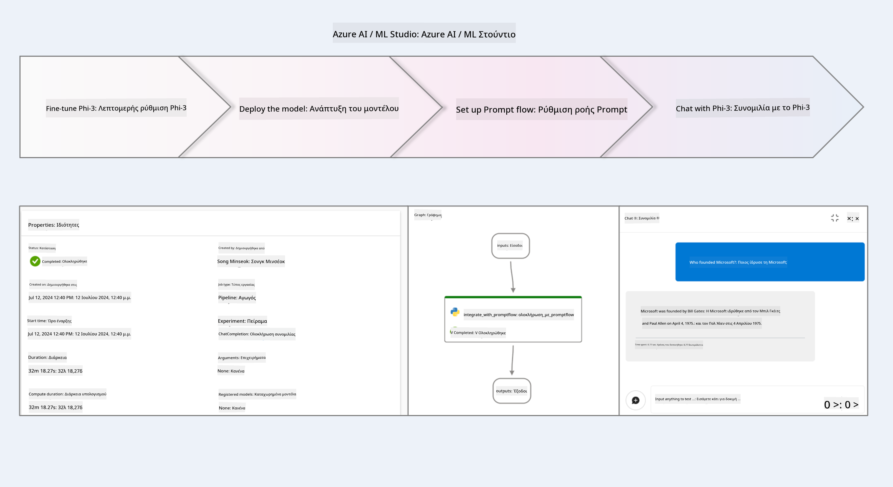

### Πίνακας Περιεχομένων

1. **[Σενάριο 1: Ρύθμιση πόρων Azure και Προετοιμασία για προσαρμογή](../../../../../../md/02.Application/01.TextAndChat/Phi3)**
    - [Δημιουργία Azure Machine Learning Workspace](../../../../../../md/02.Application/01.TextAndChat/Phi3)
    - [Αίτηση για GPU όρια στο Azure Subscription](../../../../../../md/02.Application/01.TextAndChat/Phi3)
    - [Προσθήκη ανάθεσης ρόλου](../../../../../../md/02.Application/01.TextAndChat/Phi3)
    - [Ρύθμιση έργου](../../../../../../md/02.Application/01.TextAndChat/Phi3)
    - [Προετοιμασία συνόλου δεδομένων για προσαρμογή](../../../../../../md/02.Application/01.TextAndChat/Phi3)

1. **[Σενάριο 2: Προσαρμογή μοντέλου Phi-3 και Ανάπτυξη στο Azure Machine Learning Studio](../../../../../../md/02.Application/01.TextAndChat/Phi3)**
    - [Προσαρμογή του μοντέλου Phi-3](../../../../../../md/02.Application/01.TextAndChat/Phi3)
    - [Ανάπτυξη του προσαρμοσμένου μοντέλου Phi-3](../../../../../../md/02.Application/01.TextAndChat/Phi3)

1. **[Σενάριο 3: Ενσωμάτωση με Prompt flow και Συνομιλία με το προσαρμοσμένο μοντέλο σας στο Azure AI Foundry](../../../../../../md/02.Application/01.TextAndChat/Phi3)**
    - [Ενσωμάτωση του προσαρμοσμένου μοντέλου Phi-3 με το Prompt flow](../../../../../../md/02.Application/01.TextAndChat/Phi3)
    - [Συνομιλία με το προσαρμοσμένο μοντέλο Phi-3](../../../../../../md/02.Application/01.TextAndChat/Phi3)

## Σενάριο 1: Ρύθμιση πόρων Azure και Προετοιμασία για προσαρμογή

### Δημιουργία Azure Machine Learning Workspace

1. Πληκτρολογήστε *azure machine learning* στη **γραμμή αναζήτησης** στην κορυφή της σελίδας του portal και επιλέξτε **Azure Machine Learning** από τις διαθέσιμες επιλογές.

    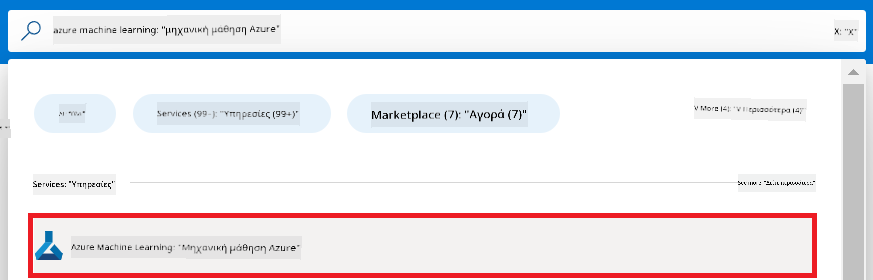

2. Επιλέξτε **+ Create** από το μενού πλοήγησης.

3. Επιλέξτε **New workspace** από το μενού πλοήγησης.

    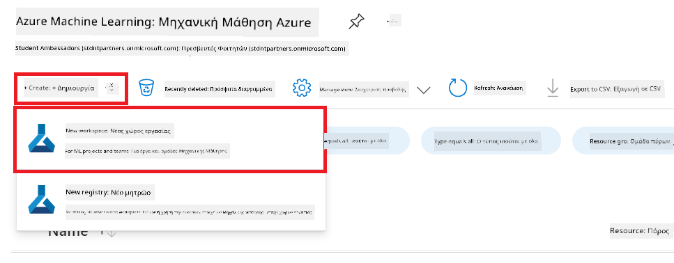

4. Εκτελέστε τις παρακάτω ενέργειες:

    - Επιλέξτε το Azure **Subscription** σας.
    - Επιλέξτε την **Resource group** που θα χρησιμοποιήσετε (δημιουργήστε νέα αν χρειάζεται).
    - Εισάγετε το **Workspace Name**. Πρέπει να είναι μοναδικό.
    - Επιλέξτε την **Περιοχή (Region)** που θέλετε να χρησιμοποιήσετε.
    - Επιλέξτε τον **Λογαριασμό αποθήκευσης (Storage account)** που θα χρησιμοποιήσετε (δημιουργήστε νέο αν χρειάζεται).
    - Επιλέξτε το **Key vault** που θα χρησιμοποιήσετε (δημιουργήστε νέο αν χρειάζεται).
    - Επιλέξτε το **Application insights** που θα χρησιμοποιήσετε (δημιουργήστε νέο αν χρειάζεται).
    - Επιλέξτε το **Container registry** που θα χρησιμοποιήσετε (δημιουργήστε νέο αν χρειάζεται).

    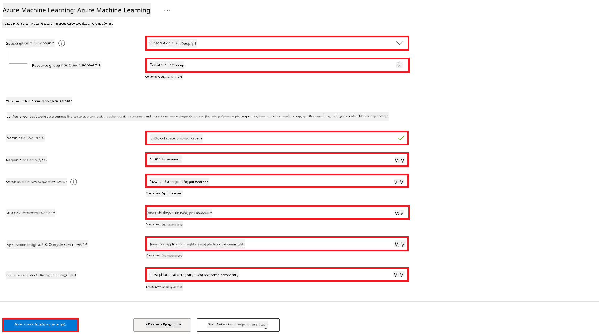

5. Επιλέξτε **Review + Create**.

6. Επιλέξτε **Create**.

### Αίτηση για GPU όρια στο Azure Subscription

Σε αυτό το σεμινάριο, θα μάθετε πώς να προσαρμόζετε και να αναπτύσσετε ένα μοντέλο Phi-3, χρησιμοποιώντας GPUs. Για την προσαρμογή, θα χρησιμοποιήσετε την GPU *Standard_NC24ads_A100_v4*, που απαιτεί αίτηση ορίου. Για την ανάπτυξη, θα χρησιμοποιήσετε την GPU *Standard_NC6s_v3*, που επίσης απαιτεί αίτηση ορίου.

> [!NOTE]
>
> Μόνο οι συνδρομές τύπου Pay-As-You-Go (το τυπικό είδος συνδρομής) δικαιούνται κατανομή GPU· οι συνδρομές με οφέλη δεν υποστηρίζονται προς το παρόν.
>

1. Επισκεφτείτε το [Azure ML Studio](https://ml.azure.com/home?wt.mc_id=studentamb_279723).

1. Εκτελέστε τις παρακάτω ενέργειες για να αιτηθείτε όριο για την οικογένεια *Standard NCADSA100v4*:

    - Επιλέξτε **Quota** από την αριστερή καρτέλα.
    - Επιλέξτε την **οικογένεια εικονικών μηχανών (Virtual machine family)** που θέλετε. Για παράδειγμα, επιλέξτε **Standard NCADSA100v4 Family Cluster Dedicated vCPUs**, που περιλαμβάνει την GPU *Standard_NC24ads_A100_v4*.
    - Επιλέξτε **Request quota** από το μενού πλοήγησης.

        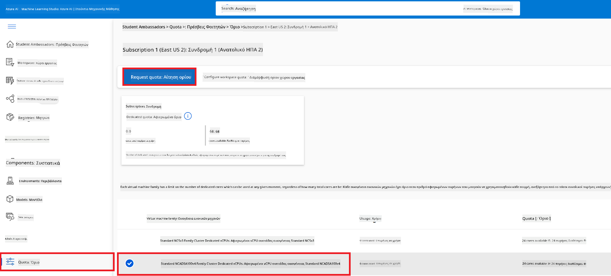

    - Στη σελίδα Request quota, εισάγετε το **Νέο όριο πυρήνων (New cores limit)** που θέλετε να χρησιμοποιήσετε. Για παράδειγμα, 24.
    - Στη σελίδα Request quota, επιλέξτε **Submit** για να υποβάλετε το αίτημα για το όριο GPU.

1. Εκτελέστε τις παρακάτω ενέργειες για να αιτηθείτε όριο για την οικογένεια *Standard NCSv3*:

    - Επιλέξτε **Quota** από την αριστερή καρτέλα.
    - Επιλέξτε την **οικογένεια εικονικών μηχανών (Virtual machine family)** που θέλετε. Για παράδειγμα, επιλέξτε **Standard NCSv3 Family Cluster Dedicated vCPUs**, που περιλαμβάνει την GPU *Standard_NC6s_v3*.
    - Επιλέξτε **Request quota** από το μενού πλοήγησης.
    - Στη σελίδα Request quota, εισάγετε το **Νέο όριο πυρήνων (New cores limit)** που θέλετε να χρησιμοποιήσετε. Για παράδειγμα, 24.
    - Στη σελίδα Request quota, επιλέξτε **Submit** για να υποβάλετε το αίτημα για το όριο GPU.

### Προσθήκη ανάθεσης ρόλου

Για να προσαρμόσετε και να αναπτύξετε τα μοντέλα σας, πρέπει πρώτα να δημιουργήσετε ένα User Assigned Managed Identity (UAI) και να του αναθέσετε τα κατάλληλα δικαιώματα. Αυτό το UAI θα χρησιμοποιηθεί για την πιστοποίηση κατά την ανάπτυξη.

#### Δημιουργία User Assigned Managed Identity (UAI)

1. Πληκτρολογήστε *managed identities* στη **γραμμή αναζήτησης** στην κορυφή της σελίδας του portal και επιλέξτε **Managed Identities** από τις διαθέσιμες επιλογές.

    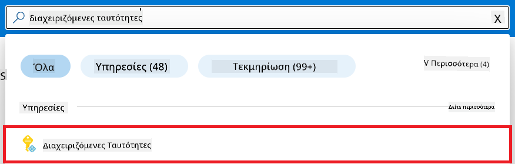

1. Επιλέξτε **+ Create**.

    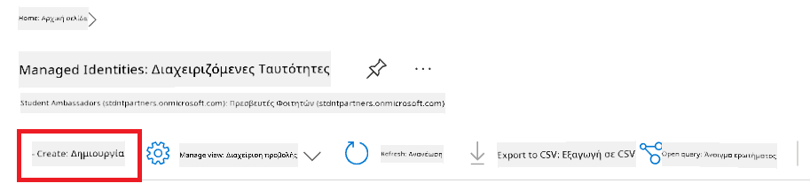

1. Εκτελέστε τις παρακάτω ενέργειες:

    - Επιλέξτε το Azure **Subscription** σας.
    - Επιλέξτε την **Resource group** που θα χρησιμοποιήσετε (δημιουργήστε νέα αν χρειάζεται).
    - Επιλέξτε την **Περιοχή (Region)** που θέλετε να χρησιμοποιήσετε.
    - Εισάγετε το **Όνομα (Name)**. Πρέπει να είναι μοναδικό.

    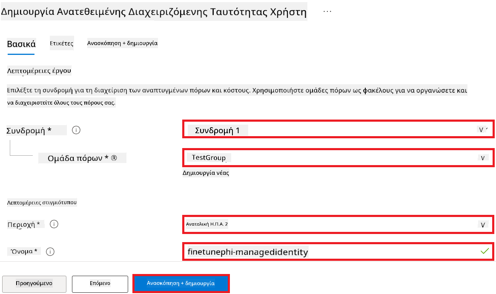

1. Επιλέξτε **Review + create**.

1. Επιλέξτε **+ Create**.

#### Προσθήκη ανάθεσης ρόλου Contributor στο Managed Identity

1. Μεταβείτε στον πόρο Managed Identity που δημιουργήσατε.

1. Επιλέξτε **Azure role assignments** από την αριστερή καρτέλα.

1. Επιλέξτε **+Add role assignment** από το μενού πλοήγησης.

1. Στη σελίδα Add role assignment, εκτελέστε τα παρακάτω:

    - Ορίστε το **Scope** σε **Resource group**.
    - Επιλέξτε το Azure **Subscription** σας.
    - Επιλέξτε την **Resource group** που θα χρησιμοποιήσετε.
    - Ορίστε το **Role** σε **Contributor**.

    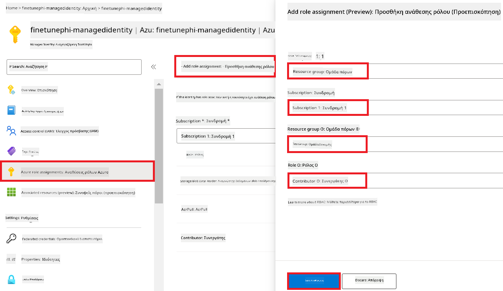

2. Επιλέξτε **Save**.

#### Προσθήκη ανάθεσης ρόλου Storage Blob Data Reader στο Managed Identity

1. Πληκτρολογήστε *storage accounts* στη **γραμμή αναζήτησης** στην κορυφή της σελίδας του portal και επιλέξτε **Storage accounts** από τις διαθέσιμες επιλογές.

    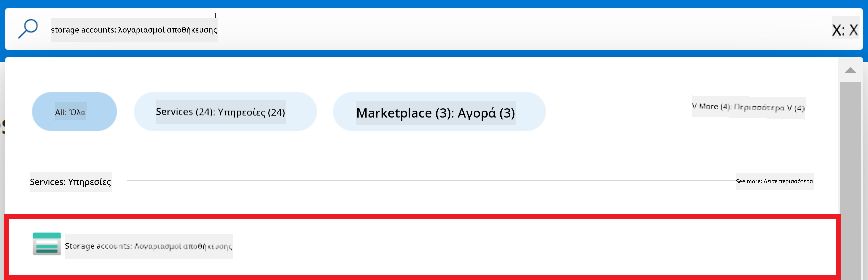

1. Επιλέξτε τον λογαριασμό αποθήκευσης που σχετίζεται με το Azure Machine Learning workspace που δημιουργήσατε. Για παράδειγμα, *finetunephistorage*.

1. Εκτελέστε τις παρακάτω ενέργειες για να μεταβείτε στη σελίδα Add role assignment:

    - Μεταβείτε στον Azure Storage account που δημιουργήσατε.
    - Επιλέξτε **Access Control (IAM)** από την αριστερή καρτέλα.
    - Επιλέξτε **+ Add** από το μενού πλοήγησης.
    - Επιλέξτε **Add role assignment** από το μενού πλοήγησης.

    

1. Στη σελίδα Add role assignment, εκτελέστε τα παρακάτω:

    - Στη σελίδα Role, πληκτρολογήστε *Storage Blob Data Reader* στη **γραμμή αναζήτησης** και επιλέξτε **Storage Blob Data Reader** από τις επιλογές.
    - Στη σελίδα Role, επιλέξτε **Next**.
    - Στη σελίδα Members, επιλέξτε **Assign access to** **Managed identity**.
    - Στη σελίδα Members, επιλέξτε **+ Select members**.
    - Στη σελίδα Select managed identities, επιλέξτε το Azure **Subscription** σας.
    - Στη σελίδα Select managed identities, επιλέξτε το **Managed identity** ως **Manage Identity**.
    - Στη σελίδα Select managed identities, επιλέξτε το Manage Identity που δημιουργήσατε. Για παράδειγμα, *finetunephi-managedidentity*.
    - Στη σελίδα Select managed identities, επιλέξτε **Select**.

    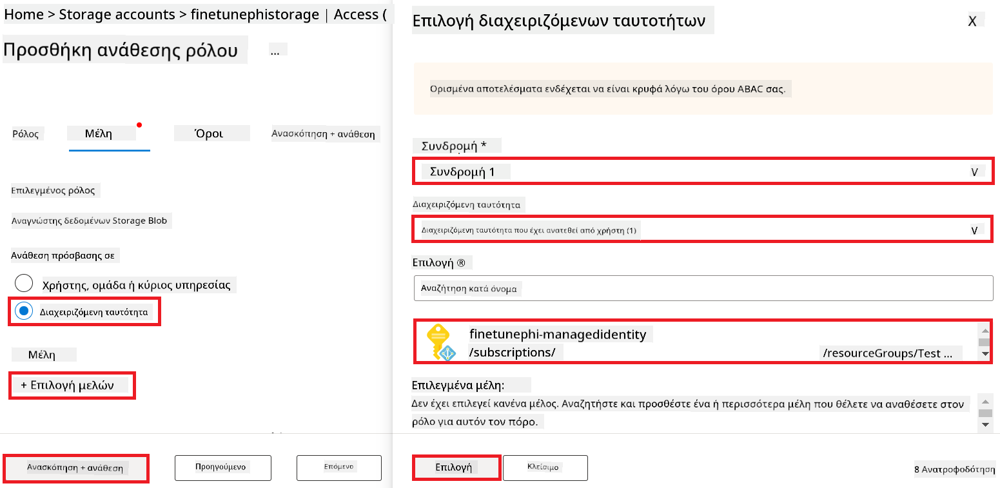

1. Επιλέξτε **Review + assign**.

#### Προσθήκη ανάθεσης ρόλου AcrPull στο Managed Identity

1. Πληκτρολογήστε *container registries* στη **γραμμή αναζήτησης** στην κορυφή της σελίδας του portal και επιλέξτε **Container registries** από τις διαθέσιμες επιλογές.

    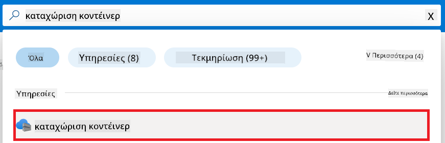

1. Επιλέξτε το container registry που σχετίζεται με το Azure Machine Learning workspace. Για παράδειγμα, *finetunephicontainerregistry*.

1. Εκτελέστε τις παρακάτω ενέργειες για να μεταβείτε στη σελίδα Add role assignment:

    - Επιλέξτε **Access Control (IAM)** από την αριστερή καρτέλα.
    - Επιλέξτε **+ Add** από το μενού πλοήγησης.
    - Επιλέξτε **Add role assignment** από το μενού πλοήγησης.

1. Στη σελίδα Add role assignment, εκτελέστε τα παρακάτω:

    - Στη σελίδα Role, πληκτρολογήστε *AcrPull* στη **γραμμή αναζήτησης** και επιλέξτε **AcrPull** από τις επιλογές.
    - Στη σελίδα Role, επιλέξτε **Next**.
    - Στη σελίδα Members, επιλέξτε **Assign access to** **Managed identity**.
    - Στη σελίδα Members, επιλέξτε **+ Select members**.
    - Στη σελίδα Select managed identities, επιλέξτε το Azure **Subscription** σας.
    - Στη σελίδα Select managed identities, επιλέξτε το **Managed identity** ως **Manage Identity**.
    - Στη σελίδα Select managed identities, επιλέξτε το Manage Identity που δημιουργήσατε. Για παράδειγμα, *finetunephi-managedidentity*.
    - Στη σελίδα Select managed identities, επιλέξτε **Select**.
    - Επιλέξτε **Review + assign**.

### Ρύθμιση έργου

Για να κατεβάσετε τα σύνολα δεδομένων που χρειάζονται για προσαρμογή, θα ρυθμίσετε ένα τοπικό περιβάλλον.

Σε αυτή την άσκηση, θα:

- Δημιουργήσετε έναν φάκελο εργασίας.
- Δημιουργήσετε ένα εικονικό περιβάλλον.
- Εγκαταστήσετε τα απαιτούμενα πακέτα.
- Δημιουργήσετε ένα αρχείο *download_dataset.py* για να κατεβάσετε το σύνολο δεδομένων.

#### Δημιουργία φακέλου εργασίας

1. Ανοίξτε ένα παράθυρο τερματικού και πληκτρολογήστε την παρακάτω εντολή για να δημιουργήσετε ένα φάκελο με όνομα *finetune-phi* στην προεπιλεγμένη διαδρομή.

    ```console
    mkdir finetune-phi
    ```

2. Πληκτρολογήστε την παρακάτω εντολή μέσα στο τερματικό σας για να μεταβείτε στον φάκελο *finetune-phi* που δημιουργήσατε.

    ```console
    cd finetune-phi
    ```

#### Δημιουργία εικονικού περιβάλλοντος

1. Πληκτρολογήστε την παρακάτω εντολή μέσα στο τερματικό σας για να δημιουργήσετε ένα εικονικό περιβάλλον με όνομα *.venv*
1. Επισκεφθείτε το [Azure ML Studio](https://ml.azure.com/home?wt.mc_id=studentamb_279723).

1. Επιλέξτε **Compute** από την αριστερή καρτέλα.

1. Επιλέξτε **Compute clusters** από το μενού πλοήγησης.

1. Επιλέξτε **+ New**.

    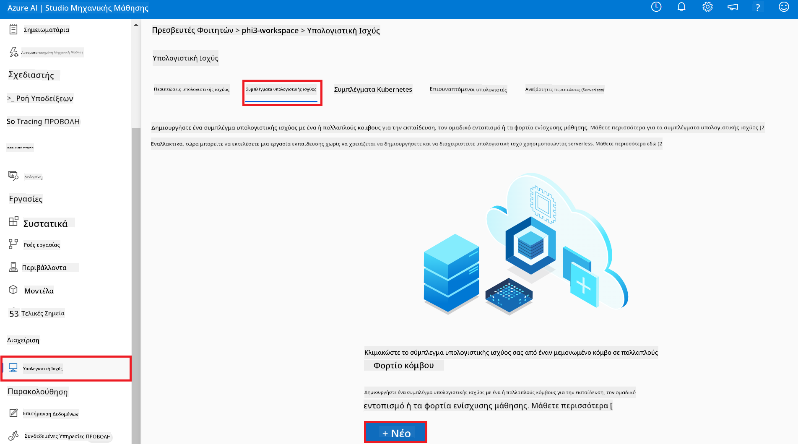

1. Εκτελέστε τις παρακάτω ενέργειες:

    - Επιλέξτε την **Region** που θέλετε να χρησιμοποιήσετε.
    - Επιλέξτε το **Virtual machine tier** σε **Dedicated**.
    - Επιλέξτε τον **Virtual machine type** σε **GPU**.
    - Φιλτράρετε το **Virtual machine size** σε **Select from all options**.
    - Επιλέξτε το **Virtual machine size** σε **Standard_NC24ads_A100_v4**.

    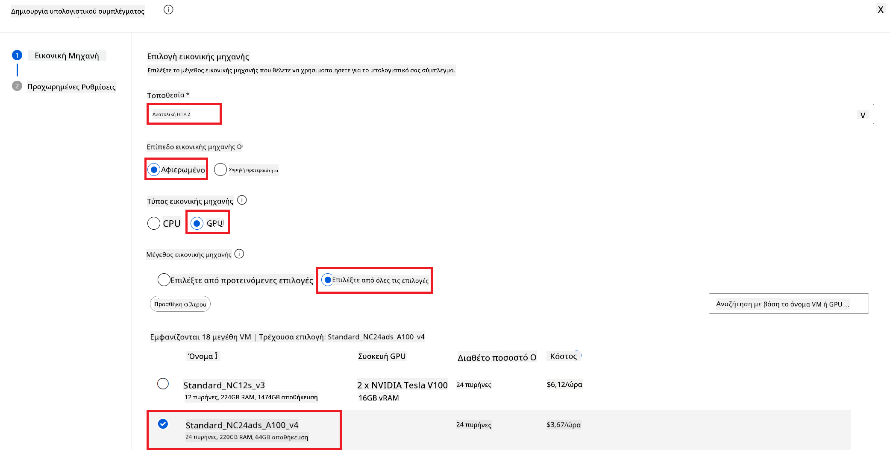

1. Επιλέξτε **Next**.

1. Εκτελέστε τις παρακάτω ενέργειες:

    - Εισάγετε **Compute name**. Πρέπει να είναι μοναδικό.
    - Ορίστε το **Minimum number of nodes** σε **0**.
    - Ορίστε το **Maximum number of nodes** σε **1**.
    - Ορίστε το **Idle seconds before scale down** σε **120**.

    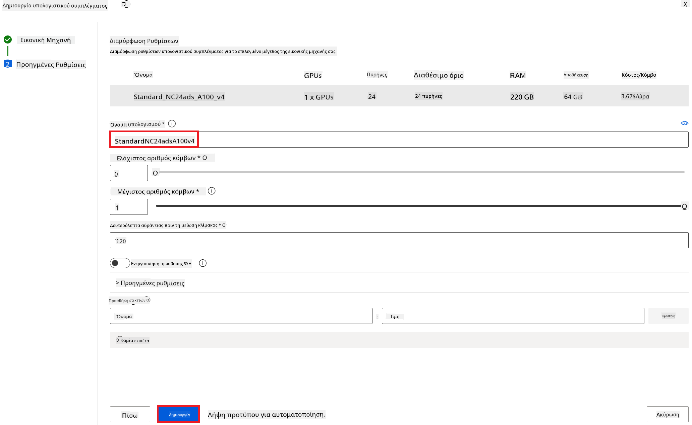

1. Επιλέξτε **Create**.

#### Fine-tune το μοντέλο Phi-3

1. Επισκεφθείτε το [Azure ML Studio](https://ml.azure.com/home?wt.mc_id=studentamb_279723).

1. Επιλέξτε το Azure Machine Learning workspace που δημιουργήσατε.

    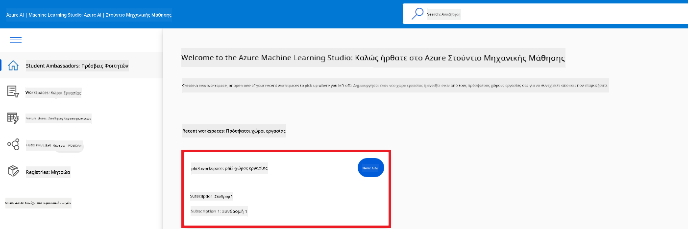

1. Εκτελέστε τις παρακάτω ενέργειες:

    - Επιλέξτε **Model catalog** από την αριστερή καρτέλα.
    - Πληκτρολογήστε *phi-3-mini-4k* στη **γραμμή αναζήτησης** και επιλέξτε **Phi-3-mini-4k-instruct** από τις επιλογές που εμφανίζονται.

    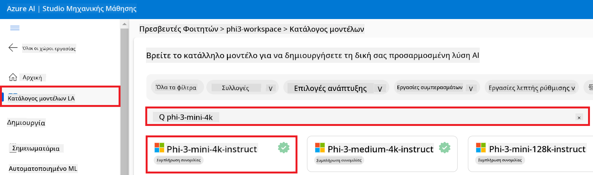

1. Επιλέξτε **Fine-tune** από το μενού πλοήγησης.

    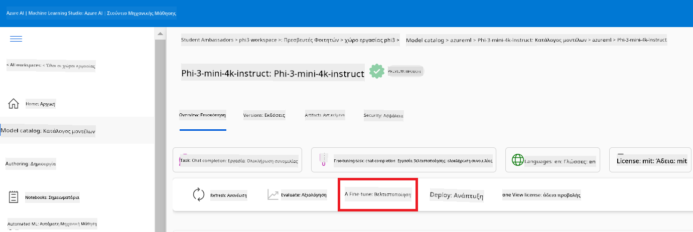

1. Εκτελέστε τις παρακάτω ενέργειες:

    - Ορίστε το **Select task type** σε **Chat completion**.
    - Επιλέξτε **+ Select data** για να ανεβάσετε τα **Traning data**.
    - Επιλέξτε τον τύπο ανέβασμα των Validation data σε **Provide different validation data**.
    - Επιλέξτε **+ Select data** για να ανεβάσετε τα **Validation data**.

    

    > [!TIP]
    >
    > Μπορείτε να επιλέξετε **Advanced settings** για να προσαρμόσετε ρυθμίσεις όπως το **learning_rate** και το **lr_scheduler_type** ώστε να βελτιστοποιήσετε τη διαδικασία fine-tuning σύμφωνα με τις ανάγκες σας.

1. Επιλέξτε **Finish**.

1. Σε αυτή την άσκηση, ολοκληρώσατε επιτυχώς το fine-tuning του μοντέλου Phi-3 χρησιμοποιώντας το Azure Machine Learning. Σημειώστε ότι η διαδικασία fine-tuning μπορεί να διαρκέσει αρκετή ώρα. Μετά την εκτέλεση της εργασίας fine-tuning, πρέπει να περιμένετε να ολοκληρωθεί. Μπορείτε να παρακολουθείτε την κατάσταση της εργασίας πηγαίνοντας στην καρτέλα Jobs στην αριστερή πλευρά του Azure Machine Learning Workspace σας. Στη συνέχεια, θα αναπτύξετε το fine-tuned μοντέλο και θα το ενσωματώσετε με το Prompt flow.

    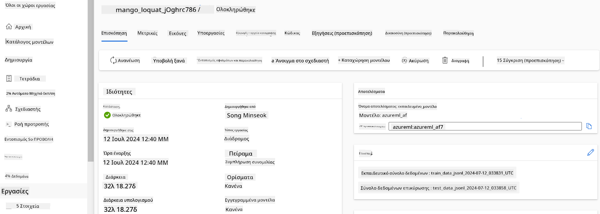

### Ανάπτυξη του fine-tuned μοντέλου Phi-3

Για να ενσωματώσετε το fine-tuned μοντέλο Phi-3 με το Prompt flow, πρέπει να αναπτύξετε το μοντέλο ώστε να είναι διαθέσιμο για inference σε πραγματικό χρόνο. Αυτή η διαδικασία περιλαμβάνει την καταχώρηση του μοντέλου, τη δημιουργία online endpoint και την ανάπτυξη του μοντέλου.

Σε αυτή την άσκηση, θα:

- Καταχωρήσετε το fine-tuned μοντέλο στο Azure Machine Learning workspace.
- Δημιουργήσετε ένα online endpoint.
- Αναπτύξετε το καταχωρημένο fine-tuned μοντέλο Phi-3.

#### Καταχώρηση του fine-tuned μοντέλου

1. Επισκεφθείτε το [Azure ML Studio](https://ml.azure.com/home?wt.mc_id=studentamb_279723).

1. Επιλέξτε το Azure Machine Learning workspace που δημιουργήσατε.

    

1. Επιλέξτε **Models** από την αριστερή καρτέλα.
1. Επιλέξτε **+ Register**.
1. Επιλέξτε **From a job output**.

    

1. Επιλέξτε την εργασία που δημιουργήσατε.

    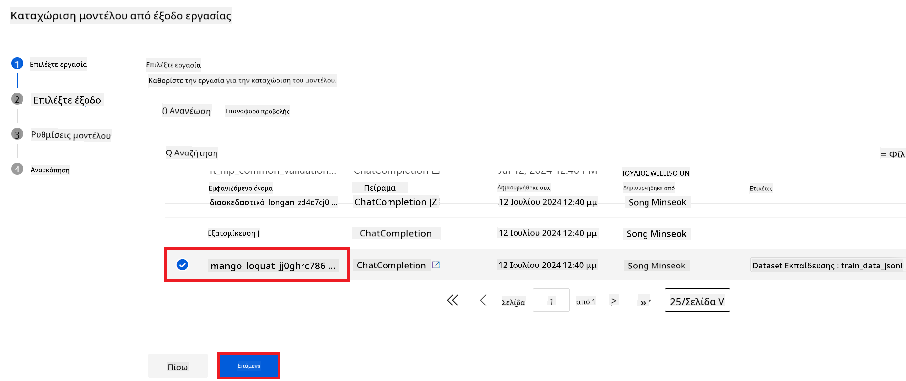

1. Επιλέξτε **Next**.

1. Ορίστε το **Model type** σε **MLflow**.

1. Βεβαιωθείτε ότι έχει επιλεγεί το **Job output**, το οποίο θα πρέπει να είναι επιλεγμένο αυτόματα.

    

2. Επιλέξτε **Next**.

3. Επιλέξτε **Register**.

    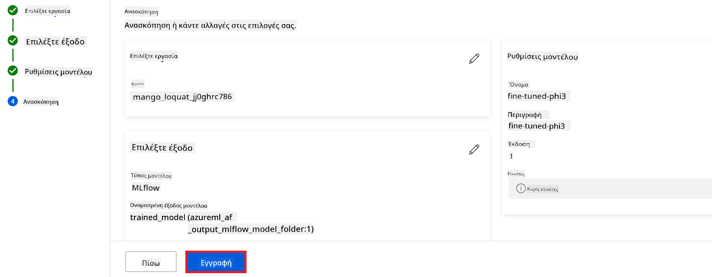

4. Μπορείτε να δείτε το καταχωρημένο μοντέλο πηγαίνοντας στο μενού **Models** στην αριστερή καρτέλα.

    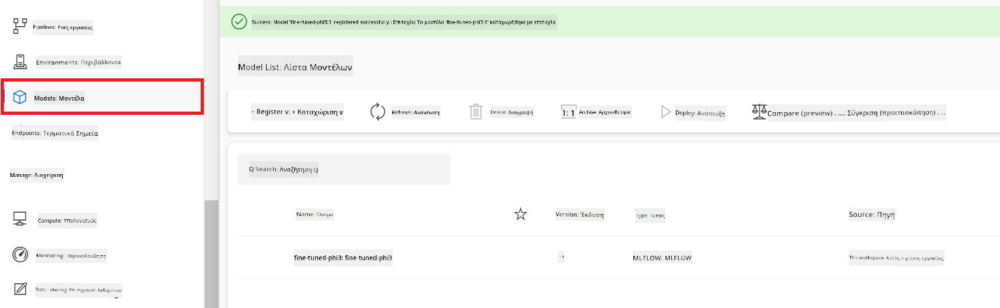

#### Ανάπτυξη του fine-tuned μοντέλου

1. Μεταβείτε στο Azure Machine Learning workspace που δημιουργήσατε.

1. Επιλέξτε **Endpoints** από την αριστερή καρτέλα.

1. Επιλέξτε **Real-time endpoints** από το μενού πλοήγησης.

    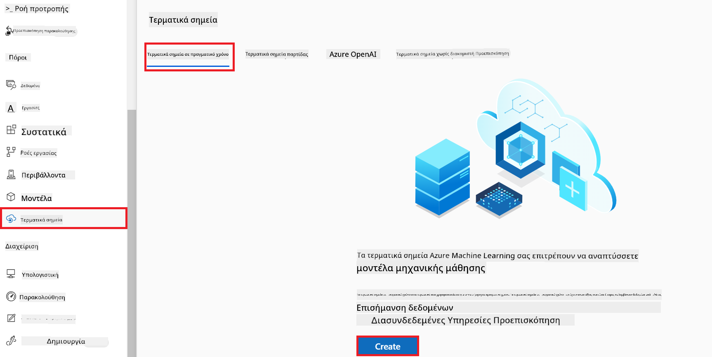

1. Επιλέξτε **Create**.

1. Επιλέξτε το καταχωρημένο μοντέλο που δημιουργήσατε.

    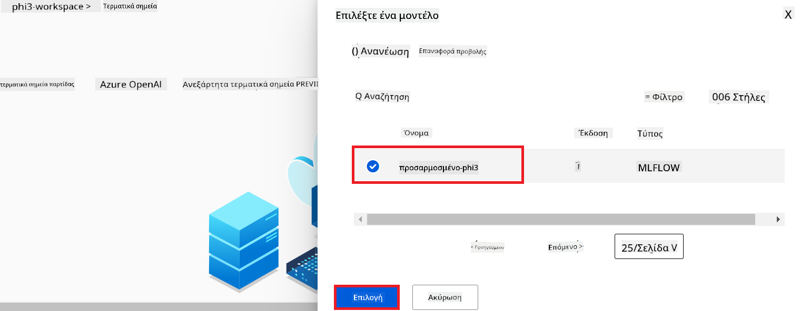

1. Επιλέξτε **Select**.

1. Εκτελέστε τις παρακάτω ενέργειες:

    - Επιλέξτε **Virtual machine** σε *Standard_NC6s_v3*.
    - Ορίστε τον **Instance count** που επιθυμείτε. Για παράδειγμα, *1*.
    - Ορίστε το **Endpoint** σε **New** για να δημιουργήσετε νέο endpoint.
    - Εισάγετε **Endpoint name**. Πρέπει να είναι μοναδικό.
    - Εισάγετε **Deployment name**. Πρέπει να είναι μοναδικό.

    

1. Επιλέξτε **Deploy**.

> [!WARNING]
> Για να αποφύγετε επιπλέον χρεώσεις, βεβαιωθείτε ότι διαγράψατε το δημιουργημένο endpoint στο Azure Machine Learning workspace.
>

#### Έλεγχος κατάστασης ανάπτυξης στο Azure Machine Learning Workspace

1. Μεταβείτε στο Azure Machine Learning workspace που δημιουργήσατε.

1. Επιλέξτε **Endpoints** από την αριστερή καρτέλα.

1. Επιλέξτε το endpoint που δημιουργήσατε.

    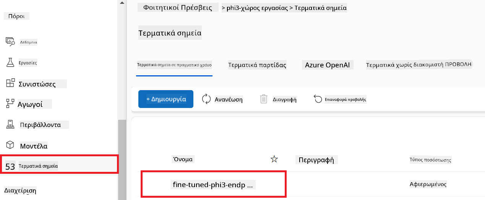

1. Σε αυτή τη σελίδα, μπορείτε να διαχειριστείτε τα endpoints κατά τη διάρκεια της ανάπτυξης.

> [!NOTE]
> Όταν ολοκληρωθεί η ανάπτυξη, βεβαιωθείτε ότι το **Live traffic** έχει οριστεί στο **100%**. Αν όχι, επιλέξτε **Update traffic** για να προσαρμόσετε την κατανομή της κυκλοφορίας. Σημειώστε ότι δεν μπορείτε να δοκιμάσετε το μοντέλο αν η κυκλοφορία είναι στο 0%.
>
> 
>

## Σενάριο 3: Ενσωμάτωση με Prompt flow και συνομιλία με το προσαρμοσμένο μοντέλο σας στο Azure AI Foundry

### Ενσωμάτωση του προσαρμοσμένου μοντέλου Phi-3 με το Prompt flow

Μετά την επιτυχή ανάπτυξη του fine-tuned μοντέλου σας, μπορείτε τώρα να το ενσωματώσετε με το Prompt Flow για να το χρησιμοποιήσετε σε εφαρμογές πραγματικού χρόνου, επιτρέποντας μια σειρά διαδραστικών εργασιών με το προσαρμοσμένο μοντέλο Phi-3.

Σε αυτή την άσκηση, θα:

- Δημιουργήσετε Azure AI Foundry Hub.
- Δημιουργήσετε Azure AI Foundry Project.
- Δημιουργήσετε Prompt flow.
- Προσθέσετε μια προσαρμοσμένη σύνδεση για το fine-tuned μοντέλο Phi-3.
- Ρυθμίσετε το Prompt flow για συνομιλία με το προσαρμοσμένο μοντέλο Phi-3.

> [!NOTE]
> Μπορείτε επίσης να ενσωματώσετε με το Promptflow χρησιμοποιώντας το Azure ML Studio. Η ίδια διαδικασία ενσωμάτωσης ισχύει και για το Azure ML Studio.

#### Δημιουργία Azure AI Foundry Hub

Πρέπει να δημιουργήσετε έναν Hub πριν δημιουργήσετε το Project. Ο Hub λειτουργεί σαν Resource Group, επιτρέποντάς σας να οργανώσετε και να διαχειριστείτε πολλαπλά Projects μέσα στο Azure AI Foundry.

1. Επισκεφθείτε το [Azure AI Foundry](https://ai.azure.com/?WT.mc_id=aiml-137032-kinfeylo).

1. Επιλέξτε **All hubs** από την αριστερή καρτέλα.

1. Επιλέξτε **+ New hub** από το μενού πλοήγησης.

    

1. Εκτελέστε τις παρακάτω ενέργειες:

    - Εισάγετε **Hub name**. Πρέπει να είναι μοναδικό.
    - Επιλέξτε τη συνδρομή Azure (**Subscription**) σας.
    - Επιλέξτε το **Resource group** που θέλετε να χρησιμοποιήσετε (δημιουργήστε νέο αν χρειάζεται).
    - Επιλέξτε την **Location** που θέλετε να χρησιμοποιήσετε.
    - Επιλέξτε το **Connect Azure AI Services** που θέλετε να χρησιμοποιήσετε (δημιουργήστε νέο αν χρειάζεται).
    - Επιλέξτε **Connect Azure AI Search** σε **Skip connecting**.

    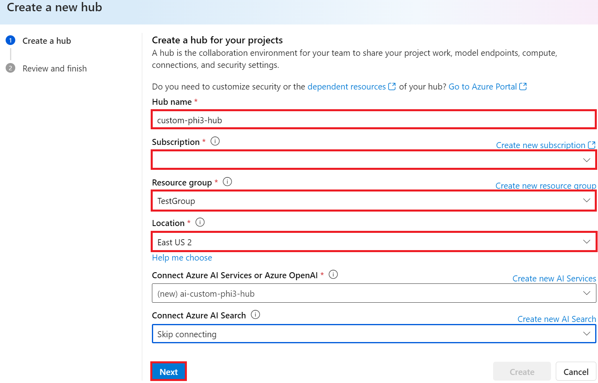

1. Επιλέξτε **Next**.

#### Δημιουργία Azure AI Foundry Project

1. Στον Hub που δημιουργήσατε, επιλέξτε **All projects** από την αριστερή καρτέλα.

1. Επιλέξτε **+ New project** από το μενού πλοήγησης.

    

1. Εισάγετε **Project name**. Πρέπει να είναι μοναδικό.

    

1. Επιλέξτε **Create a project**.

#### Προσθήκη προσαρμοσμένης σύνδεσης για το fine-tuned μοντέλο Phi-3

Για να ενσωματώσετε το προσαρμοσμένο μοντέλο Phi-3 με το Prompt flow, πρέπει να αποθηκεύσετε το endpoint και το κλειδί του μοντέλου σε μια προσαρμοσμένη σύνδεση. Αυτή η ρύθμιση εξασφαλίζει την πρόσβαση στο προσαρμοσμένο μοντέλο Phi-3 μέσα στο Prompt flow.

#### Ρύθμιση του api key και του endpoint uri του fine-tuned μοντέλου Phi-3

1. Επισκεφθείτε το [Azure ML Studio](https://ml.azure.com/home?WT.mc_id=aiml-137032-kinfeylo).

1. Μεταβείτε στο Azure Machine Learning workspace που δημιουργήσατε.

1. Επιλέξτε **Endpoints** από την αριστερή καρτέλα.

    

1. Επιλέξτε το endpoint που δημιουργήσατε.

    

1. Επιλέξτε **Consume** από το μενού πλοήγησης.

1. Αντιγράψτε το **REST endpoint** και το **Primary key** σας.
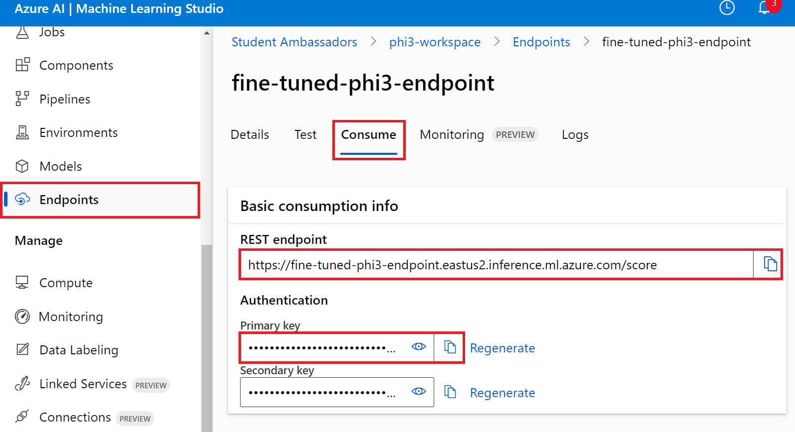

#### Προσθήκη Προσαρμοσμένης Σύνδεσης

1. Επισκεφθείτε το [Azure AI Foundry](https://ai.azure.com/?WT.mc_id=aiml-137032-kinfeylo).

1. Μεταβείτε στο έργο Azure AI Foundry που δημιουργήσατε.

1. Στο έργο που δημιουργήσατε, επιλέξτε **Settings** από την αριστερή καρτέλα.

1. Επιλέξτε **+ New connection**.

    

1. Επιλέξτε **Custom keys** από το μενού πλοήγησης.

    

1. Εκτελέστε τα παρακάτω βήματα:

    - Επιλέξτε **+ Add key value pairs**.
    - Στο πεδίο του ονόματος κλειδιού, πληκτρολογήστε **endpoint** και επικολλήστε το endpoint που αντιγράψατε από το Azure ML Studio στο πεδίο τιμής.
    - Επιλέξτε ξανά **+ Add key value pairs**.
    - Στο πεδίο του ονόματος κλειδιού, πληκτρολογήστε **key** και επικολλήστε το key που αντιγράψατε από το Azure ML Studio στο πεδίο τιμής.
    - Μετά την προσθήκη των κλειδιών, επιλέξτε **is secret** για να αποτρέψετε την έκθεση του κλειδιού.

    

1. Επιλέξτε **Add connection**.

#### Δημιουργία Prompt flow

Έχετε προσθέσει μια προσαρμοσμένη σύνδεση στο Azure AI Foundry. Τώρα, ας δημιουργήσουμε ένα Prompt flow ακολουθώντας τα παρακάτω βήματα. Στη συνέχεια, θα συνδέσετε αυτό το Prompt flow με την προσαρμοσμένη σύνδεση ώστε να μπορείτε να χρησιμοποιήσετε το fine-tuned μοντέλο μέσα στο Prompt flow.

1. Μεταβείτε στο έργο Azure AI Foundry που δημιουργήσατε.

1. Επιλέξτε **Prompt flow** από την αριστερή καρτέλα.

1. Επιλέξτε **+ Create** από το μενού πλοήγησης.

    

1. Επιλέξτε **Chat flow** από το μενού πλοήγησης.

    

1. Εισάγετε το **Folder name** που θέλετε να χρησιμοποιήσετε.

    

2. Επιλέξτε **Create**.

#### Ρύθμιση Prompt flow για συνομιλία με το προσαρμοσμένο μοντέλο Phi-3

Πρέπει να ενσωματώσετε το fine-tuned μοντέλο Phi-3 σε ένα Prompt flow. Ωστόσο, το υπάρχον Prompt flow δεν είναι σχεδιασμένο γι' αυτό το σκοπό. Επομένως, πρέπει να ανασχεδιάσετε το Prompt flow ώστε να επιτρέπεται η ενσωμάτωση του προσαρμοσμένου μοντέλου.

1. Στο Prompt flow, εκτελέστε τα παρακάτω για να αναδημιουργήσετε το υπάρχον flow:

    - Επιλέξτε **Raw file mode**.
    - Διαγράψτε όλο τον υπάρχοντα κώδικα στο αρχείο *flow.dag.yml*.
    - Προσθέστε τον παρακάτω κώδικα στο αρχείο *flow.dag.yml*.

        ```yml
        inputs:
          input_data:
            type: string
            default: "Who founded Microsoft?"

        outputs:
          answer:
            type: string
            reference: ${integrate_with_promptflow.output}

        nodes:
        - name: integrate_with_promptflow
          type: python
          source:
            type: code
            path: integrate_with_promptflow.py
          inputs:
            input_data: ${inputs.input_data}
        ```

    - Επιλέξτε **Save**.

    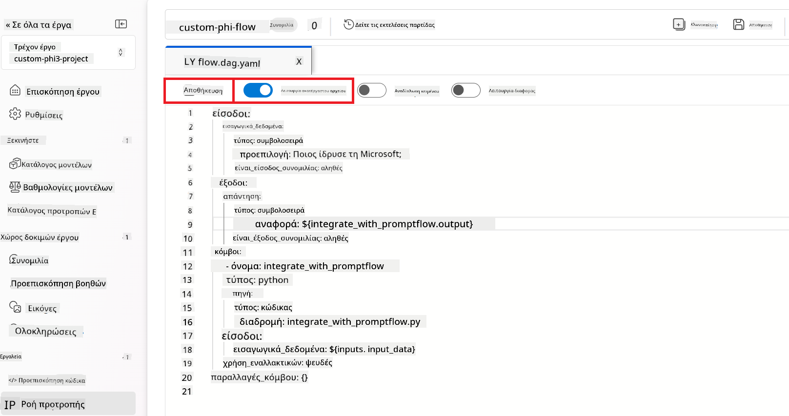

1. Προσθέστε τον παρακάτω κώδικα στο αρχείο *integrate_with_promptflow.py* για να χρησιμοποιήσετε το προσαρμοσμένο μοντέλο Phi-3 στο Prompt flow.

    ```python
    import logging
    import requests
    from promptflow import tool
    from promptflow.connections import CustomConnection

    # Logging setup
    logging.basicConfig(
        format="%(asctime)s - %(levelname)s - %(name)s - %(message)s",
        datefmt="%Y-%m-%d %H:%M:%S",
        level=logging.DEBUG
    )
    logger = logging.getLogger(__name__)

    def query_phi3_model(input_data: str, connection: CustomConnection) -> str:
        """
        Send a request to the Phi-3 model endpoint with the given input data using Custom Connection.
        """

        # "connection" is the name of the Custom Connection, "endpoint", "key" are the keys in the Custom Connection
        endpoint_url = connection.endpoint
        api_key = connection.key

        headers = {
            "Content-Type": "application/json",
            "Authorization": f"Bearer {api_key}"
        }
        data = {
            "input_data": {
                "input_string": [
                    {"role": "user", "content": input_data}
                ],
                "parameters": {
                    "temperature": 0.7,
                    "max_new_tokens": 128
                }
            }
        }
        try:
            response = requests.post(endpoint_url, json=data, headers=headers)
            response.raise_for_status()
            
            # Log the full JSON response
            logger.debug(f"Full JSON response: {response.json()}")

            result = response.json()["output"]
            logger.info("Successfully received response from Azure ML Endpoint.")
            return result
        except requests.exceptions.RequestException as e:
            logger.error(f"Error querying Azure ML Endpoint: {e}")
            raise

    @tool
    def my_python_tool(input_data: str, connection: CustomConnection) -> str:
        """
        Tool function to process input data and query the Phi-3 model.
        """
        return query_phi3_model(input_data, connection)

    ```

    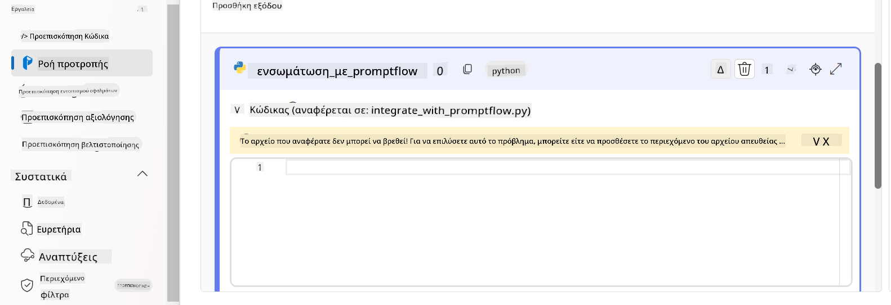

> [!NOTE]
> Για πιο αναλυτικές πληροφορίες σχετικά με τη χρήση του Prompt flow στο Azure AI Foundry, μπορείτε να ανατρέξετε στο [Prompt flow in Azure AI Foundry](https://learn.microsoft.com/azure/ai-studio/how-to/prompt-flow).

1. Επιλέξτε **Chat input**, **Chat output** για να ενεργοποιήσετε τη συνομιλία με το μοντέλο σας.

    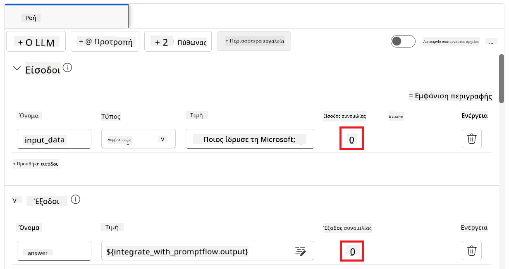

1. Τώρα είστε έτοιμοι να συνομιλήσετε με το προσαρμοσμένο μοντέλο Phi-3. Στην επόμενη άσκηση, θα μάθετε πώς να ξεκινήσετε το Prompt flow και να το χρησιμοποιήσετε για συνομιλία με το fine-tuned μοντέλο Phi-3.

> [!NOTE]
>
> Το αναδημιουργημένο flow θα πρέπει να μοιάζει με την εικόνα παρακάτω:
>
> 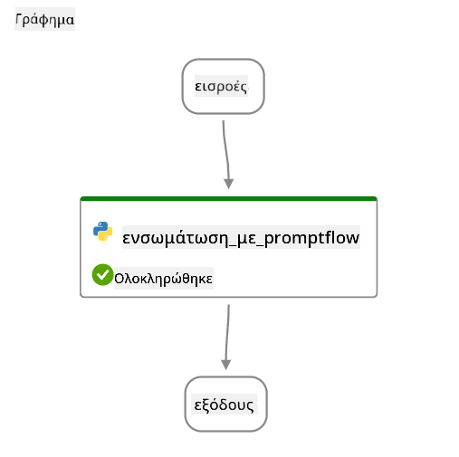
>

### Συνομιλία με το προσαρμοσμένο μοντέλο Phi-3

Τώρα που έχετε fine-tune και ενσωματώσει το προσαρμοσμένο μοντέλο Phi-3 με το Prompt flow, είστε έτοιμοι να ξεκινήσετε την αλληλεπίδραση μαζί του. Αυτή η άσκηση θα σας καθοδηγήσει στη διαδικασία ρύθμισης και εκκίνησης μιας συνομιλίας με το μοντέλο σας χρησιμοποιώντας το Prompt flow. Ακολουθώντας αυτά τα βήματα, θα μπορέσετε να αξιοποιήσετε πλήρως τις δυνατότητες του fine-tuned μοντέλου Phi-3 για διάφορες εργασίες και συνομιλίες.

- Συνομιλήστε με το προσαρμοσμένο μοντέλο Phi-3 χρησιμοποιώντας το Prompt flow.

#### Εκκίνηση Prompt flow

1. Επιλέξτε **Start compute sessions** για να ξεκινήσετε το Prompt flow.

    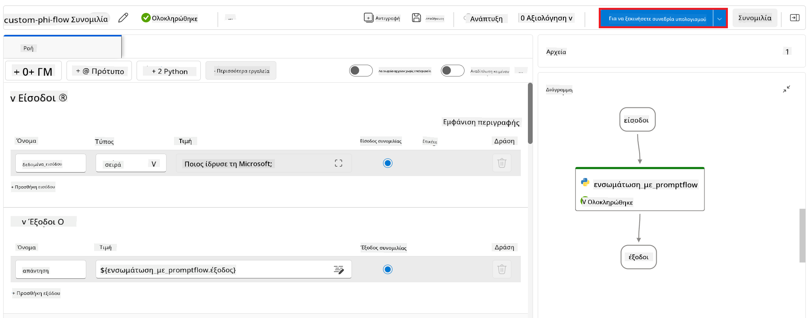

1. Επιλέξτε **Validate and parse input** για να ανανεώσετε τις παραμέτρους.

    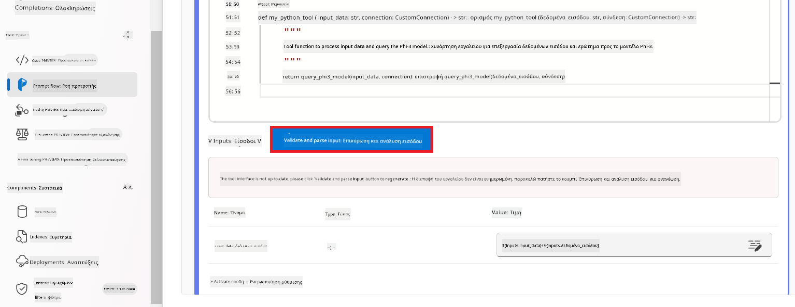

1. Επιλέξτε την **Value** της **connection** που αντιστοιχεί στην προσαρμοσμένη σύνδεση που δημιουργήσατε. Για παράδειγμα, *connection*.

    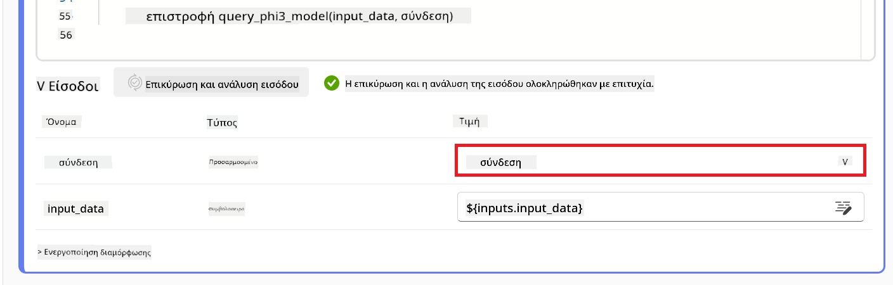

#### Συνομιλία με το προσαρμοσμένο μοντέλο

1. Επιλέξτε **Chat**.

    

1. Ακολουθεί ένα παράδειγμα των αποτελεσμάτων: Τώρα μπορείτε να συνομιλήσετε με το προσαρμοσμένο μοντέλο Phi-3. Συνιστάται να κάνετε ερωτήσεις βασισμένες στα δεδομένα που χρησιμοποιήθηκαν για το fine-tuning.

    

**Αποποίηση Ευθύνης**:  
Αυτό το έγγραφο έχει μεταφραστεί χρησιμοποιώντας την υπηρεσία αυτόματης μετάφρασης AI [Co-op Translator](https://github.com/Azure/co-op-translator). Παρόλο που επιδιώκουμε την ακρίβεια, παρακαλούμε να έχετε υπόψη ότι οι αυτοματοποιημένες μεταφράσεις μπορεί να περιέχουν λάθη ή ανακρίβειες. Το πρωτότυπο έγγραφο στη μητρική του γλώσσα πρέπει να θεωρείται η αυθεντική πηγή. Για κρίσιμες πληροφορίες, συνιστάται επαγγελματική μετάφραση από ανθρώπους. Δεν φέρουμε ευθύνη για τυχόν παρεξηγήσεις ή λανθασμένες ερμηνείες που προκύπτουν από τη χρήση αυτής της μετάφρασης.