<!--
CO_OP_TRANSLATOR_METADATA:
{
  "original_hash": "0df910a227098303cc392b6ad204c271",
  "translation_date": "2026-01-06T04:39:39+00:00",
  "source_file": "md/02.Application/01.TextAndChat/Phi3/E2E_Phi-3-FineTuning_PromptFlow_Integration_AIFoundry.md",
  "language_code": "el"
}
-->
# Βελτιστοποίηση και Ενσωμάτωση προσαρμοσμένων μοντέλων Phi-3 με το Prompt flow στο Azure AI Foundry

Αυτό το δείγμα από άκρο σε άκρο (E2E) βασίζεται στον οδηγό "[Fine-Tune and Integrate Custom Phi-3 Models with Prompt Flow in Azure AI Foundry](https://techcommunity.microsoft.com/t5/educator-developer-blog/fine-tune-and-integrate-custom-phi-3-models-with-prompt-flow-in/ba-p/4191726?WT.mc_id=aiml-137032-kinfeylo)" από την Microsoft Tech Community. Εισάγει τις διαδικασίες βελτιστοποίησης, ανάπτυξης και ενσωμάτωσης προσαρμοσμένων μοντέλων Phi-3 με το Prompt flow στο Azure AI Foundry.
Σε αντίθεση με το δείγμα E2E, "[Fine-Tune and Integrate Custom Phi-3 Models with Prompt Flow](./E2E_Phi-3-FineTuning_PromptFlow_Integration.md)", που περιελάμβανε τοπική εκτέλεση κώδικα, αυτό το σεμινάριο επικεντρώνεται εξ ολοκλήρου στη βελτιστοποίηση και ενσωμάτωση του μοντέλου σας μέσα στο Azure AI / ML Studio.

## Επισκόπηση

Σε αυτό το δείγμα E2E, θα μάθετε πώς να βελτιστοποιείτε το μοντέλο Phi-3 και να το ενσωματώνετε με το Prompt flow στο Azure AI Foundry. Αξιοποιώντας το Azure AI / ML Studio, θα δημιουργήσετε μια ροή εργασίας για την ανάπτυξη και χρήση προσαρμοσμένων μοντέλων AI. Αυτό το δείγμα E2E χωρίζεται σε τρία σενάρια:

**Σενάριο 1: Ρύθμιση πόρων Azure και Προετοιμασία για βελτιστοποίηση**

**Σενάριο 2: Βελτιστοποίηση του μοντέλου Phi-3 και ανάπτυξη στο Azure Machine Learning Studio**

**Σενάριο 3: Ενσωμάτωση με το Prompt flow και συνομιλία με το προσαρμοσμένο μοντέλο σας στο Azure AI Foundry**

Εδώ είναι μια επισκόπηση αυτού του δείγματος E2E.


### Πίνακας περιεχομένων

1. **[Σενάριο 1: Ρύθμιση πόρων Azure και Προετοιμασία για βελτιστοποίηση](../../../../../../md/02.Application/01.TextAndChat/Phi3)**
    - [Δημιουργία χώρου εργασίας Azure Machine Learning](../../../../../../md/02.Application/01.TextAndChat/Phi3)
    - [Αίτηση ορίων GPU στο Azure Subscription](../../../../../../md/02.Application/01.TextAndChat/Phi3)
    - [Προσθήκη ανάθεσης ρόλου](../../../../../../md/02.Application/01.TextAndChat/Phi3)
    - [Ρύθμιση έργου](../../../../../../md/02.Application/01.TextAndChat/Phi3)
    - [Προετοιμασία συνόλου δεδομένων για βελτιστοποίηση](../../../../../../md/02.Application/01.TextAndChat/Phi3)

1. **[Σενάριο 2: Βελτιστοποίηση μοντέλου Phi-3 και ανάπτυξη στο Azure Machine Learning Studio](../../../../../../md/02.Application/01.TextAndChat/Phi3)**
    - [Βελτιστοποίηση του μοντέλου Phi-3](../../../../../../md/02.Application/01.TextAndChat/Phi3)
    - [Ανάπτυξη του βελτιστοποιημένου μοντέλου Phi-3](../../../../../../md/02.Application/01.TextAndChat/Phi3)

1. **[Σενάριο 3: Ενσωμάτωση με Prompt flow και συνομιλία με το προσαρμοσμένο μοντέλο σας στο Azure AI Foundry](../../../../../../md/02.Application/01.TextAndChat/Phi3)**
    - [Ενσωμάτωση του προσαρμοσμένου μοντέλου Phi-3 με το Prompt flow](../../../../../../md/02.Application/01.TextAndChat/Phi3)
    - [Συνομιλία με το προσαρμοσμένο μοντέλο Phi-3](../../../../../../md/02.Application/01.TextAndChat/Phi3)

## Σενάριο 1: Ρύθμιση πόρων Azure και Προετοιμασία για βελτιστοποίηση

### Δημιουργία χώρου εργασίας Azure Machine Learning

1. Πληκτρολογήστε *azure machine learning* στη **γραμμή αναζήτησης** στην κορυφή της σελίδας του portal και επιλέξτε **Azure Machine Learning** από τις διαθέσιμες επιλογές.

    

2. Επιλέξτε **+ Δημιουργία** από το μενού πλοήγησης.

3. Επιλέξτε **Νέος χώρος εργασίας** από το μενού πλοήγησης.

    

4. Εκτελέστε τις ακόλουθες ενέργειες:

    - Επιλέξτε το **Subscription** Azure.
    - Επιλέξτε την **Ομάδα πόρων** που θα χρησιμοποιήσετε (δημιουργήστε νέα αν χρειάζεται).
    - Εισάγετε το **Όνομα χώρου εργασίας**. Πρέπει να είναι μοναδικό.
    - Επιλέξτε την **Περιοχή** που προτιμάτε.
    - Επιλέξτε τον **λογαριασμό αποθήκευσης** που θα χρησιμοποιήσετε (δημιουργήστε νέο αν χρειάζεται).
    - Επιλέξτε το **Key vault** που θα χρησιμοποιήσετε (δημιουργήστε νέο αν χρειάζεται).
    - Επιλέξτε τα **Application insights** που θα χρησιμοποιήσετε (δημιουργήστε νέα αν χρειάζεται).
    - Επιλέξτε το **Container registry** που θα χρησιμοποιήσετε (δημιουργήστε νέο αν χρειάζεται).

    

5. Επιλέξτε **Ανασκόπηση + Δημιουργία**.

6. Επιλέξτε **Δημιουργία**.

### Αίτηση ορίων GPU στο Azure Subscription

Σε αυτό το σεμινάριο, θα μάθετε πώς να βελτιστοποιήσετε και να αναπτύξετε ένα μοντέλο Phi-3, χρησιμοποιώντας GPUs. Για βελτιστοποίηση, θα χρησιμοποιήσετε την κάρτα γραφικών *Standard_NC24ads_A100_v4*, που απαιτεί αίτηση ορίων. Για ανάπτυξη, θα χρησιμοποιήσετε την κάρτα *Standard_NC6s_v3*, που επίσης απαιτεί αίτηση ορίων.

> [!NOTE]
>
> Μόνο οι συνδρομές τύπου Pay-As-You-Go (το στάνταρντ τύπο συνδρομής) είναι επιλέξιμες για κατανομή GPU, οι συνδρομές με προνόμια δεν υποστηρίζονται προς το παρόν.
>

1. Επισκεφτείτε το [Azure ML Studio](https://ml.azure.com/home?wt.mc_id=studentamb_279723).

1. Εκτελέστε τις ακόλουθες ενέργειες για να αιτηθείτε όριο *Standard NCADSA100v4 Family*:

    - Επιλέξτε **Quota** από το αριστερό μενού.
    - Επιλέξτε την **οικογένεια εικονικών μηχανών** που θα χρησιμοποιήσετε. Για παράδειγμα, επιλέξτε **Standard NCADSA100v4 Family Cluster Dedicated vCPUs**, που περιλαμβάνει την GPU *Standard_NC24ads_A100_v4*.
    - Επιλέξτε **Request quota** από το μενού πλοήγησης.

        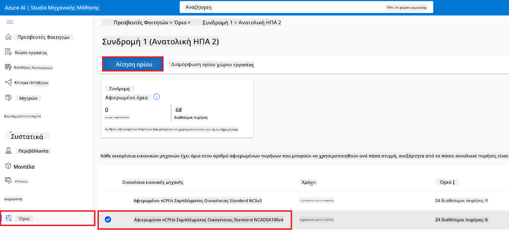

    - Στη σελίδα Αίτησης ορίου, εισάγετε το **Νέο όριο πυρήνων** που επιθυμείτε. Για παράδειγμα, 24.
    - Στη σελίδα Αίτησης ορίου, επιλέξτε **Υποβολή** για να αιτηθείτε το όριο GPU.

1. Εκτελέστε τις ακόλουθες ενέργειες για να αιτηθείτε όριο *Standard NCSv3 Family*:

    - Επιλέξτε **Quota** από το αριστερό μενού.
    - Επιλέξτε την **οικογένεια εικονικών μηχανών** που θα χρησιμοποιήσετε. Για παράδειγμα, επιλέξτε **Standard NCSv3 Family Cluster Dedicated vCPUs**, που περιλαμβάνει την GPU *Standard_NC6s_v3*.
    - Επιλέξτε **Request quota** από το μενού πλοήγησης.
    - Στη σελίδα Αίτησης ορίου, εισάγετε το **Νέο όριο πυρήνων** που επιθυμείτε. Για παράδειγμα, 24.
    - Στη σελίδα Αίτησης ορίου, επιλέξτε **Υποβολή** για να αιτηθείτε το όριο GPU.

### Προσθήκη ανάθεσης ρόλου

Για να βελτιστοποιήσετε και να αναπτύξετε τα μοντέλα σας, πρέπει πρώτα να δημιουργήσετε μια User Assigned Managed Identity (UAI) και να της αναθέσετε τα κατάλληλα δικαιώματα. Αυτή η UAI θα χρησιμοποιηθεί για τον έλεγχο ταυτότητας κατά την ανάπτυξη.

#### Δημιουργία User Assigned Managed Identity (UAI)

1. Πληκτρολογήστε *managed identities* στη **γραμμή αναζήτησης** στην κορυφή της σελίδας του portal και επιλέξτε **Managed Identities** από τις διαθέσιμες επιλογές.

    

1. Επιλέξτε **+ Δημιουργία**.

    

1. Εκτελέστε τις ακόλουθες ενέργειες:

    - Επιλέξτε το **Subscription** Azure.
    - Επιλέξτε την **Ομάδα πόρων** που θα χρησιμοποιήσετε (δημιουργήστε νέα αν χρειάζεται).
    - Επιλέξτε την **Περιοχή** που προτιμάτε.
    - Εισάγετε το **Όνομα**. Πρέπει να είναι μοναδικό.

    

1. Επιλέξτε **Ανασκόπηση + δημιουργία**.

1. Επιλέξτε **+ Δημιουργία**.

#### Προσθήκη ανάθεσης ρόλου Contributor στη Managed Identity

1. Μεταβείτε στον πόρο Managed Identity που δημιουργήσατε.

1. Επιλέξτε **Azure role assignments** από το αριστερό μενού.

1. Επιλέξτε **+Προσθήκη ανάθεσης ρόλου** από το μενού πλοήγησης.

1. Στη σελίδα Προσθήκης ανάθεσης ρόλου, εκτελέστε τις ακόλουθες ενέργειες:
    - Επιλέξτε το **Πεδίο εφαρμογής** ως **Resource group**.
    - Επιλέξτε το **Subscription** Azure.
    - Επιλέξτε την **Ομάδα πόρων** που θα χρησιμοποιήσετε.
    - Επιλέξτε τον **Ρόλο** ως **Contributor**.

    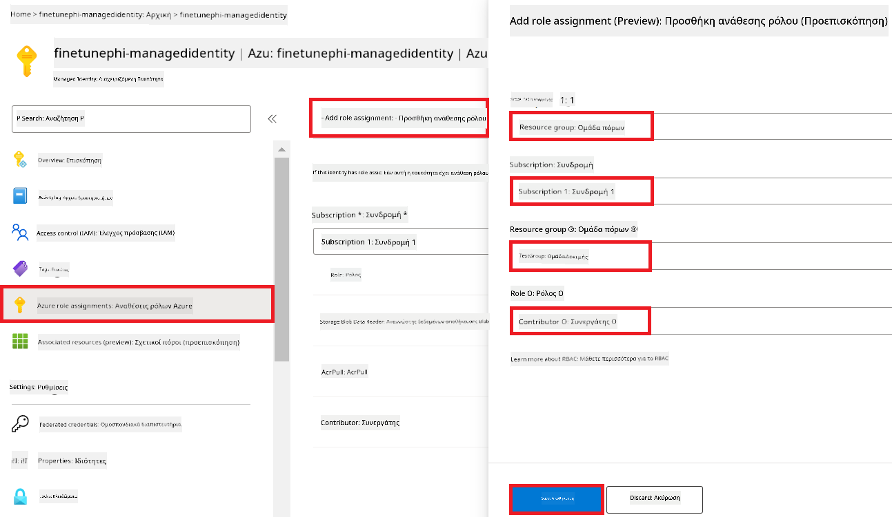

2. Επιλέξτε **Αποθήκευση**.

#### Προσθήκη ανάθεσης ρόλου Storage Blob Data Reader στη Managed Identity

1. Πληκτρολογήστε *storage accounts* στη **γραμμή αναζήτησης** στην κορυφή της σελίδας του portal και επιλέξτε **Storage accounts** από τις διαθέσιμες επιλογές.

    

1. Επιλέξτε τον λογαριασμό αποθήκευσης που σχετίζεται με τον χώρο εργασίας Azure Machine Learning που δημιουργήσατε. Για παράδειγμα, *finetunephistorage*.

1. Εκτελέστε τις ακόλουθες ενέργειες για να μεταβείτε στη σελίδα Προσθήκης ανάθεσης ρόλου:

    - Μεταβείτε στον λογαριασμό Azure Storage που δημιουργήσατε.
    - Επιλέξτε **Έλεγχος πρόσβασης (IAM)** από το αριστερό μενού.
    - Επιλέξτε **+ Προσθήκη** από το μενού πλοήγησης.
    - Επιλέξτε **Προσθήκη ανάθεσης ρόλου** από το μενού πλοήγησης.

    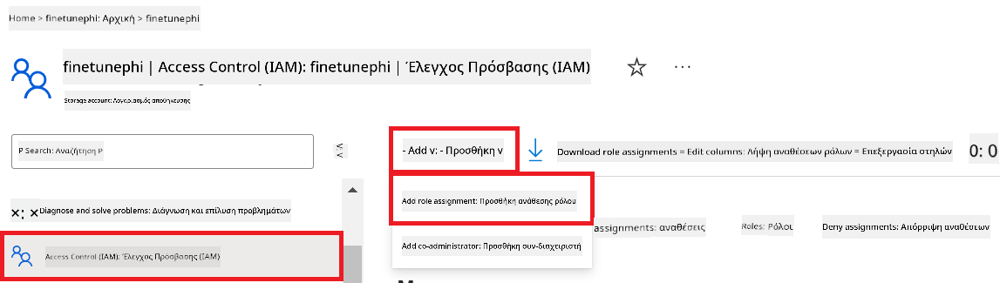

1. Στη σελίδα Προσθήκης ανάθεσης ρόλου, εκτελέστε τις ακόλουθες ενέργειες:

    - Στη σελίδα Ρόλος, πληκτρολογήστε *Storage Blob Data Reader* στη **γραμμή αναζήτησης** και επιλέξτε **Storage Blob Data Reader** από τις διαθέσιμες επιλογές.
    - Στη σελίδα Ρόλος, επιλέξτε **Επόμενο**.
    - Στη σελίδα Μέλη, επιλέξτε **Ανάθεση πρόσβασης σε** **Managed identity**.
    - Στη σελίδα Μέλη, επιλέξτε **+ Επιλογή μελών**.
    - Στη σελίδα Επιλογής διαχειριζόμενων ταυτοτήτων, επιλέξτε το **Subscription** Azure.
    - Στη σελίδα Επιλογής διαχειριζόμενων ταυτοτήτων, επιλέξτε τη **Managed identity** για **Διαχείριση ταυτότητας**.
    - Στη σελίδα Επιλογής διαχειριζόμενων ταυτοτήτων, επιλέξτε τη Διαχειριζόμενη ταυτότητα που δημιουργήσατε. Για παράδειγμα, *finetunephi-managedidentity*.
    - Στη σελίδα Επιλογής διαχειριζόμενων ταυτοτήτων, επιλέξτε **Επιλογή**.

    

1. Επιλέξτε **Ανασκόπηση + ανάθεση**.

#### Προσθήκη ανάθεσης ρόλου AcrPull στη Managed Identity

1. Πληκτρολογήστε *container registries* στη **γραμμή αναζήτησης** στην κορυφή της σελίδας του portal και επιλέξτε **Container registries** από τις διαθέσιμες επιλογές.

    

1. Επιλέξτε το container registry που σχετίζεται με τον χώρο εργασίας Azure Machine Learning. Για παράδειγμα, *finetunephicontainerregistry*

1. Εκτελέστε τις ακόλουθες ενέργειες για να μεταβείτε στη σελίδα Προσθήκης ανάθεσης ρόλου:

    - Επιλέξτε **Έλεγχος πρόσβασης (IAM)** από το αριστερό μενού.
    - Επιλέξτε **+ Προσθήκη** από το μενού πλοήγησης.
    - Επιλέξτε **Προσθήκη ανάθεσης ρόλου** από το μενού πλοήγησης.

1. Στη σελίδα Προσθήκης ανάθεσης ρόλου, εκτελέστε τις ακόλουθες ενέργειες:

    - Στη σελίδα Ρόλος, πληκτρολογήστε *AcrPull* στη **γραμμή αναζήτησης** και επιλέξτε **AcrPull** από τις διαθέσιμες επιλογές.
    - Στη σελίδα Ρόλος, επιλέξτε **Επόμενο**.
    - Στη σελίδα Μέλη, επιλέξτε **Ανάθεση πρόσβασης σε** **Managed identity**.
    - Στη σελίδα Μέλη, επιλέξτε **+ Επιλογή μελών**.
    - Στη σελίδα Επιλογής διαχειριζόμενων ταυτοτήτων, επιλέξτε το **Subscription** Azure.
    - Στη σελίδα Επιλογής διαχειριζόμενων ταυτοτήτων, επιλέξτε τη **Managed identity** για **Διαχείριση ταυτότητας**.
    - Στη σελίδα Επιλογής διαχειριζόμενων ταυτοτήτων, επιλέξτε τη Διαχειριζόμενη ταυτότητα που δημιουργήσατε. Για παράδειγμα, *finetunephi-managedidentity*.
    - Στη σελίδα Επιλογής διαχειριζόμενων ταυτοτήτων, επιλέξτε **Επιλογή**.
    - Επιλέξτε **Ανασκόπηση + ανάθεση**.

### Ρύθμιση έργου

Για να κατεβάσετε τα σύνολα δεδομένων που απαιτούνται για τη βελτιστοποίηση, θα ρυθμίσετε ένα τοπικό περιβάλλον.

Σε αυτήν την άσκηση, θα

- Δημιουργήσετε έναν φάκελο για να εργαστείτε μέσα σε αυτόν.
- Δημιουργήσετε ένα εικονικό περιβάλλον.
- Εγκαταστήσετε τα απαιτούμενα πακέτα.
- Δημιουργήσετε ένα αρχείο *download_dataset.py* για να κατεβάσετε το σύνολο δεδομένων.

#### Δημιουργία φακέλου για εργασία

1. Ανοίξτε ένα παράθυρο τερματικού και πληκτρολογήστε την ακόλουθη εντολή για να δημιουργήσετε έναν φάκελο με όνομα *finetune-phi* στη προεπιλεγμένη διαδρομή.

    ```console
    mkdir finetune-phi
    ```

2. Πληκτρολογήστε την ακόλουθη εντολή μέσα στο τερματικό σας για να πλοηγηθείτε στον φάκελο *finetune-phi* που δημιουργήσατε.

    ```console
    cd finetune-phi
    ```

#### Δημιουργήστε ένα εικονικό περιβάλλον

1. Πληκτρολογήστε την ακόλουθη εντολή μέσα στο τερματικό σας για να δημιουργήσετε ένα εικονικό περιβάλλον με το όνομα *.venv*.

    ```console
    python -m venv .venv
    ```

2. Πληκτρολογήστε την ακόλουθη εντολή μέσα στο τερματικό σας για να ενεργοποιήσετε το εικονικό περιβάλλον.

    ```console
    .venv\Scripts\activate.bat
    ```

> [!NOTE]
> Αν λειτούργησε, θα πρέπει να δείτε *(.venv)* πριν από το σημείο εντολής.

#### Εγκαταστήστε τα απαιτούμενα πακέτα

1. Πληκτρολογήστε τις ακόλουθες εντολές μέσα στο τερματικό σας για να εγκαταστήσετε τα απαιτούμενα πακέτα.

    ```console
    pip install datasets==2.19.1
    ```

#### Δημιουργήστε το `donload_dataset.py`

> [!NOTE]
> Πλήρης δομή φακέλου:
>
> ```text
> └── YourUserName
> .    └── finetune-phi
> .        └── download_dataset.py
> ```

1. Ανοίξτε το **Visual Studio Code**.

1. Επιλέξτε **File** από τη γραμμή μενού.

1. Επιλέξτε **Open Folder**.

1. Επιλέξτε τον φάκελο *finetune-phi* που δημιουργήσατε, ο οποίος βρίσκεται στη διαδρομή *C:\Users\yourUserName\finetune-phi*.

    

1. Στο αριστερό πάνελ του Visual Studio Code, κάντε δεξί κλικ και επιλέξτε **New File** για να δημιουργήσετε ένα νέο αρχείο με το όνομα *download_dataset.py*.

    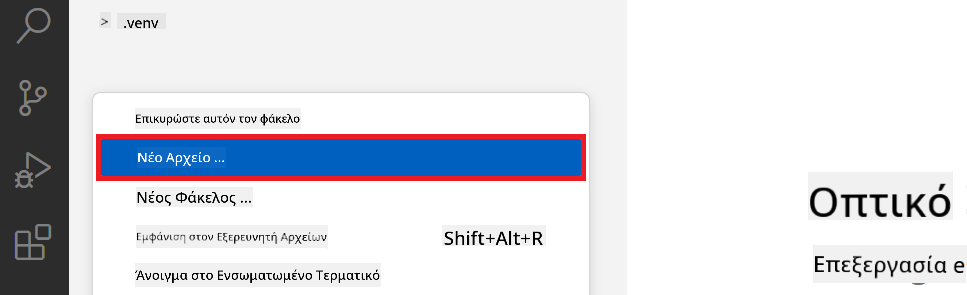

### Προετοιμάστε το σύνολο δεδομένων για fine-tuning

Σε αυτή την άσκηση, θα εκτελέσετε το αρχείο *download_dataset.py* για να κατεβάσετε τα σύνολα δεδομένων *ultrachat_200k* στο τοπικό σας περιβάλλον. Στη συνέχεια, θα χρησιμοποιήσετε αυτά τα σύνολα δεδομένων για να κάνετε fine-tuning στο μοντέλο Phi-3 στο Azure Machine Learning.

Σε αυτή την άσκηση, θα:

- Προσθέσετε κώδικα στο αρχείο *download_dataset.py* για να κατεβάσετε τα σύνολα δεδομένων.
- Εκτελέσετε το αρχείο *download_dataset.py* για να κατεβάσετε τα σύνολα δεδομένων στο τοπικό σας περιβάλλον.

#### Κατεβάστε το σύνολο δεδομένων σας χρησιμοποιώντας το *download_dataset.py*

1. Ανοίξτε το αρχείο *download_dataset.py* στο Visual Studio Code.

1. Προσθέστε τον παρακάτω κώδικα μέσα στο αρχείο *download_dataset.py*.

    ```python
    import json
    import os
    from datasets import load_dataset

    def load_and_split_dataset(dataset_name, config_name, split_ratio):
        """
        Load and split a dataset.
        """
        # Φόρτωση του συνόλου δεδομένων με το καθορισμένο όνομα, ρύθμιση και αναλογία διαχωρισμού
        dataset = load_dataset(dataset_name, config_name, split=split_ratio)
        print(f"Original dataset size: {len(dataset)}")
        
        # Διαχωρισμός του συνόλου δεδομένων σε σύνολα εκπαίδευσης και δοκιμής (80% εκπαίδευση, 20% δοκιμή)
        split_dataset = dataset.train_test_split(test_size=0.2)
        print(f"Train dataset size: {len(split_dataset['train'])}")
        print(f"Test dataset size: {len(split_dataset['test'])}")
        
        return split_dataset

    def save_dataset_to_jsonl(dataset, filepath):
        """
        Save a dataset to a JSONL file.
        """
        # Δημιουργία του καταλόγου εάν δεν υπάρχει
        os.makedirs(os.path.dirname(filepath), exist_ok=True)
        
        # Άνοιγμα του αρχείου σε λειτουργία εγγραφής
        with open(filepath, 'w', encoding='utf-8') as f:
            # Επανάληψη σε κάθε εγγραφή του συνόλου δεδομένων
            for record in dataset:
                # Αποθήκευση της εγγραφής ως αντικείμενο JSON και εγγραφή στο αρχείο
                json.dump(record, f)
                # Εγγραφή χαρακτήρα νέας γραμμής για διαχωρισμό εγγραφών
                f.write('\n')
        
        print(f"Dataset saved to {filepath}")

    def main():
        """
        Main function to load, split, and save the dataset.
        """
        # Φόρτωση και διαχωρισμός του συνόλου δεδομένων ULTRACHAT_200k με συγκεκριμένη ρύθμιση και αναλογία διαχωρισμού
        dataset = load_and_split_dataset("HuggingFaceH4/ultrachat_200k", 'default', 'train_sft[:1%]')
        
        # Εξαγωγή των συνόλων εκπαίδευσης και δοκιμής από τον διαχωρισμό
        train_dataset = dataset['train']
        test_dataset = dataset['test']

        # Αποθήκευση του συνόλου εκπαίδευσης σε αρχείο JSONL
        save_dataset_to_jsonl(train_dataset, "data/train_data.jsonl")
        
        # Αποθήκευση του συνόλου δοκιμής σε ξεχωριστό αρχείο JSONL
        save_dataset_to_jsonl(test_dataset, "data/test_data.jsonl")

    if __name__ == "__main__":
        main()

    ```

1. Πληκτρολογήστε την ακόλουθη εντολή μέσα στο τερματικό σας για να τρέξετε το script και να κατεβάσετε το σύνολο δεδομένων στο τοπικό σας περιβάλλον.

    ```console
    python download_dataset.py
    ```

1. Ελέγξτε ότι τα σύνολα δεδομένων αποθηκεύτηκαν με επιτυχία στο τοπικό σας φάκελο *finetune-phi/data*.

> [!NOTE]
>
> #### Σημείωση για το μέγεθος του συνόλου δεδομένων και το χρόνο fine-tuning
>
> Σε αυτό το σεμινάριο, χρησιμοποιείτε μόνο το 1% του συνόλου δεδομένων (`split='train[:1%]'`). Αυτό μειώνει σημαντικά τον όγκο των δεδομένων, επιταχύνοντας τόσο τη μεταφόρτωση όσο και τη διαδικασία fine-tuning. Μπορείτε να προσαρμόσετε το ποσοστό για να βρείτε τη σωστή ισορροπία μεταξύ χρόνου εκπαίδευσης και απόδοσης του μοντέλου. Η χρήση ενός μικρότερου υποσυνόλου του συνόλου δεδομένων μειώνει τον απαιτούμενο χρόνο για fine-tuning, κάνοντας τη διαδικασία πιο διαχειρίσιμη για αυτό το σεμινάριο.

## Σενάριο 2: Fine-tune του μοντέλου Phi-3 και Ανάπτυξη στο Azure Machine Learning Studio

### Fine-tune του μοντέλου Phi-3

Σε αυτή την άσκηση, θα κάνετε fine-tune το μοντέλο Phi-3 στο Azure Machine Learning Studio.

Σε αυτή την άσκηση, θα:

- Δημιουργήσετε έναν υπολογιστικό cluster για το fine-tuning.
- Κάνετε fine-tuning του μοντέλου Phi-3 στο Azure Machine Learning Studio.

#### Δημιουργία υπολογιστικού cluster για fine-tuning

1. Επισκεφτείτε το [Azure ML Studio](https://ml.azure.com/home?wt.mc_id=studentamb_279723).

1. Επιλέξτε **Compute** από την αριστερή καρτέλα.

1. Επιλέξτε **Compute clusters** από το μενού πλοήγησης.

1. Επιλέξτε **+ New**.

    

1. Εκτελέστε τις παρακάτω εργασίες:

    - Επιλέξτε την **Περιοχή (Region)** που θέλετε να χρησιμοποιήσετε.
    - Επιλέξτε την **Κατηγορία Εικονικής μηχανής** σε **Dedicated**.
    - Επιλέξτε τον **Τύπο Εικονικής μηχανής** σε **GPU**.
    - Φιλτράρετε το μέγεθος εικονικής μηχανής σε **Select from all options**.
    - Επιλέξτε το μέγεθος εικονικής μηχανής σε **Standard_NC24ads_A100_v4**.

    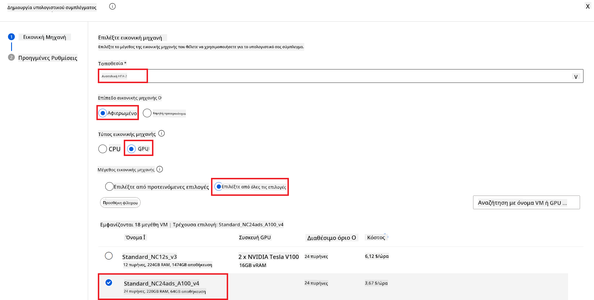

1. Επιλέξτε **Next**.

1. Εκτελέστε τις παρακάτω εργασίες:

    - Εισάγετε **Όνομα Υπολογιστικού** (Compute name). Πρέπει να είναι μοναδική τιμή.
    - Επιλέξτε **Ελάχιστος αριθμός κόμβων** σε **0**.
    - Επιλέξτε **Μέγιστος αριθμός κόμβων** σε **1**.
    - Ορίστε **Χρόνο αδράνειας πριν από την κλιμάκωση προς τα κάτω** σε **120**.

    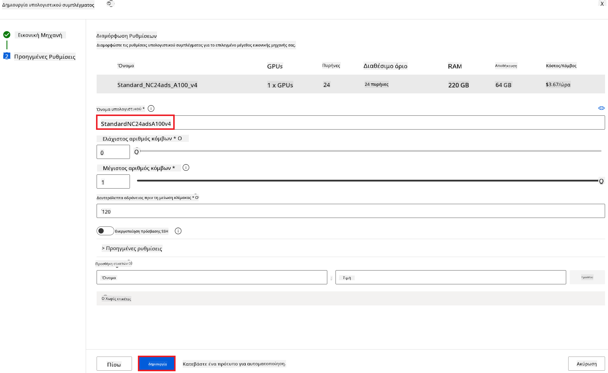

1. Επιλέξτε **Create**.

#### Fine-tune του μοντέλου Phi-3

1. Επισκεφτείτε το [Azure ML Studio](https://ml.azure.com/home?wt.mc_id=studentamb_279723).

1. Επιλέξτε το Azure Machine Learning workspace που δημιουργήσατε.

    

1. Εκτελέστε τις παρακάτω εργασίες:

    - Επιλέξτε **Model catalog** από την αριστερή καρτέλα.
    - Πληκτρολογήστε *phi-3-mini-4k* στη **γραμμή αναζήτησης** και επιλέξτε **Phi-3-mini-4k-instruct** από τις εμφανιζόμενες επιλογές.

    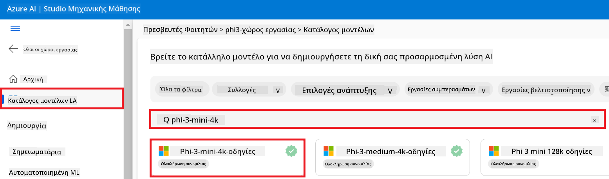

1. Επιλέξτε **Fine-tune** από το μενού πλοήγησης.

    

1. Εκτελέστε τις παρακάτω εργασίες:

    - Επιλέξτε **Select task type** σε **Chat completion**.
    - Επιλέξτε **+ Select data** για να ανεβάσετε τα **Δεδομένα εκπαίδευσης**.
    - Επιλέξτε τον τύπο ανεβάσματος των Validation data σε **Provide different validation data**.
    - Επιλέξτε **+ Select data** για να ανεβάσετε τα **Validation data**.

    

> [!TIP]
>
> Μπορείτε να επιλέξετε **Advanced settings** για να προσαρμόσετε ρυθμίσεις όπως **learning_rate** και **lr_scheduler_type** προκειμένου να βελτιστοποιήσετε τη διαδικασία fine-tuning σύμφωνα με τις συγκεκριμένες ανάγκες σας.

1. Επιλέξτε **Finish**.

1. Σε αυτή την άσκηση, πετύχατε το fine-tuning του μοντέλου Phi-3 χρησιμοποιώντας το Azure Machine Learning. Παρακαλώ σημειώστε ότι η διαδικασία fine-tuning μπορεί να διαρκέσει αρκετό χρόνο. Μετά την εκτέλεση της εργασίας fine-tuning, πρέπει να περιμένετε να ολοκληρωθεί. Μπορείτε να παρακολουθείτε την κατάσταση της εργασίας fine-tuning μεταβαίνοντας στην καρτέλα Jobs στην αριστερή πλευρά του Azure Machine Learning Workspace σας. Στη συνέχεια, θα αναπτυχθεί το fine-tuned μοντέλο και θα ενσωματωθεί με το Prompt flow.

    

### Ανάπτυξη του fine-tuned μοντέλου Phi-3

Για να ενσωματώσετε το fine-tuned μοντέλο Phi-3 με το Prompt flow, χρειάζεται να αναπτύξετε το μοντέλο ώστε να είναι προσβάσιμο για πραγματικό χρόνο προβλέψεων. Αυτή η διαδικασία περιλαμβάνει την εγγραφή του μοντέλου, τη δημιουργία ενός διαδικτυακού endpoint και την ανάπτυξη του μοντέλου.

Σε αυτή την άσκηση, θα:

- Καταχωρήσετε το fine-tuned μοντέλο στο Azure Machine Learning workspace.
- Δημιουργήσετε ένα διαδικτυακό endpoint.
- Αναπτύξετε το καταχωρημένο fine-tuned μοντέλο Phi-3.

#### Καταχώρηση του fine-tuned μοντέλου

1. Επισκεφτείτε το [Azure ML Studio](https://ml.azure.com/home?wt.mc_id=studentamb_279723).

1. Επιλέξτε το Azure Machine Learning workspace που δημιουργήσατε.

    

1. Επιλέξτε **Models** από την αριστερή καρτέλα.
1. Επιλέξτε **+ Register**.
1. Επιλέξτε **From a job output**.

    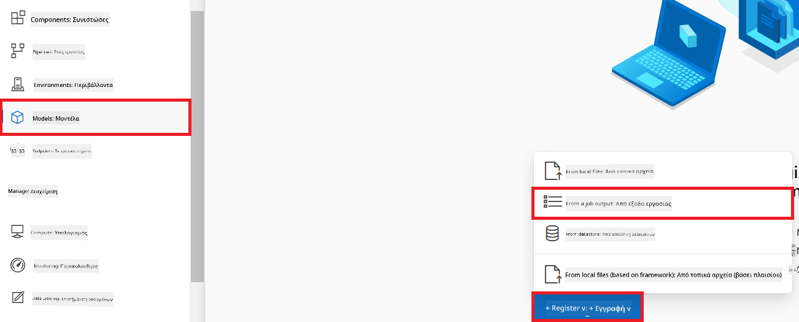

1. Επιλέξτε την εργασία που δημιουργήσατε.

    

1. Επιλέξτε **Next**.

1. Επιλέξτε **Model type** σε **MLflow**.

1. Βεβαιωθείτε ότι έχει επιλεγεί το **Job output**· θα πρέπει να επιλέγεται αυτόματα.

    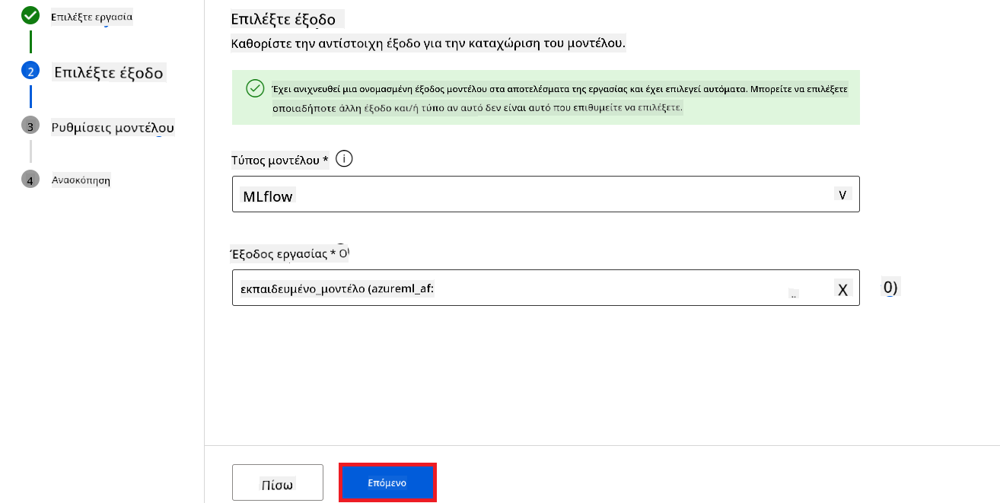

2. Επιλέξτε **Next**.

3. Επιλέξτε **Register**.

    

4. Μπορείτε να δείτε το καταχωρημένο μοντέλο σας μεταβαίνοντας στο μενού **Models** από την αριστερή καρτέλα.

    

#### Ανάπτυξη του fine-tuned μοντέλου

1. Μεταβείτε στο Azure Machine Learning workspace που δημιουργήσατε.

1. Επιλέξτε **Endpoints** από την αριστερή καρτέλα.

1. Επιλέξτε **Real-time endpoints** από το μενού πλοήγησης.

    

1. Επιλέξτε **Create**.

1. Επιλέξτε το καταχωρημένο μοντέλο που δημιουργήσατε.

    

1. Επιλέξτε **Select**.

1. Εκτελέστε τις παρακάτω εργασίες:

    - Επιλέξτε **Virtual machine** σε *Standard_NC6s_v3*.
    - Επιλέξτε τον **Αριθμό παραδειγμάτων (Instance count)** που θέλετε να χρησιμοποιήσετε. Για παράδειγμα, *1*.
    - Επιλέξτε το **Endpoint** σε **New** για να δημιουργήσετε ένα endpoint.
    - Εισάγετε **Όνομα Endpoint**. Πρέπει να είναι μοναδική τιμή.
    - Εισάγετε **Όνομα Ανάπτυξης** (Deployment name). Πρέπει να είναι μοναδική τιμή.

    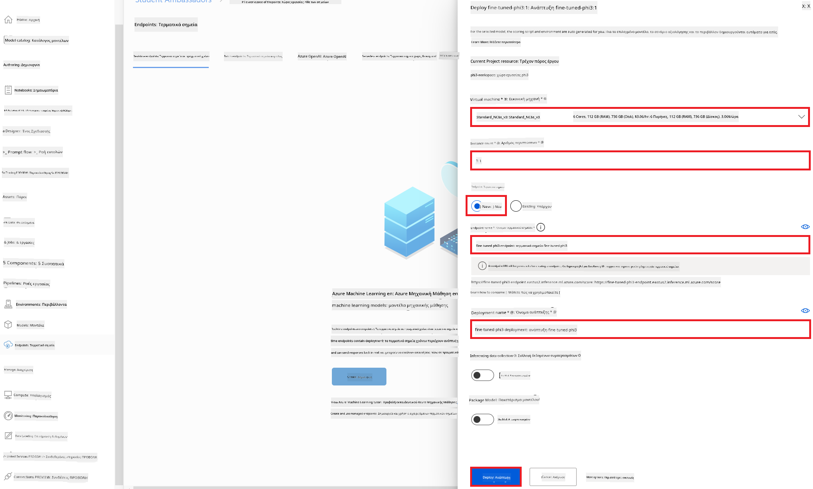

1. Επιλέξτε **Deploy**.

> [!WARNING]
> Για να αποφύγετε επιπλέον χρεώσεις στον λογαριασμό σας, βεβαιωθείτε ότι έχετε διαγράψει το δημιουργημένο endpoint στο Azure Machine Learning workspace.
>

#### Έλεγχος κατάστασης ανάπτυξης στο Azure Machine Learning Workspace

1. Μεταβείτε στο Azure Machine Learning workspace που δημιουργήσατε.

1. Επιλέξτε **Endpoints** από την αριστερή καρτέλα.

1. Επιλέξτε το endpoint που δημιουργήσατε.

    

1. Σε αυτή τη σελίδα, μπορείτε να διαχειριστείτε τα endpoints κατά τη διάρκεια της διαδικασίας ανάπτυξης.

> [!NOTE]
> Όταν ολοκληρωθεί η ανάπτυξη, βεβαιωθείτε ότι το **Live traffic** έχει οριστεί στο **100%**. Εάν όχι, επιλέξτε **Update traffic** για να ρυθμίσετε την κυκλοφορία. Σημειώστε ότι δεν μπορείτε να δοκιμάσετε το μοντέλο αν η κυκλοφορία έχει οριστεί στο 0%.
>
> 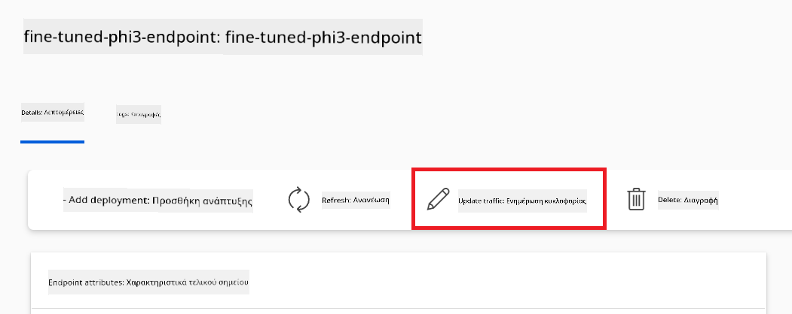
>

## Σενάριο 3: Ενσωμάτωση με Prompt flow και συνομιλία με το προσαρμοσμένο σας μοντέλο στο Azure AI Foundry

### Ενσωμάτωση του προσαρμοσμένου μοντέλου Phi-3 με το Prompt flow

Μετά την επιτυχή ανάπτυξη του fine-tuned μοντέλου σας, μπορείτε τώρα να το ενσωματώσετε με το Prompt Flow για να το χρησιμοποιήσετε σε εφαρμογές πραγματικού χρόνου, επιτρέποντας διάφορες διαδραστικές εργασίες με το προσαρμοσμένο σας μοντέλο Phi-3.

Σε αυτή την άσκηση, θα:

- Δημιουργήσετε το Azure AI Foundry Hub.
- Δημιουργήσετε ένα Πρότζεκτ Azure AI Foundry.
- Δημιουργήσετε Prompt flow.
- Προσθέσετε μια προσαρμοσμένη σύνδεση για το fine-tuned μοντέλο Phi-3.
- Ρυθμίσετε το Prompt flow για να συνομιλεί με το προσαρμοσμένο σας μοντέλο Phi-3.

> [!NOTE]
> Μπορείτε επίσης να ενσωματωθείτε με το Promptflow χρησιμοποιώντας το Azure ML Studio. Η ίδια διαδικασία ενσωμάτωσης μπορεί να εφαρμοστεί στο Azure ML Studio.

#### Δημιουργία του Azure AI Foundry Hub

Πρέπει να δημιουργήσετε ένα Hub πριν δημιουργήσετε το Project. Ένα Hub λειτουργεί σαν Resource Group, επιτρέποντάς σας να οργανώσετε και να διαχειριστείτε πολλαπλά Projects μέσα στο Azure AI Foundry.

1. Επισκεφτείτε το [Azure AI Foundry](https://ai.azure.com/?WT.mc_id=aiml-137032-kinfeylo).

1. Επιλέξτε **All hubs** από την αριστερή καρτέλα.

1. Επιλέξτε **+ New hub** από το μενού πλοήγησης.
    

1. Εκτελέστε τις ακόλουθες εργασίες:

    - Εισαγάγετε **Όνομα Hub**. Πρέπει να είναι μια μοναδική τιμή.
    - Επιλέξτε την **Subscription** Azure.
    - Επιλέξτε την **Ομάδα πόρων** για χρήση (δημιουργήστε νέα αν χρειάζεται).
    - Επιλέξτε την **Τοποθεσία** που θέλετε να χρησιμοποιήσετε.
    - Επιλέξτε το **Connect Azure AI Services** για χρήση (δημιουργήστε νέο αν χρειάζεται).
    - Επιλέξτε **Connect Azure AI Search** να **Παραλείψετε τη σύνδεση**.

    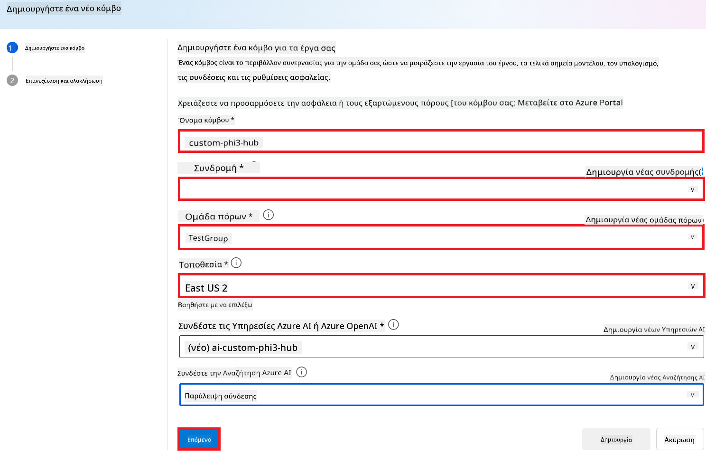

1. Επιλέξτε **Επόμενο**.

#### Δημιουργία έργου Azure AI Foundry

1. Στο Hub που δημιουργήσατε, επιλέξτε **Όλα τα έργα** από την καρτέλα αριστερά.

1. Επιλέξτε **+ Νέο έργο** από το μενού πλοήγησης.

    

1. Εισαγάγετε **Όνομα έργου**. Πρέπει να είναι μια μοναδική τιμή.

    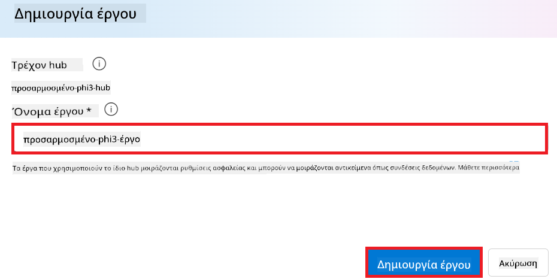

1. Επιλέξτε **Δημιουργία έργου**.

#### Προσθήκη προσαρμοσμένης σύνδεσης για το προσαρμοσμένο μοντέλο Phi-3

Για να ενσωματώσετε το προσαρμοσμένο μοντέλο Phi-3 με το Prompt flow, πρέπει να αποθηκεύσετε το endpoint και το κλειδί του μοντέλου σε μια προσαρμοσμένη σύνδεση. Αυτή η ρύθμιση εξασφαλίζει πρόσβαση στο προσαρμοσμένο μοντέλο Phi-3 στο Prompt flow.

#### Ορισμός api key και endpoint uri του προσαρμοσμένου μοντέλου Phi-3

1. Επισκεφτείτε το [Azure ML Studio](https://ml.azure.com/home?WT.mc_id=aiml-137032-kinfeylo).

1. Πλοηγηθείτε στον Azure Machine learning workspace που δημιουργήσατε.

1. Επιλέξτε **Endpoints** από την καρτέλα αριστερά.

    

1. Επιλέξτε το endpoint που δημιουργήσατε.

    

1. Επιλέξτε **Consume** από το μενού πλοήγησης.

1. Αντιγράψτε το **REST endpoint** και το **Πρωτεύον κλειδί**.

    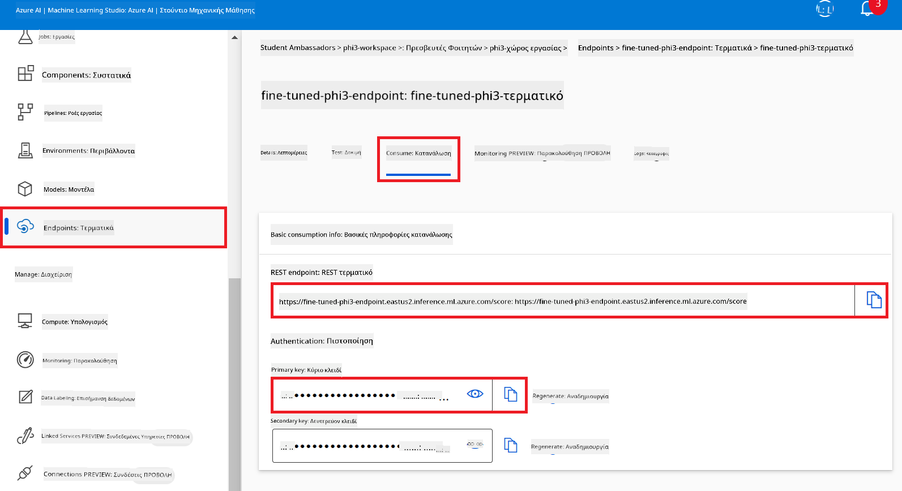

#### Προσθήκη της Προσαρμοσμένης Σύνδεσης

1. Επισκεφτείτε το [Azure AI Foundry](https://ai.azure.com/?WT.mc_id=aiml-137032-kinfeylo).

1. Πλοηγηθείτε στο έργο Azure AI Foundry που δημιουργήσατε.

1. Στο έργο που δημιουργήσατε, επιλέξτε **Ρυθμίσεις** από την καρτέλα αριστερά.

1. Επιλέξτε **+ Νέα σύνδεση**.

    

1. Επιλέξτε **Προσαρμοσμένα κλειδιά** από το μενού πλοήγησης.

    

1. Εκτελέστε τις ακόλουθες εργασίες:

    - Επιλέξτε **+ Προσθήκη ζευγών κλειδιού-τιμής**.
    - Για το όνομα κλειδιού, εισάγετε **endpoint** και επικολλήστε το endpoint που αντιγράψατε από το Azure ML Studio στο πεδίο τιμής.
    - Επιλέξτε ξανά **+ Προσθήκη ζευγών κλειδιού-τιμής**.
    - Για το όνομα κλειδιού, εισάγετε **key** και επικολλήστε το κλειδί που αντιγράψατε από το Azure ML Studio στο πεδίο τιμής.
    - Μετά την προσθήκη των κλειδιών, επιλέξτε **είναι μυστικό** για να αποτρέψετε την έκθεση του κλειδιού.

    

1. Επιλέξτε **Προσθήκη σύνδεσης**.

#### Δημιουργία Prompt flow

Έχετε προσθέσει μια προσαρμοσμένη σύνδεση στο Azure AI Foundry. Τώρα, ας δημιουργήσουμε ένα Prompt flow ακολουθώντας τα παρακάτω βήματα. Στη συνέχεια, θα συνδέσετε το Prompt flow με την προσαρμοσμένη σύνδεση ώστε να μπορείτε να χρησιμοποιήσετε το προσαρμοσμένο μοντέλο μέσα στο Prompt flow.

1. Πλοηγηθείτε στο έργο Azure AI Foundry που δημιουργήσατε.

1. Επιλέξτε **Prompt flow** από την καρτέλα αριστερά.

1. Επιλέξτε **+ Δημιουργία** από το μενού πλοήγησης.

    

1. Επιλέξτε **Chat flow** από το μενού πλοήγησης.

    

1. Εισάγετε **Όνομα φακέλου** για χρήση.

    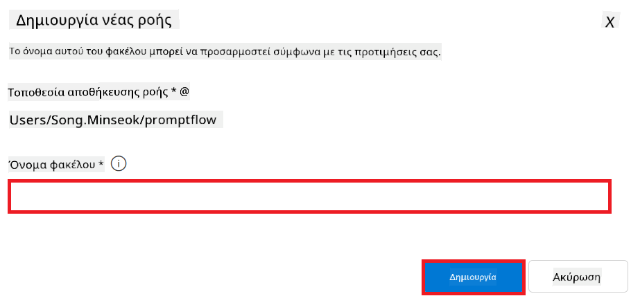

2. Επιλέξτε **Δημιουργία**.

#### Ρύθμιση Prompt flow για συνομιλία με το προσαρμοσμένο μοντέλο Phi-3

Πρέπει να ενσωματώσετε το προσαρμοσμένο μοντέλο Phi-3 μέσα σε ένα Prompt flow. Ωστόσο, το υπάρχον Prompt flow δεν έχει σχεδιαστεί γι' αυτόν τον σκοπό. Επομένως, πρέπει να επανασχεδιάσετε το Prompt flow για να επιτρέψετε τη σύνδεση του προσαρμοσμένου μοντέλου.

1. Στο Prompt flow, εκτελέστε τις παρακάτω εργασίες για να επαναδημιουργήσετε την υπάρχουσα ροή:

    - Επιλέξτε **Λειτουργία ακατέργαστου αρχείου**.
    - Διαγράψτε όλο τον υπάρχοντα κώδικα στο αρχείο *flow.dag.yml*.
    - Προσθέστε τον ακόλουθο κώδικα στο αρχείο *flow.dag.yml*.

        ```yml
        inputs:
          input_data:
            type: string
            default: "Who founded Microsoft?"

        outputs:
          answer:
            type: string
            reference: ${integrate_with_promptflow.output}

        nodes:
        - name: integrate_with_promptflow
          type: python
          source:
            type: code
            path: integrate_with_promptflow.py
          inputs:
            input_data: ${inputs.input_data}
        ```

    - Επιλέξτε **Αποθήκευση**.

    

1. Προσθέστε τον ακόλουθο κώδικα στο αρχείο *integrate_with_promptflow.py* για να χρησιμοποιήσετε το προσαρμοσμένο μοντέλο Phi-3 στο Prompt flow.

    ```python
    import logging
    import requests
    from promptflow import tool
    from promptflow.connections import CustomConnection

    # Ρύθμιση καταγραφής
    logging.basicConfig(
        format="%(asctime)s - %(levelname)s - %(name)s - %(message)s",
        datefmt="%Y-%m-%d %H:%M:%S",
        level=logging.DEBUG
    )
    logger = logging.getLogger(__name__)

    def query_phi3_model(input_data: str, connection: CustomConnection) -> str:
        """
        Send a request to the Phi-3 model endpoint with the given input data using Custom Connection.
        """

        # "connection" είναι το όνομα της Προσαρμοσμένης Σύνδεσης, "endpoint", "key" είναι τα κλειδιά στην Προσαρμοσμένη Σύνδεση
        endpoint_url = connection.endpoint
        api_key = connection.key

        headers = {
            "Content-Type": "application/json",
            "Authorization": f"Bearer {api_key}"
        }
        data = {
            "input_data": {
                "input_string": [
                    {"role": "user", "content": input_data}
                ],
                "parameters": {
                    "temperature": 0.7,
                    "max_new_tokens": 128
                }
            }
        }
        try:
            response = requests.post(endpoint_url, json=data, headers=headers)
            response.raise_for_status()
            
            # Καταγράψτε ολόκληρη την απάντηση JSON
            logger.debug(f"Full JSON response: {response.json()}")

            result = response.json()["output"]
            logger.info("Successfully received response from Azure ML Endpoint.")
            return result
        except requests.exceptions.RequestException as e:
            logger.error(f"Error querying Azure ML Endpoint: {e}")
            raise

    @tool
    def my_python_tool(input_data: str, connection: CustomConnection) -> str:
        """
        Tool function to process input data and query the Phi-3 model.
        """
        return query_phi3_model(input_data, connection)

    ```

    

> [!NOTE]
> Για περισσότερες λεπτομέρειες σχετικά με τη χρήση του Prompt flow στο Azure AI Foundry, μπορείτε να ανατρέξετε στο [Prompt flow in Azure AI Foundry](https://learn.microsoft.com/azure/ai-studio/how-to/prompt-flow).

1. Επιλέξτε **Είσοδο συνομιλίας**, **Έξοδο συνομιλίας** για να ενεργοποιήσετε τη συνομιλία με το μοντέλο σας.

    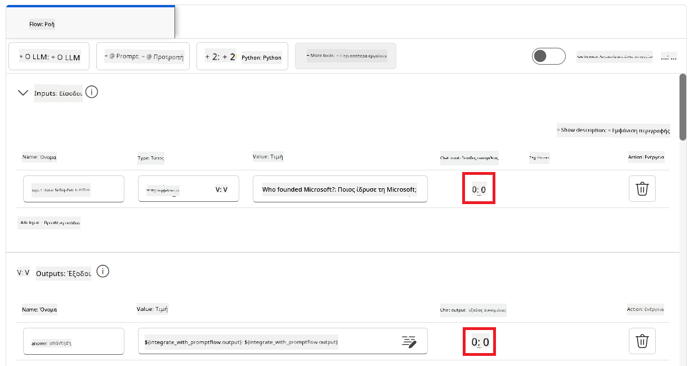

1. Τώρα είστε έτοιμοι να συνομιλήσετε με το προσαρμοσμένο μοντέλο Phi-3. Στην επόμενη άσκηση, θα μάθετε πώς να ξεκινήσετε το Prompt flow και να το χρησιμοποιήσετε για να συνομιλήσετε με το προσαρμοσμένο μοντέλο Phi-3.

> [!NOTE]
>
> Η επαναδημιουργημένη ροή θα πρέπει να μοιάζει με την εικόνα παρακάτω:
>
> 
>

### Συνομιλία με το προσαρμοσμένο μοντέλο Phi-3

Τώρα που έχετε προσαρμόσει και ενσωματώσει το προσαρμοσμένο μοντέλο Phi-3 με το Prompt flow, είστε έτοιμοι να αρχίσετε να αλληλεπιδράτε μαζί του. Αυτή η άσκηση θα σας καθοδηγήσει στη διαδικασία ρύθμισης και εκκίνησης μιας συνομιλίας με το μοντέλο σας χρησιμοποιώντας το Prompt flow. Ακολουθώντας αυτά τα βήματα, θα μπορείτε να αξιοποιήσετε πλήρως τις δυνατότητες του προσαρμοσμένου μοντέλου Phi-3 για διάφορα καθήκοντα και συνομιλίες.

- Συνομιλήστε με το προσαρμοσμένο μοντέλο Phi-3 χρησιμοποιώντας το Prompt flow.

#### Εκκίνηση Prompt flow

1. Επιλέξτε **Έναρξη συνεδριών υπολογισμού** για να ξεκινήσετε το Prompt flow.

    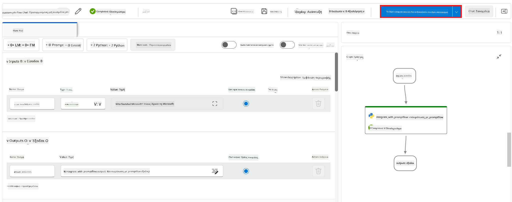

1. Επιλέξτε **Επικύρωση και ανάλυση εισόδου** για ανανέωση παραμέτρων.

    

1. Επιλέξτε την **Τιμή** της **σύνδεσης** στην προσαρμοσμένη σύνδεση που δημιουργήσατε. Για παράδειγμα, *connection*.

    

#### Συνομιλία με το προσαρμοσμένο μοντέλο

1. Επιλέξτε **Συνομιλία**.

    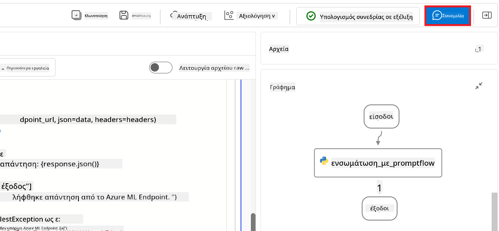

1. Ακολουθεί ένα παράδειγμα αποτελεσμάτων: Τώρα μπορείτε να συνομιλήσετε με το προσαρμοσμένο μοντέλο Phi-3. Συνιστάται να κάνετε ερωτήσεις βασισμένες στα δεδομένα που χρησιμοποιήθηκαν για τη λεπτομερή ρύθμιση.

    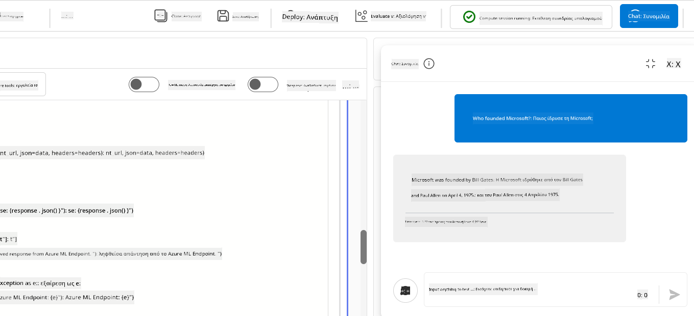

---

<!-- CO-OP TRANSLATOR DISCLAIMER START -->
**Αποποίηση Ευθυνών**:  
Αυτό το έγγραφο έχει μεταφραστεί χρησιμοποιώντας την υπηρεσία αυτόματης μετάφρασης AI [Co-op Translator](https://github.com/Azure/co-op-translator). Παρόλο που κάνουμε προσπάθειες για ακρίβεια, παρακαλούμε να έχετε υπόψη ότι οι αυτοματοποιημένες μεταφράσεις ενδέχεται να περιέχουν σφάλματα ή ανακρίβειες. Το πρωτότυπο έγγραφο στη γλώσσα προέλευσής του πρέπει να θεωρείται η έγκυρη πηγή. Για κρίσιμες πληροφορίες συνιστάται η επαγγελματική ανθρώπινη μετάφραση. Δεν φέρουμε ευθύνη για οποιεσδήποτε παρανοήσεις ή λανθασμένες ερμηνείες που προκύπτουν από τη χρήση αυτής της μετάφρασης.
<!-- CO-OP TRANSLATOR DISCLAIMER END -->