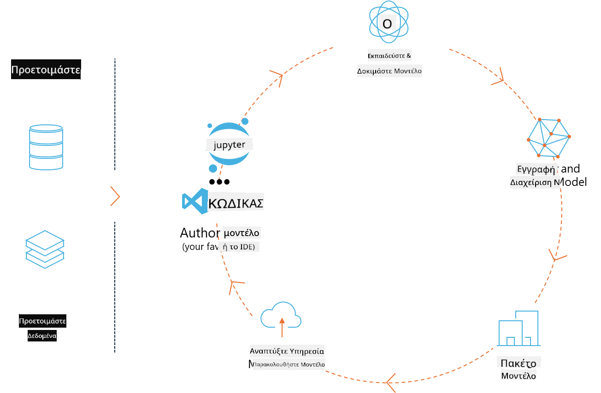
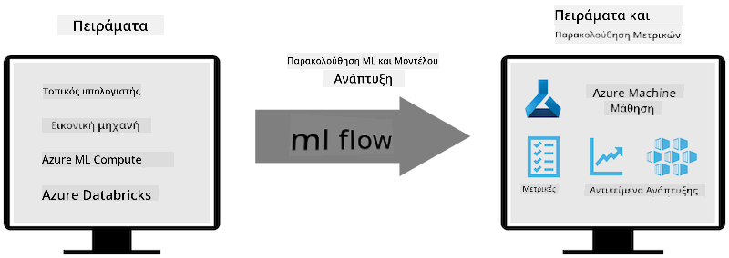
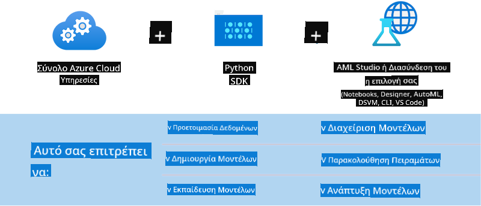

<!--
CO_OP_TRANSLATOR_METADATA:
{
  "original_hash": "f61c383bbf0c3dac97e43f833c258731",
  "translation_date": "2025-05-09T18:37:15+00:00",
  "source_file": "md/02.Application/01.TextAndChat/Phi3/E2E_Phi-3-MLflow.md",
  "language_code": "el"
}
-->
# MLflow

[MLflow](https://mlflow.org/) είναι μια ανοιχτού κώδικα πλατφόρμα σχεδιασμένη για τη διαχείριση του πλήρους κύκλου ζωής της μηχανικής μάθησης.



Το MLFlow χρησιμοποιείται για τη διαχείριση του κύκλου ζωής της ML, συμπεριλαμβανομένης της πειραματικής διαδικασίας, της αναπαραγωγιμότητας, της ανάπτυξης και ενός κεντρικού καταλόγου μοντέλων. Το MLflow προσφέρει επί του παρόντος τέσσερα βασικά συστατικά.

- **MLflow Tracking:** Καταγραφή και αναζήτηση πειραμάτων, κώδικα, ρυθμίσεων δεδομένων και αποτελεσμάτων.
- **MLflow Projects:** Πακετάρει κώδικα data science σε μορφή που επιτρέπει την αναπαραγωγή εκτελέσεων σε οποιαδήποτε πλατφόρμα.
- **Mlflow Models:** Αναπτύσσει μοντέλα μηχανικής μάθησης σε διάφορα περιβάλλοντα παροχής υπηρεσιών.
- **Model Registry:** Αποθηκεύει, σχολιάζει και διαχειρίζεται μοντέλα σε ένα κεντρικό αποθετήριο.

Περιλαμβάνει δυνατότητες για την παρακολούθηση πειραμάτων, τη συσκευασία κώδικα σε αναπαραγώγιμες εκτελέσεις, καθώς και την κοινή χρήση και ανάπτυξη μοντέλων. Το MLFlow είναι ενσωματωμένο στο Databricks και υποστηρίζει ποικιλία βιβλιοθηκών ML, καθιστώντας το ανεξάρτητο βιβλιοθήκης. Μπορεί να χρησιμοποιηθεί με οποιαδήποτε βιβλιοθήκη μηχανικής μάθησης και σε οποιαδήποτε γλώσσα προγραμματισμού, καθώς παρέχει REST API και CLI για ευκολία.



Κύρια χαρακτηριστικά του MLFlow περιλαμβάνουν:

- **Παρακολούθηση Πειραμάτων:** Καταγραφή και σύγκριση παραμέτρων και αποτελεσμάτων.
- **Διαχείριση Μοντέλων:** Ανάπτυξη μοντέλων σε διάφορες πλατφόρμες παροχής υπηρεσιών και inference.
- **Model Registry:** Συνεργατική διαχείριση του κύκλου ζωής των MLflow Models, συμπεριλαμβανομένης της έκδοσης και σχολιασμών.
- **Projects:** Πακετάρισμα κώδικα ML για κοινή χρήση ή παραγωγική χρήση.
Το MLFlow υποστηρίζει επίσης τον κύκλο MLOps, που περιλαμβάνει την προετοιμασία δεδομένων, την καταχώρηση και διαχείριση μοντέλων, το πακετάρισμα μοντέλων για εκτέλεση, την ανάπτυξη υπηρεσιών και την παρακολούθηση μοντέλων. Σκοπός του είναι να απλοποιήσει τη διαδικασία μετάβασης από ένα πρωτότυπο σε παραγωγική ροή εργασίας, ειδικά σε περιβάλλοντα cloud και edge.

## E2E Σενάριο - Δημιουργία wrapper και χρήση του Phi-3 ως MLFlow μοντέλο

Σε αυτό το δείγμα E2E θα παρουσιάσουμε δύο διαφορετικές προσεγγίσεις για τη δημιουργία wrapper γύρω από το μικρό γλωσσικό μοντέλο Phi-3 (SLM) και στη συνέχεια την εκτέλεσή του ως MLFlow μοντέλο είτε τοπικά είτε στο cloud, π.χ. στο Azure Machine Learning workspace.



| Project | Περιγραφή | Τοποθεσία |
| ------------ | ----------- | -------- |
| Transformer Pipeline | Το Transformer Pipeline είναι η πιο απλή επιλογή για τη δημιουργία wrapper αν θέλετε να χρησιμοποιήσετε ένα μοντέλο HuggingFace με τη πειραματική γεύση transformers του MLFlow. | [**TransformerPipeline.ipynb**](../../../../../../code/06.E2E/E2E_Phi-3-MLflow_TransformerPipeline.ipynb) |
| Custom Python Wrapper | Την ώρα που γράφεται, το transformer pipeline δεν υποστήριζε τη δημιουργία wrapper MLFlow για μοντέλα HuggingFace σε μορφή ONNX, ακόμα και με το πειραματικό πακέτο optimum Python. Σε τέτοιες περιπτώσεις, μπορείτε να δημιουργήσετε το δικό σας custom Python wrapper για MLFlow μοντέλο | [**CustomPythonWrapper.ipynb**](../../../../../../code/06.E2E/E2E_Phi-3-MLflow_CustomPythonWrapper.ipynb) |

## Project: Transformer Pipeline

1. Θα χρειαστείτε τα αντίστοιχα Python πακέτα από MLFlow και HuggingFace:

    ``` Python
    import mlflow
    import transformers
    ```

2. Στη συνέχεια, πρέπει να ξεκινήσετε ένα transformer pipeline αναφερόμενοι στο στοχευμένο μοντέλο Phi-3 από το HuggingFace registry. Όπως φαίνεται από την κάρτα μοντέλου του _Phi-3-mini-4k-instruct_, η εργασία του είναι τύπου “Text Generation”:

    ``` Python
    pipeline = transformers.pipeline(
        task = "text-generation",
        model = "microsoft/Phi-3-mini-4k-instruct"
    )
    ```

3. Τώρα μπορείτε να αποθηκεύσετε το transformer pipeline του μοντέλου Phi-3 σε MLFlow μορφή και να παρέχετε επιπλέον λεπτομέρειες όπως τη διαδρομή για τα artifacts, συγκεκριμένες ρυθμίσεις μοντέλου και τύπο API inference:

    ``` Python
    model_info = mlflow.transformers.log_model(
        transformers_model = pipeline,
        artifact_path = "phi3-mlflow-model",
        model_config = model_config,
        task = "llm/v1/chat"
    )
    ```

## Project: Custom Python Wrapper

1. Εδώ μπορούμε να χρησιμοποιήσουμε το [ONNX Runtime generate() API](https://github.com/microsoft/onnxruntime-genai) της Microsoft για το inference του μοντέλου ONNX και την κωδικοποίηση/αποκωδικοποίηση tokens. Πρέπει να επιλέξετε το πακέτο _onnxruntime_genai_ για τον στοχευμένο υπολογιστή, με το παρακάτω παράδειγμα να απευθύνεται σε CPU:

    ``` Python
    import mlflow
    from mlflow.models import infer_signature
    import onnxruntime_genai as og
    ```

1. Η custom κλάση μας υλοποιεί δύο μεθόδους: _load_context()_ για την αρχικοποίηση του **ONNX μοντέλου** Phi-3 Mini 4K Instruct, των **παραμέτρων γεννήτριας** και του **tokenizer**· και _predict()_ για την παραγωγή tokens εξόδου για το δοσμένο prompt:

    ``` Python
    class Phi3Model(mlflow.pyfunc.PythonModel):
        def load_context(self, context):
            # Retrieving model from the artifacts
            model_path = context.artifacts["phi3-mini-onnx"]
            model_options = {
                 "max_length": 300,
                 "temperature": 0.2,         
            }
        
            # Defining the model
            self.phi3_model = og.Model(model_path)
            self.params = og.GeneratorParams(self.phi3_model)
            self.params.set_search_options(**model_options)
            
            # Defining the tokenizer
            self.tokenizer = og.Tokenizer(self.phi3_model)
    
        def predict(self, context, model_input):
            # Retrieving prompt from the input
            prompt = model_input["prompt"][0]
            self.params.input_ids = self.tokenizer.encode(prompt)
    
            # Generating the model's response
            response = self.phi3_model.generate(self.params)
    
            return self.tokenizer.decode(response[0][len(self.params.input_ids):])
    ```

1. Τώρα μπορείτε να χρησιμοποιήσετε τη συνάρτηση _mlflow.pyfunc.log_model()_ για να δημιουργήσετε ένα custom Python wrapper (σε μορφή pickle) για το μοντέλο Phi-3, μαζί με το αρχικό μοντέλο ONNX και τις απαιτούμενες εξαρτήσεις:

    ``` Python
    model_info = mlflow.pyfunc.log_model(
        artifact_path = artifact_path,
        python_model = Phi3Model(),
        artifacts = {
            "phi3-mini-onnx": "cpu_and_mobile/cpu-int4-rtn-block-32-acc-level-4",
        },
        input_example = input_example,
        signature = infer_signature(input_example, ["Run"]),
        extra_pip_requirements = ["torch", "onnxruntime_genai", "numpy"],
    )
    ```

## Υπογραφές των παραγόμενων MLFlow μοντέλων

1. Στο βήμα 3 του Transformer Pipeline project παραπάνω, ορίσαμε το task του MLFlow μοντέλου σε “_llm/v1/chat_”. Αυτή η οδηγία δημιουργεί ένα API wrapper για το μοντέλο, συμβατό με το OpenAI Chat API όπως φαίνεται παρακάτω:

    ``` Python
    {inputs: 
      ['messages': Array({content: string (required), name: string (optional), role: string (required)}) (required), 'temperature': double (optional), 'max_tokens': long (optional), 'stop': Array(string) (optional), 'n': long (optional), 'stream': boolean (optional)],
    outputs: 
      ['id': string (required), 'object': string (required), 'created': long (required), 'model': string (required), 'choices': Array({finish_reason: string (required), index: long (required), message: {content: string (required), name: string (optional), role: string (required)} (required)}) (required), 'usage': {completion_tokens: long (required), prompt_tokens: long (required), total_tokens: long (required)} (required)],
    params: 
      None}
    ```

1. Ως αποτέλεσμα, μπορείτε να υποβάλετε το prompt σας στην ακόλουθη μορφή:

    ``` Python
    messages = [{"role": "user", "content": "What is the capital of Spain?"}]
    ```

1. Στη συνέχεια, χρησιμοποιήστε μετα-επεξεργασία συμβατή με OpenAI API, π.χ. _response[0][‘choices’][0][‘message’][‘content’]_, για να μορφοποιήσετε την έξοδό σας σε κάτι σαν αυτό:

    ``` JSON
    Question: What is the capital of Spain?
    
    Answer: The capital of Spain is Madrid. It is the largest city in Spain and serves as the political, economic, and cultural center of the country. Madrid is located in the center of the Iberian Peninsula and is known for its rich history, art, and architecture, including the Royal Palace, the Prado Museum, and the Plaza Mayor.
    
    Usage: {'prompt_tokens': 11, 'completion_tokens': 73, 'total_tokens': 84}
    ```

1. Στο βήμα 3 του Custom Python Wrapper project παραπάνω, επιτρέπουμε στο πακέτο MLFlow να δημιουργήσει την υπογραφή του μοντέλου από ένα δοσμένο παράδειγμα εισόδου. Η υπογραφή του MLFlow wrapper μας θα μοιάζει με αυτή:

    ``` Python
    {inputs: 
      ['prompt': string (required)],
    outputs: 
      [string (required)],
    params: 
      None}
    ```

1. Έτσι, το prompt μας θα πρέπει να περιέχει το κλειδί λεξικού "prompt", όπως το παρακάτω:

    ``` Python
    {"prompt": "<|system|>You are a stand-up comedian.<|end|><|user|>Tell me a joke about atom<|end|><|assistant|>",}
    ```

1. Η έξοδος του μοντέλου θα παρασχεθεί στη συνέχεια σε μορφή string:

    ``` JSON
    Alright, here's a little atom-related joke for you!
    
    Why don't electrons ever play hide and seek with protons?
    
    Because good luck finding them when they're always "sharing" their electrons!
    
    Remember, this is all in good fun, and we're just having a little atomic-level humor!
    ```

**Αποποίηση Ευθυνών**:  
Αυτό το έγγραφο έχει μεταφραστεί χρησιμοποιώντας την υπηρεσία αυτόματης μετάφρασης AI [Co-op Translator](https://github.com/Azure/co-op-translator). Παρόλο που επιδιώκουμε ακρίβεια, παρακαλούμε να λάβετε υπόψη ότι οι αυτοματοποιημένες μεταφράσεις μπορεί να περιέχουν λάθη ή ανακρίβειες. Το πρωτότυπο έγγραφο στη μητρική του γλώσσα πρέπει να θεωρείται η αυθεντική πηγή. Για κρίσιμες πληροφορίες, συνιστάται επαγγελματική μετάφραση από ανθρώπινο μεταφραστή. Δεν φέρουμε ευθύνη για τυχόν παρεξηγήσεις ή λανθασμένες ερμηνείες που προκύπτουν από τη χρήση αυτής της μετάφρασης.