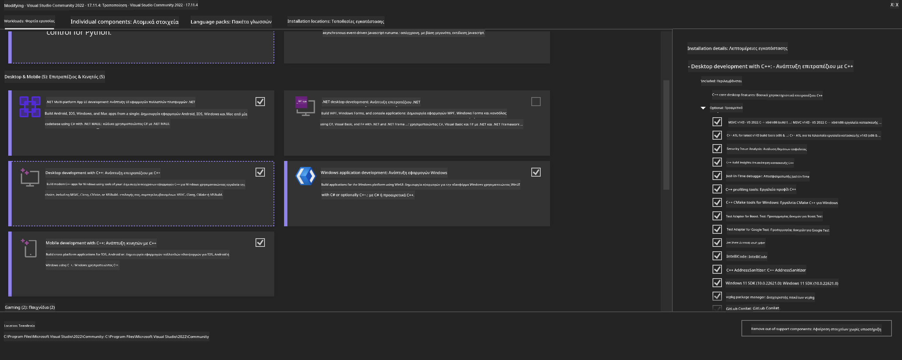
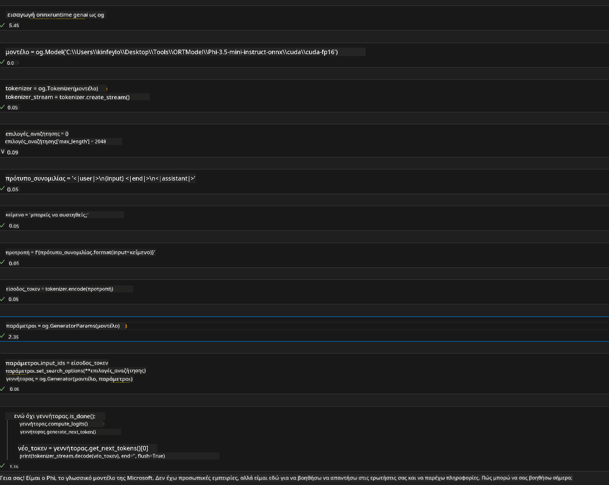
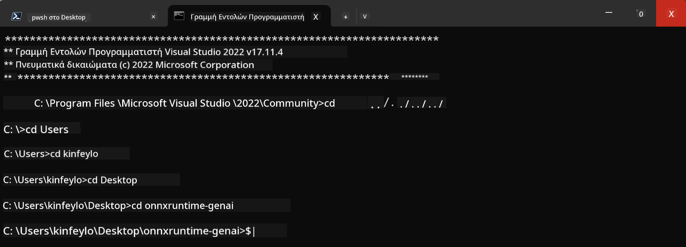

<!--
CO_OP_TRANSLATOR_METADATA:
{
  "original_hash": "b066fc29c1b2129df84e027cb75119ce",
  "translation_date": "2025-07-17T02:43:27+00:00",
  "source_file": "md/02.Application/01.TextAndChat/Phi3/ORTWindowGPUGuideline.md",
  "language_code": "el"
}
-->
# **Οδηγός για OnnxRuntime GenAI Windows GPU**

Αυτός ο οδηγός παρέχει βήματα για τη ρύθμιση και χρήση του ONNX Runtime (ORT) με GPUs σε Windows. Σκοπός του είναι να σας βοηθήσει να αξιοποιήσετε την επιτάχυνση με GPU για τα μοντέλα σας, βελτιώνοντας την απόδοση και την αποδοτικότητα.

Το έγγραφο παρέχει οδηγίες για:

- Ρύθμιση Περιβάλλοντος: Οδηγίες για την εγκατάσταση των απαραίτητων εξαρτημάτων όπως CUDA, cuDNN και ONNX Runtime.
- Παραμετροποίηση: Πώς να ρυθμίσετε το περιβάλλον και το ONNX Runtime ώστε να χρησιμοποιούν αποτελεσματικά τους πόρους της GPU.
- Συμβουλές Βελτιστοποίησης: Οδηγίες για το πώς να ρυθμίσετε καλύτερα τις ρυθμίσεις της GPU για βέλτιστη απόδοση.

### **1. Python 3.10.x /3.11.8**

   ***Note*** Προτείνεται η χρήση του [miniforge](https://github.com/conda-forge/miniforge/releases/latest/download/Miniforge3-Windows-x86_64.exe) ως το περιβάλλον Python σας

   ```bash

   conda create -n pydev python==3.11.8

   conda activate pydev

   ```

   ***Reminder*** Αν έχετε εγκαταστήσει κάποια βιβλιοθήκη ONNX για Python, παρακαλώ απεγκαταστήστε την

### **2. Εγκατάσταση CMake με winget**

   ```bash

   winget install -e --id Kitware.CMake

   ```

### **3. Εγκατάσταση Visual Studio 2022 - Desktop Development με C++**

   ***Note*** Αν δεν θέλετε να κάνετε compile, μπορείτε να παραλείψετε αυτό το βήμα



### **4. Εγκατάσταση NVIDIA Driver**

1. **NVIDIA GPU Driver**  [https://www.nvidia.com/en-us/drivers/](https://www.nvidia.com/en-us/drivers/)

2. **NVIDIA CUDA 12.4** [https://developer.nvidia.com/cuda-12-4-0-download-archive](https://developer.nvidia.com/cuda-12-4-0-download-archive)

3. **NVIDIA CUDNN 9.4**  [https://developer.nvidia.com/cudnn-downloads](https://developer.nvidia.com/cudnn-downloads)

***Reminder*** Παρακαλώ χρησιμοποιήστε τις προεπιλεγμένες ρυθμίσεις κατά τη διαδικασία εγκατάστασης

### **5. Ρύθμιση Περιβάλλοντος NVIDIA**

Αντιγράψτε τα αρχεία lib, bin, include του NVIDIA CUDNN 9.4 στα αντίστοιχα lib, bin, include του NVIDIA CUDA 12.4

- Αντιγράψτε τα αρχεία από *'C:\Program Files\NVIDIA\CUDNN\v9.4\bin\12.6'* στο *'C:\Program Files\NVIDIA GPU Computing Toolkit\CUDA\v12.4\bin'*

- Αντιγράψτε τα αρχεία από *'C:\Program Files\NVIDIA\CUDNN\v9.4\include\12.6'* στο *'C:\Program Files\NVIDIA GPU Computing Toolkit\CUDA\v12.4\include'*

- Αντιγράψτε τα αρχεία από *'C:\Program Files\NVIDIA\CUDNN\v9.4\lib\12.6'* στο *'C:\Program Files\NVIDIA GPU Computing Toolkit\CUDA\v12.4\lib\x64'*

### **6. Κατέβασμα Phi-3.5-mini-instruct-onnx**

   ```bash

   winget install -e --id Git.Git

   winget install -e --id GitHub.GitLFS

   git lfs install

   git clone https://huggingface.co/microsoft/Phi-3.5-mini-instruct-onnx

   ```

### **7. Εκτέλεση InferencePhi35Instruct.ipynb**

   Ανοίξτε το [Notebook](../../../../../../code/09.UpdateSamples/Aug/ortgpu-phi35-instruct.ipynb) και εκτελέστε



### **8. Compile ORT GenAI GPU**

   ***Note*** 
   
   1. Παρακαλώ απεγκαταστήστε πρώτα όλες τις βιβλιοθήκες που σχετίζονται με onnx, onnxruntime και onnxruntime-genai

   ```bash

   pip list 
   
   ```

   Στη συνέχεια απεγκαταστήστε όλες τις βιβλιοθήκες onnxruntime, π.χ.

   ```bash

   pip uninstall onnxruntime

   pip uninstall onnxruntime-genai

   pip uninstall onnxruntume-genai-cuda
   
   ```

   2. Ελέγξτε την υποστήριξη επέκτασης Visual Studio

   Ελέγξτε το φάκελο C:\Program Files\NVIDIA GPU Computing Toolkit\CUDA\v12.4\extras για να βεβαιωθείτε ότι υπάρχει ο φάκελος C:\Program Files\NVIDIA GPU Computing Toolkit\CUDA\v12.4\extras\visual_studio_integration. 
   
   Αν δεν υπάρχει, ελέγξτε άλλους φακέλους του Cuda toolkit driver και αντιγράψτε το φάκελο visual_studio_integration και το περιεχόμενό του στο C:\Program Files\NVIDIA GPU Computing Toolkit\CUDA\v12.4\extras\visual_studio_integration

   - Αν δεν θέλετε να κάνετε compile, μπορείτε να παραλείψετε αυτό το βήμα

   ```bash

   git clone https://github.com/microsoft/onnxruntime-genai

   ```

   - Κατεβάστε το [https://github.com/microsoft/onnxruntime/releases/download/v1.19.2/onnxruntime-win-x64-gpu-1.19.2.zip](https://github.com/microsoft/onnxruntime/releases/download/v1.19.2/onnxruntime-win-x64-gpu-1.19.2.zip)

   - Αποσυμπιέστε το onnxruntime-win-x64-gpu-1.19.2.zip, μετονομάστε το σε **ort** και αντιγράψτε το φάκελο ort στο onnxruntime-genai

   - Χρησιμοποιώντας το Windows Terminal, ανοίξτε το Developer Command Prompt για VS 2022 και μεταβείτε στο onnxruntime-genai



   - Κάντε compile με το περιβάλλον Python σας

   ```bash

   cd onnxruntime-genai

   python build.py --use_cuda  --cuda_home "C:\Program Files\NVIDIA GPU Computing Toolkit\CUDA\v12.4" --config Release
 

   cd build/Windows/Release/Wheel

   pip install .whl

   ```

**Αποποίηση ευθυνών**:  
Αυτό το έγγραφο έχει μεταφραστεί χρησιμοποιώντας την υπηρεσία αυτόματης μετάφρασης AI [Co-op Translator](https://github.com/Azure/co-op-translator). Παρόλο που επιδιώκουμε την ακρίβεια, παρακαλούμε να γνωρίζετε ότι οι αυτόματες μεταφράσεις ενδέχεται να περιέχουν λάθη ή ανακρίβειες. Το πρωτότυπο έγγραφο στη γλώσσα του θεωρείται η αυθεντική πηγή. Για κρίσιμες πληροφορίες, συνιστάται επαγγελματική ανθρώπινη μετάφραση. Δεν φέρουμε ευθύνη για τυχόν παρεξηγήσεις ή λανθασμένες ερμηνείες που προκύπτουν από τη χρήση αυτής της μετάφρασης.