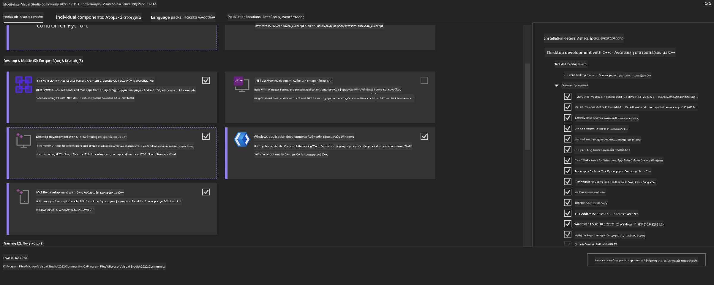
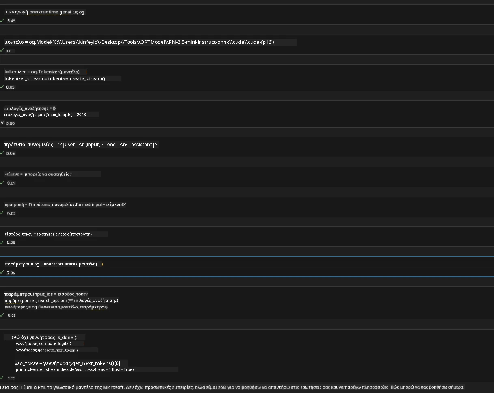
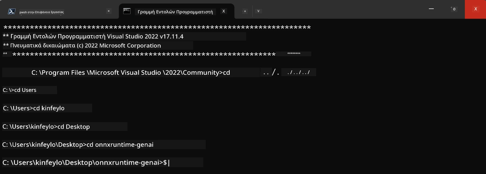

# **Οδηγός για OnnxRuntime GenAI Windows GPU**

Αυτός ο οδηγός παρέχει βήματα για την εγκατάσταση και χρήση του ONNX Runtime (ORT) με GPUs στα Windows. Έχει σχεδιαστεί για να σας βοηθήσει να αξιοποιήσετε την επιτάχυνση GPU για τα μοντέλα σας, βελτιώνοντας την απόδοση και την αποδοτικότητα.

Το έγγραφο παρέχει οδηγίες σχετικά με:

- Ρύθμιση Περιβάλλοντος: Οδηγίες για την εγκατάσταση των απαραίτητων εξαρτημάτων όπως CUDA, cuDNN και ONNX Runtime.
- Διαμόρφωση: Πώς να διαμορφώσετε το περιβάλλον και το ONNX Runtime για να αξιοποιήσετε αποτελεσματικά τους πόρους GPU.
- Συμβουλές Βελτιστοποίησης: Συμβουλές για το πώς να ρυθμίσετε τις ρυθμίσεις GPU για βέλτιστη απόδοση.

### **1. Python 3.10.x /3.11.8**

   ***Σημείωση*** Προτείνεται η χρήση του [miniforge](https://github.com/conda-forge/miniforge/releases/latest/download/Miniforge3-Windows-x86_64.exe) ως περιβάλλον Python

   ```bash

   conda create -n pydev python==3.11.8

   conda activate pydev

   ```

   ***Υπενθύμιση*** Εάν έχετε εγκαταστήσει κάποια βιβλιοθήκη Python ONNX, παρακαλώ απεγκαταστήστε την

### **2. Εγκατάσταση CMake με winget**


   ```bash

   winget install -e --id Kitware.CMake

   ```

### **3. Εγκατάσταση Visual Studio 2022 - Desktop Development with C++**

   ***Σημείωση*** Αν δεν θέλετε να κάνετε compile, μπορείτε να παραλείψετε αυτό το βήμα




### **4. Εγκατάσταση NVIDIA Driver**

1. **Οδηγός NVIDIA GPU**  [https://www.nvidia.com/en-us/drivers/](https://www.nvidia.com/en-us/drivers/)

2. **NVIDIA CUDA 12.4** [https://developer.nvidia.com/cuda-12-4-0-download-archive](https://developer.nvidia.com/cuda-12-4-0-download-archive)

3. **NVIDIA CUDNN 9.4**  [https://developer.nvidia.com/cudnn-downloads](https://developer.nvidia.com/cudnn-downloads)

***Υπενθύμιση*** Παρακαλώ χρησιμοποιήστε τις προεπιλεγμένες ρυθμίσεις κατά τη διαδικασία εγκατάστασης

### **5. Ρύθμιση Περιβάλλοντος NVIDIA**

Αντιγράψτε το NVIDIA CUDNN 9.4 lib, bin, include στο NVIDIA CUDA 12.4 lib, bin, include

- Αντιγράψτε τα αρχεία από *'C:\Program Files\NVIDIA\CUDNN\v9.4\bin\12.6'* στο  *'C:\Program Files\NVIDIA GPU Computing Toolkit\CUDA\v12.4\bin*

- Αντιγράψτε τα αρχεία από *'C:\Program Files\NVIDIA\CUDNN\v9.4\include\12.6'* στο  *'C:\Program Files\NVIDIA GPU Computing Toolkit\CUDA\v12.4\include*

- Αντιγράψτε τα αρχεία από *'C:\Program Files\NVIDIA\CUDNN\v9.4\lib\12.6'* στο  *'C:\Program Files\NVIDIA GPU Computing Toolkit\CUDA\v12.4\lib\x64'*


### **6. Κατέβασμα Phi-3.5-mini-instruct-onnx**


   ```bash

   winget install -e --id Git.Git

   winget install -e --id GitHub.GitLFS

   git lfs install

   git clone https://huggingface.co/microsoft/Phi-3.5-mini-instruct-onnx

   ```

### **7. Εκτέλεση InferencePhi35Instruct.ipynb**

   Ανοίξτε το [Notebook](../../../../code/09.UpdateSamples/Aug/ortgpu-phi35-instruct.ipynb) και εκτελέστε 





### **8. Compile ORT GenAI GPU**


   ***Σημείωση*** 
   
   1. Παρακαλώ απεγκαταστήστε πρώτα όλα τα onnx, onnxruntime και onnxruntime-genai

   
   ```bash

   pip list 
   
   ```

   Έπειτα απεγκαταστήστε όλες τις βιβλιοθήκες onnxruntime, π.χ.


   ```bash

   pip uninstall onnxruntime

   pip uninstall onnxruntime-genai

   pip uninstall onnxruntume-genai-cuda
   
   ```

   2. Ελέγξτε την υποστήριξη της επεκτάσεως Visual Studio 

   Ελέγξτε το C:\Program Files\NVIDIA GPU Computing Toolkit\CUDA\v12.4\extras για να βεβαιωθείτε ότι υπάρχει το C:\Program Files\NVIDIA GPU Computing Toolkit\CUDA\v12.4\extras\visual_studio_integration. 
   
   Αν δεν βρεθεί, ελέγξτε άλλους φακέλους του Cuda toolkit driver και αντιγράψτε το φάκελο visual_studio_integration και το περιεχόμενό του στο C:\Program Files\NVIDIA GPU Computing Toolkit\CUDA\v12.4\extras\visual_studio_integration


   - Αν δεν θέλετε να κάνετε compile, μπορείτε να παραλείψετε αυτό το βήμα


   ```bash

   git clone https://github.com/microsoft/onnxruntime-genai

   ```

   - Κατεβάστε το [https://github.com/microsoft/onnxruntime/releases/download/v1.19.2/onnxruntime-win-x64-gpu-1.19.2.zip](https://github.com/microsoft/onnxruntime/releases/download/v1.19.2/onnxruntime-win-x64-gpu-1.19.2.zip)

   - Αποσυμπιέστε το onnxruntime-win-x64-gpu-1.19.2.zip, μετονομάστε το σε **ort** και αντιγράψτε το φάκελο ort στο onnxruntime-genai

   - Χρησιμοποιώντας το Windows Terminal, πηγαίνετε στο Developer Command Prompt για VS 2022 και μεταβείτε στο onnxruntime-genai 



   - Κάντε compile με το περιβάλλον Python σας

   
   ```bash

   cd onnxruntime-genai

   python build.py --use_cuda  --cuda_home "C:\Program Files\NVIDIA GPU Computing Toolkit\CUDA\v12.4" --config Release
 

   cd build/Windows/Release/Wheel

   pip install .whl

   ```

---

<!-- CO-OP TRANSLATOR DISCLAIMER START -->
**Αποποίηση ευθυνών**:
Αυτό το έγγραφο έχει μεταφραστεί χρησιμοποιώντας την υπηρεσία μετάφρασης με τεχνητή νοημοσύνη [Co-op Translator](https://github.com/Azure/co-op-translator). Ενώ επιδιώκουμε την ακρίβεια, παρακαλούμε να έχετε υπόψη ότι οι αυτοματοποιημένες μεταφράσεις ενδέχεται να περιέχουν λάθη ή ανακρίβειες. Το πρωτότυπο έγγραφο στη μητρική του γλώσσα πρέπει να θεωρείται η αυθεντική πηγή. Για κρίσιμες πληροφορίες, συνιστάται επαγγελματική ανθρώπινη μετάφραση. Δεν φέρουμε ευθύνη για τυχόν παρεξηγήσεις ή λανθασμένες ερμηνείες που προκύπτουν από τη χρήση αυτής της μετάφρασης.
<!-- CO-OP TRANSLATOR DISCLAIMER END -->