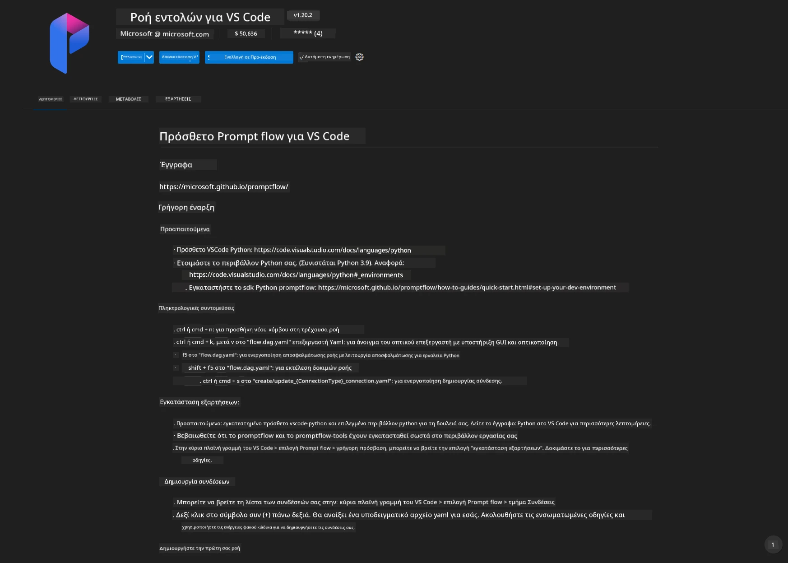
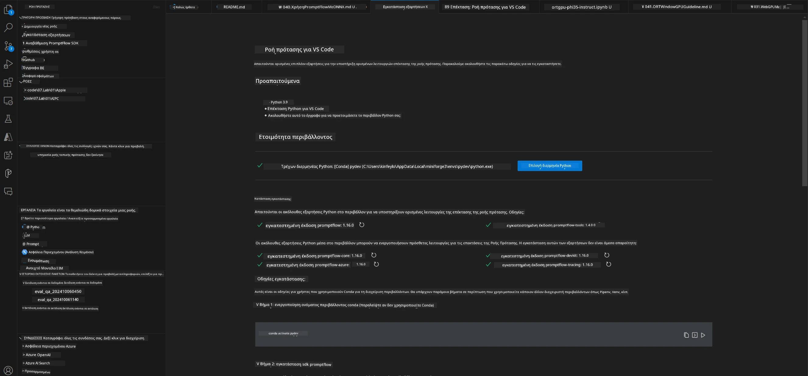
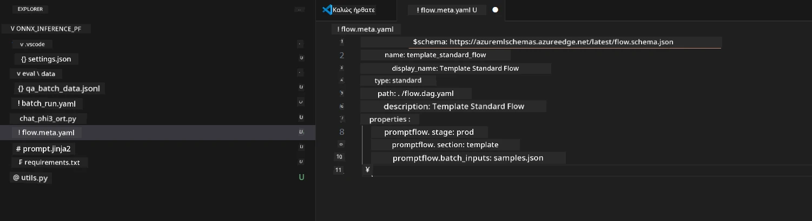
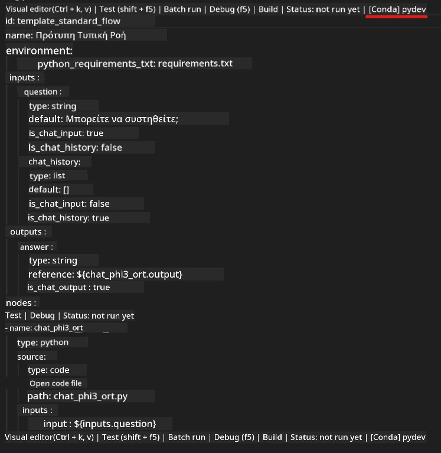
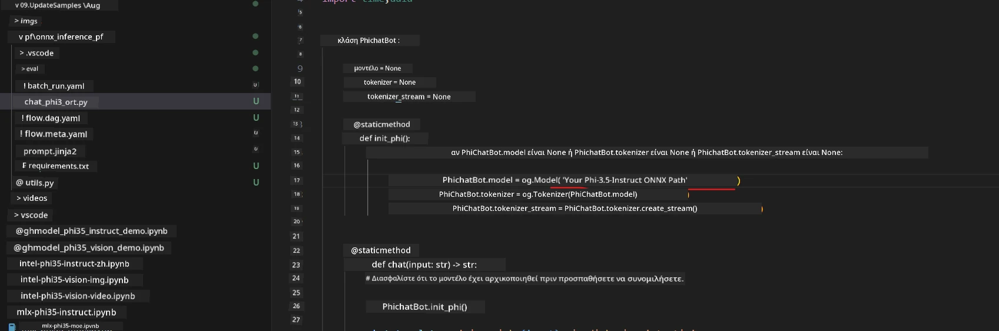
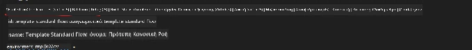
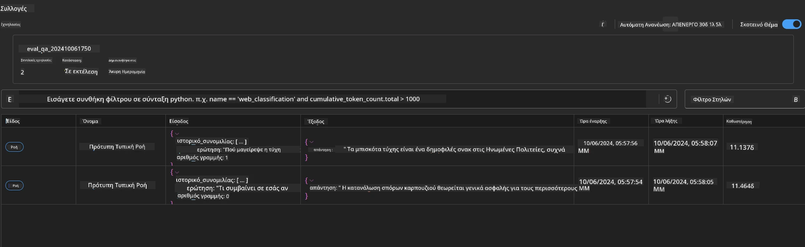

<!--
CO_OP_TRANSLATOR_METADATA:
{
  "original_hash": "92e7dac1e5af0dd7c94170fdaf6860fe",
  "translation_date": "2025-07-17T03:00:26+00:00",
  "source_file": "md/02.Application/01.TextAndChat/Phi3/UsingPromptFlowWithONNX.md",
  "language_code": "el"
}
-->
# Χρήση Windows GPU για τη δημιουργία λύσης Prompt flow με Phi-3.5-Instruct ONNX

Το παρακάτω έγγραφο είναι ένα παράδειγμα για το πώς να χρησιμοποιήσετε το PromptFlow με ONNX (Open Neural Network Exchange) για την ανάπτυξη εφαρμογών AI βασισμένων σε μοντέλα Phi-3.

Το PromptFlow είναι ένα σύνολο εργαλείων ανάπτυξης σχεδιασμένο να απλοποιεί τον πλήρη κύκλο ανάπτυξης εφαρμογών AI βασισμένων σε LLM (Large Language Model), από τη σύλληψη της ιδέας και το πρωτότυπο μέχρι τη δοκιμή και την αξιολόγηση.

Με την ενσωμάτωση του PromptFlow με το ONNX, οι προγραμματιστές μπορούν να:

- Βελτιστοποιήσουν την απόδοση του μοντέλου: Αξιοποιήστε το ONNX για αποδοτική εκτέλεση και ανάπτυξη μοντέλων.
- Απλοποιήσουν την ανάπτυξη: Χρησιμοποιήστε το PromptFlow για να διαχειριστείτε τη ροή εργασίας και να αυτοματοποιήσετε επαναλαμβανόμενες εργασίες.
- Ενισχύσουν τη συνεργασία: Διευκολύνετε την καλύτερη συνεργασία μεταξύ των μελών της ομάδας παρέχοντας ένα ενιαίο περιβάλλον ανάπτυξης.

**Prompt flow** είναι ένα σύνολο εργαλείων ανάπτυξης σχεδιασμένο να απλοποιεί τον πλήρη κύκλο ανάπτυξης εφαρμογών AI βασισμένων σε LLM, από τη σύλληψη της ιδέας, το πρωτότυπο, τη δοκιμή, την αξιολόγηση μέχρι την παραγωγική ανάπτυξη και την παρακολούθηση. Κάνει την μηχανική των prompts πολύ πιο εύκολη και σας επιτρέπει να δημιουργήσετε εφαρμογές LLM με ποιότητα παραγωγής.

Το Prompt flow μπορεί να συνδεθεί με OpenAI, Azure OpenAI Service και προσαρμόσιμα μοντέλα (Huggingface, τοπικά LLM/SLM). Ελπίζουμε να αναπτύξουμε το κβαντισμένο μοντέλο ONNX του Phi-3.5 σε τοπικές εφαρμογές. Το Prompt flow μπορεί να μας βοηθήσει να σχεδιάσουμε καλύτερα την επιχείρησή μας και να ολοκληρώσουμε τοπικές λύσεις βασισμένες στο Phi-3.5. Σε αυτό το παράδειγμα, θα συνδυάσουμε τη βιβλιοθήκη ONNX Runtime GenAI για να ολοκληρώσουμε τη λύση Prompt flow βασισμένη σε Windows GPU.

## **Εγκατάσταση**

### **ONNX Runtime GenAI για Windows GPU**

Διαβάστε αυτόν τον οδηγό για να ρυθμίσετε το ONNX Runtime GenAI για Windows GPU [κάντε κλικ εδώ](./ORTWindowGPUGuideline.md)

### **Ρύθμιση Prompt flow στο VSCode**

1. Εγκαταστήστε την επέκταση Prompt flow για VS Code



2. Μετά την εγκατάσταση της επέκτασης Prompt flow για VS Code, κάντε κλικ στην επέκταση και επιλέξτε **Installation dependencies** ακολουθώντας αυτόν τον οδηγό για να εγκαταστήσετε το Prompt flow SDK στο περιβάλλον σας



3. Κατεβάστε τον [Κώδικα Δείγματος](../../../../../../code/09.UpdateSamples/Aug/pf/onnx_inference_pf) και ανοίξτε το δείγμα με το VS Code



4. Ανοίξτε το **flow.dag.yaml** για να επιλέξετε το Python περιβάλλον σας



   Ανοίξτε το **chat_phi3_ort.py** για να αλλάξετε τη θέση του μοντέλου Phi-3.5-instruct ONNX



5. Εκτελέστε το prompt flow για δοκιμή

Ανοίξτε το **flow.dag.yaml** και κάντε κλικ στον οπτικό επεξεργαστή



Μετά το κλικ, εκτελέστε το για να το δοκιμάσετε


1. Μπορείτε να εκτελέσετε batch στο τερματικό για να δείτε περισσότερα αποτελέσματα


```bash

pf run create --file batch_run.yaml --stream --name 'Your eval qa name'    

```

Μπορείτε να δείτε τα αποτελέσματα στον προεπιλεγμένο περιηγητή σας




**Αποποίηση ευθυνών**:  
Αυτό το έγγραφο έχει μεταφραστεί χρησιμοποιώντας την υπηρεσία αυτόματης μετάφρασης AI [Co-op Translator](https://github.com/Azure/co-op-translator). Παρόλο που επιδιώκουμε την ακρίβεια, παρακαλούμε να έχετε υπόψη ότι οι αυτόματες μεταφράσεις ενδέχεται να περιέχουν λάθη ή ανακρίβειες. Το πρωτότυπο έγγραφο στη γλώσσα του θεωρείται η αυθεντική πηγή. Για κρίσιμες πληροφορίες, συνιστάται επαγγελματική ανθρώπινη μετάφραση. Δεν φέρουμε ευθύνη για τυχόν παρεξηγήσεις ή λανθασμένες ερμηνείες που προκύπτουν από τη χρήση αυτής της μετάφρασης.