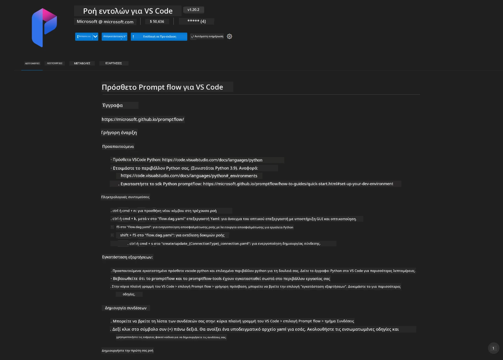
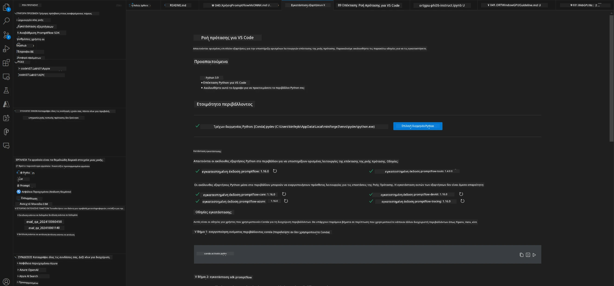
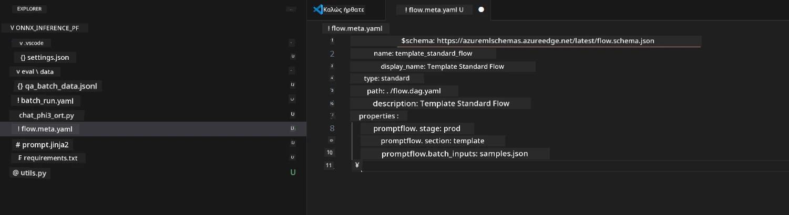
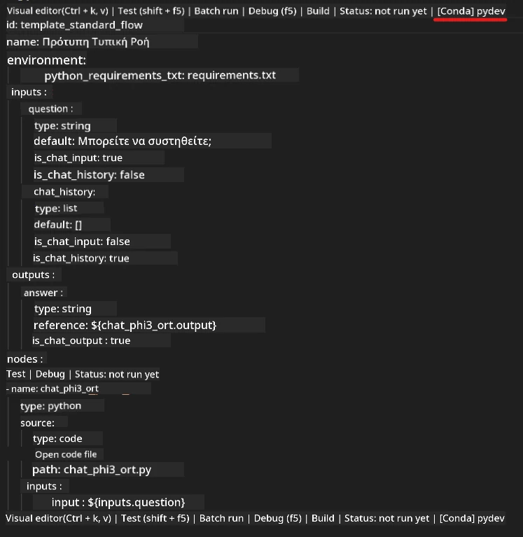
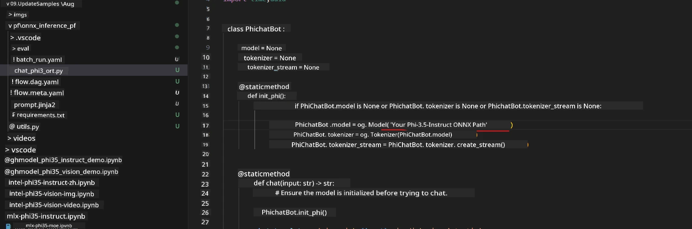
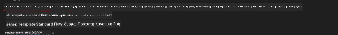
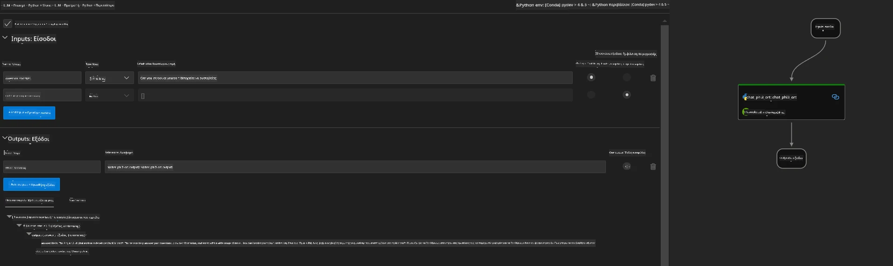
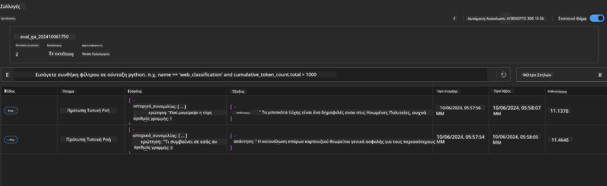

# Χρήση Windows GPU για τη δημιουργία λύσης Prompt flow με Phi-3.5-Instruct ONNX 

Το ακόλουθο έγγραφο είναι ένα παράδειγμα για το πώς να χρησιμοποιήσετε το PromptFlow με ONNX (Open Neural Network Exchange) για την ανάπτυξη εφαρμογών AI βασισμένων σε μοντέλα Phi-3.

Το PromptFlow είναι ένα σύνολο εργαλείων ανάπτυξης που έχουν σχεδιαστεί για να απλοποιήσουν τον κύκλο ανάπτυξης από άκρο σε άκρο εφαρμογών AI βασισμένων σε LLM (Μεγάλα Μοντέλα Γλώσσας), από την ιδέα και το πρωτότυπο μέχρι τον έλεγχο και την αξιολόγηση.

Με την ενσωμάτωση του PromptFlow με το ONNX, οι προγραμματιστές μπορούν να:

- Βελτιστοποιήσουν την απόδοση του μοντέλου: Αξιοποιήστε το ONNX για αποδοτική εκτέλεση μοντέλου και ανάπτυξη.
- Απλοποιήσουν την ανάπτυξη: Χρησιμοποιήστε το PromptFlow για να διαχειριστείτε τη ροή εργασίας και να αυτοματοποιήσετε επαναλαμβανόμενες εργασίες.
- Ενισχύσουν τη συνεργασία: Διευκολύνετε καλύτερη συνεργασία μεταξύ των μελών της ομάδας παρέχοντας ένα ενιαίο περιβάλλον ανάπτυξης.

**Το Prompt flow** είναι ένα σύνολο εργαλείων ανάπτυξης που έχουν σχεδιαστεί για να απλοποιήσουν τον κύκλο ανάπτυξης από άκρο σε άκρο εφαρμογών AI βασισμένων σε LLM, από την ιδέα, το πρωτότυπο, τον έλεγχο, την αξιολόγηση μέχρι την παραγωγή και την παρακολούθηση. Κάνει τη μηχανική prompt πολύ πιο εύκολη και σας επιτρέπει να δημιουργείτε εφαρμογές LLM με ποιοτικά χαρακτηριστικά παραγωγής.

Το Prompt flow μπορεί να συνδεθεί με το OpenAI, την υπηρεσία Azure OpenAI, και προσαρμόσιμα μοντέλα (Huggingface, τοπικά LLM/SLM). Ελπίζουμε να αναπτύξουμε το κβαντισμένο μοντέλο ONNX του Phi-3.5 σε τοπικές εφαρμογές. Το Prompt flow μπορεί να μας βοηθήσει να προγραμματίσουμε καλύτερα την επιχείρησή μας και να ολοκληρώσουμε τοπικές λύσεις βασισμένες στο Phi-3.5. Σε αυτό το παράδειγμα, θα συνδυάσουμε τη βιβλιοθήκη ONNX Runtime GenAI για να ολοκληρώσουμε τη λύση Prompt flow βασισμένη σε Windows GPU.

## **Εγκατάσταση**

### **ONNX Runtime GenAI για Windows GPU**

Διαβάστε αυτόν τον οδηγό για να ρυθμίσετε το ONNX Runtime GenAI για Windows GPU  [click here](./ORTWindowGPUGuideline.md)

### **Ρύθμιση Prompt flow στο VSCode**

1. Εγκατάσταση της επέκτασης Prompt flow VS Code



2. Μετά την εγκατάσταση της επέκτασης Prompt flow VS Code, κάντε κλικ στην επέκταση, και επιλέξτε **Installation dependencies** ακολουθώντας αυτόν τον οδηγό για να εγκαταστήσετε το Prompt flow SDK στο περιβάλλον σας



3. Κατεβάστε [Sample Code](../../../../../../code/09.UpdateSamples/Aug/pf/onnx_inference_pf) και χρησιμοποιήστε το VS Code για να ανοίξετε αυτό το δείγμα



4. Ανοίξτε το **flow.dag.yaml** για να επιλέξετε το Python περιβάλλον σας



   Ανοίξτε το **chat_phi3_ort.py** για να αλλάξετε τη θέση του μοντέλου Phi-3.5-instruct ONNX σας



5. Εκτελέστε το prompt flow σας για δοκιμή

Ανοίξτε το **flow.dag.yaml** και κάντε κλικ στον οπτικό επεξεργαστή (visual editor)



μετά κάντε κλικ σε αυτό και εκτελέστε το για δοκιμή



1. Μπορείτε να εκτελέσετε παρτίδα (batch) στο τερματικό για να δείτε περισσότερα αποτελέσματα


```bash

pf run create --file batch_run.yaml --stream --name 'Your eval qa name'    

```

Μπορείτε να ελέγξετε τα αποτελέσματα στον προεπιλεγμένο περιηγητή σας




---

<!-- CO-OP TRANSLATOR DISCLAIMER START -->
**Αποποίηση ευθυνών**:
Αυτό το έγγραφο έχει μεταφραστεί χρησιμοποιώντας την υπηρεσία μετάφρασης με τεχνητή νοημοσύνη [Co-op Translator](https://github.com/Azure/co-op-translator). Ενώ επιδιώκουμε την ακρίβεια, παρακαλούμε να έχετε υπόψη ότι οι αυτοματοποιημένες μεταφράσεις ενδέχεται να περιέχουν λάθη ή ανακρίβειες. Το πρωτότυπο έγγραφο στη μητρική του γλώσσα πρέπει να θεωρείται η αυθεντική πηγή. Για κρίσιμες πληροφορίες, συνιστάται επαγγελματική ανθρώπινη μετάφραση. Δεν φέρουμε ευθύνη για τυχόν παρεξηγήσεις ή λανθασμένες ερμηνείες που προκύπτουν από τη χρήση αυτής της μετάφρασης.
<!-- CO-OP TRANSLATOR DISCLAIMER END -->