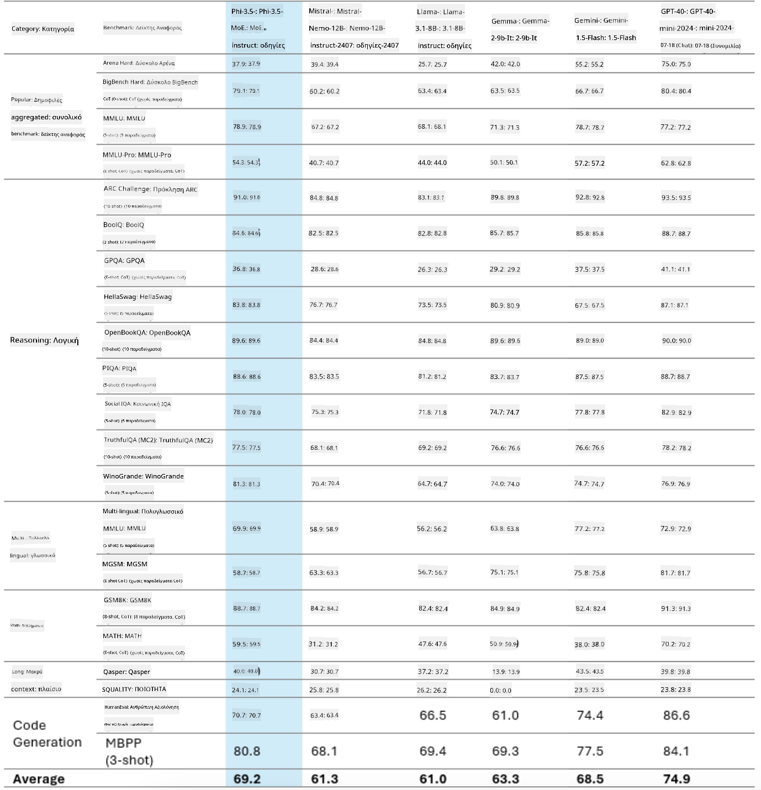
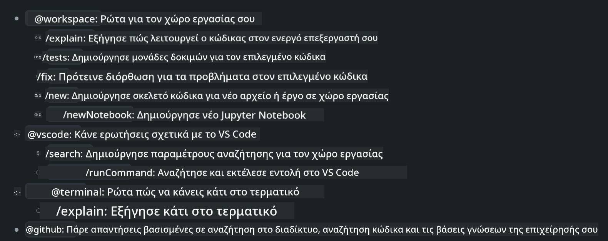
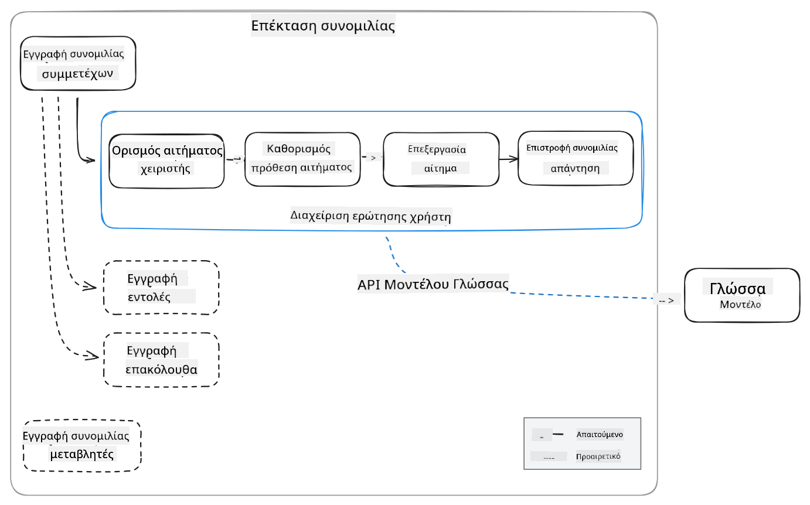
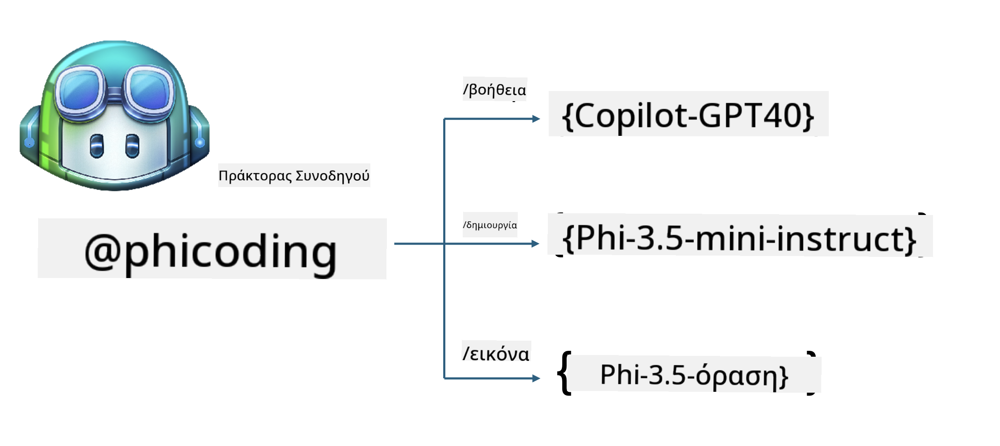
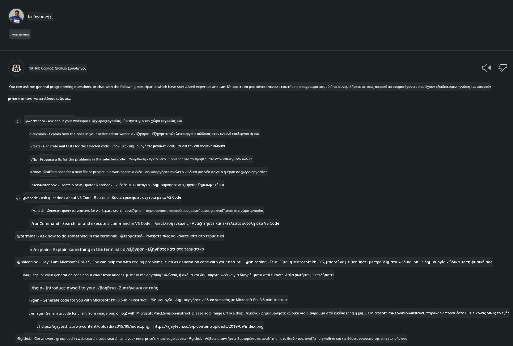
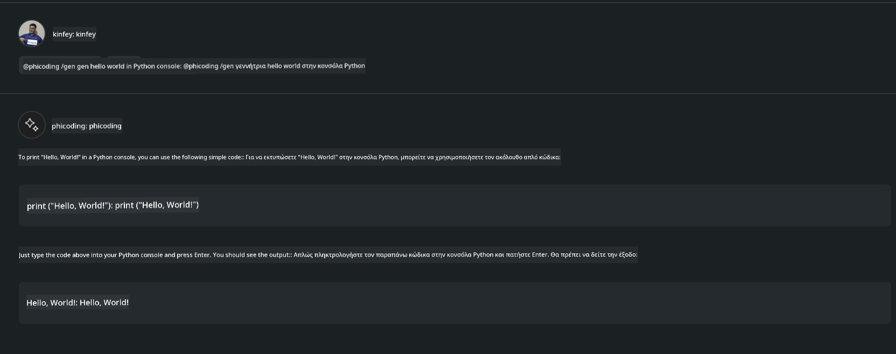
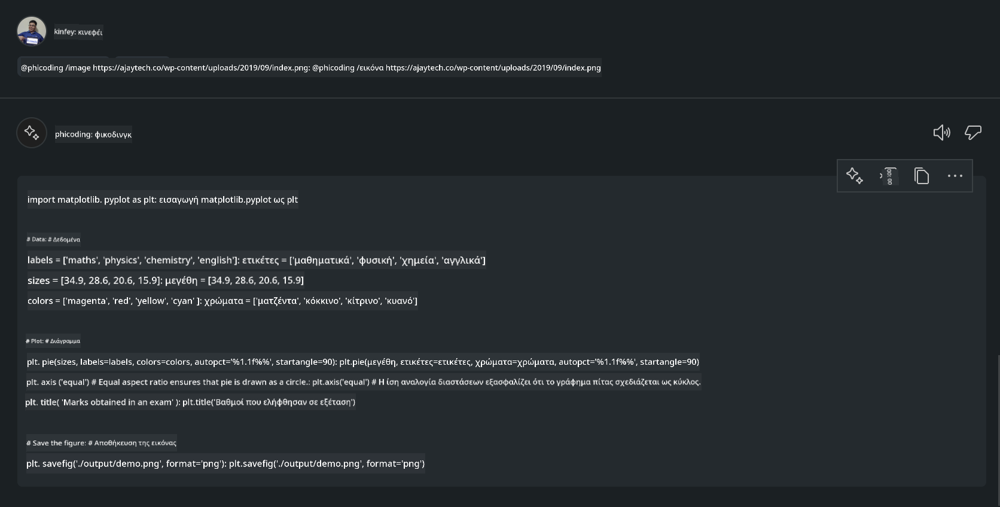

<!--
CO_OP_TRANSLATOR_METADATA:
{
  "original_hash": "35bf81388ac6917277b8d9a0c39bdc70",
  "translation_date": "2025-07-17T03:26:10+00:00",
  "source_file": "md/02.Application/02.Code/Phi3/CreateVSCodeChatAgentWithGitHubModels.md",
  "language_code": "el"
}
-->
# **Δημιουργήστε τον δικό σας Visual Studio Code Chat Copilot Agent με Phi-3.5 από τα GitHub Models**

Χρησιμοποιείτε το Visual Studio Code Copilot; Ειδικά στο Chat, μπορείτε να χρησιμοποιήσετε διαφορετικούς agents για να βελτιώσετε την ικανότητα δημιουργίας, συγγραφής και συντήρησης έργων στο Visual Studio Code. Το Visual Studio Code παρέχει ένα API που επιτρέπει σε εταιρείες και ιδιώτες να δημιουργήσουν διαφορετικούς agents βασισμένους στην επιχείρησή τους, ώστε να επεκτείνουν τις δυνατότητές τους σε διάφορους εξειδικευμένους τομείς. Σε αυτό το άρθρο, θα εστιάσουμε στα **Phi-3.5-mini-instruct (128k)** και **Phi-3.5-vision-instruct (128k)** των GitHub Models για να δημιουργήσετε τον δικό σας Visual Studio Code Agent.

## **Σχετικά με το Phi-3.5 στα GitHub Models**

Γνωρίζουμε ότι το Phi-3/3.5-mini-instruct στην οικογένεια Phi-3/3.5 έχει ισχυρές ικανότητες κατανόησης και δημιουργίας κώδικα, και υπερέχει σε σχέση με τα Gemma-2-9b και Mistral-Nemo-12B-instruct-2407.



Τα πιο πρόσφατα GitHub Models παρέχουν ήδη πρόσβαση στα μοντέλα Phi-3.5-mini-instruct (128k) και Phi-3.5-vision-instruct (128k). Οι προγραμματιστές μπορούν να τα προσεγγίσουν μέσω του OpenAI SDK, του Azure AI Inference SDK και του REST API.


***Note: *** Συνιστάται η χρήση του Azure AI Inference SDK εδώ, γιατί μπορεί να εναλλάσσεται καλύτερα με το Azure Model Catalog στο περιβάλλον παραγωγής.

Ακολουθούν τα αποτελέσματα των **Phi-3.5-mini-instruct (128k)** και **Phi-3.5-vision-instruct (128k)** στο σενάριο δημιουργίας κώδικα μετά τη σύνδεση με τα GitHub Models, καθώς και προετοιμασία για τα επόμενα παραδείγματα.

**Demo: GitHub Models Phi-3.5-mini-instruct (128k) δημιουργεί κώδικα από Prompt** ([κάντε κλικ εδώ](../../../../../../code/09.UpdateSamples/Aug/ghmodel_phi35_instruct_demo.ipynb))

**Demo: GitHub Models Phi-3.5-vision-instruct (128k) δημιουργεί κώδικα από Εικόνα** ([κάντε κλικ εδώ](../../../../../../code/09.UpdateSamples/Aug/ghmodel_phi35_vision_demo.ipynb))


## **Σχετικά με τον GitHub Copilot Chat Agent**

Ο GitHub Copilot Chat Agent μπορεί να ολοκληρώσει διάφορες εργασίες σε διαφορετικά σενάρια έργων βασισμένα στον κώδικα. Το σύστημα διαθέτει τέσσερις agents: workspace, github, terminal, vscode



Προσθέτοντας το όνομα του agent με ‘@’, μπορείτε να ολοκληρώσετε γρήγορα την αντίστοιχη εργασία. Για επιχειρήσεις, αν προσθέσετε το δικό σας περιεχόμενο σχετικό με την επιχείρηση, όπως απαιτήσεις, κωδικοποίηση, προδιαγραφές δοκιμών και κυκλοφορία, μπορείτε να έχετε πιο ισχυρές ιδιωτικές λειτουργίες για επιχειρήσεις βασισμένες στον GitHub Copilot.

Ο Visual Studio Code Chat Agent έχει πλέον επίσημα κυκλοφορήσει το API του, επιτρέποντας σε επιχειρήσεις ή προγραμματιστές επιχειρήσεων να αναπτύξουν agents βασισμένους σε διαφορετικά οικοσυστήματα λογισμικού. Βασισμένοι στη μέθοδο ανάπτυξης Visual Studio Code Extension Development, μπορείτε εύκολα να έχετε πρόσβαση στη διεπαφή του Visual Studio Code Chat Agent API. Μπορούμε να αναπτύξουμε με βάση αυτή τη διαδικασία.



Το σενάριο ανάπτυξης μπορεί να υποστηρίξει πρόσβαση σε API τρίτων μοντέλων (όπως GitHub Models, Azure Model Catalog και αυτοδημιούργητες υπηρεσίες βασισμένες σε ανοιχτού κώδικα μοντέλα) και μπορεί επίσης να χρησιμοποιήσει τα μοντέλα gpt-35-turbo, gpt-4 και gpt-4o που παρέχονται από τον GitHub Copilot.

## **Προσθήκη Agent @phicoding βασισμένου στο Phi-3.5**

Προσπαθούμε να ενσωματώσουμε τις προγραμματιστικές δυνατότητες του Phi-3.5 για να ολοκληρώσουμε τη συγγραφή κώδικα, τη δημιουργία κώδικα από εικόνες και άλλες εργασίες. Ολοκληρώνουμε έναν Agent βασισμένο στο Phi-3.5 - @PHI, με τις παρακάτω λειτουργίες:

1. Δημιουργία αυτοπαρουσίασης βασισμένη στο GPT-4o που παρέχεται από τον GitHub Copilot μέσω της εντολής **@phicoding /help**

2. Δημιουργία κώδικα για διάφορες γλώσσες προγραμματισμού βασισμένη στο **Phi-3.5-mini-instruct (128k)** μέσω της εντολής **@phicoding /gen**

3. Δημιουργία κώδικα βασισμένη στο **Phi-3.5-vision-instruct (128k)** και ολοκλήρωση εικόνας μέσω της εντολής **@phicoding /image**



## **Σχετικά βήματα**

1. Εγκαταστήστε την υποστήριξη ανάπτυξης Visual Studio Code Extension χρησιμοποιώντας npm

```bash

npm install --global yo generator-code 

```
2. Δημιουργήστε ένα Visual Studio Code Extension plugin (σε λειτουργία ανάπτυξης Typescript, με όνομα phiext)

```bash

yo code 

```

3. Ανοίξτε το δημιουργημένο έργο και τροποποιήστε το package.json. Εδώ υπάρχουν οι σχετικές οδηγίες και ρυθμίσεις, καθώς και η ρύθμιση για τα GitHub Models. Σημειώστε ότι πρέπει να προσθέσετε εδώ το token των GitHub Models.

```json

{
  "name": "phiext",
  "displayName": "phiext",
  "description": "",
  "version": "0.0.1",
  "engines": {
    "vscode": "^1.93.0"
  },
  "categories": [
    "AI",
    "Chat"
  ],
  "activationEvents": [],
  "enabledApiProposals": [
      "chatVariableResolver"
  ],
  "main": "./dist/extension.js",
  "contributes": {
    "chatParticipants": [
        {
            "id": "chat.phicoding",
            "name": "phicoding",
            "description": "Hey! I am Microsoft Phi-3.5, She can help me with coding problems, such as generation code with your natural language, or even generation code about chart from images. Just ask me anything!",
            "isSticky": true,
            "commands": [
                {
                    "name": "help",
                    "description": "Introduce myself to you"
                },
                {
                    "name": "gen",
                    "description": "Generate code for you with Microsoft Phi-3.5-mini-instruct"
                },
                {
                    "name": "image",
                    "description": "Generate code for chart from image(png or jpg) with Microsoft Phi-3.5-vision-instruct, please add image url like this : https://ajaytech.co/wp-content/uploads/2019/09/index.png"
                }
            ]
        }
    ],
    "commands": [
        {
            "command": "phicoding.namesInEditor",
            "title": "Use Microsoft Phi 3.5 in Editor"
        }
    ],
    "configuration": {
      "type": "object",
      "title": "githubmodels",
      "properties": {
        "githubmodels.endpoint": {
          "type": "string",
          "default": "https://models.inference.ai.azure.com",
          "description": "Your GitHub Models Endpoint",
          "order": 0
        },
        "githubmodels.api_key": {
          "type": "string",
          "default": "Your GitHub Models Token",
          "description": "Your GitHub Models Token",
          "order": 1
        },
        "githubmodels.phi35instruct": {
          "type": "string",
          "default": "Phi-3.5-mini-instruct",
          "description": "Your Phi-35-Instruct Model",
          "order": 2
        },
        "githubmodels.phi35vision": {
          "type": "string",
          "default": "Phi-3.5-vision-instruct",
          "description": "Your Phi-35-Vision Model",
          "order": 3
        }
      }
    }
  },
  "scripts": {
    "vscode:prepublish": "npm run package",
    "compile": "webpack",
    "watch": "webpack --watch",
    "package": "webpack --mode production --devtool hidden-source-map",
    "compile-tests": "tsc -p . --outDir out",
    "watch-tests": "tsc -p . -w --outDir out",
    "pretest": "npm run compile-tests && npm run compile && npm run lint",
    "lint": "eslint src",
    "test": "vscode-test"
  },
  "devDependencies": {
    "@types/vscode": "^1.93.0",
    "@types/mocha": "^10.0.7",
    "@types/node": "20.x",
    "@typescript-eslint/eslint-plugin": "^8.3.0",
    "@typescript-eslint/parser": "^8.3.0",
    "eslint": "^9.9.1",
    "typescript": "^5.5.4",
    "ts-loader": "^9.5.1",
    "webpack": "^5.94.0",
    "webpack-cli": "^5.1.4",
    "@vscode/test-cli": "^0.0.10",
    "@vscode/test-electron": "^2.4.1"
  },
  "dependencies": {
    "@types/node-fetch": "^2.6.11",
    "node-fetch": "^3.3.2",
    "@azure-rest/ai-inference": "latest",
    "@azure/core-auth": "latest",
    "@azure/core-sse": "latest"
  }
}


```

4. Τροποποιήστε το src/extension.ts

```typescript

// The module 'vscode' contains the VS Code extensibility API
// Import the module and reference it with the alias vscode in your code below
import * as vscode from 'vscode';
import ModelClient from "@azure-rest/ai-inference";
import { AzureKeyCredential } from "@azure/core-auth";


interface IPhiChatResult extends vscode.ChatResult {
    metadata: {
        command: string;
    };
}


const MODEL_SELECTOR: vscode.LanguageModelChatSelector = { vendor: 'copilot', family: 'gpt-4o' };

function isValidImageUrl(url: string): boolean {
    const regex = /^(https?:\/\/.*\.(?:png|jpg))$/i;
    return regex.test(url);
}
  

// This method is called when your extension is activated
// Your extension is activated the very first time the command is executed
export function activate(context: vscode.ExtensionContext) {

    const codinghandler: vscode.ChatRequestHandler = async (request: vscode.ChatRequest, context: vscode.ChatContext, stream: vscode.ChatResponseStream, token: vscode.CancellationToken): Promise<IPhiChatResult> => {


        const config : any = vscode.workspace.getConfiguration('githubmodels');
        const endPoint: string = config.get('endpoint');
        const apiKey: string = config.get('api_key');
        const phi35instruct: string = config.get('phi35instruct');
        const phi35vision: string = config.get('phi35vision');
        
        if (request.command === 'help') {

            const content = "Welcome to Coding assistant with Microsoft Phi-3.5"; 
            stream.progress(content);


            try {
                const [model] = await vscode.lm.selectChatModels(MODEL_SELECTOR);
                if (model) {
                    const messages = [
                        vscode.LanguageModelChatMessage.User("Please help me express this content in a humorous way: I am a programming assistant who can help you convert natural language into code and generate code based on the charts in the images. output format like this : Hey I am Phi ......")
                    ];
                    const chatResponse = await model.sendRequest(messages, {}, token);
                    for await (const fragment of chatResponse.text) {
                        stream.markdown(fragment);
                    }
                }
            } catch(err) {
                console.log(err);
            }


            return { metadata: { command: 'help' } };

        }

        
        if (request.command === 'gen') {

            const content = "Welcome to use phi-3.5 to generate code";

            stream.progress(content);

            const client = new ModelClient(endPoint, new AzureKeyCredential(apiKey));

            const response = await client.path("/chat/completions").post({
              body: {
                messages: [
                  { role:"system", content: "You are a coding assistant.Help answer all code generation questions." },
                  { role:"user", content: request.prompt }
                ],
                model: phi35instruct,
                temperature: 0.4,
                max_tokens: 1000,
                top_p: 1.
              }
            });

            stream.markdown(response.body.choices[0].message.content);

            return { metadata: { command: 'gen' } };

        }


        
        if (request.command === 'image') {


            const content = "Welcome to use phi-3.5 to generate code from image(png or jpg),image url like this:https://ajaytech.co/wp-content/uploads/2019/09/index.png";

            stream.progress(content);

            if (!isValidImageUrl(request.prompt)) {
                stream.markdown('Please provide a valid image URL');
                return { metadata: { command: 'image' } };
            }
            else
            {

                const client = new ModelClient(endPoint, new AzureKeyCredential(apiKey));
    
                const response = await client.path("/chat/completions").post({
                    body: {
                      messages: [
                        { role: "system", content: "You are a helpful assistant that describes images in details." },
                        { role: "user", content: [
                            { type: "text", text: "Please generate code according to the chart in the picture according to the following requirements\n1. Keep all information in the chart, including data and text\n2. Do not generate additional information that is not included in the chart\n3. Please extract data from the picture, do not generate it from csv\n4. Please save the regenerated chart as a chart and save it to ./output/demo.png"},
                            { type: "image_url", image_url: {url: request.prompt}
                            }
                          ]
                        }
                      ],
                      model: phi35vision,
                      temperature: 0.4,
                      max_tokens: 2048,
                      top_p: 1.
                    }
                  });
    
                
                stream.markdown(response.body.choices[0].message.content);
    
                return { metadata: { command: 'image' } };
            }


        }


        return { metadata: { command: '' } };
    };


    const phi_ext = vscode.chat.createChatParticipant("chat.phicoding", codinghandler);

    phi_ext.iconPath = new vscode.ThemeIcon('sparkle');


    phi_ext.followupProvider = {
        provideFollowups(result: IPhiChatResult, context: vscode.ChatContext, token: vscode.CancellationToken) {
            return [{
                prompt: 'Let us coding with Phi-3.5 😋😋😋😋',
                label: vscode.l10n.t('Enjoy coding with Phi-3.5'),
                command: 'help'
            } satisfies vscode.ChatFollowup];
        }
    };

    context.subscriptions.push(phi_ext);
}

// This method is called when your extension is deactivated
export function deactivate() {}


```

6. Εκτέλεση

***/help***



***@phicoding /help***


***@phicoding /gen***



***@phicoding /image***



Μπορείτε να κατεβάσετε δείγμα κώδικα: [κλικ εδώ](../../../../../../code/09.UpdateSamples/Aug/vscode)

## **Πόροι**

1. Εγγραφείτε στα GitHub Models [https://gh.io/models](https://gh.io/models)

2. Μάθετε για την ανάπτυξη Visual Studio Code Extension [https://code.visualstudio.com/api/get-started/your-first-extension](https://code.visualstudio.com/api/get-started/your-first-extension)

3. Μάθετε για το Visual Studio Code Copilot Chat API [https://code.visualstudio.com/api/extension-guides/chat](https://code.visualstudio.com/api/extension-guides/chat)

**Αποποίηση ευθυνών**:  
Αυτό το έγγραφο έχει μεταφραστεί χρησιμοποιώντας την υπηρεσία αυτόματης μετάφρασης AI [Co-op Translator](https://github.com/Azure/co-op-translator). Παρόλο που επιδιώκουμε την ακρίβεια, παρακαλούμε να έχετε υπόψη ότι οι αυτόματες μεταφράσεις ενδέχεται να περιέχουν λάθη ή ανακρίβειες. Το πρωτότυπο έγγραφο στη μητρική του γλώσσα πρέπει να θεωρείται η αυθεντική πηγή. Για κρίσιμες πληροφορίες, συνιστάται επαγγελματική ανθρώπινη μετάφραση. Δεν φέρουμε ευθύνη για τυχόν παρεξηγήσεις ή λανθασμένες ερμηνείες που προκύπτουν από τη χρήση αυτής της μετάφρασης.