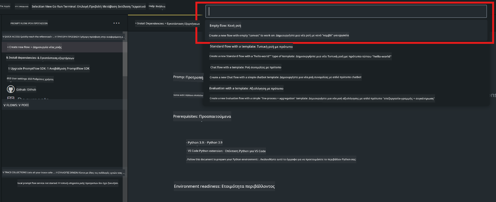
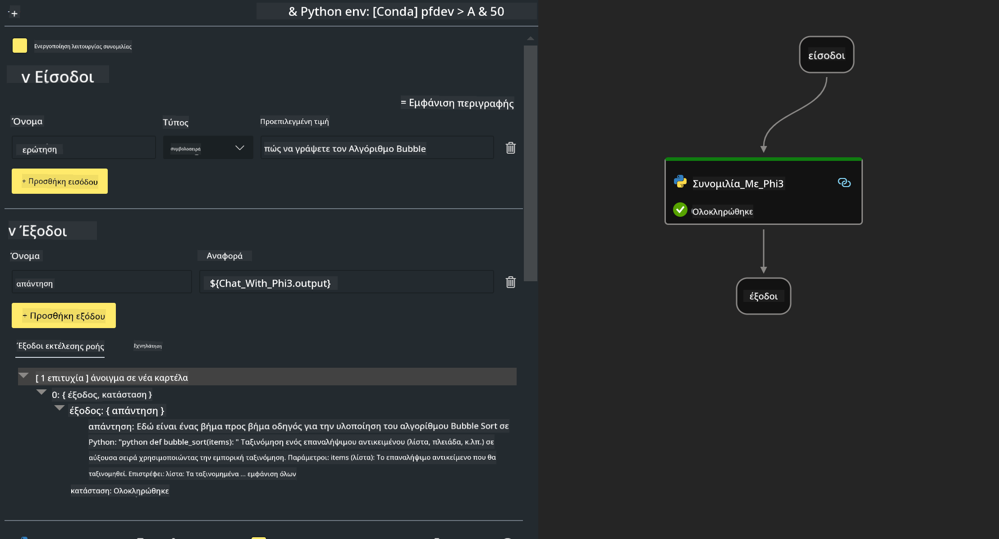

<!--
CO_OP_TRANSLATOR_METADATA:
{
  "original_hash": "bc29f7fe7fc16bed6932733eac8c81b8",
  "translation_date": "2025-07-17T03:58:18+00:00",
  "source_file": "md/02.Application/02.Code/Phi3/VSCodeExt/HOL/AIPC/02.PromptflowWithNPU.md",
  "language_code": "el"
}
-->
# **Εργαστήριο 2 - Εκτέλεση Prompt flow με Phi-3-mini σε AIPC**

## **Τι είναι το Prompt flow**

Το Prompt flow είναι ένα σύνολο εργαλείων ανάπτυξης σχεδιασμένο να απλοποιεί τον πλήρη κύκλο ανάπτυξης εφαρμογών AI βασισμένων σε LLM, από την ιδέα, το πρωτότυπο, τη δοκιμή, την αξιολόγηση μέχρι την παραγωγική ανάπτυξη και την παρακολούθηση. Κάνει την μηχανική των prompts πολύ πιο εύκολη και σας επιτρέπει να δημιουργήσετε εφαρμογές LLM με ποιότητα παραγωγής.

Με το prompt flow, θα μπορείτε να:

- Δημιουργείτε ροές που συνδέουν LLMs, prompts, κώδικα Python και άλλα εργαλεία σε μια εκτελέσιμη ροή εργασίας.

- Εντοπίζετε σφάλματα και επαναλαμβάνετε τις ροές σας, ειδικά την αλληλεπίδραση με τα LLMs, με ευκολία.

- Αξιολογείτε τις ροές σας, υπολογίζοντας μετρικές ποιότητας και απόδοσης με μεγαλύτερα σύνολα δεδομένων.

- Ενσωματώνετε τις δοκιμές και την αξιολόγηση στο σύστημα CI/CD σας για να διασφαλίσετε την ποιότητα της ροής σας.

- Αναπτύσσετε τις ροές σας στην πλατφόρμα εξυπηρέτησης που επιλέγετε ή τις ενσωματώνετε εύκολα στον κώδικα της εφαρμογής σας.

- (Προαιρετικό αλλά ιδιαίτερα συνιστώμενο) Συνεργάζεστε με την ομάδα σας αξιοποιώντας την cloud έκδοση του Prompt flow στο Azure AI.

## **Τι είναι το AIPC**

Ένας AI PC διαθέτει CPU, GPU και NPU, καθένα με συγκεκριμένες δυνατότητες επιτάχυνσης AI. Η NPU, ή νευρωνική μονάδα επεξεργασίας, είναι ένας εξειδικευμένος επιταχυντής που αναλαμβάνει εργασίες τεχνητής νοημοσύνης (AI) και μηχανικής μάθησης (ML) απευθείας στον υπολογιστή σας, αντί να στέλνει δεδομένα για επεξεργασία στο cloud. Η GPU και η CPU μπορούν επίσης να επεξεργαστούν αυτά τα φορτία εργασίας, αλλά η NPU είναι ιδιαίτερα αποτελεσματική σε υπολογισμούς AI χαμηλής κατανάλωσης ενέργειας. Ο AI PC αντιπροσωπεύει μια θεμελιώδη αλλαγή στον τρόπο λειτουργίας των υπολογιστών μας. Δεν είναι μια λύση για ένα πρόβλημα που δεν υπήρχε πριν. Αντίθετα, υπόσχεται μια τεράστια βελτίωση για την καθημερινή χρήση του υπολογιστή.

Πώς λειτουργεί λοιπόν; Σε σύγκριση με την γενετική AI και τα τεράστια μεγάλα γλωσσικά μοντέλα (LLMs) που έχουν εκπαιδευτεί σε τεράστια δημόσια δεδομένα, η AI που θα εκτελείται στον υπολογιστή σας είναι πιο προσιτή σε σχεδόν κάθε επίπεδο. Η ιδέα είναι πιο εύκολα κατανοητή και επειδή εκπαιδεύεται στα δικά σας δεδομένα, χωρίς να χρειάζεται πρόσβαση στο cloud, τα οφέλη είναι πιο άμεσα ελκυστικά για ένα ευρύτερο κοινό.

Βραχυπρόθεσμα, ο κόσμος του AI PC περιλαμβάνει προσωπικούς βοηθούς και μικρότερα μοντέλα AI που τρέχουν απευθείας στον υπολογιστή σας, χρησιμοποιώντας τα δεδομένα σας για να προσφέρουν προσωπικές, ιδιωτικές και πιο ασφαλείς βελτιώσεις AI για πράγματα που κάνετε ήδη καθημερινά – όπως η καταγραφή πρακτικών συναντήσεων, η οργάνωση μιας φανταστικής ποδοσφαιρικής λίγκας, η αυτοματοποίηση βελτιώσεων για επεξεργασία φωτογραφιών και βίντεο, ή η σύνταξη του τέλειου προγράμματος για μια οικογενειακή συνάντηση βάσει των ωρών άφιξης και αναχώρησης όλων.

## **Δημιουργία ροών γεννήτριας κώδικα σε AIPC**

***Note*** ：Αν δεν έχετε ολοκληρώσει την εγκατάσταση του περιβάλλοντος, παρακαλώ επισκεφθείτε το [Lab 0 -Installations](./01.Installations.md)

1. Ανοίξτε την επέκταση Prompt flow στο Visual Studio Code και δημιουργήστε ένα κενό έργο ροής



2. Προσθέστε παραμέτρους Εισόδων και Εξόδων και προσθέστε κώδικα Python ως νέα ροή



Μπορείτε να αναφερθείτε σε αυτή τη δομή (flow.dag.yaml) για να κατασκευάσετε τη ροή σας

```yaml

inputs:
  question:
    type: string
    default: how to write Bubble Algorithm
outputs:
  answer:
    type: string
    reference: ${Chat_With_Phi3.output}
nodes:
- name: Chat_With_Phi3
  type: python
  source:
    type: code
    path: Chat_With_Phi3.py
  inputs:
    question: ${inputs.question}


```

3. Προσθέστε κώδικα στο ***Chat_With_Phi3.py***

```python


from promptflow.core import tool

# import torch
from transformers import AutoTokenizer, pipeline,TextStreamer
import intel_npu_acceleration_library as npu_lib

import warnings

import asyncio
import platform

class Phi3CodeAgent:
    
    model = None
    tokenizer = None
    text_streamer = None
    
    model_id = "microsoft/Phi-3-mini-4k-instruct"

    @staticmethod
    def init_phi3():
        
        if Phi3CodeAgent.model is None or Phi3CodeAgent.tokenizer is None or Phi3CodeAgent.text_streamer is None:
            Phi3CodeAgent.model = npu_lib.NPUModelForCausalLM.from_pretrained(
                                    Phi3CodeAgent.model_id,
                                    torch_dtype="auto",
                                    dtype=npu_lib.int4,
                                    trust_remote_code=True
                                )
            Phi3CodeAgent.tokenizer = AutoTokenizer.from_pretrained(Phi3CodeAgent.model_id)
            Phi3CodeAgent.text_streamer = TextStreamer(Phi3CodeAgent.tokenizer, skip_prompt=True)

    

    @staticmethod
    def chat_with_phi3(prompt):
        
        Phi3CodeAgent.init_phi3()

        messages = "<|system|>You are a AI Python coding assistant. Please help me to generate code in Python.The answer only genertated Python code, but any comments and instructions do not need to be generated<|end|><|user|>" + prompt +"<|end|><|assistant|>"


        generation_args = {
            "max_new_tokens": 1024,
            "return_full_text": False,
            "temperature": 0.3,
            "do_sample": False,
            "streamer": Phi3CodeAgent.text_streamer,
        }

        pipe = pipeline(
            "text-generation",
            model=Phi3CodeAgent.model,
            tokenizer=Phi3CodeAgent.tokenizer,
            # **generation_args
        )

        result = ''

        with warnings.catch_warnings():
            warnings.simplefilter("ignore")
            response = pipe(messages, **generation_args)
            result =response[0]['generated_text']
            return result


@tool
def my_python_tool(question: str) -> str:
    if platform.system() == 'Windows':
        asyncio.set_event_loop_policy(asyncio.WindowsSelectorEventLoopPolicy())
    return Phi3CodeAgent.chat_with_phi3(question)


```

4. Μπορείτε να δοκιμάσετε τη ροή από το Debug ή το Run για να ελέγξετε αν η γεννήτρια κώδικα λειτουργεί σωστά


5. Εκτελέστε τη ροή ως API ανάπτυξης στο τερματικό

```

pf flow serve --source ./ --port 8080 --host localhost   

```

Μπορείτε να τη δοκιμάσετε στο Postman / Thunder Client

### **Note**

1. Η πρώτη εκτέλεση διαρκεί αρκετά. Συνιστάται να κατεβάσετε το μοντέλο phi-3 από το Hugging face CLI.

2. Λαμβάνοντας υπόψη τη περιορισμένη υπολογιστική ισχύ της Intel NPU, προτείνεται η χρήση του Phi-3-mini-4k-instruct.

3. Χρησιμοποιούμε την επιτάχυνση Intel NPU για κβαντοποίηση σε INT4, αλλά αν ξανατρέξετε την υπηρεσία, πρέπει να διαγράψετε τους φακέλους cache και nc_workshop.

## **Πόροι**

1. Μάθετε για το Promptflow [https://microsoft.github.io/promptflow/](https://microsoft.github.io/promptflow/)

2. Μάθετε για την επιτάχυνση Intel NPU [https://github.com/intel/intel-npu-acceleration-library](https://github.com/intel/intel-npu-acceleration-library)

3. Δείγμα κώδικα, κατεβάστε [Local NPU Agent Sample Code](../../../../../../../../../code/07.Lab/01/AIPC)

**Αποποίηση ευθυνών**:  
Αυτό το έγγραφο έχει μεταφραστεί χρησιμοποιώντας την υπηρεσία αυτόματης μετάφρασης AI [Co-op Translator](https://github.com/Azure/co-op-translator). Παρόλο που επιδιώκουμε την ακρίβεια, παρακαλούμε να έχετε υπόψη ότι οι αυτόματες μεταφράσεις ενδέχεται να περιέχουν λάθη ή ανακρίβειες. Το πρωτότυπο έγγραφο στη γλώσσα του θεωρείται η αυθεντική πηγή. Για κρίσιμες πληροφορίες, συνιστάται επαγγελματική ανθρώπινη μετάφραση. Δεν φέρουμε ευθύνη για τυχόν παρεξηγήσεις ή λανθασμένες ερμηνείες που προκύπτουν από τη χρήση αυτής της μετάφρασης.