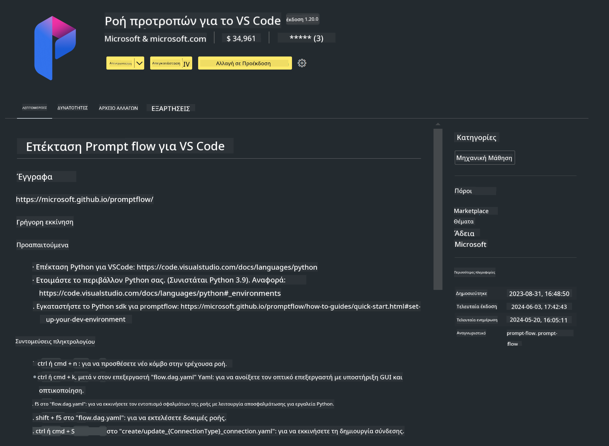

<!--
CO_OP_TRANSLATOR_METADATA:
{
  "original_hash": "4b16264917d9b93169745d92b8ce8c65",
  "translation_date": "2025-05-09T19:35:25+00:00",
  "source_file": "md/02.Application/02.Code/Phi3/VSCodeExt/HOL/Apple/01.Installations.md",
  "language_code": "el"
}
-->
# **Εργαστήριο 0 - Εγκατάσταση**

Όταν μπαίνουμε στο εργαστήριο, πρέπει να ρυθμίσουμε το κατάλληλο περιβάλλον :


### **1. Python 3.11+**

Συνιστάται η χρήση του miniforge για τη ρύθμιση του περιβάλλοντος Python

Για να ρυθμίσετε το miniforge, παρακαλώ ανατρέξτε στο [https://github.com/conda-forge/miniforge](https://github.com/conda-forge/miniforge)

Μετά τη ρύθμιση του miniforge, εκτελέστε την παρακάτω εντολή στο Power Shell

```bash

conda create -n pyenv python==3.11.8 -y

conda activate pyenv

```


### **2. Εγκατάσταση Prompt flow SDK**

Στο Εργαστήριο 1, χρησιμοποιούμε το Prompt flow, οπότε πρέπει να ρυθμίσετε το Prompt flow SDK.

```bash

pip install promptflow --upgrade

```

Μπορείτε να ελέγξετε το promptflow sdk με αυτή την εντολή


```bash

pf --version

```

### **3. Εγκατάσταση της επέκτασης Prompt flow για Visual Studio Code**



### **4. Το πλαίσιο MLX της Apple**

Το MLX είναι ένα πλαίσιο για έρευνα μηχανικής μάθησης σε Apple silicon, προσφερόμενο από την Apple machine learning research. Μπορείτε να χρησιμοποιήσετε το **Apple MLX framework** για να επιταχύνετε LLM / SLM με Apple Silicon. Αν θέλετε να μάθετε περισσότερα, μπορείτε να διαβάσετε στο [https://github.com/microsoft/PhiCookBook/blob/main/md/01.Introduction/03/MLX_Inference.md](https://github.com/microsoft/PhiCookBook/blob/main/md/01.Introduction/03/MLX_Inference.md).

Εγκαταστήστε τη βιβλιοθήκη MLX framework στο bash


```bash

pip install mlx-lm

```


### **5. Άλλες βιβλιοθήκες Python**


δημιουργήστε το requirements.txt και προσθέστε αυτό το περιεχόμενο

```txt

notebook
numpy 
scipy 
scikit-learn 
matplotlib 
pandas 
pillow 
graphviz

```


### **6. Εγκατάσταση NVM**

εγκαταστήστε το nvm στο Powershell 


```bash

brew install nvm

```

εγκαταστήστε το nodejs 18.20


```bash

nvm install 18.20.0

nvm use 18.20.0

```

### **7. Εγκατάσταση υποστήριξης ανάπτυξης Visual Studio Code**


```bash

npm install --global yo generator-code

```

Συγχαρητήρια! Έχετε ρυθμίσει επιτυχώς το SDK. Στη συνέχεια, προχωρήστε στα πρακτικά βήματα.

**Αποποίηση ευθυνών**:  
Αυτό το έγγραφο έχει μεταφραστεί χρησιμοποιώντας την υπηρεσία αυτόματης μετάφρασης AI [Co-op Translator](https://github.com/Azure/co-op-translator). Παρόλο που προσπαθούμε για ακρίβεια, παρακαλούμε να γνωρίζετε ότι οι αυτόματες μεταφράσεις ενδέχεται να περιέχουν λάθη ή ανακρίβειες. Το πρωτότυπο έγγραφο στη μητρική του γλώσσα πρέπει να θεωρείται η αυθεντική πηγή. Για κρίσιμες πληροφορίες, συνιστάται επαγγελματική μετάφραση από άνθρωπο. Δεν φέρουμε ευθύνη για τυχόν παρεξηγήσεις ή λανθασμένες ερμηνείες που προκύπτουν από τη χρήση αυτής της μετάφρασης.