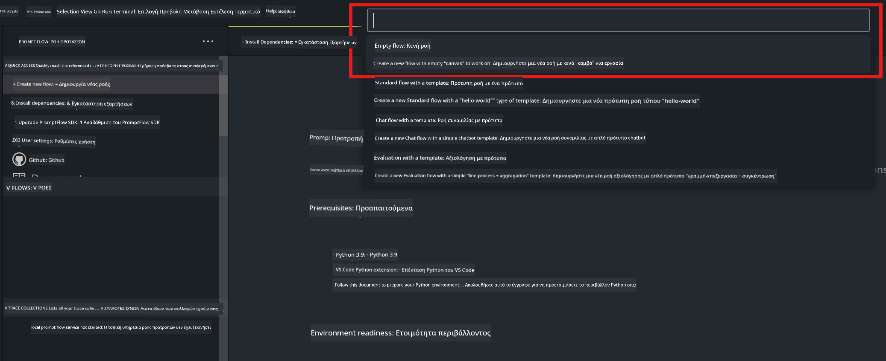
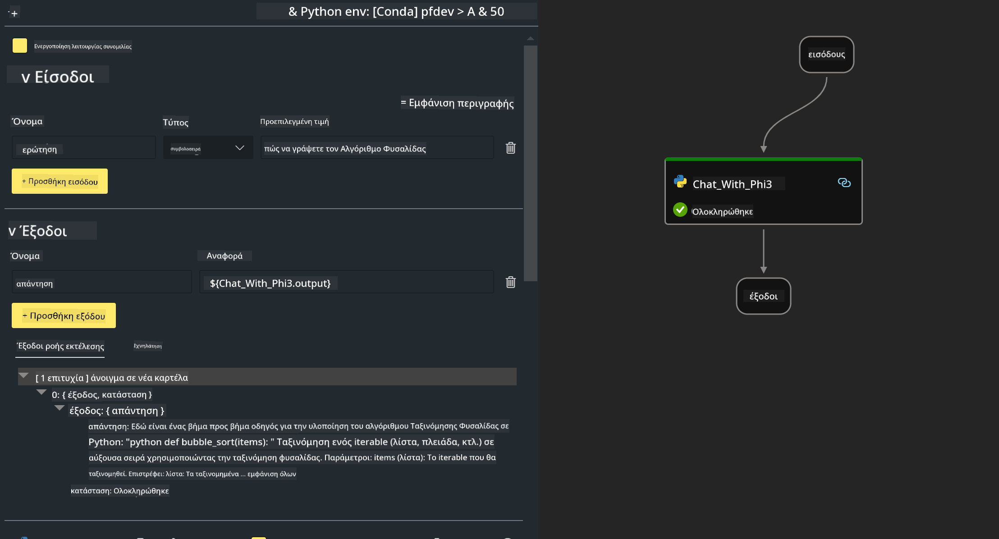

<!--
CO_OP_TRANSLATOR_METADATA:
{
  "original_hash": "3dbbf568625b1ee04b354c2dc81d3248",
  "translation_date": "2025-05-09T19:39:11+00:00",
  "source_file": "md/02.Application/02.Code/Phi3/VSCodeExt/HOL/Apple/02.PromptflowWithMLX.md",
  "language_code": "el"
}
-->
# **Εργαστήριο 2 - Εκτέλεση Prompt flow με Phi-3-mini στο AIPC**

## **Τι είναι το Prompt flow**

Το Prompt flow είναι μια σειρά εργαλείων ανάπτυξης σχεδιασμένων να απλοποιήσουν τον πλήρη κύκλο ανάπτυξης εφαρμογών AI βασισμένων σε LLM, από τη δημιουργία ιδεών, το πρωτότυπο, τις δοκιμές, την αξιολόγηση μέχρι την παραγωγική ανάπτυξη και παρακολούθηση. Κάνει την μηχανική prompt πολύ πιο εύκολη και σας επιτρέπει να δημιουργήσετε εφαρμογές LLM με ποιότητα παραγωγής.

Με το prompt flow, θα μπορείτε να:

- Δημιουργείτε ροές που συνδέουν LLMs, prompts, κώδικα Python και άλλα εργαλεία σε μια εκτελέσιμη ροή εργασίας.

- Εντοπίζετε σφάλματα και επαναλαμβάνετε τις ροές σας, ειδικά την αλληλεπίδραση με τα LLM, εύκολα.

- Αξιολογείτε τις ροές σας, υπολογίζοντας μετρικές ποιότητας και απόδοσης με μεγαλύτερα σύνολα δεδομένων.

- Ενσωματώνετε τις δοκιμές και την αξιολόγηση στο σύστημα CI/CD σας για να διασφαλίσετε την ποιότητα της ροής σας.

- Αναπτύσσετε τις ροές σας στην πλατφόρμα εξυπηρέτησης που επιλέγετε ή τις ενσωματώνετε εύκολα στον κώδικα της εφαρμογής σας.

- (Προαιρετικό αλλά ιδιαίτερα συνιστώμενο) Συνεργάζεστε με την ομάδα σας αξιοποιώντας την cloud έκδοση του Prompt flow στο Azure AI.

## **Δημιουργία ροών γεννήτριας σε Apple Silicon**

***Note*** ：Αν δεν έχετε ολοκληρώσει την εγκατάσταση του περιβάλλοντος, παρακαλώ επισκεφτείτε [Lab 0 -Installations](./01.Installations.md)

1. Ανοίξτε την επέκταση Prompt flow στο Visual Studio Code και δημιουργήστε ένα κενό project ροής



2. Προσθέστε παραμέτρους Inputs και Outputs και προσθέστε Python Code ως νέα ροή



Μπορείτε να ανατρέξετε σε αυτή τη δομή (flow.dag.yaml) για να κατασκευάσετε τη ροή σας

```yaml

inputs:
  prompt:
    type: string
    default: Write python code for Fibonacci serie. Please use markdown as output
outputs:
  result:
    type: string
    reference: ${gen_code_by_phi3.output}
nodes:
- name: gen_code_by_phi3
  type: python
  source:
    type: code
    path: gen_code_by_phi3.py
  inputs:
    prompt: ${inputs.prompt}


```

3. Ποσοτικοποίηση phi-3-mini

Στόχος μας είναι να τρέξουμε καλύτερα το SLM σε τοπικές συσκευές. Γενικά, ποσοτικοποιούμε το μοντέλο (INT4, FP16, FP32)

```bash

python -m mlx_lm.convert --hf-path microsoft/Phi-3-mini-4k-instruct

```

**Note:** ο προεπιλεγμένος φάκελος είναι mlx_model

4. Προσθέστε κώδικα στο ***Chat_With_Phi3.py***

```python


from promptflow import tool

from mlx_lm import load, generate


# The inputs section will change based on the arguments of the tool function, after you save the code
# Adding type to arguments and return value will help the system show the types properly
# Please update the function name/signature per need
@tool
def my_python_tool(prompt: str) -> str:

    model_id = './mlx_model_phi3_mini'

    model, tokenizer = load(model_id)

    # <|user|>\nWrite python code for Fibonacci serie. Please use markdown as output<|end|>\n<|assistant|>

    response = generate(model, tokenizer, prompt="<|user|>\n" + prompt  + "<|end|>\n<|assistant|>", max_tokens=2048, verbose=True)

    return response


```

4. Μπορείτε να δοκιμάσετε τη ροή από Debug ή Run για να ελέγξετε αν ο κώδικας γεννήτριας λειτουργεί σωστά


5. Τρέξτε τη ροή ως development API στο τερματικό

```

pf flow serve --source ./ --port 8080 --host localhost   

```

Μπορείτε να το δοκιμάσετε στο Postman / Thunder Client

### **Note**

1. Η πρώτη εκτέλεση διαρκεί αρκετά. Συνιστάται να κατεβάσετε το μοντέλο phi-3 από το Hugging face CLI.

2. Λαμβάνοντας υπόψη τη περιορισμένη υπολογιστική ισχύ του Intel NPU, προτείνεται η χρήση του Phi-3-mini-4k-instruct

3. Χρησιμοποιούμε την επιτάχυνση Intel NPU για ποσοτικοποίηση σε INT4, αλλά αν ξανατρέξετε την υπηρεσία, πρέπει να διαγράψετε τους φακέλους cache και nc_workshop.

## **Πόροι**

1. Μάθετε για το Promptflow [https://microsoft.github.io/promptflow/](https://microsoft.github.io/promptflow/)

2. Μάθετε για την επιτάχυνση Intel NPU [https://github.com/intel/intel-npu-acceleration-library](https://github.com/intel/intel-npu-acceleration-library)

3. Παράδειγμα κώδικα, κατεβάστε [Local NPU Agent Sample Code](../../../../../../../../../code/07.Lab/01/AIPC/local-npu-agent)

**Αποποίηση Ευθυνών**:  
Αυτό το έγγραφο έχει μεταφραστεί χρησιμοποιώντας την υπηρεσία μετάφρασης με τεχνητή νοημοσύνη [Co-op Translator](https://github.com/Azure/co-op-translator). Παρόλο που προσπαθούμε για ακρίβεια, παρακαλούμε να έχετε υπόψη ότι οι αυτόματες μεταφράσεις μπορεί να περιέχουν λάθη ή ανακρίβειες. Το πρωτότυπο έγγραφο στη μητρική του γλώσσα πρέπει να θεωρείται η αυθεντική πηγή. Για κρίσιμες πληροφορίες, συνιστάται η επαγγελματική ανθρώπινη μετάφραση. Δεν φέρουμε ευθύνη για τυχόν παρεξηγήσεις ή λανθασμένες ερμηνείες που προκύπτουν από τη χρήση αυτής της μετάφρασης.