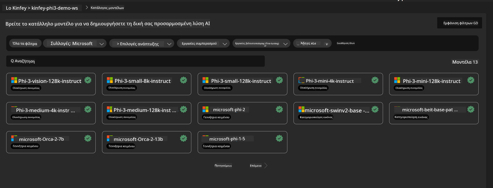
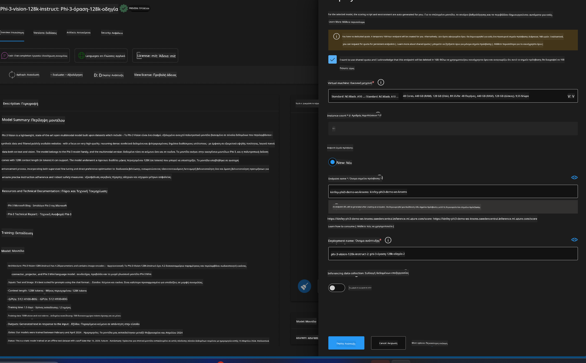
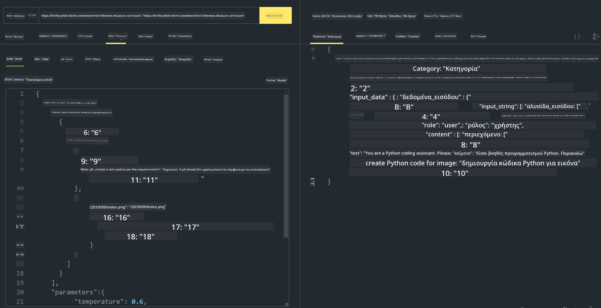

<!--
CO_OP_TRANSLATOR_METADATA:
{
  "original_hash": "20cb4e6ac1686248e8be913ccf6c2bc2",
  "translation_date": "2025-05-09T19:43:28+00:00",
  "source_file": "md/02.Application/02.Code/Phi3/VSCodeExt/HOL/Apple/03.DeployPhi3VisionOnAzure.md",
  "language_code": "el"
}
-->
# **Εργαστήριο 3 - Ανάπτυξη Phi-3-vision στην Υπηρεσία Azure Machine Learning**

Χρησιμοποιούμε NPU για να ολοκληρώσουμε την παραγωγική ανάπτυξη του τοπικού κώδικα, και στη συνέχεια θέλουμε να εισαγάγουμε τη δυνατότητα χρήσης του PHI-3-VISION μέσω αυτού, ώστε να μετατρέπουμε εικόνες σε κώδικα.

Σε αυτή την εισαγωγή, μπορούμε γρήγορα να δημιουργήσουμε μια υπηρεσία Model As Service Phi-3 Vision στην Υπηρεσία Azure Machine Learning.

***Note***： Το Phi-3 Vision απαιτεί υπολογιστική ισχύ για να παράγει περιεχόμενο πιο γρήγορα. Χρειαζόμαστε υπολογιστική ισχύ στο cloud για να το πετύχουμε.


### **1. Δημιουργία Υπηρεσίας Azure Machine Learning**

Πρέπει να δημιουργήσουμε μια Υπηρεσία Azure Machine Learning στο Azure Portal. Αν θέλετε να μάθετε πώς, επισκεφθείτε αυτόν τον σύνδεσμο [https://learn.microsoft.com/azure/machine-learning/quickstart-create-resources?view=azureml-api-2](https://learn.microsoft.com/azure/machine-learning/quickstart-create-resources?view=azureml-api-2)


### **2. Επιλογή Phi-3 Vision στην Υπηρεσία Azure Machine Learning**




### **3. Ανάπτυξη Phi-3-Vision στο Azure**





### **4. Δοκιμή Endpoint στο Postman**





***Note***

1. Τα παραμετρικά δεδομένα που θα σταλούν πρέπει να περιλαμβάνουν Authorization, azureml-model-deployment, και Content-Type. Πρέπει να ελέγξετε τις πληροφορίες ανάπτυξης για να τα λάβετε.

2. Για να μεταδώσετε παραμέτρους, το Phi-3-Vision χρειάζεται να στείλει έναν σύνδεσμο εικόνας. Ανατρέξτε στη μέθοδο GPT-4-Vision για την αποστολή παραμέτρων, όπως

```json

{
  "input_data":{
    "input_string":[
      {
        "role":"user",
        "content":[ 
          {
            "type": "text",
            "text": "You are a Python coding assistant.Please create Python code for image "
          },
          {
              "type": "image_url",
              "image_url": {
                "url": "https://ajaytech.co/wp-content/uploads/2019/09/index.png"
              }
          }
        ]
      }
    ],
    "parameters":{
          "temperature": 0.6,
          "top_p": 0.9,
          "do_sample": false,
          "max_new_tokens": 2048
    }
  }
}

```

3. Κάντε κλήση στο **/score** χρησιμοποιώντας τη μέθοδο Post

**Συγχαρητήρια**! Ολοκληρώσατε γρήγορα την ανάπτυξη PHI-3-VISION και δοκιμάσατε πώς να μετατρέπετε εικόνες σε κώδικα. Στη συνέχεια, μπορούμε να δημιουργήσουμε εφαρμογές σε συνδυασμό με NPUs και cloud.

**Αποποίηση ευθυνών**:  
Αυτό το έγγραφο έχει μεταφραστεί χρησιμοποιώντας την υπηρεσία αυτόματης μετάφρασης AI [Co-op Translator](https://github.com/Azure/co-op-translator). Παρόλο που προσπαθούμε για ακρίβεια, παρακαλούμε να έχετε υπόψη ότι οι αυτόματες μεταφράσεις μπορεί να περιέχουν λάθη ή ανακρίβειες. Το πρωτότυπο έγγραφο στη μητρική του γλώσσα πρέπει να θεωρείται η επίσημη πηγή. Για κρίσιμες πληροφορίες, συνιστάται η επαγγελματική ανθρώπινη μετάφραση. Δεν φέρουμε ευθύνη για τυχόν παρεξηγήσεις ή λανθασμένες ερμηνείες που προκύπτουν από τη χρήση αυτής της μετάφρασης.