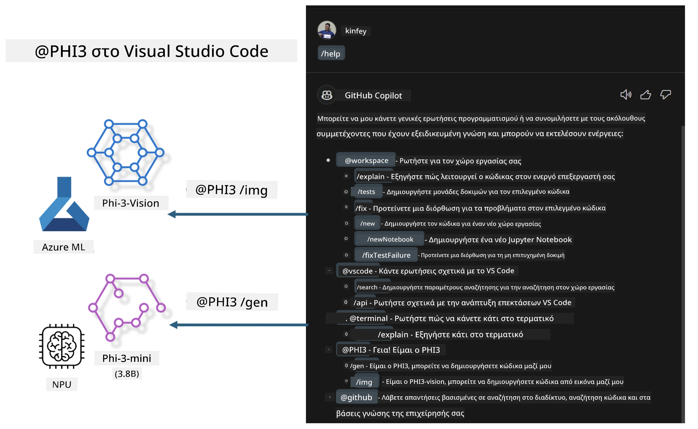

<!--
CO_OP_TRANSLATOR_METADATA:
{
  "original_hash": "00b7a699de8ac405fa821f4c0f7fc0ab",
  "translation_date": "2025-07-17T03:39:23+00:00",
  "source_file": "md/02.Application/02.Code/Phi3/VSCodeExt/README.md",
  "language_code": "el"
}
-->
# **Δημιουργήστε το δικό σας Visual Studio Code GitHub Copilot Chat με την οικογένεια Microsoft Phi-3**

Έχετε χρησιμοποιήσει τον agent του workspace στο GitHub Copilot Chat; Θέλετε να φτιάξετε τον δικό σας agent κώδικα για την ομάδα σας; Αυτό το πρακτικό εργαστήριο στοχεύει να συνδυάσει το open source μοντέλο για να δημιουργήσει έναν επιχειρησιακό agent κώδικα σε επίπεδο επιχείρησης.

## **Βάση**

### **Γιατί να επιλέξετε το Microsoft Phi-3**

Η σειρά Phi-3 περιλαμβάνει τα phi-3-mini, phi-3-small και phi-3-medium, βασισμένα σε διαφορετικές παραμέτρους εκπαίδευσης για δημιουργία κειμένου, ολοκλήρωση διαλόγου και δημιουργία κώδικα. Υπάρχει επίσης το phi-3-vision βασισμένο στο Vision. Είναι κατάλληλο για επιχειρήσεις ή διαφορετικές ομάδες που θέλουν να δημιουργήσουν offline λύσεις γεννητικής AI.

Συνιστάται να διαβάσετε αυτόν τον σύνδεσμο [https://github.com/microsoft/PhiCookBook/blob/main/md/01.Introduction/01/01.PhiFamily.md](https://github.com/microsoft/PhiCookBook/blob/main/md/01.Introduction/01/01.PhiFamily.md)

### **Microsoft GitHub Copilot Chat**

Η επέκταση GitHub Copilot Chat σας παρέχει μια διεπαφή συνομιλίας που σας επιτρέπει να αλληλεπιδράτε με το GitHub Copilot και να λαμβάνετε απαντήσεις σε ερωτήσεις σχετικές με τον κώδικα απευθείας μέσα στο VS Code, χωρίς να χρειάζεται να περιηγηθείτε σε τεκμηρίωση ή να ψάξετε σε διαδικτυακά φόρουμ.

Το Copilot Chat μπορεί να χρησιμοποιεί επισήμανση σύνταξης, εσοχές και άλλες μορφοποιήσεις για να κάνει πιο κατανοητή την απάντηση που παράγεται. Ανάλογα με τον τύπο της ερώτησης του χρήστη, το αποτέλεσμα μπορεί να περιλαμβάνει συνδέσμους σε περιεχόμενο που χρησιμοποίησε το Copilot για να δημιουργήσει την απάντηση, όπως αρχεία πηγαίου κώδικα ή τεκμηρίωση, ή κουμπιά για πρόσβαση σε λειτουργίες του VS Code.

- Το Copilot Chat ενσωματώνεται στη ροή εργασίας του προγραμματιστή και σας παρέχει βοήθεια όπου τη χρειάζεστε:

- Ξεκινήστε μια συνομιλία inline απευθείας από τον επεξεργαστή ή το τερματικό για βοήθεια ενώ γράφετε κώδικα

- Χρησιμοποιήστε την προβολή Chat για να έχετε έναν AI βοηθό στο πλάι που να σας βοηθά οποιαδήποτε στιγμή

- Εκκινήστε το Quick Chat για να κάνετε μια γρήγορη ερώτηση και να επιστρέψετε στη δουλειά σας

Μπορείτε να χρησιμοποιήσετε το GitHub Copilot Chat σε διάφορα σενάρια, όπως:

- Απαντήσεις σε ερωτήσεις προγραμματισμού για τον καλύτερο τρόπο επίλυσης ενός προβλήματος

- Επεξήγηση κώδικα άλλου και προτάσεις βελτιώσεων

- Προτάσεις διορθώσεων κώδικα

- Δημιουργία unit test περιπτώσεων

- Δημιουργία τεκμηρίωσης κώδικα

Συνιστάται να διαβάσετε αυτόν τον σύνδεσμο [https://code.visualstudio.com/docs/copilot/copilot-chat](https://code.visualstudio.com/docs/copilot/copilot-chat?WT.mc_id=aiml-137032-kinfeylo)

###  **Microsoft GitHub Copilot Chat @workspace**

Η αναφορά στο **@workspace** στο Copilot Chat σας επιτρέπει να κάνετε ερωτήσεις για ολόκληρη τη βάση κώδικά σας. Βάσει της ερώτησης, το Copilot ανακτά έξυπνα σχετικά αρχεία και σύμβολα, τα οποία στη συνέχεια αναφέρει στην απάντησή του ως συνδέσμους και παραδείγματα κώδικα.

Για να απαντήσει στην ερώτησή σας, το **@workspace** ψάχνει μέσα στις ίδιες πηγές που θα χρησιμοποιούσε ένας προγραμματιστής όταν περιηγείται σε μια βάση κώδικα στο VS Code:

- Όλα τα αρχεία στο workspace, εκτός από αυτά που αγνοούνται από ένα αρχείο .gitignore

- Η δομή των φακέλων με τους υποφακέλους και τα ονόματα αρχείων

- Ο δείκτης αναζήτησης κώδικα του GitHub, αν το workspace είναι αποθετήριο GitHub και έχει ευρετηριαστεί από την αναζήτηση κώδικα

- Σύμβολα και ορισμοί στο workspace

- Το κείμενο που είναι επιλεγμένο ή ορατό στον ενεργό επεξεργαστή

Σημείωση: Το .gitignore παρακάμπτεται αν έχετε ανοιχτό αρχείο ή έχετε επιλεγμένο κείμενο μέσα σε αρχείο που κανονικά αγνοείται.

Συνιστάται να διαβάσετε αυτόν τον σύνδεσμο [[https://code.visualstudio.com/docs/copilot/copilot-chat](https://code.visualstudio.com/docs/copilot/workspace-context?WT.mc_id=aiml-137032-kinfeylo)]

## **Μάθετε περισσότερα για αυτό το εργαστήριο**

Το GitHub Copilot έχει βελτιώσει σημαντικά την αποδοτικότητα προγραμματισμού των επιχειρήσεων, και κάθε επιχείρηση επιθυμεί να προσαρμόσει τις σχετικές λειτουργίες του GitHub Copilot. Πολλές επιχειρήσεις έχουν προσαρμόσει επεκτάσεις παρόμοιες με το GitHub Copilot βασισμένες στα δικά τους επιχειρησιακά σενάρια και open source μοντέλα. Για τις επιχειρήσεις, οι προσαρμοσμένες επεκτάσεις είναι πιο εύκολες στον έλεγχο, αλλά αυτό επηρεάζει και την εμπειρία χρήστη. Μετά από όλα, το GitHub Copilot έχει ισχυρότερες λειτουργίες στην αντιμετώπιση γενικών σεναρίων και επαγγελματισμού. Αν η εμπειρία μπορεί να παραμείνει συνεπής, είναι καλύτερο να προσαρμοστεί η δική της επέκταση της επιχείρησης. Το GitHub Copilot Chat παρέχει σχετικές APIs για τις επιχειρήσεις ώστε να επεκτείνουν την εμπειρία συνομιλίας. Η διατήρηση μιας συνεπούς εμπειρίας και η ύπαρξη προσαρμοσμένων λειτουργιών προσφέρει καλύτερη εμπειρία χρήστη.

Αυτό το εργαστήριο χρησιμοποιεί κυρίως το μοντέλο Phi-3 σε συνδυασμό με το τοπικό NPU και το υβριδικό Azure για να δημιουργήσει έναν προσαρμοσμένο Agent στο GitHub Copilot Chat ***@PHI3*** για να βοηθά τους προγραμματιστές επιχειρήσεων στην ολοκλήρωση δημιουργίας κώδικα ***(@PHI3 /gen)*** και στη δημιουργία κώδικα βασισμένου σε εικόνες ***(@PHI3 /img)***.

### ***Σημείωση:*** 

Αυτό το εργαστήριο υλοποιείται αυτή τη στιγμή στο AIPC των Intel CPU και Apple Silicon. Θα συνεχίσουμε να ενημερώνουμε την έκδοση Qualcomm του NPU.

## **Εργαστήριο**

| Όνομα | Περιγραφή | AIPC | Apple |
| ------------ | ----------- | -------- |-------- |
| Lab0 - Εγκαταστάσεις(✅) | Διαμόρφωση και εγκατάσταση σχετικών περιβαλλόντων και εργαλείων εγκατάστασης | [Go](./HOL/AIPC/01.Installations.md) |[Go](./HOL/Apple/01.Installations.md) |
| Lab1 - Εκτέλεση Prompt flow με Phi-3-mini (✅) | Σε συνδυασμό με AIPC / Apple Silicon, χρήση τοπικού NPU για δημιουργία κώδικα μέσω Phi-3-mini | [Go](./HOL/AIPC/02.PromptflowWithNPU.md) |  [Go](./HOL/Apple/02.PromptflowWithMLX.md) |
| Lab2 - Ανάπτυξη Phi-3-vision στο Azure Machine Learning Service(✅) | Δημιουργία κώδικα με ανάπτυξη του Azure Machine Learning Service's Model Catalog - εικόνα Phi-3-vision | [Go](./HOL/AIPC/03.DeployPhi3VisionOnAzure.md) |[Go](./HOL/Apple/03.DeployPhi3VisionOnAzure.md) |
| Lab3 - Δημιουργία agent @phi-3 στο GitHub Copilot Chat(✅)  | Δημιουργία προσαρμοσμένου agent Phi-3 στο GitHub Copilot Chat για ολοκλήρωση δημιουργίας κώδικα, δημιουργία κώδικα γραφημάτων, RAG κ.ά. | [Go](./HOL/AIPC/04.CreatePhi3AgentInVSCode.md) | [Go](./HOL/Apple/04.CreatePhi3AgentInVSCode.md) |
| Δείγμα Κώδικα (✅)  | Κατέβασμα δείγματος κώδικα | [Go](../../../../../../../code/07.Lab/01/AIPC) | [Go](../../../../../../../code/07.Lab/01/Apple) |

## **Πόροι**

1. Phi-3 Cookbook [https://github.com/microsoft/Phi-3CookBook](https://github.com/microsoft/Phi-3CookBook)

2. Μάθετε περισσότερα για το GitHub Copilot [https://learn.microsoft.com/training/paths/copilot/](https://learn.microsoft.com/training/paths/copilot/?WT.mc_id=aiml-137032-kinfeylo)

3. Μάθετε περισσότερα για το GitHub Copilot Chat [https://learn.microsoft.com/training/paths/accelerate-app-development-using-github-copilot/](https://learn.microsoft.com/training/paths/accelerate-app-development-using-github-copilot/?WT.mc_id=aiml-137032-kinfeylo)

4. Μάθετε περισσότερα για το GitHub Copilot Chat API [https://code.visualstudio.com/api/extension-guides/chat](https://code.visualstudio.com/api/extension-guides/chat?WT.mc_id=aiml-137032-kinfeylo)

5. Μάθετε περισσότερα για το Azure AI Foundry [https://learn.microsoft.com/training/paths/create-custom-copilots-ai-studio/](https://learn.microsoft.com/training/paths/create-custom-copilots-ai-studio/?WT.mc_id=aiml-137032-kinfeylo)

6. Μάθετε περισσότερα για το Model Catalog του Azure AI Foundry [https://learn.microsoft.com/azure/ai-studio/how-to/model-catalog-overview](https://learn.microsoft.com/azure/ai-studio/how-to/model-catalog-overview)

**Αποποίηση ευθυνών**:  
Αυτό το έγγραφο έχει μεταφραστεί χρησιμοποιώντας την υπηρεσία αυτόματης μετάφρασης AI [Co-op Translator](https://github.com/Azure/co-op-translator). Παρόλο που επιδιώκουμε την ακρίβεια, παρακαλούμε να έχετε υπόψη ότι οι αυτόματες μεταφράσεις ενδέχεται να περιέχουν λάθη ή ανακρίβειες. Το πρωτότυπο έγγραφο στη γλώσσα του θεωρείται η αυθεντική πηγή. Για κρίσιμες πληροφορίες, συνιστάται επαγγελματική ανθρώπινη μετάφραση. Δεν φέρουμε ευθύνη για τυχόν παρεξηγήσεις ή λανθασμένες ερμηνείες που προκύπτουν από τη χρήση αυτής της μετάφρασης.