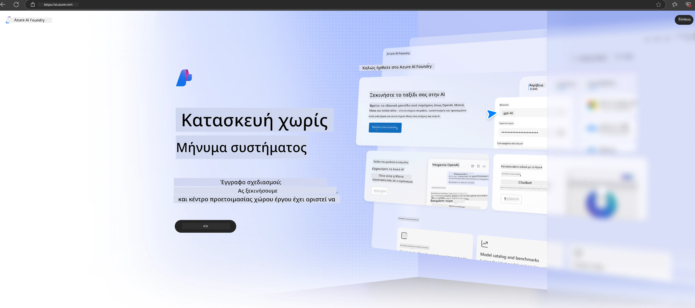

<!--
CO_OP_TRANSLATOR_METADATA:
{
  "original_hash": "3a1e48b628022485aac989c9f733e792",
  "translation_date": "2025-07-17T05:23:49+00:00",
  "source_file": "md/02.QuickStart/AzureAIFoundry_QuickStart.md",
  "language_code": "el"
}
-->
# **Χρήση του Phi-3 στο Azure AI Foundry**

Με την ανάπτυξη της Γενετικής Τεχνητής Νοημοσύνης, ελπίζουμε να χρησιμοποιήσουμε μια ενιαία πλατφόρμα για τη διαχείριση διαφορετικών LLM και SLM, την ενσωμάτωση επιχειρησιακών δεδομένων, τις λειτουργίες fine-tuning/RAG και την αξιολόγηση διαφόρων επιχειρηματικών μονάδων μετά την ενσωμάτωση LLM και SLM, κ.ά., ώστε οι έξυπνες εφαρμογές γενετικής AI να υλοποιούνται καλύτερα. Το [Azure AI Foundry](https://ai.azure.com) είναι μια πλατφόρμα εφαρμογών γενετικής AI σε επίπεδο επιχείρησης.

Με το Azure AI Foundry, μπορείτε να αξιολογήσετε τις απαντήσεις μεγάλων γλωσσικών μοντέλων (LLM) και να οργανώσετε τα συστατικά εφαρμογής prompt με το prompt flow για καλύτερη απόδοση. Η πλατφόρμα διευκολύνει την κλιμάκωση για τη μετατροπή αποδείξεων εννοιών σε πλήρη παραγωγή με ευκολία. Η συνεχής παρακολούθηση και βελτίωση υποστηρίζουν τη μακροπρόθεσμη επιτυχία.

Μπορούμε να αναπτύξουμε γρήγορα το μοντέλο Phi-3 στο Azure AI Foundry μέσα από απλά βήματα και στη συνέχεια να χρησιμοποιήσουμε το Azure AI Foundry για να ολοκληρώσουμε το Playground/Chat, το Fine-tuning, την αξιολόγηση και άλλες σχετικές εργασίες του Phi-3.

## **1. Προετοιμασία**

Αν έχετε ήδη εγκαταστήσει το [Azure Developer CLI](https://learn.microsoft.com/azure/developer/azure-developer-cli/overview?WT.mc_id=aiml-138114-kinfeylo) στον υπολογιστή σας, η χρήση αυτού του προτύπου είναι τόσο απλή όσο η εκτέλεση αυτής της εντολής σε έναν νέο φάκελο.

## Δημιουργία με το χέρι

Η δημιουργία ενός έργου και hub στο Microsoft Azure AI Foundry είναι ένας εξαιρετικός τρόπος να οργανώσετε και να διαχειριστείτε τη δουλειά σας στην AI. Ακολουθεί ένας οδηγός βήμα προς βήμα για να ξεκινήσετε:

### Δημιουργία έργου στο Azure AI Foundry

1. **Μεταβείτε στο Azure AI Foundry**: Συνδεθείτε στην πύλη του Azure AI Foundry.
2. **Δημιουργία έργου**:
   - Αν βρίσκεστε ήδη σε ένα έργο, επιλέξτε "Azure AI Foundry" πάνω αριστερά για να μεταβείτε στην Αρχική σελίδα.
   - Επιλέξτε "+ Create project".
   - Εισάγετε ένα όνομα για το έργο.
   - Αν έχετε ήδη ένα hub, θα επιλεγεί αυτόματα. Αν έχετε πρόσβαση σε περισσότερα από ένα hubs, μπορείτε να επιλέξετε διαφορετικό από το αναπτυσσόμενο μενού. Αν θέλετε να δημιουργήσετε νέο hub, επιλέξτε "Create new hub" και δώστε ένα όνομα.
   - Επιλέξτε "Create".

### Δημιουργία hub στο Azure AI Foundry

1. **Μεταβείτε στο Azure AI Foundry**: Συνδεθείτε με τον λογαριασμό σας Azure.
2. **Δημιουργία hub**:
   - Επιλέξτε το Κέντρο Διαχείρισης από το αριστερό μενού.
   - Επιλέξτε "All resources", μετά το βελάκι δίπλα στο "+ New project" και επιλέξτε "+ New hub".
   - Στο παράθυρο "Create a new hub", εισάγετε ένα όνομα για το hub σας (π.χ. contoso-hub) και τροποποιήστε τα υπόλοιπα πεδία όπως επιθυμείτε.
   - Επιλέξτε "Next", ελέγξτε τις πληροφορίες και στη συνέχεια επιλέξτε "Create".

Για πιο αναλυτικές οδηγίες, μπορείτε να ανατρέξετε στην επίσημη [τεκμηρίωση της Microsoft](https://learn.microsoft.com/azure/ai-studio/how-to/create-projects).

Μετά την επιτυχή δημιουργία, μπορείτε να αποκτήσετε πρόσβαση στο studio που δημιουργήσατε μέσω του [ai.azure.com](https://ai.azure.com/)

Μπορεί να υπάρχουν πολλαπλά έργα σε ένα AI Foundry. Δημιουργήστε ένα έργο στο AI Foundry για να προετοιμαστείτε.

Δημιουργήστε Azure AI Foundry [QuickStarts](https://learn.microsoft.com/azure/ai-studio/quickstarts/get-started-code)

## **2. Ανάπτυξη μοντέλου Phi στο Azure AI Foundry**

Κάντε κλικ στην επιλογή Explore του έργου για να μπείτε στον Κατάλογο Μοντέλων και επιλέξτε Phi-3

Επιλέξτε Phi-3-mini-4k-instruct

Κάντε κλικ στο 'Deploy' για να αναπτύξετε το μοντέλο Phi-3-mini-4k-instruct

> [!NOTE]
>
> Μπορείτε να επιλέξετε τη δύναμη υπολογισμού κατά την ανάπτυξη

## **3. Playground Chat Phi στο Azure AI Foundry**

Μεταβείτε στη σελίδα ανάπτυξης, επιλέξτε Playground και συνομιλήστε με το Phi-3 του Azure AI Foundry

## **4. Ανάπτυξη μοντέλου από το Azure AI Foundry**

Για να αναπτύξετε ένα μοντέλο από τον Κατάλογο Μοντέλων του Azure, μπορείτε να ακολουθήσετε τα εξής βήματα:

- Συνδεθείτε στο Azure AI Foundry.
- Επιλέξτε το μοντέλο που θέλετε να αναπτύξετε από τον κατάλογο μοντέλων του Azure AI Foundry.
- Στη σελίδα Λεπτομερειών του μοντέλου, επιλέξτε Deploy και μετά επιλέξτε Serverless API με Azure AI Content Safety.
- Επιλέξτε το έργο στο οποίο θέλετε να αναπτύξετε τα μοντέλα σας. Για να χρησιμοποιήσετε την προσφορά Serverless API, ο χώρος εργασίας σας πρέπει να ανήκει στην περιοχή East US 2 ή Sweden Central. Μπορείτε να προσαρμόσετε το όνομα της Ανάπτυξης.
- Στον οδηγό ανάπτυξης, επιλέξτε την Τιμολόγηση και τους όρους για να ενημερωθείτε σχετικά με την τιμολόγηση και τους όρους χρήσης.
- Επιλέξτε Deploy. Περιμένετε μέχρι να ολοκληρωθεί η ανάπτυξη και να μεταφερθείτε στη σελίδα Deployments.
- Επιλέξτε Open in playground για να ξεκινήσετε την αλληλεπίδραση με το μοντέλο.
- Μπορείτε να επιστρέψετε στη σελίδα Deployments, να επιλέξετε την ανάπτυξη και να σημειώσετε το Target URL του endpoint και το Secret Key, τα οποία μπορείτε να χρησιμοποιήσετε για να καλέσετε την ανάπτυξη και να δημιουργήσετε απαντήσεις.
- Μπορείτε πάντα να βρείτε τις λεπτομέρειες του endpoint, το URL και τα κλειδιά πρόσβασης πηγαίνοντας στην καρτέλα Build και επιλέγοντας Deployments από την ενότητα Components.

> [!NOTE]
> Παρακαλώ σημειώστε ότι ο λογαριασμός σας πρέπει να έχει τα δικαιώματα ρόλου Azure AI Developer στο Resource Group για να εκτελέσετε αυτά τα βήματα.

## **5. Χρήση του Phi API στο Azure AI Foundry**

Μπορείτε να αποκτήσετε πρόσβαση στο https://{Your project name}.region.inference.ml.azure.com/swagger.json μέσω Postman με μέθοδο GET και να το συνδυάσετε με το Key για να μάθετε τις διαθέσιμες διεπαφές.

Μπορείτε να λάβετε πολύ εύκολα τις παραμέτρους αιτήματος, καθώς και τις παραμέτρους απόκρισης.

**Αποποίηση ευθυνών**:  
Αυτό το έγγραφο έχει μεταφραστεί χρησιμοποιώντας την υπηρεσία αυτόματης μετάφρασης AI [Co-op Translator](https://github.com/Azure/co-op-translator). Παρόλο που επιδιώκουμε την ακρίβεια, παρακαλούμε να γνωρίζετε ότι οι αυτόματες μεταφράσεις ενδέχεται να περιέχουν λάθη ή ανακρίβειες. Το πρωτότυπο έγγραφο στη μητρική του γλώσσα πρέπει να θεωρείται η αυθεντική πηγή. Για κρίσιμες πληροφορίες, συνιστάται επαγγελματική ανθρώπινη μετάφραση. Δεν φέρουμε ευθύνη για τυχόν παρεξηγήσεις ή λανθασμένες ερμηνείες που προκύπτουν από τη χρήση αυτής της μετάφρασης.