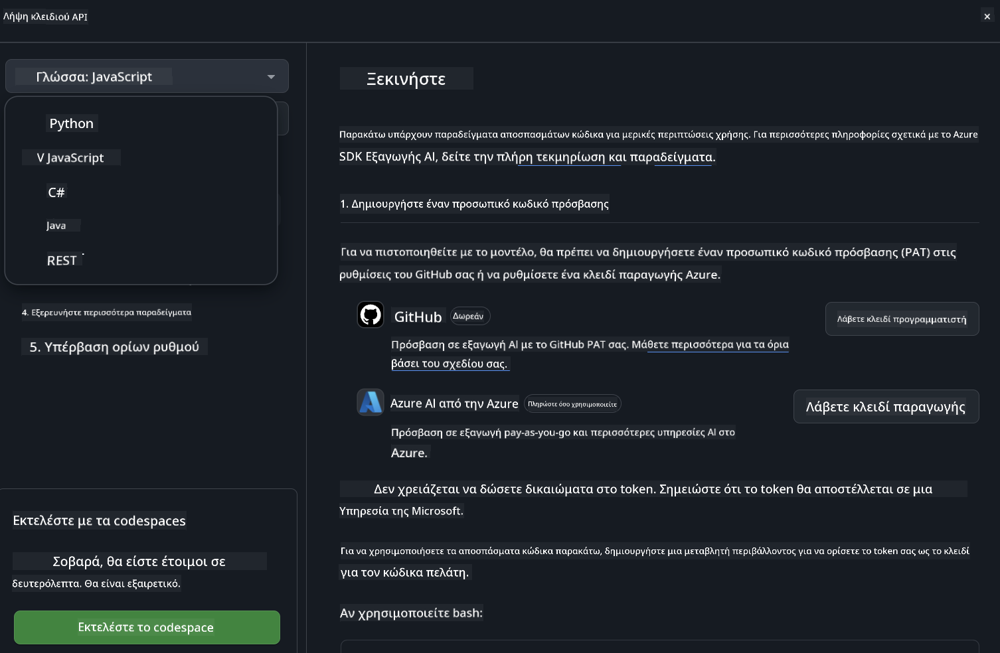
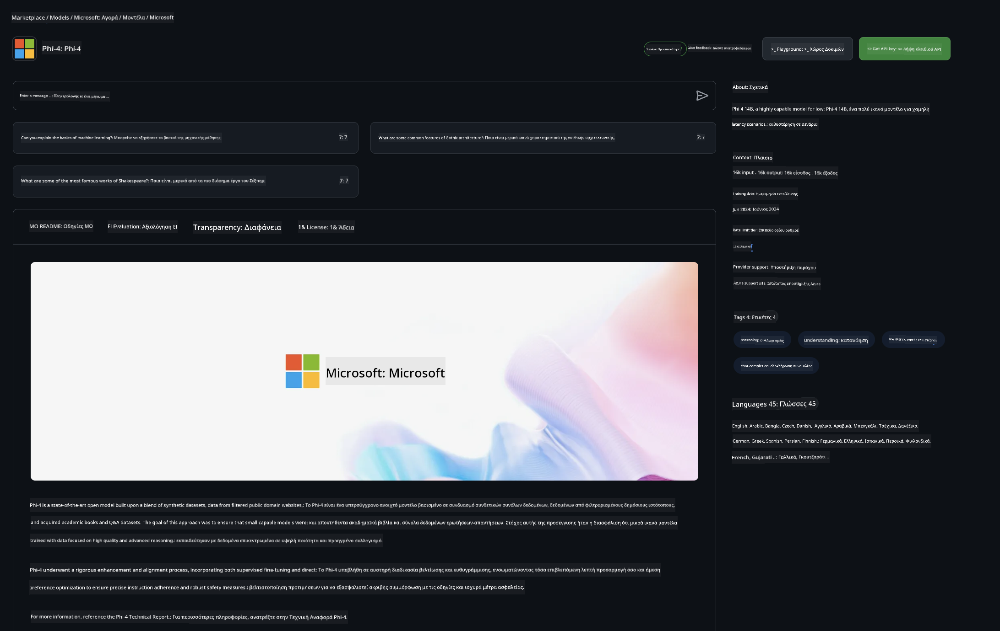

<!--
CO_OP_TRANSLATOR_METADATA:
{
  "original_hash": "5113634b77370af6790f9697d5d7de90",
  "translation_date": "2025-05-09T20:17:59+00:00",
  "source_file": "md/02.QuickStart/GitHubModel_QuickStart.md",
  "language_code": "el"
}
-->
## GitHub Models - Περιορισμένη Δημόσια Beta

Καλώς ήρθατε στα [GitHub Models](https://github.com/marketplace/models)! Έχουμε όλα έτοιμα για να εξερευνήσετε τα AI Models που φιλοξενούνται στο Azure AI.


Για περισσότερες πληροφορίες σχετικά με τα Models που είναι διαθέσιμα στα GitHub Models, δείτε το [GitHub Model Marketplace](https://github.com/marketplace/models)

## Διαθέσιμα Μοντέλα

Κάθε μοντέλο έχει το δικό του περιβάλλον δοκιμών και δείγματα κώδικα


### Phi-3 Μοντέλα στο GitHub Model Catalog

[Phi-3-Medium-128k-Instruct](https://github.com/marketplace/models/azureml/Phi-3-medium-128k-instruct)

[Phi-3-medium-4k-instruct](https://github.com/marketplace/models/azureml/Phi-3-medium-4k-instruct)

[Phi-3-mini-128k-instruct](https://github.com/marketplace/models/azureml/Phi-3-mini-128k-instruct)

[Phi-3-mini-4k-instruct](https://github.com/marketplace/models/azureml/Phi-3-mini-4k-instruct)

[Phi-3-small-128k-instruct](https://github.com/marketplace/models/azureml/Phi-3-small-128k-instruct)

[Phi-3-small-8k-instruct](https://github.com/marketplace/models/azureml/Phi-3-small-8k-instruct)

## Ξεκινώντας

Υπάρχουν μερικά βασικά παραδείγματα έτοιμα για εκτέλεση. Μπορείτε να τα βρείτε στον φάκελο samples. Αν θέλετε να πάτε κατευθείαν στη γλώσσα που προτιμάτε, τα παραδείγματα είναι διαθέσιμα στις εξής γλώσσες:

- Python
- JavaScript
- cURL

Υπάρχει επίσης ένα ειδικό περιβάλλον Codespaces για να τρέξετε τα δείγματα και τα μοντέλα.



## Δείγματα Κώδικα

Παρακάτω θα βρείτε αποσπάσματα κώδικα για μερικές περιπτώσεις χρήσης. Για περισσότερες πληροφορίες σχετικά με το Azure AI Inference SDK, δείτε την πλήρη τεκμηρίωση και τα δείγματα.

## Ρύθμιση

1. Δημιουργήστε ένα προσωπικό access token  
Δεν χρειάζεται να δώσετε δικαιώματα στο token. Σημειώστε ότι το token θα αποσταλεί σε υπηρεσία της Microsoft.

Για να χρησιμοποιήσετε τα παρακάτω αποσπάσματα κώδικα, δημιουργήστε μια μεταβλητή περιβάλλοντος όπου θα αποθηκεύσετε το token σας ως κλειδί για τον client κώδικα.

Αν χρησιμοποιείτε bash:  
```
export GITHUB_TOKEN="<your-github-token-goes-here>"
```  
Αν είστε σε powershell:  

```
$Env:GITHUB_TOKEN="<your-github-token-goes-here>"
```  

Αν χρησιμοποιείτε Windows command prompt:  

```
set GITHUB_TOKEN=<your-github-token-goes-here>
```  

## Παράδειγμα σε Python

### Εγκατάσταση εξαρτημάτων  
Εγκαταστήστε το Azure AI Inference SDK με pip (Απαιτείται: Python >=3.8):

```
pip install azure-ai-inference
```  
### Εκτέλεση βασικού δείγματος κώδικα

Αυτό το παράδειγμα δείχνει μια βασική κλήση στο chat completion API. Χρησιμοποιεί το GitHub AI model inference endpoint και το GitHub token σας. Η κλήση είναι συγχρονισμένη.

```
import os
from azure.ai.inference import ChatCompletionsClient
from azure.ai.inference.models import SystemMessage, UserMessage
from azure.core.credentials import AzureKeyCredential

endpoint = "https://models.inference.ai.azure.com"
# Replace Model_Name 
model_name = "Phi-3-small-8k-instruct"
token = os.environ["GITHUB_TOKEN"]

client = ChatCompletionsClient(
    endpoint=endpoint,
    credential=AzureKeyCredential(token),
)

response = client.complete(
    messages=[
        SystemMessage(content="You are a helpful assistant."),
        UserMessage(content="What is the capital of France?"),
    ],
    model=model_name,
    temperature=1.,
    max_tokens=1000,
    top_p=1.
)

print(response.choices[0].message.content)
```

### Εκτέλεση συνομιλίας πολλαπλών γύρων

Αυτό το παράδειγμα δείχνει μια συνομιλία πολλαπλών γύρων με το chat completion API. Όταν χρησιμοποιείτε το μοντέλο για μια εφαρμογή συνομιλίας, πρέπει να διαχειρίζεστε το ιστορικό της συνομιλίας και να στέλνετε τα πιο πρόσφατα μηνύματα στο μοντέλο.

```
import os
from azure.ai.inference import ChatCompletionsClient
from azure.ai.inference.models import AssistantMessage, SystemMessage, UserMessage
from azure.core.credentials import AzureKeyCredential

token = os.environ["GITHUB_TOKEN"]
endpoint = "https://models.inference.ai.azure.com"
# Replace Model_Name
model_name = "Phi-3-small-8k-instruct"

client = ChatCompletionsClient(
    endpoint=endpoint,
    credential=AzureKeyCredential(token),
)

messages = [
    SystemMessage(content="You are a helpful assistant."),
    UserMessage(content="What is the capital of France?"),
    AssistantMessage(content="The capital of France is Paris."),
    UserMessage(content="What about Spain?"),
]

response = client.complete(messages=messages, model=model_name)

print(response.choices[0].message.content)
```

### Ροή εξόδου

Για καλύτερη εμπειρία χρήστη, θα θέλετε να κάνετε streaming την απάντηση του μοντέλου ώστε το πρώτο token να εμφανίζεται γρήγορα και να μην περιμένετε για μεγάλες απαντήσεις.

```
import os
from azure.ai.inference import ChatCompletionsClient
from azure.ai.inference.models import SystemMessage, UserMessage
from azure.core.credentials import AzureKeyCredential

token = os.environ["GITHUB_TOKEN"]
endpoint = "https://models.inference.ai.azure.com"
# Replace Model_Name
model_name = "Phi-3-small-8k-instruct"

client = ChatCompletionsClient(
    endpoint=endpoint,
    credential=AzureKeyCredential(token),
)

response = client.complete(
    stream=True,
    messages=[
        SystemMessage(content="You are a helpful assistant."),
        UserMessage(content="Give me 5 good reasons why I should exercise every day."),
    ],
    model=model_name,
)

for update in response:
    if update.choices:
        print(update.choices[0].delta.content or "", end="")

client.close()
```  
## JavaScript

### Εγκατάσταση εξαρτημάτων

Εγκαταστήστε το Node.js.

Αντιγράψτε τις παρακάτω γραμμές κειμένου και αποθηκεύστε τις σε ένα αρχείο package.json μέσα στο φάκελό σας.

```
{
  "type": "module",
  "dependencies": {
    "@azure-rest/ai-inference": "latest",
    "@azure/core-auth": "latest",
    "@azure/core-sse": "latest"
  }
}
```

Σημείωση: Το @azure/core-sse χρειάζεται μόνο όταν κάνετε streaming της απόκρισης chat completions.

Ανοίξτε ένα τερματικό σε αυτόν το φάκελο και τρέξτε npm install.

Για κάθε απόσπασμα κώδικα παρακάτω, αντιγράψτε το περιεχόμενο σε ένα αρχείο sample.js και τρέξτε το με node sample.js.

### Εκτέλεση βασικού δείγματος κώδικα

Αυτό το παράδειγμα δείχνει μια βασική κλήση στο chat completion API. Χρησιμοποιεί το GitHub AI model inference endpoint και το GitHub token σας. Η κλήση είναι συγχρονισμένη.

```
import ModelClient from "@azure-rest/ai-inference";
import { AzureKeyCredential } from "@azure/core-auth";

const token = process.env["GITHUB_TOKEN"];
const endpoint = "https://models.inference.ai.azure.com";
// Update your modelname
const modelName = "Phi-3-small-8k-instruct";

export async function main() {

  const client = new ModelClient(endpoint, new AzureKeyCredential(token));

  const response = await client.path("/chat/completions").post({
    body: {
      messages: [
        { role:"system", content: "You are a helpful assistant." },
        { role:"user", content: "What is the capital of France?" }
      ],
      model: modelName,
      temperature: 1.,
      max_tokens: 1000,
      top_p: 1.
    }
  });

  if (response.status !== "200") {
    throw response.body.error;
  }
  console.log(response.body.choices[0].message.content);
}

main().catch((err) => {
  console.error("The sample encountered an error:", err);
});
```

### Εκτέλεση συνομιλίας πολλαπλών γύρων

Αυτό το παράδειγμα δείχνει μια συνομιλία πολλαπλών γύρων με το chat completion API. Όταν χρησιμοποιείτε το μοντέλο για μια εφαρμογή συνομιλίας, πρέπει να διαχειρίζεστε το ιστορικό της συνομιλίας και να στέλνετε τα πιο πρόσφατα μηνύματα στο μοντέλο.

```
import ModelClient from "@azure-rest/ai-inference";
import { AzureKeyCredential } from "@azure/core-auth";

const token = process.env["GITHUB_TOKEN"];
const endpoint = "https://models.inference.ai.azure.com";
// Update your modelname
const modelName = "Phi-3-small-8k-instruct";

export async function main() {

  const client = new ModelClient(endpoint, new AzureKeyCredential(token));

  const response = await client.path("/chat/completions").post({
    body: {
      messages: [
        { role: "system", content: "You are a helpful assistant." },
        { role: "user", content: "What is the capital of France?" },
        { role: "assistant", content: "The capital of France is Paris." },
        { role: "user", content: "What about Spain?" },
      ],
      model: modelName,
    }
  });

  if (response.status !== "200") {
    throw response.body.error;
  }

  for (const choice of response.body.choices) {
    console.log(choice.message.content);
  }
}

main().catch((err) => {
  console.error("The sample encountered an error:", err);
});
```

### Ροή εξόδου  
Για καλύτερη εμπειρία χρήστη, θα θέλετε να κάνετε streaming την απάντηση του μοντέλου ώστε το πρώτο token να εμφανίζεται γρήγορα και να μην περιμένετε για μεγάλες απαντήσεις.

```
import ModelClient from "@azure-rest/ai-inference";
import { AzureKeyCredential } from "@azure/core-auth";
import { createSseStream } from "@azure/core-sse";

const token = process.env["GITHUB_TOKEN"];
const endpoint = "https://models.inference.ai.azure.com";
// Update your modelname
const modelName = "Phi-3-small-8k-instruct";

export async function main() {

  const client = new ModelClient(endpoint, new AzureKeyCredential(token));

  const response = await client.path("/chat/completions").post({
    body: {
      messages: [
        { role: "system", content: "You are a helpful assistant." },
        { role: "user", content: "Give me 5 good reasons why I should exercise every day." },
      ],
      model: modelName,
      stream: true
    }
  }).asNodeStream();

  const stream = response.body;
  if (!stream) {
    throw new Error("The response stream is undefined");
  }

  if (response.status !== "200") {
    stream.destroy();
    throw new Error(`Failed to get chat completions, http operation failed with ${response.status} code`);
  }

  const sseStream = createSseStream(stream);

  for await (const event of sseStream) {
    if (event.data === "[DONE]") {
      return;
    }
    for (const choice of (JSON.parse(event.data)).choices) {
        process.stdout.write(choice.delta?.content ?? ``);
    }
  }
}

main().catch((err) => {
  console.error("The sample encountered an error:", err);
});
```

## REST

### Εκτέλεση βασικού δείγματος κώδικα

Επικολλήστε το παρακάτω σε ένα shell:

```
curl -X POST "https://models.inference.ai.azure.com/chat/completions" \
    -H "Content-Type: application/json" \
    -H "Authorization: Bearer $GITHUB_TOKEN" \
    -d '{
        "messages": [
            {
                "role": "system",
                "content": "You are a helpful assistant."
            },
            {
                "role": "user",
                "content": "What is the capital of France?"
            }
        ],
        "model": "Phi-3-small-8k-instruct"
    }'
```  
### Εκτέλεση συνομιλίας πολλαπλών γύρων

Καλέστε το chat completion API και περάστε το ιστορικό συνομιλίας:

```
curl -X POST "https://models.inference.ai.azure.com/chat/completions" \
    -H "Content-Type: application/json" \
    -H "Authorization: Bearer $GITHUB_TOKEN" \
    -d '{
        "messages": [
            {
                "role": "system",
                "content": "You are a helpful assistant."
            },
            {
                "role": "user",
                "content": "What is the capital of France?"
            },
            {
                "role": "assistant",
                "content": "The capital of France is Paris."
            },
            {
                "role": "user",
                "content": "What about Spain?"
            }
        ],
        "model": "Phi-3-small-8k-instruct"
    }'
```  
### Ροή εξόδου

Παράδειγμα κλήσης του endpoint με streaming της απόκρισης.

```
curl -X POST "https://models.inference.ai.azure.com/chat/completions" \
    -H "Content-Type: application/json" \
    -H "Authorization: Bearer $GITHUB_TOKEN" \
    -d '{
        "messages": [
            {
                "role": "system",
                "content": "You are a helpful assistant."
            },
            {
                "role": "user",
                "content": "Give me 5 good reasons why I should exercise every day."
            }
        ],
        "stream": true,
        "model": "Phi-3-small-8k-instruct"
    }'
```

## Δωρεάν Χρήση και Όρια Ροής για τα GitHub Models



Τα [όρια ροής για το playground και τη δωρεάν χρήση API](https://docs.github.com/en/github-models/prototyping-with-ai-models#rate-limits) έχουν σχεδιαστεί για να σας βοηθήσουν να πειραματιστείτε με τα μοντέλα και να δημιουργήσετε πρωτότυπα AI εφαρμογών. Για χρήση πέρα από αυτά τα όρια, και για να αναπτύξετε την εφαρμογή σας σε κλίμακα, πρέπει να προμηθευτείτε πόρους από έναν Azure λογαριασμό και να κάνετε authentication από εκεί αντί για το προσωπικό σας GitHub access token. Δεν χρειάζεται να αλλάξετε κάτι άλλο στον κώδικά σας. Χρησιμοποιήστε αυτόν τον σύνδεσμο για να δείτε πώς να ξεπεράσετε τα όρια της δωρεάν βαθμίδας στο Azure AI.

### Αποκαλύψεις

Να θυμάστε ότι όταν αλληλεπιδράτε με ένα μοντέλο, πειραματίζεστε με AI, οπότε είναι πιθανό να υπάρξουν λάθη στο περιεχόμενο.

Η λειτουργία υπόκειται σε διάφορα όρια (συμπεριλαμβανομένων αιτήσεων ανά λεπτό, αιτήσεων ανά ημέρα, tokens ανά αίτημα και ταυτόχρονων αιτήσεων) και δεν έχει σχεδιαστεί για παραγωγικές χρήσεις.

Τα GitHub Models χρησιμοποιούν το Azure AI Content Safety. Αυτά τα φίλτρα δεν μπορούν να απενεργοποιηθούν ως μέρος της εμπειρίας GitHub Models. Αν επιλέξετε να χρησιμοποιήσετε τα μοντέλα μέσω πληρωμένης υπηρεσίας, παρακαλούμε να ρυθμίσετε τα φίλτρα περιεχομένου ώστε να καλύπτουν τις ανάγκες σας.

Αυτή η υπηρεσία λειτουργεί υπό τους Όρους Προ-κυκλοφορίας της GitHub.

**Αποποίηση Ευθυνών**:  
Αυτό το έγγραφο έχει μεταφραστεί χρησιμοποιώντας την υπηρεσία αυτόματης μετάφρασης AI [Co-op Translator](https://github.com/Azure/co-op-translator). Παρόλο που προσπαθούμε για ακρίβεια, παρακαλούμε να έχετε υπόψη ότι οι αυτόματες μεταφράσεις ενδέχεται να περιέχουν λάθη ή ανακρίβειες. Το πρωτότυπο έγγραφο στη μητρική του γλώσσα πρέπει να θεωρείται η αυθεντική πηγή. Για κρίσιμες πληροφορίες, συνιστάται η επαγγελματική μετάφραση από άνθρωπο. Δεν φέρουμε ευθύνη για τυχόν παρεξηγήσεις ή λανθασμένες ερμηνείες που προκύπτουν από τη χρήση αυτής της μετάφρασης.