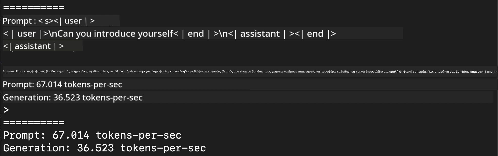
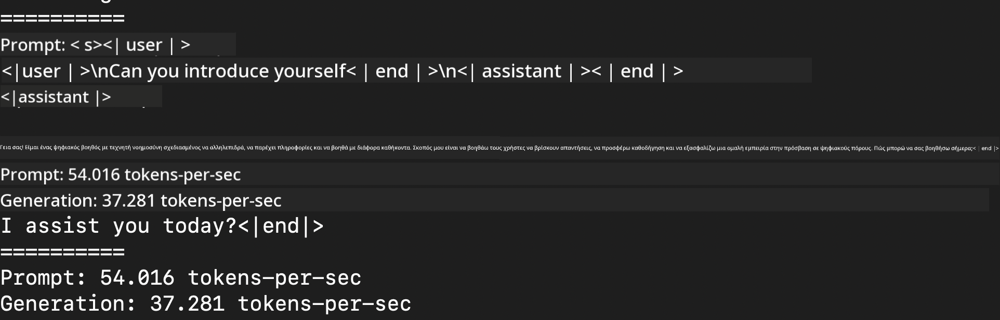
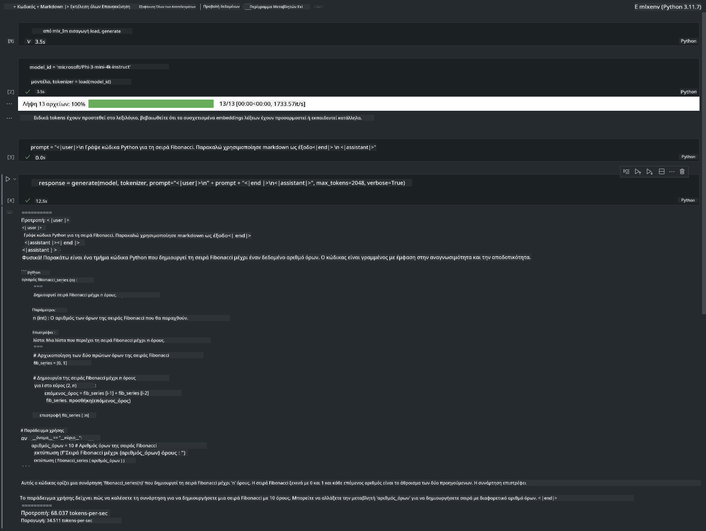

<!--
CO_OP_TRANSLATOR_METADATA:
{
  "original_hash": "dcb656f3d206fc4968e236deec5d4384",
  "translation_date": "2025-05-09T22:31:43+00:00",
  "source_file": "md/03.FineTuning/03.Inference/MLX_Inference.md",
  "language_code": "el"
}
-->
# **Inference Phi-3 με το Apple MLX Framework**

## **Τι είναι το MLX Framework**

Το MLX είναι ένα πλαίσιο για μηχανική μάθηση σε Apple silicon, που δημιουργήθηκε από την ομάδα έρευνας μηχανικής μάθησης της Apple.

Το MLX έχει σχεδιαστεί από ερευνητές μηχανικής μάθησης για ερευνητές μηχανικής μάθησης. Το πλαίσιο στοχεύει να είναι φιλικό προς τον χρήστη, αλλά ταυτόχρονα αποδοτικό για την εκπαίδευση και την ανάπτυξη μοντέλων. Ο σχεδιασμός του πλαισίου είναι επίσης απλός σε επίπεδο ιδεών. Σκοπός μας είναι να διευκολύνουμε τους ερευνητές να επεκτείνουν και να βελτιώσουν το MLX, ώστε να εξερευνούν γρήγορα νέες ιδέες.

Τα LLMs μπορούν να επιταχυνθούν σε συσκευές Apple Silicon μέσω του MLX, και τα μοντέλα μπορούν να τρέξουν τοπικά με μεγάλη ευκολία.

## **Χρήση του MLX για inference του Phi-3-mini**

### **1. Ρύθμιση του περιβάλλοντος MLX**

1. Python 3.11.x  
2. Εγκατάσταση της MLX Βιβλιοθήκης


```bash

pip install mlx-lm

```

### **2. Εκτέλεση του Phi-3-mini στο Terminal με MLX**


```bash

python -m mlx_lm.generate --model microsoft/Phi-3-mini-4k-instruct --max-token 2048 --prompt  "<|user|>\nCan you introduce yourself<|end|>\n<|assistant|>"

```

Το αποτέλεσμα (το περιβάλλον μου είναι Apple M1 Max, 64GB) είναι



### **3. Κβαντισμός του Phi-3-mini με MLX στο Terminal**


```bash

python -m mlx_lm.convert --hf-path microsoft/Phi-3-mini-4k-instruct

```

***Note：*** Το μοντέλο μπορεί να κβαντιστεί μέσω της mlx_lm.convert, και ο προεπιλεγμένος κβαντισμός είναι INT4. Αυτό το παράδειγμα κβαντίζει το Phi-3-mini σε INT4.

Το μοντέλο μπορεί να κβαντιστεί μέσω της mlx_lm.convert, και ο προεπιλεγμένος κβαντισμός είναι INT4. Σε αυτό το παράδειγμα κβαντίζουμε το Phi-3-mini σε INT4. Μετά τον κβαντισμό, θα αποθηκευτεί στον προεπιλεγμένο φάκελο ./mlx_model

Μπορούμε να δοκιμάσουμε το μοντέλο που κβαντίστηκε με MLX από το τερματικό


```bash

python -m mlx_lm.generate --model ./mlx_model/ --max-token 2048 --prompt  "<|user|>\nCan you introduce yourself<|end|>\n<|assistant|>"

```

Το αποτέλεσμα είναι




### **4. Εκτέλεση του Phi-3-mini με MLX σε Jupyter Notebook**




***Note:*** Παρακαλώ διαβάστε αυτό το παράδειγμα [click this link](../../../../../code/03.Inference/MLX/MLX_DEMO.ipynb)


## **Πόροι**

1. Μάθετε για το Apple MLX Framework [https://ml-explore.github.io](https://ml-explore.github.io/mlx/build/html/index.html)

2. Apple MLX GitHub Repo [https://github.com/ml-explore](https://github.com/ml-explore)

**Αποποίηση ευθυνών**:  
Αυτό το έγγραφο έχει μεταφραστεί χρησιμοποιώντας την υπηρεσία αυτόματης μετάφρασης AI [Co-op Translator](https://github.com/Azure/co-op-translator). Παρόλο που προσπαθούμε για ακρίβεια, παρακαλούμε να γνωρίζετε ότι οι αυτόματες μεταφράσεις ενδέχεται να περιέχουν λάθη ή ανακρίβειες. Το πρωτότυπο έγγραφο στην αρχική του γλώσσα πρέπει να θεωρείται η επίσημη πηγή. Για κρίσιμες πληροφορίες, συνιστάται επαγγελματική ανθρώπινη μετάφραση. Δεν φέρουμε ευθύνη για τυχόν παρεξηγήσεις ή λανθασμένες ερμηνείες που προκύπτουν από τη χρήση αυτής της μετάφρασης.