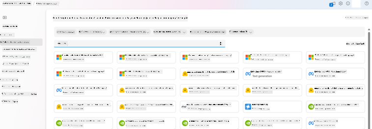
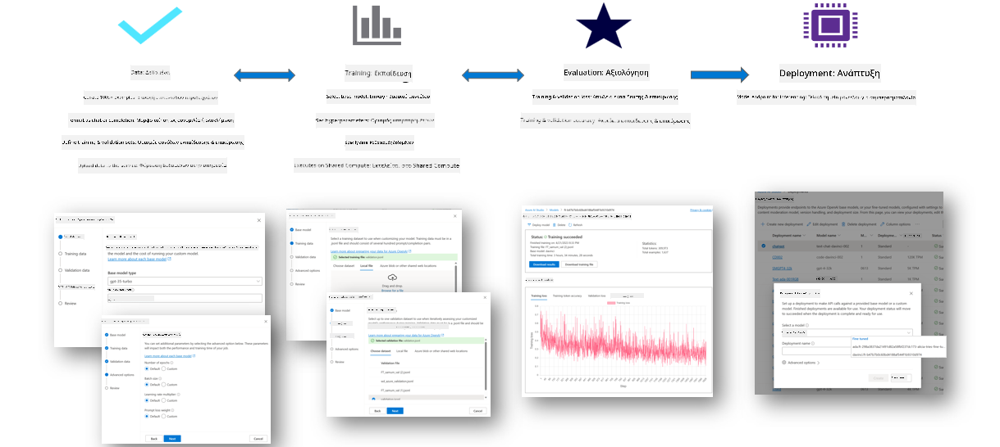
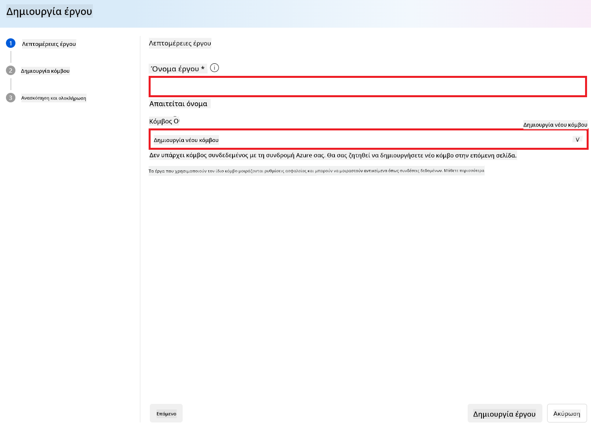
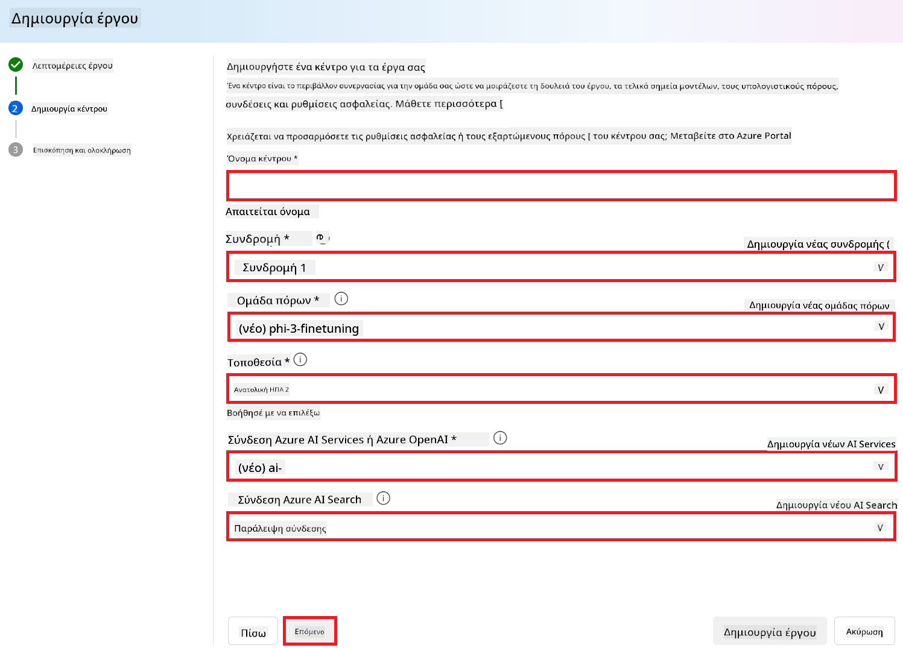
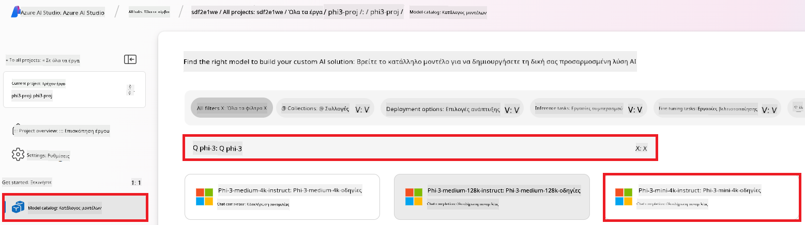
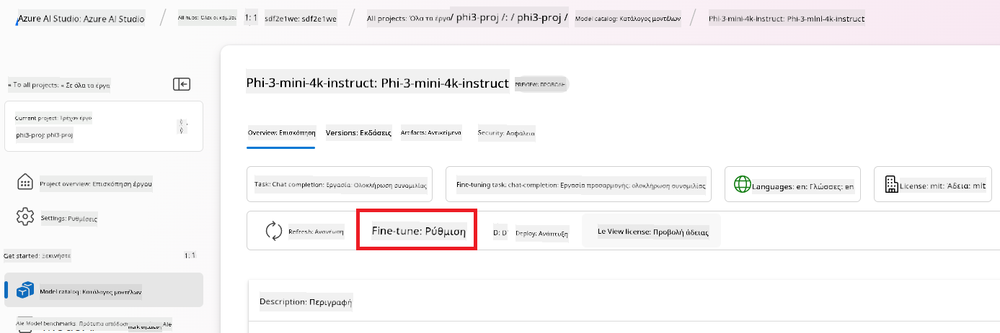
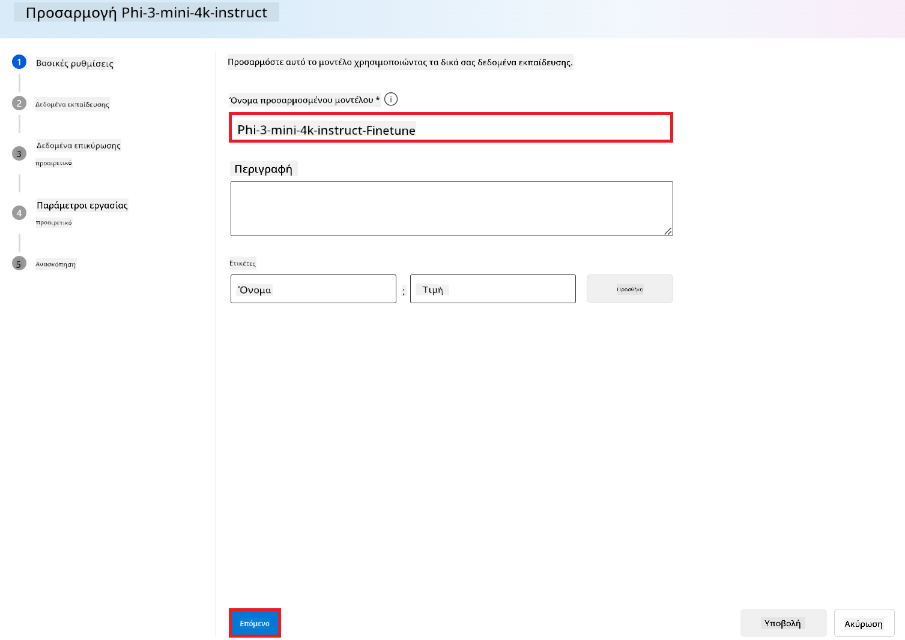
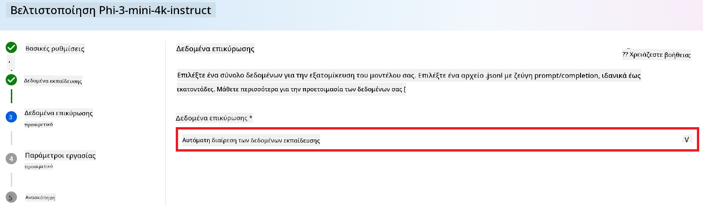
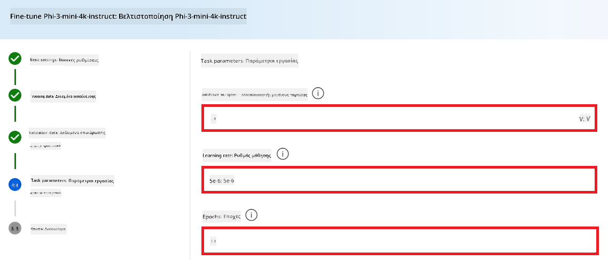
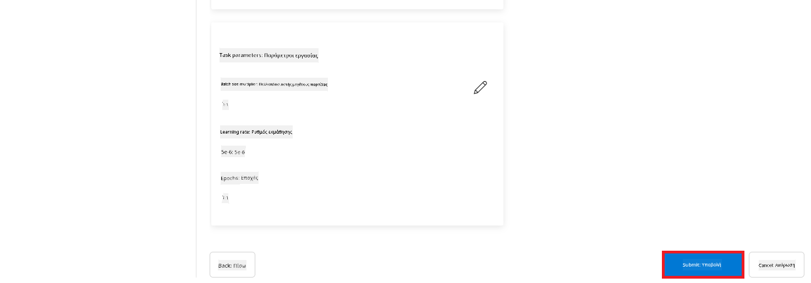

<!--
CO_OP_TRANSLATOR_METADATA:
{
  "original_hash": "c1559c5af6caccf6f623fd43a6b3a9a3",
  "translation_date": "2025-05-09T20:31:14+00:00",
  "source_file": "md/03.FineTuning/FineTuning_AIFoundry.md",
  "language_code": "el"
}
-->
# Προσαρμογή του Phi-3 με το Azure AI Foundry

Ας δούμε πώς να προσαρμόσουμε το γλωσσικό μοντέλο Phi-3 Mini της Microsoft χρησιμοποιώντας το Azure AI Foundry. Η προσαρμογή (fine-tuning) σας επιτρέπει να προσαρμόσετε το Phi-3 Mini σε συγκεκριμένες εργασίες, καθιστώντας το πιο ισχυρό και ευαίσθητο στο πλαίσιο.

## Σκέψεις

- **Δυνατότητες:** Ποια μοντέλα μπορούν να προσαρμοστούν; Τι μπορεί να κάνει το βασικό μοντέλο μετά την προσαρμογή;
- **Κόστος:** Ποιο είναι το μοντέλο τιμολόγησης για την προσαρμογή;
- **Ευελιξία:** Πόσο μπορώ να τροποποιήσω το βασικό μοντέλο – και με ποιους τρόπους;
- **Ευκολία:** Πώς γίνεται η προσαρμογή στην πράξη – χρειάζεται να γράψω δικό μου κώδικα; Χρειάζομαι δικούς μου πόρους υπολογισμού;
- **Ασφάλεια:** Τα προσαρμοσμένα μοντέλα μπορεί να έχουν κινδύνους ασφαλείας – υπάρχουν μηχανισμοί προστασίας για την αποφυγή ανεπιθύμητων επιπτώσεων;



## Προετοιμασία για προσαρμογή

### Προαπαιτούμενα

> [!NOTE]
> Για τα μοντέλα της οικογένειας Phi-3, η υπηρεσία προσαρμογής με πληρωμή ανά χρήση είναι διαθέσιμη μόνο σε hubs που έχουν δημιουργηθεί στην περιοχή **East US 2**.

- Συνδρομή Azure. Αν δεν έχετε, δημιουργήστε έναν [λογαριασμό Azure με πληρωμή ανά χρήση](https://azure.microsoft.com/pricing/purchase-options/pay-as-you-go) για να ξεκινήσετε.

- Ένα [AI Foundry project](https://ai.azure.com?WT.mc_id=aiml-138114-kinfeylo).
- Το Azure RBAC (role-based access control) χρησιμοποιείται για να δώσει δικαιώματα σε λειτουργίες του Azure AI Foundry. Για να εκτελέσετε τα βήματα αυτού του άρθρου, ο λογαριασμός σας πρέπει να έχει το __Azure AI Developer role__ στο resource group.

### Εγγραφή παρόχου συνδρομής

Επιβεβαιώστε ότι η συνδρομή σας είναι εγγεγραμμένη στον `Microsoft.Network` resource provider.

1. Συνδεθείτε στο [Azure portal](https://portal.azure.com).
1. Επιλέξτε **Subscriptions** από το αριστερό μενού.
1. Επιλέξτε τη συνδρομή που θέλετε να χρησιμοποιήσετε.
1. Επιλέξτε **AI project settings** > **Resource providers** από το αριστερό μενού.
1. Βεβαιωθείτε ότι ο **Microsoft.Network** είναι στη λίστα των resource providers. Αν όχι, προσθέστε τον.

### Προετοιμασία δεδομένων

Προετοιμάστε τα δεδομένα εκπαίδευσης και επικύρωσης για να προσαρμόσετε το μοντέλο σας. Τα σύνολα δεδομένων εκπαίδευσης και επικύρωσης περιλαμβάνουν παραδείγματα εισόδου και εξόδου που δείχνουν πώς θέλετε να λειτουργεί το μοντέλο.

Βεβαιωθείτε ότι όλα τα παραδείγματα εκπαίδευσης ακολουθούν τη σωστή μορφή για την εκτίμηση. Για αποτελεσματική προσαρμογή, χρειάζεται ισορροπημένο και ποικίλο σύνολο δεδομένων.

Αυτό σημαίνει διατήρηση ισορροπίας στα δεδομένα, συμπερίληψη διαφόρων σεναρίων και περιοδική βελτίωση των δεδομένων εκπαίδευσης ώστε να ευθυγραμμίζονται με τις πραγματικές απαιτήσεις, οδηγώντας σε πιο ακριβείς και ισορροπημένες απαντήσεις του μοντέλου.

Διαφορετικοί τύποι μοντέλων απαιτούν διαφορετική μορφή δεδομένων εκπαίδευσης.

### Chat Completion

Τα δεδομένα εκπαίδευσης και επικύρωσης που χρησιμοποιείτε **πρέπει** να είναι σε μορφή JSON Lines (JSONL). Για `Phi-3-mini-128k-instruct` το σύνολο δεδομένων προσαρμογής πρέπει να έχει τη μορφή συνομιλίας που χρησιμοποιεί το API Chat completions.

### Παράδειγμα μορφής αρχείου

```json
    {"messages": [{"role": "system", "content": "You are an Xbox customer support agent whose primary goal is to help users with issues they are experiencing with their Xbox devices. You are friendly and concise. You only provide factual answers to queries, and do not provide answers that are not related to Xbox."}, {"role": "user", "content": "Is Xbox better than PlayStation?"}, {"role": "assistant", "content": "I apologize, but I cannot provide personal opinions. My primary job is to assist you with any issues related to your Xbox device. Do you have any Xbox-related issues that need addressing?"}]}
    {"messages": [{"role": "system", "content": "You are an Xbox customer support agent whose primary goal is to help users with issues they are experiencing with their Xbox devices. You are friendly and concise. You only provide factual answers to queries, and do not provide answers that are not related to Xbox."}, {"role": "user", "content": "Can I play PC games on my Xbox?"}, {"role": "assistant", "content": "While Xbox consoles don't natively support PC games, they can play an array of Xbox games, many of which are also available on PC. Can I assist you with finding games compatible with your Xbox device?"}]}
    {"messages": [{"role": "system", "content": "You are an Xbox customer support agent whose primary goal is to help users with issues they are experiencing with their Xbox devices. You are friendly and concise. You only provide factual answers to queries, and do not provide answers that are not related to Xbox."}, {"role": "user", "content": "I'm having trouble connecting my Xbox to the Wi-Fi."}, {"role": "assistant", "content": "No worries, let's go through the network settings on your Xbox. Can you please tell me what happens when you try to connect it to the Wi-Fi?"}]}
```

Ο υποστηριζόμενος τύπος αρχείου είναι JSON Lines. Τα αρχεία ανεβαίνουν στο προεπιλεγμένο datastore και γίνονται διαθέσιμα στο project σας.

## Προσαρμογή του Phi-3 με το Azure AI Foundry

Το Azure AI Foundry σας επιτρέπει να προσαρμόσετε μεγάλα γλωσσικά μοντέλα στα δικά σας δεδομένα μέσω της διαδικασίας που ονομάζεται fine-tuning. Η προσαρμογή προσφέρει μεγάλη αξία επιτρέποντας εξατομίκευση και βελτιστοποίηση για συγκεκριμένες εργασίες και εφαρμογές. Αυτό οδηγεί σε βελτιωμένη απόδοση, οικονομία κόστους, μειωμένη καθυστέρηση και εξατομικευμένα αποτελέσματα.



### Δημιουργία Νέου Project

1. Συνδεθείτε στο [Azure AI Foundry](https://ai.azure.com).

1. Επιλέξτε **+New project** για να δημιουργήσετε νέο project στο Azure AI Foundry.

    

1. Εκτελέστε τα παρακάτω:

    - Όνομα **Hub**. Πρέπει να είναι μοναδικό.
    - Επιλέξτε το **Hub** που θέλετε να χρησιμοποιήσετε (δημιουργήστε νέο αν χρειάζεται).

    

1. Για να δημιουργήσετε νέο hub:

    - Εισάγετε το **Hub name**. Πρέπει να είναι μοναδικό.
    - Επιλέξτε τη συνδρομή Azure σας (**Subscription**).
    - Επιλέξτε το **Resource group** που θα χρησιμοποιήσετε (δημιουργήστε νέο αν χρειάζεται).
    - Επιλέξτε την **Τοποθεσία** που προτιμάτε.
    - Επιλέξτε **Connect Azure AI Services** (δημιουργήστε νέο αν χρειάζεται).
    - Επιλέξτε **Connect Azure AI Search** και επιλέξτε **Skip connecting**.

    

1. Επιλέξτε **Next**.
1. Επιλέξτε **Create a project**.

### Προετοιμασία Δεδομένων

Πριν την προσαρμογή, συγκεντρώστε ή δημιουργήστε ένα σύνολο δεδομένων σχετικό με την εργασία σας, όπως οδηγίες συνομιλίας, ζεύγη ερωτήσεων-απαντήσεων ή άλλο σχετικό κείμενο. Καθαρίστε και προεπεξεργαστείτε τα δεδομένα αφαιρώντας θόρυβο, αντιμετωπίζοντας ελλείψεις και κάνοντας tokenization.

### Προσαρμογή μοντέλων Phi-3 στο Azure AI Foundry

> [!NOTE]
> Η προσαρμογή των μοντέλων Phi-3 υποστηρίζεται αυτή τη στιγμή μόνο σε projects που βρίσκονται στην περιοχή East US 2.

1. Επιλέξτε **Model catalog** από το αριστερό μενού.

1. Πληκτρολογήστε *phi-3* στη **γραμμή αναζήτησης** και επιλέξτε το μοντέλο phi-3 που θέλετε.

    

1. Επιλέξτε **Fine-tune**.

    

1. Εισάγετε το **Όνομα προσαρμοσμένου μοντέλου**.

    

1. Επιλέξτε **Next**.

1. Κάντε τα εξής:

    - Επιλέξτε **τύπο εργασίας** ως **Chat completion**.
    - Επιλέξτε τα **δεδομένα εκπαίδευσης** που θέλετε να χρησιμοποιήσετε. Μπορείτε να τα ανεβάσετε μέσω του Azure AI Foundry ή από τοπικό περιβάλλον.

    

1. Επιλέξτε **Next**.

1. Ανεβάστε τα **δεδομένα επικύρωσης** που θέλετε ή επιλέξτε **Automatic split of training data**.

    

1. Επιλέξτε **Next**.

1. Ρυθμίστε:

    - Τον **πολλαπλασιαστή μεγέθους batch** που επιθυμείτε.
    - Το **ρυθμό εκμάθησης (learning rate)**.
    - Τον αριθμό **Epochs**.

    

1. Επιλέξτε **Submit** για να ξεκινήσει η διαδικασία προσαρμογής.

    

1. Όταν ολοκληρωθεί η προσαρμογή, η κατάσταση θα εμφανιστεί ως **Completed**, όπως στην εικόνα παρακάτω. Τώρα μπορείτε να αναπτύξετε το μοντέλο και να το χρησιμοποιήσετε στην εφαρμογή σας, στο playground ή στο prompt flow. Για περισσότερες πληροφορίες, δείτε [Πώς να αναπτύξετε τη σειρά μικρών γλωσσικών μοντέλων Phi-3 με Azure AI Foundry](https://learn.microsoft.com/azure/ai-studio/how-to/deploy-models-phi-3?tabs=phi-3-5&pivots=programming-language-python).

    

> [!NOTE]
> Για πιο αναλυτικές πληροφορίες σχετικά με την προσαρμογή του Phi-3, επισκεφθείτε [Fine-tune Phi-3 models in Azure AI Foundry](https://learn.microsoft.com/azure/ai-studio/how-to/fine-tune-phi-3?tabs=phi-3-mini).

## Καθαρισμός των προσαρμοσμένων μοντέλων σας

Μπορείτε να διαγράψετε ένα προσαρμοσμένο μοντέλο από τη λίστα μοντέλων προσαρμογής στο [Azure AI Foundry](https://ai.azure.com) ή από τη σελίδα λεπτομερειών του μοντέλου. Επιλέξτε το μοντέλο που θέλετε να διαγράψετε στη σελίδα Fine-tuning και μετά πατήστε το κουμπί Delete.

> [!NOTE]
> Δεν μπορείτε να διαγράψετε ένα προσαρμοσμένο μοντέλο αν έχει ενεργή ανάπτυξη. Πρέπει πρώτα να διαγράψετε την ανάπτυξη του μοντέλου πριν διαγράψετε το ίδιο το μοντέλο.

## Κόστος και όρια

### Κόστος και όρια για μοντέλα Phi-3 που προσαρμόζονται ως υπηρεσία

Τα μοντέλα Phi που προσαρμόζονται ως υπηρεσία προσφέρονται από τη Microsoft και ενσωματώνονται στο Azure AI Foundry για χρήση. Μπορείτε να βρείτε τις τιμές κατά την [ανάπτυξη](https://learn.microsoft.com/azure/ai-studio/how-to/deploy-models-phi-3?tabs=phi-3-5&pivots=programming-language-python) ή την προσαρμογή των μοντέλων στην καρτέλα Τιμολόγησης και Όρων στον οδηγό ανάπτυξης.

## Φιλτράρισμα περιεχομένου

Τα μοντέλα που αναπτύσσονται ως υπηρεσία με πληρωμή ανά χρήση προστατεύονται από το Azure AI Content Safety. Όταν αναπτύσσονται σε endpoints σε πραγματικό χρόνο, μπορείτε να απενεργοποιήσετε αυτή τη λειτουργία. Με ενεργοποιημένη την ασφάλεια περιεχομένου, τόσο το prompt όσο και η ολοκλήρωση περνούν από ένα σύνολο μοντέλων ταξινόμησης που εντοπίζουν και αποτρέπουν την παραγωγή επιβλαβούς περιεχομένου. Το σύστημα φιλτραρίσματος περιεχομένου εντοπίζει και ενεργεί σε συγκεκριμένες κατηγορίες πιθανώς επιβλαβούς περιεχομένου σε prompts και απαντήσεις. Μάθετε περισσότερα για το [Azure AI Content Safety](https://learn.microsoft.com/azure/ai-studio/concepts/content-filtering).

**Ρυθμίσεις Προσαρμογής**

Υπερπαράμετροι: Ορίστε υπερπαράμετρους όπως ρυθμό εκμάθησης, μέγεθος batch και αριθμό epochs.

**Συνάρτηση απώλειας**

Επιλέξτε κατάλληλη συνάρτηση απώλειας για την εργασία σας (π.χ. cross-entropy).

**Βελτιστοποιητής**

Επιλέξτε βελτιστοποιητή (π.χ. Adam) για τις ενημερώσεις κλίσης κατά την εκπαίδευση.

**Διαδικασία προσαρμογής**

- Φορτώστε το προεκπαιδευμένο μοντέλο: Φορτώστε το checkpoint του Phi-3 Mini.
- Προσθέστε προσαρμοσμένα επίπεδα: Προσθέστε επίπεδα ειδικά για την εργασία (π.χ. classification head για οδηγίες συνομιλίας).

**Εκπαίδευση μοντέλου**  
Προσαρμόστε το μοντέλο με το προετοιμασμένο σύνολο δεδομένων. Παρακολουθήστε την πρόοδο και ρυθμίστε τις υπερπαράμετρους ανάλογα.

**Αξιολόγηση και επικύρωση**

Σετ επικύρωσης: Χωρίστε τα δεδομένα σε σετ εκπαίδευσης και επικύρωσης.

**Αξιολογήστε την απόδοση**

Χρησιμοποιήστε μετρικές όπως ακρίβεια, F1-score ή perplexity για να εκτιμήσετε την απόδοση.

## Αποθήκευση προσαρμοσμένου μοντέλου

**Checkpoint**  
Αποθηκεύστε το checkpoint του προσαρμοσμένου μοντέλου για μελλοντική χρήση.

## Ανάπτυξη

- Αναπτύξτε ως Web Service: Αναπτύξτε το προσαρμοσμένο μοντέλο σας ως web service στο Azure AI Foundry.
- Δοκιμάστε το Endpoint: Στείλτε δοκιμαστικά ερωτήματα στο endpoint για να επιβεβαιώσετε τη λειτουργία του.

## Επανάληψη και βελτίωση

Επανάληψη: Αν η απόδοση δεν είναι ικανοποιητική, επαναλάβετε τη διαδικασία ρυθμίζοντας υπερπαράμετρους, προσθέτοντας περισσότερα δεδομένα ή αυξάνοντας τα epochs.

## Παρακολούθηση και βελτίωση

Παρακολουθείτε συνεχώς τη συμπεριφορά του μοντέλου και βελτιώνετε όπως απαιτείται.

## Προσαρμογή και επέκταση

Προσαρμοσμένες εργασίες: Το Phi-3 Mini μπορεί να προσαρμοστεί για διάφορες εργασίες πέρα από τις οδηγίες συνομιλίας. Εξερευνήστε άλλες χρήσεις!  
Πειραματιστείτε: Δοκιμάστε διαφορετικές αρχιτεκτονικές, συνδυασμούς επιπέδων και τεχνικές για καλύτερη απόδοση.

> [!NOTE]
> Η προσαρμογή είναι μια επαναληπτική διαδικασία. Πειραματιστείτε, μάθετε και προσαρμόστε το μοντέλο σας για να πετύχετε τα καλύτερα αποτελέσματα στην εργασία σας!

**Αποποίηση ευθυνών**:  
Αυτό το έγγραφο έχει μεταφραστεί χρησιμοποιώντας την υπηρεσία αυτόματης μετάφρασης AI [Co-op Translator](https://github.com/Azure/co-op-translator). Παρόλο που προσπαθούμε για ακρίβεια, παρακαλούμε να λάβετε υπόψη ότι οι αυτόματες μεταφράσεις ενδέχεται να περιέχουν λάθη ή ανακρίβειες. Το πρωτότυπο έγγραφο στη μητρική του γλώσσα πρέπει να θεωρείται η αυθεντική πηγή. Για κρίσιμες πληροφορίες, συνιστάται επαγγελματική μετάφραση από άνθρωπο. Δεν φέρουμε ευθύνη για τυχόν παρεξηγήσεις ή λανθασμένες ερμηνείες που προκύπτουν από τη χρήση αυτής της μετάφρασης.