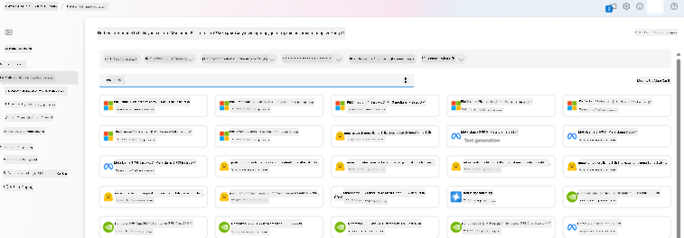
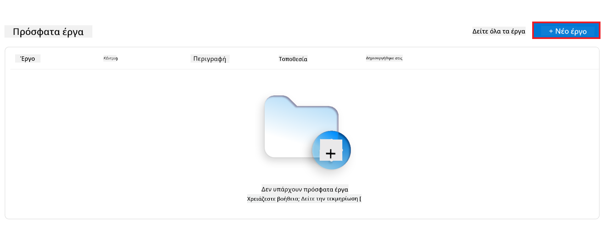
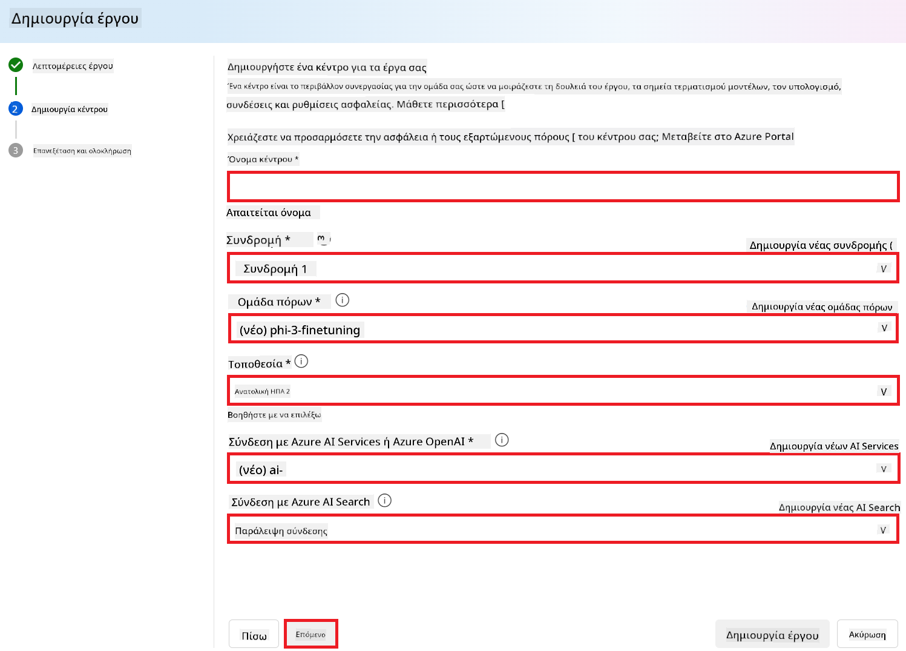
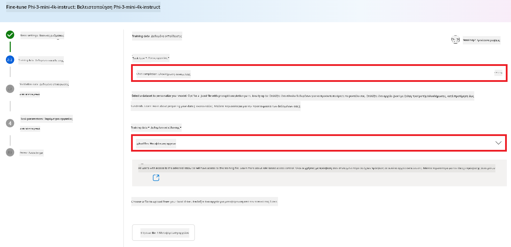
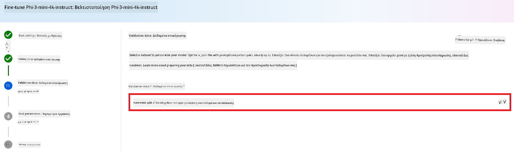
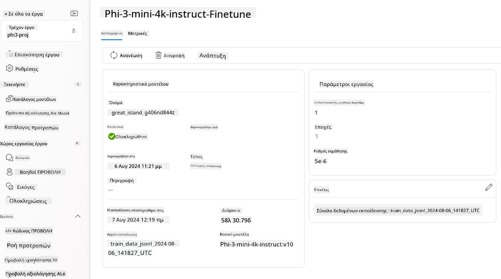

<!--
CO_OP_TRANSLATOR_METADATA:
{
  "original_hash": "c1559c5af6caccf6f623fd43a6b3a9a3",
  "translation_date": "2025-07-17T06:05:20+00:00",
  "source_file": "md/03.FineTuning/FineTuning_AIFoundry.md",
  "language_code": "el"
}
-->
# Fine-tuning του Phi-3 με το Azure AI Foundry

Ας δούμε πώς να κάνουμε fine-tuning στο γλωσσικό μοντέλο Phi-3 Mini της Microsoft χρησιμοποιώντας το Azure AI Foundry. Το fine-tuning σας επιτρέπει να προσαρμόσετε το Phi-3 Mini σε συγκεκριμένες εργασίες, καθιστώντας το πιο ισχυρό και ευαίσθητο στο πλαίσιο.

## Σκέψεις

- **Δυνατότητες:** Ποια μοντέλα μπορούν να υποβληθούν σε fine-tuning; Τι μπορεί να κάνει το βασικό μοντέλο μετά το fine-tuning;
- **Κόστος:** Ποιο είναι το μοντέλο τιμολόγησης για το fine-tuning;
- **Προσαρμοστικότητα:** Πόσο μπορώ να τροποποιήσω το βασικό μοντέλο – και με ποιους τρόπους;
- **Ευκολία:** Πώς γίνεται το fine-tuning στην πράξη – χρειάζεται να γράψω δικό μου κώδικα; Χρειάζεται να φέρω δικούς μου υπολογιστικούς πόρους;
- **Ασφάλεια:** Τα μοντέλα μετά το fine-tuning έχουν γνωστούς κινδύνους ασφάλειας – υπάρχουν μηχανισμοί προστασίας για να αποτρέψουν ανεπιθύμητες βλάβες;



## Προετοιμασία για fine-tuning

### Προαπαιτούμενα

> [!NOTE]
> Για τα μοντέλα της οικογένειας Phi-3, η υπηρεσία fine-tuning με πληρωμή ανά χρήση είναι διαθέσιμη μόνο σε hubs που έχουν δημιουργηθεί στην περιοχή **East US 2**.

- Μια συνδρομή Azure. Αν δεν έχετε, δημιουργήστε έναν [λογαριασμό Azure με πληρωμή ανά χρήση](https://azure.microsoft.com/pricing/purchase-options/pay-as-you-go) για να ξεκινήσετε.

- Ένα [AI Foundry project](https://ai.azure.com?WT.mc_id=aiml-138114-kinfeylo).
- Οι έλεγχοι πρόσβασης βάσει ρόλων του Azure (Azure RBAC) χρησιμοποιούνται για να δώσουν πρόσβαση σε λειτουργίες στο Azure AI Foundry. Για να εκτελέσετε τα βήματα αυτού του άρθρου, ο λογαριασμός χρήστη σας πρέπει να έχει ανατεθεί ο __ρόλος Azure AI Developer__ στην ομάδα πόρων.

### Εγγραφή παρόχου συνδρομής

Επιβεβαιώστε ότι η συνδρομή είναι εγγεγραμμένη στον πάροχο πόρων `Microsoft.Network`.

1. Συνδεθείτε στο [Azure portal](https://portal.azure.com).
1. Επιλέξτε **Subscriptions** από το αριστερό μενού.
1. Επιλέξτε τη συνδρομή που θέλετε να χρησιμοποιήσετε.
1. Επιλέξτε **AI project settings** > **Resource providers** από το αριστερό μενού.
1. Επιβεβαιώστε ότι ο **Microsoft.Network** βρίσκεται στη λίστα των παρόχων πόρων. Αν όχι, προσθέστε τον.

### Προετοιμασία δεδομένων

Ετοιμάστε τα δεδομένα εκπαίδευσης και επικύρωσης για να κάνετε fine-tuning στο μοντέλο σας. Τα σύνολα δεδομένων εκπαίδευσης και επικύρωσης περιλαμβάνουν παραδείγματα εισόδου και εξόδου που δείχνουν πώς θέλετε να λειτουργεί το μοντέλο.

Βεβαιωθείτε ότι όλα τα παραδείγματα εκπαίδευσης ακολουθούν τη σωστή μορφή για την εκτέλεση προβλέψεων. Για αποτελεσματικό fine-tuning, εξασφαλίστε ένα ισορροπημένο και ποικίλο σύνολο δεδομένων.

Αυτό περιλαμβάνει τη διατήρηση ισορροπίας στα δεδομένα, την ενσωμάτωση διαφόρων σεναρίων και την περιοδική βελτίωση των δεδομένων εκπαίδευσης ώστε να ευθυγραμμίζονται με τις πραγματικές απαιτήσεις, οδηγώντας σε πιο ακριβείς και ισορροπημένες απαντήσεις του μοντέλου.

Διαφορετικοί τύποι μοντέλων απαιτούν διαφορετική μορφή δεδομένων εκπαίδευσης.

### Chat Completion

Τα δεδομένα εκπαίδευσης και επικύρωσης που χρησιμοποιείτε **πρέπει** να είναι σε μορφή JSON Lines (JSONL). Για το `Phi-3-mini-128k-instruct`, το σύνολο δεδομένων fine-tuning πρέπει να είναι σε μορφή συνομιλίας που χρησιμοποιεί το API Chat completions.

### Παράδειγμα μορφής αρχείου

```json
    {"messages": [{"role": "system", "content": "You are an Xbox customer support agent whose primary goal is to help users with issues they are experiencing with their Xbox devices. You are friendly and concise. You only provide factual answers to queries, and do not provide answers that are not related to Xbox."}, {"role": "user", "content": "Is Xbox better than PlayStation?"}, {"role": "assistant", "content": "I apologize, but I cannot provide personal opinions. My primary job is to assist you with any issues related to your Xbox device. Do you have any Xbox-related issues that need addressing?"}]}
    {"messages": [{"role": "system", "content": "You are an Xbox customer support agent whose primary goal is to help users with issues they are experiencing with their Xbox devices. You are friendly and concise. You only provide factual answers to queries, and do not provide answers that are not related to Xbox."}, {"role": "user", "content": "Can I play PC games on my Xbox?"}, {"role": "assistant", "content": "While Xbox consoles don't natively support PC games, they can play an array of Xbox games, many of which are also available on PC. Can I assist you with finding games compatible with your Xbox device?"}]}
    {"messages": [{"role": "system", "content": "You are an Xbox customer support agent whose primary goal is to help users with issues they are experiencing with their Xbox devices. You are friendly and concise. You only provide factual answers to queries, and do not provide answers that are not related to Xbox."}, {"role": "user", "content": "I'm having trouble connecting my Xbox to the Wi-Fi."}, {"role": "assistant", "content": "No worries, let's go through the network settings on your Xbox. Can you please tell me what happens when you try to connect it to the Wi-Fi?"}]}
```

Ο υποστηριζόμενος τύπος αρχείου είναι JSON Lines. Τα αρχεία ανεβαίνουν στον προεπιλεγμένο αποθηκευτικό χώρο και γίνονται διαθέσιμα στο project σας.

## Fine-Tuning του Phi-3 με το Azure AI Foundry

Το Azure AI Foundry σας επιτρέπει να προσαρμόσετε μεγάλα γλωσσικά μοντέλα στα δικά σας δεδομένα μέσω της διαδικασίας που ονομάζεται fine-tuning. Το fine-tuning προσφέρει σημαντική αξία επιτρέποντας την εξατομίκευση και βελτιστοποίηση για συγκεκριμένες εργασίες και εφαρμογές. Αυτό οδηγεί σε βελτιωμένη απόδοση, οικονομία κόστους, μειωμένη καθυστέρηση και προσαρμοσμένα αποτελέσματα.


### Δημιουργία νέου project

1. Συνδεθείτε στο [Azure AI Foundry](https://ai.azure.com).

1. Επιλέξτε **+New project** για να δημιουργήσετε νέο project στο Azure AI Foundry.

    

1. Εκτελέστε τις παρακάτω ενέργειες:

    - Όνομα **Hub** του project. Πρέπει να είναι μοναδικό.
    - Επιλέξτε το **Hub** που θα χρησιμοποιήσετε (δημιουργήστε νέο αν χρειάζεται).

    

1. Εκτελέστε τις παρακάτω ενέργειες για να δημιουργήσετε νέο hub:

    - Εισάγετε το **Όνομα Hub**. Πρέπει να είναι μοναδικό.
    - Επιλέξτε τη συνδρομή Azure σας.
    - Επιλέξτε την **Ομάδα πόρων** που θα χρησιμοποιήσετε (δημιουργήστε νέα αν χρειάζεται).
    - Επιλέξτε την **Τοποθεσία** που θέλετε να χρησιμοποιήσετε.
    - Επιλέξτε το **Connect Azure AI Services** που θα χρησιμοποιήσετε (δημιουργήστε νέο αν χρειάζεται).
    - Επιλέξτε **Connect Azure AI Search** και επιλέξτε **Skip connecting**.

    

1. Επιλέξτε **Next**.
1. Επιλέξτε **Create a project**.

### Προετοιμασία δεδομένων

Πριν το fine-tuning, συγκεντρώστε ή δημιουργήστε ένα σύνολο δεδομένων σχετικό με την εργασία σας, όπως οδηγίες συνομιλίας, ζεύγη ερωτήσεων-απαντήσεων ή οποιοδήποτε άλλο σχετικό κείμενο. Καθαρίστε και προεπεξεργαστείτε τα δεδομένα αφαιρώντας θόρυβο, διαχειριζόμενοι ελλείποντα δεδομένα και κάνοντας tokenization του κειμένου.

### Fine-tuning των μοντέλων Phi-3 στο Azure AI Foundry

> [!NOTE]
> Το fine-tuning των μοντέλων Phi-3 υποστηρίζεται αυτή τη στιγμή μόνο σε projects που βρίσκονται στην περιοχή East US 2.

1. Επιλέξτε **Model catalog** από την αριστερή καρτέλα.

1. Πληκτρολογήστε *phi-3* στη **γραμμή αναζήτησης** και επιλέξτε το μοντέλο phi-3 που θέλετε να χρησιμοποιήσετε.

    

1. Επιλέξτε **Fine-tune**.

    

1. Εισάγετε το **Όνομα του fine-tuned μοντέλου**.

    

1. Επιλέξτε **Next**.

1. Εκτελέστε τις παρακάτω ενέργειες:

    - Επιλέξτε τον **τύπο εργασίας** ως **Chat completion**.
    - Επιλέξτε τα **δεδομένα εκπαίδευσης** που θέλετε να χρησιμοποιήσετε. Μπορείτε να τα ανεβάσετε μέσω του Azure AI Foundry ή από το τοπικό σας περιβάλλον.

    

1. Επιλέξτε **Next**.

1. Ανεβάστε τα **δεδομένα επικύρωσης** που θέλετε να χρησιμοποιήσετε ή επιλέξτε **Automatic split of training data**.

    

1. Επιλέξτε **Next**.

1. Εκτελέστε τις παρακάτω ενέργειες:

    - Επιλέξτε τον **πολλαπλασιαστή μεγέθους batch** που θέλετε να χρησιμοποιήσετε.
    - Επιλέξτε το **ρυθμό μάθησης** που θέλετε να χρησιμοποιήσετε.
    - Επιλέξτε τον αριθμό **Epochs** που θέλετε να χρησιμοποιήσετε.

    

1. Επιλέξτε **Submit** για να ξεκινήσει η διαδικασία fine-tuning.

    

1. Μόλις το μοντέλο σας ολοκληρώσει το fine-tuning, η κατάσταση θα εμφανιστεί ως **Completed**, όπως φαίνεται στην εικόνα παρακάτω. Τώρα μπορείτε να αναπτύξετε το μοντέλο και να το χρησιμοποιήσετε στην εφαρμογή σας, στο playground ή στο prompt flow. Για περισσότερες πληροφορίες, δείτε [Πώς να αναπτύξετε την οικογένεια μικρών γλωσσικών μοντέλων Phi-3 με το Azure AI Foundry](https://learn.microsoft.com/azure/ai-studio/how-to/deploy-models-phi-3?tabs=phi-3-5&pivots=programming-language-python).

    

> [!NOTE]
> Για πιο αναλυτικές πληροφορίες σχετικά με το fine-tuning του Phi-3, επισκεφθείτε το [Fine-tune Phi-3 models in Azure AI Foundry](https://learn.microsoft.com/azure/ai-studio/how-to/fine-tune-phi-3?tabs=phi-3-mini).

## Καθαρισμός των fine-tuned μοντέλων σας

Μπορείτε να διαγράψετε ένα fine-tuned μοντέλο από τη λίστα μοντέλων fine-tuning στο [Azure AI Foundry](https://ai.azure.com) ή από τη σελίδα λεπτομερειών του μοντέλου. Επιλέξτε το fine-tuned μοντέλο που θέλετε να διαγράψετε από τη σελίδα Fine-tuning και μετά πατήστε το κουμπί Delete για να το διαγράψετε.

> [!NOTE]
> Δεν μπορείτε να διαγράψετε ένα προσαρμοσμένο μοντέλο αν έχει ενεργή ανάπτυξη. Πρέπει πρώτα να διαγράψετε την ανάπτυξη του μοντέλου πριν διαγράψετε το προσαρμοσμένο μοντέλο.

## Κόστος και όρια

### Σκέψεις για κόστος και όρια στα μοντέλα Phi-3 που έχουν fine-tune ως υπηρεσία

Τα μοντέλα Phi που έχουν fine-tune ως υπηρεσία προσφέρονται από τη Microsoft και είναι ενσωματωμένα στο Azure AI Foundry για χρήση. Μπορείτε να βρείτε τις τιμές κατά την [ανάπτυξη](https://learn.microsoft.com/azure/ai-studio/how-to/deploy-models-phi-3?tabs=phi-3-5&pivots=programming-language-python) ή το fine-tuning των μοντέλων στην καρτέλα Τιμολόγηση και Όροι στον οδηγό ανάπτυξης.

## Φιλτράρισμα περιεχομένου

Τα μοντέλα που αναπτύσσονται ως υπηρεσία με πληρωμή ανά χρήση προστατεύονται από το Azure AI Content Safety. Όταν αναπτύσσονται σε endpoints πραγματικού χρόνου, μπορείτε να επιλέξετε να απενεργοποιήσετε αυτή τη δυνατότητα. Με ενεργοποιημένο το Azure AI Content Safety, τόσο το prompt όσο και η ολοκλήρωση περνούν από ένα σύνολο μοντέλων ταξινόμησης που στοχεύουν στην ανίχνευση και αποτροπή παραγωγής επιβλαβούς περιεχομένου. Το σύστημα φιλτραρίσματος περιεχομένου ανιχνεύει και λαμβάνει μέτρα για συγκεκριμένες κατηγορίες πιθανώς επιβλαβούς περιεχομένου τόσο στα εισερχόμενα prompts όσο και στις εξόδους. Μάθετε περισσότερα για το [Azure AI Content Safety](https://learn.microsoft.com/azure/ai-studio/concepts/content-filtering).

**Ρυθμίσεις Fine-Tuning**

Υπερπαράμετροι: Ορίστε υπερπαράμετρους όπως ρυθμό μάθησης, μέγεθος batch και αριθμό εποχών εκπαίδευσης.

**Συνάρτηση απώλειας**

Επιλέξτε κατάλληλη συνάρτηση απώλειας για την εργασία σας (π.χ. cross-entropy).

**Βελτιστοποιητής**

Επιλέξτε βελτιστοποιητή (π.χ. Adam) για τις ενημερώσεις των gradients κατά την εκπαίδευση.

**Διαδικασία Fine-Tuning**

- Φόρτωση Προεκπαιδευμένου Μοντέλου: Φορτώστε το checkpoint του Phi-3 Mini.
- Προσθήκη Προσαρμοσμένων Επιπέδων: Προσθέστε επίπεδα ειδικά για την εργασία (π.χ. κεφαλή ταξινόμησης για οδηγίες συνομιλίας).

**Εκπαίδευση Μοντέλου**  
Κάντε fine-tuning στο μοντέλο χρησιμοποιώντας το προετοιμασμένο σύνολο δεδομένων. Παρακολουθήστε την πρόοδο της εκπαίδευσης και προσαρμόστε τις υπερπαράμετρους όπως χρειάζεται.

**Αξιολόγηση και Επικύρωση**

Σετ Επικύρωσης: Χωρίστε τα δεδομένα σας σε σύνολα εκπαίδευσης και επικύρωσης.

**Αξιολόγηση Απόδοσης**

Χρησιμοποιήστε μετρικές όπως ακρίβεια, F1-score ή perplexity για να αξιολογήσετε την απόδοση του μοντέλου.

## Αποθήκευση Fine-Tuned Μοντέλου

**Checkpoint**  
Αποθηκεύστε το checkpoint του fine-tuned μοντέλου για μελλοντική χρήση.

## Ανάπτυξη

- Αναπτύξτε ως Web Service: Αναπτύξτε το fine-tuned μοντέλο σας ως web service στο Azure AI Foundry.
- Δοκιμάστε το Endpoint: Στείλτε δοκιμαστικά ερωτήματα στο αναπτυγμένο endpoint για να επαληθεύσετε τη λειτουργικότητά του.

## Επανάληψη και Βελτίωση

Επανάληψη: Αν η απόδοση δεν είναι ικανοποιητική, επαναλάβετε τη διαδικασία προσαρμόζοντας υπερπαράμετρους, προσθέτοντας περισσότερα δεδομένα ή κάνοντας fine-tuning για επιπλέον εποχές.

## Παρακολούθηση και Βελτίωση

Παρακολουθείτε συνεχώς τη συμπεριφορά του μοντέλου και βελτιώνετε όπως απαιτείται.

## Προσαρμογή και Επέκταση

Προσαρμοσμένες Εργασίες: Το Phi-3 Mini μπορεί να υποβληθεί σε fine-tuning για διάφορες εργασίες πέρα από τις οδηγίες συνομιλίας. Εξερευνήστε άλλες χρήσεις!  
Πειραματισμός: Δοκιμάστε διαφορετικές αρχιτεκτονικές, συνδυασμούς επιπέδων και τεχνικές για να βελτιώσετε την απόδοση.

> [!NOTE]
> Το fine-tuning είναι μια επαναληπτική διαδικασία. Πειραματιστείτε, μάθετε και προσαρμόστε το μοντέλο σας για να πετύχετε τα καλύτερα αποτελέσματα στην ειδική σας εργασία!

**Αποποίηση ευθυνών**:  
Αυτό το έγγραφο έχει μεταφραστεί χρησιμοποιώντας την υπηρεσία αυτόματης μετάφρασης AI [Co-op Translator](https://github.com/Azure/co-op-translator). Παρόλο που επιδιώκουμε την ακρίβεια, παρακαλούμε να έχετε υπόψη ότι οι αυτόματες μεταφράσεις ενδέχεται να περιέχουν λάθη ή ανακρίβειες. Το πρωτότυπο έγγραφο στη μητρική του γλώσσα πρέπει να θεωρείται η αυθεντική πηγή. Για κρίσιμες πληροφορίες, συνιστάται επαγγελματική ανθρώπινη μετάφραση. Δεν φέρουμε ευθύνη για τυχόν παρεξηγήσεις ή λανθασμένες ερμηνείες που προκύπτουν από τη χρήση αυτής της μετάφρασης.