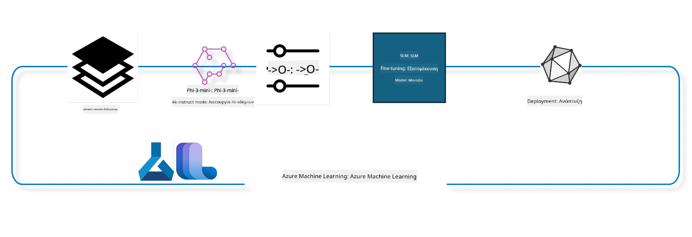

<!--
CO_OP_TRANSLATOR_METADATA:
{
  "original_hash": "944949f040e61b2ea25b3460f7394fd4",
  "translation_date": "2025-07-17T07:24:24+00:00",
  "source_file": "md/03.FineTuning/FineTuning_MLSDK.md",
  "language_code": "el"
}
-->
## Πώς να χρησιμοποιήσετε τα components chat-completion από το Azure ML system registry για fine tuning ενός μοντέλου

Σε αυτό το παράδειγμα θα πραγματοποιήσουμε fine tuning του μοντέλου Phi-3-mini-4k-instruct για να ολοκληρώσουμε μια συνομιλία μεταξύ 2 ατόμων χρησιμοποιώντας το dataset ultrachat_200k.



Το παράδειγμα θα σας δείξει πώς να κάνετε fine tuning χρησιμοποιώντας το Azure ML SDK και Python και στη συνέχεια να αναπτύξετε το fine tuned μοντέλο σε ένα online endpoint για inference σε πραγματικό χρόνο.

### Δεδομένα εκπαίδευσης

Θα χρησιμοποιήσουμε το dataset ultrachat_200k. Πρόκειται για μια πολύ φιλτραρισμένη έκδοση του UltraChat dataset και χρησιμοποιήθηκε για την εκπαίδευση του Zephyr-7B-β, ενός προηγμένου μοντέλου συνομιλίας 7b.

### Μοντέλο

Θα χρησιμοποιήσουμε το μοντέλο Phi-3-mini-4k-instruct για να δείξουμε πώς ο χρήστης μπορεί να κάνει fine tuning ενός μοντέλου για εργασία chat-completion. Αν ανοίξατε αυτό το notebook από μια συγκεκριμένη κάρτα μοντέλου, θυμηθείτε να αντικαταστήσετε το όνομα του μοντέλου.

### Εργασίες

- Επιλέξτε ένα μοντέλο για fine tuning.
- Επιλέξτε και εξερευνήστε τα δεδομένα εκπαίδευσης.
- Διαμορφώστε τη δουλειά fine tuning.
- Εκτελέστε τη δουλειά fine tuning.
- Εξετάστε τα metrics εκπαίδευσης και αξιολόγησης.
- Καταχωρήστε το fine tuned μοντέλο.
- Αναπτύξτε το fine tuned μοντέλο για inference σε πραγματικό χρόνο.
- Καθαρίστε τους πόρους.

## 1. Ρύθμιση προαπαιτούμενων

- Εγκαταστήστε τις εξαρτήσεις
- Συνδεθείτε στο AzureML Workspace. Μάθετε περισσότερα στο set up SDK authentication. Αντικαταστήστε τα <WORKSPACE_NAME>, <RESOURCE_GROUP> και <SUBSCRIPTION_ID> παρακάτω.
- Συνδεθείτε στο azureml system registry
- Ορίστε προαιρετικά ένα όνομα πειράματος
- Ελέγξτε ή δημιουργήστε compute.

> [!NOTE]
> Απαιτείται ένας κόμβος GPU που μπορεί να έχει πολλαπλές κάρτες GPU. Για παράδειγμα, σε έναν κόμβο Standard_NC24rs_v3 υπάρχουν 4 NVIDIA V100 GPUs ενώ σε Standard_NC12s_v3 υπάρχουν 2 NVIDIA V100 GPUs. Ανατρέξτε στην τεκμηρίωση για αυτές τις πληροφορίες. Ο αριθμός των καρτών GPU ανά κόμβο ορίζεται στην παράμετρο gpus_per_node παρακάτω. Η σωστή ρύθμιση αυτής της τιμής εξασφαλίζει τη χρήση όλων των GPUs στον κόμβο. Οι προτεινόμενες GPU compute SKUs βρίσκονται εδώ και εδώ.

### Βιβλιοθήκες Python

Εγκαταστήστε τις εξαρτήσεις εκτελώντας το παρακάτω κελί. Αυτό δεν είναι προαιρετικό βήμα αν τρέχετε σε νέο περιβάλλον.

```bash
pip install azure-ai-ml
pip install azure-identity
pip install datasets==2.9.0
pip install mlflow
pip install azureml-mlflow
```

### Αλληλεπίδραση με Azure ML

1. Αυτό το Python script χρησιμοποιείται για αλληλεπίδραση με την υπηρεσία Azure Machine Learning (Azure ML). Ακολουθεί ανάλυση των ενεργειών του:

    - Εισάγει τα απαραίτητα modules από τα πακέτα azure.ai.ml, azure.identity και azure.ai.ml.entities. Επίσης εισάγει το module time.

    - Προσπαθεί να κάνει authentication χρησιμοποιώντας το DefaultAzureCredential(), που παρέχει απλοποιημένη εμπειρία πιστοποίησης για γρήγορη ανάπτυξη εφαρμογών που τρέχουν στο Azure cloud. Αν αποτύχει, χρησιμοποιεί το InteractiveBrowserCredential(), που παρέχει διαδραστικό prompt σύνδεσης.

    - Προσπαθεί να δημιουργήσει ένα instance MLClient με τη μέθοδο from_config, που διαβάζει τη διαμόρφωση από το προεπιλεγμένο αρχείο config (config.json). Αν αποτύχει, δημιουργεί το MLClient παρέχοντας χειροκίνητα τα subscription_id, resource_group_name και workspace_name.

    - Δημιουργεί ένα ακόμα MLClient, αυτή τη φορά για το Azure ML registry με όνομα "azureml". Αυτό το registry είναι όπου αποθηκεύονται μοντέλα, pipelines fine-tuning και περιβάλλοντα.

    - Ορίζει το experiment_name σε "chat_completion_Phi-3-mini-4k-instruct".

    - Δημιουργεί ένα μοναδικό timestamp μετατρέποντας τον τρέχοντα χρόνο (σε δευτερόλεπτα από την εποχή, ως float) σε ακέραιο και μετά σε string. Αυτό το timestamp μπορεί να χρησιμοποιηθεί για τη δημιουργία μοναδικών ονομάτων και εκδόσεων.

    ```python
    # Import necessary modules from Azure ML and Azure Identity
    from azure.ai.ml import MLClient
    from azure.identity import (
        DefaultAzureCredential,
        InteractiveBrowserCredential,
    )
    from azure.ai.ml.entities import AmlCompute
    import time  # Import time module
    
    # Try to authenticate using DefaultAzureCredential
    try:
        credential = DefaultAzureCredential()
        credential.get_token("https://management.azure.com/.default")
    except Exception as ex:  # If DefaultAzureCredential fails, use InteractiveBrowserCredential
        credential = InteractiveBrowserCredential()
    
    # Try to create an MLClient instance using the default config file
    try:
        workspace_ml_client = MLClient.from_config(credential=credential)
    except:  # If that fails, create an MLClient instance by manually providing the details
        workspace_ml_client = MLClient(
            credential,
            subscription_id="<SUBSCRIPTION_ID>",
            resource_group_name="<RESOURCE_GROUP>",
            workspace_name="<WORKSPACE_NAME>",
        )
    
    # Create another MLClient instance for the Azure ML registry named "azureml"
    # This registry is where models, fine-tuning pipelines, and environments are stored
    registry_ml_client = MLClient(credential, registry_name="azureml")
    
    # Set the experiment name
    experiment_name = "chat_completion_Phi-3-mini-4k-instruct"
    
    # Generate a unique timestamp that can be used for names and versions that need to be unique
    timestamp = str(int(time.time()))
    ```

## 2. Επιλογή βασικού μοντέλου για fine tuning

1. Το Phi-3-mini-4k-instruct είναι ένα μοντέλο 3.8 δισεκατομμυρίων παραμέτρων, ελαφρύ, state-of-the-art ανοιχτό μοντέλο βασισμένο σε datasets που χρησιμοποιήθηκαν για το Phi-2. Το μοντέλο ανήκει στην οικογένεια μοντέλων Phi-3, και η Mini έκδοση διατίθεται σε δύο παραλλαγές 4K και 128K, που είναι το μήκος του context (σε tokens) που μπορεί να υποστηρίξει. Πρέπει να κάνουμε fine tuning στο μοντέλο για τον συγκεκριμένο σκοπό μας προκειμένου να το χρησιμοποιήσουμε. Μπορείτε να περιηγηθείτε σε αυτά τα μοντέλα στο Model Catalog στο AzureML Studio, φιλτράροντας με βάση την εργασία chat-completion. Σε αυτό το παράδειγμα, χρησιμοποιούμε το μοντέλο Phi-3-mini-4k-instruct. Αν ανοίξατε αυτό το notebook για διαφορετικό μοντέλο, αντικαταστήστε το όνομα και την έκδοση του μοντέλου αναλόγως.

    > [!NOTE]
    > το id του μοντέλου. Αυτό θα περαστεί ως είσοδος στη δουλειά fine tuning. Είναι επίσης διαθέσιμο ως πεδίο Asset ID στη σελίδα λεπτομερειών μοντέλου στο AzureML Studio Model Catalog.

2. Αυτό το Python script αλληλεπιδρά με την υπηρεσία Azure Machine Learning (Azure ML). Ακολουθεί ανάλυση των ενεργειών του:

    - Ορίζει το model_name σε "Phi-3-mini-4k-instruct".

    - Χρησιμοποιεί τη μέθοδο get της ιδιότητας models του αντικειμένου registry_ml_client για να ανακτήσει την τελευταία έκδοση του μοντέλου με το συγκεκριμένο όνομα από το Azure ML registry. Η μέθοδος get καλείται με δύο ορίσματα: το όνομα του μοντέλου και μια ετικέτα που υποδεικνύει ότι πρέπει να ανακτηθεί η τελευταία έκδοση.

    - Εκτυπώνει μήνυμα στην κονσόλα που αναφέρει το όνομα, την έκδοση και το id του μοντέλου που θα χρησιμοποιηθεί για fine tuning. Η μέθοδος format της συμβολοσειράς χρησιμοποιείται για να εισάγει το όνομα, την έκδοση και το id του μοντέλου στο μήνυμα. Τα στοιχεία αυτά προσπελαύνονται ως ιδιότητες του αντικειμένου foundation_model.

    ```python
    # Set the model name
    model_name = "Phi-3-mini-4k-instruct"
    
    # Get the latest version of the model from the Azure ML registry
    foundation_model = registry_ml_client.models.get(model_name, label="latest")
    
    # Print the model name, version, and id
    # This information is useful for tracking and debugging
    print(
        "\n\nUsing model name: {0}, version: {1}, id: {2} for fine tuning".format(
            foundation_model.name, foundation_model.version, foundation_model.id
        )
    )
    ```

## 3. Δημιουργία compute για τη δουλειά

Η δουλειά fine tuning λειτουργεί ΜΟΝΟ με GPU compute. Το μέγεθος του compute εξαρτάται από το πόσο μεγάλο είναι το μοντέλο και στις περισσότερες περιπτώσεις είναι δύσκολο να επιλεγεί το κατάλληλο compute για τη δουλειά. Σε αυτό το κελί, καθοδηγούμε τον χρήστη να επιλέξει το σωστό compute.

> [!NOTE]
> Τα παρακάτω compute λειτουργούν με την πιο βελτιστοποιημένη διαμόρφωση. Οποιαδήποτε αλλαγή στη διαμόρφωση μπορεί να οδηγήσει σε σφάλμα Cuda Out Of Memory. Σε τέτοιες περιπτώσεις, δοκιμάστε να αναβαθμίσετε το compute σε μεγαλύτερο μέγεθος.

> [!NOTE]
> Κατά την επιλογή του compute_cluster_size παρακάτω, βεβαιωθείτε ότι το compute είναι διαθέσιμο στο resource group σας. Αν κάποιο compute δεν είναι διαθέσιμο, μπορείτε να κάνετε αίτηση για πρόσβαση στους πόρους compute.

### Έλεγχος υποστήριξης fine tuning στο μοντέλο

1. Αυτό το Python script αλληλεπιδρά με ένα μοντέλο Azure Machine Learning (Azure ML). Ακολουθεί ανάλυση των ενεργειών του:

    - Εισάγει το module ast, που παρέχει λειτουργίες για επεξεργασία δέντρων της Python abstract syntax grammar.

    - Ελέγχει αν το αντικείμενο foundation_model (που αναπαριστά μοντέλο στο Azure ML) έχει ετικέτα με όνομα finetune_compute_allow_list. Οι ετικέτες στο Azure ML είναι ζεύγη κλειδιού-τιμής που μπορείτε να δημιουργήσετε και να χρησιμοποιήσετε για φιλτράρισμα και ταξινόμηση μοντέλων.

    - Αν η ετικέτα finetune_compute_allow_list υπάρχει, χρησιμοποιεί τη συνάρτηση ast.literal_eval για να μετατρέψει με ασφάλεια την τιμή της ετικέτας (που είναι string) σε λίστα Python. Αυτή η λίστα ανατίθεται στη μεταβλητή computes_allow_list. Στη συνέχεια εκτυπώνει μήνυμα που υποδεικνύει ότι πρέπει να δημιουργηθεί compute από τη λίστα.

    - Αν η ετικέτα finetune_compute_allow_list δεν υπάρχει, ορίζει την computes_allow_list σε None και εκτυπώνει μήνυμα που αναφέρει ότι η ετικέτα δεν είναι μέρος των tags του μοντέλου.

    - Συνοπτικά, το script ελέγχει για συγκεκριμένη ετικέτα στα metadata του μοντέλου, μετατρέπει την τιμή της σε λίστα αν υπάρχει και παρέχει ανάλογη ενημέρωση στον χρήστη.

    ```python
    # Import the ast module, which provides functions to process trees of the Python abstract syntax grammar
    import ast
    
    # Check if the 'finetune_compute_allow_list' tag is present in the model's tags
    if "finetune_compute_allow_list" in foundation_model.tags:
        # If the tag is present, use ast.literal_eval to safely parse the tag's value (a string) into a Python list
        computes_allow_list = ast.literal_eval(
            foundation_model.tags["finetune_compute_allow_list"]
        )  # convert string to python list
        # Print a message indicating that a compute should be created from the list
        print(f"Please create a compute from the above list - {computes_allow_list}")
    else:
        # If the tag is not present, set computes_allow_list to None
        computes_allow_list = None
        # Print a message indicating that the 'finetune_compute_allow_list' tag is not part of the model's tags
        print("`finetune_compute_allow_list` is not part of model tags")
    ```

### Έλεγχος Compute Instance

1. Αυτό το Python script αλληλεπιδρά με την υπηρεσία Azure Machine Learning (Azure ML) και πραγματοποιεί διάφορους ελέγχους σε ένα compute instance. Ακολουθεί ανάλυση των ενεργειών του:

    - Προσπαθεί να ανακτήσει το compute instance με το όνομα που αποθηκεύεται στο compute_cluster από το Azure ML workspace. Αν η κατάσταση παροχής πόρων (provisioning state) του compute instance είναι "failed", προκαλεί ValueError.

    - Ελέγχει αν η computes_allow_list δεν είναι None. Αν δεν είναι, μετατρέπει όλα τα μεγέθη compute στη λίστα σε πεζά και ελέγχει αν το μέγεθος του τρέχοντος compute instance είναι στη λίστα. Αν δεν είναι, προκαλεί ValueError.

    - Αν η computes_allow_list είναι None, ελέγχει αν το μέγεθος του compute instance είναι σε λίστα μη υποστηριζόμενων μεγεθών GPU VM. Αν είναι, προκαλεί ValueError.

    - Ανακτά λίστα με όλα τα διαθέσιμα μεγέθη compute στο workspace. Στη συνέχεια, διατρέχει αυτή τη λίστα και για κάθε μέγεθος ελέγχει αν το όνομά του ταιριάζει με το μέγεθος του τρέχοντος compute instance. Αν ναι, ανακτά τον αριθμό GPUs για αυτό το μέγεθος και ορίζει το gpu_count_found σε True.

    - Αν το gpu_count_found είναι True, εκτυπώνει τον αριθμό GPUs στο compute instance. Αν όχι, προκαλεί ValueError.

    - Συνοπτικά, το script πραγματοποιεί ελέγχους σε ένα compute instance σε Azure ML workspace, συμπεριλαμβανομένου του provisioning state, του μεγέθους σε σχέση με λίστες επιτρεπτών ή μη, και του αριθμού GPUs.

    ```python
    # Print the exception message
    print(e)
    # Raise a ValueError if the compute size is not available in the workspace
    raise ValueError(
        f"WARNING! Compute size {compute_cluster_size} not available in workspace"
    )
    
    # Retrieve the compute instance from the Azure ML workspace
    compute = workspace_ml_client.compute.get(compute_cluster)
    # Check if the provisioning state of the compute instance is "failed"
    if compute.provisioning_state.lower() == "failed":
        # Raise a ValueError if the provisioning state is "failed"
        raise ValueError(
            f"Provisioning failed, Compute '{compute_cluster}' is in failed state. "
            f"please try creating a different compute"
        )
    
    # Check if computes_allow_list is not None
    if computes_allow_list is not None:
        # Convert all compute sizes in computes_allow_list to lowercase
        computes_allow_list_lower_case = [x.lower() for x in computes_allow_list]
        # Check if the size of the compute instance is in computes_allow_list_lower_case
        if compute.size.lower() not in computes_allow_list_lower_case:
            # Raise a ValueError if the size of the compute instance is not in computes_allow_list_lower_case
            raise ValueError(
                f"VM size {compute.size} is not in the allow-listed computes for finetuning"
            )
    else:
        # Define a list of unsupported GPU VM sizes
        unsupported_gpu_vm_list = [
            "standard_nc6",
            "standard_nc12",
            "standard_nc24",
            "standard_nc24r",
        ]
        # Check if the size of the compute instance is in unsupported_gpu_vm_list
        if compute.size.lower() in unsupported_gpu_vm_list:
            # Raise a ValueError if the size of the compute instance is in unsupported_gpu_vm_list
            raise ValueError(
                f"VM size {compute.size} is currently not supported for finetuning"
            )
    
    # Initialize a flag to check if the number of GPUs in the compute instance has been found
    gpu_count_found = False
    # Retrieve a list of all available compute sizes in the workspace
    workspace_compute_sku_list = workspace_ml_client.compute.list_sizes()
    available_sku_sizes = []
    # Iterate over the list of available compute sizes
    for compute_sku in workspace_compute_sku_list:
        available_sku_sizes.append(compute_sku.name)
        # Check if the name of the compute size matches the size of the compute instance
        if compute_sku.name.lower() == compute.size.lower():
            # If it does, retrieve the number of GPUs for that compute size and set gpu_count_found to True
            gpus_per_node = compute_sku.gpus
            gpu_count_found = True
    # If gpu_count_found is True, print the number of GPUs in the compute instance
    if gpu_count_found:
        print(f"Number of GPU's in compute {compute.size}: {gpus_per_node}")
    else:
        # If gpu_count_found is False, raise a ValueError
        raise ValueError(
            f"Number of GPU's in compute {compute.size} not found. Available skus are: {available_sku_sizes}."
            f"This should not happen. Please check the selected compute cluster: {compute_cluster} and try again."
        )
    ```

## 4. Επιλογή dataset για fine tuning του μοντέλου

1. Χρησιμοποιούμε το dataset ultrachat_200k. Το dataset έχει τέσσερα splits, κατάλληλα για Supervised fine-tuning (sft). Generation ranking (gen). Ο αριθμός παραδειγμάτων ανά split φαίνεται παρακάτω:

    ```bash
    train_sft test_sft  train_gen  test_gen
    207865  23110  256032  28304
    ```

1. Τα επόμενα κελιά δείχνουν βασική προετοιμασία δεδομένων για fine tuning:

### Οπτικοποίηση μερικών γραμμών δεδομένων

Θέλουμε αυτό το δείγμα να τρέξει γρήγορα, οπότε αποθηκεύουμε τα αρχεία train_sft, test_sft που περιέχουν το 5% των ήδη περικομμένων γραμμών. Αυτό σημαίνει ότι το fine tuned μοντέλο θα έχει χαμηλότερη ακρίβεια, οπότε δεν πρέπει να χρησιμοποιηθεί σε πραγματικές εφαρμογές. Το download-dataset.py χρησιμοποιείται για να κατεβάσει το dataset ultrachat_200k και να μετατρέψει το dataset σε μορφή που μπορεί να καταναλωθεί από το pipeline fine tuning. Επίσης, καθώς το dataset είναι μεγάλο, εδώ έχουμε μόνο μέρος του dataset.

1. Η εκτέλεση του παρακάτω script κατεβάζει μόνο το 5% των δεδομένων. Αυτό μπορεί να αυξηθεί αλλάζοντας την παράμετρο dataset_split_pc στο επιθυμητό ποσοστό.

    > [!NOTE]
    > Ορισμένα γλωσσικά μοντέλα έχουν διαφορετικούς κωδικούς γλώσσας και επομένως τα ονόματα στηλών στο dataset πρέπει να αντανακλούν το ίδιο.

1. Εδώ είναι ένα παράδειγμα του πώς πρέπει να μοιάζουν τα δεδομένα  
Το dataset chat-completion αποθηκεύεται σε μορφή parquet με κάθε εγγραφή να ακολουθεί το παρακάτω σχήμα:

    - Πρόκειται για ένα JSON (JavaScript Object Notation) έγγραφο, που είναι δημοφιλής μορφή ανταλλαγής δεδομένων. Δεν είναι εκτελέσιμος κώδικας, αλλά τρόπος αποθήκευσης και μεταφοράς δεδομένων. Ακολουθεί ανάλυση της δομής του:

    - "prompt": Αυτό το κλειδί κρατά μια συμβολοσειρά που αντιπροσωπεύει μια εργασία ή ερώτηση προς έναν AI βοηθό.

    - "messages": Αυτό το κλειδί κρατά έναν πίνακα από αντικείμενα. Κάθε αντικείμενο αντιπροσωπεύει ένα μήνυμα σε μια συνομιλία μεταξύ χρήστη και AI βοηθού. Κάθε μήνυμα έχει δύο κλειδιά:

    - "content": Κρατά το περιεχόμενο του μηνύματος ως συμβολοσειρά.
    - "role": Κρατά το ρόλο του αποστολέα του μηνύματος ως συμβολοσειρά. Μπορεί να είναι είτε "user" είτε "assistant".
    - "prompt_id": Κρατά ένα μοναδικό αναγνωριστικό για το prompt.

1. Σε αυτό το συγκεκριμένο JSON έγγραφο, αναπαρίσταται μια συνομιλία όπου ένας χρήστης ζητά από έναν AI βοηθό να δημιουργήσει έναν πρωταγωνιστή για μια δυστοπική ιστορία. Ο βοηθός απαντά, και ο χρήστης ζητά περισσότερες λεπτομέρειες. Ο βοηθός συμφωνεί να δώσει περισσότερες λεπτομέρειες. Ολόκληρη η συνομιλία συνδέεται με συγκεκριμένο prompt id.

    ```python
    {
        // The task or question posed to an AI assistant
        "prompt": "Create a fully-developed protagonist who is challenged to survive within a dystopian society under the rule of a tyrant. ...",
        
        // An array of objects, each representing a message in a conversation between a user and an AI assistant
        "messages":[
            {
                // The content of the user's message
                "content": "Create a fully-developed protagonist who is challenged to survive within a dystopian society under the rule of a tyrant. ...",
                // The role of the entity that sent the message
                "role": "user"
            },
            {
                // The content of the assistant's message
                "content": "Name: Ava\n\n Ava was just 16 years old when the world as she knew it came crashing down. The government had collapsed, leaving behind a chaotic and lawless society. ...",
                // The role of the entity that sent the message
                "role": "assistant"
            },
            {
                // The content of the user's message
                "content": "Wow, Ava's story is so intense and inspiring! Can you provide me with more details.  ...",
                // The role of the entity that sent the message
                "role": "user"
            }, 
            {
                // The content of the assistant's message
                "content": "Certainly! ....",
                // The role of the entity that sent the message
                "role": "assistant"
            }
        ],
        
        // A unique identifier for the prompt
        "prompt_id": "d938b65dfe31f05f80eb8572964c6673eddbd68eff3db6bd234d7f1e3b86c2af"
    }
    ```

### Λήψη Δεδομένων

1. Αυτό το Python script χρησιμοποιείται για να κατεβάσει ένα dataset χρησιμοποιώντας ένα βοηθητικό script με όνομα download-dataset.py. Ακολουθεί ανάλυση των ενεργειών του:

    - Εισάγει το module os, που παρέχει φορητό τρόπο χρήσης λειτουργιών εξαρτώμενων από το λειτουργικό σύστημα.

    - Χρησιμοποιεί τη συνάρτηση os.system για να τρέξει το script download-dataset.py στο shell με συγκεκριμένα ορίσματα γραμμής εντολών. Τα ορίσματα καθορίζουν το dataset που θα κατέβει (HuggingFaceH4/ultrachat_200k), τον φάκελο προορισμού (ultrachat_200k_dataset) και το ποσοστό του dataset που θα χωριστεί (5). Η os.system επιστρέφει τον κωδικό εξόδου της εντολής που εκτέλεσε, ο οποίος αποθηκεύεται στη μεταβλητή exit_status.

    - Ελέγχει αν το exit_status δεν είναι 0. Σε λειτουργικά συστήματα τύπου Unix, κωδικός εξόδου 0 σημαίνει επιτυχία, ενώ οποιοσδήποτε άλλος αριθμός σημαίνει σφάλμα. Αν το exit_status δεν είναι 0, προκαλεί Exception με μήνυμα που αναφέρει ότι υπήρξε σφάλμα κατά τη λήψη του dataset.

    - Συνοπτικά, το script τρέχει εντολή για λήψη dataset χρησιμοποιώντας βοηθητικό script και προκαλεί εξαίρεση αν η εντολή αποτύχει.

    ```python
    # Import the os module, which provides a way of using operating system dependent functionality
    import os
    
    # Use the os.system function to run the download-dataset.py script in the shell with specific command-line arguments
    # The arguments specify the dataset to download (HuggingFaceH4/ultrachat_200k), the directory to download it to (ultrachat_200k_dataset), and the percentage of the dataset to split (5)
    # The os.system function returns the exit status of the command it executed; this status is stored in the exit_status variable
    exit_status = os.system(
        "python ./download-dataset.py --dataset HuggingFaceH4/ultrachat_200k --download_dir ultrachat_200k_dataset --dataset_split_pc 5"
    )
    
    # Check if exit_status is not 0
    # In Unix-like operating systems, an exit status of 0 usually indicates that a command has succeeded, while any other number indicates an error
    # If exit_status is not 0, raise an Exception with a message indicating that there was an error downloading the dataset
    if exit_status != 0:
        raise Exception("Error downloading dataset")
    ```

### Φόρτωση Δεδομένων σε DataFrame

1. Αυτό το Python script φορτώνει ένα αρχείο JSON Lines σε pandas DataFrame και εμφανίζει τις πρώτες 5 γραμμές. Ακολουθεί ανάλυση των ενεργειών του:

    - Εισάγει τη βιβλιοθήκη pandas, που είναι ισχυρή βιβλιοθήκη για χειρισμό και ανάλυση δεδομένων.

    - Ορίζει το μέγιστο πλάτος στήλης για τις επιλογές εμφάνισης του pandas σε 0. Αυτό σημαίνει ότι το πλήρες κείμενο κάθε στήλης θα εμφανίζεται χωρίς περικοπή όταν εκτυπώνεται το DataFrame.

    - Χρησιμοποιεί τη συνάρτηση pd.read_json για να φορ
- Χρησιμοποιεί τη μέθοδο head για να εμφανίσει τις πρώτες 5 γραμμές του DataFrame. Αν το DataFrame έχει λιγότερες από 5 γραμμές, θα εμφανίσει όλες.

- Συνοπτικά, αυτό το script φορτώνει ένα αρχείο JSON Lines σε ένα DataFrame και εμφανίζει τις πρώτες 5 γραμμές με πλήρες κείμενο στη στήλη.

```python
    # Import the pandas library, which is a powerful data manipulation and analysis library
    import pandas as pd
    
    # Set the maximum column width for pandas' display options to 0
    # This means that the full text of each column will be displayed without truncation when the DataFrame is printed
    pd.set_option("display.max_colwidth", 0)
    
    # Use the pd.read_json function to load the train_sft.jsonl file from the ultrachat_200k_dataset directory into a DataFrame
    # The lines=True argument indicates that the file is in JSON Lines format, where each line is a separate JSON object
    df = pd.read_json("./ultrachat_200k_dataset/train_sft.jsonl", lines=True)
    
    # Use the head method to display the first 5 rows of the DataFrame
    # If the DataFrame has less than 5 rows, it will display all of them
    df.head()
    ```

## 5. Υποβολή της εργασίας fine tuning χρησιμοποιώντας το μοντέλο και τα δεδομένα ως είσοδοι

Δημιουργήστε την εργασία που χρησιμοποιεί το στοιχείο pipeline chat-completion. Μάθετε περισσότερα για όλες τις παραμέτρους που υποστηρίζονται για fine tuning.

### Ορισμός παραμέτρων finetune

1. Οι παράμετροι finetune μπορούν να ομαδοποιηθούν σε 2 κατηγορίες - παράμετροι εκπαίδευσης, παράμετροι βελτιστοποίησης

1. Οι παράμετροι εκπαίδευσης ορίζουν τις πτυχές της εκπαίδευσης όπως -

    - Τον optimizer, τον scheduler που θα χρησιμοποιηθεί
    - Το μέτρο που θα βελτιστοποιήσει το finetune
    - Τον αριθμό βημάτων εκπαίδευσης, το μέγεθος batch κ.ά.
    - Οι παράμετροι βελτιστοποίησης βοηθούν στη βελτιστοποίηση της μνήμης GPU και στην αποδοτική χρήση των υπολογιστικών πόρων.

1. Παρακάτω είναι μερικές από τις παραμέτρους που ανήκουν σε αυτή την κατηγορία. Οι παράμετροι βελτιστοποίησης διαφέρουν για κάθε μοντέλο και συνοδεύονται από το μοντέλο για να διαχειρίζονται αυτές τις διαφορές.

    - Ενεργοποίηση deepspeed και LoRA
    - Ενεργοποίηση εκπαίδευσης με μικτή ακρίβεια
    - Ενεργοποίηση εκπαίδευσης σε πολλαπλούς κόμβους


> [!NOTE]
> Η επιβλεπόμενη εκπαίδευση fine tuning μπορεί να οδηγήσει σε απώλεια ευθυγράμμισης ή καταστροφική λήθη. Συνιστούμε να ελέγχετε για αυτό το ζήτημα και να εκτελείτε ένα στάδιο ευθυγράμμισης μετά το fine tuning.

### Παράμετροι Fine Tuning

1. Αυτό το Python script ορίζει παραμέτρους για το fine-tuning ενός μοντέλου μηχανικής μάθησης. Ακολουθεί ανάλυση των ενεργειών του:

    - Ορίζει προεπιλεγμένες παραμέτρους εκπαίδευσης όπως ο αριθμός εποχών εκπαίδευσης, τα μεγέθη batch για εκπαίδευση και αξιολόγηση, το learning rate και τον τύπο scheduler.

    - Ορίζει προεπιλεγμένες παραμέτρους βελτιστοποίησης όπως αν θα εφαρμοστεί Layer-wise Relevance Propagation (LoRa) και DeepSpeed, καθώς και το στάδιο DeepSpeed.

    - Συνδυάζει τις παραμέτρους εκπαίδευσης και βελτιστοποίησης σε ένα ενιαίο λεξικό που ονομάζεται finetune_parameters.

    - Ελέγχει αν το foundation_model έχει κάποιες προεπιλεγμένες παραμέτρους ειδικές για το μοντέλο. Αν ναι, εμφανίζει προειδοποίηση και ενημερώνει το λεξικό finetune_parameters με αυτές τις παραμέτρους. Η συνάρτηση ast.literal_eval χρησιμοποιείται για τη μετατροπή των προεπιλεγμένων παραμέτρων από συμβολοσειρά σε λεξικό Python.

    - Εκτυπώνει το τελικό σύνολο παραμέτρων fine-tuning που θα χρησιμοποιηθούν για την εκτέλεση.

    - Συνοπτικά, το script ορίζει και εμφανίζει τις παραμέτρους για fine-tuning ενός μοντέλου μηχανικής μάθησης, με δυνατότητα υπερισχύουσας ρύθμισης από παραμέτρους ειδικές για το μοντέλο.

    ```python
    # Set up default training parameters such as the number of training epochs, batch sizes for training and evaluation, learning rate, and learning rate scheduler type
    training_parameters = dict(
        num_train_epochs=3,
        per_device_train_batch_size=1,
        per_device_eval_batch_size=1,
        learning_rate=5e-6,
        lr_scheduler_type="cosine",
    )
    
    # Set up default optimization parameters such as whether to apply Layer-wise Relevance Propagation (LoRa) and DeepSpeed, and the DeepSpeed stage
    optimization_parameters = dict(
        apply_lora="true",
        apply_deepspeed="true",
        deepspeed_stage=2,
    )
    
    # Combine the training and optimization parameters into a single dictionary called finetune_parameters
    finetune_parameters = {**training_parameters, **optimization_parameters}
    
    # Check if the foundation_model has any model-specific default parameters
    # If it does, print a warning message and update the finetune_parameters dictionary with these model-specific defaults
    # The ast.literal_eval function is used to convert the model-specific defaults from a string to a Python dictionary
    if "model_specific_defaults" in foundation_model.tags:
        print("Warning! Model specific defaults exist. The defaults could be overridden.")
        finetune_parameters.update(
            ast.literal_eval(  # convert string to python dict
                foundation_model.tags["model_specific_defaults"]
            )
        )
    
    # Print the final set of fine-tuning parameters that will be used for the run
    print(
        f"The following finetune parameters are going to be set for the run: {finetune_parameters}"
    )
    ```

### Pipeline Εκπαίδευσης

1. Αυτό το Python script ορίζει μια συνάρτηση για τη δημιουργία ενός ονόματος εμφάνισης για ένα pipeline εκπαίδευσης μηχανικής μάθησης και στη συνέχεια καλεί αυτή τη συνάρτηση για να δημιουργήσει και να εκτυπώσει το όνομα. Ακολουθεί ανάλυση των ενεργειών του:

1. Ορίζεται η συνάρτηση get_pipeline_display_name. Αυτή η συνάρτηση δημιουργεί ένα όνομα εμφάνισης βασισμένο σε διάφορες παραμέτρους που σχετίζονται με το pipeline εκπαίδευσης.

1. Μέσα στη συνάρτηση, υπολογίζεται το συνολικό μέγεθος batch πολλαπλασιάζοντας το μέγεθος batch ανά συσκευή, τον αριθμό βημάτων συσσώρευσης gradient, τον αριθμό GPUs ανά κόμβο και τον αριθμό κόμβων που χρησιμοποιούνται για fine-tuning.

1. Ανακτώνται διάφορες άλλες παράμετροι όπως ο τύπος scheduler, αν εφαρμόζεται DeepSpeed, το στάδιο DeepSpeed, αν εφαρμόζεται LoRa, το όριο στον αριθμό checkpoints μοντέλου που διατηρούνται και το μέγιστο μήκος ακολουθίας.

1. Δημιουργείται μια συμβολοσειρά που περιλαμβάνει όλες αυτές τις παραμέτρους, διαχωρισμένες με παύλες. Αν εφαρμόζεται DeepSpeed ή LoRa, η συμβολοσειρά περιλαμβάνει "ds" ακολουθούμενο από το στάδιο DeepSpeed ή "lora" αντίστοιχα. Αν όχι, περιλαμβάνει "nods" ή "nolora" αντίστοιχα.

1. Η συνάρτηση επιστρέφει αυτή τη συμβολοσειρά, που χρησιμεύει ως όνομα εμφάνισης για το pipeline εκπαίδευσης.

1. Μετά τον ορισμό της συνάρτησης, αυτή καλείται για να δημιουργήσει το όνομα εμφάνισης, το οποίο στη συνέχεια εκτυπώνεται.

1. Συνοπτικά, το script δημιουργεί ένα όνομα εμφάνισης για ένα pipeline εκπαίδευσης μηχανικής μάθησης βάσει διαφόρων παραμέτρων και το εκτυπώνει.

```python
    # Define a function to generate a display name for the training pipeline
    def get_pipeline_display_name():
        # Calculate the total batch size by multiplying the per-device batch size, the number of gradient accumulation steps, the number of GPUs per node, and the number of nodes used for fine-tuning
        batch_size = (
            int(finetune_parameters.get("per_device_train_batch_size", 1))
            * int(finetune_parameters.get("gradient_accumulation_steps", 1))
            * int(gpus_per_node)
            * int(finetune_parameters.get("num_nodes_finetune", 1))
        )
        # Retrieve the learning rate scheduler type
        scheduler = finetune_parameters.get("lr_scheduler_type", "linear")
        # Retrieve whether DeepSpeed is applied
        deepspeed = finetune_parameters.get("apply_deepspeed", "false")
        # Retrieve the DeepSpeed stage
        ds_stage = finetune_parameters.get("deepspeed_stage", "2")
        # If DeepSpeed is applied, include "ds" followed by the DeepSpeed stage in the display name; if not, include "nods"
        if deepspeed == "true":
            ds_string = f"ds{ds_stage}"
        else:
            ds_string = "nods"
        # Retrieve whether Layer-wise Relevance Propagation (LoRa) is applied
        lora = finetune_parameters.get("apply_lora", "false")
        # If LoRa is applied, include "lora" in the display name; if not, include "nolora"
        if lora == "true":
            lora_string = "lora"
        else:
            lora_string = "nolora"
        # Retrieve the limit on the number of model checkpoints to keep
        save_limit = finetune_parameters.get("save_total_limit", -1)
        # Retrieve the maximum sequence length
        seq_len = finetune_parameters.get("max_seq_length", -1)
        # Construct the display name by concatenating all these parameters, separated by hyphens
        return (
            model_name
            + "-"
            + "ultrachat"
            + "-"
            + f"bs{batch_size}"
            + "-"
            + f"{scheduler}"
            + "-"
            + ds_string
            + "-"
            + lora_string
            + f"-save_limit{save_limit}"
            + f"-seqlen{seq_len}"
        )
    
    # Call the function to generate the display name
    pipeline_display_name = get_pipeline_display_name()
    # Print the display name
    print(f"Display name used for the run: {pipeline_display_name}")
    ```

### Διαμόρφωση Pipeline

Αυτό το Python script ορίζει και διαμορφώνει ένα pipeline μηχανικής μάθησης χρησιμοποιώντας το Azure Machine Learning SDK. Ακολουθεί ανάλυση των ενεργειών του:

1. Εισάγει τα απαραίτητα modules από το Azure AI ML SDK.

1. Ανακτά ένα στοιχείο pipeline με όνομα "chat_completion_pipeline" από το μητρώο.

1. Ορίζει μια εργασία pipeline χρησιμοποιώντας το διακοσμητή `@pipeline` και τη συνάρτηση `create_pipeline`. Το όνομα του pipeline ορίζεται ως `pipeline_display_name`.

1. Μέσα στη συνάρτηση `create_pipeline`, αρχικοποιεί το ανακτηθέν στοιχείο pipeline με διάφορες παραμέτρους, όπως η διαδρομή μοντέλου, τα compute clusters για διάφορα στάδια, τα dataset splits για εκπαίδευση και δοκιμή, ο αριθμός GPUs για fine-tuning και άλλες παραμέτρους fine-tuning.

1. Αντιστοιχίζει την έξοδο της εργασίας fine-tuning στην έξοδο της εργασίας pipeline. Αυτό γίνεται ώστε το fine-tuned μοντέλο να μπορεί εύκολα να καταχωρηθεί, κάτι που απαιτείται για την ανάπτυξη του μοντέλου σε online ή batch endpoint.

1. Δημιουργεί ένα στιγμιότυπο του pipeline καλώντας τη συνάρτηση `create_pipeline`.

1. Ορίζει την παράμετρο `force_rerun` του pipeline σε `True`, που σημαίνει ότι δεν θα χρησιμοποιηθούν αποθηκευμένα αποτελέσματα από προηγούμενες εργασίες.

1. Ορίζει την παράμετρο `continue_on_step_failure` του pipeline σε `False`, που σημαίνει ότι το pipeline θα σταματήσει αν αποτύχει κάποιο βήμα.

1. Συνοπτικά, το script ορίζει και διαμορφώνει ένα pipeline μηχανικής μάθησης για εργασία chat completion χρησιμοποιώντας το Azure Machine Learning SDK.

```python
    # Import necessary modules from the Azure AI ML SDK
    from azure.ai.ml.dsl import pipeline
    from azure.ai.ml import Input
    
    # Fetch the pipeline component named "chat_completion_pipeline" from the registry
    pipeline_component_func = registry_ml_client.components.get(
        name="chat_completion_pipeline", label="latest"
    )
    
    # Define the pipeline job using the @pipeline decorator and the function create_pipeline
    # The name of the pipeline is set to pipeline_display_name
    @pipeline(name=pipeline_display_name)
    def create_pipeline():
        # Initialize the fetched pipeline component with various parameters
        # These include the model path, compute clusters for different stages, dataset splits for training and testing, the number of GPUs to use for fine-tuning, and other fine-tuning parameters
        chat_completion_pipeline = pipeline_component_func(
            mlflow_model_path=foundation_model.id,
            compute_model_import=compute_cluster,
            compute_preprocess=compute_cluster,
            compute_finetune=compute_cluster,
            compute_model_evaluation=compute_cluster,
            # Map the dataset splits to parameters
            train_file_path=Input(
                type="uri_file", path="./ultrachat_200k_dataset/train_sft.jsonl"
            ),
            test_file_path=Input(
                type="uri_file", path="./ultrachat_200k_dataset/test_sft.jsonl"
            ),
            # Training settings
            number_of_gpu_to_use_finetuning=gpus_per_node,  # Set to the number of GPUs available in the compute
            **finetune_parameters
        )
        return {
            # Map the output of the fine tuning job to the output of pipeline job
            # This is done so that we can easily register the fine tuned model
            # Registering the model is required to deploy the model to an online or batch endpoint
            "trained_model": chat_completion_pipeline.outputs.mlflow_model_folder
        }
    
    # Create an instance of the pipeline by calling the create_pipeline function
    pipeline_object = create_pipeline()
    
    # Don't use cached results from previous jobs
    pipeline_object.settings.force_rerun = True
    
    # Set continue on step failure to False
    # This means that the pipeline will stop if any step fails
    pipeline_object.settings.continue_on_step_failure = False
    ```

### Υποβολή της Εργασίας

1. Αυτό το Python script υποβάλλει μια εργασία pipeline μηχανικής μάθησης σε ένα Azure Machine Learning workspace και στη συνέχεια περιμένει να ολοκληρωθεί η εργασία. Ακολουθεί ανάλυση των ενεργειών του:

    - Καλεί τη μέθοδο create_or_update του αντικειμένου jobs στο workspace_ml_client για να υποβάλει την εργασία pipeline. Το pipeline που θα εκτελεστεί καθορίζεται από το pipeline_object και το πείραμα υπό το οποίο εκτελείται η εργασία καθορίζεται από το experiment_name.

    - Στη συνέχεια καλεί τη μέθοδο stream του αντικειμένου jobs στο workspace_ml_client για να περιμένει την ολοκλήρωση της εργασίας pipeline. Η εργασία που περιμένει καθορίζεται από το όνομα της ιδιότητας name του αντικειμένου pipeline_job.

    - Συνοπτικά, το script υποβάλλει μια εργασία pipeline μηχανικής μάθησης σε ένα Azure Machine Learning workspace και περιμένει να ολοκληρωθεί.

    ```python
    # Submit the pipeline job to the Azure Machine Learning workspace
    # The pipeline to be run is specified by pipeline_object
    # The experiment under which the job is run is specified by experiment_name
    pipeline_job = workspace_ml_client.jobs.create_or_update(
        pipeline_object, experiment_name=experiment_name
    )
    
    # Wait for the pipeline job to complete
    # The job to wait for is specified by the name attribute of the pipeline_job object
    workspace_ml_client.jobs.stream(pipeline_job.name)
    ```

## 6. Καταχώρηση του fine tuned μοντέλου στο workspace

Θα καταχωρήσουμε το μοντέλο από την έξοδο της εργασίας fine tuning. Αυτό θα παρακολουθεί τη γραμμή προέλευσης μεταξύ του fine tuned μοντέλου και της εργασίας fine tuning. Η εργασία fine tuning, με τη σειρά της, παρακολουθεί τη γραμμή προέλευσης προς το foundation model, τα δεδομένα και τον κώδικα εκπαίδευσης.

### Καταχώρηση του ML Μοντέλου

1. Αυτό το Python script καταχωρεί ένα μοντέλο μηχανικής μάθησης που εκπαιδεύτηκε σε ένα pipeline Azure Machine Learning. Ακολουθεί ανάλυση των ενεργειών του:

    - Εισάγει τα απαραίτητα modules από το Azure AI ML SDK.

    - Ελέγχει αν η έξοδος trained_model είναι διαθέσιμη από την εργασία pipeline καλώντας τη μέθοδο get του αντικειμένου jobs στο workspace_ml_client και προσπελάζοντας την ιδιότητα outputs.

    - Δημιουργεί μια διαδρομή προς το εκπαιδευμένο μοντέλο μορφοποιώντας μια συμβολοσειρά με το όνομα της εργασίας pipeline και το όνομα της εξόδου ("trained_model").

    - Ορίζει ένα όνομα για το fine-tuned μοντέλο προσθέτοντας "-ultrachat-200k" στο αρχικό όνομα μοντέλου και αντικαθιστώντας τυχόν κάθετες με παύλες.

    - Προετοιμάζεται για την καταχώρηση του μοντέλου δημιουργώντας ένα αντικείμενο Model με διάφορες παραμέτρους, όπως η διαδρομή προς το μοντέλο, ο τύπος μοντέλου (MLflow model), το όνομα και η έκδοση του μοντέλου, και μια περιγραφή.

    - Καταχωρεί το μοντέλο καλώντας τη μέθοδο create_or_update του αντικειμένου models στο workspace_ml_client με το αντικείμενο Model ως όρισμα.

    - Εκτυπώνει το καταχωρημένο μοντέλο.

1. Συνοπτικά, το script καταχωρεί ένα μοντέλο μηχανικής μάθησης που εκπαιδεύτηκε σε ένα pipeline Azure Machine Learning.

```python
    # Import necessary modules from the Azure AI ML SDK
    from azure.ai.ml.entities import Model
    from azure.ai.ml.constants import AssetTypes
    
    # Check if the `trained_model` output is available from the pipeline job
    print("pipeline job outputs: ", workspace_ml_client.jobs.get(pipeline_job.name).outputs)
    
    # Construct a path to the trained model by formatting a string with the name of the pipeline job and the name of the output ("trained_model")
    model_path_from_job = "azureml://jobs/{0}/outputs/{1}".format(
        pipeline_job.name, "trained_model"
    )
    
    # Define a name for the fine-tuned model by appending "-ultrachat-200k" to the original model name and replacing any slashes with hyphens
    finetuned_model_name = model_name + "-ultrachat-200k"
    finetuned_model_name = finetuned_model_name.replace("/", "-")
    
    print("path to register model: ", model_path_from_job)
    
    # Prepare to register the model by creating a Model object with various parameters
    # These include the path to the model, the type of the model (MLflow model), the name and version of the model, and a description of the model
    prepare_to_register_model = Model(
        path=model_path_from_job,
        type=AssetTypes.MLFLOW_MODEL,
        name=finetuned_model_name,
        version=timestamp,  # Use timestamp as version to avoid version conflict
        description=model_name + " fine tuned model for ultrachat 200k chat-completion",
    )
    
    print("prepare to register model: \n", prepare_to_register_model)
    
    # Register the model by calling the create_or_update method of the models object in the workspace_ml_client with the Model object as the argument
    registered_model = workspace_ml_client.models.create_or_update(
        prepare_to_register_model
    )
    
    # Print the registered model
    print("registered model: \n", registered_model)
    ```

## 7. Ανάπτυξη του fine tuned μοντέλου σε online endpoint

Τα online endpoints παρέχουν ένα ανθεκτικό REST API που μπορεί να χρησιμοποιηθεί για ενσωμάτωση με εφαρμογές που χρειάζονται να χρησιμοποιήσουν το μοντέλο.

### Διαχείριση Endpoint

1. Αυτό το Python script δημιουργεί ένα διαχειριζόμενο online endpoint στο Azure Machine Learning για ένα καταχωρημένο μοντέλο. Ακολουθεί ανάλυση των ενεργειών του:

    - Εισάγει τα απαραίτητα modules από το Azure AI ML SDK.

    - Ορίζει ένα μοναδικό όνομα για το online endpoint προσθέτοντας ένα timestamp στη συμβολοσειρά "ultrachat-completion-".

    - Προετοιμάζεται να δημιουργήσει το online endpoint δημιουργώντας ένα αντικείμενο ManagedOnlineEndpoint με διάφορες παραμέτρους, όπως το όνομα του endpoint, μια περιγραφή και τον τρόπο αυθεντικοποίησης ("key").

    - Δημιουργεί το online endpoint καλώντας τη μέθοδο begin_create_or_update του workspace_ml_client με το αντικείμενο ManagedOnlineEndpoint ως όρισμα. Στη συνέχεια περιμένει να ολοκληρωθεί η δημιουργία καλώντας τη μέθοδο wait.

1. Συνοπτικά, το script δημιουργεί ένα διαχειριζόμενο online endpoint στο Azure Machine Learning για ένα καταχωρημένο μοντέλο.

```python
    # Import necessary modules from the Azure AI ML SDK
    from azure.ai.ml.entities import (
        ManagedOnlineEndpoint,
        ManagedOnlineDeployment,
        ProbeSettings,
        OnlineRequestSettings,
    )
    
    # Define a unique name for the online endpoint by appending a timestamp to the string "ultrachat-completion-"
    online_endpoint_name = "ultrachat-completion-" + timestamp
    
    # Prepare to create the online endpoint by creating a ManagedOnlineEndpoint object with various parameters
    # These include the name of the endpoint, a description of the endpoint, and the authentication mode ("key")
    endpoint = ManagedOnlineEndpoint(
        name=online_endpoint_name,
        description="Online endpoint for "
        + registered_model.name
        + ", fine tuned model for ultrachat-200k-chat-completion",
        auth_mode="key",
    )
    
    # Create the online endpoint by calling the begin_create_or_update method of the workspace_ml_client with the ManagedOnlineEndpoint object as the argument
    # Then wait for the creation operation to complete by calling the wait method
    workspace_ml_client.begin_create_or_update(endpoint).wait()
    ```

> [!NOTE]
> Μπορείτε να βρείτε εδώ τη λίστα με τα SKU που υποστηρίζονται για ανάπτυξη - [Managed online endpoints SKU list](https://learn.microsoft.com/azure/machine-learning/reference-managed-online-endpoints-vm-sku-list)

### Ανάπτυξη ML Μοντέλου

1. Αυτό το Python script αναπτύσσει ένα καταχωρημένο μοντέλο μηχανικής μάθησης σε ένα διαχειριζόμενο online endpoint στο Azure Machine Learning. Ακολουθεί ανάλυση των ενεργειών του:

    - Εισάγει το module ast, που παρέχει λειτουργίες για επεξεργασία δέντρων της αφηρημένης σύνταξης Python.

    - Ορίζει τον τύπο instance για την ανάπτυξη ως "Standard_NC6s_v3".

    - Ελέγχει αν το tag inference_compute_allow_list υπάρχει στο foundation model. Αν υπάρχει, μετατρέπει την τιμή του tag από συμβολοσειρά σε λίστα Python και την αναθέτει σε inference_computes_allow_list. Αν όχι, ορίζει την τιμή σε None.

    - Ελέγχει αν ο καθορισμένος τύπος instance περιλαμβάνεται στη λίστα επιτρεπόμενων. Αν όχι, εμφανίζει μήνυμα ζητώντας από τον χρήστη να επιλέξει τύπο instance από τη λίστα.

    - Προετοιμάζεται να δημιουργήσει την ανάπτυξη δημιουργώντας ένα αντικείμενο ManagedOnlineDeployment με διάφορες παραμέτρους, όπως το όνομα της ανάπτυξης, το όνομα του endpoint, το ID του μοντέλου, τον τύπο και τον αριθμό των instances, τις ρυθμίσεις liveness probe και τις ρυθμίσεις αιτήσεων.

    - Δημιουργεί την ανάπτυξη καλώντας τη μέθοδο begin_create_or_update του workspace_ml_client με το αντικείμενο ManagedOnlineDeployment ως όρισμα. Στη συνέχεια περιμένει να ολοκληρωθεί η δημιουργία καλώντας τη μέθοδο wait.

    - Ορίζει την κίνηση (traffic) του endpoint ώστε να κατευθύνει το 100% της κίνησης στην ανάπτυξη "demo".

    - Ενημερώνει το endpoint καλώντας τη μέθοδο begin_create_or_update του workspace_ml_client με το αντικείμενο endpoint ως όρισμα. Στη συνέχεια περιμένει να ολοκληρωθεί η ενημέρωση καλώντας τη μέθοδο result.

1. Συνοπτικά, το script αναπτύσσει ένα καταχωρημένο μοντέλο μηχανικής μάθησης σε ένα διαχειριζόμενο online endpoint στο Azure Machine Learning.

```python
    # Import the ast module, which provides functions to process trees of the Python abstract syntax grammar
    import ast
    
    # Set the instance type for the deployment
    instance_type = "Standard_NC6s_v3"
    
    # Check if the `inference_compute_allow_list` tag is present in the foundation model
    if "inference_compute_allow_list" in foundation_model.tags:
        # If it is, convert the tag value from a string to a Python list and assign it to `inference_computes_allow_list`
        inference_computes_allow_list = ast.literal_eval(
            foundation_model.tags["inference_compute_allow_list"]
        )
        print(f"Please create a compute from the above list - {computes_allow_list}")
    else:
        # If it's not, set `inference_computes_allow_list` to `None`
        inference_computes_allow_list = None
        print("`inference_compute_allow_list` is not part of model tags")
    
    # Check if the specified instance type is in the allow list
    if (
        inference_computes_allow_list is not None
        and instance_type not in inference_computes_allow_list
    ):
        print(
            f"`instance_type` is not in the allow listed compute. Please select a value from {inference_computes_allow_list}"
        )
    
    # Prepare to create the deployment by creating a `ManagedOnlineDeployment` object with various parameters
    demo_deployment = ManagedOnlineDeployment(
        name="demo",
        endpoint_name=online_endpoint_name,
        model=registered_model.id,
        instance_type=instance_type,
        instance_count=1,
        liveness_probe=ProbeSettings(initial_delay=600),
        request_settings=OnlineRequestSettings(request_timeout_ms=90000),
    )
    
    # Create the deployment by calling the `begin_create_or_update` method of the `workspace_ml_client` with the `ManagedOnlineDeployment` object as the argument
    # Then wait for the creation operation to complete by calling the `wait` method
    workspace_ml_client.online_deployments.begin_create_or_update(demo_deployment).wait()
    
    # Set the traffic of the endpoint to direct 100% of the traffic to the "demo" deployment
    endpoint.traffic = {"demo": 100}
    
    # Update the endpoint by calling the `begin_create_or_update` method of the `workspace_ml_client` with the `endpoint` object as the argument
    # Then wait for the update operation to complete by calling the `result` method
    workspace_ml_client.begin_create_or_update(endpoint).result()
    ```

## 8. Δοκιμή του endpoint με δείγματα δεδομένων

Θα πάρουμε κάποια δείγματα δεδομένων από το test dataset και θα τα υποβάλουμε στο online endpoint για inference. Στη συνέχεια θα εμφανίσουμε τις βαθμολογημένες ετικέτες μαζί με τις πραγματικές ετικέτες.

### Ανάγνωση αποτελεσμάτων

1. Αυτό το Python script διαβάζει ένα αρχείο JSON Lines σε ένα pandas DataFrame, παίρνει ένα τυχαίο δείγμα και επαναφέρει το index. Ακολουθεί ανάλυση των ενεργειών του:

    - Διαβάζει το αρχείο ./ultrachat_200k_dataset/test_gen.jsonl σε ένα pandas DataFrame. Η συνάρτηση read_json χρησιμοποιείται με το όρισμα lines=True επειδή το αρχείο είναι σε μορφή JSON Lines, όπου κάθε γραμμή είναι ένα ξεχωριστό JSON αντικείμενο.

    - Παίρνει ένα τυχαίο δείγμα 1 γραμμής από το DataFrame. Η συνάρτηση sample χρησιμοποιείται με το όρισμα n=1 για να καθορίσει τον αριθμό των τυχαίων γραμμών.

    - Επαναφέρει το index του DataFrame. Η συνάρτηση reset_index χρησιμοποιείται με το όρισμα drop=True για να απορρίψει το αρχικό index και να το αντικαταστήσει με νέο index με προεπιλεγμένες ακέραιες τιμές.

    - Εμφανίζει τις πρώτες 2 γραμμές του DataFrame χρησιμοποιώντας τη συνάρτηση head με όρισμα 2. Ωστόσο, επειδή το DataFrame περιέχει μόνο μία γραμμή μετά το δείγμα, θα εμφανιστεί μόνο αυτή η μία γραμμή.

1. Συνοπτικά, το script διαβάζει ένα αρχείο JSON Lines σε ένα pandas DataFrame, παίρνει ένα τυχαίο δείγμα 1 γραμμής, επαναφέρει το index και εμφανίζει την πρώτη γραμμή.

```python
    # Import pandas library
    import pandas as pd
    
    # Read the JSON Lines file './ultrachat_200k_dataset/test_gen.jsonl' into a pandas DataFrame
    # The 'lines=True' argument indicates that the file is in JSON Lines format, where each line is a separate JSON object
    test_df = pd.read_json("./ultrachat_200k_dataset/test_gen.jsonl", lines=True)
    
    # Take a random sample of 1 row from the DataFrame
    # The 'n=1' argument specifies the number of random rows to select
    test_df = test_df.sample(n=1)
    
    # Reset the index of the DataFrame
    # The 'drop=True' argument indicates that the original index should be dropped and replaced with a new index of default integer values
    # The 'inplace=True' argument indicates that the DataFrame should be modified in place (without creating a new object)
    test_df.reset_index(drop=True, inplace=True)
    
    # Display the first 2 rows of the DataFrame
    # However, since the DataFrame only contains one row after the sampling, this will only display that one row
    test_df.head(2)
    ```

### Δημιουργία JSON Αντικειμένου

1. Αυτό το Python script δημιουργεί ένα JSON αντικείμενο με συγκεκριμένες παραμέτρους και το αποθηκεύει σε αρχείο. Ακολουθεί ανάλυση των ενεργειών του:

    - Εισάγει το module json, που παρέχει λειτουργίες για εργασία με δεδομένα JSON.

    - Δημιουργεί ένα λεξικό parameters με κλειδιά και τιμές που αντιπροσωπεύουν παραμέτρους για ένα μοντέλο μηχανικής μάθησης. Τα κλειδιά είναι "temperature", "top_p", "do_sample" και "max_new_tokens" με
- Ανοίγει ένα αρχείο με όνομα sample_score.json

```python
    # Import the json module, which provides functions to work with JSON data
    import json
    
    # Create a dictionary `parameters` with keys and values that represent parameters for a machine learning model
    # The keys are "temperature", "top_p", "do_sample", and "max_new_tokens", and their corresponding values are 0.6, 0.9, True, and 200 respectively
    parameters = {
        "temperature": 0.6,
        "top_p": 0.9,
        "do_sample": True,
        "max_new_tokens": 200,
    }
    
    # Create another dictionary `test_json` with two keys: "input_data" and "params"
    # The value of "input_data" is another dictionary with keys "input_string" and "parameters"
    # The value of "input_string" is a list containing the first message from the `test_df` DataFrame
    # The value of "parameters" is the `parameters` dictionary created earlier
    # The value of "params" is an empty dictionary
    test_json = {
        "input_data": {
            "input_string": [test_df["messages"][0]],
            "parameters": parameters,
        },
        "params": {},
    }
    
    # Open a file named `sample_score.json` in the `./ultrachat_200k_dataset` directory in write mode
    with open("./ultrachat_200k_dataset/sample_score.json", "w") as f:
        # Write the `test_json` dictionary to the file in JSON format using the `json.dump` function
        json.dump(test_json, f)
    ```

### Κλήση Endpoint

1. Αυτό το σενάριο Python καλεί ένα online endpoint στο Azure Machine Learning για να αξιολογήσει ένα αρχείο JSON. Ακολουθεί ανάλυση των ενεργειών του:

    - Καλεί τη μέθοδο invoke της ιδιότητας online_endpoints του αντικειμένου workspace_ml_client. Αυτή η μέθοδος χρησιμοποιείται για να στείλει ένα αίτημα σε ένα online endpoint και να λάβει απάντηση.

    - Καθορίζει το όνομα του endpoint και της ανάπτυξης με τα ορίσματα endpoint_name και deployment_name. Σε αυτή την περίπτωση, το όνομα του endpoint αποθηκεύεται στη μεταβλητή online_endpoint_name και το όνομα της ανάπτυξης είναι "demo".

    - Καθορίζει τη διαδρομή προς το αρχείο JSON που θα αξιολογηθεί με το όρισμα request_file. Σε αυτή την περίπτωση, το αρχείο είναι ./ultrachat_200k_dataset/sample_score.json.

    - Αποθηκεύει την απάντηση από το endpoint στη μεταβλητή response.

    - Εκτυπώνει την ακατέργαστη απάντηση.

1. Συνοπτικά, αυτό το σενάριο καλεί ένα online endpoint στο Azure Machine Learning για να αξιολογήσει ένα αρχείο JSON και εκτυπώνει την απάντηση.

```python
    # Invoke the online endpoint in Azure Machine Learning to score the `sample_score.json` file
    # The `invoke` method of the `online_endpoints` property of the `workspace_ml_client` object is used to send a request to an online endpoint and get a response
    # The `endpoint_name` argument specifies the name of the endpoint, which is stored in the `online_endpoint_name` variable
    # The `deployment_name` argument specifies the name of the deployment, which is "demo"
    # The `request_file` argument specifies the path to the JSON file to be scored, which is `./ultrachat_200k_dataset/sample_score.json`
    response = workspace_ml_client.online_endpoints.invoke(
        endpoint_name=online_endpoint_name,
        deployment_name="demo",
        request_file="./ultrachat_200k_dataset/sample_score.json",
    )
    
    # Print the raw response from the endpoint
    print("raw response: \n", response, "\n")
    ```

## 9. Διαγραφή του online endpoint

1. Μην ξεχάσετε να διαγράψετε το online endpoint, αλλιώς θα συνεχίσει να τρέχει ο μετρητής χρέωσης για τους υπολογιστικούς πόρους που χρησιμοποιεί το endpoint. Αυτή η γραμμή κώδικα Python διαγράφει ένα online endpoint στο Azure Machine Learning. Ακολουθεί ανάλυση των ενεργειών της:

    - Καλεί τη μέθοδο begin_delete της ιδιότητας online_endpoints του αντικειμένου workspace_ml_client. Αυτή η μέθοδος χρησιμοποιείται για να ξεκινήσει η διαγραφή ενός online endpoint.

    - Καθορίζει το όνομα του endpoint που θα διαγραφεί με το όρισμα name. Σε αυτή την περίπτωση, το όνομα του endpoint αποθηκεύεται στη μεταβλητή online_endpoint_name.

    - Καλεί τη μέθοδο wait για να περιμένει μέχρι να ολοκληρωθεί η διαγραφή. Πρόκειται για μια λειτουργία που μπλοκάρει, δηλαδή εμποδίζει το σενάριο να συνεχίσει μέχρι να ολοκληρωθεί η διαγραφή.

    - Συνοπτικά, αυτή η γραμμή κώδικα ξεκινά τη διαγραφή ενός online endpoint στο Azure Machine Learning και περιμένει να ολοκληρωθεί η διαδικασία.

```python
    # Delete the online endpoint in Azure Machine Learning
    # The `begin_delete` method of the `online_endpoints` property of the `workspace_ml_client` object is used to start the deletion of an online endpoint
    # The `name` argument specifies the name of the endpoint to be deleted, which is stored in the `online_endpoint_name` variable
    # The `wait` method is called to wait for the deletion operation to complete. This is a blocking operation, meaning that it will prevent the script from continuing until the deletion is finished
    workspace_ml_client.online_endpoints.begin_delete(name=online_endpoint_name).wait()
    ```

**Αποποίηση ευθυνών**:  
Αυτό το έγγραφο έχει μεταφραστεί χρησιμοποιώντας την υπηρεσία αυτόματης μετάφρασης AI [Co-op Translator](https://github.com/Azure/co-op-translator). Παρόλο που επιδιώκουμε την ακρίβεια, παρακαλούμε να γνωρίζετε ότι οι αυτόματες μεταφράσεις ενδέχεται να περιέχουν λάθη ή ανακρίβειες. Το πρωτότυπο έγγραφο στη μητρική του γλώσσα πρέπει να θεωρείται η αυθεντική πηγή. Για κρίσιμες πληροφορίες, συνιστάται επαγγελματική ανθρώπινη μετάφραση. Δεν φέρουμε ευθύνη για τυχόν παρεξηγήσεις ή λανθασμένες ερμηνείες που προκύπτουν από τη χρήση αυτής της μετάφρασης.