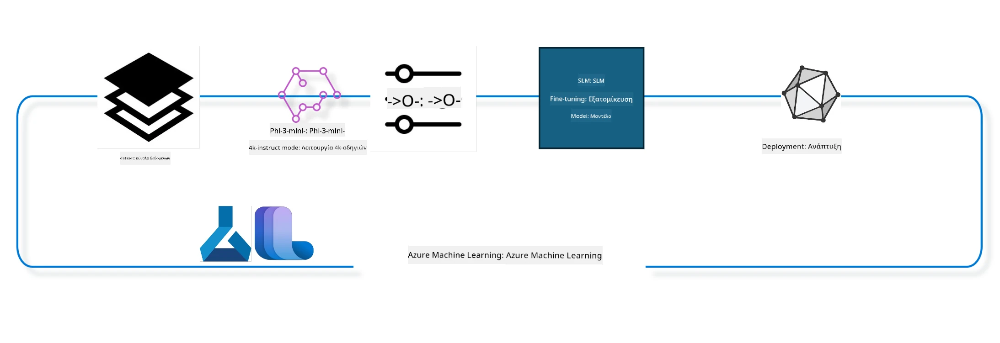

## Πώς να χρησιμοποιήσετε τα components συμπλήρωσης συνομιλίας από το Azure ML system registry για την προσαρμογή ενός μοντέλου

Σε αυτό το παράδειγμα θα πραγματοποιήσουμε fine tuning του μοντέλου Phi-3-mini-4k-instruct για να ολοκληρώσουμε μια συνομιλία ανάμεσα σε 2 άτομα χρησιμοποιώντας το dataset ultrachat_200k.



Το παράδειγμα θα σας δείξει πώς να πραγματοποιήσετε fine tuning χρησιμοποιώντας το Azure ML SDK και Python και στη συνέχεια να αναπτύξετε το fine tuned μοντέλο σε ένα online endpoint για πραγματικού χρόνου inferencing.

### Δεδομένα εκπαίδευσης

Θα χρησιμοποιήσουμε το dataset ultrachat_200k. Πρόκειται για μια έντονα φιλτραρισμένη έκδοση του dataset UltraChat και χρησιμοποιήθηκε για την εκπαίδευση του Zephyr-7B-β, ενός state of the art 7b chat μοντέλου.

### Μοντέλο

Θα χρησιμοποιήσουμε το μοντέλο Phi-3-mini-4k-instruct για να δείξουμε πώς μπορεί ο χρήστης να προσαρμόσει ένα μοντέλο για εργασία συμπλήρωσης συνομιλίας. Αν ανοίξατε αυτό το notebook από μια συγκεκριμένη κάρτα μοντέλου, θυμηθείτε να αντικαταστήσετε το συγκεκριμένο όνομα μοντέλου.

### Εργασίες

- Επιλέξτε ένα μοντέλο για fine tuning.
- Επιλέξτε και εξερευνήστε δεδομένα εκπαίδευσης.
- Διαμορφώστε τη δουλειά fine tuning.
- Εκτελέστε τη δουλειά fine tuning.
- Ανασκοπήστε τα metrics εκπαίδευσης και αξιολόγησης.
- Καταχωρήστε το fine tuned μοντέλο.
- Αναπτύξτε το fine tuned μοντέλο για πραγματικού χρόνου inferencing.
- Καθαρίστε τους πόρους.

## 1. Προετοιμασία προϋποθέσεων

- Εγκαταστήστε τις εξαρτήσεις
- Συνδεθείτε στο AzureML Workspace. Μάθετε περισσότερα στο set up SDK authentication. Αντικαταστήστε τα <WORKSPACE_NAME>, <RESOURCE_GROUP> και <SUBSCRIPTION_ID> παρακάτω.
- Συνδεθείτε στο azureml system registry
- Ορίστε ένα προαιρετικό όνομα πειράματος
- Ελέγξτε ή δημιουργήστε υπολογιστικούς πόρους.

> [!NOTE]
> Απαιτείται ένας και μόνο κόμβος GPU που μπορεί να έχει πολλές κάρτες GPU. Για παράδειγμα, σε έναν κόμβο Standard_NC24rs_v3 υπάρχουν 4 NVIDIA V100 GPUs ενώ σε Standard_NC12s_v3 υπάρχουν 2 NVIDIA V100 GPUs. Ανατρέξτε στην τεκμηρίωση για αυτές τις πληροφορίες. Ο αριθμός των καρτών GPU ανά κόμβο ορίζεται στην παράμετρο gpus_per_node παρακάτω. Η σωστή ρύθμιση αυτής της τιμής θα εξασφαλίσει την αξιοποίηση όλων των GPUs στον κόμβο. Οι συνιστώμενες GPU compute SKUs είναι διαθέσιμες εδώ και εδώ.

### Βιβλιοθήκες Python

Εγκαταστήστε τις εξαρτήσεις εκτελώντας το παρακάτω κελί. Αυτό δεν είναι προαιρετικό βήμα αν τρέχετε σε νέο περιβάλλον.

```bash
pip install azure-ai-ml
pip install azure-identity
pip install datasets==2.9.0
pip install mlflow
pip install azureml-mlflow
```

### Αλληλεπίδραση με Azure ML

1. Αυτό το Python script χρησιμοποιείται για αλληλεπίδραση με την υπηρεσία Azure Machine Learning (Azure ML). Ακολουθεί μια ανάλυση των ενεργειών του:

    - Εισάγει τις απαραίτητες βιβλιοθήκες από τα πακέτα azure.ai.ml, azure.identity και azure.ai.ml.entities. Επίσης, εισάγει το module time.

    - Προσπαθεί να αυθεντικοποιηθεί χρησιμοποιώντας το DefaultAzureCredential(), που παρέχει μια απλοποιημένη εμπειρία αυθεντικοποίησης για γρήγορη ανάπτυξη εφαρμογών που τρέχουν στο Azure cloud. Αν αποτύχει, υποχωρεί στο InteractiveBrowserCredential(), που παρέχει διαδραστικό prompt σύνδεσης.

    - Στη συνέχεια προσπαθεί να δημιουργήσει ένα αντικείμενο MLClient με τη μέθοδο from_config, που διαβάζει τη διαμόρφωση από το προεπιλεγμένο αρχείο ρυθμίσεων (config.json). Αν αποτύχει, δημιουργεί το MLClient παρέχοντας χειροκίνητα subscription_id, resource_group_name, και workspace_name.

    - Δημιουργεί έναν ακόμα MLClient, αυτή τη φορά για το Azure ML registry με όνομα "azureml". Αυτό το registry είναι όπου αποθηκεύονται μοντέλα, pipelines fine-tuning, και περιβάλλοντα.

    - Ορίζει το experiment_name σε "chat_completion_Phi-3-mini-4k-instruct".

    - Δημιουργεί ένα μοναδικό timestamp μετατρέποντας τον τρέχοντα χρόνο (σε δευτερόλεπτα από την εποχή, ως float) σε ακέραιο και μετά σε συμβολοσειρά. Αυτό μπορεί να χρησιμοποιηθεί για τη δημιουργία μοναδικών ονομάτων και εκδόσεων.

    ```python
    # Εισαγωγή των απαραίτητων μονάδων από το Azure ML και το Azure Identity
    from azure.ai.ml import MLClient
    from azure.identity import (
        DefaultAzureCredential,
        InteractiveBrowserCredential,
    )
    from azure.ai.ml.entities import AmlCompute
    import time  # Εισαγωγή της μονάδας χρόνου
    
    # Προσπάθεια αυθεντικοποίησης χρησιμοποιώντας το DefaultAzureCredential
    try:
        credential = DefaultAzureCredential()
        credential.get_token("https://management.azure.com/.default")
    except Exception as ex:  # Εάν το DefaultAzureCredential αποτύχει, χρησιμοποιήστε το InteractiveBrowserCredential
        credential = InteractiveBrowserCredential()
    
    # Προσπάθεια δημιουργίας ενός στιγμιότυπου MLClient χρησιμοποιώντας το προεπιλεγμένο αρχείο ρυθμίσεων
    try:
        workspace_ml_client = MLClient.from_config(credential=credential)
    except:  # Εάν αποτύχει, δημιουργήστε ένα στιγμιότυπο MLClient παρέχοντας τις λεπτομέρειες χειροκίνητα
        workspace_ml_client = MLClient(
            credential,
            subscription_id="<SUBSCRIPTION_ID>",
            resource_group_name="<RESOURCE_GROUP>",
            workspace_name="<WORKSPACE_NAME>",
        )
    
    # Δημιουργήστε άλλο ένα στιγμιότυπο MLClient για το μητρώο Azure ML με όνομα "azureml"
    # Αυτό το μητρώο είναι όπου αποθηκεύονται τα μοντέλα, οι διαδικασίες fine-tuning και τα περιβάλλοντα
    registry_ml_client = MLClient(credential, registry_name="azureml")
    
    # Ορίστε το όνομα του πειράματος
    experiment_name = "chat_completion_Phi-3-mini-4k-instruct"
    
    # Δημιουργήστε ένα μοναδικό χρονικό σήμα που μπορεί να χρησιμοποιηθεί για ονόματα και εκδόσεις που πρέπει να είναι μοναδικά
    timestamp = str(int(time.time()))
    ```

## 2. Επιλέξτε ένα βασικό μοντέλο για fine tuning

1. Το Phi-3-mini-4k-instruct είναι ένα μοντέλο με 3.8 δισεκατομμύρια παραμέτρους, ελαφρύ, state-of-the-art, ανοιχτού κώδικα, που βασίζεται σε δεδομένα εκπαιδευμένα για το Phi-2. Το μοντέλο ανήκει στην οικογένεια μοντέλων Phi-3 και η έκδοση Mini έρχεται σε δύο παραλλαγές, 4K και 128K, που είναι το μήκος πλαισίου (σε tokens) που μπορεί να υποστηρίξει. Πρέπει να προσαρμόσουμε (finetune) το μοντέλο για τον συγκεκριμένο μας σκοπό πριν τη χρήση. Μπορείτε να δείτε αυτά τα μοντέλα στο Model Catalog στο AzureML Studio, φιλτράροντας κατά εργασία chat-completion. Σε αυτό το παράδειγμα, χρησιμοποιούμε το μοντέλο Phi-3-mini-4k-instruct. Αν ανοίξατε αυτό το notebook για διαφορετικό μοντέλο, αντικαταστήστε το όνομα και την έκδοση ανάλογα.

> [!NOTE]
> το χαρακτηριστικό id του μοντέλου. Αυτό θα περαστεί ως είσοδος στη δουλειά fine tuning. Είναι επίσης διαθέσιμο ως πεδίο Asset ID στη σελίδα λεπτομερειών του μοντέλου στο AzureML Studio Model Catalog.

2. Αυτό το Python script αλληλεπιδρά με την υπηρεσία Azure Machine Learning (Azure ML). Ακολουθεί μια ανάλυση των ενεργειών του:

    - Ορίζει το model_name σε "Phi-3-mini-4k-instruct".

    - Χρησιμοποιεί τη μέθοδο get της ιδιότητας models του αντικειμένου registry_ml_client για να ανακτήσει την τελευταία έκδοση του μοντέλου με το συγκεκριμένο όνομα από το Azure ML registry. Η μέθοδος get καλείται με δύο ορίσματα: το όνομα του μοντέλου και μια ετικέτα που υποδεικνύει ότι θα ανακτηθεί η τελευταία έκδοση του μοντέλου.

    - Εκτυπώνει μήνυμα στην κονσόλα που δηλώνει το όνομα, την έκδοση και το id του μοντέλου που θα χρησιμοποιηθεί για fine tuning. Η μέθοδος format της συμβολοσειράς χρησιμοποιείται για να εισαχθούν το όνομα, η έκδοση και το id του μοντέλου στο μήνυμα. Το όνομα, η έκδοση και το id προσπελαύνονται ως ιδιότητες του αντικειμένου foundation_model.

    ```python
    # Ορίστε το όνομα του μοντέλου
    model_name = "Phi-3-mini-4k-instruct"
    
    # Λάβετε την πιο πρόσφατη έκδοση του μοντέλου από το μητρώο Azure ML
    foundation_model = registry_ml_client.models.get(model_name, label="latest")
    
    # Εκτυπώστε το όνομα του μοντέλου, την έκδοση και το αναγνωριστικό
    # Αυτές οι πληροφορίες είναι χρήσιμες για την παρακολούθηση και τον εντοπισμό σφαλμάτων
    print(
        "\n\nUsing model name: {0}, version: {1}, id: {2} for fine tuning".format(
            foundation_model.name, foundation_model.version, foundation_model.id
        )
    )
    ```

## 3. Δημιουργήστε ένα υπολογιστικό πόρο για χρήση με τη δουλειά

Η δουλειά fine tuning λειτουργεί ΜΟΝΟ με GPU υπολογισμούς. Το μέγεθος του υπολογιστικού πόρου εξαρτάται από το μέγεθος του μοντέλου και σε πολλές περιπτώσεις είναι δύσκολο να επιλεγεί το σωστό μέγεθος για τη δουλειά. Σε αυτό το κελί, καθοδηγούμε τον χρήστη να επιλέξει το σωστό compute.

> [!NOTE]
> Οι υπολογιστικοί πόροι που αναφέρονται παρακάτω λειτουργούν με την πιο βελτιστοποιημένη διαμόρφωση. Οποιεσδήποτε αλλαγές στη διαμόρφωση μπορεί να προκαλέσουν σφάλμα Cuda Out Of Memory. Σε αυτές τις περιπτώσεις, δοκιμάστε να αναβαθμίσετε το compute σε μεγαλύτερο μέγεθος.

> [!NOTE]
> Κατά την επιλογή του compute_cluster_size παρακάτω, βεβαιωθείτε ότι ο υπολογιστικός πόρος είναι διαθέσιμος στην ομάδα πόρων σας. Αν κάποιο compute δεν είναι διαθέσιμο, μπορείτε να ζητήσετε πρόσβαση στους υπολογιστικούς πόρους.

### Έλεγχος Μοντέλου για Υποστήριξη Fine Tuning

1. Αυτό το Python script αλληλεπιδρά με ένα μοντέλο Azure Machine Learning (Azure ML). Ακολουθεί μια ανάλυση των ενεργειών του:

    - Εισάγει το module ast, που παρέχει λειτουργίες για την επεξεργασία δέντρων σύνταξης Python.

    - Ελέγχει αν το αντικείμενο foundation_model (που αναπαριστά ένα μοντέλο στο Azure ML) έχει την ετικέτα finetune_compute_allow_list. Οι ετικέτες στο Azure ML είναι ζεύγη κλειδιού-τιμής που μπορείτε να δημιουργήσετε και να χρησιμοποιήσετε για φιλτράρισμα και ταξινόμηση μοντέλων.

    - Αν η ετικέτα finetune_compute_allow_list υπάρχει, χρησιμοποιεί τη συνάρτηση ast.literal_eval για να μετατρέψει με ασφάλεια την τιμή της ετικέτας (μια συμβολοσειρά) σε λίστα Python. Η λίστα αυτή ανατίθεται στη μεταβλητή computes_allow_list. Μετά εκτυπώνει μήνυμα που υποδεικνύει ότι πρέπει να επιλεχθεί compute από τη λίστα.

    - Αν η ετικέτα finetune_compute_allow_list δεν υπάρχει, ορίζει την computes_allow_list σε None και εκτυπώνει μήνυμα που ενημερώνει ότι η ετικέτα δεν υπάρχει στις ετικέτες του μοντέλου.

    - Συνολικά, το script ελέγχει για την ύπαρξη συγκεκριμένης ετικέτας στα μεταδεδομένα του μοντέλου, μετατρέπει την τιμή σε λίστα αν υπάρχει, και παρέχει ανάλογη ενημέρωση.

    ```python
    # Εισαγωγή του module ast, το οποίο παρέχει συναρτήσεις για την επεξεργασία δέντρων της αφηρημένης σύνταξης της Python
    import ast
    
    # Έλεγχος εάν το tag 'finetune_compute_allow_list' υπάρχει στα tags του μοντέλου
    if "finetune_compute_allow_list" in foundation_model.tags:
        # Εάν το tag υπάρχει, χρήση του ast.literal_eval για ασφαλή ανάλυση της τιμής του tag (μιας συμβολοσειράς) σε λίστα της Python
        computes_allow_list = ast.literal_eval(
            foundation_model.tags["finetune_compute_allow_list"]
        )  # Μετατροπή συμβολοσειράς σε λίστα της Python
        # Εκτύπωση ενός μηνύματος που υποδεικνύει ότι πρέπει να δημιουργηθεί μια υπολογιστική μονάδα από τη λίστα
        print(f"Please create a compute from the above list - {computes_allow_list}")
    else:
        # Εάν το tag δεν υπάρχει, ορισμός του computes_allow_list σε None
        computes_allow_list = None
        # Εκτύπωση ενός μηνύματος που υποδεικνύει ότι το tag 'finetune_compute_allow_list' δεν αποτελεί μέρος των tags του μοντέλου
        print("`finetune_compute_allow_list` is not part of model tags")
    ```

### Έλεγχος Compute Instance

1. Αυτό το Python script αλληλεπιδρά με την υπηρεσία Azure Machine Learning (Azure ML) και πραγματοποιεί πολλούς ελέγχους σε έναν compute instance. Ακολουθεί μια ανάλυση των ενεργειών του:

    - Προσπαθεί να ανακτήσει τον compute instance με το όνομα αποθηκευμένο στο compute_cluster από το Azure ML workspace. Αν η κατάσταση προμήθειας (provisioning state) του compute instance είναι "failed", προκαλεί ValueError.

    - Ελέγχει αν η μεταβλητή computes_allow_list δεν είναι None. Αν ισχύει, μετατρέπει όλα τα μεγέθη compute στη λίστα σε πεζά και ελέγχει αν το μέγεθος του τρέχοντος compute instance είναι στη λίστα. Αν όχι, προκαλεί ValueError.

    - Αν η computes_allow_list είναι None, ελέγχει αν το μέγεθος του compute instance βρίσκεται σε λίστα μη υποστηριζόμενων μεγεθών GPU VM. Αν ναι, προκαλεί ValueError.

    - Ανακτά λίστα όλων των διαθέσιμων μεγεθών compute στον χώρο εργασίας (workspace). Διατρέχει την λίστα και για κάθε μέγεθος ελέγχει αν το όνομά του ταιριάζει με το μέγεθος του τρέχοντος compute instance. Αν ναι, ανακτά τον αριθμό των GPUs για αυτό το μέγεθος compute και ορίζει την gpu_count_found σε True.

    - Αν το gpu_count_found είναι True, εκτυπώνει τον αριθμό των GPUs στο compute instance. Αν όχι, προκαλεί ValueError.

    - Συνολικά, το script πραγματοποιεί πολλούς ελέγχους σε έναν compute instance σε Azure ML workspace, συμπεριλαμβανομένου ελέγχου κατάστασης, έλεγχου μεγέθους υπολογιστικού πόρου έναντι λίστας επιτρεπτών ή μη, και αριθμού GPUs.

    ```python
    # Εκτύπωσε το μήνυμα εξαίρεσης
    print(e)
    # Ανέβασε ValueError αν το μέγεθος υπολογισμού δεν είναι διαθέσιμο στον χώρο εργασίας
    raise ValueError(
        f"WARNING! Compute size {compute_cluster_size} not available in workspace"
    )
    
    # Ανάκτησε το παράδειγμα υπολογισμού από το χώρο εργασίας Azure ML
    compute = workspace_ml_client.compute.get(compute_cluster)
    # Έλεγξε αν η κατάσταση παροχής του παραδείγματος υπολογισμού είναι "failed"
    if compute.provisioning_state.lower() == "failed":
        # Ανέβασε ValueError αν η κατάσταση παροχής είναι "failed"
        raise ValueError(
            f"Provisioning failed, Compute '{compute_cluster}' is in failed state. "
            f"please try creating a different compute"
        )
    
    # Έλεγξε αν το computes_allow_list δεν είναι None
    if computes_allow_list is not None:
        # Μετατροπή όλων των μεγεθών υπολογισμού στο computes_allow_list σε πεζά γράμματα
        computes_allow_list_lower_case = [x.lower() for x in computes_allow_list]
        # Έλεγξε αν το μέγεθος του παραδείγματος υπολογισμού είναι στο computes_allow_list_lower_case
        if compute.size.lower() not in computes_allow_list_lower_case:
            # Ανέβασε ValueError αν το μέγεθος του παραδείγματος υπολογισμού δεν είναι στο computes_allow_list_lower_case
            raise ValueError(
                f"VM size {compute.size} is not in the allow-listed computes for finetuning"
            )
    else:
        # Ορισμός λίστας μη υποστηριζόμενων μεγεθών GPU VM
        unsupported_gpu_vm_list = [
            "standard_nc6",
            "standard_nc12",
            "standard_nc24",
            "standard_nc24r",
        ]
        # Έλεγξε αν το μέγεθος του παραδείγματος υπολογισμού είναι στη λίστα unsupported_gpu_vm_list
        if compute.size.lower() in unsupported_gpu_vm_list:
            # Ανέβασε ValueError αν το μέγεθος του παραδείγματος υπολογισμού είναι στη λίστα unsupported_gpu_vm_list
            raise ValueError(
                f"VM size {compute.size} is currently not supported for finetuning"
            )
    
    # Αρχικοποίηση σημαίας για έλεγχο αν βρέθηκε ο αριθμός των GPUs στο παράδειγμα υπολογισμού
    gpu_count_found = False
    # Ανάκτησε λίστα όλων των διαθέσιμων μεγεθών υπολογισμού στον χώρο εργασίας
    workspace_compute_sku_list = workspace_ml_client.compute.list_sizes()
    available_sku_sizes = []
    # Επανάλαβε πάνω στη λίστα διαθέσιμων μεγεθών υπολογισμού
    for compute_sku in workspace_compute_sku_list:
        available_sku_sizes.append(compute_sku.name)
        # Έλεγξε αν το όνομα του μεγέθους υπολογισμού ταιριάζει με το μέγεθος του παραδείγματος υπολογισμού
        if compute_sku.name.lower() == compute.size.lower():
            # Αν ναι, ανάκτησε τον αριθμό των GPUs για το συγκεκριμένο μέγεθος υπολογισμού και ορισμός gpu_count_found σε True
            gpus_per_node = compute_sku.gpus
            gpu_count_found = True
    # Αν το gpu_count_found είναι True, εκτύπωσε τον αριθμό των GPUs στο παράδειγμα υπολογισμού
    if gpu_count_found:
        print(f"Number of GPU's in compute {compute.size}: {gpus_per_node}")
    else:
        # Αν το gpu_count_found είναι False, ανέβασε ValueError
        raise ValueError(
            f"Number of GPU's in compute {compute.size} not found. Available skus are: {available_sku_sizes}."
            f"This should not happen. Please check the selected compute cluster: {compute_cluster} and try again."
        )
    ```

## 4. Επιλέξτε το dataset για fine tuning του μοντέλου

1. Χρησιμοποιούμε το dataset ultrachat_200k. Το dataset έχει τέσσερα διαμερίσματα (splits), κατάλληλα για Supervised fine-tuning (sft).
Generation ranking (gen). Ο αριθμός των παραδειγμάτων ανά διαμέρισμα εμφανίζεται ως εξής:

    ```bash
    train_sft test_sft  train_gen  test_gen
    207865  23110  256032  28304
    ```

1. Τα επόμενα κελιά δείχνουν βασική προετοιμασία δεδομένων για fine tuning:

### Οπτικοποίηση μερικών γραμμών δεδομένων

Θέλουμε αυτό το δείγμα να τρέξει γρήγορα, οπότε αποθηκεύστε τα αρχεία train_sft, test_sft που περιέχουν το 5% των ήδη περικομμένων γραμμών. Αυτό σημαίνει ότι το fine tuned μοντέλο θα έχει χαμηλότερη ακρίβεια, επομένως δεν πρέπει να χρησιμοποιείται σε πραγματικές εφαρμογές.
Το download-dataset.py χρησιμοποιείται για να κατεβάσουμε το dataset ultrachat_200k και να το μετατρέψουμε σε μορφή που μπορεί να καταναλωθεί από pipeline fine tuning. Επίσης, καθώς το dataset είναι μεγάλο, εδώ έχουμε μόνο μέρος του.

1. Η εκτέλεση του παρακάτω script κατεβάζει μόνο το 5% των δεδομένων. Αυτό μπορεί να αυξηθεί αλλάζοντας την παράμετρο dataset_split_pc στο επιθυμητό ποσοστό.

> [!NOTE]
> Κάποια γλωσσικά μοντέλα έχουν διαφορετικούς κωδικούς γλώσσας και κατά συνέπεια τα ονόματα των στηλών στο dataset πρέπει να αντανακλούν το ίδιο.

1. Να ένα παράδειγμα του πώς θα πρέπει να είναι τα δεδομένα
Το dataset συμπλήρωσης συνομιλίας αποθηκεύεται σε μορφή parquet με κάθε εγγραφή να χρησιμοποιεί το ακόλουθο σχήμα:

    - Πρόκειται για ένα JSON (JavaScript Object Notation) έγγραφο, που είναι ένα δημοφιλές φορμά ανταλλαγής δεδομένων. Δεν είναι εκτελέσιμο κώδικα, αλλά ένας τρόπος αποθήκευσης και μεταφοράς δεδομένων. Εδώ είναι μια ανάλυση της δομής του:

    - "prompt": Αυτό το κλειδί περιέχει μια συμβολοσειρά που αντιπροσωπεύει μια εργασία ή ερώτηση προς τον AI βοηθό.

    - "messages": Αυτό το κλειδί περιέχει έναν πίνακα αντικειμένων. Κάθε αντικείμενο αντιπροσωπεύει μήνυμα σε μια συνομιλία μεταξύ χρήστη και AI βοηθού. Κάθε μήνυμα έχει δύο κλειδιά:

    - "content": Περιέχει τη συμβολοσειρά με το περιεχόμενο του μηνύματος.
    - "role": Περιέχει τη συμβολοσειρά που προσδιορίζει τον ρόλο του αποστολέα του μηνύματος. Μπορεί να είναι "user" ή "assistant".
    - "prompt_id": Περιέχει ένα μοναδικό αναγνωριστικό για το prompt.

1. Σε αυτό το συγκεκριμένο JSON έγγραφο, αναπαρίσταται μια συνομιλία όπου ένας χρήστης ζητά από τον AI βοηθό να δημιουργήσει έναν πρωταγωνιστή για μια δυστοπική ιστορία. Ο βοηθός απαντά, και ο χρήστης ζητά περισσότερες λεπτομέρειες. Ο βοηθός συμφωνεί να δώσει περισσότερες λεπτομέρειες. Η συνολική συνομιλία συνδέεται με ένα συγκεκριμένο prompt id.

    ```python
    {
        // The task or question posed to an AI assistant
        "prompt": "Create a fully-developed protagonist who is challenged to survive within a dystopian society under the rule of a tyrant. ...",
        
        // An array of objects, each representing a message in a conversation between a user and an AI assistant
        "messages":[
            {
                // The content of the user's message
                "content": "Create a fully-developed protagonist who is challenged to survive within a dystopian society under the rule of a tyrant. ...",
                // The role of the entity that sent the message
                "role": "user"
            },
            {
                // The content of the assistant's message
                "content": "Name: Ava\n\n Ava was just 16 years old when the world as she knew it came crashing down. The government had collapsed, leaving behind a chaotic and lawless society. ...",
                // The role of the entity that sent the message
                "role": "assistant"
            },
            {
                // The content of the user's message
                "content": "Wow, Ava's story is so intense and inspiring! Can you provide me with more details.  ...",
                // The role of the entity that sent the message
                "role": "user"
            }, 
            {
                // The content of the assistant's message
                "content": "Certainly! ....",
                // The role of the entity that sent the message
                "role": "assistant"
            }
        ],
        
        // A unique identifier for the prompt
        "prompt_id": "d938b65dfe31f05f80eb8572964c6673eddbd68eff3db6bd234d7f1e3b86c2af"
    }
    ```

### Κατέβασμα Δεδομένων

1. Αυτό το Python script χρησιμοποιείται για να κατεβάσει ένα dataset χρησιμοποιώντας ένα βοηθητικό script ονόματι download-dataset.py. Ακολουθεί μια ανάλυση των ενεργειών του:

    - Εισάγει το module os, που παρέχει φορητό τρόπο χρήσης λειτουργιών εξαρτημένων από το λειτουργικό σύστημα.

    - Χρησιμοποιεί τη συνάρτηση os.system για να τρέξει το download-dataset.py στο shell με συγκεκριμένα ορίσματα γραμμής εντολών. Τα ορίσματα καθορίζουν το dataset προς λήψη (HuggingFaceH4/ultrachat_200k), τον φάκελο λήψης (ultrachat_200k_dataset), και το ποσοστό διαχωρισμού του dataset (5). Η os.system επιστρέφει τον κωδικό εξόδου της εντολής που εκτέλεσε. Αυτός αποθηκεύεται στη μεταβλητή exit_status.

    - Ελέγχει αν το exit_status δεν είναι 0. Σε Unix-like λειτουργικά συστήματα, κωδικός εξόδου 0 σημαίνει επιτυχία, ενώ οποιοσδήποτε άλλος αριθμός σφάλμα. Αν το exit_status δεν είναι 0, προκαλεί Exception με μήνυμα λάθους για το κατέβασμα dataset.

    - Συνοπτικά, το script τρέχει εντολή για να κατεβάσει dataset μέσω βοηθητικού script και προκαλεί εξαίρεση αν η εντολή αποτύχει.

    ```python
    # Εισαγωγή του module os, το οποίο παρέχει έναν τρόπο χρήσης λειτουργιών που εξαρτώνται από το λειτουργικό σύστημα
    import os
    
    # Χρησιμοποιήστε τη συνάρτηση os.system για να εκτελέσετε το script download-dataset.py στο κέλυφος με συγκεκριμένα επιχειρήματα γραμμής εντολών
    # Τα επιχειρήματα καθορίζουν το σύνολο δεδομένων που θα κατέβει (HuggingFaceH4/ultrachat_200k), τον κατάλογο όπου θα αποθηκευτεί (ultrachat_200k_dataset) και το ποσοστό του συνόλου δεδομένων για διαχωρισμό (5)
    # Η συνάρτηση os.system επιστρέφει την κατάσταση εξόδου της εκτελεσθείσας εντολής· αυτή η κατάσταση αποθηκεύεται στη μεταβλητή exit_status
    exit_status = os.system(
        "python ./download-dataset.py --dataset HuggingFaceH4/ultrachat_200k --download_dir ultrachat_200k_dataset --dataset_split_pc 5"
    )
    
    # Ελέγξτε αν η exit_status δεν είναι 0
    # Σε λειτουργικά συστήματα τύπου Unix, μια κατάσταση εξόδου 0 συνήθως υποδεικνύει ότι μια εντολή ήταν επιτυχής, ενώ οποιοσδήποτε άλλος αριθμός υποδεικνύει σφάλμα
    # Εάν η exit_status δεν είναι 0, προκαλέστε μια Exception με μήνυμα που υποδηλώνει ότι υπήρξε σφάλμα κατά τη λήψη του συνόλου δεδομένων
    if exit_status != 0:
        raise Exception("Error downloading dataset")
    ```

### Φόρτωση Δεδομένων σε DataFrame
1. Αυτό το σενάριο Python φορτώνει ένα αρχείο JSON Lines σε ένα pandas DataFrame και εμφανίζει τις πρώτες 5 γραμμές. Ακολουθεί ανάλυση του τι κάνει:

    - Εισάγει τη βιβλιοθήκη pandas, η οποία είναι μια ισχυρή βιβλιοθήκη χειρισμού και ανάλυσης δεδομένων.

    - Ορίζει το μέγιστο πλάτος στήλης για τις επιλογές εμφάνισης του pandas σε 0. Αυτό σημαίνει ότι το πλήρες κείμενο κάθε στήλης θα εμφανίζεται χωρίς περικοπή όταν εκτυπωθεί το DataFrame.

    - Χρησιμοποιεί τη συνάρτηση pd.read_json για να φορτώσει το αρχείο train_sft.jsonl από τον κατάλογο ultrachat_200k_dataset σε ένα DataFrame. Το όρισμα lines=True υποδηλώνει ότι το αρχείο είναι σε μορφή JSON Lines, όπου κάθε γραμμή είναι ένα ξεχωριστό JSON αντικείμενο.

    - Χρησιμοποιεί τη μέθοδο head για να εμφανίσει τις πρώτες 5 γραμμές του DataFrame. Αν το DataFrame έχει λιγότερες από 5 γραμμές, θα εμφανίσει όλες.

    - Εν ολίγοις, αυτό το σενάριο φορτώνει ένα αρχείο JSON Lines σε ένα DataFrame και εμφανίζει τις πρώτες 5 γραμμές με πλήρες κείμενο στηλών.
    
    ```python
    # Εισάγετε τη βιβλιοθήκη pandas, η οποία είναι μια ισχυρή βιβλιοθήκη χειρισμού και ανάλυσης δεδομένων
    import pandas as pd
    
    # Ορίστε το μέγιστο πλάτος στήλης για τις επιλογές εμφάνισης του pandas σε 0
    # Αυτό σημαίνει ότι το πλήρες κείμενο κάθε στήλης θα εμφανίζεται χωρίς περικοπή όταν εκτυπωθεί το DataFrame
    pd.set_option("display.max_colwidth", 0)
    
    # Χρησιμοποιήστε τη συνάρτηση pd.read_json για να φορτώσετε το αρχείο train_sft.jsonl από τον φάκελο ultrachat_200k_dataset σε ένα DataFrame
    # Το όρισμα lines=True υποδεικνύει ότι το αρχείο είναι σε μορφή JSON Lines, όπου κάθε γραμμή είναι ένα ξεχωριστό αντικείμενο JSON
    df = pd.read_json("./ultrachat_200k_dataset/train_sft.jsonl", lines=True)
    
    # Χρησιμοποιήστε τη μέθοδο head για να εμφανίσετε τις πρώτες 5 γραμμές του DataFrame
    # Εάν το DataFrame έχει λιγότερες από 5 γραμμές, θα εμφανίσει όλες τις γραμμές του
    df.head()
    ```

## 5. Υποβολή της εργασίας fine tuning χρησιμοποιώντας το μοντέλο και τα δεδομένα ως είσοδοι

Δημιουργήστε την εργασία που χρησιμοποιεί το στοιχείο της γραμμής ολοκλήρωσης συνομιλίας (chat-completion pipeline). Μάθετε περισσότερα για όλες τις υποστηριζόμενες παραμέτρους για το fine tuning.

### Ορισμός παραμέτρων finetune

1. Οι παράμετροι finetune μπορούν να ομαδοποιηθούν σε 2 κατηγορίες - παράμετροι εκπαίδευσης, παράμετροι βελτιστοποίησης

1. Οι παράμετροι εκπαίδευσης ορίζουν τις πτυχές της εκπαίδευσης όπως -

    - Ο βελτιστοποιητής, ο προγραμματιστής (scheduler) που θα χρησιμοποιηθούν
    - Ο μετρικός δείκτης που θα βελτιστοποιήσει το fine-tune
    - Ο αριθμός των βημάτων εκπαίδευσης και το μέγεθος batch, κλπ.
    - Οι παράμετροι βελτιστοποίησης βοηθούν στη βελτιστοποίηση της μνήμης GPU και στη χρήση των υπολογιστικών πόρων με αποτελεσματικότητα.

1. Παρακάτω ακολουθούν μερικές από τις παραμέτρους που ανήκουν σε αυτή την κατηγορία. Οι παράμετροι βελτιστοποίησης διαφέρουν για κάθε μοντέλο και πακετάρονται με το μοντέλο για να χειριστούν αυτές τις διαφορές.

    - Ενεργοποίηση των deepspeed και LoRA
    - Ενεργοποίηση mixed precision training
    - Ενεργοποίηση multi-node training

> [!NOTE]
> Η επιβλεπόμενη εκπαίδευση (Supervised finetuning) μπορεί να οδηγήσει σε απώλεια ευθυγράμμισης ή καταστροφική λήθη. Συνιστούμε να ελέγχετε για αυτό το ζήτημα και να εκτελείτε στάδιο ευθυγράμμισης μετά το fine-tune.

### Παράμετροι Fine Tuning

1. Αυτό το σενάριο Python ορίζει παραμέτρους για το fine-tuning ενός μοντέλου μηχανικής μάθησης. Ακολουθεί ανάλυση του τι κάνει:

    - Ορίζει τις προεπιλεγμένες παραμέτρους εκπαίδευσης όπως ο αριθμός εποχών εκπαίδευσης, το μέγεθος batch για εκπαίδευση και αξιολόγηση, το ρυθμό μάθησης και τον τύπο προγραμματιστή ρυθμού μάθησης (scheduler).

    - Ορίζει τις προεπιλεγμένες παραμέτρους βελτιστοποίησης όπως αν θα εφαρμοστεί Layer-wise Relevance Propagation (LoRa) και DeepSpeed, και το στάδιο DeepSpeed.

    - Συνδυάζει τις παραμέτρους εκπαίδευσης και βελτιστοποίησης σε ένα ενιαίο λεξικό που ονομάζεται finetune_parameters.

    - Ελέγχει αν το foundation_model έχει προεπιλεγμένες παραμέτρους ειδικές για το μοντέλο. Αν ναι, εμφανίζει ένα μήνυμα προειδοποίησης και ενημερώνει το λεξικό finetune_parameters με αυτές τις προεπιλεγμένες παραμέτρους ειδικές για το μοντέλο. Η συνάρτηση ast.literal_eval χρησιμοποιείται για τη μετατροπή των προεπιλεγμένων παραμέτρων από συμβολοσειρά σε λεξικό Python.

    - Εκτυπώνει το τελικό σύνολο παραμέτρων fine-tuning που θα χρησιμοποιηθούν για την εκτέλεση.

    - Εν ολίγοις, αυτό το σενάριο ορίζει και εμφανίζει τις παραμέτρους για το fine-tuning ενός μοντέλου μηχανικής μάθησης, με τη δυνατότητα να αντικατασταθούν οι προεπιλεγμένες παράμετροι από ειδικές για το μοντέλο.

    ```python
    # Ορισμός των προεπιλεγμένων παραμέτρων εκπαίδευσης όπως ο αριθμός των εποχών εκπαίδευσης, τα μεγέθη παρτίδων για εκπαίδευση και αξιολόγηση, ο ρυθμός εκμάθησης και ο τύπος προγραμματιστή ρυθμού εκμάθησης
    training_parameters = dict(
        num_train_epochs=3,
        per_device_train_batch_size=1,
        per_device_eval_batch_size=1,
        learning_rate=5e-6,
        lr_scheduler_type="cosine",
    )
    
    # Ορισμός των προεπιλεγμένων παραμέτρων βελτιστοποίησης όπως το αν θα εφαρμοστεί η Layer-wise Relevance Propagation (LoRa) και το DeepSpeed, και το στάδιο του DeepSpeed
    optimization_parameters = dict(
        apply_lora="true",
        apply_deepspeed="true",
        deepspeed_stage=2,
    )
    
    # Συνδυασμός των παραμέτρων εκπαίδευσης και βελτιστοποίησης σε ένα ενιαίο λεξικό που ονομάζεται finetune_parameters
    finetune_parameters = {**training_parameters, **optimization_parameters}
    
    # Έλεγχος αν το foundation_model έχει προεπιλεγμένες παραμέτρους ειδικές για το μοντέλο
    # Εάν έχει, εκτύπωση μηνύματος προειδοποίησης και ενημέρωση του λεξικού finetune_parameters με αυτές τις προεπιλεγμένες παραμέτρους ειδικές για το μοντέλο
    # Η συνάρτηση ast.literal_eval χρησιμοποιείται για τη μετατροπή των προεπιλεγμένων παραμέτρων ειδικών για το μοντέλο από συμβολοσειρά σε λεξικό Python
    if "model_specific_defaults" in foundation_model.tags:
        print("Warning! Model specific defaults exist. The defaults could be overridden.")
        finetune_parameters.update(
            ast.literal_eval(  # μετατροπή συμβολοσειράς σε λεξικό Python
                foundation_model.tags["model_specific_defaults"]
            )
        )
    
    # Εκτύπωση του τελικού συνόλου παραμέτρων fine-tuning που θα χρησιμοποιηθούν για την εκτέλεση
    print(
        f"The following finetune parameters are going to be set for the run: {finetune_parameters}"
    )
    ```

### Εκπαιδευτικό Pipeline

1. Αυτό το σενάριο Python ορίζει μια συνάρτηση για τη δημιουργία ενός ονόματος εμφάνισης για μια εκπαιδευτική ροή μηχανικής μάθησης (training pipeline), και στη συνέχεια καλεί αυτή τη συνάρτηση για να δημιουργήσει και να εκτυπώσει το όνομα.

1. Ορίζεται η συνάρτηση get_pipeline_display_name. Αυτή η συνάρτηση δημιουργεί ένα όνομα εμφάνισης βάσει διαφόρων παραμέτρων που σχετίζονται με το εκπαιδευτικό pipeline.

1. Μέσα στη συνάρτηση, υπολογίζεται το συνολικό μέγεθος batch πολλαπλασιάζοντας το μέγεθος batch ανά συσκευή, τα βήματα συσσώρευσης βαθμίδας, τον αριθμό GPUs ανά κόμβο, και τον αριθμό κόμβων που χρησιμοποιούνται για το fine-tuning.

1. Λαμβάνονται διάφορες άλλες παράμετροι όπως ο τύπος scheduler ρυθμού μάθησης, αν εφαρμόζεται DeepSpeed, το στάδιο DeepSpeed, αν εφαρμόζεται Layer-wise Relevance Propagation (LoRa), το όριο αριθμού διατηρούμενων checkpoints μοντέλου και το μέγιστο μήκος ακολουθίας.

1. Δημιουργείται μια συμβολοσειρά που περιλαμβάνει όλες αυτές τις παραμέτρους, διαχωρισμένες με παύλες. Αν εφαρμόζεται DeepSpeed ή LoRa, η συμβολοσειρά περιλαμβάνει "ds" ακολουθούμενο από το στάδιο DeepSpeed ή "lora" αντίστοιχα. Αν όχι, περιλαμβάνει "nods" ή "nolora" αντίστοιχα.

1. Η συνάρτηση επιστρέφει αυτή τη συμβολοσειρά, που χρησιμεύει ως όνομα εμφάνισης για το εκπαιδευτικό pipeline.

1. Μετά τον ορισμό της συνάρτησης, αυτή καλείται για να δημιουργήσει το όνομα εμφάνισης, το οποίο και εκτυπώνεται.

1. Εν ολίγοις, αυτό το σενάριο δημιουργεί ένα όνομα εμφάνισης για μια εκπαιδευτική ροή μηχανικής μάθησης βασισμένο σε διάφορες παραμέτρους, και έπειτα εκτυπώνει αυτό το όνομα.

    ```python
    # Ορίστε μια συνάρτηση για τη δημιουργία ενός ονόματος εμφάνισης για τη διαδρομή εκπαίδευσης
    def get_pipeline_display_name():
        # Υπολογίστε το συνολικό μέγεθος παρτίδας πολλαπλασιάζοντας το μέγεθος παρτίδας ανά συσκευή, τον αριθμό βημάτων συσσώρευσης κλίσης, τον αριθμό GPUs ανά κόμβο και τον αριθμό των κόμβων που χρησιμοποιούνται για fine-tuning
        batch_size = (
            int(finetune_parameters.get("per_device_train_batch_size", 1))
            * int(finetune_parameters.get("gradient_accumulation_steps", 1))
            * int(gpus_per_node)
            * int(finetune_parameters.get("num_nodes_finetune", 1))
        )
        # Ανάκτηση του τύπου προγραμματιστή ρυθμού μάθησης
        scheduler = finetune_parameters.get("lr_scheduler_type", "linear")
        # Ανάκτηση αν εφαρμόζεται το DeepSpeed
        deepspeed = finetune_parameters.get("apply_deepspeed", "false")
        # Ανάκτηση του σταδίου DeepSpeed
        ds_stage = finetune_parameters.get("deepspeed_stage", "2")
        # Αν εφαρμόζεται το DeepSpeed, συμπεριλάβετε "ds" ακολουθούμενο από το στάδιο DeepSpeed στο όνομα εμφάνισης· αν όχι, συμπεριλάβετε "nods"
        if deepspeed == "true":
            ds_string = f"ds{ds_stage}"
        else:
            ds_string = "nods"
        # Ανάκτηση αν εφαρμόζεται η αποσύνθεση σχετικότητας ανά στρώμα (Layer-wise Relevance Propagation - LoRa)
        lora = finetune_parameters.get("apply_lora", "false")
        # Αν εφαρμόζεται το LoRa, συμπεριλάβετε "lora" στο όνομα εμφάνισης· αν όχι, συμπεριλάβετε "nolora"
        if lora == "true":
            lora_string = "lora"
        else:
            lora_string = "nolora"
        # Ανάκτηση του ορίου στον αριθμό των αποθηκεύσεων μοντέλου που διατηρούνται
        save_limit = finetune_parameters.get("save_total_limit", -1)
        # Ανάκτηση του μέγιστου μήκους ακολουθίας
        seq_len = finetune_parameters.get("max_seq_length", -1)
        # Κατασκευή του ονόματος εμφάνισης με τη σύνδεση όλων αυτών των παραμέτρων, χωρισμένων με παύλες
        return (
            model_name
            + "-"
            + "ultrachat"
            + "-"
            + f"bs{batch_size}"
            + "-"
            + f"{scheduler}"
            + "-"
            + ds_string
            + "-"
            + lora_string
            + f"-save_limit{save_limit}"
            + f"-seqlen{seq_len}"
        )
    
    # Καλέστε τη συνάρτηση για να δημιουργήσετε το όνομα εμφάνισης
    pipeline_display_name = get_pipeline_display_name()
    # Εκτύπωση του ονόματος εμφάνισης
    print(f"Display name used for the run: {pipeline_display_name}")
    ```

### Διαμόρφωση Pipeline

Αυτό το σενάριο Python ορίζει και διαμορφώνει ένα pipeline μηχανικής μάθησης χρησιμοποιώντας το Azure Machine Learning SDK. Ακολουθεί ανάλυση του τι κάνει:

1. Εισάγει τα απαραίτητα modules από το Azure AI ML SDK.

1. Ανακτά ένα στοιχείο pipeline με το όνομα "chat_completion_pipeline" από το μητρώο.

1. Ορίζει μια εργασία pipeline χρησιμοποιώντας το διακοσμητή `@pipeline` και τη συνάρτηση `create_pipeline`. Το όνομα του pipeline ορίζεται σε `pipeline_display_name`.

1. Μέσα στη συνάρτηση `create_pipeline`, αρχικοποιεί το ανακτηθέν στοιχείο pipeline με διάφορες παραμέτρους, συμπεριλαμβανομένης της διαδρομής μοντέλου, υπολογιστικών clusters για διάφορα στάδια, διαχωρισμών συνόλων δεδομένων για εκπαίδευση και δοκιμή, αριθμό GPU για fine-tuning και άλλες παραμέτρους fine-tuning.

1. Χαρτογραφεί την έξοδο της εργασίας fine-tuning στην έξοδο της εργασίας pipeline. Αυτό γίνεται ώστε το fine-tuned μοντέλο να μπορεί να καταχωρηθεί εύκολα, κάτι που απαιτείται για την ανάπτυξη του μοντέλου σε online ή batch endpoint.

1. Δημιουργεί ένα στιγμιότυπο του pipeline καλώντας τη συνάρτηση `create_pipeline`.

1. Ορίζει την επιλογή `force_rerun` του pipeline σε `True`, που σημαίνει ότι δεν θα χρησιμοποιηθούν αποθηκευμένα αποτελέσματα από προηγούμενες εργασίες.

1. Ορίζει την επιλογή `continue_on_step_failure` του pipeline σε `False`, που σημαίνει ότι το pipeline θα σταματά αν αποτύχει οποιοδήποτε βήμα.

1. Εν ολίγοις, αυτό το σενάριο ορίζει και διαμορφώνει ένα pipeline μηχανικής μάθησης για εργασία ολοκλήρωσης συνομιλίας χρησιμοποιώντας το Azure Machine Learning SDK.

    ```python
    # Εισαγωγή των απαραίτητων μονάδων από το Azure AI ML SDK
    from azure.ai.ml.dsl import pipeline
    from azure.ai.ml import Input
    
    # Ανάκτηση της συνιστώσας pipeline με το όνομα "chat_completion_pipeline" από το μητρώο
    pipeline_component_func = registry_ml_client.components.get(
        name="chat_completion_pipeline", label="latest"
    )
    
    # Ορισμός της εργασίας pipeline χρησιμοποιώντας τον διακοσμητή @pipeline και τη συνάρτηση create_pipeline
    # Το όνομα της pipeline ορίζεται σε pipeline_display_name
    @pipeline(name=pipeline_display_name)
    def create_pipeline():
        # Αρχικοποίηση της ανακτημένης συνιστώσας pipeline με διάφορες παραμέτρους
        # Αυτές περιλαμβάνουν τη διαδρομή του μοντέλου, τα compute clusters για διαφορετικά στάδια, τις διαιρέσεις συνόλου δεδομένων για εκπαίδευση και δοκιμή, τον αριθμό GPU που χρησιμοποιούνται για fine-tuning και άλλες παραμέτρους fine-tuning
        chat_completion_pipeline = pipeline_component_func(
            mlflow_model_path=foundation_model.id,
            compute_model_import=compute_cluster,
            compute_preprocess=compute_cluster,
            compute_finetune=compute_cluster,
            compute_model_evaluation=compute_cluster,
            # Αντιστοίχιση των διαιρέσεων συνόλου δεδομένων σε παραμέτρους
            train_file_path=Input(
                type="uri_file", path="./ultrachat_200k_dataset/train_sft.jsonl"
            ),
            test_file_path=Input(
                type="uri_file", path="./ultrachat_200k_dataset/test_sft.jsonl"
            ),
            # Ρυθμίσεις εκπαίδευσης
            number_of_gpu_to_use_finetuning=gpus_per_node,  # Ορισμός στον αριθμό των διαθέσιμων GPU στο compute
            **finetune_parameters
        )
        return {
            # Αντιστοίχιση της εξόδου της εργασίας fine tuning στην έξοδο της εργασίας pipeline
            # Αυτό γίνεται για να μπορούμε εύκολα να καταχωρήσουμε το fine tuned μοντέλο
            # Η καταχώρηση του μοντέλου απαιτείται για την ανάπτυξή του σε διαδικτυακό ή batch endpoint
            "trained_model": chat_completion_pipeline.outputs.mlflow_model_folder
        }
    
    # Δημιουργία μιας στιγμής της pipeline καλώντας τη συνάρτηση create_pipeline
    pipeline_object = create_pipeline()
    
    # Μην χρησιμοποιείτε αποθηκευμένα αποτελέσματα από προηγούμενες εργασίες
    pipeline_object.settings.force_rerun = True
    
    # Ορισμός του continue on step failure σε False
    # Αυτό σημαίνει ότι η pipeline θα σταματήσει αν αποτύχει κάποιο βήμα
    pipeline_object.settings.continue_on_step_failure = False
    ```

### Υποβολή της εργασίας

1. Αυτό το σενάριο Python υποβάλλει μια εργασία pipeline μηχανικής μάθησης σε έναν χώρο εργασίας Azure Machine Learning και στη συνέχεια περιμένει να ολοκληρωθεί η εργασία. Ακολουθεί ανάλυση του τι κάνει:

    - Καλεί τη μέθοδο create_or_update του αντικειμένου jobs στο workspace_ml_client για να υποβάλει την εργασία pipeline. Το pipeline που θα τρέξει καθορίζεται από το pipeline_object, και το πείραμα κάτω από το οποίο εκτελείται η εργασία καθορίζεται από το experiment_name.

    - Στη συνέχεια, καλεί τη μέθοδο stream του αντικειμένου jobs στο workspace_ml_client για να περιμένει την ολοκλήρωση της εργασίας pipeline. Η εργασία που θα περιμένει καθορίζεται από το χαρακτηριστικό name του αντικειμένου pipeline_job.

    - Εν ολίγοις, αυτό το σενάριο υποβάλλει μια εργασία pipeline μηχανικής μάθησης σε έναν χώρο εργασίας Azure Machine Learning, και στη συνέχεια περιμένει την ολοκλήρωση της εργασίας.

    ```python
    # Υποβάλετε τη δουλειά αγωγού στον χώρο εργασίας Azure Machine Learning
    # Ο αγωγός που θα εκτελεστεί καθορίζεται από το αντικείμενο pipeline_object
    # Το πείραμα υπό το οποίο εκτελείται η δουλειά καθορίζεται από το experiment_name
    pipeline_job = workspace_ml_client.jobs.create_or_update(
        pipeline_object, experiment_name=experiment_name
    )
    
    # Περιμένετε να ολοκληρωθεί η δουλειά του αγωγού
    # Η δουλειά για την οποία πρέπει να περιμένουμε καθορίζεται από το χαρακτηριστικό name του αντικειμένου pipeline_job
    workspace_ml_client.jobs.stream(pipeline_job.name)
    ```

## 6. Καταχώρηση του fine tuned μοντέλου στον χώρο εργασίας

Θα καταχωρήσουμε το μοντέλο από την έξοδο της εργασίας fine tuning. Αυτό θα παρακολουθεί τη γενεαλογία (lineage) μεταξύ του fine tuned μοντέλου και της εργασίας fine tuning. Η εργασίας fine tuning, επιπλέον, παρακολουθεί τη γενεαλογία προς το foundation μοντέλο, τα δεδομένα και τον κώδικα εκπαίδευσης.

### Καταχώρηση ML Μοντέλου

1. Αυτό το σενάριο Python καταχωρεί ένα μοντέλο μηχανικής μάθησης που εκπαιδεύτηκε σε pipeline του Azure Machine Learning. Ακολουθεί ανάλυση του τι κάνει:

    - Εισάγει τα απαραίτητα modules από το Azure AI ML SDK.

    - Ελέγχει αν η έξοδος trained_model είναι διαθέσιμη από την εργασία pipeline καλώντας τη μέθοδο get του αντικειμένου jobs στο workspace_ml_client και προσπελάζοντας το χαρακτηριστικό outputs.

    - Δημιουργεί μια διαδρομή προς το εκπαιδευμένο μοντέλο διαμορφώνοντας μια συμβολοσειρά με το όνομα της εργασίας pipeline και το όνομα της εξόδου ("trained_model").

    - Ορίζει ένα όνομα για το fine-tuned μοντέλο προσθέτοντας "-ultrachat-200k" στο αρχικό όνομα μοντέλου και αντικαθιστώντας τυχόν καθέτους με παύλες.

    - Προετοιμάζεται για την καταχώρηση του μοντέλου δημιουργώντας ένα αντικείμενο Model με διάφορες παραμέτρους, συμπεριλαμβανομένης της διαδρομής του μοντέλου, του τύπου μοντέλου (μοντέλο MLflow), του ονόματος και της έκδοσης του μοντέλου, καθώς και μια περιγραφή του μοντέλου.

    - Καταχωρεί το μοντέλο καλώντας τη μέθοδο create_or_update του αντικειμένου models στο workspace_ml_client με το αντικείμενο Model ως όρισμα.

    - Εκτυπώνει το καταχωρημένο μοντέλο.

1. Εν ολίγοις, αυτό το σενάριο καταχωρεί ένα μοντέλο μηχανικής μάθησης που εκπαιδεύτηκε σε μια pipeline του Azure Machine Learning.
    
    ```python
    # Εισαγωγή απαραίτητων μονάδων από το Azure AI ML SDK
    from azure.ai.ml.entities import Model
    from azure.ai.ml.constants import AssetTypes
    
    # Έλεγχος αν το αποτέλεσμα `trained_model` είναι διαθέσιμο από την εργασία pipeline
    print("pipeline job outputs: ", workspace_ml_client.jobs.get(pipeline_job.name).outputs)
    
    # Κατασκευή μιας διαδρομής προς το εκπαιδευμένο μοντέλο μορφοποιώντας μια συμβολοσειρά με το όνομα της εργασίας pipeline και το όνομα της εξόδου ("trained_model")
    model_path_from_job = "azureml://jobs/{0}/outputs/{1}".format(
        pipeline_job.name, "trained_model"
    )
    
    # Ορισμός ονόματος για το fine-tuned μοντέλο προσθέτοντας "-ultrachat-200k" στο αρχικό όνομα μοντέλου και αντικαθιστώντας τυχόν κάθετες με παύλες
    finetuned_model_name = model_name + "-ultrachat-200k"
    finetuned_model_name = finetuned_model_name.replace("/", "-")
    
    print("path to register model: ", model_path_from_job)
    
    # Προετοιμασία για την εγγραφή του μοντέλου δημιουργώντας ένα αντικείμενο Model με διάφορες παραμέτρους
    # Αυτά περιλαμβάνουν τη διαδρομή προς το μοντέλο, το είδος του μοντέλου (μοντέλο MLflow), το όνομα και την έκδοση του μοντέλου, και μια περιγραφή του μοντέλου
    prepare_to_register_model = Model(
        path=model_path_from_job,
        type=AssetTypes.MLFLOW_MODEL,
        name=finetuned_model_name,
        version=timestamp,  # Χρήση χρονικής σήμανσης ως έκδοση για αποφυγή σύγκρουσης εκδόσεων
        description=model_name + " fine tuned model for ultrachat 200k chat-completion",
    )
    
    print("prepare to register model: \n", prepare_to_register_model)
    
    # Εγγραφή του μοντέλου καλώντας τη μέθοδο create_or_update του αντικειμένου models στον workspace_ml_client με το αντικείμενο Model ως όρισμα
    registered_model = workspace_ml_client.models.create_or_update(
        prepare_to_register_model
    )
    
    # Εκτύπωση του εγγεγραμμένου μοντέλου
    print("registered model: \n", registered_model)
    ```

## 7. Ανάπτυξη του fine tuned μοντέλου σε online endpoint

Τα online endpoints παρέχουν μια ανθεκτική REST API που μπορεί να χρησιμοποιηθεί για ενσωμάτωση με εφαρμογές που χρειάζονται να χρησιμοποιήσουν το μοντέλο.

### Διαχείριση Endpoint

1. Αυτό το σενάριο Python δημιουργεί ένα διαχειριζόμενο online endpoint στο Azure Machine Learning για ένα καταχωρημένο μοντέλο. Ακολουθεί ανάλυση του τι κάνει:

    - Εισάγει τα απαραίτητα modules από το Azure AI ML SDK.

    - Ορίζει ένα μοναδικό όνομα για το online endpoint προσθέτοντας έναν χρονικό σφραγιστή (timestamp) στη συμβολοσειρά "ultrachat-completion-".

    - Προετοιμάζεται να δημιουργήσει το online endpoint δημιουργώντας ένα ManagedOnlineEndpoint αντικείμενο με διάφορες παραμέτρους, συμπεριλαμβανομένου του ονόματος του endpoint, μιας περιγραφής του endpoint, και του τρόπου αυθεντικοποίησης ("key").

    - Δημιουργεί το online endpoint καλώντας τη μέθοδο begin_create_or_update του workspace_ml_client με το αντικείμενο ManagedOnlineEndpoint ως όρισμα. Στη συνέχεια περιμένει να ολοκληρωθεί η δημιουργία καλώντας τη μέθοδο wait.

1. Εν ολίγοις, αυτό το σενάριο δημιουργεί ένα διαχειριζόμενο online endpoint στο Azure Machine Learning για ένα καταχωρημένο μοντέλο.

    ```python
    # Εισαγωγή απαραίτητων μονάδων από το Azure AI ML SDK
    from azure.ai.ml.entities import (
        ManagedOnlineEndpoint,
        ManagedOnlineDeployment,
        ProbeSettings,
        OnlineRequestSettings,
    )
    
    # Ορισμός ενός μοναδικού ονόματος για το διαδικτυακό endpoint προσθέτοντας ένα χρονικό σήμα στη συμβολοσειρά "ultrachat-completion-"
    online_endpoint_name = "ultrachat-completion-" + timestamp
    
    # Προετοιμασία για δημιουργία του διαδικτυακού endpoint δημιουργώντας ένα αντικείμενο ManagedOnlineEndpoint με διάφορες παραμέτρους
    # Αυτές περιλαμβάνουν το όνομα του endpoint, μια περιγραφή του endpoint και τον τρόπο αυθεντικοποίησης ("key")
    endpoint = ManagedOnlineEndpoint(
        name=online_endpoint_name,
        description="Online endpoint for "
        + registered_model.name
        + ", fine tuned model for ultrachat-200k-chat-completion",
        auth_mode="key",
    )
    
    # Δημιουργία του διαδικτυακού endpoint καλώντας τη μέθοδο begin_create_or_update του workspace_ml_client με το αντικείμενο ManagedOnlineEndpoint ως όρισμα
    # Στη συνέχεια, περιμένετε να ολοκληρωθεί η λειτουργία δημιουργίας καλώντας τη μέθοδο wait
    workspace_ml_client.begin_create_or_update(endpoint).wait()
    ```

> [!NOTE]
> Μπορείτε να βρείτε εδώ τη λίστα με τα SKU που υποστηρίζονται για ανάπτυξη - [Managed online endpoints SKU list](https://learn.microsoft.com/azure/machine-learning/reference-managed-online-endpoints-vm-sku-list)

### Ανάπτυξη ML Μοντέλου

1. Αυτό το σενάριο Python αναπτύσσει ένα καταχωρημένο μοντέλο μηχανικής μάθησης σε ένα διαχειριζόμενο online endpoint στο Azure Machine Learning. Ακολουθεί ανάλυση του τι κάνει:

    - Εισάγει το module ast, το οποίο παρέχει συναρτήσεις για επεξεργασία δέντρων του αφηρημένου συντακτικού της Python.

    - Ορίζει τον τύπο instance για την ανάπτυξη σε "Standard_NC6s_v3".

    - Ελέγχει αν η ετικέτα inference_compute_allow_list υπάρχει στο foundation model. Αν ναι, μετατρέπει την τιμή της ετικέτας από συμβολοσειρά σε λίστα Python και την αναθέτει σε inference_computes_allow_list. Αν όχι, ορίζει το inference_computes_allow_list ως None.

    - Ελέγχει αν ο καθορισμένος τύπος instance βρίσκεται στη λίστα επιτρεπόμενων. Αν όχι, εκτυπώνει μήνυμα ζητώντας από τον χρήστη να επιλέξει τύπο instance από τη λίστα επιτρεπόμενων.

    - Προετοιμάζεται να δημιουργήσει την ανάπτυξη δημιουργώντας ένα ManagedOnlineDeployment αντικείμενο με διάφορες παραμέτρους, όπως όνομα ανάπτυξης, όνομα endpoint, αναγνωριστικό μοντέλου, τύπο και πλήθος instance, ρυθμίσεις liveness probe και ρυθμίσεις αιτημάτων.

    - Δημιουργεί την ανάπτυξη καλώντας τη μέθοδο begin_create_or_update του workspace_ml_client με το ManagedOnlineDeployment αντικείμενο ως όρισμα. Στη συνέχεια περιμένει να ολοκληρωθεί η δημιουργία καλώντας τη μέθοδο wait.

    - Ορίζει την κυκλοφορία του endpoint ώστε να κατευθύνει το 100% της κυκλοφορίας στην ανάπτυξη "demo".

    - Ενημερώνει το endpoint καλώντας τη μέθοδο begin_create_or_update του workspace_ml_client με το αντικείμενο endpoint ως όρισμα. Στη συνέχεια περιμένει να ολοκληρωθεί η ενημέρωση καλώντας τη μέθοδο result.

1. Εν ολίγοις, αυτό το σενάριο αναπτύσσει ένα καταχωρημένο μοντέλο μηχανικής μάθησης σε ένα διαχειριζόμενο online endpoint στο Azure Machine Learning.

    ```python
    # Εισαγάγετε το module ast, το οποίο παρέχει συναρτήσεις για την επεξεργασία δέντρων της αφαίρεσης γραμματικής σύνταξης της Python
    import ast
    
    # Ορίστε τον τύπο της περίπτωσης για την ανάπτυξη
    instance_type = "Standard_NC6s_v3"
    
    # Ελέγξτε αν βρίσκεται το tag `inference_compute_allow_list` στο θεμελιώδες μοντέλο
    if "inference_compute_allow_list" in foundation_model.tags:
        # Εάν ναι, μετατρέψτε την τιμή του tag από συμβολοσειρά σε λίστα Python και αναθέστε το στο `inference_computes_allow_list`
        inference_computes_allow_list = ast.literal_eval(
            foundation_model.tags["inference_compute_allow_list"]
        )
        print(f"Please create a compute from the above list - {computes_allow_list}")
    else:
        # Εάν όχι, ορίστε το `inference_computes_allow_list` σε `None`
        inference_computes_allow_list = None
        print("`inference_compute_allow_list` is not part of model tags")
    
    # Ελέγξτε αν ο καθορισμένος τύπος περίπτωσης βρίσκεται στη λίστα επιτρεπόμενων
    if (
        inference_computes_allow_list is not None
        and instance_type not in inference_computes_allow_list
    ):
        print(
            f"`instance_type` is not in the allow listed compute. Please select a value from {inference_computes_allow_list}"
        )
    
    # Προετοιμαστείτε να δημιουργήσετε την ανάπτυξη δημιουργώντας ένα αντικείμενο `ManagedOnlineDeployment` με διάφορες παραμέτρους
    demo_deployment = ManagedOnlineDeployment(
        name="demo",
        endpoint_name=online_endpoint_name,
        model=registered_model.id,
        instance_type=instance_type,
        instance_count=1,
        liveness_probe=ProbeSettings(initial_delay=600),
        request_settings=OnlineRequestSettings(request_timeout_ms=90000),
    )
    
    # Δημιουργήστε την ανάπτυξη καλώντας τη μέθοδο `begin_create_or_update` του `workspace_ml_client` με το αντικείμενο `ManagedOnlineDeployment` ως όρισμα
    # Στη συνέχεια, περιμένετε να ολοκληρωθεί η λειτουργία δημιουργίας καλώντας τη μέθοδο `wait`
    workspace_ml_client.online_deployments.begin_create_or_update(demo_deployment).wait()
    
    # Ορίστε την κυκλοφορία του endpoint ώστε να κατευθύνει το 100% της κυκλοφορίας στην ανάπτυξη "demo"
    endpoint.traffic = {"demo": 100}
    
    # Ενημερώστε το endpoint καλώντας τη μέθοδο `begin_create_or_update` του `workspace_ml_client` με το αντικείμενο `endpoint` ως όρισμα
    # Στη συνέχεια, περιμένετε να ολοκληρωθεί η λειτουργία ενημέρωσης καλώντας τη μέθοδο `result`
    workspace_ml_client.begin_create_or_update(endpoint).result()
    ```

## 8. Δοκιμή του endpoint με δείγμα δεδομένων

Θα αντλήσουμε κάποια δείγματα δεδομένων από το σύνολο δοκιμών και θα τα υποβάλουμε στο online endpoint για εκτίμηση (inference). Στη συνέχεια, θα εμφανίσουμε τις ετικέτες βαθμολόγησης μαζί με τις πραγματικές ετικέτες.

### Ανάγνωση αποτελεσμάτων

1. Αυτό το σενάριο Python διαβάζει ένα αρχείο JSON Lines σε ένα pandas DataFrame, λαμβάνει ένα τυχαίο δείγμα, και επαναφέρει το ευρετήριο. Ακολουθεί ανάλυση του τι κάνει:

    - Διαβάζει το αρχείο ./ultrachat_200k_dataset/test_gen.jsonl σε ένα pandas DataFrame. Η συνάρτηση read_json χρησιμοποιείται με το όρισμα lines=True επειδή το αρχείο είναι σε μορφή JSON Lines, όπου κάθε γραμμή είναι ξεχωριστό JSON αντικείμενο.

    - Παίρνει ένα τυχαίο δείγμα 1 γραμμής από το DataFrame. Η συνάρτηση sample χρησιμοποιείται με το όρισμα n=1 για να ορίσει τον αριθμό τυχαίων γραμμών.

    - Επαναφέρει το ευρετήριο στο DataFrame. Η συνάρτηση reset_index χρησιμοποιείται με το όρισμα drop=True για να απορρίψει το αρχικό ευρετήριο και να το αντικαταστήσει με νέο προεπιλεγμένο ευρετήριο ακέραιων.

    - Εμφανίζει τις πρώτες 2 γραμμές του DataFrame χρησιμοποιώντας τη συνάρτηση head με όρισμα 2. Ωστόσο, δεδομένου ότι το DataFrame περιέχει μόνο μία γραμμή μετά το δείγμα, αυτό θα εμφανίσει μόνο αυτή τη μία γραμμή.

1. Εν ολίγοις, αυτό το σενάριο διαβάζει ένα αρχείο JSON Lines σε ένα pandas DataFrame, παίρνει τυχαίο δείγμα 1 γραμμής, επαναφέρει το ευρετήριο, και εμφανίζει την πρώτη γραμμή.
    
    ```python
    # Εισαγωγή της βιβλιοθήκης pandas
    import pandas as pd
    
    # Ανάγνωση του αρχείου JSON Lines './ultrachat_200k_dataset/test_gen.jsonl' σε έναν pandas DataFrame
    # Το όρισμα 'lines=True' υποδεικνύει ότι το αρχείο είναι σε μορφή JSON Lines, όπου κάθε γραμμή είναι ένα ξεχωριστό αντικείμενο JSON
    test_df = pd.read_json("./ultrachat_200k_dataset/test_gen.jsonl", lines=True)
    
    # Λήψη τυχαίου δείγματος 1 γραμμής από τον DataFrame
    # Το όρισμα 'n=1' καθορίζει τον αριθμό των τυχαίων γραμμών για επιλογή
    test_df = test_df.sample(n=1)
    
    # Επαναφορά του δείκτη του DataFrame
    # Το όρισμα 'drop=True' υποδεικνύει ότι ο αρχικός δείκτης θα απορριφθεί και θα αντικατασταθεί με νέο δείκτη με προεπιλεγμένες ακέραιες τιμές
    # Το όρισμα 'inplace=True' υποδεικνύει ότι ο DataFrame θα τροποποιηθεί επί τόπου (χωρίς να δημιουργηθεί αντικείμενο)
    test_df.reset_index(drop=True, inplace=True)
    
    # Εμφάνιση των πρώτων 2 γραμμών του DataFrame
    # Ωστόσο, επειδή ο DataFrame περιέχει μόνο μία γραμμή μετά το δείγμα, αυτό θα εμφανίσει μόνο εκείνη τη μία γραμμή
    test_df.head(2)
    ```

### Δημιουργία JSON Αντικειμένου
1. Αυτό το σενάριο Python δημιουργεί ένα αντικείμενο JSON με συγκεκριμένες παραμέτρους και το αποθηκεύει σε ένα αρχείο. Ακολουθεί ανάλυση του τι κάνει:

    - Εισάγει το json module, το οποίο παρέχει λειτουργίες για εργασία με δεδομένα JSON.

    - Δημιουργεί ένα λεξικό parameters με κλειδιά και τιμές που αντιπροσωπεύουν παραμέτρους για ένα μοντέλο μηχανικής μάθησης. Τα κλειδιά είναι "temperature", "top_p", "do_sample" και "max_new_tokens", και οι αντίστοιχες τιμές τους είναι 0.6, 0.9, True και 200, αντίστοιχα.

    - Δημιουργεί ένα άλλο λεξικό test_json με δύο κλειδιά: "input_data" και "params". Η τιμή του "input_data" είναι ένα άλλο λεξικό με κλειδιά "input_string" και "parameters". Η τιμή του "input_string" είναι μια λίστα που περιέχει το πρώτο μήνυμα από το DataFrame test_df. Η τιμή του "parameters" είναι το λεξικό parameters που δημιουργήθηκε προηγουμένως. Η τιμή του "params" είναι ένα κενό λεξικό.

    - Ανοίγει ένα αρχείο με όνομα sample_score.json
    
    ```python
    # Εισαγάγετε το module json, το οποίο παρέχει συναρτήσεις για εργασία με δεδομένα JSON
    import json
    
    # Δημιουργήστε ένα λεξικό `parameters` με κλειδιά και τιμές που αντιπροσωπεύουν παραμέτρους για ένα μοντέλο μηχανικής μάθησης
    # Τα κλειδιά είναι "temperature", "top_p", "do_sample", και "max_new_tokens", και οι αντίστοιχες τιμές τους είναι 0.6, 0.9, True, και 200 αντίστοιχα
    parameters = {
        "temperature": 0.6,
        "top_p": 0.9,
        "do_sample": True,
        "max_new_tokens": 200,
    }
    
    # Δημιουργήστε άλλο ένα λεξικό `test_json` με δύο κλειδιά: "input_data" και "params"
    # Η τιμή του "input_data" είναι ένα άλλο λεξικό με κλειδιά "input_string" και "parameters"
    # Η τιμή του "input_string" είναι μια λίστα που περιέχει το πρώτο μήνυμα από το DataFrame `test_df`
    # Η τιμή του "parameters" είναι το λεξικό `parameters` που δημιουργήθηκε νωρίτερα
    # Η τιμή του "params" είναι ένα κενό λεξικό
    test_json = {
        "input_data": {
            "input_string": [test_df["messages"][0]],
            "parameters": parameters,
        },
        "params": {},
    }
    
    # Ανοίξτε ένα αρχείο με το όνομα `sample_score.json` στον κατάλογο `./ultrachat_200k_dataset` σε λειτουργία εγγραφής
    with open("./ultrachat_200k_dataset/sample_score.json", "w") as f:
        # Γράψτε το λεξικό `test_json` στο αρχείο σε μορφή JSON χρησιμοποιώντας τη συνάρτηση `json.dump`
        json.dump(test_json, f)
    ```

### Κλήση Endpoint

1. Αυτό το σενάριο Python καλεί ένα διαδικτυακό endpoint στο Azure Machine Learning για να βαθμολογήσει ένα αρχείο JSON. Ακολουθεί ανάλυση του τι κάνει:

    - Καλεί τη μέθοδο invoke της ιδιότητας online_endpoints του αντικειμένου workspace_ml_client. Αυτή η μέθοδος χρησιμοποιείται για αποστολή αιτήματος σε ένα διαδικτυακό endpoint και λήψη απάντησης.

    - Προσδιορίζει το όνομα του endpoint και της ανάπτυξης με τα ορίσματα endpoint_name και deployment_name. Σε αυτή την περίπτωση, το όνομα του endpoint αποθηκεύεται στη μεταβλητή online_endpoint_name και το όνομα ανάπτυξης είναι "demo".

    - Προσδιορίζει τη διαδρομή προς το αρχείο JSON που θα βαθμολογηθεί με το όρισμα request_file. Σε αυτή την περίπτωση, το αρχείο είναι ./ultrachat_200k_dataset/sample_score.json.

    - Αποθηκεύει την απάντηση από το endpoint στη μεταβλητή response.

    - Εκτυπώνει την ακατέργαστη απάντηση.

1. Συνοπτικά, αυτό το σενάριο καλεί ένα διαδικτυακό endpoint στο Azure Machine Learning για να βαθμολογήσει ένα αρχείο JSON και εκτυπώνει την απάντηση.

    ```python
    # Εκτελέστε το διαδικτυακό σημείο τερματισμού στο Azure Machine Learning για να βαθμολογήσετε το αρχείο `sample_score.json`
    # Η μέθοδος `invoke` της ιδιότητας `online_endpoints` του αντικειμένου `workspace_ml_client` χρησιμοποιείται για να στείλει ένα αίτημα σε ένα διαδικτυακό σημείο τερματισμού και να λάβει μια απάντηση
    # Το όρισμα `endpoint_name` καθορίζει το όνομα του σημείου τερματισμού, το οποίο αποθηκεύεται στη μεταβλητή `online_endpoint_name`
    # Το όρισμα `deployment_name` καθορίζει το όνομα της ανάπτυξης, το οποίο είναι "demo"
    # Το όρισμα `request_file` καθορίζει τη διαδρομή προς το αρχείο JSON που θα βαθμολογηθεί, το οποίο είναι `./ultrachat_200k_dataset/sample_score.json`
    response = workspace_ml_client.online_endpoints.invoke(
        endpoint_name=online_endpoint_name,
        deployment_name="demo",
        request_file="./ultrachat_200k_dataset/sample_score.json",
    )
    
    # Εκτυπώστε την ακατέργαστη απάντηση από το σημείο τερματισμού
    print("raw response: \n", response, "\n")
    ```

## 9. Διαγραφή του διαδικτυακού endpoint

1. Μην ξεχάσετε να διαγράψετε το διαδικτυακό endpoint, αλλιώς θα αφήσετε τον μετρητή χρέωσης να τρέχει για τον υπολογιστικό πόρο που χρησιμοποιεί το endpoint. Αυτή η γραμμή κώδικα Python διαγράφει ένα διαδικτυακό endpoint στο Azure Machine Learning. Ακολουθεί ανάλυση του τι κάνει:

    - Καλεί τη μέθοδο begin_delete της ιδιότητας online_endpoints του αντικειμένου workspace_ml_client. Αυτή η μέθοδος χρησιμοποιείται για να ξεκινήσει η διαγραφή ενός διαδικτυακού endpoint.

    - Προσδιορίζει το όνομα του endpoint που θα διαγραφεί με το όρισμα name. Σε αυτή την περίπτωση, το όνομα του endpoint αποθηκεύεται στη μεταβλητή online_endpoint_name.

    - Καλεί τη μέθοδο wait για να περιμένει μέχρι να ολοκληρωθεί η λειτουργία διαγραφής. Πρόκειται για μια λειτουργία αποκλεισμού, δηλαδή θα εμποδίσει το σενάριο να συνεχίσει μέχρι να ολοκληρωθεί η διαγραφή.

    - Συνοπτικά, αυτή η γραμμή κώδικα ξεκινά τη διαγραφή ενός διαδικτυακού endpoint στο Azure Machine Learning και περιμένει να ολοκληρωθεί η λειτουργία.

    ```python
    # Διαγράψτε το διαδικτυακό endpoint στο Azure Machine Learning
    # Η μέθοδος `begin_delete` της ιδιότητας `online_endpoints` του αντικειμένου `workspace_ml_client` χρησιμοποιείται για να ξεκινήσει η διαγραφή ενός διαδικτυακού endpoint
    # Το όρισμα `name` καθορίζει το όνομα του endpoint που θα διαγραφεί, το οποίο αποθηκεύεται στη μεταβλητή `online_endpoint_name`
    # Η μέθοδος `wait` καλείται για να περιμένει η λειτουργία διαγραφής να ολοκληρωθεί. Πρόκειται για μια λειτουργία που μπλοκάρει, που σημαίνει ότι θα εμποδίσει το σενάριο να συνεχίσει μέχρι να τελειώσει η διαγραφή
    workspace_ml_client.online_endpoints.begin_delete(name=online_endpoint_name).wait()
    ```

---

<!-- CO-OP TRANSLATOR DISCLAIMER START -->
**Αποποίηση ευθυνών**:  
Αυτό το έγγραφο έχει μεταφραστεί χρησιμοποιώντας την υπηρεσία αυτόματης μετάφρασης AI [Co-op Translator](https://github.com/Azure/co-op-translator). Παρόλο που προσπαθούμε για ακρίβεια, παρακαλούμε να λάβετε υπόψη ότι οι αυτοματοποιημένες μεταφράσεις μπορεί να περιέχουν λάθη ή ανακρίβειες. Το πρωτότυπο έγγραφο στην αρχική του γλώσσα πρέπει να θεωρείται η αυθεντική πηγή. Για κρίσιμες πληροφορίες, συνιστάται η επαγγελματική μετάφραση από ανθρώπινο μεταφραστή. Δεν φέρουμε ευθύνη για οποιεσδήποτε παρεξηγήσεις ή λανθασμένες ερμηνείες που προκύπτουν από τη χρήση αυτής της μετάφρασης.
<!-- CO-OP TRANSLATOR DISCLAIMER END -->