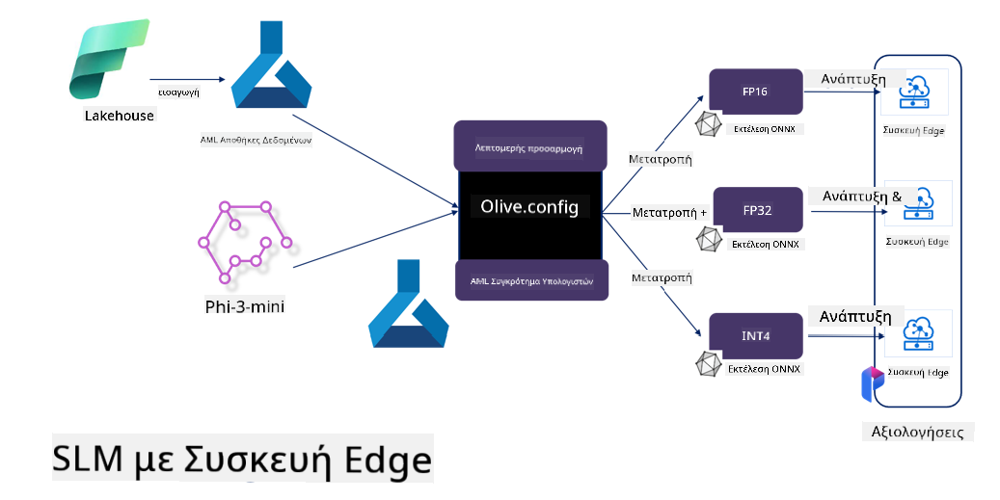

<!--
CO_OP_TRANSLATOR_METADATA:
{
  "original_hash": "5764be88ad2eb4f341e742eb8f14fab1",
  "translation_date": "2025-05-09T20:51:24+00:00",
  "source_file": "md/03.FineTuning/FineTuning_MicrosoftOlive.md",
  "language_code": "el"
}
-->
# **Λεπτομερής ρύθμιση του Phi-3 με το Microsoft Olive**

[Olive](https://github.com/microsoft/OLive?WT.mc_id=aiml-138114-kinfeylo) είναι ένα εύχρηστο εργαλείο βελτιστοποίησης μοντέλων με επίγνωση του υλικού, που συνδυάζει κορυφαίες τεχνικές από συμπίεση, βελτιστοποίηση και μεταγλώττιση μοντέλων.

Έχει σχεδιαστεί για να απλοποιεί τη διαδικασία βελτιστοποίησης μοντέλων μηχανικής μάθησης, εξασφαλίζοντας ότι αξιοποιούν στο μέγιστο τις συγκεκριμένες αρχιτεκτονικές υλικού.

Είτε εργάζεστε σε εφαρμογές cloud είτε σε edge συσκευές, το Olive σας επιτρέπει να βελτιστοποιείτε τα μοντέλα σας εύκολα και αποτελεσματικά.

## Κύρια Χαρακτηριστικά:
- Το Olive συγκεντρώνει και αυτοματοποιεί τεχνικές βελτιστοποίησης για επιθυμητούς στόχους υλικού.
- Καμία μεμονωμένη τεχνική βελτιστοποίησης δεν ταιριάζει σε όλα τα σενάρια, γι’ αυτό το Olive επιτρέπει την επεκτασιμότητα δίνοντας τη δυνατότητα σε ειδικούς του κλάδου να προσθέτουν τις δικές τους καινοτομίες.

## Μείωση Μηχανικής Εργασίας:
- Οι προγραμματιστές συχνά πρέπει να μάθουν και να χρησιμοποιήσουν πολλαπλά εργαλεία συγκεκριμένων προμηθευτών υλικού για να προετοιμάσουν και να βελτιστοποιήσουν εκπαιδευμένα μοντέλα για ανάπτυξη.
- Το Olive απλοποιεί αυτή την εμπειρία αυτοματοποιώντας τις τεχνικές βελτιστοποίησης για το επιθυμητό υλικό.

## Έτοιμη για Χρήση Ολοκληρωμένη Λύση Βελτιστοποίησης:

Συνθέτοντας και ρυθμίζοντας ενσωματωμένες τεχνικές, το Olive προσφέρει μια ενοποιημένη λύση για βελτιστοποίηση από άκρο σε άκρο.
Λαμβάνει υπόψη περιορισμούς όπως ακρίβεια και καθυστέρηση κατά τη βελτιστοποίηση μοντέλων.

## Χρήση του Microsoft Olive για λεπτομερή ρύθμιση

Το Microsoft Olive είναι ένα πολύ εύχρηστο εργαλείο ανοιχτού κώδικα για βελτιστοποίηση μοντέλων που καλύπτει τόσο τη λεπτομερή ρύθμιση όσο και την αναφορά στον τομέα της γενετικής τεχνητής νοημοσύνης. Απαιτεί μόνο απλή διαμόρφωση, σε συνδυασμό με τη χρήση ανοιχτών μικρών γλωσσικών μοντέλων και σχετικών περιβαλλόντων εκτέλεσης (AzureML / τοπική GPU, CPU, DirectML), μπορείτε να ολοκληρώσετε τη λεπτομερή ρύθμιση ή αναφορά του μοντέλου μέσω αυτόματης βελτιστοποίησης και να βρείτε το καλύτερο μοντέλο για ανάπτυξη στο cloud ή σε edge συσκευές. Επιτρέπει στις επιχειρήσεις να δημιουργήσουν τα δικά τους κλαδικά μοντέλα σε τοπικό επίπεδο και στο cloud.


## Lambda-3 Λεπτομερής ρύθμιση με Microsoft Olive 



## Παράδειγμα κώδικα και δείγμα Phi-3 Olive
Σε αυτό το παράδειγμα θα χρησιμοποιήσετε το Olive για:

- Λεπτομερή ρύθμιση ενός LoRA adapter για ταξινόμηση φράσεων σε Sad, Joy, Fear, Surprise.
- Συγχώνευση των βαρών του adapter στο βασικό μοντέλο.
- Βελτιστοποίηση και ποσοτικοποίηση του μοντέλου σε int4.

[Sample Code](../../code/03.Finetuning/olive-ort-example/README.md)

### Εγκατάσταση Microsoft Olive

Η εγκατάσταση του Microsoft Olive είναι πολύ απλή και μπορεί να γίνει για CPU, GPU, DirectML και Azure ML

```bash
pip install olive-ai
```

Αν θέλετε να τρέξετε ένα μοντέλο ONNX με CPU, μπορείτε να χρησιμοποιήσετε

```bash
pip install olive-ai[cpu]
```

Αν θέλετε να τρέξετε ένα μοντέλο ONNX με GPU, μπορείτε να χρησιμοποιήσετε

```python
pip install olive-ai[gpu]
```

Αν θέλετε να χρησιμοποιήσετε Azure ML, χρησιμοποιήστε

```python
pip install git+https://github.com/microsoft/Olive#egg=olive-ai[azureml]
```

**Σημείωση**
Απαιτήσεις λειτουργικού: Ubuntu 20.04 / 22.04 

### **Το αρχείο Config.json του Microsoft Olive**

Μετά την εγκατάσταση, μπορείτε να ρυθμίσετε διαφορετικές παραμέτρους ειδικές για το μοντέλο μέσω του αρχείου Config, όπως δεδομένα, υπολογιστική ισχύ, εκπαίδευση, ανάπτυξη και δημιουργία μοντέλου.

**1. Δεδομένα**

Στο Microsoft Olive, υποστηρίζεται εκπαίδευση με τοπικά και cloud δεδομένα, και αυτό μπορεί να ρυθμιστεί στις ρυθμίσεις.

*Ρυθμίσεις τοπικών δεδομένων*

Μπορείτε απλά να ορίσετε το σύνολο δεδομένων που χρειάζεται εκπαίδευση για λεπτομερή ρύθμιση, συνήθως σε μορφή json, και να το προσαρμόσετε με το πρότυπο δεδομένων. Αυτό πρέπει να προσαρμοστεί ανάλογα με τις απαιτήσεις του μοντέλου (π.χ. προσαρμογή στη μορφή που απαιτεί το Microsoft Phi-3-mini. Αν έχετε άλλα μοντέλα, παρακαλώ ανατρέξτε στις απαιτούμενες μορφές λεπτομερούς ρύθμισης άλλων μοντέλων).

```json

    "data_configs": [
        {
            "name": "dataset_default_train",
            "type": "HuggingfaceContainer",
            "load_dataset_config": {
                "params": {
                    "data_name": "json", 
                    "data_files":"dataset/dataset-classification.json",
                    "split": "train"
                }
            },
            "pre_process_data_config": {
                "params": {
                    "dataset_type": "corpus",
                    "text_cols": [
                            "phrase",
                            "tone"
                    ],
                    "text_template": "### Text: {phrase}\n### The tone is:\n{tone}",
                    "corpus_strategy": "join",
                    "source_max_len": 2048,
                    "pad_to_max_len": false,
                    "use_attention_mask": false
                }
            }
        }
    ],
```

**Ρυθμίσεις πηγής δεδομένων στο cloud**

Συνδέοντας το datastore του Azure AI Studio/Azure Machine Learning Service για πρόσβαση σε δεδομένα στο cloud, μπορείτε να επιλέξετε να εισάγετε διάφορες πηγές δεδομένων στο Azure AI Studio/Azure Machine Learning Service μέσω Microsoft Fabric και Azure Data ως υποστήριξη για λεπτομερή ρύθμιση των δεδομένων.

```json

    "data_configs": [
        {
            "name": "dataset_default_train",
            "type": "HuggingfaceContainer",
            "load_dataset_config": {
                "params": {
                    "data_name": "json", 
                    "data_files": {
                        "type": "azureml_datastore",
                        "config": {
                            "azureml_client": {
                                "subscription_id": "Your Azure Subscrition ID",
                                "resource_group": "Your Azure Resource Group",
                                "workspace_name": "Your Azure ML Workspaces name"
                            },
                            "datastore_name": "workspaceblobstore",
                            "relative_path": "Your train_data.json Azure ML Location"
                        }
                    },
                    "split": "train"
                }
            },
            "pre_process_data_config": {
                "params": {
                    "dataset_type": "corpus",
                    "text_cols": [
                            "Question",
                            "Best Answer"
                    ],
                    "text_template": "<|user|>\n{Question}<|end|>\n<|assistant|>\n{Best Answer}\n<|end|>",
                    "corpus_strategy": "join",
                    "source_max_len": 2048,
                    "pad_to_max_len": false,
                    "use_attention_mask": false
                }
            }
        }
    ],
    
```

**2. Ρύθμιση υπολογιστικής ισχύος**

Αν χρειάζεστε τοπική χρήση, μπορείτε να χρησιμοποιήσετε απευθείας τοπικούς πόρους δεδομένων. Αν χρειάζεστε πόρους από Azure AI Studio / Azure Machine Learning Service, πρέπει να ρυθμίσετε τις σχετικές παραμέτρους Azure, το όνομα υπολογιστικής ισχύος κτλ.

```json

    "systems": {
        "aml": {
            "type": "AzureML",
            "config": {
                "accelerators": ["gpu"],
                "hf_token": true,
                "aml_compute": "Your Azure AI Studio / Azure Machine Learning Service Compute Name",
                "aml_docker_config": {
                    "base_image": "Your Azure AI Studio / Azure Machine Learning Service docker",
                    "conda_file_path": "conda.yaml"
                }
            }
        },
        "azure_arc": {
            "type": "AzureML",
            "config": {
                "accelerators": ["gpu"],
                "aml_compute": "Your Azure AI Studio / Azure Machine Learning Service Compute Name",
                "aml_docker_config": {
                    "base_image": "Your Azure AI Studio / Azure Machine Learning Service docker",
                    "conda_file_path": "conda.yaml"
                }
            }
        }
    },
```

***Σημείωση***

Επειδή τρέχει μέσα από container στο Azure AI Studio/Azure Machine Learning Service, το απαιτούμενο περιβάλλον πρέπει να ρυθμιστεί. Αυτό γίνεται μέσω του conda.yaml περιβάλλοντος.

```yaml

name: project_environment
channels:
  - defaults
dependencies:
  - python=3.8.13
  - pip=22.3.1
  - pip:
      - einops
      - accelerate
      - azure-keyvault-secrets
      - azure-identity
      - bitsandbytes
      - datasets
      - huggingface_hub
      - peft
      - scipy
      - sentencepiece
      - torch>=2.2.0
      - transformers
      - git+https://github.com/microsoft/Olive@jiapli/mlflow_loading_fix#egg=olive-ai[gpu]
      - --extra-index-url https://aiinfra.pkgs.visualstudio.com/PublicPackages/_packaging/ORT-Nightly/pypi/simple/ 
      - ort-nightly-gpu==1.18.0.dev20240307004
      - --extra-index-url https://aiinfra.pkgs.visualstudio.com/PublicPackages/_packaging/onnxruntime-genai/pypi/simple/
      - onnxruntime-genai-cuda

    

```

**3. Επιλογή του SLM σας**

Μπορείτε να χρησιμοποιήσετε απευθείας το μοντέλο από το Hugging Face ή να το συνδυάσετε με τον Κατάλογο Μοντέλων του Azure AI Studio / Azure Machine Learning για να επιλέξετε το μοντέλο που θα χρησιμοποιήσετε. Στο παράδειγμα κώδικα παρακάτω θα χρησιμοποιήσουμε το Microsoft Phi-3-mini ως παράδειγμα.

Αν έχετε το μοντέλο τοπικά, μπορείτε να χρησιμοποιήσετε αυτή τη μέθοδο

```json

    "input_model":{
        "type": "PyTorchModel",
        "config": {
            "hf_config": {
                "model_name": "model-cache/microsoft/phi-3-mini",
                "task": "text-generation",
                "model_loading_args": {
                    "trust_remote_code": true
                }
            }
        }
    },
```

Αν θέλετε να χρησιμοποιήσετε μοντέλο από Azure AI Studio / Azure Machine Learning Service, μπορείτε να χρησιμοποιήσετε αυτή τη μέθοδο

```json

    "input_model":{
        "type": "PyTorchModel",
        "config": {
            "model_path": {
                "type": "azureml_registry_model",
                "config": {
                    "name": "microsoft/Phi-3-mini-4k-instruct",
                    "registry_name": "azureml-msr",
                    "version": "11"
                }
            },
             "model_file_format": "PyTorch.MLflow",
             "hf_config": {
                "model_name": "microsoft/Phi-3-mini-4k-instruct",
                "task": "text-generation",
                "from_pretrained_args": {
                    "trust_remote_code": true
                }
            }
        }
    },
```

**Σημείωση:**
Χρειάζεται ενσωμάτωση με Azure AI Studio / Azure Machine Learning Service, οπότε κατά τη ρύθμιση του μοντέλου ανατρέξτε στον αριθμό έκδοσης και τα σχετικά ονόματα.

Όλα τα μοντέλα στο Azure πρέπει να οριστούν σε PyTorch.MLflow

Πρέπει να έχετε λογαριασμό στο Hugging Face και να συνδέσετε το κλειδί με την τιμή Key του Azure AI Studio / Azure Machine Learning

**4. Αλγόριθμος**

Το Microsoft Olive καλύπτει πολύ καλά τους αλγορίθμους λεπτομερούς ρύθμισης Lora και QLora. Το μόνο που χρειάζεται είναι να ρυθμίσετε κάποιες σχετικές παραμέτρους. Εδώ παίρνω ως παράδειγμα το QLora.

```json
        "lora": {
            "type": "LoRA",
            "config": {
                "target_modules": [
                    "o_proj",
                    "qkv_proj"
                ],
                "double_quant": true,
                "lora_r": 64,
                "lora_alpha": 64,
                "lora_dropout": 0.1,
                "train_data_config": "dataset_default_train",
                "eval_dataset_size": 0.3,
                "training_args": {
                    "seed": 0,
                    "data_seed": 42,
                    "per_device_train_batch_size": 1,
                    "per_device_eval_batch_size": 1,
                    "gradient_accumulation_steps": 4,
                    "gradient_checkpointing": false,
                    "learning_rate": 0.0001,
                    "num_train_epochs": 3,
                    "max_steps": 10,
                    "logging_steps": 10,
                    "evaluation_strategy": "steps",
                    "eval_steps": 187,
                    "group_by_length": true,
                    "adam_beta2": 0.999,
                    "max_grad_norm": 0.3
                }
            }
        },
```

Αν θέλετε ποσοτικοποίηση, ο κύριος κλάδος του Microsoft Olive υποστηρίζει ήδη τη μέθοδο onnxruntime-genai. Μπορείτε να την ρυθμίσετε ανάλογα με τις ανάγκες σας:

1. Συγχώνευση των βαρών του adapter στο βασικό μοντέλο
2. Μετατροπή του μοντέλου σε onnx μοντέλο με την απαιτούμενη ακρίβεια μέσω ModelBuilder

όπως μετατροπή σε ποσοτικοποιημένο INT4

```json

        "merge_adapter_weights": {
            "type": "MergeAdapterWeights"
        },
        "builder": {
            "type": "ModelBuilder",
            "config": {
                "precision": "int4"
            }
        }
```

**Σημείωση**  
- Αν χρησιμοποιείτε QLoRA, η ποσοτικοποίηση μέσω ONNXRuntime-genai δεν υποστηρίζεται προς το παρόν.

- Επισημαίνεται ότι μπορείτε να ρυθμίσετε τα παραπάνω βήματα ανάλογα με τις ανάγκες σας. Δεν είναι απαραίτητο να διαμορφώσετε όλα τα βήματα πλήρως. Ανάλογα με τις απαιτήσεις σας, μπορείτε να χρησιμοποιήσετε απευθείας τα βήματα του αλγορίθμου χωρίς λεπτομερή ρύθμιση. Τέλος, πρέπει να ρυθμίσετε τους σχετικούς engines.

```json

    "engine": {
        "log_severity_level": 0,
        "host": "aml",
        "target": "aml",
        "search_strategy": false,
        "execution_providers": ["CUDAExecutionProvider"],
        "cache_dir": "../model-cache/models/phi3-finetuned/cache",
        "output_dir" : "../model-cache/models/phi3-finetuned"
    }
```

**5. Ολοκλήρωση λεπτομερούς ρύθμισης**

Στη γραμμή εντολών, εκτελέστε στον φάκελο που βρίσκεται το olive-config.json

```bash
olive run --config olive-config.json  
```

**Αποποίηση ευθυνών**:  
Αυτό το έγγραφο έχει μεταφραστεί χρησιμοποιώντας την υπηρεσία αυτόματης μετάφρασης AI [Co-op Translator](https://github.com/Azure/co-op-translator). Παρόλο που προσπαθούμε για ακρίβεια, παρακαλούμε να έχετε υπόψη ότι οι αυτόματες μεταφράσεις μπορεί να περιέχουν λάθη ή ανακρίβειες. Το πρωτότυπο έγγραφο στη μητρική του γλώσσα πρέπει να θεωρείται η αυθεντική πηγή. Για κρίσιμες πληροφορίες, συνιστάται η επαγγελματική μετάφραση από ανθρώπους. Δεν φέρουμε ευθύνη για τυχόν παρεξηγήσεις ή λανθασμένες ερμηνείες που προκύπτουν από τη χρήση αυτής της μετάφρασης.