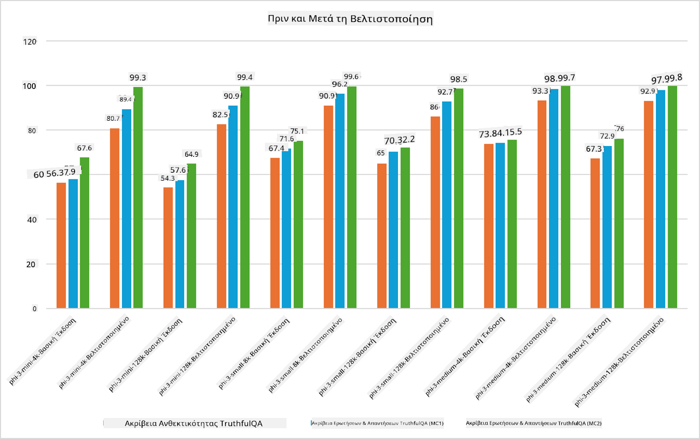

<!--
CO_OP_TRANSLATOR_METADATA:
{
  "original_hash": "cb5648935f63edc17e95ce38f23adc32",
  "translation_date": "2025-07-17T08:26:57+00:00",
  "source_file": "md/03.FineTuning/FineTuning_Scenarios.md",
  "language_code": "el"
}
-->
## Σενάρια Fine Tuning

**Πλατφόρμα** Περιλαμβάνει διάφορες τεχνολογίες όπως Azure AI Foundry, Azure Machine Learning, AI Tools, Kaito και ONNX Runtime.

**Υποδομή** Περιλαμβάνει την CPU και FPGA, που είναι απαραίτητες για τη διαδικασία fine-tuning. Ας σας δείξω τα εικονίδια για κάθε μία από αυτές τις τεχνολογίες.

**Εργαλεία & Πλαίσια** Περιλαμβάνει το ONNX Runtime και το ONNX Runtime. Ας σας δείξω τα εικονίδια για κάθε μία από αυτές τις τεχνολογίες.  
[Εισαγωγή εικονιδίων για ONNX Runtime και ONNX Runtime]

Η διαδικασία fine-tuning με τις τεχνολογίες της Microsoft περιλαμβάνει διάφορα συστατικά και εργαλεία. Κατανοώντας και αξιοποιώντας αυτές τις τεχνολογίες, μπορούμε να βελτιστοποιήσουμε αποτελεσματικά τις εφαρμογές μας και να δημιουργήσουμε καλύτερες λύσεις.

## Model as Service

Κάντε fine-tune το μοντέλο χρησιμοποιώντας hosted fine-tuning, χωρίς την ανάγκη δημιουργίας και διαχείρισης υπολογιστικής ισχύος.

Το serverless fine-tuning είναι διαθέσιμο για τα μοντέλα Phi-3-mini και Phi-3-medium, επιτρέποντας στους προγραμματιστές να προσαρμόζουν γρήγορα και εύκολα τα μοντέλα για σενάρια cloud και edge χωρίς να χρειάζεται να οργανώσουν υπολογιστική ισχύ. Έχουμε επίσης ανακοινώσει ότι το Phi-3-small είναι πλέον διαθέσιμο μέσω της υπηρεσίας Models-as-a-Service, ώστε οι προγραμματιστές να μπορούν να ξεκινήσουν γρήγορα και εύκολα την ανάπτυξη AI χωρίς να διαχειρίζονται την υποκείμενη υποδομή.

## Model as a Platform

Οι χρήστες διαχειρίζονται τη δική τους υπολογιστική ισχύ για να κάνουν fine-tune τα μοντέλα τους.

[Παράδειγμα Fine Tuning](https://github.com/Azure/azureml-examples/blob/main/sdk/python/foundation-models/system/finetune/chat-completion/chat-completion.ipynb)

## Σενάρια Fine Tuning

| | | | | | | |
|-|-|-|-|-|-|-|
|Σενάριο|LoRA|QLoRA|PEFT|DeepSpeed|ZeRO|DORA|
|Προσαρμογή προεκπαιδευμένων LLMs σε συγκεκριμένες εργασίες ή τομείς|Ναι|Ναι|Ναι|Ναι|Ναι|Ναι|
|Fine-tuning για εργασίες NLP όπως ταξινόμηση κειμένου, αναγνώριση οντοτήτων και μηχανική μετάφραση|Ναι|Ναι|Ναι|Ναι|Ναι|Ναι|
|Fine-tuning για εργασίες QA|Ναι|Ναι|Ναι|Ναι|Ναι|Ναι|
|Fine-tuning για παραγωγή απαντήσεων που μοιάζουν ανθρώπινες σε chatbots|Ναι|Ναι|Ναι|Ναι|Ναι|Ναι|
|Fine-tuning για παραγωγή μουσικής, τέχνης ή άλλων μορφών δημιουργικότητας|Ναι|Ναι|Ναι|Ναι|Ναι|Ναι|
|Μείωση υπολογιστικών και οικονομικών κόστους|Ναι|Ναι|Όχι|Ναι|Ναι|Όχι|
|Μείωση χρήσης μνήμης|Όχι|Ναι|Όχι|Ναι|Ναι|Ναι|
|Χρήση λιγότερων παραμέτρων για αποδοτικό fine-tuning|Όχι|Ναι|Ναι|Όχι|Όχι|Ναι|
|Μορφή αποδοτικής χρήσης μνήμης μέσω data parallelism που δίνει πρόσβαση στη συνολική GPU μνήμη όλων των διαθέσιμων GPU|Όχι|Όχι|Όχι|Ναι|Ναι|Ναι|

## Παραδείγματα Απόδοσης Fine Tuning

**Αποποίηση ευθυνών**:  
Αυτό το έγγραφο έχει μεταφραστεί χρησιμοποιώντας την υπηρεσία αυτόματης μετάφρασης AI [Co-op Translator](https://github.com/Azure/co-op-translator). Παρόλο που επιδιώκουμε την ακρίβεια, παρακαλούμε να γνωρίζετε ότι οι αυτόματες μεταφράσεις ενδέχεται να περιέχουν λάθη ή ανακρίβειες. Το πρωτότυπο έγγραφο στη γλώσσα του θεωρείται η αυθεντική πηγή. Για κρίσιμες πληροφορίες, συνιστάται επαγγελματική ανθρώπινη μετάφραση. Δεν φέρουμε ευθύνη για τυχόν παρεξηγήσεις ή λανθασμένες ερμηνείες που προκύπτουν από τη χρήση αυτής της μετάφρασης.