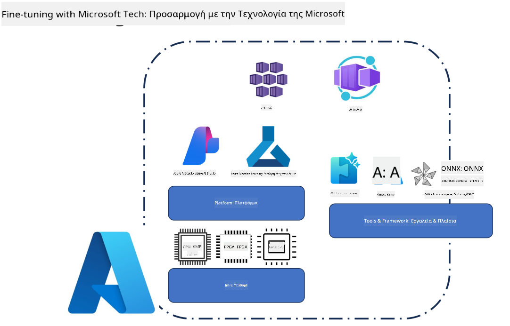
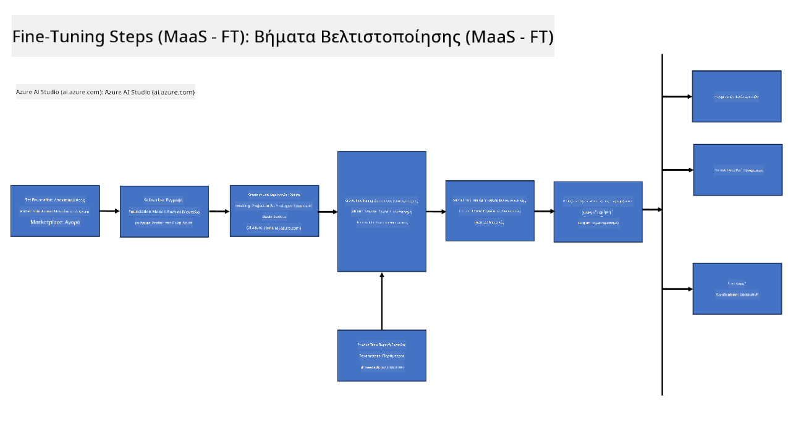
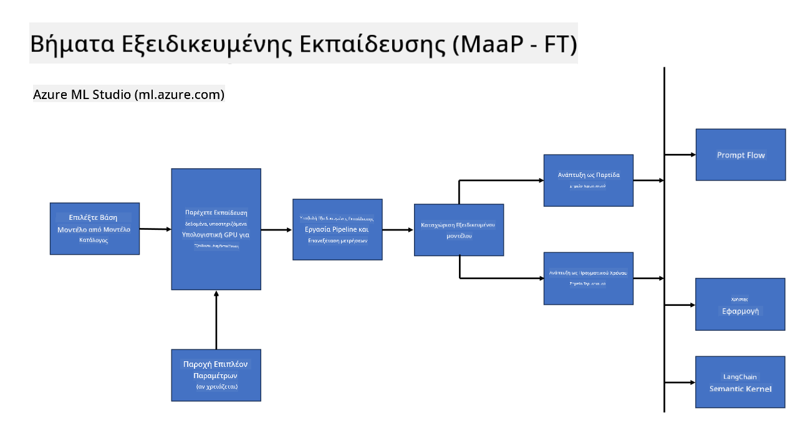

<!--
CO_OP_TRANSLATOR_METADATA:
{
  "original_hash": "cb5648935f63edc17e95ce38f23adc32",
  "translation_date": "2025-05-09T21:55:28+00:00",
  "source_file": "md/03.FineTuning/FineTuning_Scenarios.md",
  "language_code": "el"
}
-->
## Σενάρια Fine Tuning

**Platform** Περιλαμβάνει διάφορες τεχνολογίες όπως Azure AI Foundry, Azure Machine Learning, AI Tools, Kaito και ONNX Runtime.

**Infrastructure** Περιλαμβάνει την CPU και το FPGA, που είναι απαραίτητα για τη διαδικασία fine-tuning. Ας σας δείξω τα εικονίδια για καθεμία από αυτές τις τεχνολογίες.

**Tools & Framework** Περιλαμβάνει ONNX Runtime και ONNX Runtime. Ας σας δείξω τα εικονίδια για καθεμία από αυτές τις τεχνολογίες.  
[Insert icons for ONNX Runtime and ONNX Runtime]

Η διαδικασία fine-tuning με τις τεχνολογίες της Microsoft περιλαμβάνει διάφορα στοιχεία και εργαλεία. Με την κατανόηση και αξιοποίηση αυτών των τεχνολογιών, μπορούμε να βελτιστοποιήσουμε αποτελεσματικά τις εφαρμογές μας και να δημιουργήσουμε καλύτερες λύσεις.

## Model as Service

Κάντε fine-tune το μοντέλο χρησιμοποιώντας hosted fine-tuning, χωρίς να χρειάζεται να δημιουργήσετε ή να διαχειριστείτε υπολογιστική ισχύ.

Το serverless fine-tuning είναι διαθέσιμο για τα μοντέλα Phi-3-mini και Phi-3-medium, επιτρέποντας στους προγραμματιστές να προσαρμόζουν γρήγορα και εύκολα τα μοντέλα για σενάρια cloud και edge χωρίς να χρειάζεται να διαχειριστούν υπολογιστική ισχύ. Έχουμε επίσης ανακοινώσει ότι το Phi-3-small είναι πλέον διαθέσιμο μέσω της υπηρεσίας Models-as-a-Service, ώστε οι προγραμματιστές να μπορούν να ξεκινήσουν γρήγορα και εύκολα την ανάπτυξη AI χωρίς να διαχειρίζονται την υποδομή.

## Model as a Platform

Οι χρήστες διαχειρίζονται τη δική τους υπολογιστική ισχύ για να κάνουν fine-tune τα μοντέλα τους.

[Fine Tuning Sample](https://github.com/Azure/azureml-examples/blob/main/sdk/python/foundation-models/system/finetune/chat-completion/chat-completion.ipynb)

## Σενάρια Fine Tuning

| | | | | | | |
|-|-|-|-|-|-|-|
|Scenario|LoRA|QLoRA|PEFT|DeepSpeed|ZeRO|DORA|
|Προσαρμογή προεκπαιδευμένων LLMs σε συγκεκριμένες εργασίες ή τομείς|Ναι|Ναι|Ναι|Ναι|Ναι|Ναι|
|Fine-tuning για εργασίες NLP όπως ταξινόμηση κειμένου, αναγνώριση οντοτήτων και μηχανική μετάφραση|Ναι|Ναι|Ναι|Ναι|Ναι|Ναι|
|Fine-tuning για εργασίες ερωταπαντήσεων (QA)|Ναι|Ναι|Ναι|Ναι|Ναι|Ναι|
|Fine-tuning για δημιουργία απαντήσεων ανθρώπινης μορφής σε chatbots|Ναι|Ναι|Ναι|Ναι|Ναι|Ναι|
|Fine-tuning για δημιουργία μουσικής, τέχνης ή άλλων μορφών δημιουργικότητας|Ναι|Ναι|Ναι|Ναι|Ναι|Ναι|
|Μείωση υπολογιστικών και οικονομικών κόστους|Ναι|Ναι|Όχι|Ναι|Ναι|Όχι|
|Μείωση χρήσης μνήμης|Όχι|Ναι|Όχι|Ναι|Ναι|Ναι|
|Χρήση λιγότερων παραμέτρων για αποδοτικό fine-tuning|Όχι|Ναι|Ναι|Όχι|Όχι|Ναι|
|Μορφή παράλληλης επεξεργασίας δεδομένων που είναι αποδοτική στη μνήμη και επιτρέπει πρόσβαση στη συνολική GPU μνήμη όλων των διαθέσιμων GPU|Όχι|Όχι|Όχι|Ναι|Ναι|Ναι|

## Παραδείγματα Απόδοσης Fine Tuning

**Αποποίηση ευθυνών**:  
Αυτό το έγγραφο έχει μεταφραστεί χρησιμοποιώντας την υπηρεσία μετάφρασης με τεχνητή νοημοσύνη [Co-op Translator](https://github.com/Azure/co-op-translator). Παρόλο που προσπαθούμε για ακρίβεια, παρακαλούμε να έχετε υπόψη ότι οι αυτόματες μεταφράσεις μπορεί να περιέχουν λάθη ή ανακρίβειες. Το πρωτότυπο έγγραφο στη γλώσσα του πρέπει να θεωρείται η έγκυρη πηγή. Για κρίσιμες πληροφορίες, συνιστάται επαγγελματική ανθρώπινη μετάφραση. Δεν φέρουμε ευθύνη για τυχόν παρεξηγήσεις ή λανθασμένες ερμηνείες που προκύπτουν από τη χρήση αυτής της μετάφρασης.