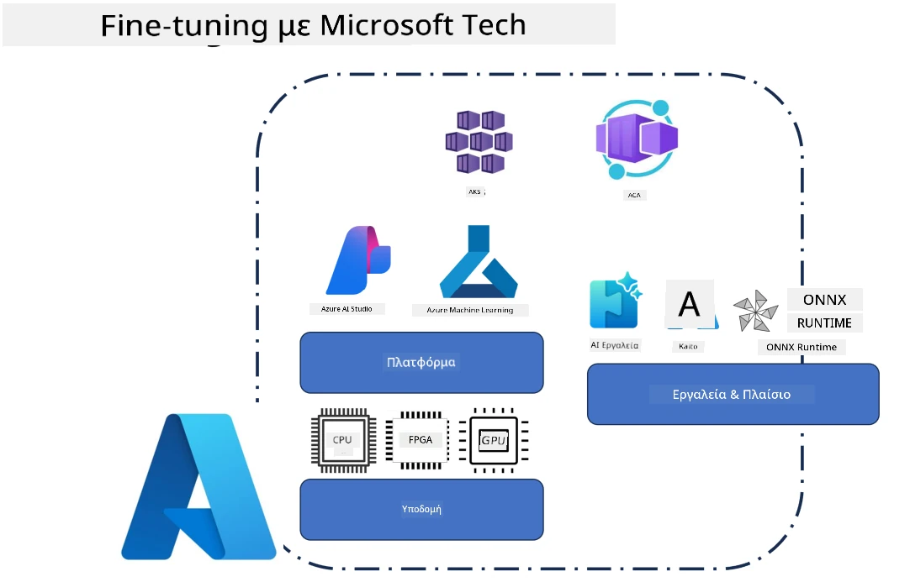
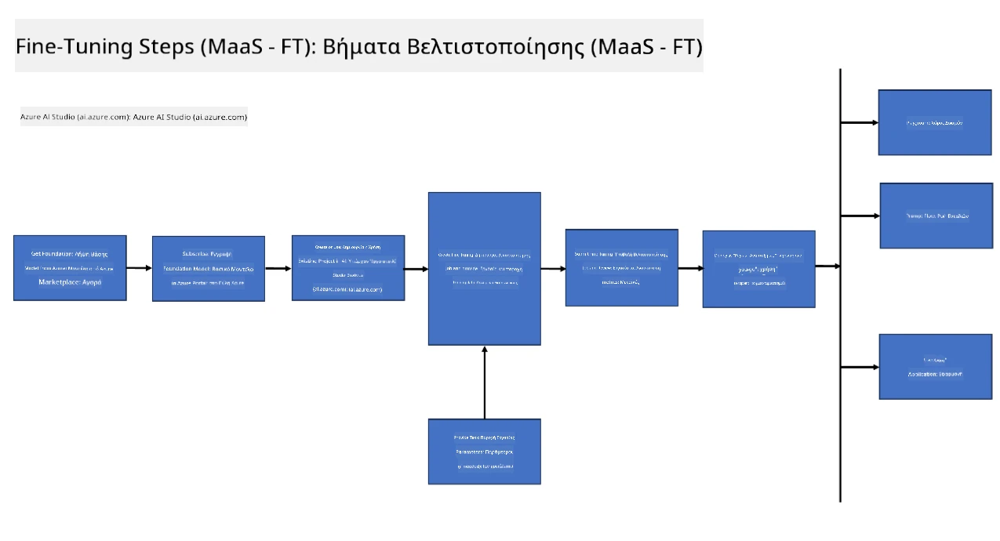
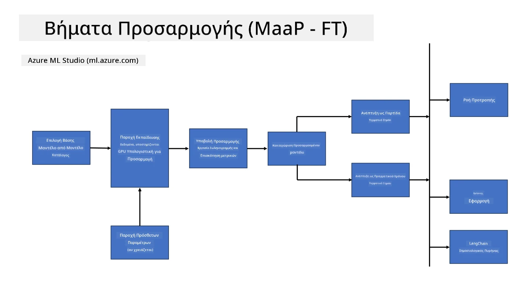
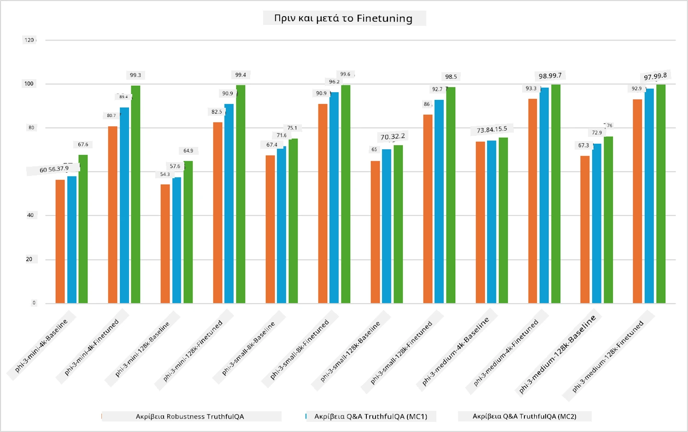

## Σενάρια Βελτιστοποίησης

Αυτή η ενότητα παρέχει μια επισκόπηση των σεναρίων βελτιστοποίησης στο Microsoft Foundry και τα περιβάλλοντα Azure, περιλαμβάνοντας μοντέλα ανάπτυξης, επίπεδα υποδομής και τις πιο συχνά χρησιμοποιούμενες τεχνικές βελτιστοποίησης.

**Πλατφόρμα**  
Αυτή περιλαμβάνει διαχειριζόμενες υπηρεσίες όπως το Microsoft Foundry (πρώην Azure AI Foundry) και το Azure Machine Learning, που παρέχουν διαχείριση μοντέλων, ορχήστρωση, παρακολούθηση πειραμάτων και ροές εργασίας ανάπτυξης.

**Υποδομή**  
Η βελτιστοποίηση απαιτεί κλιμακούμενους πόρους υπολογισμού. Στα περιβάλλοντα Azure, αυτό συνήθως περιλαμβάνει εικονικές μηχανές με βάση GPU και πόρους CPU για ελαφριά φορτία εργασίας, μαζί με κλιμακούμενη αποθήκευση για σύνολα δεδομένων και σημεία ελέγχου.

**Εργαλεία & Πλαίσιο**  
Οι ροές εργασίας βελτιστοποίησης βασίζονται συνήθως σε πλαίσια και βιβλιοθήκες βελτιστοποίησης όπως το Hugging Face Transformers, DeepSpeed και PEFT (Parameter-Efficient Fine-Tuning).

Η διαδικασία βελτιστοποίησης με τις τεχνολογίες της Microsoft καλύπτει υπηρεσίες πλατφόρμας, υποδομή υπολογισμού και πλαίσια εκπαίδευσης. Με την κατανόηση του πώς αυτά τα στοιχεία συνεργάζονται, οι προγραμματιστές μπορούν να προσαρμόσουν αποτελεσματικά τα θεμελιώδη μοντέλα σε συγκεκριμένες εργασίες και σενάρια παραγωγής.

## Μοντέλο ως Υπηρεσία

Βελτιστοποιήστε το μοντέλο χρησιμοποιώντας φιλοξενούμενη βελτιστοποίηση, χωρίς την ανάγκη δημιουργίας και διαχείρισης υπολογιστικών πόρων.

Η χωρίς διακομιστή βελτιστοποίηση είναι πλέον διαθέσιμη για τις οικογένειες μοντέλων Phi-3, Phi-3.5, και Phi-4, επιτρέποντας στους προγραμματιστές να προσαρμόζουν γρήγορα και εύκολα τα μοντέλα για σενάρια στο νέφος και στην άκρη χωρίς να χρειάζεται να οργανώσουν υπολογιστικούς πόρους.

## Μοντέλο ως Πλατφόρμα

Οι χρήστες διαχειρίζονται τους δικούς τους υπολογιστικούς πόρους προκειμένου να βελτιστοποιήσουν τα μοντέλα τους.

[Παράδειγμα Βελτιστοποίησης](https://github.com/Azure/azureml-examples/blob/main/sdk/python/foundation-models/system/finetune/chat-completion/chat-completion.ipynb)

## Σύγκριση Τεχνικών Βελτιστοποίησης

|Σενάριο|LoRA|QLoRA|PEFT|DeepSpeed|ZeRO|DoRA|
|---|---|---|---|---|---|---|
|Προσαρμογή προεκπαιδευμένων LLMs σε συγκεκριμένες εργασίες ή τομείς|Ναι|Ναι|Ναι|Ναι|Ναι|Ναι|
|Βελτιστοποίηση για εργασίες NLP όπως ταξινόμηση κειμένου, αναγνώριση οντοτήτων και μηχανική μετάφραση|Ναι|Ναι|Ναι|Ναι|Ναι|Ναι|
|Βελτιστοποίηση για εργασίες QA|Ναι|Ναι|Ναι|Ναι|Ναι|Ναι|
|Βελτιστοποίηση για δημιουργία ανθρώπινων απαντήσεων σε chatbot|Ναι|Ναι|Ναι|Ναι|Ναι|Ναι|
|Βελτιστοποίηση για δημιουργία μουσικής, τέχνης ή άλλων μορφών δημιουργικότητας|Ναι|Ναι|Ναι|Ναι|Ναι|Ναι|
|Μείωση υπολογιστικών και οικονομικών εξόδων|Ναι|Ναι|Ναι|Ναι|Ναι|Ναι|
|Μείωση χρήσης μνήμης|Ναι|Ναι|Ναι|Ναι|Ναι|Ναι|
|Χρήση λιγότερων παραμέτρων για αποδοτική βελτιστοποίηση|Ναι|Ναι|Ναι|Όχι|Όχι|Ναι|
|Αποδοτική μορφή παράλληλης επεξεργασίας δεδομένων που παρέχει πρόσβαση στη συνολική μνήμη GPU όλων των διαθέσιμων συσκευών GPU|Όχι|Όχι|Όχι|Ναι|Ναι|Όχι|

> [!NOTE]
> Το LoRA, το QLoRA, το PEFT και το DoRA είναι μέθοδοι βελτιστοποίησης με αποδοτικές παραμέτρους, ενώ το DeepSpeed και το ZeRO επικεντρώνονται στην κατανεμημένη εκπαίδευση και την βελτιστοποίηση της μνήμης.

## Παραδείγματα Απόδοσης Βελτιστοποίησης

---

<!-- CO-OP TRANSLATOR DISCLAIMER START -->
**Αποποίηση ευθυνών**:  
Αυτό το έγγραφο έχει μεταφραστεί χρησιμοποιώντας την υπηρεσία αυτόματης μετάφρασης AI [Co-op Translator](https://github.com/Azure/co-op-translator). Παρόλο που επιδιώκουμε την ακρίβεια, παρακαλούμε να έχετε υπόψη ότι οι αυτόματες μεταφράσεις ενδέχεται να περιέχουν λάθη ή ανακρίβειες. Το πρωτότυπο έγγραφο στη γλώσσα του πρέπει να θεωρείται η επίσημη πηγή. Για κρίσιμες πληροφορίες, συνιστάται η επαγγελματική ανθρώπινη μετάφραση. Δεν φέρουμε ευθύνη για οποιαδήποτε παρεξήγηση ή λανθασμένη ερμηνεία προκύψει από τη χρήση αυτής της μετάφρασης.
<!-- CO-OP TRANSLATOR DISCLAIMER END -->