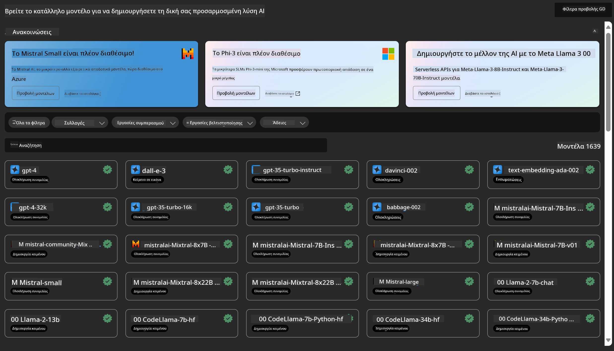
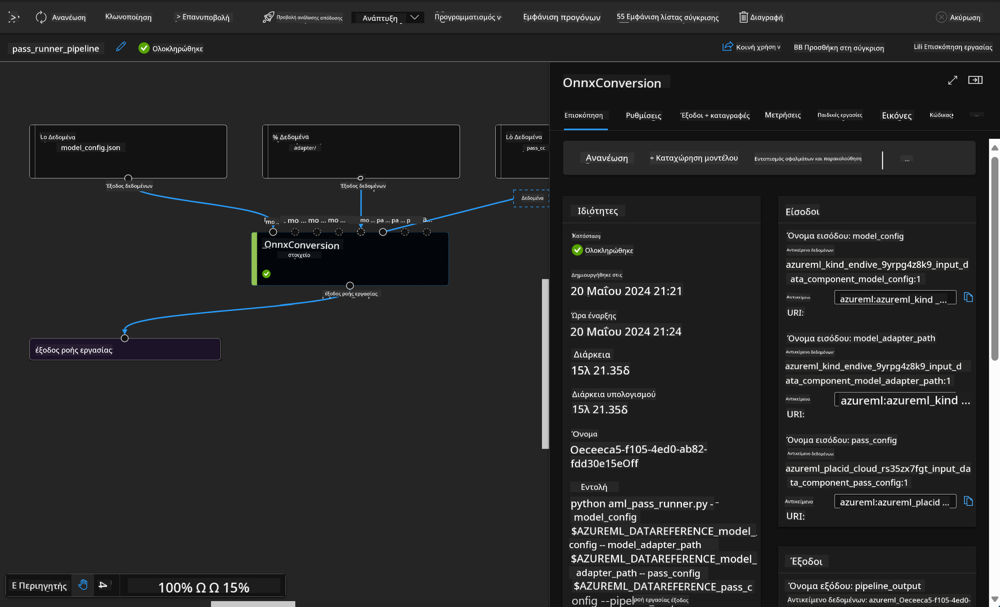

<!--
CO_OP_TRANSLATOR_METADATA:
{
  "original_hash": "7fe541373802e33568e94e13226d463c",
  "translation_date": "2025-05-09T22:20:10+00:00",
  "source_file": "md/03.FineTuning/Introduce_AzureML.md",
  "language_code": "el"
}
-->
# **Εισαγωγή στην Υπηρεσία Azure Machine Learning**

[Azure Machine Learning](https://ml.azure.com?WT.mc_id=aiml-138114-kinfeylo) είναι μια υπηρεσία στο cloud που επιταχύνει και διαχειρίζεται τον κύκλο ζωής των έργων μηχανικής μάθησης (ML).

Οι επαγγελματίες ML, οι επιστήμονες δεδομένων και οι μηχανικοί μπορούν να τη χρησιμοποιήσουν στις καθημερινές τους ροές εργασίας για να:

- Εκπαιδεύουν και να αναπτύσσουν μοντέλα.
- Διαχειρίζονται τις λειτουργίες μηχανικής μάθησης (MLOps).
- Μπορείτε να δημιουργήσετε ένα μοντέλο στο Azure Machine Learning ή να χρησιμοποιήσετε ένα μοντέλο που έχει κατασκευαστεί σε κάποια ανοιχτού κώδικα πλατφόρμα, όπως PyTorch, TensorFlow ή scikit-learn.
- Τα εργαλεία MLOps βοηθούν στην παρακολούθηση, επανεκπαίδευση και επανανάπτυξη μοντέλων.

## Για ποιον προορίζεται το Azure Machine Learning;

**Επιστήμονες Δεδομένων και Μηχανικοί ML**

Μπορούν να χρησιμοποιήσουν εργαλεία για να επιταχύνουν και να αυτοματοποιήσουν τις καθημερινές τους ροές εργασίας.
Το Azure ML παρέχει λειτουργίες για δικαιοσύνη, εξηγήσιμότητα, παρακολούθηση και έλεγχο.

**Προγραμματιστές Εφαρμογών:**

Μπορούν να ενσωματώσουν μοντέλα σε εφαρμογές ή υπηρεσίες με ομαλό τρόπο.

**Προγραμματιστές Πλατφόρμας**

Έχουν πρόσβαση σε ένα ισχυρό σύνολο εργαλείων υποστηριζόμενο από ανθεκτικά APIs του Azure Resource Manager.
Αυτά τα εργαλεία επιτρέπουν την κατασκευή εξελιγμένων εργαλείων ML.

**Επιχειρήσεις**

Λειτουργώντας στο Microsoft Azure cloud, οι επιχειρήσεις επωφελούνται από την γνωστή ασφάλεια και τον έλεγχο πρόσβασης βάσει ρόλων.
Μπορούν να ρυθμίσουν έργα για τον έλεγχο πρόσβασης σε προστατευμένα δεδομένα και συγκεκριμένες λειτουργίες.

## Παραγωγικότητα για όλους στην ομάδα

Τα έργα ML συχνά απαιτούν μια ομάδα με διαφορετικές δεξιότητες για την κατασκευή και τη συντήρηση.

Το Azure ML παρέχει εργαλεία που σας επιτρέπουν να:
- Συνεργάζεστε με την ομάδα σας μέσω κοινόχρηστων σημειωματάριων, υπολογιστικών πόρων, serverless υπολογισμού, δεδομένων και περιβαλλόντων.
- Αναπτύσσετε μοντέλα με δικαιοσύνη, εξηγήσιμότητα, παρακολούθηση και έλεγχο για να καλύψετε απαιτήσεις ιχνηλασιμότητας και συμμόρφωσης.
- Αναπτύσσετε μοντέλα ML γρήγορα και εύκολα σε κλίμακα, και τα διαχειρίζεστε και τα κυβερνάτε αποτελεσματικά με MLOps.
- Εκτελείτε εργασίες μηχανικής μάθησης οπουδήποτε με ενσωματωμένη διακυβέρνηση, ασφάλεια και συμμόρφωση.

## Εργαλεία Πλατφόρμας Συμβατά με Πολλαπλές Πλατφόρμες

Ο καθένας στην ομάδα ML μπορεί να χρησιμοποιήσει τα εργαλεία που προτιμά για να ολοκληρώσει τη δουλειά.
Είτε τρέχετε γρήγορα πειράματα, ρύθμιση υπερπαραμέτρων, κατασκευή pipeline ή διαχείριση προβλέψεων, μπορείτε να χρησιμοποιήσετε οικείες διεπαφές όπως:
- Azure Machine Learning Studio
- Python SDK (v2)
- Azure CLI (v2)
- Azure Resource Manager REST APIs

Καθώς βελτιώνετε μοντέλα και συνεργάζεστε καθ’ όλη τη διάρκεια του κύκλου ανάπτυξης, μπορείτε να μοιράζεστε και να βρίσκετε πόρους, αντικείμενα και μετρικές μέσα από το UI του Azure Machine Learning studio.

## **LLM/SLM στο Azure ML**

Το Azure ML έχει προσθέσει πολλές λειτουργίες σχετικές με LLM/SLM, συνδυάζοντας LLMOps και SLMOps για τη δημιουργία μιας πλατφόρμας τεχνητής νοημοσύνης γενετικής τεχνολογίας σε επίπεδο επιχείρησης.

### **Κατάλογος Μοντέλων**

Οι επιχειρησιακοί χρήστες μπορούν να αναπτύξουν διαφορετικά μοντέλα ανάλογα με τις επιχειρησιακές ανάγκες μέσω του Καταλόγου Μοντέλων, παρέχοντας υπηρεσίες ως Μοντέλο ως Υπηρεσία (Model as Service) για προγραμματιστές ή χρήστες επιχειρήσεων.

Ο Κατάλογος Μοντέλων στο Azure Machine Learning studio είναι το κέντρο για την ανακάλυψη και χρήση ενός ευρέος φάσματος μοντέλων που σας επιτρέπουν να δημιουργήσετε εφαρμογές Γενετικής Τεχνητής Νοημοσύνης. Ο κατάλογος περιλαμβάνει εκατοντάδες μοντέλα από παρόχους όπως η υπηρεσία Azure OpenAI, Mistral, Meta, Cohere, Nvidia, Hugging Face, καθώς και μοντέλα εκπαιδευμένα από τη Microsoft. Τα μοντέλα από παρόχους εκτός Microsoft θεωρούνται Μη-Προϊόντα Microsoft, σύμφωνα με τους Όρους Προϊόντων της Microsoft, και υπόκεινται στους όρους που συνοδεύουν το κάθε μοντέλο.

### **Pipeline Εργασιών**

Ο πυρήνας ενός pipeline μηχανικής μάθησης είναι να χωρίσει ένα ολοκληρωμένο έργο ML σε μια πολυβηματική ροή εργασιών. Κάθε βήμα είναι ένα διαχειρίσιμο στοιχείο που μπορεί να αναπτυχθεί, βελτιστοποιηθεί, ρυθμιστεί και αυτοματοποιηθεί ξεχωριστά. Τα βήματα συνδέονται μέσω καλά ορισμένων διεπαφών. Η υπηρεσία pipeline του Azure Machine Learning οργανώνει αυτόματα όλες τις εξαρτήσεις μεταξύ των βημάτων του pipeline.

Στην εκπαίδευση fine-tuning SLM / LLM, μπορούμε να διαχειριστούμε τα δεδομένα, την εκπαίδευση και τις διαδικασίες παραγωγής μέσω Pipeline.

### **Prompt flow**

Οφέλη από τη χρήση του Azure Machine Learning prompt flow  
Το Azure Machine Learning prompt flow προσφέρει μια σειρά από οφέλη που βοηθούν τους χρήστες να περάσουν από την ιδέα στην πειραματική φάση και τελικά σε εφαρμογές LLM έτοιμες για παραγωγή:

**Ευελιξία στην μηχανική prompt**

Διαδραστική εμπειρία συγγραφής: Το prompt flow παρέχει μια οπτική αναπαράσταση της δομής της ροής, επιτρέποντας στους χρήστες να κατανοούν και να πλοηγούνται εύκολα στα έργα τους. Παρέχει επίσης μια εμπειρία κωδικοποίησης παρόμοια με σημειωματάριο για αποδοτική ανάπτυξη και αποσφαλμάτωση της ροής.  
Παραλλαγές για ρύθμιση prompt: Οι χρήστες μπορούν να δημιουργήσουν και να συγκρίνουν πολλαπλές παραλλαγές prompt, διευκολύνοντας μια επαναληπτική διαδικασία βελτίωσης.

Αξιολόγηση: Οι ενσωματωμένες ροές αξιολόγησης επιτρέπουν στους χρήστες να εκτιμήσουν την ποιότητα και αποτελεσματικότητα των prompts και των ροών τους.

Πλήρεις πόροι: Το prompt flow περιλαμβάνει μια βιβλιοθήκη με ενσωματωμένα εργαλεία, δείγματα και πρότυπα που λειτουργούν ως αφετηρία για ανάπτυξη, εμπνέοντας δημιουργικότητα και επιταχύνοντας τη διαδικασία.

**Επιχειρησιακή ετοιμότητα για εφαρμογές βασισμένες σε LLM**

Συνεργασία: Υποστηρίζει την ομαδική συνεργασία, επιτρέποντας σε πολλούς χρήστες να δουλεύουν μαζί σε έργα μηχανικής prompt, να μοιράζονται γνώση και να διατηρούν έλεγχο εκδόσεων.

Όλα σε μία πλατφόρμα: Το prompt flow απλοποιεί ολόκληρη τη διαδικασία μηχανικής prompt, από την ανάπτυξη και αξιολόγηση μέχρι την ανάπτυξη και παρακολούθηση. Οι χρήστες μπορούν εύκολα να αναπτύξουν τις ροές τους ως Azure Machine Learning endpoints και να παρακολουθούν την απόδοσή τους σε πραγματικό χρόνο, εξασφαλίζοντας βέλτιστη λειτουργία και συνεχή βελτίωση.

Λύσεις Επιχειρησιακής Ετοιμότητας Azure Machine Learning: Το prompt flow αξιοποιεί τις ισχυρές λύσεις επιχειρησιακής ετοιμότητας του Azure Machine Learning, παρέχοντας ένα ασφαλές, επεκτάσιμο και αξιόπιστο θεμέλιο για την ανάπτυξη, πειραματισμό και ανάπτυξη ροών.

Με το Azure Machine Learning prompt flow, οι χρήστες μπορούν να απελευθερώσουν την ευελιξία στη μηχανική prompt, να συνεργαστούν αποτελεσματικά και να αξιοποιήσουν λύσεις επιχειρησιακής ποιότητας για επιτυχημένη ανάπτυξη και λειτουργία εφαρμογών βασισμένων σε LLM.

Συνδυάζοντας τη δύναμη υπολογισμού, τα δεδομένα και τα διάφορα στοιχεία του Azure ML, οι επιχειρησιακοί προγραμματιστές μπορούν εύκολα να δημιουργήσουν τις δικές τους εφαρμογές τεχνητής νοημοσύνης.

**Αποποίηση ευθυνών**:  
Αυτό το έγγραφο έχει μεταφραστεί χρησιμοποιώντας την υπηρεσία αυτόματης μετάφρασης AI [Co-op Translator](https://github.com/Azure/co-op-translator). Παρόλο που προσπαθούμε για ακρίβεια, παρακαλούμε να γνωρίζετε ότι οι αυτόματες μεταφράσεις ενδέχεται να περιέχουν λάθη ή ανακρίβειες. Το πρωτότυπο έγγραφο στη γλώσσα του θεωρείται η αυθεντική πηγή. Για κρίσιμες πληροφορίες, συνιστάται η επαγγελματική μετάφραση από ανθρώπους. Δεν φέρουμε ευθύνη για τυχόν παρεξηγήσεις ή λανθασμένες ερμηνείες που προκύπτουν από τη χρήση αυτής της μετάφρασης.