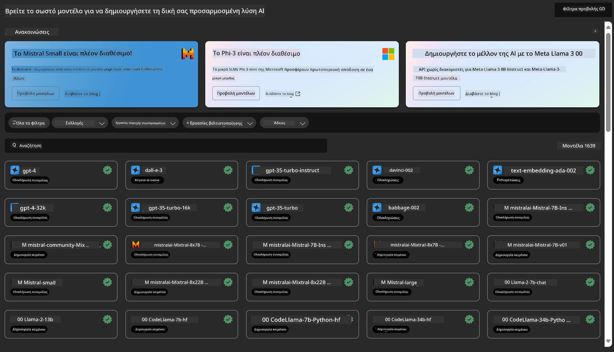
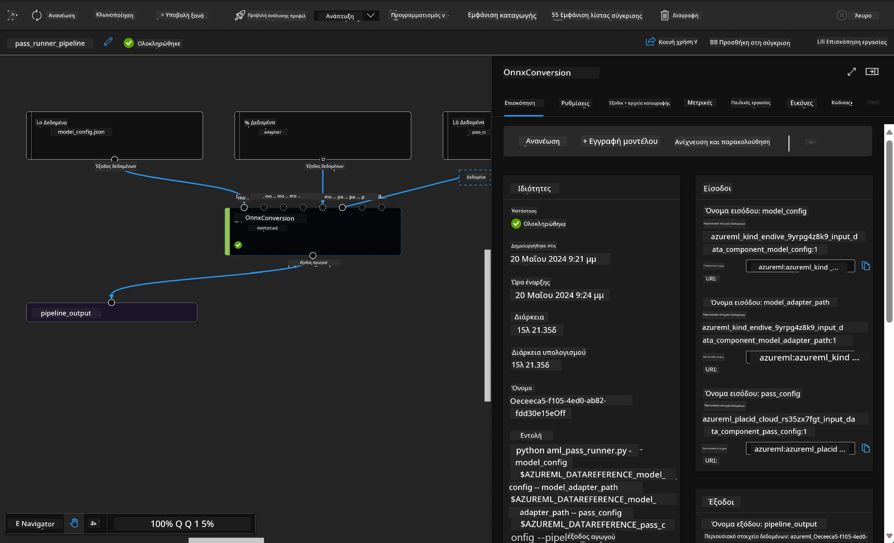

<!--
CO_OP_TRANSLATOR_METADATA:
{
  "original_hash": "7fe541373802e33568e94e13226d463c",
  "translation_date": "2025-07-17T09:41:43+00:00",
  "source_file": "md/03.FineTuning/Introduce_AzureML.md",
  "language_code": "el"
}
-->
# **Εισαγωγή στην Υπηρεσία Azure Machine Learning**

[Azure Machine Learning](https://ml.azure.com?WT.mc_id=aiml-138114-kinfeylo) είναι μια υπηρεσία στο cloud που επιταχύνει και διαχειρίζεται τον κύκλο ζωής των έργων μηχανικής μάθησης (ML).

Οι επαγγελματίες ML, οι επιστήμονες δεδομένων και οι μηχανικοί μπορούν να τη χρησιμοποιήσουν στην καθημερινή τους εργασία για να:

- Εκπαιδεύουν και να αναπτύσσουν μοντέλα.  
- Διαχειρίζονται τις λειτουργίες μηχανικής μάθησης (MLOps).  
- Μπορείτε να δημιουργήσετε ένα μοντέλο στο Azure Machine Learning ή να χρησιμοποιήσετε ένα μοντέλο που έχει κατασκευαστεί από μια πλατφόρμα ανοιχτού κώδικα, όπως PyTorch, TensorFlow ή scikit-learn.  
- Τα εργαλεία MLOps βοηθούν στην παρακολούθηση, επανεκπαίδευση και επαναφορά των μοντέλων.

## Για ποιον είναι το Azure Machine Learning;

**Επιστήμονες Δεδομένων και Μηχανικοί ML**

Μπορούν να χρησιμοποιήσουν εργαλεία για να επιταχύνουν και να αυτοματοποιήσουν τις καθημερινές τους εργασίες.  
Το Azure ML παρέχει δυνατότητες για δικαιοσύνη, επεξηγησιμότητα, παρακολούθηση και έλεγχο.

**Προγραμματιστές Εφαρμογών:**  
Μπορούν να ενσωματώσουν μοντέλα σε εφαρμογές ή υπηρεσίες με ομαλό τρόπο.

**Προγραμματιστές Πλατφόρμας**

Έχουν πρόσβαση σε ένα ισχυρό σύνολο εργαλείων που υποστηρίζονται από ανθεκτικά APIs του Azure Resource Manager.  
Αυτά τα εργαλεία επιτρέπουν την κατασκευή προηγμένων εργαλείων ML.

**Επιχειρήσεις**

Εργαζόμενες στο cloud της Microsoft Azure, οι επιχειρήσεις επωφελούνται από την οικεία ασφάλεια και τον έλεγχο πρόσβασης βάσει ρόλων.  
Μπορούν να ρυθμίσουν έργα για να ελέγχουν την πρόσβαση σε προστατευμένα δεδομένα και συγκεκριμένες λειτουργίες.

## Παραγωγικότητα για Όλη την Ομάδα  
Τα έργα ML συχνά απαιτούν μια ομάδα με ποικίλες δεξιότητες για την κατασκευή και τη συντήρηση.

Το Azure ML παρέχει εργαλεία που σας επιτρέπουν να:  
- Συνεργάζεστε με την ομάδα σας μέσω κοινόχρηστων σημειωματάριων, υπολογιστικών πόρων, serverless υπολογισμού, δεδομένων και περιβαλλόντων.  
- Αναπτύσσετε μοντέλα με δικαιοσύνη, επεξηγησιμότητα, παρακολούθηση και έλεγχο για να καλύψετε απαιτήσεις ιχνηλασιμότητας και συμμόρφωσης.  
- Αναπτύσσετε μοντέλα ML γρήγορα και εύκολα σε μεγάλη κλίμακα, και τα διαχειρίζεστε αποτελεσματικά με MLOps.  
- Εκτελείτε εργασίες μηχανικής μάθησης οπουδήποτε με ενσωματωμένη διακυβέρνηση, ασφάλεια και συμμόρφωση.

## Εργαλεία Πλατφόρμας Διασταυρούμενης Συμβατότητας

Οποιοσδήποτε στην ομάδα ML μπορεί να χρησιμοποιήσει τα εργαλεία που προτιμά για να ολοκληρώσει τη δουλειά.  
Είτε εκτελείτε γρήγορα πειράματα, ρύθμιση υπερπαραμέτρων, κατασκευή pipelines ή διαχείριση συμπερασμάτων, μπορείτε να χρησιμοποιήσετε οικείες διεπαφές όπως:  
- Azure Machine Learning Studio  
- Python SDK (v2)  
- Azure CLI (v2)  
- Azure Resource Manager REST APIs

Καθώς βελτιώνετε τα μοντέλα και συνεργάζεστε καθ’ όλη τη διάρκεια του κύκλου ανάπτυξης, μπορείτε να μοιράζεστε και να βρίσκετε πόρους, στοιχεία και μετρικές μέσα από το UI του Azure Machine Learning studio.

## **LLM/SLM στο Azure ML**

Το Azure ML έχει προσθέσει πολλές λειτουργίες σχετικές με LLM/SLM, συνδυάζοντας LLMOps και SLMOps για τη δημιουργία μιας πλατφόρμας τεχνολογίας γενετικής τεχνητής νοημοσύνης σε επίπεδο επιχείρησης.

### **Κατάλογος Μοντέλων**

Οι επιχειρησιακοί χρήστες μπορούν να αναπτύξουν διαφορετικά μοντέλα ανάλογα με διαφορετικά επιχειρηματικά σενάρια μέσω του Καταλόγου Μοντέλων, και να παρέχουν υπηρεσίες ως Model as Service για προγραμματιστές ή χρήστες επιχειρήσεων.

Ο Κατάλογος Μοντέλων στο Azure Machine Learning studio είναι το κέντρο για την ανακάλυψη και χρήση μιας ευρείας γκάμας μοντέλων που σας επιτρέπουν να δημιουργήσετε εφαρμογές Γενετικής Τεχνητής Νοημοσύνης. Ο κατάλογος περιλαμβάνει εκατοντάδες μοντέλα από παρόχους όπως η υπηρεσία Azure OpenAI, Mistral, Meta, Cohere, Nvidia, Hugging Face, συμπεριλαμβανομένων μοντέλων εκπαιδευμένων από τη Microsoft. Τα μοντέλα από παρόχους εκτός Microsoft θεωρούνται Μη-Προϊόντα Microsoft, όπως ορίζεται στους Όρους Προϊόντων της Microsoft, και υπόκεινται στους όρους που συνοδεύουν το μοντέλο.

### **Pipeline Εργασιών**

Ο πυρήνας ενός pipeline μηχανικής μάθησης είναι η διάσπαση μιας ολοκληρωμένης εργασίας ML σε μια πολυβηματική ροή εργασίας. Κάθε βήμα είναι ένα διαχειρίσιμο στοιχείο που μπορεί να αναπτυχθεί, βελτιστοποιηθεί, ρυθμιστεί και αυτοματοποιηθεί ξεχωριστά. Τα βήματα συνδέονται μέσω καλά ορισμένων διεπαφών. Η υπηρεσία pipeline του Azure Machine Learning οργανώνει αυτόματα όλες τις εξαρτήσεις μεταξύ των βημάτων.

Στην προσαρμογή SLM / LLM, μπορούμε να διαχειριστούμε τα δεδομένα, την εκπαίδευση και τις διαδικασίες παραγωγής μέσω Pipeline.

### **Prompt flow**

Οφέλη από τη χρήση του Azure Machine Learning prompt flow  
Το Azure Machine Learning prompt flow προσφέρει μια σειρά από οφέλη που βοηθούν τους χρήστες να μεταβούν από την ιδέα στην πειραματική φάση και τελικά σε εφαρμογές LLM έτοιμες για παραγωγή:

**Ευελιξία στην κατασκευή prompts**

Διαδραστική εμπειρία συγγραφής: Το prompt flow παρέχει οπτική αναπαράσταση της δομής της ροής, επιτρέποντας στους χρήστες να κατανοούν και να πλοηγούνται εύκολα στα έργα τους. Προσφέρει επίσης εμπειρία κωδικοποίησης παρόμοια με σημειωματάριο για αποδοτική ανάπτυξη και αποσφαλμάτωση της ροής.  
Παραλλαγές για ρύθμιση prompt: Οι χρήστες μπορούν να δημιουργήσουν και να συγκρίνουν πολλαπλές παραλλαγές prompt, διευκολύνοντας μια επαναληπτική διαδικασία βελτίωσης.

Αξιολόγηση: Οι ενσωματωμένες ροές αξιολόγησης επιτρέπουν στους χρήστες να εκτιμήσουν την ποιότητα και την αποτελεσματικότητα των prompts και των ροών τους.

Πλήρεις πόροι: Το prompt flow περιλαμβάνει μια βιβλιοθήκη ενσωματωμένων εργαλείων, δειγμάτων και προτύπων που λειτουργούν ως αφετηρία για ανάπτυξη, εμπνέοντας δημιουργικότητα και επιταχύνοντας τη διαδικασία.

**Ετοιμότητα επιχείρησης για εφαρμογές βασισμένες σε LLM**

Συνεργασία: Το prompt flow υποστηρίζει ομαδική συνεργασία, επιτρέποντας σε πολλούς χρήστες να δουλεύουν μαζί σε έργα κατασκευής prompt, να μοιράζονται γνώση και να διατηρούν έλεγχο εκδόσεων.

Όλα σε μία πλατφόρμα: Το prompt flow απλοποιεί ολόκληρη τη διαδικασία κατασκευής prompt, από την ανάπτυξη και αξιολόγηση μέχρι την ανάπτυξη και παρακολούθηση. Οι χρήστες μπορούν εύκολα να αναπτύξουν τις ροές τους ως endpoints του Azure Machine Learning και να παρακολουθούν την απόδοσή τους σε πραγματικό χρόνο, εξασφαλίζοντας βέλτιστη λειτουργία και συνεχή βελτίωση.

Λύσεις Ετοιμότητας Επιχείρησης Azure Machine Learning: Το prompt flow αξιοποιεί τις ισχυρές λύσεις ετοιμότητας επιχείρησης του Azure Machine Learning, παρέχοντας μια ασφαλή, κλιμακούμενη και αξιόπιστη βάση για την ανάπτυξη, πειραματισμό και ανάπτυξη ροών.

Με το Azure Machine Learning prompt flow, οι χρήστες μπορούν να απελευθερώσουν την ευελιξία τους στην κατασκευή prompt, να συνεργαστούν αποτελεσματικά και να αξιοποιήσουν λύσεις επιπέδου επιχείρησης για επιτυχημένη ανάπτυξη και υλοποίηση εφαρμογών βασισμένων σε LLM.

Συνδυάζοντας τη δύναμη υπολογισμού, τα δεδομένα και τα διάφορα στοιχεία του Azure ML, οι επιχειρησιακοί προγραμματιστές μπορούν εύκολα να δημιουργήσουν τις δικές τους εφαρμογές τεχνητής νοημοσύνης.

**Αποποίηση ευθυνών**:  
Αυτό το έγγραφο έχει μεταφραστεί χρησιμοποιώντας την υπηρεσία αυτόματης μετάφρασης AI [Co-op Translator](https://github.com/Azure/co-op-translator). Παρόλο που επιδιώκουμε την ακρίβεια, παρακαλούμε να έχετε υπόψη ότι οι αυτόματες μεταφράσεις ενδέχεται να περιέχουν λάθη ή ανακρίβειες. Το πρωτότυπο έγγραφο στη γλώσσα του θεωρείται η αυθεντική πηγή. Για κρίσιμες πληροφορίες, συνιστάται επαγγελματική ανθρώπινη μετάφραση. Δεν φέρουμε ευθύνη για τυχόν παρεξηγήσεις ή λανθασμένες ερμηνείες που προκύπτουν από τη χρήση αυτής της μετάφρασης.