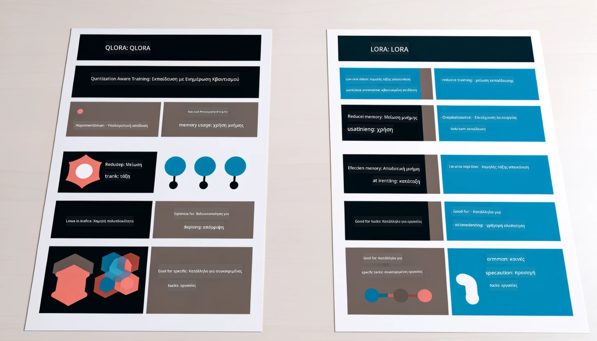

<!--
CO_OP_TRANSLATOR_METADATA:
{
  "original_hash": "743d7e9cb9c4e8ea642d77bee657a7fa",
  "translation_date": "2025-07-17T09:56:50+00:00",
  "source_file": "md/03.FineTuning/LetPhi3gotoIndustriy.md",
  "language_code": "el"
}
-->
# **Ας γίνει το Phi-3 ειδικός στον κλάδο**

Για να ενσωματώσετε το μοντέλο Phi-3 σε έναν κλάδο, πρέπει να προσθέσετε επιχειρηματικά δεδομένα του κλάδου στο μοντέλο Phi-3. Έχουμε δύο διαφορετικές επιλογές, η πρώτη είναι το RAG (Retrieval Augmented Generation) και η δεύτερη είναι το Fine Tuning.

## **RAG vs Fine-Tuning**

### **Retrieval Augmented Generation**

Το RAG είναι ανάκτηση δεδομένων + δημιουργία κειμένου. Τα δομημένα και αδόμητα δεδομένα της επιχείρησης αποθηκεύονται στη βάση δεδομένων διανυσμάτων. Κατά την αναζήτηση σχετικού περιεχομένου, βρίσκονται η σχετική περίληψη και το περιεχόμενο για να σχηματίσουν ένα πλαίσιο, και η ικανότητα συμπλήρωσης κειμένου του LLM/SLM συνδυάζεται για τη δημιουργία περιεχομένου.

### **Fine-tuning**

Το Fine-tuning βασίζεται στη βελτίωση ενός συγκεκριμένου μοντέλου. Δεν χρειάζεται να ξεκινήσει από τον αλγόριθμο του μοντέλου, αλλά τα δεδομένα πρέπει να συσσωρεύονται συνεχώς. Αν θέλετε πιο ακριβή ορολογία και γλωσσική έκφραση στις εφαρμογές του κλάδου, το fine-tuning είναι η καλύτερη επιλογή σας. Όμως, αν τα δεδομένα σας αλλάζουν συχνά, το fine-tuning μπορεί να γίνει περίπλοκο.

### **Πώς να επιλέξετε**

1. Αν η απάντησή μας απαιτεί την εισαγωγή εξωτερικών δεδομένων, το RAG είναι η καλύτερη επιλογή

2. Αν χρειάζεστε σταθερή και ακριβή γνώση του κλάδου, το fine-tuning θα είναι καλή επιλογή. Το RAG δίνει προτεραιότητα στην ανάκτηση σχετικού περιεχομένου αλλά μπορεί να μην αποδώσει πάντα τις εξειδικευμένες λεπτομέρειες.

3. Το fine-tuning απαιτεί ένα ποιοτικό σύνολο δεδομένων, και αν πρόκειται για μικρό εύρος δεδομένων, δεν θα κάνει μεγάλη διαφορά. Το RAG είναι πιο ευέλικτο.

4. Το fine-tuning είναι ένα μαύρο κουτί, μια μεταφυσική διαδικασία, και είναι δύσκολο να κατανοηθεί ο εσωτερικός μηχανισμός. Αντίθετα, το RAG διευκολύνει την εύρεση της πηγής των δεδομένων, επιτρέποντας έτσι την αποτελεσματική διόρθωση ψευδαισθήσεων ή σφαλμάτων περιεχομένου και παρέχοντας καλύτερη διαφάνεια.

### **Σενάρια**

1. Οι κάθετοι κλάδοι απαιτούν συγκεκριμένο επαγγελματικό λεξιλόγιο και εκφράσεις, ***Fine-tuning*** είναι η καλύτερη επιλογή

2. Σύστημα ερωταπαντήσεων, που περιλαμβάνει σύνθεση διαφορετικών σημείων γνώσης, ***RAG*** είναι η καλύτερη επιλογή

3. Ο συνδυασμός αυτοματοποιημένης ροής εργασιών ***RAG + Fine-tuning*** είναι η καλύτερη επιλογή

## **Πώς να χρησιμοποιήσετε το RAG**

Μια βάση δεδομένων διανυσμάτων είναι μια συλλογή δεδομένων αποθηκευμένων σε μαθηματική μορφή. Οι βάσεις δεδομένων διανυσμάτων διευκολύνουν τα μοντέλα μηχανικής μάθησης να θυμούνται προηγούμενες εισόδους, επιτρέποντας τη χρήση της μηχανικής μάθησης για υποστήριξη περιπτώσεων χρήσης όπως αναζήτηση, προτάσεις και δημιουργία κειμένου. Τα δεδομένα μπορούν να αναγνωριστούν βάσει μετρικών ομοιότητας αντί για ακριβείς αντιστοιχίσεις, επιτρέποντας στα υπολογιστικά μοντέλα να κατανοούν το πλαίσιο των δεδομένων.

Η βάση δεδομένων διανυσμάτων είναι το κλειδί για την υλοποίηση του RAG. Μπορούμε να μετατρέψουμε τα δεδομένα σε αποθήκευση διανυσμάτων μέσω μοντέλων διανυσμάτων όπως text-embedding-3, jina-ai-embedding κ.ά.

Μάθετε περισσότερα για τη δημιουργία εφαρμογής RAG [https://github.com/microsoft/Phi-3CookBook](https://github.com/microsoft/Phi-3CookBook?WT.mc_id=aiml-138114-kinfeylo) 

## **Πώς να χρησιμοποιήσετε το Fine-tuning**

Οι συνηθισμένοι αλγόριθμοι στο Fine-tuning είναι οι Lora και QLora. Πώς να επιλέξετε;
- [Μάθετε περισσότερα με αυτό το δείγμα notebook](../../../../code/04.Finetuning/Phi_3_Inference_Finetuning.ipynb)
- [Παράδειγμα Python FineTuning Sample](../../../../code/04.Finetuning/FineTrainingScript.py)

### **Lora και QLora**

Το LoRA (Low-Rank Adaptation) και το QLoRA (Quantized Low-Rank Adaptation) είναι τεχνικές που χρησιμοποιούνται για το fine-tuning μεγάλων γλωσσικών μοντέλων (LLMs) με τη μέθοδο Parameter Efficient Fine Tuning (PEFT). Οι τεχνικές PEFT έχουν σχεδιαστεί για να εκπαιδεύουν μοντέλα πιο αποδοτικά σε σχέση με τις παραδοσιακές μεθόδους.  
Το LoRA είναι μια ανεξάρτητη τεχνική fine-tuning που μειώνει τη μνήμη που απαιτείται εφαρμόζοντας μια προσέγγιση χαμηλής τάξης στον πίνακα ενημέρωσης βαρών. Προσφέρει γρήγορους χρόνους εκπαίδευσης και διατηρεί απόδοση κοντά στις παραδοσιακές μεθόδους fine-tuning.

Το QLoRA είναι μια επεκταμένη έκδοση του LoRA που ενσωματώνει τεχνικές κβαντισμού για περαιτέρω μείωση της χρήσης μνήμης. Το QLoRA κβαντίζει την ακρίβεια των παραμέτρων βάρους στο προεκπαιδευμένο LLM σε ακρίβεια 4-bit, που είναι πιο αποδοτική μνήμη από το LoRA. Ωστόσο, η εκπαίδευση με QLoRA είναι περίπου 30% πιο αργή από την εκπαίδευση με LoRA λόγω των επιπλέον βημάτων κβαντισμού και αποκβαντισμού.

Το QLoRA χρησιμοποιεί το LoRA ως αξεσουάρ για να διορθώσει τα σφάλματα που εισάγονται κατά τον κβαντισμό. Το QLoRA επιτρέπει το fine-tuning τεράστιων μοντέλων με δισεκατομμύρια παραμέτρους σε σχετικά μικρές, ευρέως διαθέσιμες GPUs. Για παράδειγμα, το QLoRA μπορεί να κάνει fine-tuning σε μοντέλο 70B παραμέτρων που απαιτεί 36 GPUs με μόνο 2 GPUs...

**Αποποίηση ευθυνών**:  
Αυτό το έγγραφο έχει μεταφραστεί χρησιμοποιώντας την υπηρεσία αυτόματης μετάφρασης AI [Co-op Translator](https://github.com/Azure/co-op-translator). Παρόλο που επιδιώκουμε την ακρίβεια, παρακαλούμε να λάβετε υπόψη ότι οι αυτόματες μεταφράσεις ενδέχεται να περιέχουν λάθη ή ανακρίβειες. Το πρωτότυπο έγγραφο στη μητρική του γλώσσα πρέπει να θεωρείται η αυθεντική πηγή. Για κρίσιμες πληροφορίες, συνιστάται επαγγελματική ανθρώπινη μετάφραση. Δεν φέρουμε ευθύνη για τυχόν παρεξηγήσεις ή λανθασμένες ερμηνείες που προκύπτουν από τη χρήση αυτής της μετάφρασης.