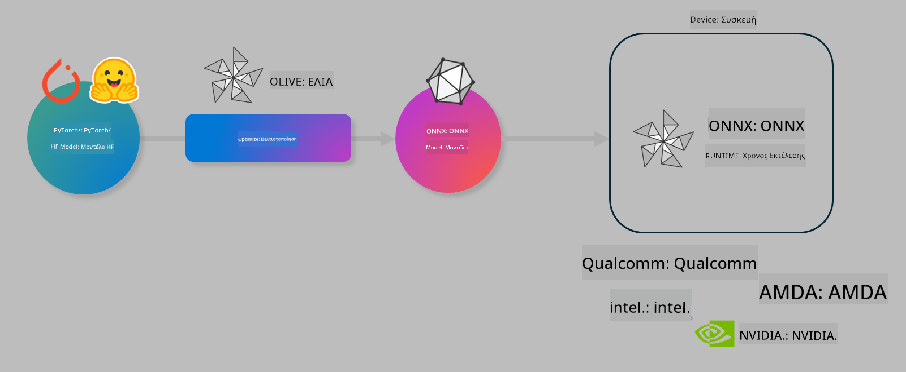

<!--
CO_OP_TRANSLATOR_METADATA:
{
  "original_hash": "6bbe47de3b974df7eea29dfeccf6032b",
  "translation_date": "2025-05-09T22:36:48+00:00",
  "source_file": "md/03.FineTuning/olive-lab/readme.md",
  "language_code": "el"
}
-->
# Εργαστήριο. Βελτιστοποίηση μοντέλων AI για εκτέλεση στη συσκευή

## Εισαγωγή

> [!IMPORTANT]  
> Αυτό το εργαστήριο απαιτεί **Nvidia A10 ή A100 GPU** με τους αντίστοιχους drivers και το CUDA toolkit (έκδοση 12+) εγκατεστημένα.

> [!NOTE]  
> Πρόκειται για ένα εργαστήριο διάρκειας **35 λεπτών** που σας παρέχει μια πρακτική εισαγωγή στις βασικές έννοιες βελτιστοποίησης μοντέλων για εκτέλεση στη συσκευή χρησιμοποιώντας το OLIVE.

## Στόχοι μάθησης

Στο τέλος αυτού του εργαστηρίου, θα μπορείτε να χρησιμοποιήσετε το OLIVE για:

- Ποσοτικοποίηση ενός μοντέλου AI χρησιμοποιώντας τη μέθοδο ποσοτικοποίησης AWQ.  
- Λεπτομερή εκπαίδευση (fine-tuning) ενός μοντέλου AI για συγκεκριμένη εργασία.  
- Δημιουργία προσαρμογέων LoRA (fine-tuned μοντέλο) για αποδοτική εκτέλεση στη συσκευή με το ONNX Runtime.

### Τι είναι το Olive

Το Olive (*O*NNX *live*) είναι ένα εργαλείο βελτιστοποίησης μοντέλων με συνοδευτικό CLI που σας επιτρέπει να παραδώσετε μοντέλα για το ONNX runtime +++https://onnxruntime.ai+++ με ποιότητα και απόδοση.



Η είσοδος στο Olive είναι συνήθως ένα μοντέλο PyTorch ή Hugging Face και η έξοδος είναι ένα βελτιστοποιημένο μοντέλο ONNX που εκτελείται σε μια συσκευή (στόχο ανάπτυξης) με το ONNX runtime. Το Olive βελτιστοποιεί το μοντέλο για τον επιταχυντή AI (NPU, GPU, CPU) του στόχου ανάπτυξης που παρέχεται από κατασκευαστές υλικού όπως Qualcomm, AMD, Nvidia ή Intel.

Το Olive εκτελεί μια *ροή εργασίας* (workflow), η οποία είναι μια διατεταγμένη αλληλουχία ατομικών εργασιών βελτιστοποίησης μοντέλου που ονομάζονται *passes* – παραδείγματα passes είναι: συμπίεση μοντέλου, καταγραφή γραφήματος, ποσοτικοποίηση, βελτιστοποίηση γραφήματος. Κάθε pass έχει ένα σύνολο παραμέτρων που μπορούν να ρυθμιστούν για να επιτευχθούν οι καλύτερες μετρικές, π.χ. ακρίβεια και καθυστέρηση, οι οποίες αξιολογούνται από τον αντίστοιχο αξιολογητή. Το Olive χρησιμοποιεί μια στρατηγική αναζήτησης που εφαρμόζει έναν αλγόριθμο για αυτόματη ρύθμιση κάθε pass ξεχωριστά ή συνδυαστικά.

#### Οφέλη του Olive

- **Μειώνει τον χρόνο και την απογοήτευση** από τη χειροκίνητη πειραματική διαδικασία με διαφορετικές τεχνικές για βελτιστοποίηση γραφήματος, συμπίεση και ποσοτικοποίηση. Ορίστε τις προδιαγραφές ποιότητας και απόδοσης και αφήστε το Olive να βρει αυτόματα το καλύτερο μοντέλο για εσάς.  
- **Πάνω από 40 ενσωματωμένα στοιχεία βελτιστοποίησης μοντέλων** που καλύπτουν σύγχρονες τεχνικές ποσοτικοποίησης, συμπίεσης, βελτιστοποίησης γραφήματος και λεπτομερούς εκπαίδευσης.  
- **Εύκολο στη χρήση CLI** για κοινές εργασίες βελτιστοποίησης μοντέλων. Για παράδειγμα, olive quantize, olive auto-opt, olive finetune.  
- Ενσωματωμένη συσκευασία και ανάπτυξη μοντέλων.  
- Υποστήριξη για δημιουργία μοντέλων **Multi LoRA serving**.  
- Δημιουργία ροών εργασίας με YAML/JSON για τον συντονισμό εργασιών βελτιστοποίησης και ανάπτυξης μοντέλων.  
- Ενσωμάτωση με **Hugging Face** και **Azure AI**.  
- Ενσωματωμένος μηχανισμός **caching** για **εξοικονόμηση κόστους**.

## Οδηγίες Εργαστηρίου

> [!NOTE]  
> Βεβαιωθείτε ότι έχετε ρυθμίσει το Azure AI Hub και το Project σας και έχετε ρυθμίσει τον υπολογιστή A100 όπως στο Εργαστήριο 1.

### Βήμα 0: Σύνδεση με το Azure AI Compute

Θα συνδεθείτε στο Azure AI compute χρησιμοποιώντας τη λειτουργία απομακρυσμένης σύνδεσης στο **VS Code**.

1. Ανοίξτε την εφαρμογή **VS Code** στον υπολογιστή σας.  
1. Ανοίξτε την **παλέτα εντολών** με **Shift+Ctrl+P**.  
1. Αναζητήστε στην παλέτα εντολών την επιλογή **AzureML - remote: Connect to compute instance in New Window**.  
1. Ακολουθήστε τις οδηγίες στην οθόνη για να συνδεθείτε στον Compute. Θα χρειαστεί να επιλέξετε τη συνδρομή Azure, την Ομάδα Πόρων, το Project και το όνομα Compute που έχετε ορίσει στο Εργαστήριο 1.  
1. Μόλις συνδεθείτε στον κόμβο Azure ML Compute, αυτό θα εμφανιστεί στο **κάτω αριστερό μέρος του Visual Code** `><Azure ML: Compute Name`

### Βήμα 1: Κλωνοποίηση αυτού του αποθετηρίου

Στο VS Code, ανοίξτε ένα νέο τερματικό με **Ctrl+J** και κλωνοποιήστε αυτό το αποθετήριο:

Στο τερματικό θα δείτε την προτροπή

```
azureuser@computername:~/cloudfiles/code$ 
```  
Κλωνοποίηση της λύσης  

```bash
cd ~/localfiles
git clone https://github.com/microsoft/phi-3cookbook.git
```

### Βήμα 2: Άνοιγμα φακέλου στο VS Code

Για να ανοίξετε το VS Code στον αντίστοιχο φάκελο, εκτελέστε την παρακάτω εντολή στο τερματικό, η οποία θα ανοίξει ένα νέο παράθυρο:

```bash
code phi-3cookbook/code/04.Finetuning/Olive-lab
```

Εναλλακτικά, μπορείτε να ανοίξετε το φάκελο επιλέγοντας **File** > **Open Folder**.

### Βήμα 3: Εξαρτήσεις

Ανοίξτε ένα τερματικό στο VS Code στο Azure AI Compute Instance σας (συντόμευση: **Ctrl+J**) και εκτελέστε τις παρακάτω εντολές για να εγκαταστήσετε τις εξαρτήσεις:

```bash
conda create -n olive-ai python=3.11 -y
conda activate olive-ai
pip install -r requirements.txt
az extension remove -n azure-cli-ml
az extension add -n ml
```

> [!NOTE]  
> Η εγκατάσταση όλων των εξαρτήσεων θα διαρκέσει περίπου 5 λεπτά.

Σε αυτό το εργαστήριο θα κατεβάσετε και θα ανεβάσετε μοντέλα στον κατάλογο μοντέλων Azure AI. Για να έχετε πρόσβαση στον κατάλογο, πρέπει να συνδεθείτε στο Azure με:

```bash
az login
```

> [!NOTE]  
> Κατά τη σύνδεση θα σας ζητηθεί να επιλέξετε τη συνδρομή σας. Βεβαιωθείτε ότι έχετε επιλέξει τη συνδρομή που παρέχεται για αυτό το εργαστήριο.

### Βήμα 4: Εκτέλεση εντολών Olive

Ανοίξτε ένα τερματικό στο VS Code στο Azure AI Compute Instance σας (συντόμευση: **Ctrl+J**) και βεβαιωθείτε ότι το περιβάλλον `olive-ai` είναι ενεργοποιημένο:

```bash
conda activate olive-ai
```

Στη συνέχεια, εκτελέστε τις παρακάτω εντολές Olive στη γραμμή εντολών.

1. **Επιθεώρηση δεδομένων:** Σε αυτό το παράδειγμα, θα κάνετε fine-tune το μοντέλο Phi-3.5-Mini ώστε να εξειδικευτεί σε ερωτήσεις σχετικές με ταξίδια. Ο παρακάτω κώδικας εμφανίζει τις πρώτες εγγραφές του dataset, που είναι σε μορφή JSON lines:

    ```bash
    head data/data_sample_travel.jsonl
    ```

1. **Ποσοτικοποίηση του μοντέλου:** Πριν την εκπαίδευση, ποσοτικοποιείτε το μοντέλο με την εντολή που χρησιμοποιεί την τεχνική Active Aware Quantization (AWQ) +++https://arxiv.org/abs/2306.00978+++. Η AWQ ποσοτικοποιεί τα βάρη ενός μοντέλου λαμβάνοντας υπόψη τις ενεργοποιήσεις που παράγονται κατά την εκτέλεση. Αυτό σημαίνει ότι η διαδικασία ποσοτικοποίησης λαμβάνει υπόψη την πραγματική κατανομή δεδομένων στις ενεργοποιήσεις, διατηρώντας καλύτερα την ακρίβεια του μοντέλου σε σύγκριση με παραδοσιακές μεθόδους ποσοτικοποίησης βαρών.

    ```bash
    olive quantize \
       --model_name_or_path microsoft/Phi-3.5-mini-instruct \
       --trust_remote_code \
       --algorithm awq \
       --output_path models/phi/awq \
       --log_level 1
    ```

    Η διαδικασία AWQ διαρκεί περίπου **8 λεπτά** και **μειώνει το μέγεθος του μοντέλου από ~7.5GB σε ~2.5GB**.

    Σε αυτό το εργαστήριο, δείχνουμε πώς να εισάγετε μοντέλα από το Hugging Face (για παράδειγμα: `microsoft/Phi-3.5-mini-instruct`). However, Olive also allows you to input models from the Azure AI catalog by updating the `model_name_or_path` argument to an Azure AI asset ID (for example:  `azureml://registries/azureml/models/Phi-3.5-mini-instruct/versions/4`). 

1. **Train the model:** Next, the `olive finetune` η εντολή fine-tune εκπαιδεύει περαιτέρω το ποσοτικοποιημένο μοντέλο). Η ποσοτικοποίηση *πριν* από το fine-tuning αντί μετά δίνει καλύτερη ακρίβεια, καθώς η διαδικασία fine-tuning ανακτά μέρος της απώλειας από την ποσοτικοποίηση.

    ```bash
    olive finetune \
        --method lora \
        --model_name_or_path models/phi/awq \
        --data_files "data/data_sample_travel.jsonl" \
        --data_name "json" \
        --text_template "<|user|>\n{prompt}<|end|>\n<|assistant|>\n{response}<|end|>" \
        --max_steps 100 \
        --output_path ./models/phi/ft \
        --log_level 1
    ```

    Η διαδικασία fine-tuning διαρκεί περίπου **6 λεπτά** (με 100 βήματα).

1. **Βελτιστοποίηση:** Μετά την εκπαίδευση, βελτιστοποιείτε το μοντέλο χρησιμοποιώντας την εντολή `auto-opt` command, which will capture the ONNX graph and automatically perform a number of optimizations to improve the model performance for CPU by compressing the model and doing fusions. It should be noted, that you can also optimize for other devices such as NPU or GPU by just updating the `--device` and `--provider` του Olive - αλλά για τις ανάγκες αυτού του εργαστηρίου θα χρησιμοποιήσουμε CPU.

    ```bash
    olive auto-opt \
       --model_name_or_path models/phi/ft/model \
       --adapter_path models/phi/ft/adapter \
       --device cpu \
       --provider CPUExecutionProvider \
       --use_ort_genai \
       --output_path models/phi/onnx-ao \
       --log_level 1
    ```

    Η βελτιστοποίηση διαρκεί περίπου **5 λεπτά**.

### Βήμα 5: Γρήγορος έλεγχος εκτέλεσης μοντέλου

Για να δοκιμάσετε την εκτέλεση του μοντέλου, δημιουργήστε ένα αρχείο Python στον φάκελό σας με όνομα **app.py** και αντιγράψτε τον παρακάτω κώδικα:

```python
import onnxruntime_genai as og
import numpy as np

print("loading model and adapters...", end="", flush=True)
model = og.Model("models/phi/onnx-ao/model")
adapters = og.Adapters(model)
adapters.load("models/phi/onnx-ao/model/adapter_weights.onnx_adapter", "travel")
print("DONE!")

tokenizer = og.Tokenizer(model)
tokenizer_stream = tokenizer.create_stream()

params = og.GeneratorParams(model)
params.set_search_options(max_length=100, past_present_share_buffer=False)
user_input = "what is the best thing to see in chicago"
params.input_ids = tokenizer.encode(f"<|user|>\n{user_input}<|end|>\n<|assistant|>\n")

generator = og.Generator(model, params)

generator.set_active_adapter(adapters, "travel")

print(f"{user_input}")

while not generator.is_done():
    generator.compute_logits()
    generator.generate_next_token()

    new_token = generator.get_next_tokens()[0]
    print(tokenizer_stream.decode(new_token), end='', flush=True)

print("\n")
```

Εκτελέστε τον κώδικα με:

```bash
python app.py
```

### Βήμα 6: Ανέβασμα μοντέλου στο Azure AI

Η αποστολή του μοντέλου σε ένα αποθετήριο μοντέλων Azure AI το καθιστά διαθέσιμο σε άλλα μέλη της ομάδας ανάπτυξής σας και διαχειρίζεται την έκδοση του μοντέλου. Για να ανεβάσετε το μοντέλο εκτελέστε την παρακάτω εντολή:

> [!NOTE]  
> Ενημερώστε τα `{}`` placeholders with the name of your resource group and Azure AI Project Name. 

To find your resource group ` με το όνομα του resourceGroup και το όνομα του Azure AI Project, και εκτελέστε την εντολή

```
az ml workspace show
```

Εναλλακτικά, επισκεφτείτε +++ai.azure.com+++ και επιλέξτε **management center** > **project** > **overview**

Ενημερώστε τα `{}` με το όνομα της ομάδας πόρων και του Azure AI Project σας.

```bash
az ml model create \
    --name ft-for-travel \
    --version 1 \
    --path ./models/phi/onnx-ao \
    --resource-group {RESOURCE_GROUP_NAME} \
    --workspace-name {PROJECT_NAME}
```  
Μπορείτε στη συνέχεια να δείτε το ανεβασμένο μοντέλο σας και να το αναπτύξετε στο https://ml.azure.com/model/list

**Αποποίηση ευθυνών**:  
Αυτό το έγγραφο έχει μεταφραστεί χρησιμοποιώντας την υπηρεσία αυτόματης μετάφρασης AI [Co-op Translator](https://github.com/Azure/co-op-translator). Παρόλο που επιδιώκουμε την ακρίβεια, παρακαλούμε να γνωρίζετε ότι οι αυτόματες μεταφράσεις μπορεί να περιέχουν λάθη ή ανακρίβειες. Το πρωτότυπο έγγραφο στη μητρική του γλώσσα πρέπει να θεωρείται η αυθεντική πηγή. Για κρίσιμες πληροφορίες, συνιστάται επαγγελματική ανθρώπινη μετάφραση. Δεν φέρουμε ευθύνη για τυχόν παρεξηγήσεις ή λανθασμένες ερμηνείες που προκύπτουν από τη χρήση αυτής της μετάφρασης.