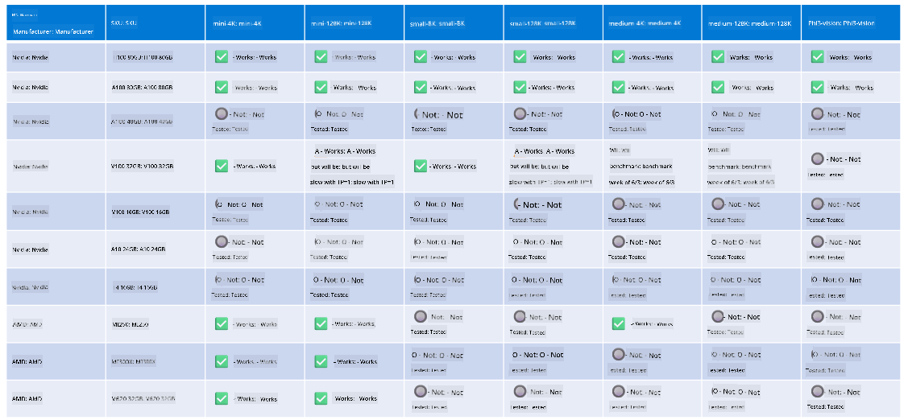

<!--
CO_OP_TRANSLATOR_METADATA:
{
  "original_hash": "8cdc17ce0f10535da30b53d23fe1a795",
  "translation_date": "2025-07-16T18:22:32+00:00",
  "source_file": "md/01.Introduction/01/01.Hardwaresupport.md",
  "language_code": "en"
}
-->
# Phi Hardware Support

Microsoft Phi has been optimized for ONNX Runtime and supports Windows DirectML. It performs well across various hardware types, including GPUs, CPUs, and even mobile devices.

## Device Hardware  
Specifically, the supported hardware includes:

- GPU SKU: RTX 4090 (DirectML)  
- GPU SKU: 1 A100 80GB (CUDA)  
- CPU SKU: Standard F64s v2 (64 vCPUs, 128 GiB memory)  

## Mobile SKU

- Android - Samsung Galaxy S21  
- Apple iPhone 14 or higher A16/A17 Processor  

## Phi Hardware Specification

- Minimum Configuration Required.  
- Windows: DirectX 12-capable GPU and at least 4GB of combined RAM  

CUDA: NVIDIA GPU with Compute Capability >= 7.02  



## Running onnxruntime on multiple GPUs

Currently, available Phi ONNX models support only 1 GPU. Multi-GPU support for Phi models is possible, but ORT with 2 GPUs does not guarantee higher throughput compared to running 2 separate instances of ORT. Please refer to [ONNX Runtime](https://onnxruntime.ai/) for the latest updates.

At [Build 2024 the GenAI ONNX Team](https://youtu.be/WLW4SE8M9i8?si=EtG04UwDvcjunyfC) announced that they enabled multi-instance instead of multi-GPU for Phi models.

Currently, this allows you to run one onnxruntime or onnxruntime-genai instance using the CUDA_VISIBLE_DEVICES environment variable like this.

```Python
CUDA_VISIBLE_DEVICES=0 python infer.py
CUDA_VISIBLE_DEVICES=1 python infer.py
```

Feel free to explore Phi further in [Azure AI Foundry](https://ai.azure.com)

**Disclaimer**:  
This document has been translated using the AI translation service [Co-op Translator](https://github.com/Azure/co-op-translator). While we strive for accuracy, please be aware that automated translations may contain errors or inaccuracies. The original document in its native language should be considered the authoritative source. For critical information, professional human translation is recommended. We are not liable for any misunderstandings or misinterpretations arising from the use of this translation.