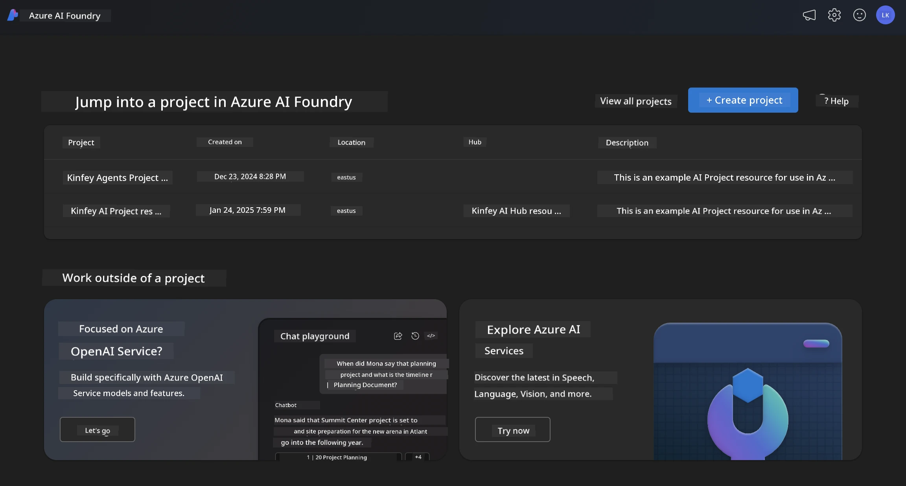
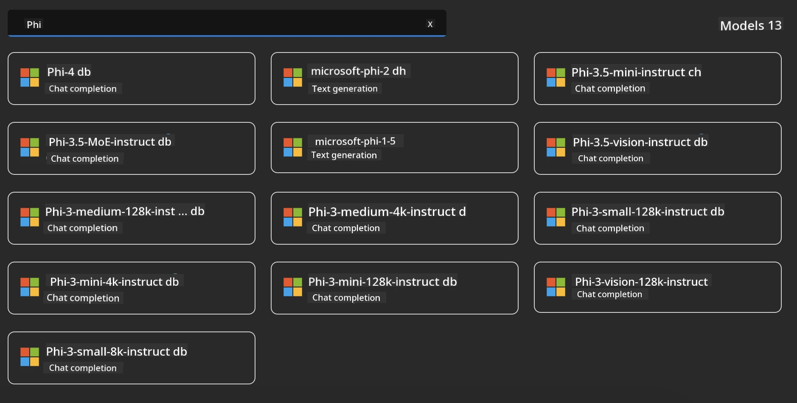
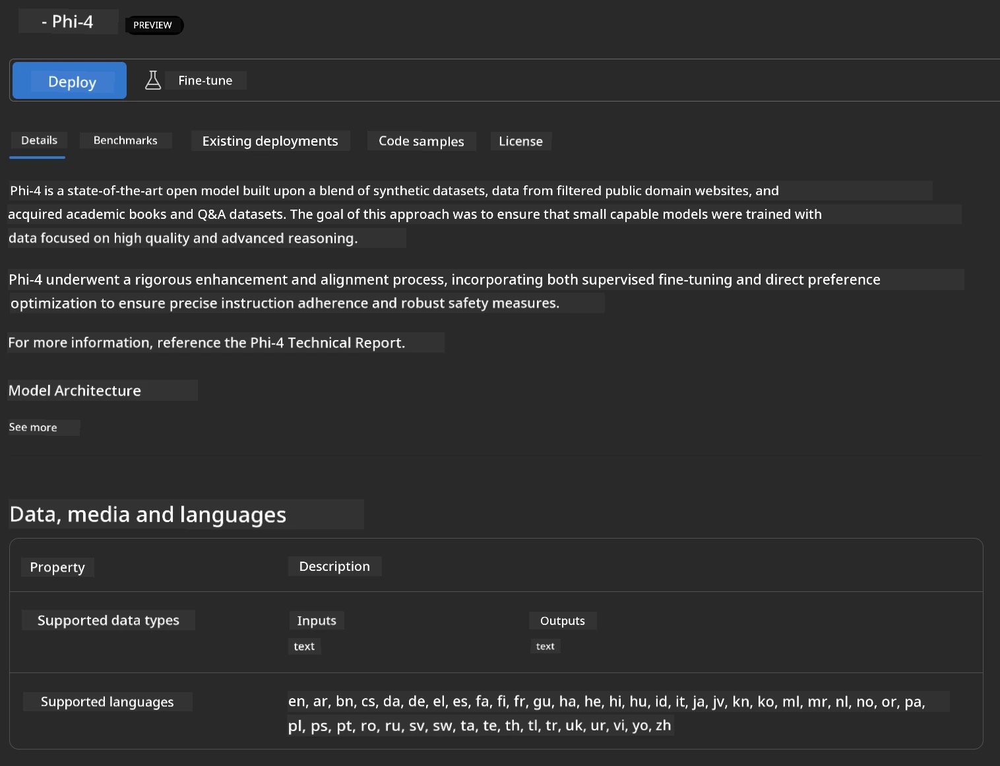
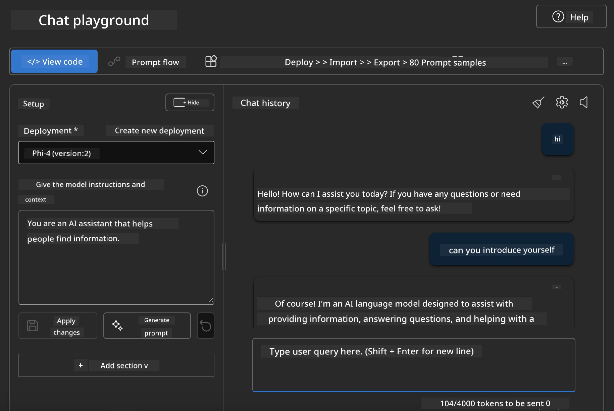

<!--
CO_OP_TRANSLATOR_METADATA:
{
  "original_hash": "3ae21dc5554e888defbe57946ee995ee",
  "translation_date": "2025-07-16T19:06:21+00:00",
  "source_file": "md/01.Introduction/02/03.AzureAIFoundry.md",
  "language_code": "en"
}
-->
## Phi Family in Azure AI Foundry

[Azure AI Foundry](https://ai.azure.com) is a trusted platform that enables developers to drive innovation and shape the future with AI in a safe, secure, and responsible manner.

[Azure AI Foundry](https://ai.azure.com) is designed for developers to:

- Build generative AI applications on an enterprise-grade platform.
- Explore, build, test, and deploy using cutting-edge AI tools and ML models, all grounded in responsible AI practices.
- Collaborate with a team throughout the entire application development lifecycle.

With Azure AI Foundry, you can explore a wide range of models, services, and capabilities, and start building AI applications that best meet your goals. The Azure AI Foundry platform supports scalability, making it easy to transform proofs of concept into fully operational production applications. Continuous monitoring and refinement help ensure long-term success.



Besides using the Azure AOAI Service in Azure AI Foundry, you can also utilize third-party models available in the Azure AI Foundry Model Catalog. This is a great option if you want to use Azure AI Foundry as your AI solution platform.

We can quickly deploy Phi Family Models through the Model Catalog in Azure AI Foundry

[Microsoft Phi Models in Azure AI Foundry Models](https://ai.azure.com/explore/models/?selectedCollection=phi)



### **Deploy Phi-4 in Azure AI Foundry**



### **Test Phi-4 in Azure AI Foundry Playground**



### **Running Python Code to call Azure AI Foundry Phi-4**

```python

import os  
import base64
from openai import AzureOpenAI  
from azure.identity import DefaultAzureCredential, get_bearer_token_provider  
        
endpoint = os.getenv("ENDPOINT_URL", "Your Azure AOAI Service Endpoint")  
deployment = os.getenv("DEPLOYMENT_NAME", "Phi-4")  
      
token_provider = get_bearer_token_provider(  
    DefaultAzureCredential(),  
    "https://cognitiveservices.azure.com/.default"  
)  
  
client = AzureOpenAI(  
    azure_endpoint=endpoint,  
    azure_ad_token_provider=token_provider,  
    api_version="2024-05-01-preview",  
)  
  

chat_prompt = [
    {
        "role": "system",
        "content": "You are an AI assistant that helps people find information."
    },
    {
        "role": "user",
        "content": "can you introduce yourself"
    }
] 
    
# Include speech result if speech is enabled  
messages = chat_prompt 

completion = client.chat.completions.create(  
    model=deployment,  
    messages=messages,
    max_tokens=800,  
    temperature=0.7,  
    top_p=0.95,  
    frequency_penalty=0,  
    presence_penalty=0,
    stop=None,  
    stream=False  
)  
  
print(completion.to_json())  

```

**Disclaimer**:  
This document has been translated using the AI translation service [Co-op Translator](https://github.com/Azure/co-op-translator). While we strive for accuracy, please be aware that automated translations may contain errors or inaccuracies. The original document in its native language should be considered the authoritative source. For critical information, professional human translation is recommended. We are not liable for any misunderstandings or misinterpretations arising from the use of this translation.