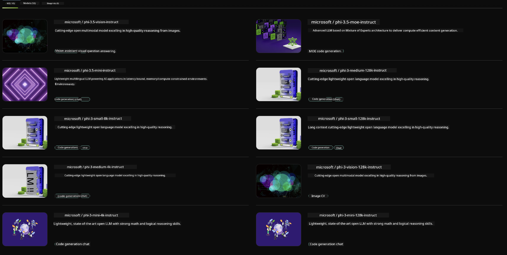

<!--
CO_OP_TRANSLATOR_METADATA:
{
  "original_hash": "7b08e277df2a9307f861ae54bc30c772",
  "translation_date": "2025-07-16T19:32:16+00:00",
  "source_file": "md/01.Introduction/02/06.NVIDIA.md",
  "language_code": "en"
}
-->
## Phi Family in NVIDIA NIM

NVIDIA NIM is a collection of user-friendly microservices designed to speed up the deployment of generative AI models across the cloud, data centers, and workstations. NIMs are organized by model family and on a per-model basis. For instance, NVIDIA NIM for large language models (LLMs) brings the power of cutting-edge LLMs to enterprise applications, delivering unmatched natural language processing and understanding capabilities.

NIM makes it simple for IT and DevOps teams to self-host large language models (LLMs) in their own managed environments while still providing developers with industry-standard APIs that enable them to build powerful copilots, chatbots, and AI assistants that can transform their business. By leveraging NVIDIA’s advanced GPU acceleration and scalable deployment, NIM offers the fastest route to inference with exceptional performance.

You can use NVIDIA NIM to run inference on Phi Family Models



### **Samples - Phi-3-Vision in NVIDIA NIM**

Imagine you have an image (`demo.png`) and want to generate Python code that processes this image and saves a new version (`phi-3-vision.jpg`).

The code above automates this process by:

1. Setting up the environment and necessary configurations.  
2. Creating a prompt that instructs the model to generate the required Python code.  
3. Sending the prompt to the model and collecting the generated code.  
4. Extracting and executing the generated code.  
5. Displaying the original and processed images.

This method harnesses the power of AI to automate image processing tasks, making it easier and faster to achieve your objectives.

[Sample Code Solution](../../../../../code/06.E2E/E2E_Nvidia_NIM_Phi3_Vision.ipynb)

Let’s break down what the entire code does step by step:

1. **Install Required Package**:  
    ```python
    !pip install langchain_nvidia_ai_endpoints -U
    ```  
    This command installs the `langchain_nvidia_ai_endpoints` package, ensuring it’s the latest version.

2. **Import Necessary Modules**:  
    ```python
    from langchain_nvidia_ai_endpoints import ChatNVIDIA
    import getpass
    import os
    import base64
    ```  
    These imports bring in the modules needed to interact with NVIDIA AI endpoints, securely handle passwords, work with the operating system, and encode/decode data in base64 format.

3. **Set Up API Key**:  
    ```python
    if not os.getenv("NVIDIA_API_KEY"):
        os.environ["NVIDIA_API_KEY"] = getpass.getpass("Enter your NVIDIA API key: ")
    ```  
    This code checks if the `NVIDIA_API_KEY` environment variable is set. If not, it securely prompts the user to enter their API key.

4. **Define Model and Image Path**:  
    ```python
    model = 'microsoft/phi-3-vision-128k-instruct'
    chat = ChatNVIDIA(model=model)
    img_path = './imgs/demo.png'
    ```  
    This sets the model to use, creates an instance of `ChatNVIDIA` with the specified model, and defines the path to the image file.

5. **Create Text Prompt**:  
    ```python
    text = "Please create Python code for image, and use plt to save the new picture under imgs/ and name it phi-3-vision.jpg."
    ```  
    This defines a text prompt instructing the model to generate Python code for processing an image.

6. **Encode Image in Base64**:  
    ```python
    with open(img_path, "rb") as f:
        image_b64 = base64.b64encode(f.read()).decode()
    image = f''
    ```  
    This code reads the image file, encodes it in base64, and creates an HTML image tag with the encoded data.

7. **Combine Text and Image into Prompt**:  
    ```python
    prompt = f"{text} {image}"
    ```  
    This merges the text prompt and the HTML image tag into a single string.

8. **Generate Code Using ChatNVIDIA**:  
    ```python
    code = ""
    for chunk in chat.stream(prompt):
        print(chunk.content, end="")
        code += chunk.content
    ```  
    This sends the prompt to the `ChatNVIDIA` model and collects the generated code in chunks, printing and appending each chunk to the `code` string.

9. **Extract Python Code from Generated Content**:  
    ```python
    begin = code.index('```python') + 9  
    code = code[begin:]  
    end = code.index('```')
    code = code[:end]
    ```  
    This extracts the actual Python code from the generated content by removing the markdown formatting.

10. **Run the Generated Code**:  
    ```python
    import subprocess
    result = subprocess.run(["python", "-c", code], capture_output=True)
    ```  
    This executes the extracted Python code as a subprocess and captures its output.

11. **Display Images**:  
    ```python
    from IPython.display import Image, display
    display(Image(filename='./imgs/phi-3-vision.jpg'))
    display(Image(filename='./imgs/demo.png'))
    ```  
    These lines display the images using the `IPython.display` module.

**Disclaimer**:  
This document has been translated using the AI translation service [Co-op Translator](https://github.com/Azure/co-op-translator). While we strive for accuracy, please be aware that automated translations may contain errors or inaccuracies. The original document in its native language should be considered the authoritative source. For critical information, professional human translation is recommended. We are not liable for any misunderstandings or misinterpretations arising from the use of this translation.