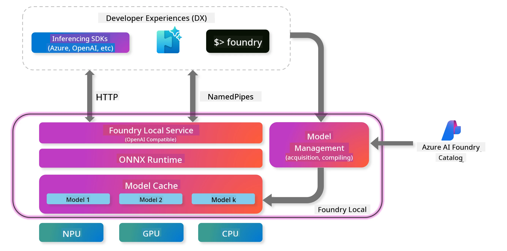
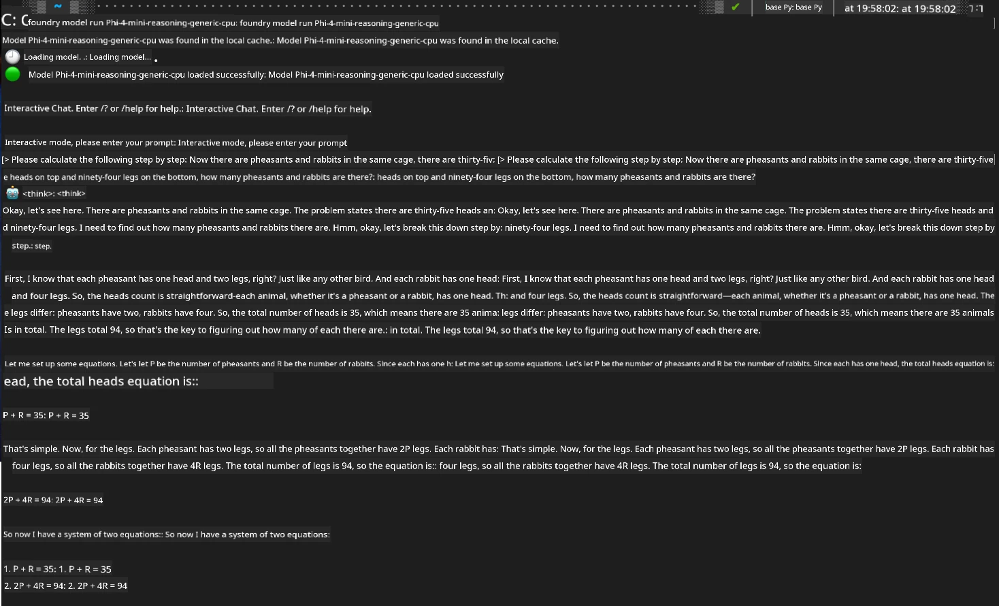

## Getting Started with Phi-Family Models in Foundry Local

### Introduction to Foundry Local

Foundry Local is a powerful on-device AI inference solution that delivers enterprise-grade AI capabilities directly to your local hardware. This tutorial will walk you through setting up and using Phi-Family models with Foundry Local, giving you full control over your AI workloads while ensuring privacy and lowering costs.

Foundry Local offers advantages in performance, privacy, customization, and cost by running AI models locally on your device. It integrates smoothly into your existing workflows and applications via an intuitive CLI, SDK, and REST API.




### Why Choose Foundry Local?

Knowing the benefits of Foundry Local will help you make informed decisions about your AI deployment strategy:

- **On-Device Inference:** Run models locally on your own hardware, cutting costs while keeping all your data on your device.

- **Model Customization:** Choose from preset models or use your own to fit specific needs and use cases.

- **Cost Efficiency:** Avoid recurring cloud service fees by leveraging your existing hardware, making AI more accessible.

- **Seamless Integration:** Connect with your applications through an SDK, API endpoints, or the CLI, with easy scaling to Azure AI Foundry as your requirements grow.

> **Getting Started Note:** This tutorial focuses on using Foundry Local through CLI and SDK interfaces. You'll learn both methods to help you pick the best fit for your use case.

## Part 1: Setting Up Foundry Local CLI

### Step 1: Installation

The Foundry Local CLI is your entry point for managing and running AI models locally. Let’s begin by installing it on your system.

**Supported Platforms:** Windows and macOS

For detailed installation instructions, please see the [official Foundry Local documentation](https://github.com/microsoft/Foundry-Local/blob/main/README.md).

### Step 2: Exploring Available Models

After installing the Foundry Local CLI, you can check which models are available for your needs. This command will list all supported models:


```bash
foundry model list
```

### Step 3: Understanding Phi Family Models

The Phi Family includes a variety of models optimized for different use cases and hardware setups. Here are the Phi models available in Foundry Local:

**Available Phi Models:** 

- **phi-3.5-mini** - Compact model for basic tasks
- **phi-3-mini-128k** - Extended context version for longer conversations
- **phi-3-mini-4k** - Standard context model for general use
- **phi-4** - Advanced model with enhanced capabilities
- **phi-4-mini** - Lightweight version of Phi-4
- **phi-4-mini-reasoning** - Specialized for complex reasoning tasks

> **Hardware Compatibility:** Each model can be configured for different hardware acceleration (CPU, GPU) depending on your system’s capabilities.

### Step 4: Running Your First Phi Model

Let’s try a practical example. We’ll run the `phi-4-mini-reasoning` model, which is great at solving complex problems step-by-step.


**Command to run the model:**

```bash
foundry model run Phi-4-mini-reasoning-generic-cpu
```

> **First-Time Setup:** When running a model for the first time, Foundry Local will automatically download it to your device. Download time depends on your network speed, so please be patient during the initial setup.

### Step 5: Testing the Model with a Real Problem

Now let’s test our model with a classic logic problem to see how it handles step-by-step reasoning:

**Example Problem:**

```txt
Please calculate the following step by step: Now there are pheasants and rabbits in the same cage, there are thirty-five heads on top and ninety-four legs on the bottom, how many pheasants and rabbits are there?
```

**Expected Behavior:** The model should break down this problem into logical steps, using the fact that pheasants have 2 legs and rabbits have 4 legs to solve the system of equations.

**Results:**



## Part 2: Building Applications with Foundry Local SDK

### Why Use the SDK?

While the CLI is great for testing and quick interactions, the SDK lets you integrate Foundry Local into your applications programmatically. This opens up possibilities for:

- Building custom AI-powered applications
- Creating automated workflows
- Integrating AI capabilities into existing systems
- Developing chatbots and interactive tools

### Supported Programming Languages

Foundry Local offers SDK support for multiple programming languages to suit your development preferences:

**📦 Available SDKs:**

- **C# (.NET):** [SDK Documentation & Examples](https://github.com/microsoft/Foundry-Local/tree/main/sdk/cs)
- **Python:** [SDK Documentation & Examples](https://github.com/microsoft/Foundry-Local/tree/main/sdk/python)
- **JavaScript:** [SDK Documentation & Examples](https://github.com/microsoft/Foundry-Local/tree/main/sdk/js)
- **Rust:** [SDK Documentation & Examples](https://github.com/microsoft/Foundry-Local/tree/main/sdk/rust)

### Next Steps

1. **Choose your preferred SDK** based on your development environment
2. **Follow the SDK-specific documentation** for detailed implementation guides
3. **Start with simple examples** before building complex applications
4. **Explore the sample code** provided in each SDK repository

## Conclusion

You’ve now learned how to:
- ✅ Install and set up Foundry Local CLI
- ✅ Discover and run Phi Family models
- ✅ Test models with real-world problems
- ✅ Understand SDK options for application development

Foundry Local provides a strong foundation for bringing AI capabilities directly to your local environment, giving you control over performance, privacy, and costs while keeping the flexibility to scale to cloud solutions when needed.

**Disclaimer**:  
This document has been translated using the AI translation service [Co-op Translator](https://github.com/Azure/co-op-translator). While we strive for accuracy, please be aware that automated translations may contain errors or inaccuracies. The original document in its native language should be considered the authoritative source. For critical information, professional human translation is recommended. We are not liable for any misunderstandings or misinterpretations arising from the use of this translation.