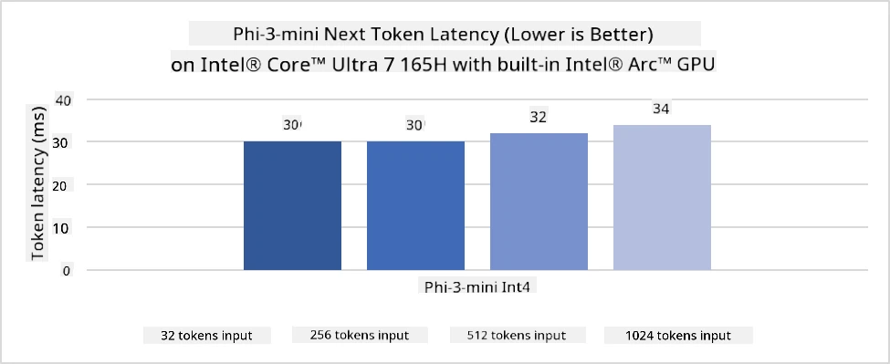
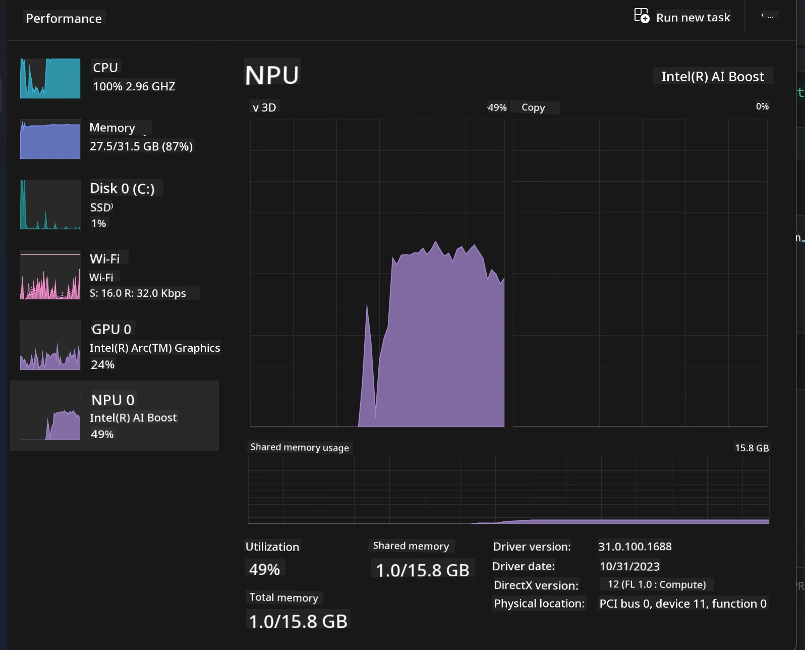
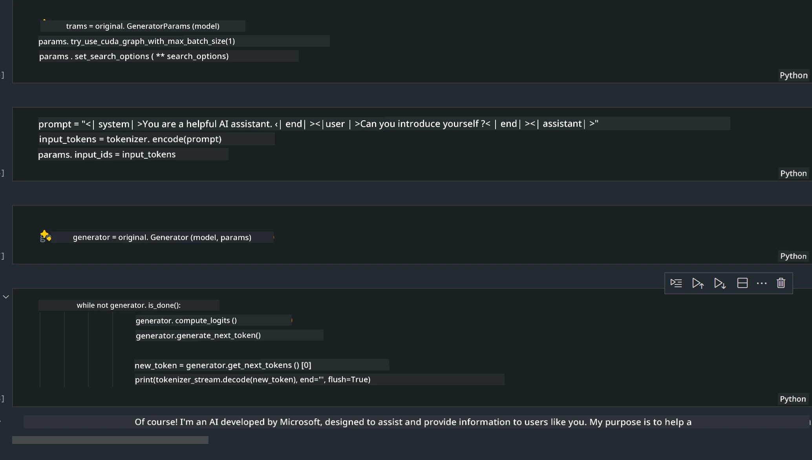
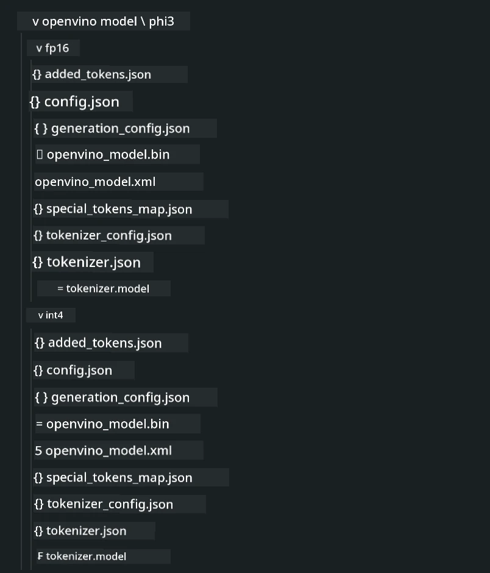
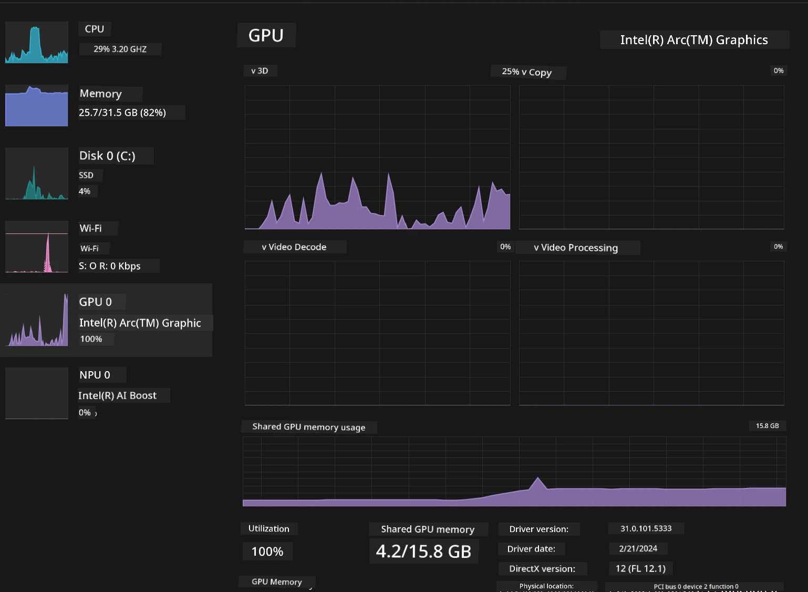

<!--
CO_OP_TRANSLATOR_METADATA:
{
  "original_hash": "e08ce816e23ad813244a09ca34ebb8ac",
  "translation_date": "2025-07-16T19:52:45+00:00",
  "source_file": "md/01.Introduction/03/AIPC_Inference.md",
  "language_code": "en"
}
-->
# **Inference Phi-3 on AI PC**

With the progress of generative AI and improvements in edge device hardware, more generative AI models can now be integrated into users' Bring Your Own Device (BYOD) setups. AI PCs are among these devices. Starting in 2024, Intel, AMD, and Qualcomm have partnered with PC manufacturers to launch AI PCs that enable local deployment of generative AI models through hardware enhancements. In this article, we will focus on Intel AI PCs and explain how to deploy Phi-3 on an Intel AI PC.

### What is an NPU

An NPU (Neural Processing Unit) is a specialized processor or processing unit within a larger SoC designed specifically to accelerate neural network operations and AI tasks. Unlike general-purpose CPUs and GPUs, NPUs are optimized for data-driven parallel computing, making them highly efficient at handling large multimedia data like videos and images, as well as neural network computations. They excel at AI-related tasks such as speech recognition, background blurring in video calls, and photo or video editing processes like object detection.

## NPU vs GPU

While many AI and machine learning tasks run on GPUs, there is an important difference between GPUs and NPUs.  
GPUs are known for their parallel computing power, but not all GPUs are equally efficient beyond graphics processing. NPUs, however, are purpose-built for the complex calculations involved in neural network operations, making them highly effective for AI workloads.

In short, NPUs are the math experts that supercharge AI computations, playing a key role in the new era of AI PCs!

***This example is based on Intel's latest Intel Core Ultra Processor***

## **1. Using NPU to run the Phi-3 model**

The Intel® NPU device is an AI inference accelerator integrated with Intel client CPUs, starting with the Intel® Core™ Ultra generation (formerly Meteor Lake). It enables energy-efficient execution of artificial neural network tasks.




**Intel NPU Acceleration Library**

The Intel NPU Acceleration Library [https://github.com/intel/intel-npu-acceleration-library](https://github.com/intel/intel-npu-acceleration-library) is a Python library designed to improve your application's efficiency by leveraging the Intel Neural Processing Unit (NPU) for high-speed computations on compatible hardware.

Example of Phi-3-mini running on an AI PC powered by Intel® Core™ Ultra processors.


Install the Python library using pip

```bash

   pip install intel-npu-acceleration-library

```

***Note*** The project is still under development, but the reference model is already quite complete.

### **Running Phi-3 with Intel NPU Acceleration Library**

Using Intel NPU acceleration, this library does not interfere with the traditional encoding process. You only need to use it to quantize the original Phi-3 model, for example to FP16, INT8, or INT4 formats, like this:

```python
from transformers import AutoTokenizer, pipeline,TextStreamer
from intel_npu_acceleration_library import NPUModelForCausalLM, int4
from intel_npu_acceleration_library.compiler import CompilerConfig
import warnings

model_id = "microsoft/Phi-3-mini-4k-instruct"

compiler_conf = CompilerConfig(dtype=int4)
model = NPUModelForCausalLM.from_pretrained(
    model_id, use_cache=True, config=compiler_conf, attn_implementation="sdpa"
).eval()

tokenizer = AutoTokenizer.from_pretrained(model_id)

text_streamer = TextStreamer(tokenizer, skip_prompt=True)
```

After successful quantization, proceed to call the NPU to run the Phi-3 model.

```python
generation_args = {
   "max_new_tokens": 1024,
   "return_full_text": False,
   "temperature": 0.3,
   "do_sample": False,
   "streamer": text_streamer,
}

pipe = pipeline(
   "text-generation",
   model=model,
   tokenizer=tokenizer,
)

query = "<|system|>You are a helpful AI assistant.<|end|><|user|>Can you introduce yourself?<|end|><|assistant|>"

with warnings.catch_warnings():
    warnings.simplefilter("ignore")
    pipe(query, **generation_args)
```

While running the code, you can monitor the NPU’s activity through Task Manager.



***Samples*** : [AIPC_NPU_DEMO.ipynb](../../../../../code/03.Inference/AIPC/AIPC_NPU_DEMO.ipynb)

## **2. Using DirectML + ONNX Runtime to run the Phi-3 Model**

### **What is DirectML**

[DirectML](https://github.com/microsoft/DirectML) is a high-performance, hardware-accelerated DirectX 12 library for machine learning. DirectML provides GPU acceleration for common machine learning tasks across a wide range of supported hardware and drivers, including all DirectX 12-capable GPUs from AMD, Intel, NVIDIA, and Qualcomm.

When used standalone, the DirectML API is a low-level DirectX 12 library suitable for high-performance, low-latency applications such as frameworks, games, and other real-time software. Its seamless integration with Direct3D 12, low overhead, and consistent performance across hardware make DirectML ideal for accelerating machine learning when both high performance and reliable, predictable results across devices are essential.

***Note*** : The latest DirectML already supports NPU (https://devblogs.microsoft.com/directx/introducing-neural-processor-unit-npu-support-in-directml-developer-preview/)

### DirectML vs CUDA in terms of capabilities and performance:

**DirectML** is a machine learning library developed by Microsoft, designed to accelerate machine learning workloads on Windows devices including desktops, laptops, and edge devices.  
- DX12-Based: Built on DirectX 12, it supports a wide range of GPUs from vendors like NVIDIA and AMD.  
- Broader Support: Works with any GPU that supports DX12, including integrated GPUs.  
- Image Processing: Processes images and other data using neural networks, suitable for tasks like image recognition and object detection.  
- Easy Setup: Simple to set up without requiring specific SDKs or libraries from GPU manufacturers.  
- Performance: Can perform well and sometimes faster than CUDA for certain workloads.  
- Limitations: May be slower in some cases, especially with large float16 batch sizes.

**CUDA** is NVIDIA’s parallel computing platform and programming model, allowing developers to harness NVIDIA GPUs for general-purpose computing including machine learning and scientific simulations.  
- NVIDIA-Specific: Designed specifically for NVIDIA GPUs.  
- Highly Optimized: Offers excellent performance for GPU-accelerated tasks on NVIDIA hardware.  
- Widely Used: Supported by many machine learning frameworks like TensorFlow and PyTorch.  
- Customizable: Developers can fine-tune CUDA settings for optimal performance.  
- Limitations: Limited to NVIDIA hardware, which restricts compatibility with other GPUs.

### Choosing Between DirectML and CUDA

The choice depends on your specific needs, hardware availability, and preferences.  
If you want broader compatibility and easier setup, DirectML is a good option. If you have NVIDIA GPUs and require highly optimized performance, CUDA remains a strong choice. Both have their pros and cons, so consider your requirements and hardware when deciding.

### **Generative AI with ONNX Runtime**

In the AI era, model portability is crucial. ONNX Runtime allows easy deployment of trained models across different devices. Developers don’t need to worry about the inference framework and can use a unified API for model inference. In generative AI, ONNX Runtime also offers code optimization (https://onnxruntime.ai/docs/genai/). With the optimized ONNX Runtime, quantized generative AI models can be inferred on various devices. You can use Python, C#, or C/C++ APIs for generative AI model inference. Deployment on iPhone can leverage C++ APIs of Generative AI with ONNX Runtime.

[Sample Code](https://github.com/Azure-Samples/Phi-3MiniSamples/tree/main/onnx)

***Compile generative AI with ONNX Runtime library***

```bash

winget install --id=Kitware.CMake  -e

git clone https://github.com/microsoft/onnxruntime.git

cd .\onnxruntime\

./build.bat --build_shared_lib --skip_tests --parallel --use_dml --config Release

cd ../

git clone https://github.com/microsoft/onnxruntime-genai.git

cd .\onnxruntime-genai\

mkdir ort

cd ort

mkdir include

mkdir lib

copy ..\onnxruntime\include\onnxruntime\core\providers\dml\dml_provider_factory.h ort\include

copy ..\onnxruntime\include\onnxruntime\core\session\onnxruntime_c_api.h ort\include

copy ..\onnxruntime\build\Windows\Release\Release\*.dll ort\lib

copy ..\onnxruntime\build\Windows\Release\Release\onnxruntime.lib ort\lib

python build.py --use_dml


```

**Install library**

```bash

pip install .\onnxruntime_genai_directml-0.3.0.dev0-cp310-cp310-win_amd64.whl

```

Here is the running result



***Samples*** : [AIPC_DirectML_DEMO.ipynb](../../../../../code/03.Inference/AIPC/AIPC_DirectML_DEMO.ipynb)

## **3. Using Intel OpenVINO to run the Phi-3 Model**

### **What is OpenVINO**

[OpenVINO](https://github.com/openvinotoolkit/openvino) is an open-source toolkit for optimizing and deploying deep learning models. It boosts deep learning performance for vision, audio, and language models from popular frameworks like TensorFlow and PyTorch. Get started with OpenVINO. OpenVINO can also be used with CPU and GPU to run the Phi-3 model.

***Note***: Currently, OpenVINO does not support NPU.

### **Install OpenVINO Library**

```bash

 pip install git+https://github.com/huggingface/optimum-intel.git

 pip install git+https://github.com/openvinotoolkit/nncf.git

 pip install openvino-nightly

```

### **Running Phi-3 with OpenVINO**

Like with NPU, OpenVINO runs generative AI models by executing quantized models. First, you need to quantize the Phi-3 model using optimum-cli on the command line.

**INT4**

```bash

optimum-cli export openvino --model "microsoft/Phi-3-mini-4k-instruct" --task text-generation-with-past --weight-format int4 --group-size 128 --ratio 0.6  --sym  --trust-remote-code ./openvinomodel/phi3/int4

```

**FP16**

```bash

optimum-cli export openvino --model "microsoft/Phi-3-mini-4k-instruct" --task text-generation-with-past --weight-format fp16 --trust-remote-code ./openvinomodel/phi3/fp16

```

The converted format looks like this:



Load the model paths (model_dir), related configurations (ov_config = {"PERFORMANCE_HINT": "LATENCY", "NUM_STREAMS": "1", "CACHE_DIR": ""}), and hardware-accelerated devices (GPU.0) through OVModelForCausalLM

```python

ov_model = OVModelForCausalLM.from_pretrained(
     model_dir,
     device='GPU.0',
     ov_config=ov_config,
     config=AutoConfig.from_pretrained(model_dir, trust_remote_code=True),
     trust_remote_code=True,
)

```

While running the code, you can monitor GPU activity through Task Manager.



***Samples*** : [AIPC_OpenVino_Demo.ipynb](../../../../../code/03.Inference/AIPC/AIPC_OpenVino_Demo.ipynb)

### ***Note*** : Each of the three methods above has its own advantages, but for AI PC inference, using NPU acceleration is recommended.

**Disclaimer**:  
This document has been translated using the AI translation service [Co-op Translator](https://github.com/Azure/co-op-translator). While we strive for accuracy, please be aware that automated translations may contain errors or inaccuracies. The original document in its native language should be considered the authoritative source. For critical information, professional human translation is recommended. We are not liable for any misunderstandings or misinterpretations arising from the use of this translation.