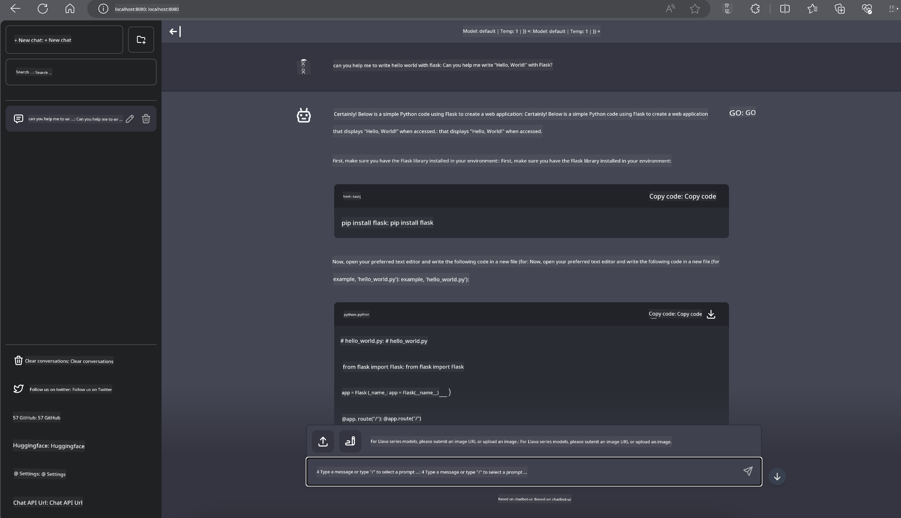

<!--
CO_OP_TRANSLATOR_METADATA:
{
  "original_hash": "be4101a30d98e95a71d42c276e8bcd37",
  "translation_date": "2025-07-16T20:38:31+00:00",
  "source_file": "md/01.Introduction/03/Jetson_Inference.md",
  "language_code": "en"
}
-->
# **Inference Phi-3 on Nvidia Jetson**

Nvidia Jetson is a series of embedded computing boards from Nvidia. The Jetson TK1, TX1, and TX2 models all feature a Tegra processor (or SoC) from Nvidia that integrates an ARM architecture central processing unit (CPU). Jetson is a low-power system designed to accelerate machine learning applications. Nvidia Jetson is used by professional developers to create groundbreaking AI products across various industries, as well as by students and enthusiasts for hands-on AI learning and creating amazing projects. SLM is deployed on edge devices like Jetson, enabling better implementation of industrial generative AI application scenarios.

## Deployment on NVIDIA Jetson:
Developers working on autonomous robotics and embedded devices can take advantage of Phi-3 Mini. Its relatively small size makes it ideal for edge deployment. Parameters have been carefully tuned during training to ensure high accuracy in responses.

### TensorRT-LLM Optimization:
NVIDIA's [TensorRT-LLM library](https://github.com/NVIDIA/TensorRT-LLM?WT.mc_id=aiml-138114-kinfeylo) optimizes large language model inference. It supports Phi-3 Mini's long context window, improving both throughput and latency. Optimizations include techniques such as LongRoPE, FP8, and inflight batching.

### Availability and Deployment:
Developers can explore Phi-3 Mini with the 128K context window at [NVIDIA's AI](https://www.nvidia.com/en-us/ai-data-science/generative-ai/). It is packaged as an NVIDIA NIM, a microservice with a standard API that can be deployed anywhere. Additionally, see the [TensorRT-LLM implementations on GitHub](https://github.com/NVIDIA/TensorRT-LLM).

## **1. Preparation**

a. Jetson Orin NX / Jetson NX

b. JetPack 5.1.2+

c. Cuda 11.8

d. Python 3.8+

## **2. Running Phi-3 on Jetson**

You can choose between [Ollama](https://ollama.com) or [LlamaEdge](https://llamaedge.com).

If you want to use gguf on both cloud and edge devices simultaneously, LlamaEdge can be understood as WasmEdge (WasmEdge is a lightweight, high-performance, scalable WebAssembly runtime suitable for cloud-native, edge, and decentralized applications. It supports serverless applications, embedded functions, microservices, smart contracts, and IoT devices). You can deploy gguf's quantized model to edge devices and the cloud through LlamaEdge.


Here are the steps to use it:

1. Install and download the related libraries and files

```bash

curl -sSf https://raw.githubusercontent.com/WasmEdge/WasmEdge/master/utils/install.sh | bash -s -- --plugin wasi_nn-ggml

curl -LO https://github.com/LlamaEdge/LlamaEdge/releases/latest/download/llama-api-server.wasm

curl -LO https://github.com/LlamaEdge/chatbot-ui/releases/latest/download/chatbot-ui.tar.gz

tar xzf chatbot-ui.tar.gz

```

**Note**: llama-api-server.wasm and chatbot-ui must be in the same directory

2. Run the scripts in the terminal

```bash

wasmedge --dir .:. --nn-preload default:GGML:AUTO:{Your gguf path} llama-api-server.wasm -p phi-3-chat

```

Here is the running result



***Sample code*** [Phi-3 mini WASM Notebook Sample](https://github.com/Azure-Samples/Phi-3MiniSamples/tree/main/wasm)

In summary, Phi-3 Mini represents a significant advancement in language modeling, combining efficiency, context awareness, and NVIDIA's optimization expertise. Whether you're building robots or edge applications, Phi-3 Mini is a powerful tool to keep in mind.

**Disclaimer**:  
This document has been translated using the AI translation service [Co-op Translator](https://github.com/Azure/co-op-translator). While we strive for accuracy, please be aware that automated translations may contain errors or inaccuracies. The original document in its native language should be considered the authoritative source. For critical information, professional human translation is recommended. We are not liable for any misunderstandings or misinterpretations arising from the use of this translation.