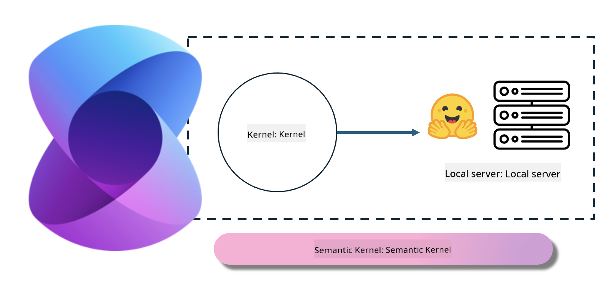
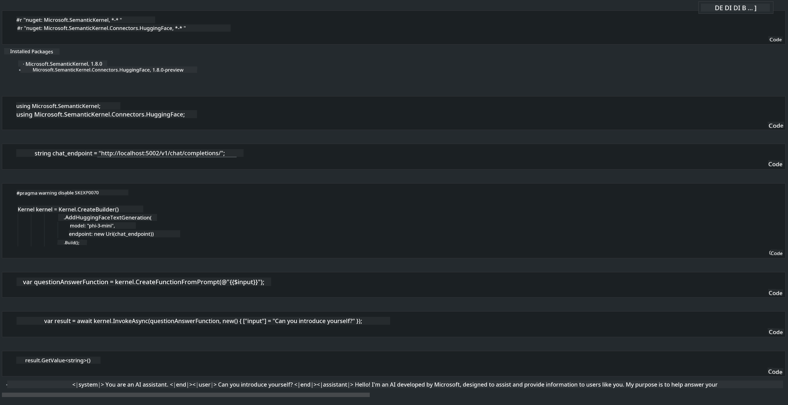

<!--
CO_OP_TRANSLATOR_METADATA:
{
  "original_hash": "bcf5dd7031db0031abdb9dd0c05ba118",
  "translation_date": "2025-07-16T20:54:40+00:00",
  "source_file": "md/01.Introduction/03/Local_Server_Inference.md",
  "language_code": "en"
}
-->
# **Inference Phi-3 on a Local Server**

We can deploy Phi-3 on a local server. Users can choose solutions like [Ollama](https://ollama.com) or [LM Studio](https://llamaedge.com), or they can write their own code. You can connect Phi-3's local services through [Semantic Kernel](https://github.com/microsoft/semantic-kernel?WT.mc_id=aiml-138114-kinfeylo) or [Langchain](https://www.langchain.com/) to build Copilot applications.

## **Using Semantic Kernel to access Phi-3-mini**

In Copilot applications, we create apps through Semantic Kernel / LangChain. This type of application framework is generally compatible with Azure OpenAI Service / OpenAI models, and can also support open-source models on Hugging Face and local models. What should we do if we want to use Semantic Kernel to access Phi-3-mini? Using .NET as an example, we can combine it with the Hugging Face Connector in Semantic Kernel. By default, it corresponds to the model ID on Hugging Face (the first time you use it, the model will be downloaded from Hugging Face, which takes some time). You can also connect to the locally built service. Between the two, we recommend using the latter because it offers greater autonomy, especially for enterprise applications.

As shown in the figure, accessing local services through Semantic Kernel can easily connect to a self-built Phi-3-mini model server. Here is the running result:

***Sample Code*** https://github.com/kinfey/Phi3MiniSamples/tree/main/semantickernel

**Disclaimer**:  
This document has been translated using the AI translation service [Co-op Translator](https://github.com/Azure/co-op-translator). While we strive for accuracy, please be aware that automated translations may contain errors or inaccuracies. The original document in its native language should be considered the authoritative source. For critical information, professional human translation is recommended. We are not liable for any misunderstandings or misinterpretations arising from the use of this translation.