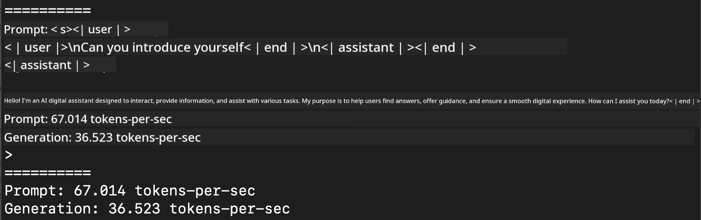
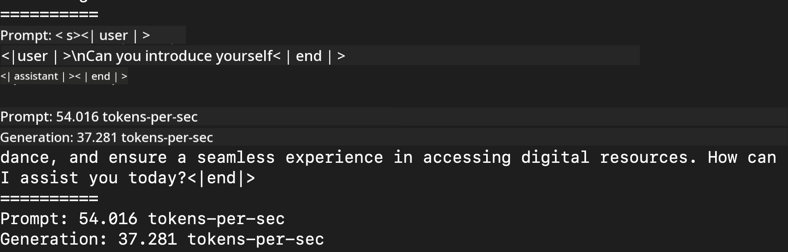
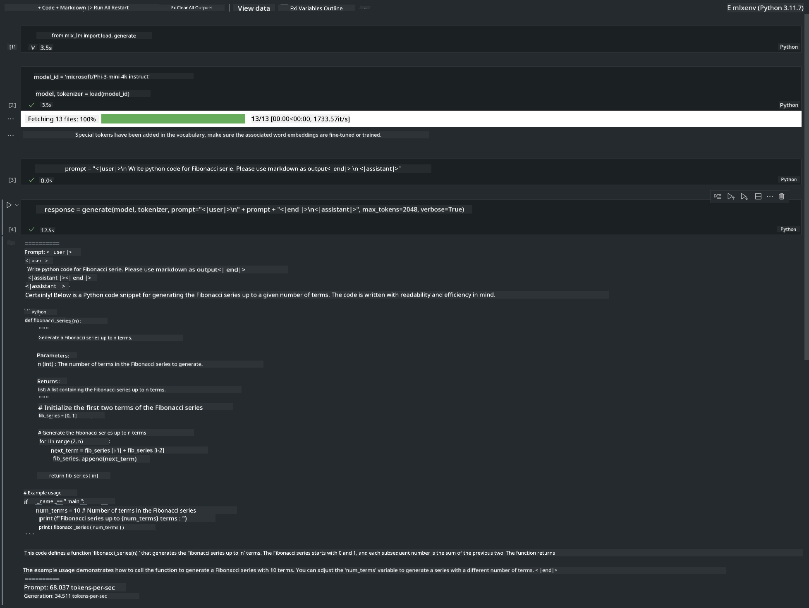

<!--
CO_OP_TRANSLATOR_METADATA:
{
  "original_hash": "dcb656f3d206fc4968e236deec5d4384",
  "translation_date": "2025-07-16T21:00:00+00:00",
  "source_file": "md/01.Introduction/03/MLX_Inference.md",
  "language_code": "en"
}
-->
# **Inference Phi-3 with Apple MLX Framework**

## **What is MLX Framework**

MLX is an array framework for machine learning research on Apple silicon, developed by Apple machine learning researchers.

MLX is created by machine learning researchers for machine learning researchers. The framework aims to be user-friendly while still efficient for training and deploying models. Its design is also conceptually straightforward. Our goal is to make it easy for researchers to extend and improve MLX, enabling rapid exploration of new ideas.

LLMs can be accelerated on Apple Silicon devices using MLX, allowing models to run locally with great convenience.

## **Using MLX to infer Phi-3-mini**

### **1. Set up your MLX environment**

1. Python 3.11.x  
2. Install MLX Library


```bash

pip install mlx-lm

```

### **2. Running Phi-3-mini in Terminal with MLX**


```bash

python -m mlx_lm.generate --model microsoft/Phi-3-mini-4k-instruct --max-token 2048 --prompt  "<|user|>\nCan you introduce yourself<|end|>\n<|assistant|>"

```

The result (my environment is Apple M1 Max, 64GB) is



### **3. Quantizing Phi-3-mini with MLX in Terminal**


```bash

python -m mlx_lm.convert --hf-path microsoft/Phi-3-mini-4k-instruct

```

***Note:*** The model can be quantized using mlx_lm.convert, and the default quantization is INT4. This example quantizes Phi-3-mini to INT4.

The model can be quantized using mlx_lm.convert, with INT4 as the default quantization. This example shows how to quantize Phi-3-mini to INT4. After quantization, the model will be saved in the default directory ./mlx_model.

We can test the quantized model with MLX directly from the terminal.


```bash

python -m mlx_lm.generate --model ./mlx_model/ --max-token 2048 --prompt  "<|user|>\nCan you introduce yourself<|end|>\n<|assistant|>"

```

The result is




### **4. Running Phi-3-mini with MLX in Jupyter Notebook**




***Note:*** Please check out this sample [click this link](../../../../../code/03.Inference/MLX/MLX_DEMO.ipynb)


## **Resources**

1. Learn about Apple MLX Framework [https://ml-explore.github.io](https://ml-explore.github.io/mlx/build/html/index.html)

2. Apple MLX GitHub Repo [https://github.com/ml-explore](https://github.com/ml-explore)

**Disclaimer**:  
This document has been translated using the AI translation service [Co-op Translator](https://github.com/Azure/co-op-translator). While we strive for accuracy, please be aware that automated translations may contain errors or inaccuracies. The original document in its native language should be considered the authoritative source. For critical information, professional human translation is recommended. We are not liable for any misunderstandings or misinterpretations arising from the use of this translation.