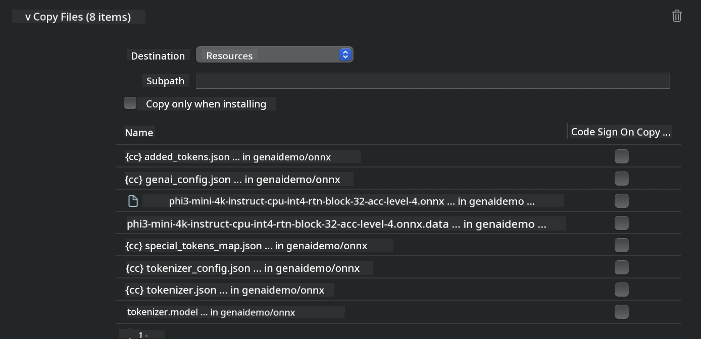
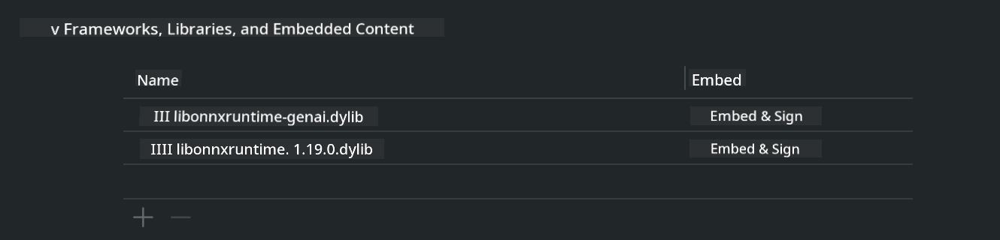
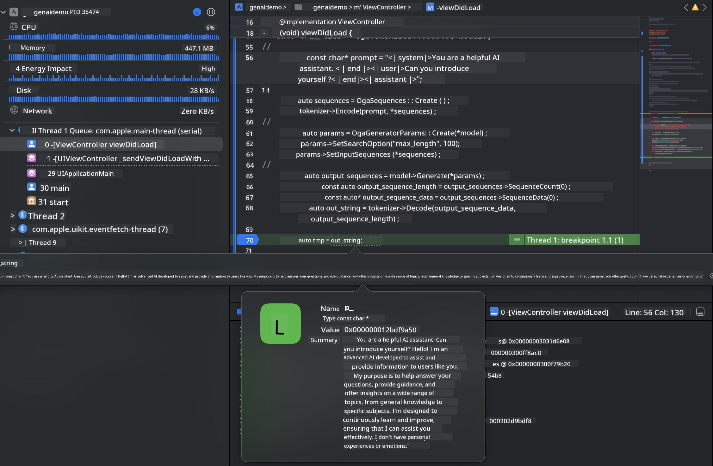

<!--
CO_OP_TRANSLATOR_METADATA:
{
  "original_hash": "82af197df38d25346a98f1f0e84d1698",
  "translation_date": "2025-07-16T20:17:05+00:00",
  "source_file": "md/01.Introduction/03/iOS_Inference.md",
  "language_code": "en"
}
-->
# **Inference Phi-3 on iOS**

Phi-3-mini is a new series of models from Microsoft that enables deploying Large Language Models (LLMs) on edge and IoT devices. Phi-3-mini supports iOS, Android, and Edge Device deployments, allowing generative AI to be used in BYOD environments. The following example shows how to deploy Phi-3-mini on iOS.

## **1. Preparation**

- **a.** macOS 14+
- **b.** Xcode 15+
- **c.** iOS SDK 17.x (iPhone 14 A16 or newer)
- **d.** Install Python 3.10+ (Conda recommended)
- **e.** Install the Python library: `python-flatbuffers`
- **f.** Install CMake

### Semantic Kernel and Inference

Semantic Kernel is an application framework that lets you build apps compatible with Azure OpenAI Service, OpenAI models, and even local models. Using Semantic Kernel to access local services makes it easy to integrate with your self-hosted Phi-3-mini model server.

### Calling Quantized Models with Ollama or LlamaEdge

Many users prefer quantized models to run models locally. [Ollama](https://ollama.com) and [LlamaEdge](https://llamaedge.com) allow you to call various quantized models:

#### **Ollama**

You can run `ollama run phi3` directly or configure it offline. Create a Modelfile pointing to your `gguf` file. Sample code for running the Phi-3-mini quantized model:

```gguf
FROM {Add your gguf file path}
TEMPLATE \"\"\"<|user|> .Prompt<|end|> <|assistant|>\"\"\"
PARAMETER stop <|end|>
PARAMETER num_ctx 4096
```

#### **LlamaEdge**

If you want to use `gguf` models on both cloud and edge devices simultaneously, LlamaEdge is a great choice.

## **2. Compiling ONNX Runtime for iOS**

```bash

git clone https://github.com/microsoft/onnxruntime.git

cd onnxruntime

./build.sh --build_shared_lib --ios --skip_tests --parallel --build_dir ./build_ios --ios --apple_sysroot iphoneos --osx_arch arm64 --apple_deploy_target 17.5 --cmake_generator Xcode --config Release

cd ../

```

### **Notice**

- **a.** Before compiling, make sure Xcode is properly set up and set as the active developer directory in the terminal:

    ```bash
    sudo xcode-select -switch /Applications/Xcode.app/Contents/Developer
    ```

- **b.** ONNX Runtime must be compiled for different platforms. For iOS, you can compile for `arm64` or `x86_64`.

- **c.** It’s recommended to use the latest iOS SDK for compilation, but you can also use an older version if you need compatibility with previous SDKs.

## **3. Compiling Generative AI with ONNX Runtime for iOS**

> **Note:** Since Generative AI with ONNX Runtime is in preview, expect possible changes.

```bash

git clone https://github.com/microsoft/onnxruntime-genai
 
cd onnxruntime-genai
 
mkdir ort
 
cd ort
 
mkdir include
 
mkdir lib
 
cd ../
 
cp ../onnxruntime/include/onnxruntime/core/session/onnxruntime_c_api.h ort/include
 
cp ../onnxruntime/build_ios/Release/Release-iphoneos/libonnxruntime*.dylib* ort/lib
 
export OPENCV_SKIP_XCODEBUILD_FORCE_TRYCOMPILE_DEBUG=1
 
python3 build.py --parallel --build_dir ./build_ios --ios --ios_sysroot iphoneos --ios_arch arm64 --ios_deployment_target 17.5 --cmake_generator Xcode --cmake_extra_defines CMAKE_XCODE_ATTRIBUTE_CODE_SIGNING_ALLOWED=NO

```

## **4. Create an App in Xcode**

I chose Objective-C for app development because using Generative AI with the ONNX Runtime C++ API works better with Objective-C. Of course, you can also handle related calls through Swift bridging.


## **5. Copy the ONNX quantized INT4 model to the App project**

We need to import the INT4 quantized ONNX model, which must be downloaded first.


After downloading, add it to the Resources folder of your Xcode project.



## **6. Adding the C++ API in ViewControllers**

> **Notice:**

- **a.** Add the corresponding C++ header files to the project.

  

- **b.** Include the `onnxruntime-genai` dynamic library in Xcode.

  

- **c.** Use the C sample code for testing. You can also add extra features like ChatUI for more functionality.

- **d.** Since you need to use C++ in your project, rename `ViewController.m` to `ViewController.mm` to enable Objective-C++ support.

```objc

    NSString *llmPath = [[NSBundle mainBundle] resourcePath];
    char const *modelPath = llmPath.cString;

    auto model =  OgaModel::Create(modelPath);

    auto tokenizer = OgaTokenizer::Create(*model);

    const char* prompt = "<|system|>You are a helpful AI assistant.<|end|><|user|>Can you introduce yourself?<|end|><|assistant|>";

    auto sequences = OgaSequences::Create();
    tokenizer->Encode(prompt, *sequences);

    auto params = OgaGeneratorParams::Create(*model);
    params->SetSearchOption("max_length", 100);
    params->SetInputSequences(*sequences);

    auto output_sequences = model->Generate(*params);
    const auto output_sequence_length = output_sequences->SequenceCount(0);
    const auto* output_sequence_data = output_sequences->SequenceData(0);
    auto out_string = tokenizer->Decode(output_sequence_data, output_sequence_length);
    
    auto tmp = out_string;

```

## **7. Running the Application**

Once everything is set up, you can run the app to see the results of the Phi-3-mini model inference.



For more sample code and detailed instructions, visit the [Phi-3 Mini Samples repository](https://github.com/Azure-Samples/Phi-3MiniSamples/tree/main/ios).

**Disclaimer**:  
This document has been translated using the AI translation service [Co-op Translator](https://github.com/Azure/co-op-translator). While we strive for accuracy, please be aware that automated translations may contain errors or inaccuracies. The original document in its native language should be considered the authoritative source. For critical information, professional human translation is recommended. We are not liable for any misunderstandings or misinterpretations arising from the use of this translation.